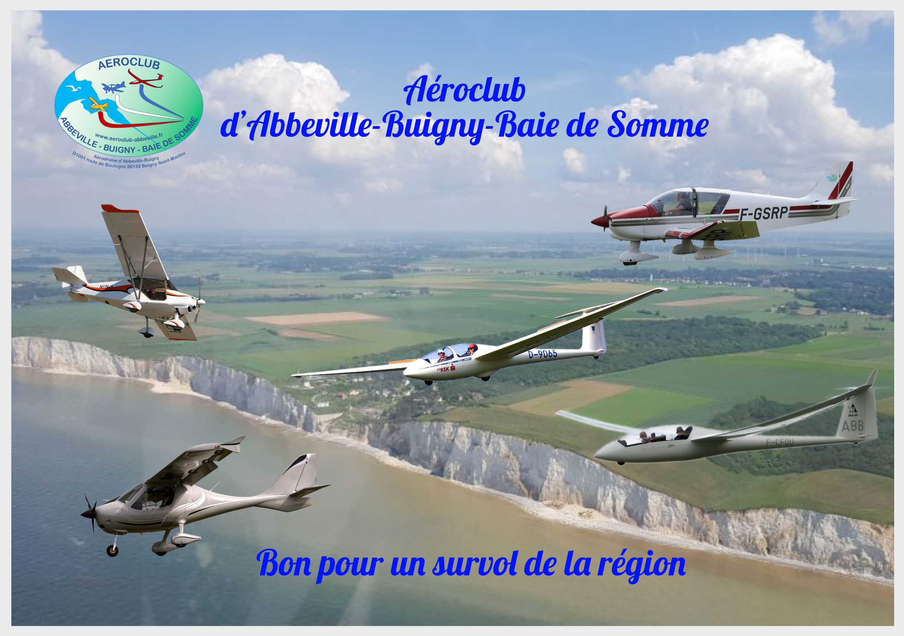

# Guide: Writing Links and Images in Markdown for GVV

This guide explains how to write links and image references in markdown strings for the GVV project, using real files and paths from the project.

## Understanding GVV URL Structure

In GVV, the base URL is configured in `application/config/config.php`:
```php
$config['base_url'] = 'http://gvv.net';
```

When writing markdown links, you need to consider how URLs will be resolved relative to this base URL.

## 1. Local Images

### User Photos (uploads/photos/)
```markdown


```

### Configuration Images (uploads/configuration/)
```markdown

```

### Static Assets (assets/images/)
```markdown



```

### UI Icons (assets/css/images/)
```markdown

```

## 2. Local Files and Documents

### Documentation
```markdown
[Fichier README](./README.md)
[Guide de test](./doc/plans/test_plan.md)
[Plan d'implémentation](./doc/plans/2025_aircraft_booking_implementation_plan.md)
```

### Configuration Files
```markdown
[Configuration exemple](./application/config/config.example.php)
[Configuration club](./application/config/club.example.php)
```

### Scripts
```markdown
[Tests](./run-all-tests.sh)
[Migration](./run_migrations.php)
```

## 3. Application Pages

### Direct PHP Pages
```markdown
[Page d'accueil](./index.php)
[Informations système](./info.php)
```

### CodeIgniter Routes (via index.php)
```markdown
[Gestion des vols planeurs](./index.php/vols_planeur)
[Calendrier](./index.php/calendar)
[Membres](./index.php/membre)
[Facturation](./index.php/facturation)
```

## 4. Path Resolution Examples

### Relative to Project Root (Recommended)
All examples above use `./` prefix, which makes links relative to the project root where the web server serves files.

### Absolute Paths (Alternative)
```markdown

[Documentation](/README.md)
```

### Without Leading Dot
```markdown

[Documentation](README.md)
```

## 5. Complete Real-World Example

Here's a complete example using real files from the GVV project:

```markdown
# Messages du jour

## Bienvenue sur le site du club ✈️

Consultez notre [documentation](./README.md) pour plus d'informations.

### Photos des derniers vols


### Liens utiles
- [Calendrier des vols](./index.php/calendar)
- [Gestion des membres](./index.php/membre)
- [Voir les vols planeurs](./index.php/vols_planeur)

### Documentation technique
- [Plan de test](./doc/plans/test_plan.md)
- [Configuration exemple](./application/config/config.example.php)

 *Bons vols !*
```

## 6. Best Practices

### ✅ Recommended
- Use `./` prefix for clarity
- Use descriptive alt text for images
- Add title attributes for tooltips
- Test links in a browser after deployment

### ❌ Avoid
- Absolute file system paths (`/home/user/...`)
- Missing alt text for images
- Broken relative paths
- Links to non-existent files

## 7. Testing Your Links

To test if your markdown links work correctly:

1. **Image Links**: Check that images display in the calendar view
2. **File Links**: Verify that clicking downloads or displays the file
3. **Page Links**: Ensure navigation works within the application

## 8. Security Considerations

- All linked files must be in web-accessible directories
- Avoid linking to configuration files with sensitive data
- Use the `uploads/` directory for user-uploaded content
- Use the `assets/` directory for static assets

## 9. Debugging Link Issues

If links don't work:
1. Check the web server document root
2. Verify file permissions
3. Check `.htaccess` rules
4. Inspect browser developer tools for 404 errors
5. Ensure the base URL is correctly configured

This guide uses real files and paths from the GVV project to ensure the examples are accurate and functional.