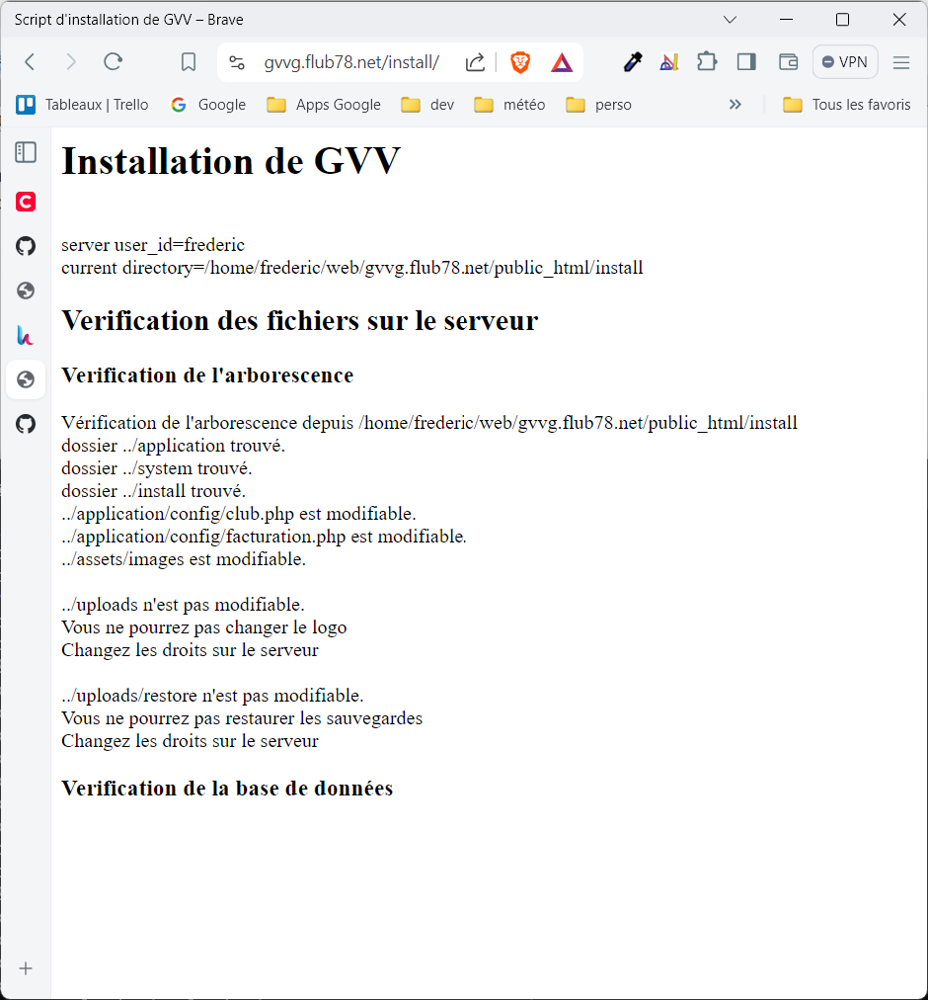

# GVV

GVV, (Gestion Vol à voile) est une application WEB de gestion de club de planeur. On peut le considérer comme une alternative au GiVAV, il a été démarré à peu près au même moment.

Il a été développé depuis 2011 par Philippe Boissel et Frédéric Peignot sur une idée de Philippe Boissel.

Depuis il est utilisé par au moins cinq ou six associations. Il est difficile d'en tenir le compte exact, puis qu'il s'agit d'un logiciel libre et que certaines associations peuvent l'avoir déployée sans avoir informé les développeurs.

Depuis l'origine GVV était hébergé chez developpez.com, néanmoins depuis quelques semaines (au printemps 2024) le projet n'est plus accessible sur leur site et ils ne répondent plus aux emails. Leur serveur svn semble toujours actif, mais par précaution mieux vaut migrer le projet vers github.

Puisqu'il n'est plus possible d'accéder au projet j'ai également perdu la documentation en ligne qui était gérée sur leur wiki. C'est une bonne leçon, ce n'était pas malin de gérer la documentation sur un système externe sans contrôle sur sa durée de vie et sans moyen de sauvegarde simple. Sous github la documentation sera gérée dans le système de gestion de code lui même en langage de balise markdown, ce qui permet de garder la documentation en ligne sans effort particulier. Notez que je n'ai pas l'intention de régénérer l’ensemble de la documentation, uniquement le minimum nécessaire pour l'installation et les mises à jour (cette page).

## Fonctionnalités

GLobalement GVV permet:

* La gestion des membres de l'association
* La gestion du parc planeur et remorqueur
* La saisie des vols, manuelle ou automatique
* La facturation
* Une comptabilité simple à double entrée mais sans gestion de la TVA ni des fiches de paye. La comptabilité permet de sortir les comptes de résultats et le bilan.
* Un calendrier des intensions de vol
* l'envoie d'emails aux utilisateurs
* La gestion des terrains et du plan comptable
* Multi langue: Français, Anglais et Néerlandais.
  

Le logiciel supporte

* l’authentification des membres, la gestion de leur rôle et des autorisation associées.
* Un mécanisme de récupération de mot de passe.
* l'activation et la désactivation des membres et des machines afin de ne pas surcharger l'interface utilisateur.
* La sauvegarde et la restauration de la base de données
* La consultation sur PC, tablette ou téléphone, il est "responsive"

## État du développement

Après treize années d'existence GVV est très stable.

Il a été développé en PHP 5.x avec CodeIgniter en version 1.x et MySql en version 4.x. Au fil des années il a été adapté à CodeIgniter version 2 et PHP 7.4 ainsi que MySql en version 5.x.

Il est probablement assez compliqué de porter GVV sur CodeIgniter version 4 et PHP version 8. De nombreuses incompatibilités ont été identifiées, dont beaucoup dans des modules tiers qui ne sont plus maintenus.

Il n'est donc plus question de faire évoluer GVV à part pour de la maintenance correctrice. Son successeur est déjà en cours de développent, il sera basé sur des technologies modernes (Laravel 10, PHP 8, Bootstrap et React) avec une interface REST entre le client et le serveur. Il devrait corriger les plus gros défauts de GVV et proposer une expérience utilisateur encore plus agréable.

### Les défauts de GVV

* GVV n'est pas multi organisation, chaque club doit en déployer une instance. L'avantage est que cela permet une indépendance absolue des données mais au prix d'une complexité certaine.

* La facturation est configurée avec un module PHP. Les trésoriers des associations de vol en planeur ont une imagination sans limite quand il s'agit d'inventer des méthodes de facturation. Sur les six ou sept clubs qui emploient GVV, il n'y en a pas deux qui facturent de la même façon.

Pour prendre en compte cette diversité, j'ai considéré que la façon la plus simple est que chaque club fournisse son module de facturation en PHP. L'avantage est que cela permet de satisfaire les désirs les plus fous des trésoriers et cela permet d'éviter un système de configuration qui peux rapidement devenir complexe. Le module de facturation est relativement simple. Il est possible de s'inspirer des modules existants, néanmoins le développement
d'un module PHP même simple reste un exercise hors d'atteinte pour tous les clubs qui ne disposent pas d'un informaticien. La prochaine version aura un système de configuration de la facturation.

* La couverture de tests est toujours insuffisante. Pendant toute la durée du projet j'ai couru derrière les tests, m'approchant sans jamais l'atteindre d'un taux de couverture acceptable. (Je considère acceptable un taux de couverture qui permette d'intervenir dans le logiciel tout en gardant un bon niveau de confiance qu'aucune regression n'a été introduite.)

Les raisons en sont multiples, les version initiales de CodeIgniter n'étaient pas intégrés avec phpunit, elles utilisait un système de test qui était propre à CodeIgniter et difficile à intégrer dans les systèmes d'intégration continue (jenkins). De plus les contrôleurs ne pouvaient pas être testé avec le système de test. Certains développeur ont bien tenté de palier à ces limitations mais comme il s'agissait de modules externes, ils n'ont pas suivi les évolutions de CodeIgniter.

Lest tests sont donc constitués de tests unitaires de bas niveau qui avaient été complété par un ensemble de test de bout en bout (Watir = Ruby + Selenium). Ces tests ont été rendus obsoletes lorsque l'interface graphique a changé et ils ont été partiellement remplacé par des tests de bout en bout avec Laravel et Dusk.

## Installation

La machine utilisée lors de la rédaction de cette documentation est une machine virtuelle Oracle free tier sur laquelle est installé Ubuntu 22.04 et Hestia Control Panel. https://hestiacp.com/docs/introduction/getting-started.html.

C'est un environment entièrement gratuit, à vie, sans publicité et sans limite d'utilisation. Il est donc possible de l'utiliser pour tester et déployer GVV.

### Prérequis

* une machine avec PHP 7.4 et MySql 5.x (linux ou windows, linux recommandé)
* un serveur web (Apache ou Nginx)

### Étapes d'installation

1. Configurer le serveur WEB, Apache ou Nginx, voir https://www.digitalocean.com/community/tutorials/how-to-install-linux-apache-mysql-php-lamp-stack-on-ubuntu-18-04. 

Installez une page WEB de test pour vérifier que le serveur web est bien configuré et accessible sur votre domaine.

Installez les certificats SSL.

Installez MySql et créez une base de données.

Notez que pour les utilisateurs de Hestia Control Panel, il est possible de réaliser ces étapes directement depuis l'interface web.

2. Téléchargez GVV à partir de https://github.com/flub78/gvv.

Connectez vous à votre serveur avec SSH et allez dans le répertoire web. Dans mon cas ~/web/gvvg.flub78.net.

Donnez les droits d'écriture sur le répertoire.

git clone https://github.com/flub78/gvv.git

Renommez le répertoire gvv en public_html

Vérifiez l'accès https://gvvg.flub78.net/install/

## Mise à jour

## En cas de problème

