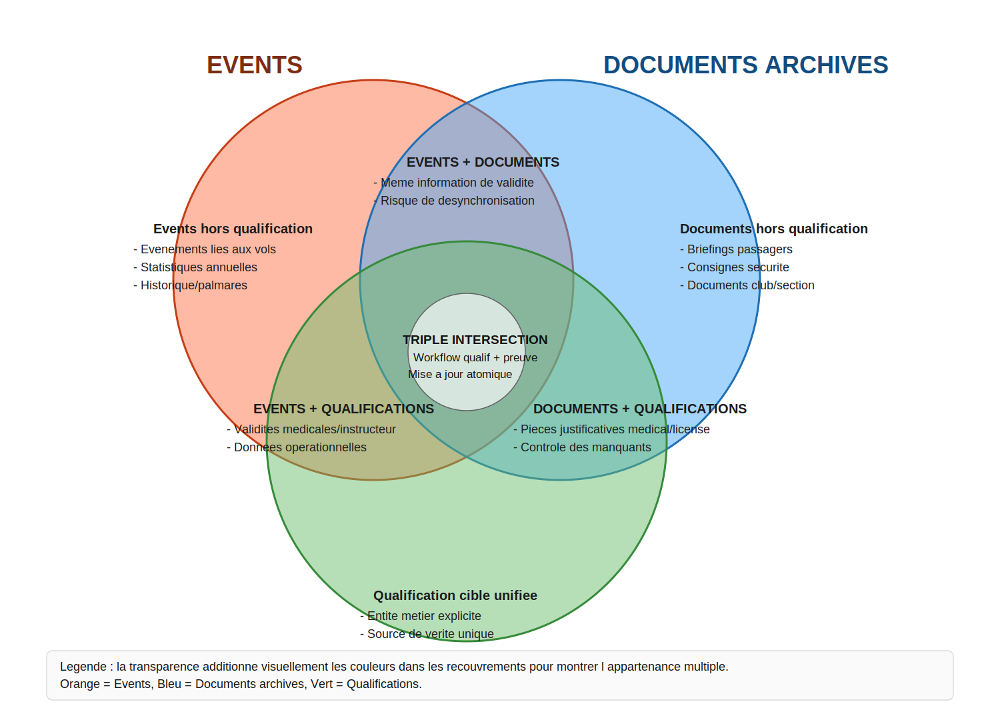

# Analyse : Gestion des Droits, Rôles et Qualifications dans GVV

**Date :** 2026-06-12  
**Mis à jour :** 2026-06-12 (post-refactoring mniveaux)  
**Statut :** Analyse — mise à jour suite à la suppression de `mniveaux`/`macces`

---

## 1. Contexte

GVV gère deux catégories de concepts souvent confondus :

- **Les droits d'accès** : ce qu'un utilisateur est autorisé à voir ou modifier dans l'application.
- **Les qualifications** : les habilitations aéronautiques ou associatives d'un membre (brevet de pilote, qualification instructeur, visite médicale…).

Ces deux catégories se croisent : une qualification conditionne souvent un droit (seul un instructeur peut saisir une séance de formation), mais elles ont des natures différentes — les droits d'accès sont des décisions administratives attribuées par l'association, les qualifications sont des faits techniques avec des dates de validité.

Le refactoring `mniveaux` (migration 128) a supprimé les colonnes `mniveaux` et `macces` de la table `membres`, consolidé `Formation_access` sur `user_roles_per_section`, et retiré `qualif_selector()`. L'analyse ci-dessous reflète cet état post-refactoring.

---

## 2. État des lieux : les mécanismes actifs

### 2.1 `user_roles_per_section` — Système d'autorisation par section

**Emplacement :** tables `user_roles_per_section` et `types_roles`  
**Bibliothèque :** `application/libraries/Gvv_Authorization.php`

Ce système associe explicitement un utilisateur à un rôle dans une section donnée. Les rôles définis dans `types_roles` :

| ID | Nom | Portée |
|----|-----|--------|
| 1 | user | Connexion, consultation personnelle |
| 2 | auto_planchiste | CRUD sur ses propres données |
| 5 | planchiste | CRUD données de vol |
| 6 | ca | Consultation complète (finances globales) |
| 7 | bureau | Consultation complète (finances personnelles) |
| 8 | tresorier | Modification données financières (une section) |
| 9 | super-tresorier | Modification données financières (toutes sections) |
| 10 | club-admin | Accès complet |
| 11 | instructeur | Gestion formations |
| 12 | mecano | Mécanicien |
| 17 | pilote_rem | Pilote remorqueur |

**Usages actifs :**
- `inst_selector()` et `pilrem_selector()` dans `membres_model` interrogent `user_roles_per_section` pour construire les listes d'instructeurs et de remorqueurs.
- `Formation_access::is_instructeur()` utilise exclusivement `user_roles_per_section`.
- `Gvv_Controller::require_roles()` / `allow_roles()` pour la protection des contrôleurs migrés.
- `welcome.php` affiche des éléments de dashboard conditionnellement selon `has_role('instructeur')`.

**État de la migration :** le flag `use_new_auth` est supprimé — tous les contrôleurs passent par `Gvv_Authorization`. Il subsiste 4-5 appels `dx_auth->is_role()` / `is_admin()` isolés à migrer vers `user_has_role()` (`archived_documents.php`, `formation_types_seances.php`, `login_as.php`, `vols_avion.php`). Les nombreux appels `dx_auth->get_username()` et `dx_auth->is_logged_in()` sont des usages d'identification de session, non des résidus d'autorisation.

**Caractéristiques :**
- Non hiérarchique : chaque rôle est indépendant.
- Sensible à la section : un utilisateur peut être instructeur dans la section planeur et simple user dans la section ULM.
- Tracé (champs `granted_at`, `revoked_at`, `granted_by`).
- Ne contient pas de qualifications techniques avec dates de validité.

---

### 2.2 La table `events` — Qualifications datées et licences

**Emplacement :** tables `events` et `events_types`

La table `events` a été conçue initialement pour enregistrer des faits marquants du carnet de vol (gain de 1000 m, circuit de 300 km). Elle a été progressivement étendue pour stocker des qualifications et licences avec des dates de validité :

| Champ | Rôle |
|-------|------|
| `emlogin` | Pilote concerné |
| `etype` | Type d'événement (FK → `events_types`) |
| `edate` | Date de l'événement / obtention |
| `date_expiration` | Date d'expiration (si `events_types.expirable = 1`) |
| `ecomment` | Numéro de licence ou commentaire libre |

Types d'événements utilisés pour les qualifications :
- Visite médicale (identifié par `config('medical_id')`)
- BPP (Brevet Pilote Planeur)
- SPL, PPL
- Qualification instructeur
- Contrôle de compétence, Emport passager

**Usages actifs :**
- `event_model::medical_validity_date()` — retourne la date d'expiration de la dernière visite médicale valide.
- `event_model::inst_validity()` — retourne la date d'expiration de la qualification instructeur.
- `alarmes.php` utilise ces deux méthodes pour les alertes médicales et instructeur.
- `forms_public.php` extrait numéros de licence et dates pour remplir des formulaires PDF.

**Caractéristiques :**
- Chaque pilote n'a qu'un enregistrement par type d'événement (logique `replace` : supprime et recrée).
- Conçu pour les vols de référence, étendu par la contrainte pour stocker des licences.
- Pas de stockage de fichiers (pas de PDF attaché).
- Overlap potentiel avec `archived_documents`.

---

### 2.3 La table `archived_documents` — Gestion documentaire avec validité

**Emplacement :** tables `archived_documents` et `document_types`  
**Modèle :** `application/models/archived_documents_model.php`  
**Migrations :** 067+

Système plus récent (2026) conçu spécifiquement pour stocker des fichiers PDF associés à des entités (pilote, section, club), avec gestion des dates de validité, versionnage et alertes :

| Statut | Condition |
|--------|-----------|
| `active` | valid_until > aujourd'hui + alert_days |
| `expiring_soon` | valid_until dans la fenêtre d'alerte |
| `expired` | valid_until < aujourd'hui |
| `missing` | document requis absent |
| `pending` | en attente de validation |
| `rejected` | refusé |

`document_types` configure les alertes (`alert_days_before`), le caractère obligatoire (`required`), la portée (`scope` : pilot / section / club).

**Caractéristiques :**
- Stocke les fichiers physiques (PDF).
- Versionnage.
- Validation administrative (approbation/rejet).
- Peut désactiver une alarme unitairement (`alarm_disabled`).
- Conçu comme couche documentaire générique — intégré à la plateforme documentaire (`gestion_documentaire.md`).

---

### 2.4 Le système d'alarmes — Deux familles non unifiées

Deux systèmes d'alarme coexistent (cf. `gestion_alarmes_design.md`) :

1. **Alarmes à date fixe** (`archived_documents_model`) : statuts calculés depuis `valid_until`.
2. **Alarmes calculées** (`alarmes.php`) : expérience récente (atterrissages, heures), visite médicale, qualification instructeur, emport passager — calculées à la volée depuis le carnet de vol et `events`.

Un design d'`AlarmAggregator` est documenté mais pas encore implémenté.

---

## 3. Problèmes et incohérences restants


### 3.1 Résidus `dx_auth->is_role()` dans quelques contrôleurs

Le flag `use_new_auth` est supprimé et la migration vers `Gvv_Authorization` est essentiellement achevée. Il reste 4-5 appels `dx_auth->is_role()` / `is_admin()` à remplacer par `user_has_role()` :

- `archived_documents.php` — `dx_auth->is_role('ca', true, true)`
- `formation_types_seances.php` — `dx_auth->is_admin()`
- `login_as.php` — `dx_auth->is_admin()`
- `vols_avion.php` — `dx_auth->is_admin()`

Ces appels sont isolés et sans impact sur le comportement global, mais introduisent une dépendance résiduelle à `dx_auth` pour le contrôle d'accès.

### 3.2 Séparation events / archived_documents pour les licences

Du point de vue d'un administrateur, **une licence est une entité unique** : un pilote a un PPL avec un numéro, une date d'obtention, une date de validité, et éventuellement une copie PDF. Le système actuel impose deux interactions sur deux pages distinctes :
- Modifier la date de validité → passer par `events`.
- Déposer ou mettre à jour le PDF → passer par `archived_documents`.

Cette séparation est un artefact d'implémentation, source de confusion et de risque de désynchronisation (date dans `events` ≠ date sur le PDF archivé).

### 3.3 Pas de support multi-sections pour les qualifications

Les qualifications dans `events` sont globales (pas de dimension section). Un IVV de la section planeur est aussi visible comme IVV de la section ULM. `user_roles_per_section` résout cela pour les rôles d'accès, mais les qualifications techniques (visite médicale, BPP) n'ont pas de dimension section dans `events`.

---

## 4. Architecture cible

### 4.1 Deux axes de séparation

```
Axe 1 : Droits d'accès à l'application
  → Géré par user_roles_per_section + Gvv_Authorization
  → Non hiérarchique, par section, tracé

Axe 2 : Qualifications et licences (entités métier avec dates de validité)
  → La qualification est l'entité principale ; le PDF est un attribut optionnel
  → Géré par archived_documents (types qualification) avec migration progressive depuis events
  → Alarmes unifiées via AlarmAggregator

Axe 3 : Documents administratifs (entités dont le document est la chose principale)
  → Attestations d'assurance, manuels d'exploitation, briefings, autorisations parentales
  → Géré par archived_documents
  → Pas de qualification aéronautique dans cette table
```

### 4.2 Droits d'accès : `user_roles_per_section` seul

`user_roles_per_section` est le système cible. Il couvre la dimension section, la traçabilité et des rôles extensibles. La migration `dx_auth` → `Gvv_Authorization` doit être achevée pour les contrôleurs restants.

### 4.3 Qualifications : option 3 retenue (`archived_documents` étendu)

La stratégie retenue est d'utiliser `archived_documents` comme support principal des qualifications, via des types documentaires dédiés "qualification", en conservant une migration progressive depuis `events`.

#### 4.3.1 Modèle cible

- Les types de documents reçoivent un indicateur métier `is_qualification` (au niveau `document_types`).
- Les enregistrements de qualification ajoutent `qualification_number` (numéro de licence/qualification) dans `archived_documents`.
- Pour les types `is_qualification=1`, la pièce jointe devient facultative (cas auto-déclaré ou saisie administrative sans scan immédiat).

Conséquence schéma : la nullabilité de `original_filename` seule est insuffisante ; `file_path` doit également être nullable pour permettre une qualification sans fichier.

#### 4.3.2 Règles métier

- Une qualification est toujours rattachée à un pilote (`scope='pilot'`).
- Les statuts existants (`pending`, `approved`, `rejected`) et les dates (`valid_from`, `valid_until`) restent la base du cycle de vie.
- Le numéro de qualification est porté par `qualification_number`, pas par `description`.
- La présence d'un fichier n'est plus obligatoire pour les qualifications, mais reste obligatoire pour les autres types selon les règles de type.

#### 4.3.3 Migration fonctionnelle depuis `events`

La création et la mise à jour des qualifications aujourd'hui faites dans `event` doivent être reprises dans le flux qualification documentaire :

- création/édition via `event/create` + `event/formValidation`,
- logique d'unicité/courant via `event_model::replace`,
- lectures métier via `medical_validity_date`, `inst_validity`, `bpp_date`, `controle_date`, `passager_date`.

Le plan de transition est progressif :

1. Introduire les nouveaux champs et la validation conditionnelle fichier.
2. Créer une façade `QualificationService` qui lit prioritairement `archived_documents` (types qualification), avec fallback `events`.
3. Migrer les écrans/contrôles métier vers la façade.
4. Migrer les données historiques `events` vers `archived_documents` pour les types ciblés.
5. Retirer progressivement l'usage qualification de `events`.

### 4.4 Alarmes : un seul point d'entrée

L'`AlarmAggregator` (conçu dans `gestion_alarmes_design.md`) est la façade unique :
- `DocumentAlarmProvider` adapte `archived_documents_model`.
- `ComputedAlarmProvider` adapte les calculs de `alarmes.php` et les validités de `events`.

### 4.5 Sélecteurs : `user_roles_per_section` seul

Tous les sélecteurs de pilotes qualifiés (instructeurs, remorqueurs, mécaniciens, treuilleurs) sont construits depuis `user_roles_per_section`. Le filtre e-mail de `program.php` doit rejoindre ce modèle.

### 4.6 Options non retenues (et pourquoi)

- **Option 1 — Nouvelle table `qualifications` dédiée** : non retenue à ce stade, car elle duplique une grande partie des capacités déjà présentes (`archived_documents` : versioning, validation, alertes, historisation) et augmente le coût de maintenance.
- **Option 2 — Couche abstraite sur `events` + `archived_documents` sans convergence de stockage** : utile comme étape transitoire, mais non retenue comme cible finale car elle maintient deux sources actives de données qualification et un risque durable de désynchronisation.
- **Option 4 — Étendre `events` pour gérer des fichiers** : non retenue, car cela revient à reconstruire dans `events` des fonctionnalités déjà matures de `archived_documents` (upload, versioning, validation, preview, gestion documentaire).

---

## 5. Prochaines étapes

### Étape 1 — Unifier le concept de qualification (priorité 2)

Commence après la stabilisation des droits d'accès.

1. Définir le périmètre métier de "qualification" (ce qui relève de la qualification vs document administratif).
2. Introduire une façade fonctionnelle unique (contrôleur + service) pour éviter les créations concurrentes.
3. Implémenter le stockage canonique retenu (option 3) dans `archived_documents` avec compatibilité transitoire `events`.
4. Appliquer la règle de source de vérité unique pour la date de validité.
5. Aligner les alarmes via `AlarmAggregator`.

---

## 6. Décisions restantes à prendre

| Décision | Options | Recommandation |
|----------|---------|----------------|
| Stockage principal des qualifications et de leur justificatif | `events`, `archived_documents`, modèle hybride | Option 3 : `archived_documents` étendu (`is_qualification`, `qualification_number`, fichier facultatif pour qualification) avec migration progressive depuis `events` |
| Périmètre du rôle `instructeur` par section | Global (null), Par section, Les deux | Par section pour IVV/ITP, global pour FI/FE avion |
| Alarmes : quand implémenter AlarmAggregator ? | Maintenant, Après migration auth, Séparément | Après étape 2 — dépend de données stables |

---

## 7. Références

- `doc/design_notes/2011_authorization_system.md` — Architecture DX_Auth legacy
- `doc/authorization/routes_and_permissions.md` — Référence routes et permissions
- `doc/plans/2025_authorization_refactoring_plan.md` — Plan de migration en cours
- `doc/design_notes/gestion_alarmes_design.md` — Architecture AlarmAggregator
- `doc/design_notes/gestion_documentaire.md` — Plateforme documentaire (archived_documents)
- `application/libraries/Gvv_Authorization.php` — Nouveau système d'autorisation
- `application/libraries/Formation_access.php` — Gestion accès formation
- `application/models/membres_model.php` — Sélecteurs de pilotes qualifiés
- `application/models/event_model.php` — Validités médicale et instructeur
- `application/migrations/128_drop_mniveaux_macces.php` — Migration de suppression des colonnes

---

## 8. Annexe — Analyse fonctionnelle Events / Documents archivés / Qualifications

### 8.1 Groupes demandés

#### Groupe A — Ce qui existe dans `events` et ne sert pas (ou pas directement) à la gestion des qualifications

Fonctionnalités existantes :
- Historique d'événements liés aux vols (`evpid`, `evaid`, `events_types.en_vol`) pour rattacher un fait à un vol avion/planeur.
- Événements de type performance/palmarès (origine historique du module), utilisés dans des vues statistiques annuelles.
- Fonctions de reporting global (`getStats`, `formation`) qui mélangent plusieurs usages de la table et ne sont pas centrées qualification. Ces fonctions sont utilisées pour l'affichage de statistiques sur le dashboard et dans les exports CSV.

Utilité dans un contexte qualification :
- Faible à moyenne (utile pour traçabilité historique), mais ces usages ne constituent pas le coeur de la qualification réglementaire.

#### Groupe B — Ce qui existe dans `events` et sert à la gestion des qualifications

Fonctionnalités existantes :
- Stockage des attributs métier d'une qualification : type (`etype`), date d'obtention (`edate`), date d'expiration (`date_expiration`), numéro/commentaire (`ecomment`).
- Gestion des validités utilisées opérationnellement :
  - `medical_validity_date()` pour la visite médicale, utilisée uniquement à l'affichage sur la page legacy alarmes.
  - `inst_validity()` pour la qualification instructeur (ITP/ITV),  utilisée uniquement à l'affichage sur la page legacy alarmes.
- Alimentation des formulaires pré-remplis (numéro, échéance, signature d'événement via `signature_path` ajouté en migration 125).
- Édition simple d'un état courant par type via logique `replace` (un enregistrement courant par pilote/type). C'est un peu le mécanisme des versions de documents en utilisant la dernière version.

Utilité dans un contexte qualification :
- Forte : `events` porte aujourd'hui la source métier effective des dates de validité et de certains contrôles opérationnels.

#### Groupe C — Ce qui existe dans `archived_documents` et ne sert pas (ou pas directement) à la gestion des qualifications

Fonctionnalités existantes :
- Archivage générique de documents administratifs de portée pilote/section/club (`scope`).
- Cas d'usage non qualification : briefings passagers, consignes de sécurité, documents club, attestations diverses.

Utilité dans un contexte qualification :
- Faible à moyenne : ces fonctions restent pertinentes pour la gouvernance documentaire, mais pas pour le calcul métier des qualifications.

#### Groupe D — Ce qui existe dans `archived_documents` et peut servir à la gestion des qualifications

Fonctionnalités existantes :
- Types documentaires pilote pertinents pour qualification/preuve (`medical`, `license`, éventuellement `insurance`).
- Gestion d'échéance documentaire (`valid_until`, `alert_days_before`) avec statuts (`active`, `expiring_soon`, `expired`, `missing`).
- Contrôle de présence des pièces requises (`get_missing_documents`) pour un pilote.
- Workflows de validation documentaire (`pending`, `approved`, `rejected`) et motif de rejet. Note: si un pilote apporte la preuve d'une qualification ou d'un renouvellement on peut concevoir que cela doive être validé par un administrateur.
- Versionnage et historique documentaire (chaînage `previous_version_id`, `is_current_version`).

Utilité dans un contexte qualification :
- Moyenne à forte, mais surtout comme couche de preuve/justificatif et de complétude.

### 8.2 Diagramme des ensembles et intersections



Le diagramme utilise trois couleurs de fond semi-transparentes (events, documents archives, qualifications). Les intersections affichent des couleurs additionnees pour representer l'appartenance a plusieurs ensembles.

### 8.3 Lecture synthétique

- Aujourd'hui, `events` couvre mieux la logique métier de qualification (dates, type, validité opérationnelle).
- `archived_documents` couvre mieux la preuve, la conformité documentaire et le cycle de vie du fichier.
- Le besoin principal n'est pas de supprimer l'un des deux ensembles, mais de fiabiliser leur intersection avec un flux unique côté utilisateur.
- Fonctionnellement, la cible la plus robuste est :
  - qualification portée par une entité métier claire,
  - justificatif documentaire lié explicitement,
  - contrôle de cohérence et alarmes unifiées.

### 8.4 Conclusion

`events` et `archived_documents` partagent un noyau commun de fonctionnalités utilisables pour la gestion des qualifications :

- **Stockage des attributs métier** : date d'obtention, date de validité, numéro ou description.
- **Contrôle des échéances** : détection de l'expiration et de l'expiration proche.
- **Gestion de version** : mécanisme de remplacement de l'enregistrement courant (`events`) ou chaînage historique explicite (`archived_documents`).

`events` alimente également le pré-remplissage des formulaires pilotes, mais ce mécanisme s'appuie sur la couche d'abstraction de gestion des qualifications ; c'est un détail d'implémentation, pas une fonctionnalité propre au module.

La différence structurante est l'attachement de fichiers : `archived_documents` est le seul module qui supporte le stockage de pièces jointes (photocopies, documents électroniques). C'est sa valeur ajoutée distinctive dans le contexte qualification.
