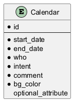

# Future Calendar schema

L'objectif est de définir un schéma de table qui soit compatible avec un calendrier Google. Il doit permettre de
stocker les événements indifféremment dans la base ou dans le calendrier Google

L'utilisation de Google Calendar pour stocker le calendrier de GVV est une des plus mauvaise idée que j'ai jamais eu.

* Le besoin pour accéder au calendrier directement n'était pas avéré.
* C'est relativement complexe et long de mettre en place le calendrier Google et d'obtenir les autorisations.
* Il faut un compte Google pour chaque domaine.
  

<!---
@startuml

@startuml
entity Calendar {
  * id
  --
  * start_date
  * end_date
  * who
  * intent
  * comment
  * bg_color
  optional_attribute
}
@enduml

-->

