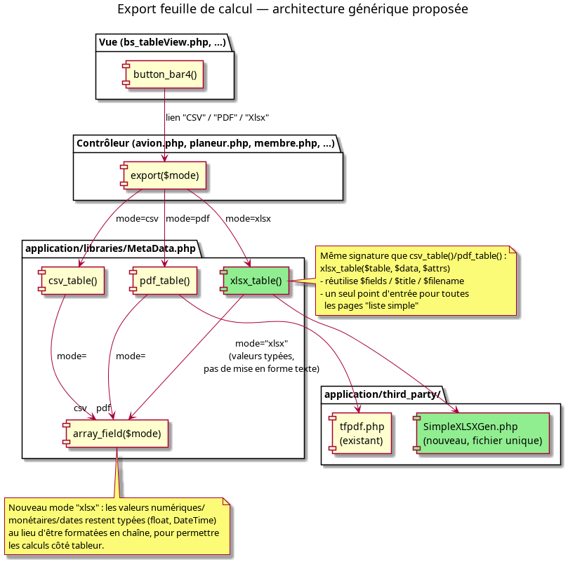

# Design Notes — Exports feuille de calcul (remplacement des exports "Excel")

Date : 18 septembre 2026

## Contexte et objectif

Les pages de liste GVV proposent aujourd'hui deux formats d'export : un bouton **« Excel »** qui génère en réalité un fichier **CSV** (texte, séparateur `;`, aucune mise en forme), et un bouton **« Pdf »** qui produit une mise en page imprimable mais non exploitable par un tableur.

Objectif : offrir un vrai export **feuille de calcul (.xlsx)** afin que l'opérateur puisse effectuer des calculs sur les données extraites tout en conservant une présentation aussi soignée que le PDF (titres, en-têtes, types de cellules corrects). Cela implique aussi de corriger l'étiquetage trompeur des boutons existants (« Excel » → « CSV »).

Ce document couvre : l'inventaire de l'existant, l'architecture technique proposée pour l'export xlsx, et les priorités. Le détail des étapes d'implémentation est dans [exports_feuille_de_calcul_plan.md](../plans/exports_feuille_de_calcul_plan.md).

---

## 1. Inventaire — pages avec export CSV+PDF (39 pages)

Toutes utilisent aujourd'hui le mécanisme `button_bar4()` avec deux entrées `'label' => "Excel"` / `'label' => "Pdf"` pointant vers `$controller/export/csv` et `$controller/export/pdf` (ou une variante nommée : `export_csv`/`export_pdf`, `export_annuel_csv`/`pdf`, `bilan_csv`/`bilan_pdf`, etc.).

| Module | Page/vue | Nature |
|---|---|---|
| Associations OF | `associations_of/bs_tableView.php` | Liste simple |
| Avion | `avion/bs_tableView.php` | Liste simple |
| Comptes | `comptes/bs_tableView.php` | Liste simple |
| Configuration | `configuration/bs_tableView.php` | Liste simple |
| Types événements | `events_types/bs_tableView.php` | Liste simple |
| Formulaires (réponses) | `forms_admin/bs_submissions.php` | Liste simple |
| Membres | `membre/bs_tableView.php` | Liste simple |
| Membres — licences | `membre/licences.php` | Liste simple |
| Plan comptable | `plan_comptable/bs_tableView.php` | Liste simple |
| Planeur | `planeur/bs_tableView.php` | Liste simple |
| Sections | `sections/bs_tableView.php` | Liste simple |
| Terrains | `terrains/bs_tableView.php` | Liste simple |
| Tickets | `tickets/bs_tableView.php` | Liste simple |
| Types ticket | `types_ticket/bs_tableView.php` | Liste simple |
| Vols avion | `vols_avion/bs_tableView.php` | Liste simple |
| Vols découverte | `vols_decouverte/bs_tableView.php` | Liste simple |
| Vols planeur | `vols_planeur/bs_tableView.php` | Liste simple |
| Carnets de route | `carnets_route/bs_page.php` | Liste simple |
| Relances | `relances/bs_relancesView.php` | Liste simple |
| Achats | `achats/bs_TablePerYear.php` | Rapport structuré (pivot par année) |
| Licences | `licences/bs_TablePerYear.php` | Rapport structuré (pivot par année) |
| Comptabilité | `compta/bs_journalCompteView.php`, `compta/bs_journalView.php` | Rapport structuré (journal) |
| Comptes | `comptes/bs_balanceView.php` (balance) | Rapport structuré |
| Comptes | `comptes/bs_bilanView.php` (bilan) | Rapport structuré hiérarchique |
| Comptes | `comptes/bs_cloture.php` | Rapport structuré |
| Comptes | `comptes/bs_dashboardView.php` | Rapport structuré (tableau de bord) |
| Comptes | `comptes/bs_resultatAvecDepreciationView.php` | Rapport structuré |
| Comptes | `comptes/bs_resultat_par_sections_detailView.php`, `bs_resultat_par_sectionsView.php` | Rapport structuré (pivot sections) |
| Comptes | `comptes/bs_resultatView.php` | Rapport structuré |
| Comptes | `comptes/bs_tresorerie.php` | Rapport structuré |
| Comptes | `comptes/resultatCategorie.php` | Rapport structuré (pivot catégorie) |
| Événements | `event/bs_formationView.php` | Rapport structuré (stats formation) |
| Rapports | `rapports/bs_dgac.php` | Rapport structuré (DGAC) |
| Rapprochements | `rapprochements/bs_tableRapprochements.php` | Rapport structuré |
| Tickets | `tickets/bs_soldes_pilote.php` | Rapport structuré (soldes agrégés) |
| Vols avion | `vols_avion/bs_statistic.php` | Rapport structuré (stats) |
| Vols planeur | `vols_planeur/bs_cumuls.php`, `bs_par_pilote.php`, `bs_statistic.php` | Rapport structuré (pivots, multi-onglets) |
| Formation rapports | `formation_rapports/annuel.php` | Rapport structuré (annuel) |

## 2. Inventaire — exports incomplets ou cassés (3 pages)

| Module | Page/vue | Problème |
|---|---|---|
| Paiements en ligne | `paiements_en_ligne/bs_liste.php` | CSV seul (`liste_csv`), **pas de PDF** |
| Formation rapports | `formation_rapports/conformite.php` | CSV seul (`export_conformite_csv`), **pas de PDF**, export par type et non de la table entière |
| Migration autorisations | `authorization/migration/comparison_log.php` | Bouton « Exporter CSV » présent mais **non implémenté** (`onclick="alert('non implémenté')"`) ; pas de PDF |

`authorization/migration/statistics.php` présente le même problème (boutons non implémentés) mais est un tableau de bord/graphique, pas une liste — exclu de la section 3.

⚠️ Le bouton cassé de `comparison_log.php`/`statistics.php` est un bug indépendant du présent chantier (étiquette trompeuse, action qui ne fait rien) : à signaler séparément, pas à traiter comme un export feuille de calcul.

## 3. Inventaire — pages de liste sans aucun export (62 pages)

Listes simples issues du rendu générique `$this->gvvmetadata->table()`, sans aucun bouton d'export :

`achats/bs_tableView.php`, `associations_ecriture/bs_tableView.php`, `associations_releve/bs_tableView.php`, `attachments/bs_tableView.php`, `categorie/bs_tableView.php`, `dates_gel/bs_tableView.php`, `document_types/bs_tableView.php`, `event/bs_statsView.php`, `event/bs_tableView.php`, `historique/bs_tableView.php`, `licences/bs_tableView.php`, `meteo/bs_tableView.php`, `motd/bs_tableView.php`, `pompes/bs_tableView.php`, `produits/bs_tableView.php`, `reports/bs_tableView.php`, `tarifs/bs_tableView.php`, `user_roles_per_section/bs_tableView.php`.

Listes sur table native CodeIgniter (`$this->table->generate()`), sans export :

`backend/bs_roles.php`, `backend/bs_users.php`, `backend/unactivated_users.php`.

Autres listes identifiées (rendu HTML manuel), sans export :

| Module | Page/vue | Colonnes | Remarque |
|---|---|---|---|
| Acceptance admin | `acceptance_admin/bs_itemsListView.php` | 9 | |
| Acceptance admin | `acceptance_admin/bs_trackingView.php` | 7 | drill-down par item |
| Acceptance | `acceptance/bs_historyView.php` | 4 | vue perso |
| Acceptance | `acceptance/bs_myDocumentsView.php` | 4 | vue perso |
| Rapport adhérents | `adherents_report/bs_page.php` | — | rapport structuré (pivot âge×section) |
| Admin | `admin/bs_connected_users.php` | 5 | données live/éphémères — faible intérêt export |
| Admin | `admin/bs_logs.php` | 4 | déjà téléchargeable en fichier brut |
| Documents archivés | `archived_documents/bs_documentsListView.php` | 9 | |
| Documents archivés | `archived_documents/bs_expired.php` | 2×5 | |
| Documents archivés | `archived_documents/bs_my_documents.php` | 3 sous-listes | |
| Documents archivés | `archived_documents/bs_pending.php` | 7 | |
| Autorisations | `authorization/bs_audit_log.php` | 8 | paginé |
| Autorisations | `authorization/bs_data_access_rules.php` | 5 | par rôle |
| Autorisations | `authorization/bs_new_auth_users.php` | 6 | |
| Autorisations | `authorization/bs_role_members.php` | 2-3 | faible volume |
| Autorisations | `authorization/bs_roles.php` | 5 | |
| Autorisations | `authorization/bs_user_roles.php` | 6 | |
| Listes email | `email_lists/index.php` | 6 | |
| Formation | `formation_autorisations_solo/index.php` | 6 | |
| Formation | `formation_inscriptions/index.php` | 6 | |
| Formation | `formation_progressions/index.php` | 5 | export PDF par ligne existe déjà |
| Formation | `formation_rapports/index.php` | — | rapport structuré (accordéons multi-tableaux) |
| Formation | `formation_seances/index.php` | 11 | |
| Formation | `formation_seances/libres.php` | 8 | |
| Formation | `formation_seances_theoriques/index.php` | 9 | |
| Formation | `formation_types_seances/index.php` | 6 | |
| Formulaires admin | `forms_admin/bs_index.php` | 6 | |
| Formulaires admin | `forms_admin/bs_pages.php` | 4 | drill-down par formulaire |
| Maintenance | `maintenance_bulletins/index.php` | 4 | |
| Maintenance | `maintenance_dossiers/index.php` | 5 | |
| Maintenance | `maintenance_equipements/index.php` | 5 | |
| Maintenance | `maintenance_operations/index.php` | 5 | |
| Maintenance | `maintenance_programmes/index.php` | 7 | |
| Maintenance | `maintenance_synthese/index.php` | 3 | tableau de bord, PDF par avion existe déjà |
| Maintenance | `maintenance_synthese/tableau.php` | — | rapport structuré (pivot avion×programme) |
| Membre | `membre/mes_autorisations.php` | 3 | vue perso |
| Réservations | `mes_reservations/index.php` | 5 | vue perso |
| Procédures | `procedures/bs_tableView.php` | 7 | |
| Programmes formation | `programmes/index.php` | 8 | export par ligne existe déjà |
| Rappels résa | `reservation_reminder_log/index.php` | 8 | |
| Raccourcis | `shortcuts_admin/bs_index.php` | 7 | |
| Vols découverte | `vols_decouverte_looks/bs_index.php` | 3 | liste de configuration |

## 4. Pages exclues de l'analyse

Écartées car ce ne sont pas des listes exportables (formulaire, détail d'un seul enregistrement, modale, tableau de bord agrégé, étape d'assistant) : environ 45 vues à balise `<table>` brute, dont notamment `authorization/bs_dashboard.php`, `authorization/migration/overview.php`, `authorization/migration/statistics.php`, `cartes_membre/bs_lot.php`, `gestion_roles/bs_index.php`, `maintenance_synthese/aeronef.php` (fiche d'un seul aéronef).

---

## Architecture technique proposée

### Point d'ancrage existant

Le mécanisme d'export CSV/PDF n'est pas dupliqué page par page : il passe par deux méthodes génériques dans `application/libraries/MetaData.php` :

- `csv_table($table, $data, $attrs)` — construit une ligne CSV par ligne de données via `array_field($table, $field, $value, $row, "csv")`, puis `force_download()`.
- `pdf_table($table, $data, $pdf, $attrs)` — même principe avec `array_field(..., "pdf")` et la librairie `Pdf` (wrapper de `tfpdf.php`, vendorée dans `application/third_party/`).

Les ~39 pages de la section 1 appellent déjà l'une ou l'autre (directement, ou via une variante spécialisée pour les rapports structurés). C'est le point d'extension naturel pour un export feuille de calcul générique.

### Proposition

1. **Nouvelle méthode générique `xlsx_table($table, $data, $attrs)`** dans `MetaData.php`, même signature que `csv_table()`/`pdf_table()` (réutilise `fields`, `title`, `filename`).
2. **Nouveau mode `"xlsx"` dans `array_field()`** : contrairement au mode `"csv"` qui formate tout en texte, le mode `xlsx` doit renvoyer des **valeurs typées** (float pour montants/décimaux, date native pour les champs date, booléen natif) plutôt que des chaînes formatées — c'est ce qui permet à l'opérateur de calculer directement dans le tableur, l'objectif énoncé de ce chantier.
3. **Librairie d'écriture xlsx** : le projet n'utilise pas Composer (cf. AI_INSTRUCTIONS.md) et vendorise ses dépendances manuellement, fichier par fichier (`tfpdf.php`, `fpdf.php`). Il faut donc une librairie d'écriture **sans dépendances, à fichier unique**, du même esprit que `tfpdf.php`. Deux candidates connues à évaluer avant de trancher (licence, maintenance, taille) :
   - un writer minimaliste mono-fichier (type *SimpleXLSXGen* ou *PHP_XLSXWriter*) — écriture seule, pas de lecture, léger, s'intègre comme `tfpdf.php` aujourd'hui ;
   - PhpSpreadsheet — beaucoup plus complet mais pensé pour Composer/PSR-4 (dizaines de fichiers), lourd à vendoriser à la main et surdimensionné pour un besoin d'écriture pure.
   → Recommandation : partir sur un writer mono-fichier, cohérent avec les conventions du projet. À confirmer/valider au moment de l'implémentation (vérifier licence compatible et absence de dépendance à des extensions PHP non disponibles en prod).
4. **Bouton dans `button_bar4()`** : ajouter une troisième entrée `'label' => "Xlsx"` (ou réutiliser l'icône tableur) à côté de « CSV » et « Pdf », pointant vers `$controller/export/xlsx`.
5. **Contrôleurs** : chaque méthode `export($mode)` existante gagne une branche `elseif ($mode === 'xlsx') { return $this->gvvmetadata->xlsx_table(...); }`, à l'identique du bloc CSV actuel.
6. **Renommage des boutons** : le libellé `"Excel"` est codé en dur (pas de clé de langue) dans 45 occurrences à travers ~38 vues — simple remplacement textuel `"Excel"` → `"CSV"`, sans impact fonctionnel puisque l'URL cible reste `.../export/csv`.

### Cas particuliers à respecter

- `paiements_en_ligne.php` est explicitement exempté de `gvvmetadata`/`input_field`/`array_field`/`table()` (cf. AI_INSTRUCTIONS.md, point 3). Un futur export xlsx sur `paiements_en_ligne/bs_liste.php` devra appeler directement la librairie d'écriture xlsx, sans passer par `xlsx_table()`/`array_field()`.
- Les **rapports structurés** (bilan, résultats, balance, journal, trésorerie, DGAC, statistiques de vol, pivots) ne passent pas par `csv_table()`/`pdf_table()` aujourd'hui : ils construisent leur CSV/PDF à la main (ex. `comptes::bilan_csv()`, ~150 lignes de composition manuelle avec libellés, sous-totaux, mise en gras). Un export xlsx de ces pages ne peut pas être un simple appel à `xlsx_table()` — il doit réutiliser la même librairie d'écriture mais avec un code de mise en page dédié par rapport (feuille(s), styles, fusions de cellules). C'est un chantier plus coûteux, à traiter en seconde phase (voir plan).

---

## Priorités

**Décision de cadrage (2026-09-18)** : les rapports comptables/financiers structurés (bilan, résultat, balance, journal, trésorerie) sont la véritable justification du chantier — ce sont eux qu'il faut soigner en premier, quitte à ce que ce soit la partie la plus coûteuse. À l'inverse, le fait que 62 listes simples n'aient jamais reçu d'export CSV/PDF en douze ans d'existence du projet indique que le besoin y est faible ; les y ajouter n'est plus une priorité de ce chantier.

### 3.a — Vues où développer l'export feuille de calcul en priorité

1. **Les rapports comptables/financiers structurés** (bilan, résultat, résultat avec dépréciation, résultat par sections, balance, journal, trésorerie) : priorité maximale. C'est l'usage qui motive tout le chantier ("réaliser des calculs sur les données extraites") — les trésoriers/comptables sont les utilisateurs visés en premier. Ces pages construisent déjà leur CSV/PDF à la main (pas de mécanisme générique) : l'export xlsx demande donc un soin particulier par rapport — vraies valeurs numériques (pas de texte formaté) pour permettre sommes/formules côté tableur, sous-totaux et en-têtes mis en forme par style de cellule (pas par convention textuelle comme en CSV), en-tête figé, une feuille par axe de comparaison quand le rapport en a un (ex. bilan N vs N-1). Traiter `bilan` et `résultat` en premier, le reste du groupe ensuite.
2. **Les 19 listes simples déjà en CSV+PDF** (section 1) : coût marginal faible une fois `xlsx_table()` écrite (un appel + un bouton par page), à traiter en parallèle ou juste après le point 1 selon la disponibilité.
3. **Les autres rapports structurés non financiers** (`rapports/bs_dgac`, statistiques de vol `vols_planeur`/`vols_avion`, `adherents_report`, `formation_rapports/index`, `maintenance_synthese/tableau`) : même travail sur mesure que le point 1, mais après les rapports financiers.

### 3.b — Vues où compléter les exports existants

1. **Corriger les 3 exports incomplets/cassés** (section 2) — faible volume, mais visible et simple : ajouter le PDF manquant sur `paiements_en_ligne` et `formation_rapports/conformite`, réparer ou retirer le bouton non fonctionnel de `comparison_log.php`.
2. **Les 62 listes sans aucun export** (section 3) : **déclassé en backlog optionnel**, pas une phase active de ce chantier. L'absence d'export sur ces pages est ancienne et non signalée comme un manque par les utilisateurs — à ne traiter qu'à la demande explicite, page par page, plutôt qu'en campagne systématique.

---

## Points ouverts

- ~~Choix définitif de la librairie d'écriture xlsx~~ Résolu (phase 0) : `shuchkin/simplexlsxgen` v1.5.17, MIT, vendorisée dans `application/third_party/simplexlsxgen/`.
- Volume de données : certains exports actuels chargent jusqu'à 10 000 lignes en mémoire (`select_page(10000, 0, ...)`) — la librairie retenue construit le classeur en mémoire (pas de streaming ligne à ligne) ; à surveiller sur les plus gros exports (vols_planeur) une fois la phase 2 atteinte, pas bloquant pour les rapports financiers de la phase 1 qui sont plus petits.
- Décider si le bouton « CSV » historique doit être conservé une fois l'export xlsx disponible, ou si xlsx le remplace à terme (garder CSV semble utile pour l'import dans d'autres outils / scripts).
