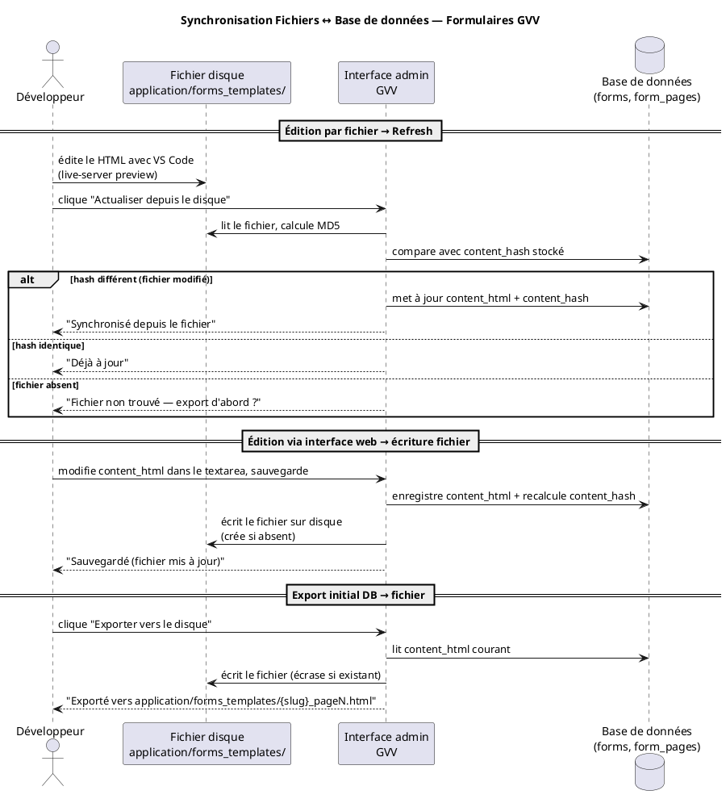

# Design Notes — Synchronisation Fichiers Disque ↔ Base de Données (Formulaires)

Date : 2 juin 2026

## Contexte

L'édition du contenu HTML d'une page de formulaire via le textarea de l'interface admin est insuffisante pour les formulaires complexes (mise en page document, CSS scoped, prévisualisation live). Le workflow naturel est :

1. concevoir le formulaire dans un éditeur HTML (VS Code, live-server)
2. le déployer dans GVV sans copier-coller manuel

En parallèle, la base de données reste la source de sauvegarde/restauration : un dump SQL doit suffire à reconstruire l'état complet.

## Décisions d'architecture

| Question | Décision |
|---|---|
| Détection de modification | Hash MD5 du contenu (insensible aux mtimes de déploiement git/rsync) |
| Conflit fichier vs DB | Le fichier gagne toujours |
| Déclenchement de la sync | Manuel (bouton dans l'admin), pas automatique au rendu |
| Emplacement des fichiers | `application/forms_templates/` (hors webroot) |
| Nommage | `{public_slug}_page{N}.html` et `{public_slug}.css` |
| Granularité | Un fichier par page + un fichier CSS par formulaire |

## Emplacement des fichiers

```
application/
└── forms_templates/          ← non accessible par le web
    ├── attestation-formation-procedures_page1.html
    ├── attestation-formation-procedures_page2.html
    ├── attestation-formation-procedures.css
    ├── inscription-membre_page1.html
    └── inscription-membre.css
```

Le répertoire est protégé par la configuration Apache/Nginx (situé sous `application/`, hors du webroot `public_html/` ou protégé par `.htaccess`).

## Schéma de données

Deux colonnes de hash ajoutées :

```sql
ALTER TABLE form_pages ADD COLUMN content_hash VARCHAR(32) NULL
    COMMENT 'MD5 du content_html, NULL si jamais synchronisé';

ALTER TABLE forms ADD COLUMN css_hash VARCHAR(32) NULL
    COMMENT 'MD5 du global_css, NULL si jamais synchronisé';
```

Le hash est calculé à chaque sauvegarde (web ou sync) et sert uniquement à détecter une divergence.

## Flux de synchronisation



### Fichier → DB (Refresh)

Déclenché par le bouton **"Actualiser depuis le disque"** sur la vue page admin :

1. GVV lit le fichier `forms_templates/{slug}_page{N}.html`
2. Calcule `md5_file()`
3. Compare avec `form_pages.content_hash`
4. Si différent : met à jour `content_html` + `content_hash`
5. Résultat affiché explicitement (synchronisé / déjà à jour / fichier absent)

Même logique pour le CSS via le bouton sur la vue formulaire.

### DB → Fichier (sauvegarde web)

Déclenché automatiquement à chaque sauvegarde depuis l'interface web :

1. GVV enregistre `content_html` en base
2. Recalcule et stocke `content_hash`
3. Écrit le fichier sur disque (crée le répertoire si absent)

### Export initial

Bouton **"Exporter vers le disque"** disponible même si le fichier existe déjà (écrasement). Utile pour initialiser le fichier depuis un contenu existant en base.

## Règle de priorité

**Le fichier gagne toujours** lors d'un Refresh. Si l'interface web a été utilisée et qu'un fichier plus récent existe sur disque, le Refresh écrase le contenu de la base. C'est intentionnel : le fichier est le medium d'édition principal.

## Ce que ça ne fait pas

- Pas de sync automatique au rendu public (pas de dégradation de performance)
- Pas de merge en cas de modifications simultanées (le dernier Refresh écrase)
- Pas de versioning des fichiers (Git joue ce rôle si les fichiers sont dans le dépôt)
- Pas de renommage automatique si le `public_slug` change (le fichier garde son ancien nom)

## Sécurité

- Le chemin du fichier est construit exclusivement depuis `public_slug` et `page_number` stockés en base : pas d'entrée utilisateur libre dans le chemin → pas de path traversal
- Le répertoire `forms_templates/` est hors webroot : les fichiers ne sont pas servis directement
- Écriture de fichier réservée aux admins authentifiés (action admin uniquement)
