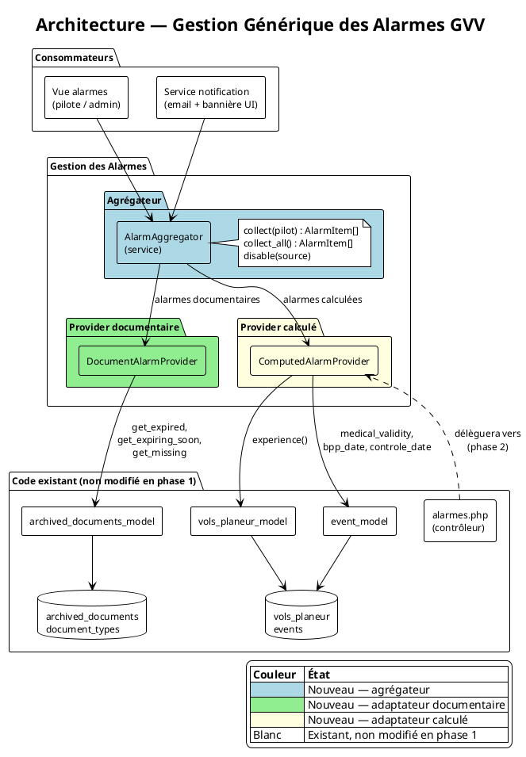

# Design Notes — Gestion Générique des Alarmes

Date : 30 mai 2026 — mis à jour le 30 mai 2026 (portée par section)

## Contexte et objectif

GVV dispose de deux systèmes d'alarme existants non unifiés :

- **`archived_documents_model`** : alarmes documentaires basées sur `valid_until`. Statuts : active, expiring_soon, expired, missing.
- **`alarmes.php`** : contrôleur calculant les conditions d'expérience à la volée depuis le carnet de vol (heures, décollages, emport passager, médical, instructeur).

L'objectif est d'unifier ces deux familles sous un contrat commun, sans réécrire les implémentations existantes, pour permettre :
- l'affichage agrégé dans une vue unique,
- le partage du code de notification (email, bannière UI),
- l'ajout futur de nouvelles règles d'alarme sans duplication.

Document de référence : [gestion_alarmes_generiques_prd.md](../prds/gestion_alarmes_generiques_prd.md)

---

## Deux familles d'alarmes

| Famille | Source | Stockage | Exemple |
|---------|--------|----------|---------|
| Alarme à date fixe | `archived_documents` | En base — champ `valid_until` | Visite médicale expire le 01/06/2026 |
| Alarme calculée | Carnet de vol | Aucun — évaluée à la demande | Moins de 3 atterrissages CDB dans les 90 derniers jours |

Les alarmes calculées ne doivent pas être stockées en base : elles reflètent l'état courant du carnet de vol et deviendraient obsolètes dès qu'un vol est enregistré.

---

## Architecture



### AlarmItem — structure commune

Toute alarme, quelle que soit sa source, est représentée par un `AlarmItem` :

| Champ | Type | Description |
|-------|------|-------------|
| `entity_type` | string | `pilot` \| `machine` \| `club` |
| `entity_id` | string | Login pilote, immatriculation avion, etc. |
| `section_id` | int\|null | Section de rattachement — null = alarme globale (toutes sections) |
| `label` | string | Texte descriptif de l'alarme |
| `status` | string | `active` \| `expiring_soon` \| `expired` \| `missing` \| `ok` |
| `expiry_date` | date\|null | Date d'échéance — null pour les alarmes calculées sans date fixe |
| `source` | string | `document:{id}` \| `computed:{rule_name}` |
| `alarm_disabled` | bool | Alarme désactivée par un admin |

### AlarmAggregator

Service central. Collecte les `AlarmItem` de tous les providers enregistrés et expose une vue unifiée. Le filtrage par section est appliqué à ce niveau : seules les alarmes globales (`section_id = null`) et celles de la section demandée sont retournées.

```php
AlarmAggregator::collect(string $pilot_login, ?int $section_id = null) : AlarmItem[]
AlarmAggregator::collect_all(?int $section_id = null) : AlarmItem[]
AlarmAggregator::disable(string $source) : void
```

### DocumentAlarmProvider

Adapte `archived_documents_model` au contrat `AlarmItem`. Traduit les statuts existants (`STATUS_ACTIVE`, `STATUS_EXPIRING_SOON`, `STATUS_EXPIRED`, `STATUS_MISSING`) vers les champs de `AlarmItem`. Aucun code existant n'est modifié.

La portée par section est héritée directement de `document_types.section_id` : un type de document avec `section_id = null` génère une alarme globale ; un type avec `section_id = 42` génère une alarme rattachée à la section 42. Le `section_id` du `AlarmItem` est renseigné depuis le type de document.

Sources utilisées :
- `get_expired_documents()`
- `get_expiring_soon_documents()`
- `get_missing_documents($pilot_login, $section_id)`

### ComputedAlarmProvider

Extrait la logique des méthodes privées d'`alarmes.php` (`medical()`, `brevet()`, `experience_recente()`, emport passager) et la rend disponible sous forme de `AlarmItem[]`. Les méthodes du contrôleur deviennent des appels au provider en phase 2.

La plupart des règles calculées sont intrinsèquement liées au pilote, pas à une section. Elles produisent des alarmes avec `section_id = null` (globales). Une règle peut cependant être déclarée spécifique à une section si elle ne s'applique qu'aux pilotes de cette section (ex. règle propre à la section ULM).

Règles implémentées en phase 1 :

| Règle | Source de données | Date fixe ? | Section |
|-------|------------------|-------------|---------|
| Visite médicale | `event_model::medical_validity_date()` | Oui | Globale |
| Qualification instructeur | `event_model::inst_validity()` | Oui | Globale |
| Emport passager : 3 atterrissages CDB / 90 jours | `vols_planeur_model::experience()` | Non | Globale |
| Expérience BPP/SPL : heures et décollages / 24 mois | `vols_planeur_model::experience()` | Non | Globale |

---

## Séparation des responsabilités

| Responsabilité | Composant |
|---|---|
| Alarmes documentaires (expiration, manquant) | `DocumentAlarmProvider` → `archived_documents_model` |
| Alarmes expérience vol (heures, atterrissages) | `ComputedAlarmProvider` → `vols_planeur_model`, `event_model` |
| Agrégation et vue unifiée | `AlarmAggregator` |
| Envoi de notifications (email, bannière) | Service notification — cf. Lot 5 de [archivage_documentaire_plan.md](../plans/archivage_documentaire_plan.md) |
| Désactivation d'une alarme documentaire | `AlarmAggregator::disable()` → délègue à `DocumentAlarmProvider` |

---

## Relation avec le code existant

Le code existant n'est pas modifié en phase 1 — les providers sont des adaptateurs :

- **`archived_documents_model`** : `DocumentAlarmProvider` lit ses méthodes sans les modifier.
- **`alarmes.php`** : le contrôleur continue d'exister et affiche la vue pilote individuelle. En phase 2, ses méthodes privées sont extraites vers `ComputedAlarmProvider` ; le contrôleur devient un consommateur de l'agrégateur.

---

## Lot 5 — Notifications documentaires

Le Lot 5 du plan `archivage_documentaire_plan.md` (notifications email et bannière UI) est en attente. Ce lot doit s'appuyer sur `AlarmAggregator` plutôt qu'accéder directement à `archived_documents_model`, afin que les emails de synthèse couvrent aussi les alarmes calculées.

---

## Hors périmètre

- Moteur de règles métier orienté expressions libres.
- Stockage des alarmes calculées en base.
- Refactoring complet d'`alarmes.php` (conservé en phase 1).
- Escalade multi-canal (SMS).
