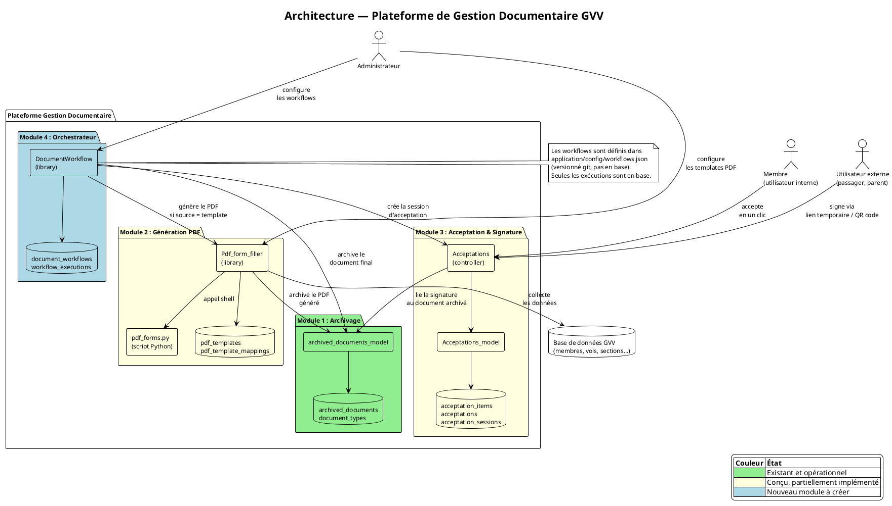
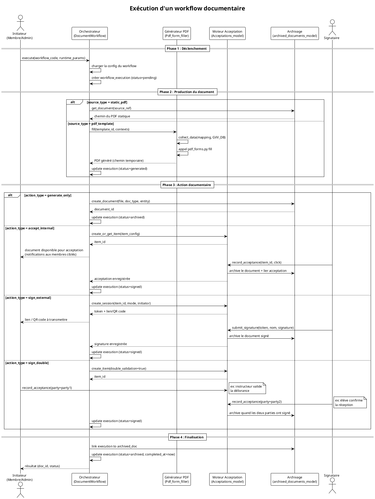
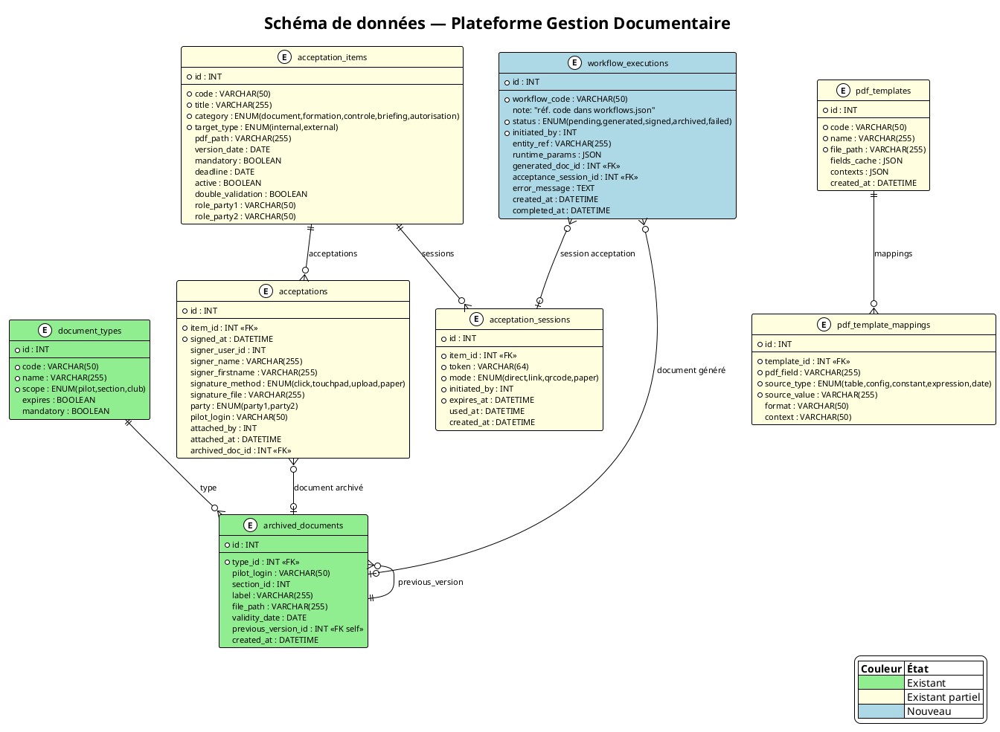

# Design Notes — Plateforme de Gestion Documentaire

Date : 24 mars 2026

## Contexte et objectif

GVV gère de nombreux documents réglementaires ou administratifs : briefings passagers, autorisations parentales, acceptations de manuels d'exploitation, attestations de formation, feuilles d'intervention maintenance, déclarations de début de formation. Ces besoins sont actuellement traités par des modules spécifiques (briefing passager) ou non couverts.

L'objectif est de définir une plateforme documentaire générique composée de blocs fonctionnels réutilisables, permettant d'implémenter de nouveaux cas d'usage principalement par configuration, sans nouveau code métier.

Documents de référence existants :
- [archivage_documentaire_prd.md](../prds/archivage_documentaire_prd.md)
- [remplissage_formulaires_pdf_prd.md](../prds/remplissage_formulaires_pdf_prd.md) / [remplissage_pdf.md](remplissage_pdf.md)
- [approbation_de_documents_prd.md](../prds/approbation_de_documents_prd.md)
- [briefing_passager_prd.md](../prds/briefing_passager_prd.md)

---

## Architecture générale

La plateforme est organisée en quatre modules indépendants et un orchestrateur qui les combine.



### Vue pipeline

Tout flux documentaire suit le même pipeline :

```
[Source document] → [Génération PDF (opt.)] → [Acceptation/Signature (opt.)] → [Archivage]
```

Un **workflow documentaire** est une configuration qui précise comment traverser ce pipeline pour un cas d'usage donné.

---

## Blocs fonctionnels

### Module 1 — Archivage documentaire

**État** : Existant et opérationnel (migrations 067+).

**Rôle** : Stocker, versionner et exposer des fichiers PDF associés à une entité (pilote, section, club). Gérer les dates de validité, alertes d'expiration et historique des versions.

**Tables** : `archived_documents`, `document_types`

**Interface programmatique** :

```php
interface IDocumentArchive {
    // Crée un nouveau document archivé, retourne son id
    public function create_document(array $data): int;
    // $data = [
    //   'type_code'    => string,       // code dans document_types
    //   'pilot_login'  => string|null,
    //   'section_id'   => int|null,
    //   'label'        => string,
    //   'file_path'    => string,       // chemin absolu du fichier source
    //   'validity_date'=> string|null,  // format Y-m-d
    //   'description'  => string|null,
    // ]

    // Retourne le document archivé avec ses métadonnées
    public function get_document(int $id): array;

    // Liste les documents d'une entité, filtrés par type
    public function get_documents_by_entity(
        string $entity_type,   // 'pilot' | 'section' | 'club'
        string $entity_id,
        string $type_code = null
    ): array;

    // Crée une nouvelle version d'un document existant
    public function new_version(int $document_id, array $data): int;

    // Supprime un document (et son fichier physique)
    public function delete_document(int $id): bool;
}
```

---

### Module 2 — Génération de formulaires PDF

**État** : Conçu, partiellement implémenté (PRD + design notes).

**Rôle** : À partir d'un formulaire PDF AcroForm (template) et d'un mapping champ→source, produire un PDF rempli avec des données issues de la base GVV ou saisies à l'exécution.

**Workflow interne** :
1. **Analyse** : extraction automatique des champs du PDF via `bin/pdf_forms.py extract`
2. **Mapping** : configuration administrateur (champ PDF → source GVV)
3. **Génération** : collecte des données et remplissage via `bin/pdf_forms.py fill`

**Tables** : `pdf_templates`, `pdf_template_mappings`

**Types de sources de données** :

| Type | Exemple | Description |
|------|---------|-------------|
| `table` | `membres.mnom` | Colonne d'une table GVV |
| `config` | `club_name` | Valeur de configuration |
| `constant` | `"France"` | Valeur fixe |
| `expression` | `CONCAT(mnom,' ',mprenom)` | Expression SQL |
| `date` | `date:d/m/Y` | Date courante formatée |
| `input` | — | Saisie utilisateur au moment de la génération |

**Contextes** : un template peut nécessiter plusieurs enregistrements simultanément (ex : `candidat` et `instructeur`), chacun issu d'une table différente.

**Interface programmatique** :

```php
interface IPdfFormGenerator {
    // Extrait les champs d'un PDF AcroForm
    public function extract_fields(string $pdf_path): array;
    // retourne : [['name'=>'Nom de famille', 'type'=>'text', 'default'=>''], ...]

    // Charge le mapping complet d'un template
    public function get_mapping(int $template_id): array;

    // Collecte les données selon le mapping et les contextes fournis
    // $contexts = ['candidat' => ['pilot_login' => 'dupont'], 'instructeur' => [...]]
    public function collect_data(array $mapping, array $contexts): array;

    // Génère le PDF rempli, retourne le chemin du fichier produit
    public function fill(int $template_id, array $contexts, string $output_path): string;

    // Archive le PDF généré via le Module 1, retourne l'id du document archivé
    public function archive(
        string $pdf_path,
        string $template_code,
        string $entity_type,
        string $entity_id
    ): int;
}
```

**Dépendance** : Python 3 + PyPDF2 (installés), `qpdf` (installé).

---

### Module 3 — Acceptation et signature de documents

**État** : Conçu, partiellement implémenté (migration 068, Lots 1–3 complets).

**Rôle** : Gérer le cycle de vie d'une acceptation ou signature de document par des utilisateurs internes (membres) ou externes (passagers, parents). Supporte la double validation (ex : instructeur + élève).

**Catégories d'acceptation** :

| Catégorie | Parties | Mode signataire |
|-----------|---------|-----------------|
| `document` | 1 | interne ou externe |
| `briefing` | 1 | externe |
| `formation` | 2 (instructeur + élève) | interne + interne |
| `controle` | 2 (contrôleur + pilote) | interne + interne |
| `autorisation` | 1 (parent pour mineur) | externe |

**Modes de signature** :

| Mode | Description |
|------|-------------|
| `click` | Acceptation en un clic (interne authentifié) |
| `touchpad` | Signature tactile sur écran |
| `upload` | Dépôt d'un scan du document signé |
| `paper` | Formulaire papier uploadé par l'initiateur |

**Tables** : `acceptance_items`, `acceptance_records`, `acceptance_signatures`, `acceptance_tokens`

- `acceptance_items` : définition de l'élément à accepter. Doit exposer un champ `code VARCHAR(50)` unique (ASCII snake_case) référencé par l'orchestrateur.
- `acceptance_records` : enregistrements d'acceptation/refus par personne
- `acceptance_signatures` : données de signature (tactile base64, fichier uploadé, autorisation parentale)
- `acceptance_tokens` : liens temporaires pour signatures externes (à usage unique, durée limitée)

**Interface programmatique** :

```php
interface IAcceptanceEngine {
    // Crée ou met à jour la définition d'un élément à faire accepter
    public function create_item(array $config): int;
    // $config = [
    //   'code'             => string,        // ASCII snake_case, unique — référencé par l'orchestrateur
    //   'title'            => string,
    //   'category'         => 'document'|'formation'|'controle'|'briefing'|'autorisation',
    //   'target_type'      => 'internal'|'external',
    //   'pdf_path'         => string,
    //   'mandatory'        => bool,
    //   'deadline'         => string|null,
    //   'dual_validation'  => bool,
    //   'role_1'           => string|null,   // ex : 'instructeur'
    //   'role_2'           => string|null,   // ex : 'eleve'
    // ]

    // Initie une session de signature externe, retourne le token et le lien
    public function initiate_session(int $item_id, string $mode, int $initiator_id): array;
    // $mode : 'direct' | 'link' | 'qrcode' | 'paper'
    // retourne : ['session_id'=>int, 'token'=>string, 'url'=>string, 'qrcode'=>string|null]

    // Enregistre une acceptation (interne ou externe)
    public function record_acceptance(int $item_id, array $signatory_data): int;
    // $signatory_data = [
    //   'session_token'   => string|null,   // pour les externes
    //   'user_id'         => int|null,       // pour les internes
    //   'signer_name'     => string,
    //   'signer_firstname'=> string,
    //   'method'          => 'click'|'touchpad'|'upload'|'paper',
    //   'signature_file'  => string|null,
    //   'party'           => 'party1'|'party2'|null,
    //   // pour autorisation parentale :
    //   'beneficiary_name'=> string|null,
    //   'signer_quality'  => 'pere'|'mere'|'tuteur'|null,
    // ]

    // Retourne les acceptations d'un élément avec filtres optionnels
    public function get_acceptances(int $item_id, array $filters = []): array;

    // Retourne les éléments en attente pour un utilisateur interne
    public function get_pending_for_user(int $user_id): array;

    // Rattache une acceptation externe au dossier d'un pilote
    public function attach_to_pilot(int $acceptance_id, string $pilot_login, int $admin_id): bool;
}
```

---

### Module 4 — Orchestrateur de workflows documentaires

**État** : Nouveau module à créer.

**Rôle** : Assembler les modules 1, 2, 3 selon une configuration déclarative pour implémenter un cas d'usage complet sans nouveau code métier. Chaque cas d'usage est un **workflow** défini dans un fichier JSON de configuration, versionné avec le code source.

**Principe** : les définitions de workflows sont du code de configuration, pas des données métier — elles sont stables, définies par la réglementation, et doivent être tracées dans git. Seules les **exécutions** (instances) sont enregistrées en base.

**Fichier de configuration** : `application/config/workflows.json`

Structure d'un workflow :

```json
{
  "code": "string (ascii, unique)",
  "name": "string",
  "description": "string (optionnel)",
  "source_type": "static_pdf | pdf_template",
  "source_ref": "chemin fichier | code template pdf_templates.code",
  "action_type": "generate_only | accept_internal | sign_external | sign_double",
  "acceptance_code": "code dans acceptation_items.code (requis si action != generate_only)",
  "doc_type_code": "code dans document_types.code",
  "entity_binding": "pilot | section | club | free",
  "retention_months": "integer | null",
  "active": "boolean",
  "config": {
    "contexts_mapping": "résolution des contextes PDF à l'exécution (optionnel)",
    "notify_roles": "rôles à notifier après signature (optionnel)",
    "generate_summary_pdf": "boolean (optionnel)",
    "summary_fields": "liste de champs pour le PDF récapitulatif (optionnel)"
  }
}
```

**Table** : `workflow_executions` uniquement (les définitions sont dans le JSON)

```sql
CREATE TABLE workflow_executions (
    id                    INT AUTO_INCREMENT PRIMARY KEY,
    workflow_code         VARCHAR(50) NOT NULL,   -- référence au code dans workflows.json
    status                ENUM('pending','generated','signed','archived','failed') NOT NULL DEFAULT 'pending',
    initiated_by          INT NOT NULL,            -- user_id de l'initiateur
    entity_ref            VARCHAR(255),            -- référence à l'entité (pilot_login, vol_id…)
    runtime_params        JSON,                    -- paramètres contextuels passés à l'exécution
    generated_doc_id      INT NULL,                -- archived_documents.id du document produit
    acceptance_session_id INT NULL,
    error_message         TEXT NULL,
    created_at            DATETIME DEFAULT CURRENT_TIMESTAMP,
    completed_at          DATETIME NULL
);
```

**Interface programmatique** :

```php
interface IDocumentWorkflow {
    // Charge la définition d'un workflow depuis workflows.json
    public function get_workflow(string $code): array;

    // Valide un workflow : vérifie que tous les éléments référencés existent en base
    // Retourne un tableau d'erreurs, vide si valide
    public function validate(string $code): array;

    // Valide tous les workflows du fichier de configuration
    public function validate_all(): array;  // ['workflow_code' => [erreurs], ...]

    // Exécute un workflow, retourne l'id de l'exécution et le statut initial
    public function execute(string $workflow_code, array $runtime_params): array;
    // $runtime_params = [
    //   'entity_type'  => 'pilot'|'section'|'club'|'free',
    //   'entity_id'    => string,     // pilot_login, section_id, etc.
    //   'contexts'     => array,      // données contextuelles pour le générateur PDF
    //   'mode'         => string,     // mode de signature si applicable
    //   'input_fields' => array,      // valeurs des champs saisis par l'utilisateur
    // ]
    // retourne : ['execution_id'=>int, 'status'=>string, 'session_url'=>string|null, 'doc_id'=>int|null]

    // Consulte le statut d'une exécution
    public function get_status(int $execution_id): array;
}
```

**Logique d'exécution** :



---

## Clés ASCII de référencement

Les workflows JSON référencent des éléments en base par leur `code` ASCII. Les tables suivantes doivent exposer un tel champ :

| Table | Champ clé | Référencé par | État |
|-------|-----------|---------------|------|
| `document_types` | `code VARCHAR(50)` | `doc_type_code` dans le workflow | Existant |
| `pdf_templates` | `code VARCHAR(50)` | `source_ref` si `source_type=pdf_template` | Existant |
| `acceptation_items` | `code VARCHAR(50)` | `acceptance_code` dans le workflow | Existant |

Ces codes doivent être :
- En ASCII sans accents ni espaces (convention `snake_case`)
- Stables dans le temps (un renommage casse les workflows qui y font référence)
- Uniques au sein de leur table

---

## Validation des workflows

À chaque démarrage de l'application (ou via une commande d'administration), le fichier `workflows.json` est validé. Les vérifications portent sur :

| Contrôle | Condition |
|----------|-----------|
| `source_ref` existe | Si `source_type=pdf_template` → `pdf_templates.code` présent en base |
| `source_ref` accessible | Si `source_type=static_pdf` → le fichier existe sur le serveur |
| `doc_type_code` existe | `document_types.code` présent en base |
| `acceptance_code` présent | Requis si `action_type != generate_only` |
| `acceptance_code` existe | `acceptation_items.code` présent en base |
| `action_type` cohérent | `sign_double` → `acceptation_items.double_validation = true` |
| Codes uniques | Pas deux workflows avec le même `code` |

En cas d'erreur de validation, un message explicite est logué et l'exécution du workflow concerné est bloquée. Une page d'administration liste les workflows avec leur statut de validation.

---

## Schéma de données



---

## Cas d'usage et configuration

Le tableau suivant montre comment chaque cas d'usage se configure sans nouveau code :

| Cas d'usage | source_type | action_type | Remarques |
|-------------|-------------|-------------|-----------|
| Briefing passager | `static_pdf` (consignes section) | `sign_external` | PDF généré après signature (informations vol + passager) |
| Autorisation parentale | `static_pdf` | `sign_external` | Champs additionnels : qualité, bénéficiaire |
| Acceptation manuel d'exploitation | `static_pdf` | `accept_internal` | Ciblage par rôle, deadline |
| Déclaration début de formation | `pdf_template` (134i-Formlic) | `generate_only` | Contextes : candidat + instructeur |
| Attestation de formation | `pdf_template` | `generate_only` | Archivé dans le dossier pilote |
| Feuille d'intervention maintenance | `pdf_template` | `sign_internal` | Signature technicien |
| Reconnaissance formation | `static_pdf` | `sign_double` | Instructeur (party1) + élève (party2) |
| Décharge / engagement | `static_pdf` | `sign_external` | Mode papier ou tactile |

### Extrait de `application/config/workflows.json`

```json
[
  {
    "code": "briefing_passager",
    "name": "Briefing passager vol de découverte",
    "source_type": "static_pdf",
    "source_ref": "consignes_section",
    "action_type": "sign_external",
    "acceptance_code": "briefing_vld",
    "doc_type_code": "briefing_passager",
    "entity_binding": "free",
    "retention_months": 3,
    "active": true,
    "config": {
      "section_pdf_source": true,
      "generate_summary_pdf": true,
      "summary_fields": ["vol_id", "passager_nom", "passager_prenom", "poids", "signature"]
    }
  },
  {
    "code": "declaration_formation_ulm",
    "name": "Déclaration de début de formation ULM (134i-Formlic)",
    "source_type": "pdf_template",
    "source_ref": "134i_formlic",
    "action_type": "generate_only",
    "doc_type_code": "formulaire_pdf",
    "entity_binding": "pilot",
    "active": true,
    "config": {
      "contexts_mapping": {
        "candidat": "runtime:pilot_login",
        "instructeur": "runtime:instructeur_login"
      }
    }
  }
]
```

---

## Séparation des responsabilités

| Responsabilité | Module |
|----------------|--------|
| Stocker et versionner des fichiers PDF | Module 1 — Archivage |
| Remplir un formulaire PDF depuis des données GVV | Module 2 — Générateur |
| Collecter une signature (tactile, upload, clic) | Module 3 — Acceptation |
| Tracer qui a signé quoi et quand | Module 3 — Acceptation |
| Orchestrer source → action → archivage | Module 4 — Orchestrateur |
| Configurer un nouveau cas d'usage | Module 4 — table `document_workflows` |

Les modules 1, 2, 3 sont indépendants et utilisables séparément. L'orchestrateur est un assembleur de configuration.

---

## Migration du briefing passager

Le briefing passager existant (`briefing_passager` controller) sera réécrit comme une instanciation du workflow `briefing_passager`. L'implémentation actuelle (UC1, UC2, UC3) reste fonctionnelle pendant la migration. La migration consiste à :

1. Créer l'entrée `document_workflows` pour le briefing passager.
2. Rediriger le controller `briefing_passager` vers `DocumentWorkflow::execute('briefing_passager', ...)`.
3. Supprimer le code spécifique résiduel.

---

## Guide de création de formulaires PDF

Pour créer un formulaire PDF compatible avec le générateur :

1. **Créer le formulaire dans LibreOffice Writer**
2. Activer le mode ébauche : Affichage > Barres d'outils > Contrôles de formulaire
3. Ajouter les champs (texte, case à cocher, liste)
4. Nommer chaque champ en `snake_case` sans accents (Propriétés du contrôle > Nom)
5. Exporter : Fichier > Exporter en PDF > cocher "Créer un formulaire PDF"
6. Vérifier les noms avec `python3 bin/pdf_forms.py extract <fichier.pdf>`
7. Uploader le template dans GVV et configurer le mapping

Convention de nommage recommandée : `nom_pilote`, `date_vol`, `signature_png`.

---

## Hors périmètre

- Signature électronique qualifiée (eIDAS)
- Workflow d'approbation multi-niveaux (chaîne de validation hiérarchique)
- Intégration avec des GED externes
- OCR de documents scannés
