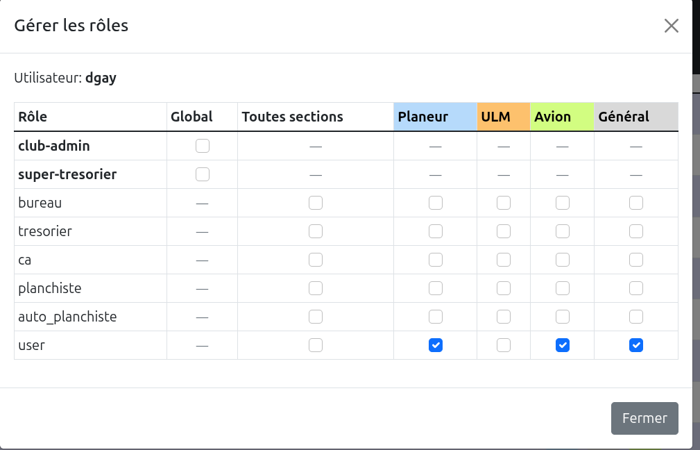

# Design Document - Gestion des Adresses Email dans GVV

**Projet:** GVV - Gestion Vol à voile
**Fonctionnalité:** Système de gestion des listes de diffusion email
**PRD:** [doc/prds/gestion_emails.md](../prds/gestion_emails.md)
**Date de création:** 2025-10-31
**Version:** 1.4
**Dernière mise à jour:** 2025-11-05
**Statut:** En cours d'implémentation

**Changements v1.4:**
- **Workflow création/modification séparé:**
  - Partie supérieure: métadonnées liste (nom, description, type, visibilité)
  - Boutons Enregistrer/Annuler sous partie supérieure
  - Partie inférieure: gestion adresses (désactivée en création, activée en modification)
  - Rechargement page avec email_list_id après première sauvegarde
  - Controller: distinction create() vs edit($id) pour les deux modes

**Changements v1.3:**
- Ajout champ `source_file` dans `email_list_external` pour traçabilité
- Section 2.4 "Gestion des fichiers uploadés" avec workflow complet
- Preview simplifiée sans icônes delete (suppression via onglets sources)
- Onglets renommés pour clarté
- **Suppression de la Phase 9 (système de codage couleur) - Plus nécessaire**

## Table des matières

- [Design Document - Gestion des Adresses Email dans GVV](#design-document---gestion-des-adresses-email-dans-gvv)
  - [Table des matières](#table-des-matières)
  - [1. Vue d'ensemble de l'architecture](#1-vue-densemble-de-larchitecture)
    - [1.1 Stack technique](#11-stack-technique)
    - [1.2 Architecture MVC](#12-architecture-mvc)
  - [2. Base de données](#2-base-de-données)
    - [2.1 Schéma des tables](#21-schéma-des-tables)
      - [Table: `email_lists`](#table-email_lists)
      - [Table: `email_list_roles`](#table-email_list_roles)
      - [Table: `email_list_members`](#table-email_list_members)
      - [Table: `email_list_external`](#table-email_list_external)
    - [2.2 Diagramme ER](#22-diagramme-er)
    - [2.3 Types de source d'adresse](#23-types-de-source-dadresse)
    - [2.4 Gestion des fichiers uploadés](#24-gestion-des-fichiers-uploadés)
    - [2.5 Extension future (réservée)](#25-extension-future-réservée)
  - [3. Composants applicatifs](#3-composants-applicatifs)
    - [3.1 Controller: `application/controllers/email_lists.php`](#31-controller-applicationcontrollersemail_listsphp)
    - [3.2 Model: `application/models/email_lists_model.php`](#32-model-applicationmodelsemail_lists_modelphp)
    - [3.3 Helper: `application/helpers/email_helper.php`](#33-helper-applicationhelpersemail_helperphp)
    - [3.4 Views](#34-views)
    - [3.5 JavaScript: `assets/js/email_lists.js`](#35-javascript-assetsjsemail_listsjs)
  - [4. Système de codage couleur ~~(SUPPRIMÉ v1.3)~~](#4-système-de-codage-couleur-supprimé-v13)
    - [4.1 Vue d'ensemble](#41-vue-densemble)
    - [4.2 Application des couleurs](#42-application-des-couleurs)
    - [4.3 Attribution des couleurs de rôle](#43-attribution-des-couleurs-de-rôle)
    - [4.4 Stockage et transmission des couleurs](#44-stockage-et-transmission-des-couleurs)
    - [4.5 Responsabilités par composant](#45-responsabilités-par-composant)
  - [5. Metadata (Gvvmetadata.php)](#5-metadata-gvvmetadataphp)
  - [5. Flux de données](#5-flux-de-données)
    - [5.1 Création d'une liste - Workflow v1.4](#51-création-dune-liste---workflow-v14)
    - [5.2 Export vers fichier TXT](#52-export-vers-fichier-txt)
    - [5.3 Résolution complète avec dédoublonnage](#53-résolution-complète-avec-dédoublonnage)
  - [6. Décisions d'architecture](#6-décisions-darchitecture)
    - [6.1 Pourquoi 4 tables au lieu de 1 ou 2 ?](#61-pourquoi-4-tables-au-lieu-de-1-ou-2-)
    - [6.2 Pourquoi localStorage pour les préférences ?](#62-pourquoi-localstorage-pour-les-préférences-)
    - [6.3 Pourquoi découpage côté client ?](#63-pourquoi-découpage-côté-client-)
  - [7. Sécurité](#7-sécurité)
    - [7.1 Contrôle d'accès](#71-contrôle-daccès)
    - [7.2 Validation des entrées](#72-validation-des-entrées)
    - [7.3 Journalisation](#73-journalisation)
  - [8. Performance](#8-performance)
    - [8.1 Index](#81-index)
    - [8.2 Optimisation des requêtes](#82-optimisation-des-requêtes)
  - [9. Diagrammes](#9-diagrammes)
    - [9.1 Diagramme de séquence - Export TXT](#91-diagramme-de-séquence---export-txt)
  - [10. Migration](#10-migration)
    - [10.1 Fichier de migration](#101-fichier-de-migration)
    - [10.2 Points clés de la migration](#102-points-clés-de-la-migration)
  - [11. Tests](#11-tests)
    - [11.1 Tests unitaires (PHPUnit)](#111-tests-unitaires-phpunit)
    - [11.2 Tests d'intégration (MySQL)](#112-tests-dintégration-mysql)
  - [12. Évolutions futures possibles](#12-évolutions-futures-possibles)
    - [12.2 Historique des envois (non)](#122-historique-des-envois-non)
    - [12.3 Templates de messages (?)](#123-templates-de-messages-)
    - [12.4 API REST (inutile)](#124-api-rest-inutile)

---

## 1. Vue d'ensemble de l'architecture

### 1.1 Stack technique
- **Backend:** PHP 7.4 avec CodeIgniter 2.x
- **Base de données:** MySQL 5.x
- **Frontend:** Bootstrap 5, JavaScript ES6+
- **APIs navigateur:** Clipboard API, localStorage

### 1.2 Architecture MVC

```
┌─────────────────────────────────────────────────────────┐
│                     User Interface                      │
│  (Bootstrap 5 Views + JavaScript)                       │
└────────────────────┬────────────────────────────────────┘
                     │
┌────────────────────▼────────────────────────────────────┐
│              email_lists.php (Controller)               │
│  - index(), create(), edit(), delete()                  │
│  - export(), download_txt()                             │
└────────────────────┬────────────────────────────────────┘
                     │
┌────────────────────▼────────────────────────────────────┐
│         email_lists_model.php (Model)                   │
│  - CRUD operations                                      │
│  - Member resolution (manual + external)                │
└────────────────────┬────────────────────────────────────┘
                     │
┌────────────────────▼────────────────────────────────────┐
│           MySQL Database (4 tables)                     │
│  - email_lists                                          |
|  - email_list_roles (selection sur critères)            │
│  - email_list_members (selection manuelle)              │
│  - email_list_external (external emails)                │
└─────────────────────────────────────────────────────────┘

        Helper: email_helper.php
        (Validation, formatting, export generation)
```

---

## 2. Base de données

### 2.1 Schéma des tables

#### Table: `email_lists`

Cette table permet de manipuler et stocker les listes de diffusion.

```sql
CREATE TABLE `email_lists` (
  `id` INT UNSIGNED NOT NULL AUTO_INCREMENT,
  `name` VARCHAR(100) NOT NULL UNIQUE COLLATE utf8_bin,
  `description` TEXT,
  `active_member` ENUM('active', 'inactive', 'all') NOT NULL DEFAULT 'active',
  `visible` TINYINT(1),
  `created_by` INT UNSIGNED NOT NULL,
  `created_at` DATETIME NOT NULL DEFAULT CURRENT_TIMESTAMP,
  `updated_at` DATETIME NOT NULL DEFAULT CURRENT_TIMESTAMP ON UPDATE CURRENT_TIMESTAMP,
  PRIMARY KEY (`id`),
  UNIQUE KEY `idx_name` (`name`),
  KEY `idx_created_by` (`created_by`),
  FOREIGN KEY (`created_by`) REFERENCES `users`(`id`) ON DELETE RESTRICT
) ENGINE=InnoDB DEFAULT CHARSET=utf8mb4 COLLATE=utf8mb4_unicode_ci;
```

**Champs:**
- `id`: Clé primaire auto-incrémentée
- `name`: Nom unique de la liste (sensible à la casse via COLLATE utf8_bin)
- `description`: Description optionnelle
- `active_member`: défini si on inclut les membres non actif
- `visible`: la liste est visible dans les choix, ou pas
- `created_by`: FK vers users, utilisateur créateur
- `created_at`: Timestamp de création
- `updated_at`: Timestamp de dernière modification (auto-update)

#### Table: `email_list_roles`

Cette table permet de gérer la selection dynamique. Elle contient
des éléments qui pointent sur une liste d'email (pour définir à quelle liste ils se rapportent) et des pointeurs sur des rôles.

Quand il existe un élément dans cette table il définit que le rôle associé doit être prix en compte dans la selection des membres.

```sql
CREATE TABLE `email_list_roles` (
  `id` int(11) NOT NULL,
  `email_list_id` int(11) NOT NULL,
  `types_roles_id` int(11) NOT NULL,
  `section_id` int(11) NOT NULL,
  `granted_by` int(11) DEFAULT NULL,
  `granted_at` datetime NOT NULL,
  `revoked_at` datetime DEFAULT NULL,
  `notes` text DEFAULT NULL
) ENGINE=InnoDB DEFAULT CHARSET=utf8mb4 COLLATE=utf8mb4_general_ci;
```

#### Table: `email_list_members`

Stocke les membres internes ajoutés manuellement à une liste.

```sql
CREATE TABLE `email_list_members` (
  `id` INT UNSIGNED NOT NULL AUTO_INCREMENT,
  `email_list_id` INT UNSIGNED NOT NULL,
  `membre_id` VARCHAR() NOT NULL,
  `added_at` DATETIME NOT NULL DEFAULT CURRENT_TIMESTAMP,
  PRIMARY KEY (`id`),
  KEY `idx_email_list_id` (`email_list_id`),
  KEY `idx_user_id` (`user_id`),
  FOREIGN KEY (`email_list_id`) REFERENCES `email_lists`(`id`) ON DELETE CASCADE,
  FOREIGN KEY (`membre_id`) REFERENCES `membres`(`mlogin`) ON DELETE CASCADE
) ENGINE=InnoDB DEFAULT CHARSET=utf8mb4 COLLATE=utf8mb4_unicode_ci;
```

**Champs:**
- `id`: Clé primaire auto-incrémentée
- `email_list_id`: FK vers email_lists, ON DELETE CASCADE
- `membre_id`: FK vers membres, membre ajouté manuellement (NOT NULL)
- `added_at`: Timestamp d'ajout

#### Table: `email_list_external`

Stocke les adresses email externes ajoutées à une liste.

```sql
CREATE TABLE `email_list_external` (
  `id` INT UNSIGNED NOT NULL AUTO_INCREMENT,
  `email_list_id` INT UNSIGNED NOT NULL,
  `external_email` VARCHAR(255) NOT NULL,
  `external_name` VARCHAR(100) DEFAULT NULL COMMENT 'Nom optionnel pour affichage',
  `source_file` VARCHAR(255) DEFAULT NULL COMMENT 'Nom du fichier source si importé',
  `added_at` DATETIME NOT NULL DEFAULT CURRENT_TIMESTAMP,
  PRIMARY KEY (`id`),
  KEY `idx_email_list_id` (`email_list_id`),
  KEY `idx_source_file` (`email_list_id`, `source_file`),
  FOREIGN KEY (`email_list_id`) REFERENCES `email_lists`(`id`) ON DELETE CASCADE
) ENGINE=InnoDB DEFAULT CHARSET=utf8mb4 COLLATE=utf8mb4_unicode_ci;
```

**Champs:**
- `id`: Clé primaire auto-incrémentée
- `email_list_id`: FK vers email_lists, ON DELETE CASCADE
- `external_email`: Adresse email externe (NOT NULL)
- `external_name`: Nom optionnel associé à l'adresse externe
- `source_file`: Nom du fichier source pour traçabilité (NULL si ajout manuel)
- `added_at`: Timestamp d'ajout

**Index composé `idx_source_file`:** Permet de supprimer efficacement toutes les adresses d'un fichier donné

### 2.2 Diagramme ER

Ce diagramme montre les relations entre les tables du système de gestion des listes email.


**Source:** [email_lists_er.puml](diagrams/email_lists_er.puml)

**Points clés:**
- Séparation claire entre membres internes (`email_list_members`) et externes (`email_list_external`)
- Utilisation de `email_list_roles` pour la sélection dynamique par critères
- Liens entre `users` et `membres` via `username`/`mlogin`

### 2.3 Types de source d'adresse

Une liste contient:
* **Rôles sélectionnés** → table `email_list_roles` (sélection dynamique)
* **Membres sélectionnés manuellement** → table `email_list_members` (sélection statique)
* **Adresses externes** → table `email_list_external` avec deux sous-types:
  - **Ajoutées manuellement** : `source_file` = NULL
  - **Importées depuis fichier** : `source_file` = nom du fichier

### 2.4 Gestion des fichiers uploadés

**Stockage physique:**
- **Répertoire permanent:** `/uploads/email_lists/[list_id]/`
- **Nommage:** `[timestamp]_[original_filename]` pour éviter collisions
- **Permissions:** 644 (lecture seule après création)
- **Formats acceptés:** `.txt`, `.csv`


**Workflow d'import (mode édition - liste existante):**
1. Upload fichier → validation format
2. Stockage direct dans `/uploads/email_lists/[list_id]/`
3. Parse contenu → extraction email + nom
4. Validation adresses → rapport d'erreurs
5. Insertion immédiate en base avec `source_file = nom_fichier`
6. Conservation du fichier pour traçabilité

**Workflow de suppression:**
1. Utilisateur clique sur icône poubelle du fichier
2. Confirmation obligatoire
3. Suppression de toutes les lignes `email_list_external` WHERE `source_file = nom_fichier`
4. Suppression du fichier physique
5. Mise à jour de la preview en temps réel

**Nettoyage automatique:**
- Job périodique (cron) supprime les fichiers dans `/uploads/email_lists/tmp/` datant de plus de 2 jours
- Évite l'accumulation de fichiers orphelins si l'utilisateur abandonne la création

**Avantages:**
- Traçabilité complète (quel fichier a ajouté quelle adresse)
- Suppression en bloc simple et efficace
- Audit: possibilité de ré-analyser le fichier source
- Pas de duplication: un fichier ne peut être uploadé qu'une seule fois par liste
- Workflow fluide: upload possible avant sauvegarde de la liste

### 2.5 Extension future (réservée)

_Section réservée pour évolutions futures éventuelles._

**Stratégie de migration:**
- Les rôles existants conservent `color = NULL`
- Le système génère automatiquement des couleurs via `generate_role_color()` quand `color IS NULL`
- Les administrateurs peuvent ensuite personnaliser les couleurs via une interface dédiée (optionnel)

**Alternative sans modification de schéma:**
- Stocker les couleurs dans un fichier de configuration (`application/config/role_colors.php`)
- Plus simple, mais moins flexible pour la personnalisation future

---

## 3. Composants applicatifs

### 3.1 Controller: `application/controllers/email_lists.php`

**Responsabilités:**
- Gestion des requêtes HTTP
- Contrôle d'accès (secrétaires uniquement)
- Orchestration des opérations CRUD
- Génération des exports (TXT)

**Actions publiques:**

```php
class Email_lists extends CI_Controller {

    // Liste des listes de diffusion
    public function index()

    // Formulaire de création - partie supérieure uniquement
    // Partie inférieure désactivée (pas d'email_list_id)
    public function create()

    // Sauvegarde d'une nouvelle liste (métadonnées uniquement)
    // Redirige vers edit($id) après création
    public function store()

    // Formulaire de modification - deux parties actives
    // email_list_id passé en paramètre URL
    // Partie supérieure: métadonnées liste
    // Partie inférieure: gestion adresses (onglets actifs)
    public function edit($id)

    // Sauvegarde des modifications (métadonnées OU adresses)
    public function update($id)

    // Suppression d'une liste
    public function delete($id)

    // Prévisualisation d'une liste avec export
    public function view($id)

    // Téléchargement fichier TXT
    public function download_txt($id)

    // API AJAX: Prévisualisation nombre de destinataires
    public function preview_count()

    // API AJAX: Résolution complète des membres avec métadonnées de couleur
    // Retourne JSON avec emails + pastilles (section_color + role_color)
    public function textual_list($list_id)

    // API AJAX: Mise à jour dynamique de la liste des sélectionnés
    // Retourne HTML de la liste droite avec pastilles
    public function ajax_update_selected_list()

    // API AJAX: Recherche paginée de membres (sélection manuelle)
    public function ajax_search_members()

    // API AJAX: Import fichier externe (TXT/CSV)
    public function ajax_import_external()

    // API AJAX: Ajout manuel d'une adresse externe
    public function ajax_add_external()

    // API AJAX: Suppression d'une adresse manuelle/externe
    public function ajax_remove_address()
}
```

**Contrôle d'accès:**
```php
public function __construct() {
    parent::__construct();
    $this->load->library('dx_auth');

    if (!$this->dx_auth->is_role('secretaire')) {
        show_error('Accès refusé. Rôle secrétaire requis.', 403);
    }

    $this->load->model('email_lists_model');
    $this->load->helper('email_helper');
}
```

### 3.2 Model: `application/models/email_lists_model.php`

**Responsabilités:**
- Opérations CRUD sur les tables
- Résolution des critères JSON en requêtes SQL
- Résolution complète des listes (critères + manuels + externes)
- Dédoublonnage

**Méthodes principales:**

```php
class Email_lists_model extends CI_Model {

    // CRUD de base
    public function create_list($data)
    public function get_list($id)
    public function update_list($id, $data)
    public function delete_list($id)
    public function get_user_lists($user_id)

    // Gestion des rôles (table email_list_roles)
    public function add_role_to_list($list_id, $types_roles_id, $section_id)
    public function remove_role_from_list($list_id, $role_id)
    public function get_list_roles($list_id)
    public function get_available_roles()
    public function get_available_sections()

    // Gestion des membres manuels internes
    public function add_manual_member($list_id, $membre_id)
    public function remove_manual_member($list_id, $member_id)
    public function get_manual_members($list_id)

    // Gestion des adresses externes
    public function add_external_email($list_id, $email, $name = null)
    public function remove_external_email($list_id, $external_id)
    public function get_external_emails($list_id)

    // Résolution complète
    public function textual_list($list_id)

    // Utilitaires
    public function count_members($list_id)
    public function deduplicate_emails($emails)
}
```

**Exemple de résolution complète avec métadonnées de couleur:**

```php
public function textual_list($list_id, $include_color_metadata = false) {
    $list = $this->get_list($list_id);
    $emails = [];

    // Charger sections et rôles avec couleurs si nécessaire
    $sections_map = [];
    $roles_map = [];
    if ($include_color_metadata) {
        foreach ($this->get_available_sections() as $s) {
            $sections_map[$s['id']] = $s;
        }
        foreach ($this->get_available_roles() as $r) {
            $roles_map[$r['id']] = $r;
        }
    }

    // 1. Membres par rôles (table email_list_roles)
    $roles = $this->db
        ->select('elr.types_roles_id, elr.section_id')
        ->from('email_list_roles elr')
        ->where('elr.email_list_id', $list_id)
        ->where('elr.revoked_at IS NULL')
        ->get()
        ->result_array();

    foreach ($roles as $role) {
        $role_members = $this->db
            ->select('m.memail as email, m.mnom, m.mprenom, m.mlogin')
            ->from('user_roles_per_section urps')
            ->join('users u', 'urps.user_id = u.id', 'inner')
            ->join('membres m', 'u.username = m.mlogin', 'inner')
            ->where('urps.types_roles_id', $role['types_roles_id'])
            ->where('urps.section_id', $role['section_id'])
            ->where('urps.revoked_at IS NULL')
            ->where('m.actif', $list['active_member'] == 'active' ? 1 : ($list['active_member'] == 'inactive' ? 0 : NULL), FALSE)
            ->get()
            ->result_array();

        // Enrichir avec métadonnées de couleur
        foreach ($role_members as &$member) {
            $member['source'] = 'criteria';
            if ($include_color_metadata) {
                $member['badges'][] = [
                    'section_id' => $role['section_id'],
                    'role_id' => $role['types_roles_id'],
                    'section_color' => $sections_map[$role['section_id']]['couleur'],
                    'role_color' => $roles_map[$role['types_roles_id']]['color'],
                    'section_name' => $sections_map[$role['section_id']]['nom'],
                    'role_name' => $roles_map[$role['types_roles_id']]['nom']
                ];
            }
        }
        $emails = array_merge($emails, $role_members);
    }

    // 2. Membres manuels internes (table email_list_members)
    $manual = $this->db
        ->select('m.memail as email, m.mnom, m.mprenom, m.mlogin')
        ->from('email_list_members elm')
        ->join('membres m', 'elm.membre_id = m.mlogin', 'inner')
        ->where('elm.email_list_id', $list_id)
        ->get()
        ->result_array();
    foreach ($manual as &$m) {
        $m['source'] = 'manual';
        $m['badges'] = [];
    }
    $emails = array_merge($emails, $manual);

    // 3. Emails externes (table email_list_external)
    $external = $this->db
        ->select('external_email as email, external_name as name')
        ->from('email_list_external')
        ->where('email_list_id', $list_id)
        ->get()
        ->result_array();
    foreach ($external as &$e) {
        $e['source'] = 'external';
        $e['badges'] = [];
    }
    $emails = array_merge($emails, $external);

    // 4. Dédoublonnage avec fusion des badges
    return $this->deduplicate_emails_with_badges($emails);
}

/**
 * Dédoublonne les emails en fusionnant les badges
 */
private function deduplicate_emails_with_badges($emails) {
    $result = [];
    foreach ($emails as $item) {
        $key = strtolower($item['email']);
        if (!isset($result[$key])) {
            $result[$key] = $item;
            if (!isset($result[$key]['badges'])) {
                $result[$key]['badges'] = [];
            }
        } else {
            // Fusionner les badges
            if (isset($item['badges']) && is_array($item['badges'])) {
                $result[$key]['badges'] = array_merge($result[$key]['badges'], $item['badges']);
            }
        }
    }
    return array_values($result);
}

/**
 * Récupère tous les rôles disponibles depuis types_roles
 *
 * @return array Tableau des rôles avec id, nom, description, scope
 */
public function get_available_roles() {
    return $this->db
        ->select('id, nom, description, scope, is_system_role')
        ->from('types_roles')
        ->order_by('display_order', 'ASC')
        ->get()
        ->result_array();
}

/**
 * Récupère toutes les sections disponibles
 *
 * @return array Tableau des sections avec id, nom, description
 */
public function get_available_sections() {
    return $this->db
        ->select('id, nom, description, acronyme, couleur')
        ->from('sections')
        ->order_by('id', 'ASC')
        ->get()
        ->result_array();
}
```

### 3.3 Helper: `application/helpers/email_helper.php`

**Responsabilités:**
- Validation d'adresses email
- Normalisation (lowercase, trim)
- Dédoublonnage
- Découpage en sous-listes
- Génération de fichiers d'export (TXT)
- Génération de liens mailto

**Fonctions principales:**

```php
// Validation
function validate_email($email)

// Normalisation
function normalize_email($email)

// Dédoublonnage (case-insensitive)
function deduplicate_emails($emails)

// Découpage
function chunk_emails($emails, $size = 20)

// Export TXT
function generate_txt_export($emails, $separator = ',')


// Génération mailto
function generate_mailto($emails, $params = [])

// Parsing import
function parse_text_emails($content)
function parse_csv_emails($content, $config)
```


### 3.4 Views

**Structure des vues:**

```
application/views/email_lists/
├── index.php                   # Liste des listes (tableau)
├── create.php                  # Formulaire de création (layout split avec onglets)
├── edit.php                    # Formulaire de modification (layout split avec onglets)
├── view.php                    # Prévisualisation + export
├── _criteria_tab.php           # Onglet sélection par critères (gauche)
├── _manual_tab.php             # Onglet sélection manuelle (gauche)
├── _external_tab.php           # Onglet gestion adresses externes (gauche)
├── _selected_list.php          # Liste des adresses sélectionnées (droite)
├── _export_buttons.php         # Boutons d'export (presse-papier, fichiers, mailto)
├── _chunk_selector.php         # Sélecteur de découpage en parties
└── _mailto_form.php            # Formulaire paramètres mailto
```

**Pattern de navigation:**

```
index.php (Liste) → create.php (Création avec layout split + onglets)
                 → edit.php (Modification avec layout split + onglets)
                 → view.php (Prévisualisation + export)
                 → download_txt (Téléchargement)
```

**Layout de la fenêtre de création/modification (create.php, edit.php):**

Selon PRD 4.2.4 v1.4, la fenêtre est divisée en deux parties:

```
┌─────────────────────────────────────────────────────────────────────┐
│  PARTIE SUPÉRIEURE - Métadonnées de la liste                       │
│  ┌─────────────────────────────────────────────────────────────────┐│
│  │ Nom: [_____________________________]                            ││
│  │ Description: [____________________________________]              ││
│  │ Type de membre: ● Actifs  ○ Inactifs  ○ Tous                   ││
│  │ Visibilité: ☑ Liste visible                                     ││
│  └─────────────────────────────────────────────────────────────────┘│
│  [Enregistrer] [Annuler]                                            │
├─────────────────────────────────────────────────────────────────────┤
│  PARTIE INFÉRIEURE - Ajout et suppression d'adresses email         │
│  (DÉSACTIVÉE en mode création / ACTIVÉE en mode modification)      │
├──────────────────────────┬──────────────────────────────────────────┤
│ GAUCHE: Sélection        │ DROITE: Adresses sélectionnées           │
│                          │                                          │
│ ┌─────────────────────┐  │ ┌─ Liste des destinataires ───────────┐ │
│ │ ◉ Par critères (3) │  │ │ jean.dupont@ex.com | Jean D.         │ │
│ │ ○ Manuel (2)       │  │ │ marie.martin@ex.com | Marie M.       │ │
│ │ ○ Fichiers (2)     │  │ │ pierre@ex.com | Pierre E.            │ │
│ └─────────────────────┘  │ │                                      │ │
│                          │ │ Total: 87 (critères:80+manuels:5+    │ │
│ ┌─ Critères actifs ───┐  │ │        externes:2)                   │ │
│ │ [Grille rôles]      │  │ └──────────────────────────────────────┘ │
│ │ [Statut membres]    │  │                                          │
│ └─────────────────────┘  │                                          │
└──────────────────────────┴──────────────────────────────────────────┘
```

**Workflow visuel:**
- **Mode création:** Titre "Nouvelle liste d'email", partie inférieure grisée/disabled
- **Après sauvegarde:** Rechargement page, titre "Modification d'une liste d'email", partie inférieure active

**Navigation par onglets:**
- **Onglet "Par critères"**: Grille rôles × sections avec checkboxes colorées
- **Onglet "Sélection manuelle"**: Liste paginée avec recherche
- **Onglet "Adresses externes"**: Import fichier + saisie manuelle

**Badges de comptage:**
Chaque onglet affiche un badge avec le nombre de sélections actives dans cette catégorie (ex: "Par critères (3)" signifie 3 critères cochés).

**Prototype HTML:**
Voir `/home/frederic/git/gvv/doc/prds/images/liste_creation_mockup.html` pour une démo interactive complète.

**Codage couleur (PRD 4.2.4):**
- **Colonnes sections:** Background avec couleur de section (de `sections.couleur`)
- **Rôles:** Chaque rôle se voit attribuer une couleur dédiée
- **Checkboxes cochées:** Couleur de section en background + bordure couleur du rôle
- **Pastilles dans liste:**
  - Couleur de section avec bordure couleur du rôle pour chaque critère correspondant
  - Plusieurs pastilles si membre sélectionné par plusieurs critères
  - Icône 🗑️ pour adresses manuelles/externes permettant suppression

**Onglet 1: Sélection par critères (_criteria_tab.php):**

L'onglet "Par critères" charge dynamiquement tous les rôles depuis `types_roles` et toutes les sections depuis `sections`, permettant ainsi de supporter automatiquement les rôles futurs (instructeurs, pilotes, etc.) sans modification de code.

```
┌────────────────────────────────────────────────────────────────┐
│ Sélection par rôles et sections                                │
├────────────────────────────────────────────────────────────────┤
│                                                                │
│ ┌─ Selection des rôles ─────────────────────────────────────┐  │
│ │ Rôle  | Global | Toutes  | Planeur| ULM | Avion | Général │  │
│ │       |        | (toutes)| (bleu) |(vert)|(rouge)|(gris)  │  │
│ │ admin |   ☐    |   -     |   -    |  -  |   -   |    -    |  │
│ │ suptr |   ☐    |   -     |   -    |  -  |   -   |    -    │  │
│ │ burea |   -    |   ☐     |   ☐    |  ☐  |   ☐   |    ☐    │  │
│ │ treso |   -    |   ☐     |   ☐    |  ☐  |   ☐   |    ☐    │  │
│ │ ca    |   -    |   ☐     |   ☐    |  ☐  |   ☐   |    ☐    │  │
│ │ user  |   -    |   ☐     |   ☐    |  ☐  |   ☐   |    ☐    │  │
│ └───────────────────────────────────────────────────────────┘  │
│                                                                │
│ Statut des membres:                                            │
│   ☐ Actifs uniquement                                          │
│   ☐ Inactifs uniquement                                        │
│   ☐ Tous                                                       │
│                                                                │
│ Aperçu: 12 destinataires                                       │
│ [Prévisualiser]                                                │
└────────────────────────────────────────────────────────────────┘
```


**Fonctionnement:**
- Les rôles sont chargés depuis `get_available_roles()` et organisés par colonnes pour chaque section
- Les colonnes de section utilisent la couleur de `sections.couleur` en background
- Chaque rôle se voit attribuer une couleur dédiée (définie dans CSS ou métadonnées)
- Les checkboxes cochées affichent la couleur de section avec bordure de la couleur du rôle
- Les rôles avec `scope='global'` sont affichés dans chaque section avec marqueur `[global]`
- La prévisualisation AJAX appelle `preview_count()` pour afficher le nombre de destinataires
- Extensible automatiquement: nouveaux rôles apparaissent sans modification du code

**Onglet 2: Sélection manuelle (_manual_tab.php):**

```
┌────────────────────────────────────────────────────────────────┐
│ Sélection manuelle de membres                                  │
├────────────────────────────────────────────────────────────────┤
│ Recherche: [_________________] 🔍                               │
│                                                                │
│ ☐ Jean DUPONT (jean.dupont@example.com)                        │
│ ☐ Marie MARTIN (marie.martin@example.com)                      │
│ ☐ Pierre DURANT (pierre.durant@example.com)                    │
│ ...                                                            │
│                                                                │
│ [< Précédent] Page 1/5 [Suivant >]                             │
└────────────────────────────────────────────────────────────────┘
```

**Fonctionnement:**
- Liste paginée de tous les membres avec barre de recherche
- Checkbox pour sélectionner individuellement
- Affichage nom + email pour clarté
- Recherche en temps réel (AJAX)

**Onglet 3: Gestion des adresses externes (_external_tab.php):**

```
┌────────────────────────────────────────────────────────────────┐
│ Adresses externes                                              │
├────────────────────────────────────────────────────────────────┤
│ Importer depuis fichier:                                       │
│ [Choisir fichier...] [Importer]                                 │
│                                                                │
│ Ou saisir manuellement:                                        │
│ Email: [_____________________]                                 │
│ Nom (optionnel): [_____________________]                       │
│ [Ajouter]                                                      │
└────────────────────────────────────────────────────────────────┘
```

**Fonctionnement:**
- Import fichier (TXT ou CSV)
- Saisie manuelle d'une adresse + nom optionnel
- Validation immédiate du format email

**Affichage de la liste des adresses sélectionnées (_selected_list.php):**

```
┌─────────────────────────────────────────────────────────────────┐
│ Destinataires sélectionnés (87)                                │
├─────────────────────────────────────────────────────────────────┤
│ 🟢🔵 jean.dupont@example.com (Jean DUPONT)                      │
│ 🟢    marie.martin@example.com (Marie MARTIN)                   │
│ 🟠    pierre@externe.com (Pierre E.) 🗑️                         │
│ 🔴🟡 julie.bernard@example.com (Julie BERNARD)                  │
│ ...                                                            │
│                                                                │
│ Légende:                                                       │
│ 🟢 Planeur/Trésorier 🔵 Planeur/CA 🔴 Avion/Bureau             │
│ 🗑️ = Supprimer (pour adresses manuelles/externes uniquement)   │
└─────────────────────────────────────────────────────────────────┘
```

**Fonctionnement:**
- Affichage en temps réel des adresses sélectionnées
- Pastilles de couleur indiquant par quel(s) critère(s) l'adresse est sélectionnée
  - Couleur de fond = section
  - Bordure = rôle
- Icône 🗑️ uniquement pour adresses manuelles et externes (pour permettre suppression)
- Mise à jour dynamique via AJAX quand sélections changent

**Interface de découpage (_chunk_selector.php):**
```
┌─────────────────────────────────────────────────────────┐
│ Liste: Membres actifs (87 destinataires)                │
├─────────────────────────────────────────────────────────┤
│ Taille des sous-listes: [20 ▼] destinataires            │
│                                                         │
│ → Nombre de parties nécessaires: 5                      │
│                                                         │
│ Sélectionner la partie à exporter:                      │
│ ● Partie: [1 ▼] sur 5                        │
│                                                         │
│ Partie 1: destinataires 1-20                            │
│ Partie 2: destinataires 21-40                           │
│ Partie 3: destinataires 41-60                           │
│ Partie 4: destinataires 61-80                           │
│ Partie 5: destinataires 81-87                           │
│                                                         │
│ [Prévisualiser partie] [Copier] [Ouvrir client mail]    │
└─────────────────────────────────────────────────────────┘
```

**Interface d'export vers client mail (_mailto_form.php):**
```
┌─────────────────────────────────────────────────────────┐
│ Paramètres d'envoi                                      │
├─────────────────────────────────────────────────────────┤
│ Placer les destinataires en:                            │
│ ● TO (À)    ○ CC (Copie)    ○ BCC (Copie cachée)        │
│                                                         │
│ Titre du message:                                       │
│ [Information importante - Assemblée générale       ]    │
│                                                         │
│ Adresse de destinataire si liste en BCC:                │
│ [secretaire@club-aviation.fr                       ]    │
│                                                         │
│ [Ouvrir le client de messagerie]                        │
└─────────────────────────────────────────────────────────┘
```

### 3.5 JavaScript: `assets/js/email_lists.js`

**Responsabilités:**
- Copie presse-papier (Clipboard API)
- Découpage en sous-listes
- Génération liens mailto côté client
- Sauvegarde/restauration préférences (localStorage)
- AJAX pour prévisualisation en temps réel
- Mise à jour dynamique de la liste des adresses sélectionnées
- Génération des pastilles de couleur (section + rôle)
- Gestion de la barre de recherche paginée (sélection manuelle)
- Gestion des onglets et mise à jour des badges de comptage

**Fonctions principales:**

```javascript
// Copie dans le presse-papier
function copyToClipboard(text)

// Découpage en sous-listes
function chunkEmails(emails, size, partNumber)

// Génération mailto
function generateMailto(emails, params)

// localStorage
function saveMailtoPreferences(prefs)
function loadMailtoPreferences()

// AJAX prévisualisation et mise à jour liste
function previewMemberCount(criteria)
function updateSelectedList() // Met à jour la liste droite en temps réel

// Gestion des couleurs et pastilles
function generateColorBadge(sectionColor, roleColor)
function assignRoleColors(roles) // Attribue une couleur à chaque rôle

// Recherche paginée (sélection manuelle)
function searchMembers(query)
function loadMembersPage(page)

// Import externe
function importExternalFile(file)
function addManualEmail(email, name)

// Gestion des onglets
function updateTabCounts() // Met à jour les badges (3), (2), etc.
function switchTab(tabId) // Change d'onglet
```

**Codage couleur dynamique:**

Le JavaScript génère dynamiquement:
- Les couleurs de background des colonnes de section depuis `sections.couleur`
- Les couleurs des rôles (palette prédéfinie ou générée)
- Les pastilles de couleur dans la liste des sélectionnés (combinaison section + rôle)
- Les styles des checkboxes cochées (background section + bordure rôle)

---

## 4. Système de codage couleur ~~(SUPPRIMÉ v1.3)~~

**Note:** Cette section a été supprimée dans la version 1.3. Le système de codage couleur n'est plus nécessaire avec la nouvelle UX où la suppression se fait directement dans les onglets sources plutôt que dans la preview.

---

### 4.1 Vue d'ensemble

Le système de codage couleur permet à l'utilisateur de comprendre visuellement par quels critères (section + rôle) chaque adresse a été sélectionnée.

**Sources des couleurs:**
- **Couleurs de section:** Proviennent de la colonne `sections.couleur` (ex: `#0066cc` pour Planeur)
- **Couleurs de rôle:** Attribuées via une palette prédéfinie ou générées dynamiquement

### 4.2 Application des couleurs

**Dans l'interface de sélection par critères:**
- Les **en-têtes de colonne** de chaque section ont un background de `sections.couleur`
- Les **checkboxes cochées** affichent:
  - Background: couleur de la section
  - Bordure: couleur du rôle

**Dans la liste des adresses sélectionnées (panneau droit):**
- Chaque adresse affiche des **pastilles** (badges) pour chaque critère qui l'a sélectionnée
- Chaque pastille est composée de:
  - Background: couleur de la section
  - Bordure: couleur du rôle
  - Format visuel: petit cercle ou rectangle arrondi (ex: 🟢)

**Exemples de pastilles:**
```
jean.dupont@example.com (Jean DUPONT)
🟢🔵  Planeur/Trésorier (vert planeur, bordure bleue trésorier)
      + Planeur/CA (vert planeur, bordure bleue CA)

marie.martin@example.com (Marie MARTIN)
🟠    ULM/Instructeur (orange ULM, bordure rouge instructeur)

pierre@externe.com (Pierre E.) 🗑️
[Aucune pastille, car adresse externe]
```

### 4.3 Attribution des couleurs de rôle

**Palette prédéfinie suggérée:**
```php
$role_colors = [
    'admin'       => '#e74c3c', // Rouge
    'super_tresorier' => '#3498db', // Bleu
    'bureau'      => '#f39c12', // Orange
    'tresorier'   => '#2ecc71', // Vert
    'ca'          => '#9b59b6', // Violet
    'instructeur' => '#e67e22', // Orange foncé
    'pilote'      => '#1abc9c', // Turquoise
    'user'        => '#95a5a6', // Gris
    // ... autres rôles
];
```

**Génération automatique:**
Si un nouveau rôle n'a pas de couleur prédéfinie, le système génère une couleur via un algorithme de hachage basé sur le nom du rôle pour garantir la cohérence.

```php
function generate_role_color($role_name) {
    $hash = md5($role_name);
    $r = hexdec(substr($hash, 0, 2));
    $g = hexdec(substr($hash, 2, 2));
    $b = hexdec(substr($hash, 4, 2));
    return sprintf("#%02x%02x%02x", $r, $g, $b);
}
```

### 4.4 Stockage et transmission des couleurs

**Côté serveur (Model):**
- `get_available_sections()` retourne `sections.couleur`
- `get_available_roles()` retourne les rôles avec couleurs (prédéfinies ou générées)

**Côté client (JavaScript):**
- Les couleurs sont transmises via JSON dans les réponses AJAX
- Le JavaScript génère les pastilles HTML avec styles inline ou classes CSS dynamiques

**Format JSON des adresses résolues:**
```json
{
  "emails": [
    {
      "email": "jean.dupont@example.com",
      "name": "Jean DUPONT",
      "source": "criteria",
      "badges": [
        {
          "section_color": "#00cc66",
          "role_color": "#2ecc71",
          "section_name": "Planeur",
          "role_name": "Trésorier"
        },
        {
          "section_color": "#00cc66",
          "role_color": "#9b59b6",
          "section_name": "Planeur",
          "role_name": "CA"
        }
      ]
    },
    {
      "email": "pierre@externe.com",
      "name": "Pierre E.",
      "source": "external",
      "badges": []
    }
  ]
}
```

### 4.5 Responsabilités par composant

**Model (`email_lists_model.php`):**
- `textual_list()` retourne les emails avec métadonnées de critères (rôle + section)
- Utilise `get_available_sections()` et `get_available_roles()` pour enrichir les données

**Controller (`email_lists.php`):**
- `ajax_update_selected_list()` appelle le model et transmet JSON avec couleurs

**View (`_selected_list.php`):**
- Affiche les pastilles via HTML/CSS généré côté serveur ou JavaScript

**JavaScript (`email_lists.js`):**
- `generateColorBadge(sectionColor, roleColor)` génère le HTML d'une pastille
- Applique les couleurs aux checkboxes cochées dans la grille de critères

---

## 5. Metadata (Gvvmetadata.php)

Extension de `application/libraries/Gvvmetadata.php` pour les champs de `email_lists`.

```php
// Dans Gvvmetadata.php, ajouter :

$this->field['email_lists']['name']['Type'] = 'string';
$this->field['email_lists']['name']['Subtype'] = 'text';
$this->field['email_lists']['name']['Required'] = TRUE;

$this->field['email_lists']['description']['Type'] = 'string';
$this->field['email_lists']['description']['Subtype'] = 'textarea';

```

---

## 5. Flux de données

### 5.1 Création d'une liste - Workflow v1.4

**Étape 1: Création métadonnées uniquement**
```
[User] → create.php
         ↓ Saisie nom, description, type membre, visibilité
         ↓ Partie inférieure désactivée (pas de sélection adresses)
         ↓ Clic "Enregistrer"
         ↓
[Controller] → store()
               ↓ Validation métadonnées
               ↓ create_list($data) avec métadonnées uniquement
               ↓ Récupération $list_id
               ↓ redirect('email_lists/edit/' . $list_id)
               ↓
[Model] → INSERT INTO email_lists (name, description, active_member, visible, created_by)
          ↓ RETURN insert_id
[DB] email_lists (nouvelle ligne avec id auto-incrémenté)
```

**Étape 2: Modification et ajout adresses**
```
[User] → edit.php?id=123
         ↓ Titre: "Modification d'une liste d'email"
         ↓ Partie supérieure: métadonnées modifiables
         ↓ Partie inférieure: onglets actifs
         ↓ Sélection rôles, membres, upload fichiers
         ↓ Prévisualisation AJAX temps réel
         ↓
[Controller] → edit($id)
               ↓ get_list($id)
               ↓ get_list_roles($id)
               ↓ get_manual_members($id)
               ↓ get_uploaded_files($id)
               ↓ Affichage formulaire avec données
               ↓
[User] → Modifications + "Enregistrer"
         ↓
[Controller] → update($id)
               ↓ update_list($id, $metadata)
               ↓ add_role_to_list() / remove_role_from_list()
               ↓ add_manual_member() / remove_manual_member()
               ↓ upload_external_file()
               ↓
[Model] → UPDATE email_lists
          INSERT/DELETE email_list_roles
          INSERT/DELETE email_list_members
          INSERT email_list_external + fichier physique
```

### 5.2 Export vers fichier TXT

```
[User] → view.php ($list_id)
         ↓ Clic "Télécharger TXT"
         ↓
[Controller] → download_txt($id)
               ↓ textual_list($id) (Model)
               ↓ generate_txt_export($list, $members) (Helper)
               ↓ Headers HTTP (Content-Disposition, UTF-8)
               ↓
[Browser] ← Téléchargement animateurs_simulateur.txt
```

### 5.3 Résolution complète avec dédoublonnage

```
[Model] → textual_list($list_id)
          ↓
          ├─→ Résolution par rôles → SQL SELECT via email_list_roles
          ├─→ get_manual_members() → SQL SELECT (membre_id)
          ├─→ get_external_emails() → SQL SELECT (external_email)
          ↓
          └─→ array_merge() → deduplicate_emails()
              ↓ array_unique (lowercase comparison)
              ↓
          [Retour] Array d'emails dédoublonnés (sans doublons)
```

---

## 6. Décisions d'architecture

### 6.1 Pourquoi 4 tables au lieu de 1 ou 2 ?

**Décision:** Séparation `email_lists`, `email_list_roles`, `email_list_members`, et `email_list_external`

**Justification de la séparation email_lists / sources:**
- **Normalisation:** Évite la duplication des métadonnées (nom, description, date)
- **Flexibilité:** Permet de combiner sélection dynamique par rôles + ajouts manuels + emails externes
- **Performance:** Les rôles sont réévalués à la volée, les ajouts manuels sont persistants
- **Intégrité:** ON DELETE CASCADE garantit la suppression en cascade

**Justification de la table email_list_roles séparée:**
- **Simplicité:** Table simple avec FK vers rôles et sections existants
- **Pas de JSON:** Évite le parsing et validation côté application
- **Requêtable:** Possibilité de faire des requêtes SQL directes (rapports, stats)
- **Intégrité référentielle:** FK vers `types_roles` et `sections` avec ON DELETE RESTRICT
- **Audit:** Traçabilité avec `granted_by`, `granted_at`, `revoked_at`

**Justification de la séparation membres internes / externes:**
- **Type safety:** Pas de colonnes nullables ni de CHECK constraints complexes
- **Intégrité référentielle:** FK non-nullable sur `membre_id` dans `email_list_members`
- **Index efficiency:** Meilleure performance des index sans valeurs NULL
- **Clarté sémantique:** Trois types d'entités clairement séparés (rôles / membres / externes)
- **Extension future:** Possibilité d'ajouter des champs spécifiques par type
- **Alignement UI:** L'interface utilisateur sépare ces trois concepts

**Alternative rejetée 1:** Une seule table avec JSON pour tout
- ❌ Difficile de gérer les relations avec membres
- ❌ Pas de contraintes de FK
- ❌ Parsing JSON côté application

**Alternative rejetée 2:** Critères JSON dans `email_lists.criteria`
- ❌ Pas de validation au niveau DB
- ❌ Impossible de faire des requêtes SQL sur les critères
- ❌ Pas d'audit trail (qui a ajouté quoi, quand)

### 6.2 Pourquoi localStorage pour les préférences ?

**Décision:** Sauvegarde des préférences mailto dans localStorage (côté client)

**Justification:**
- ✅ Pas de charge serveur
- ✅ Persistance par navigateur (pas par utilisateur)
- ✅ Rapide (pas de requête HTTP)
- ✅ Adapté pour des préférences UI non critiques

**Alternative rejetée:** Sauvegarde en base de données
- ❌ Charge serveur inutile
- ❌ Nécessite table supplémentaire
- ❌ Plus lent (requête HTTP à chaque chargement)

### 6.3 Pourquoi découpage côté client ?

**Décision:** Découpage en sous-listes fait en JavaScript

**Justification:**
- ✅ Pas de charge serveur
- ✅ Interactif : changement de taille sans rechargement
- ✅ Export séquentiel fluide

**Alternative rejetée:** Découpage côté serveur
- ❌ Requête HTTP à chaque changement de taille
- ❌ Moins interactif

---

## 7. Sécurité

### 7.1 Contrôle d'accès

**Niveau controller:**
```php
if (!$this->dx_auth->is_role('secretaire')) {
    show_error('Accès refusé', 403);
}
```

**Niveau base de données:**
- FK vers users avec ON DELETE RESTRICT : empêche suppression d'un utilisateur qui a créé des listes
- FK vers email_lists avec ON DELETE CASCADE : suppression en cascade des membres

### 7.2 Validation des entrées

**Validation email:**
```php
function validate_email($email) {
    return filter_var($email, FILTER_VALIDATE_EMAIL) !== FALSE;
}
```

**Protection XSS:**
- Utiliser `htmlspecialchars()` dans les vues
- CodeIgniter XSS filter activé

**Protection SQL Injection:**
- Utiliser Query Builder de CodeIgniter (pas de SQL brut)
- Paramètres préparés automatiquement

### 7.3 Journalisation

**Actions journalisées:**
- Création de liste : ` gvv_info("Liste créée: $name par user $user_id")`
- Modification : ` gvv_info("Liste modifiée: $id par user $user_id")`
- Suppression : ` gvv_info("Liste supprimée: $id par user $user_id")`

---

## 8. Performance

### 8.1 Index

**email_lists:**
- PRIMARY KEY sur `id`
- UNIQUE INDEX sur `name`
- INDEX sur `created_by` (pour get_user_lists)

**email_list_roles:**
- PRIMARY KEY sur `id`
- INDEX sur `email_list_id` (jointures fréquentes)
- INDEX sur `types_roles_id` (recherche par rôle)
- INDEX sur `section_id` (recherche par section)

**email_list_members:**
- PRIMARY KEY sur `id`
- INDEX sur `email_list_id` (jointures fréquentes)
- INDEX sur `membre_id` (FK vers membres, VARCHAR optimal)

**email_list_external:**
- PRIMARY KEY sur `id`
- INDEX sur `email_list_id` (jointures fréquentes)

### 8.2 Optimisation des requêtes

**Résolution des rôles via email_list_roles:**
```sql
-- Optimisé avec index FK existants
SELECT DISTINCT m.memail, m.mnom, m.mprenom, m.mlogin
FROM email_list_roles elr
INNER JOIN user_roles_per_section urps
  ON elr.types_roles_id = urps.types_roles_id
  AND elr.section_id = urps.section_id
INNER JOIN users u ON urps.user_id = u.id
INNER JOIN membres m ON u.username = m.mlogin
WHERE elr.email_list_id = ?
  AND elr.revoked_at IS NULL
  AND urps.revoked_at IS NULL
  AND m.actif = ?;
```

**Index requis:**
- `email_list_roles(email_list_id, types_roles_id, section_id)` - Existe
- `user_roles_per_section(types_roles_id, section_id)` - Existe (FK)
- `users(username)` - **À ajouter** pour optimiser jointure avec membres
- `membres(mlogin)` - Existe (PK)

**Dédoublonnage:**
- Fait en PHP avec `array_unique()` après normalisation lowercase
- Plus rapide que `DISTINCT` sur plusieurs tables avec JOINs

---

## 9. Diagrammes

### 9.1 Diagramme de séquence - Export TXT

Ce diagramme illustre le flux complet de résolution et d'export d'une liste email vers un fichier TXT.


**Source:** [email_export_sequence.puml](diagrams/email_export_sequence.puml)

**Flux principal:**
1. Le contrôleur reçoit la demande d'export
2. Le modèle résout les membres en 3 étapes :
   - Membres par critères (via `email_list_roles`)
   - Membres manuels internes (via `email_list_members`)
   - Adresses externes (via `email_list_external`)
3. Dédoublonnage des emails
4. Le helper génère le fichier TXT
5. Le contrôleur retourne le fichier avec les headers HTTP appropriés

---

## 10. Migration

### 10.1 Fichier de migration

**Fichier:** `application/migrations/049_create_email_lists.php`

```php
<?php defined('BASEPATH') OR exit('No direct script access allowed');

/**
 * Migration 049: Create email lists tables
 *
 * Creates the database schema for email lists management:
 * - email_lists: Main table for email lists
 * - email_list_roles: Role-based member selection
 * - email_list_members: Manually added internal members
 * - email_list_external: External email addresses
 */
class Migration_Create_email_lists extends CI_Migration {

    public function up() {
        // Table: email_lists
        // Main table for managing email distribution lists
        $this->dbforge->add_field([
            'id' => [
                'type' => 'INT',
                'unsigned' => TRUE,
                'auto_increment' => TRUE
            ],
            'name' => [
                'type' => 'VARCHAR',
                'constraint' => 100,
                'null' => FALSE,
                'comment' => 'Unique list name (case-sensitive)'
            ],
            'description' => [
                'type' => 'TEXT',
                'null' => TRUE,
                'comment' => 'Optional description'
            ],
            'active_member' => [
                'type' => 'ENUM',
                'constraint' => ['active', 'inactive', 'all'],
                'default' => 'active',
                'null' => FALSE,
                'comment' => 'Member status filter'
            ],
            'visible' => [
                'type' => 'TINYINT',
                'constraint' => 1,
                'default' => 1,
                'null' => TRUE,
                'comment' => 'List visibility in selections'
            ],
            'created_by' => [
                'type' => 'INT',
                'unsigned' => TRUE,
                'null' => FALSE,
                'comment' => 'User ID who created the list'
            ],
            'created_at' => [
                'type' => 'DATETIME',
                'null' => FALSE,
                'comment' => 'Creation timestamp'
            ],
            'updated_at' => [
                'type' => 'DATETIME',
                'null' => FALSE,
                'comment' => 'Last update timestamp'
            ]
        ]);
        $this->dbforge->add_key('id', TRUE);
        $this->dbforge->create_table('email_lists');

        // Add unique index on name (case-sensitive via COLLATE utf8_bin)
        $this->db->query('ALTER TABLE email_lists MODIFY name VARCHAR(100) NOT NULL COLLATE utf8_bin');
        $this->db->query('ALTER TABLE email_lists ADD UNIQUE INDEX idx_name (name)');
        $this->db->query('ALTER TABLE email_lists ADD INDEX idx_created_by (created_by)');

        // Add FK to users table
        $this->db->query('ALTER TABLE email_lists ADD CONSTRAINT fk_email_lists_created_by FOREIGN KEY (created_by) REFERENCES users(id) ON DELETE RESTRICT');

        // Add triggers for automatic timestamp management
        $this->db->query("
            CREATE TRIGGER email_lists_created_at
            BEFORE INSERT ON email_lists
            FOR EACH ROW
            SET NEW.created_at = NOW()
        ");

        $this->db->query("
            CREATE TRIGGER email_lists_updated_at
            BEFORE UPDATE ON email_lists
            FOR EACH ROW
            SET NEW.updated_at = NOW()
        ");

        // Table: email_list_roles
        // Dynamic member selection based on roles and sections
        $this->dbforge->add_field([
            'id' => [
                'type' => 'INT',
                'constraint' => 11,
                'auto_increment' => TRUE,
                'null' => FALSE
            ],
            'email_list_id' => [
                'type' => 'INT',
                'constraint' => 11,
                'null' => FALSE,
                'comment' => 'FK to email_lists'
            ],
            'types_roles_id' => [
                'type' => 'INT',
                'constraint' => 11,
                'null' => FALSE,
                'comment' => 'FK to types_roles'
            ],
            'section_id' => [
                'type' => 'INT',
                'constraint' => 11,
                'null' => FALSE,
                'comment' => 'FK to sections'
            ],
            'granted_by' => [
                'type' => 'INT',
                'constraint' => 11,
                'null' => TRUE,
                'comment' => 'User ID who granted this role'
            ],
            'granted_at' => [
                'type' => 'DATETIME',
                'null' => FALSE,
                'comment' => 'When role was granted'
            ],
            'revoked_at' => [
                'type' => 'DATETIME',
                'null' => TRUE,
                'comment' => 'When role was revoked (NULL if active)'
            ],
            'notes' => [
                'type' => 'TEXT',
                'null' => TRUE,
                'comment' => 'Optional notes'
            ]
        ]);
        $this->dbforge->add_key('id', TRUE);
        $this->dbforge->create_table('email_list_roles');

        // Add indexes for email_list_roles
        $this->db->query('ALTER TABLE email_list_roles ADD INDEX idx_email_list_id (email_list_id)');
        $this->db->query('ALTER TABLE email_list_roles ADD INDEX idx_types_roles_id (types_roles_id)');
        $this->db->query('ALTER TABLE email_list_roles ADD INDEX idx_section_id (section_id)');

        // Add foreign keys for email_list_roles
        $this->db->query('ALTER TABLE email_list_roles ADD CONSTRAINT fk_elr_email_list_id FOREIGN KEY (email_list_id) REFERENCES email_lists(id) ON DELETE CASCADE');
        $this->db->query('ALTER TABLE email_list_roles ADD CONSTRAINT fk_elr_types_roles_id FOREIGN KEY (types_roles_id) REFERENCES types_roles(id) ON DELETE RESTRICT');
        $this->db->query('ALTER TABLE email_list_roles ADD CONSTRAINT fk_elr_section_id FOREIGN KEY (section_id) REFERENCES sections(id) ON DELETE RESTRICT');

        // Table: email_list_members
        // Manually added internal members
        $this->dbforge->add_field([
            'id' => [
                'type' => 'INT',
                'unsigned' => TRUE,
                'auto_increment' => TRUE
            ],
            'email_list_id' => [
                'type' => 'INT',
                'unsigned' => TRUE,
                'null' => FALSE,
                'comment' => 'FK to email_lists'
            ],
            'membre_id' => [
                'type' => 'VARCHAR',
                'constraint' => 25,
                'null' => FALSE,
                'comment' => 'FK to membres.mlogin'
            ],
            'added_at' => [
                'type' => 'DATETIME',
                'null' => FALSE,
                'comment' => 'When member was added'
            ]
        ]);
        $this->dbforge->add_key('id', TRUE);
        $this->dbforge->create_table('email_list_members');

        // Add indexes for email_list_members
        $this->db->query('ALTER TABLE email_list_members ADD INDEX idx_email_list_id (email_list_id)');
        $this->db->query('ALTER TABLE email_list_members ADD INDEX idx_membre_id (membre_id)');

        // Add foreign keys for email_list_members
        $this->db->query('ALTER TABLE email_list_members ADD CONSTRAINT fk_elm_email_list_id FOREIGN KEY (email_list_id) REFERENCES email_lists(id) ON DELETE CASCADE');
        $this->db->query('ALTER TABLE email_list_members ADD CONSTRAINT fk_elm_membre_id FOREIGN KEY (membre_id) REFERENCES membres(mlogin) ON DELETE CASCADE');

        // Add trigger for automatic timestamp
        $this->db->query("
            CREATE TRIGGER email_list_members_added_at
            BEFORE INSERT ON email_list_members
            FOR EACH ROW
            SET NEW.added_at = NOW()
        ");

        // Table: email_list_external
        // External email addresses
        $this->dbforge->add_field([
            'id' => [
                'type' => 'INT',
                'unsigned' => TRUE,
                'auto_increment' => TRUE
            ],
            'email_list_id' => [
                'type' => 'INT',
                'unsigned' => TRUE,
                'null' => FALSE,
                'comment' => 'FK to email_lists'
            ],
            'external_email' => [
                'type' => 'VARCHAR',
                'constraint' => 255,
                'null' => FALSE,
                'comment' => 'External email address'
            ],
            'external_name' => [
                'type' => 'VARCHAR',
                'constraint' => 100,
                'null' => TRUE,
                'comment' => 'Optional display name'
            ],
            'added_at' => [
                'type' => 'DATETIME',
                'null' => FALSE,
                'comment' => 'When email was added'
            ]
        ]);
        $this->dbforge->add_key('id', TRUE);
        $this->dbforge->create_table('email_list_external');

        // Add index for email_list_external
        $this->db->query('ALTER TABLE email_list_external ADD INDEX idx_email_list_id (email_list_id)');

        // Add foreign key for email_list_external
        $this->db->query('ALTER TABLE email_list_external ADD CONSTRAINT fk_ele_email_list_id FOREIGN KEY (email_list_id) REFERENCES email_lists(id) ON DELETE CASCADE');

        // Add trigger for automatic timestamp
        $this->db->query("
            CREATE TRIGGER email_list_external_added_at
            BEFORE INSERT ON email_list_external
            FOR EACH ROW
            SET NEW.added_at = NOW()
        ");
    }

    public function down() {
        // Drop triggers first
        $this->db->query('DROP TRIGGER IF EXISTS email_list_external_added_at');
        $this->db->query('DROP TRIGGER IF EXISTS email_list_members_added_at');
        $this->db->query('DROP TRIGGER IF EXISTS email_lists_updated_at');
        $this->db->query('DROP TRIGGER IF EXISTS email_lists_created_at');

        // Drop tables in reverse order (to respect FK dependencies)
        $this->dbforge->drop_table('email_list_external', TRUE);
        $this->dbforge->drop_table('email_list_members', TRUE);
        $this->dbforge->drop_table('email_list_roles', TRUE);
        $this->dbforge->drop_table('email_lists', TRUE);
    }
}
```

**Mise à jour de `application/config/migration.php`:**
```php
$config['migration_version'] = 49;
```

### 10.2 Points clés de la migration

**Automatisation des timestamps:**
- Triggers MySQL pour `created_at`, `updated_at`, `added_at`
- Pas besoin de gérer manuellement ces champs dans l'application

**Ordre de création:**
1. `email_lists` (table principale)
2. `email_list_roles` (dépend de email_lists, types_roles, sections)
3. `email_list_members` (dépend de email_lists, membres)
4. `email_list_external` (dépend de email_lists)

**Ordre de suppression (down):**
1. Suppression des triggers en premier
2. Tables dans l'ordre inverse pour respecter les FK

**Collation spéciale:**
- `name` utilise `utf8_bin` pour être sensible à la casse
- Permet de distinguer "Liste" de "liste"

---

## 11. Tests

### 11.1 Tests unitaires (PHPUnit)

**Fichiers de tests:**
- `application/tests/unit/helpers/EmailHelperTest.php`
- `application/tests/unit/helpers/EmailHelperExportTest.php`

**Cas de tests (exemples):**
```php
class EmailHelperTest extends PHPUnit\Framework\TestCase {

    public function testValidateEmail_ValidEmail_ReturnsTrue() {
        $this->assertTrue(validate_email('test@example.com'));
    }

    public function testValidateEmail_InvalidEmail_ReturnsFalse() {
        $this->assertFalse(validate_email('invalid-email'));
    }

    public function testDeduplicateEmails_CaseInsensitive() {
        $emails = [
            ['email' => 'test@example.com'],
            ['email' => 'TEST@EXAMPLE.COM'],
            ['email' => 'other@example.com']
        ];
        $result = deduplicate_emails($emails);
        $this->assertCount(2, $result);
    }

    public function testChunkEmails_20PerPart() {
        $emails = range(1, 87);
        $chunks = chunk_emails($emails, 20);
        $this->assertCount(5, $chunks);
        $this->assertCount(20, $chunks[0]);
        $this->assertCount(7, $chunks[4]);
    }
}
```

### 11.2 Tests d'intégration (MySQL)

**Fichiers de tests:**
- `application/tests/mysql/EmailListsModelTest.php`

**Cas de tests (exemples):**
```php
class EmailListsModelTest extends PHPUnit\Framework\TestCase {

    protected function setUp(): void {
        // Connexion DB de test
        $this->CI =& get_instance();
        $this->CI->load->model('email_lists_model');
    }

    public function testCreateList_InsertsRecord() {
        $data = [
            'name' => 'Test Liste',
            'description' => 'Test',
            'active_member' => 'active',
            'visible' => 1,
            'created_by' => 1
        ];
        $id = $this->CI->email_lists_model->create_list($data);
        $this->assertGreaterThan(0, $id);

        // Cleanup
        $this->CI->email_lists_model->delete_list($id);
    }

    public function testAddRoleToList_InsertsRole() {
        // Créer liste
        $list_id = 1;

        // Ajouter rôle
        $this->CI->email_lists_model->add_role_to_list($list_id, 8, 1); // tresorier, section Planeur

        // Vérifier
        $roles = $this->CI->email_lists_model->get_list_roles($list_id);
        $this->assertCount(1, $roles);
    }

    public function testResolveListMembers_WithRolesManualAndExternal_ReturnsDeduplicated() {
        // Test avec liste contenant rôles + manuels + externes
        // Vérifier dédoublonnage
    }
}
```

---

## 12. Évolutions futures possibles


### 12.2 Historique des envois (non)
- Non, les envoies sont hors scope.

### 12.3 Templates de messages (?)
- Sauvegarder des templates de titre/corps de message
- Réutilisables avec variables (ex: `{{prenom}}`)
- Ca existait avant. Maintenant que la philosophie est de se limiter à la fourniture des adresses email, cela a beaucoup moins de sens. Quel serait le résultat, une grande liste de bouton mailto, ou la concaténation de tout les textes pour tout les mails pour tout les destinataires ?

### 12.4 API REST (inutile)

---

**Version:** 1.4
**Date:** 2025-11-05
**Auteur:** Claude Code sous supervision Fred
**Statut:** Approuvé pour implémentation
**Changelog:**
- v1.4 (2025-11-05): Workflow création/modification séparé - Partie supérieure (métadonnées) distincte de partie inférieure (gestion adresses). Partie inférieure désactivée en création, activée après première sauvegarde. Rechargement page avec email_list_id.
- v1.3 (2025-11-03): Gestion fichiers uploadés avec traçabilité, suppression système couleur
- v1.2 (2025-11-02): Interface à onglets avec badges de comptage
- v1.1 (2025-11-02): Layout split-panel avec preview
- v1.0 (2025-10-31): Version initiale
