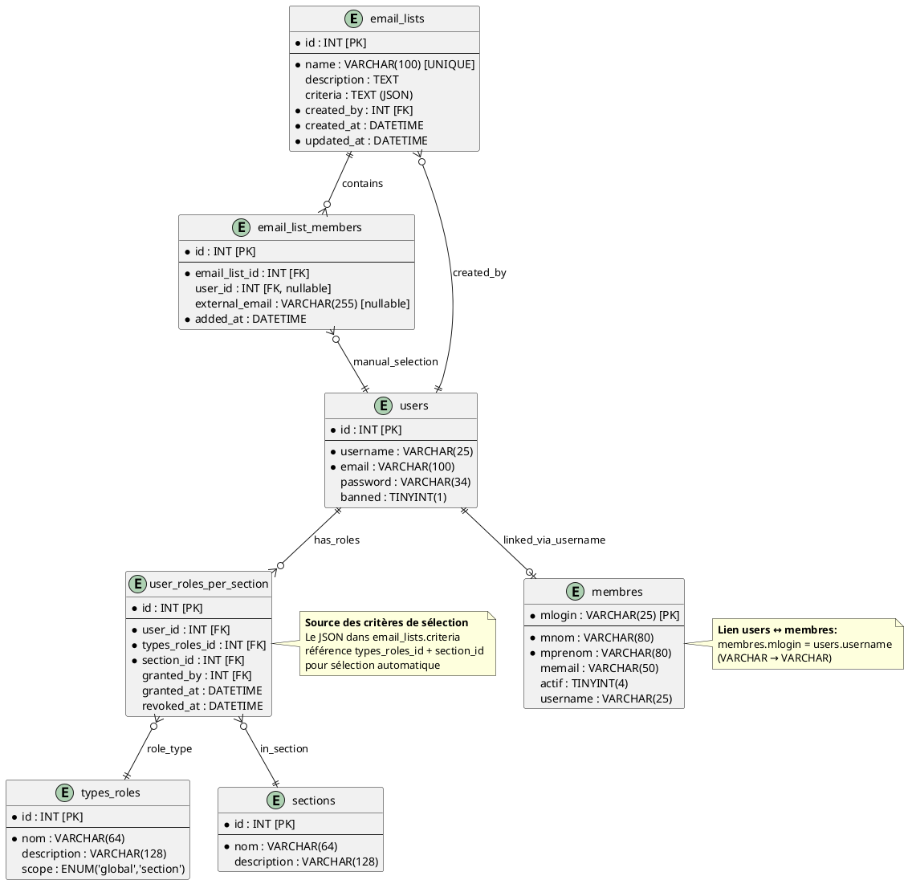
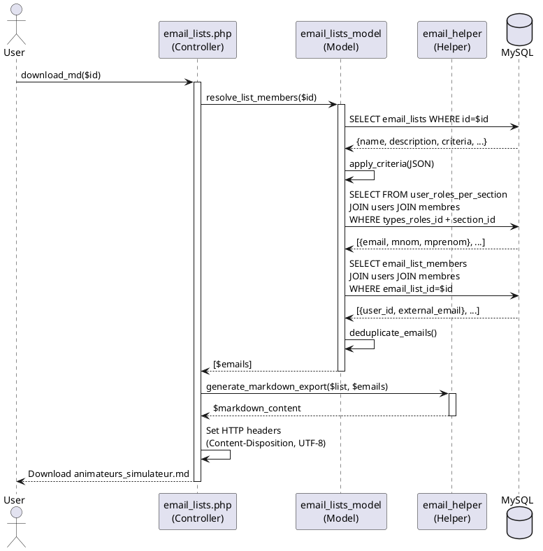

# Design Document - Gestion des Adresses Email dans GVV

**Projet:** GVV - Gestion Vol à voile
**Fonctionnalité:** Système de gestion des listes de diffusion email
**PRD:** [doc/prds/gestion_emails.md](../prds/gestion_emails.md)
**Date de création:** 2025-10-31
**Version:** 1.0
**Statut:** Proposition

---

## 1. Vue d'ensemble de l'architecture

### 1.1 Stack technique
- **Backend:** PHP 7.4 avec CodeIgniter 2.x
- **Base de données:** MySQL 5.x
- **Frontend:** Bootstrap 5, JavaScript ES6+
- **APIs navigateur:** Clipboard API, localStorage

### 1.2 Architecture MVC

```
┌─────────────────────────────────────────────────────────┐
│                     User Interface                       │
│  (Bootstrap 5 Views + JavaScript)                       │
└────────────────────┬────────────────────────────────────┘
                     │
┌────────────────────▼────────────────────────────────────┐
│              email_lists.php (Controller)                │
│  - index(), create(), edit(), delete()                  │
│  - export(), download_txt(), download_md()              │
└────────────────────┬────────────────────────────────────┘
                     │
┌────────────────────▼────────────────────────────────────┐
│         email_lists_model.php (Model)                    │
│  - CRUD operations                                       │
│  - Criteria resolution (JSON → SQL)                     │
│  - Member resolution (manual + external)                │
└────────────────────┬────────────────────────────────────┘
                     │
┌────────────────────▼────────────────────────────────────┐
│           MySQL Database (2 tables)                      │
│  - email_lists                                          │
│  - email_list_members                                   │
└─────────────────────────────────────────────────────────┘

        Helper: email_helper.php
        (Validation, formatting, export generation)
```

---

## 2. Base de données

### 2.1 Schéma des tables

#### Table: `email_lists`
Stocke les métadonnées des listes de diffusion.

```sql
CREATE TABLE `email_lists` (
  `id` INT UNSIGNED NOT NULL AUTO_INCREMENT,
  `name` VARCHAR(100) NOT NULL UNIQUE COLLATE utf8_bin,
  `description` TEXT,
  `criteria` TEXT COMMENT 'JSON: sélection par critères GVV, NULL si liste manuelle pure',
  `created_by` INT UNSIGNED NOT NULL,
  `created_at` DATETIME NOT NULL DEFAULT CURRENT_TIMESTAMP,
  `updated_at` DATETIME NOT NULL DEFAULT CURRENT_TIMESTAMP ON UPDATE CURRENT_TIMESTAMP,
  PRIMARY KEY (`id`),
  UNIQUE KEY `idx_name` (`name`),
  KEY `idx_created_by` (`created_by`),
  FOREIGN KEY (`created_by`) REFERENCES `users`(`id`) ON DELETE RESTRICT
) ENGINE=InnoDB DEFAULT CHARSET=utf8mb4 COLLATE=utf8mb4_unicode_ci;
```

**Champs:**
- `id`: Clé primaire auto-incrémentée
- `name`: Nom unique de la liste (sensible à la casse via COLLATE utf8_bin)
- `description`: Description optionnelle
- `criteria`: JSON stockant les critères de sélection automatique (NULL si sélection manuelle pure)
- `created_by`: FK vers users, utilisateur créateur
- `created_at`: Timestamp de création
- `updated_at`: Timestamp de dernière modification (auto-update)

#### Table: `email_list_members`
Stocke les membres ajoutés manuellement ou les adresses externes.

```sql
CREATE TABLE `email_list_members` (
  `id` INT UNSIGNED NOT NULL AUTO_INCREMENT,
  `email_list_id` INT UNSIGNED NOT NULL,
  `user_id` INT UNSIGNED DEFAULT NULL COMMENT 'FK vers users si membre GVV, NULL si externe',
  `external_email` VARCHAR(255) DEFAULT NULL COMMENT 'Email externe, NULL si user_id renseigné',
  `added_at` DATETIME NOT NULL DEFAULT CURRENT_TIMESTAMP,
  PRIMARY KEY (`id`),
  KEY `idx_email_list_id` (`email_list_id`),
  KEY `idx_user_id` (`user_id`),
  FOREIGN KEY (`email_list_id`) REFERENCES `email_lists`(`id`) ON DELETE CASCADE,
  FOREIGN KEY (`user_id`) REFERENCES `users`(`id`) ON DELETE CASCADE,
  CONSTRAINT `chk_member_type` CHECK (
    (`user_id` IS NOT NULL AND `external_email` IS NULL) OR
    (`user_id` IS NULL AND `external_email` IS NOT NULL)
  )
) ENGINE=InnoDB DEFAULT CHARSET=utf8mb4 COLLATE=utf8mb4_unicode_ci;
```

**Champs:**
- `id`: Clé primaire auto-incrémentée
- `email_list_id`: FK vers email_lists, ON DELETE CASCADE
- `user_id`: FK vers users si membre GVV (NULL si externe)
- `external_email`: Adresse email externe (NULL si user_id renseigné)
- `added_at`: Timestamp d'ajout
- **Contrainte:** Un enregistrement doit avoir SOIT user_id SOIT external_email (jamais les deux)

### 2.2 Types de listes

La combinaison des deux tables permet 3 types de listes :

1. **Liste dynamique (par critères):**
   - `email_lists.criteria` contient JSON
   - `email_list_members` peut être vide ou contenir des ajouts manuels supplémentaires
   - Exemple: "Instructeurs actifs" (critères) + 2 bénévoles ajoutés manuellement

2. **Liste statique (sélection manuelle):**
   - `email_lists.criteria` = NULL
   - `email_list_members` contient tous les membres (user_id renseigné)
   - Exemple: "Animateurs simulateur" (12 volontaires sélectionnés manuellement)

3. **Liste externe:**
   - `email_lists.criteria` = NULL
   - `email_list_members` contient des external_email
   - Exemple: "Auditeurs BIA 2024" (adresses importées depuis CSV)

### 2.3 Format JSON des critères

**Note:** Le système utilise la table `user_roles_per_section` existante qui gère les autorisations dans GVV. Cette table associe des utilisateurs à des rôles spécifiques par section, permettant une sélection dynamique basée sur les autorisations réelles.

Structure du champ `email_lists.criteria` :

```json
{
  "roles": [
    {
      "types_roles_id": 8,
      "section_id": 1
    },
    {
      "types_roles_id": 7,
      "section_id": 2
    }
  ],
  "member_status": [1],
  "logic": "OR"
}
```

**Champs:**
- `roles` (array d'objets): Liste des combinaisons rôle+section
  - `types_roles_id` (int): ID du rôle dans `types_roles` (ex: 8=tresorier, 7=bureau, 10=club-admin)
  - `section_id` (int): ID de la section dans `sections` (ex: 1=Planeur, 2=ULM, 3=Avion, 4=Général)
- `member_status` (array): Statuts des membres dans `membres.actif` (1=actif, 0=inactif, NULL=tous)
- `logic` (string): "AND" ou "OR" pour combiner les critères de rôles

**Note sur l'extensibilité:** Ce format JSON générique supporte tous les rôles définis dans `types_roles`, y compris les rôles futurs qui seront ajoutés au système (instructeurs, pilotes, etc.).

**Exemple de résolution:**
```sql
-- Sélection des utilisateurs ayant le rôle tresorier (8) dans section Planeur (1)
-- OU le rôle bureau (7) dans section ULM (2)
-- ET dont le membre est actif
SELECT DISTINCT u.id, u.email, m.mnom, m.mprenom
FROM user_roles_per_section urps
INNER JOIN users u ON urps.user_id = u.id
LEFT JOIN membres m ON u.username = m.mlogin
WHERE urps.revoked_at IS NULL
  AND (
    (urps.types_roles_id = 8 AND urps.section_id = 1)
    OR
    (urps.types_roles_id = 7 AND urps.section_id = 2)
  )
  AND m.actif IN (1);
```

---

## 3. Composants applicatifs

### 3.1 Controller: `application/controllers/email_lists.php`

**Responsabilités:**
- Gestion des requêtes HTTP
- Contrôle d'accès (secrétaires uniquement)
- Orchestration des opérations CRUD
- Génération des exports (TXT, Markdown)

**Actions publiques:**

```php
class Email_lists extends CI_Controller {

    // Liste des listes de diffusion
    public function index()

    // Formulaire de création
    public function create()

    // Sauvegarde d'une nouvelle liste
    public function store()

    // Formulaire de modification
    public function edit($id)

    // Sauvegarde des modifications
    public function update($id)

    // Suppression d'une liste
    public function delete($id)

    // Prévisualisation d'une liste avec export
    public function view($id)

    // Téléchargement fichier TXT
    public function download_txt($id)

    // Téléchargement fichier Markdown
    public function download_md($id)

    // API AJAX: Prévisualisation nombre de destinataires
    public function preview_count()

    // API AJAX: Résolution complète des membres
    public function resolve_members($id)
}
```

**Contrôle d'accès:**
```php
public function __construct() {
    parent::__construct();
    $this->load->library('dx_auth');

    if (!$this->dx_auth->is_role('secretaire')) {
        show_error('Accès refusé. Rôle secrétaire requis.', 403);
    }

    $this->load->model('email_lists_model');
    $this->load->helper('email_helper');
}
```

### 3.2 Model: `application/models/email_lists_model.php`

**Responsabilités:**
- Opérations CRUD sur les tables
- Résolution des critères JSON en requêtes SQL
- Résolution complète des membres (critères + manuels + externes)
- Dédoublonnage

**Méthodes principales:**

```php
class Email_lists_model extends CI_Model {

    // CRUD de base
    public function create_list($data)
    public function get_list($id)
    public function update_list($id, $data)
    public function delete_list($id)
    public function get_user_lists($user_id)

    // Gestion des critères (basée sur user_roles_per_section)
    public function build_criteria_json($selections)
    public function apply_criteria($criteria_json)
    public function get_available_roles()
    public function get_available_sections()
    public function get_users_by_role_and_section($types_roles_id, $section_id)

    // Gestion des membres manuels
    public function add_manual_member($list_id, $user_id)
    public function add_external_email($list_id, $email)
    public function remove_member($list_id, $member_id)
    public function get_manual_members($list_id)

    // Résolution complète
    public function resolve_list_members($list_id)

    // Utilitaires
    public function count_members($list_id)
    public function deduplicate_emails($emails)
}
```

**Exemple de résolution complète:**

```php
public function resolve_list_members($list_id) {
    $list = $this->get_list($list_id);
    $emails = [];

    // 1. Membres par critères depuis user_roles_per_section (si criteria n'est pas NULL)
    if ($list['criteria']) {
        $criteria_emails = $this->apply_criteria($list['criteria']);
        $emails = array_merge($emails, $criteria_emails);
    }

    // 2. Membres manuels (user_id)
    $manual = $this->db
        ->select('u.email, u.id as user_id, m.mnom, m.mprenom')
        ->from('email_list_members elm')
        ->join('users u', 'elm.user_id = u.id', 'inner')
        ->join('membres m', 'u.username = m.mlogin', 'left')
        ->where('elm.email_list_id', $list_id)
        ->where('elm.user_id IS NOT NULL')
        ->get()
        ->result_array();
    $emails = array_merge($emails, $manual);

    // 3. Emails externes
    $external = $this->db
        ->select('external_email as email')
        ->from('email_list_members')
        ->where('email_list_id', $list_id)
        ->where('external_email IS NOT NULL')
        ->get()
        ->result_array();
    $emails = array_merge($emails, $external);

    // 4. Dédoublonnage
    return $this->deduplicate_emails($emails);
}

/**
 * Applique les critères JSON basés sur user_roles_per_section
 *
 * @param string $criteria_json JSON avec structure roles/member_status/logic
 * @return array Tableau d'emails avec user_id, email, mnom, mprenom
 */
public function apply_criteria($criteria_json) {
    $criteria = json_decode($criteria_json, true);
    if (empty($criteria['roles'])) {
        return [];
    }

    $emails = [];

    foreach ($criteria['roles'] as $role_criteria) {
        $this->db->distinct();
        $this->db->select('u.id as user_id, u.email, m.mnom, m.mprenom');
        $this->db->from('user_roles_per_section urps');
        $this->db->join('users u', 'urps.user_id = u.id', 'inner');
        $this->db->join('membres m', 'u.username = m.mlogin', 'left');

        // Critère: rôle et section
        $this->db->where('urps.types_roles_id', $role_criteria['types_roles_id']);
        $this->db->where('urps.section_id', $role_criteria['section_id']);
        $this->db->where('urps.revoked_at IS NULL');

        // Filtre optionnel sur statut du membre
        if (!empty($criteria['member_status'])) {
            $this->db->where_in('m.actif', $criteria['member_status']);
        }

        $query = $this->db->get();
        $result = $query->result_array();
        $emails = array_merge($emails, $result);
    }

    return $emails;
}

/**
 * Récupère tous les rôles disponibles depuis types_roles
 *
 * @return array Tableau des rôles avec id, nom, description, scope
 */
public function get_available_roles() {
    return $this->db
        ->select('id, nom, description, scope, is_system_role')
        ->from('types_roles')
        ->order_by('display_order', 'ASC')
        ->get()
        ->result_array();
}

/**
 * Récupère toutes les sections disponibles
 *
 * @return array Tableau des sections avec id, nom, description
 */
public function get_available_sections() {
    return $this->db
        ->select('id, nom, description, acronyme, couleur')
        ->from('sections')
        ->order_by('id', 'ASC')
        ->get()
        ->result_array();
}
```

### 3.3 Helper: `application/helpers/email_helper.php`

**Responsabilités:**
- Validation d'adresses email
- Normalisation (lowercase, trim)
- Dédoublonnage
- Découpage en sous-listes
- Génération de fichiers d'export (TXT, Markdown)
- Génération de liens mailto

**Fonctions principales:**

```php
// Validation
function validate_email($email)

// Normalisation
function normalize_email($email)

// Dédoublonnage (case-insensitive)
function deduplicate_emails($emails)

// Découpage
function chunk_emails($emails, $size = 20)

// Export TXT
function generate_txt_export($emails, $separator = ',')

// Export Markdown
function generate_markdown_export($list_data, $emails)

// Génération mailto
function generate_mailto($emails, $params = [])

// Parsing import
function parse_text_emails($content)
function parse_csv_emails($content, $config)
```

**Exemple de génération Markdown:**

```php
function generate_markdown_export($list_data, $emails) {
    $md = "# Liste: {$list_data['name']}\n\n";
    $md .= "**Description:** {$list_data['description']}\n";
    $md .= "**Créée le:** {$list_data['created_at']}\n";
    $md .= "**Mise à jour:** {$list_data['updated_at']}\n";
    $md .= "**Nombre de destinataires:** " . count($emails) . "\n\n";

    $md .= "## Adresses (copier/coller)\n";
    $email_list = implode(', ', array_column($emails, 'email'));
    $md .= $email_list . "\n\n";

    $md .= "## Détails des membres\n\n";
    $md .= "| Nom | Prénom | Email |\n";
    $md .= "|-----|--------|-------|\n";

    foreach ($emails as $member) {
        $nom = $member['nom'] ?? '';
        $prenom = $member['prenom'] ?? '';
        $email = $member['email'];
        $md .= "| $nom | $prenom | $email |\n";
    }

    return $md;
}
```

### 3.4 Views

**Structure des vues:**

```
application/views/email_lists/
├── index.php                   # Liste des listes (tableau)
├── create.php                  # Formulaire de création
├── edit.php                    # Formulaire de modification
├── view.php                    # Prévisualisation + export
├── _criteria_tab.php           # Onglet sélection par critères
├── _manual_tab.php             # Onglet sélection manuelle
├── _import_tab.php             # Onglet import externe
├── _export_buttons.php         # Boutons d'export (presse-papier, fichiers, mailto)
├── _chunk_selector.php         # Sélecteur de découpage en parties
└── _mailto_form.php            # Formulaire paramètres mailto
```

**Pattern de navigation:**

```
index.php (Liste) → create.php (Création avec 3 onglets)
                 → edit.php (Modification avec 3 onglets)
                 → view.php (Prévisualisation + export)
                 → download_txt/download_md (Téléchargement)
```

**Interface de sélection par rôles (_criteria_tab.php):**

L'interface charge dynamiquement tous les rôles depuis `types_roles` et toutes les sections depuis `sections`, permettant ainsi de supporter automatiquement les rôles futurs (instructeurs, pilotes, etc.) sans modification de code.

```
┌─────────────────────────────────────────────────────┐
│ Sélection par rôles et sections                     │
├─────────────────────────────────────────────────────┤
│                                                      │
│ ┌─ Section: Planeur ────────────────────────────┐  │
│ │ ☐ club-admin (Administrateur club) [global]   │  │
│ │ ☐ bureau (Membre du bureau)                   │  │
│ │ ☐ tresorier (Trésorier)                        │  │
│ │ ☐ ca (Membre CA)                               │  │
│ │ ☐ planchiste (Planchiste)                      │  │
│ │ ☐ auto_planchiste (Auto-planchiste)            │  │
│ │ ☐ user (Utilisateur)                           │  │
│ └────────────────────────────────────────────────┘  │
│                                                      │
│ ┌─ Section: ULM ────────────────────────────────┐  │
│ │ ☐ club-admin (Administrateur club) [global]   │  │
│ │ ☐ bureau (Membre du bureau)                   │  │
│ │ ☐ tresorier (Trésorier)                        │  │
│ │ ...                                            │  │
│ └────────────────────────────────────────────────┘  │
│                                                      │
│ ┌─ Section: Avion ──────────────────────────────┐  │
│ │ ☐ club-admin (Administrateur club) [global]   │  │
│ │ ...                                            │  │
│ └────────────────────────────────────────────────┘  │
│                                                      │
│ Statut des membres:                                 │
│   ☐ Actifs uniquement                               │
│   ☐ Inactifs uniquement                             │
│   ☐ Tous                                            │
│                                                      │
│ Logique de combinaison:                             │
│   ● OU (un des rôles sélectionnés)                  │
│   ○ ET (tous les rôles sélectionnés)                │
│                                                      │
│ Aperçu: 12 destinataires                            │
│ [Prévisualiser] [Sauvegarder]                       │
└─────────────────────────────────────────────────────┘
```

**Fonctionnement:**
- Les rôles sont chargés depuis `get_available_roles()` et groupés par section
- Les rôles avec `scope='global'` sont affichés dans chaque section avec marqueur `[global]`
- Les checkboxes génèrent le JSON avec `types_roles_id` + `section_id`
- La prévisualisation AJAX appelle `preview_count()` pour afficher le nombre de destinataires
- Extensible automatiquement: nouveaux rôles apparaissent sans modification du code

### 3.5 JavaScript: `assets/js/email_lists.js`

**Responsabilités:**
- Copie presse-papier (Clipboard API)
- Découpage en sous-listes
- Génération liens mailto côté client
- Sauvegarde/restauration préférences (localStorage)
- AJAX pour prévisualisation en temps réel

**Fonctions principales:**

```javascript
// Copie dans le presse-papier
function copyToClipboard(text)

// Découpage en sous-listes
function chunkEmails(emails, size, partNumber)

// Génération mailto
function generateMailto(emails, params)

// localStorage
function saveMailtoPreferences(prefs)
function loadMailtoPreferences()

// AJAX prévisualisation
function previewMemberCount(criteria)
```

---

## 4. Metadata (Gvvmetadata.php)

Extension de `application/libraries/Gvvmetadata.php` pour les champs de `email_lists`.

```php
// Dans Gvvmetadata.php, ajouter :

$this->field['email_lists']['name']['Type'] = 'string';
$this->field['email_lists']['name']['Subtype'] = 'text';
$this->field['email_lists']['name']['Required'] = TRUE;

$this->field['email_lists']['description']['Type'] = 'string';
$this->field['email_lists']['description']['Subtype'] = 'textarea';

$this->field['email_lists']['criteria']['Type'] = 'string';
$this->field['email_lists']['criteria']['Subtype'] = 'json';
```

---

## 5. Flux de données

### 5.1 Création d'une liste par critères

```
[User] → create.php (onglet Critères)
         ↓ Sélection rôles, sections, statut
         ↓ Prévisualisation AJAX (preview_count)
         ↓ Soumission formulaire
         ↓
[Controller] → store()
               ↓ Validation
               ↓ build_criteria_json($selections)
               ↓ create_list($data)
               ↓
[Model] → INSERT INTO email_lists
          ↓
[DB] email_lists (criteria = JSON)
```

### 5.2 Export vers fichier Markdown

```
[User] → view.php ($list_id)
         ↓ Clic "Télécharger MD"
         ↓
[Controller] → download_md($id)
               ↓ resolve_list_members($id)
               ↓ generate_markdown_export($list, $members)
               ↓ Headers HTTP (Content-Disposition, UTF-8)
               ↓
[Browser] ← Téléchargement animateurs_simulateur.md
```

### 5.3 Résolution complète avec dédoublonnage

```
[Model] → resolve_list_members($list_id)
          ↓
          ├─→ apply_criteria(JSON) → SQL SELECT (rôles, sections, statut)
          ├─→ get_manual_members() → SQL SELECT (user_id)
          ├─→ get_external_emails() → SQL SELECT (external_email)
          ↓
          └─→ array_merge() → deduplicate_emails()
              ↓ array_unique (lowercase comparison)
              ↓
          [Retour] Array d'emails dédoublonnés
```

---

## 6. Décisions d'architecture

### 6.1 Pourquoi 2 tables au lieu de 1 ?

**Décision:** Séparation `email_lists` et `email_list_members`

**Justification:**
- **Normalisation:** Évite la duplication des métadonnées (nom, description, date)
- **Flexibilité:** Permet de combiner critères dynamiques + ajouts manuels
- **Performance:** Les critères sont réévalués à la volée, les ajouts manuels sont persistants
- **Intégrité:** ON DELETE CASCADE garantit la suppression en cascade des membres

**Alternative rejetée:** Une seule table avec JSON pour tout
- ❌ Difficile de gérer les relations avec users
- ❌ Pas de contraintes de FK
- ❌ Dédoublonnage complexe

### 6.2 Pourquoi localStorage pour les préférences ?

**Décision:** Sauvegarde des préférences mailto dans localStorage (côté client)

**Justification:**
- ✅ Pas de charge serveur
- ✅ Persistance par navigateur (pas par utilisateur)
- ✅ Rapide (pas de requête HTTP)
- ✅ Adapté pour des préférences UI non critiques

**Alternative rejetée:** Sauvegarde en base de données
- ❌ Charge serveur inutile
- ❌ Nécessite table supplémentaire
- ❌ Plus lent (requête HTTP à chaque chargement)

### 6.3 Pourquoi JSON pour les critères ?

**Décision:** Stockage des critères en JSON (champ TEXT)

**Justification:**
- ✅ Flexibilité : facile d'ajouter de nouveaux critères sans migration
- ✅ Lisibilité : structure claire et documentée
- ✅ CodeIgniter 2.x n'a pas de type JSON natif (contrairement à MySQL 5.7+)

**Alternative rejetée:** Colonnes booléennes pour chaque critère
- ❌ Rigide : ajout de critère = migration DB
- ❌ Nombreuses colonnes (role_instructeur, role_tresorier, etc.)

### 6.4 Pourquoi découpage côté client ?

**Décision:** Découpage en sous-listes fait en JavaScript

**Justification:**
- ✅ Pas de charge serveur
- ✅ Interactif : changement de taille sans rechargement
- ✅ Export séquentiel fluide

**Alternative rejetée:** Découpage côté serveur
- ❌ Requête HTTP à chaque changement de taille
- ❌ Moins interactif

---

## 7. Sécurité

### 7.1 Contrôle d'accès

**Niveau controller:**
```php
if (!$this->dx_auth->is_role('secretaire')) {
    show_error('Accès refusé', 403);
}
```

**Niveau base de données:**
- FK vers users avec ON DELETE RESTRICT : empêche suppression d'un utilisateur qui a créé des listes
- FK vers email_lists avec ON DELETE CASCADE : suppression en cascade des membres

### 7.2 Validation des entrées

**Validation email:**
```php
function validate_email($email) {
    return filter_var($email, FILTER_VALIDATE_EMAIL) !== FALSE;
}
```

**Protection XSS:**
- Utiliser `htmlspecialchars()` dans les vues
- CodeIgniter XSS filter activé

**Protection SQL Injection:**
- Utiliser Query Builder de CodeIgniter (pas de SQL brut)
- Paramètres préparés automatiquement

### 7.3 Journalisation

**Actions journalisées:**
- Création de liste : `log_message('info', "Liste créée: $name par user $user_id")`
- Modification : `log_message('info', "Liste modifiée: $id par user $user_id")`
- Suppression : `log_message('info', "Liste supprimée: $id par user $user_id")`

---

## 8. Performance

### 8.1 Index

**email_lists:**
- PRIMARY KEY sur `id`
- UNIQUE INDEX sur `name`
- INDEX sur `created_by` (pour get_user_lists)

**email_list_members:**
- PRIMARY KEY sur `id`
- INDEX sur `email_list_id` (jointures fréquentes)
- INDEX sur `user_id` (jointures avec users)

### 8.2 Optimisation des requêtes

**Résolution des critères via user_roles_per_section:**
```sql
-- Optimisé avec index FK existants sur user_roles_per_section
SELECT DISTINCT u.id, u.email, m.mnom, m.mprenom
FROM user_roles_per_section urps
INNER JOIN users u ON urps.user_id = u.id
LEFT JOIN membres m ON u.username = m.mlogin
WHERE urps.types_roles_id IN (?)
  AND urps.section_id IN (?)
  AND urps.revoked_at IS NULL
  AND m.actif IN (?);
```

**Index requis:**
- `user_roles_per_section(user_id)` - Existe (FK)
- `user_roles_per_section(types_roles_id)` - Existe (FK)
- `user_roles_per_section(section_id)` - Existe (FK)
- `users(username)` - **À ajouter** pour optimiser jointure avec membres

**Dédoublonnage:**
- Fait en PHP avec `array_unique()` après normalisation lowercase
- Plus rapide que `DISTINCT` sur plusieurs tables avec JOINs

### 8.3 Cache (à évaluer en Phase 7)

**Candidats pour cache:**
- Listes par critères : cache de 5 minutes (expire automatiquement)
- Non implémenté initialement, à ajouter si tests de performance montrent nécessité

---

## 9. Diagrammes

### 9.1 Diagramme ER (PlantUML)



### 9.2 Diagramme de séquence - Export Markdown



---

## 10. Migration

### 10.1 Fichier de migration

**Fichier:** `application/migrations/043_create_email_lists.php`

```php
<?php defined('BASEPATH') OR exit('No direct script access allowed');

class Migration_Create_email_lists extends CI_Migration {

    public function up() {
        // Table email_lists
        $this->dbforge->add_field([
            'id' => [
                'type' => 'INT',
                'unsigned' => TRUE,
                'auto_increment' => TRUE
            ],
            'name' => [
                'type' => 'VARCHAR',
                'constraint' => 100,
                'null' => FALSE
            ],
            'description' => [
                'type' => 'TEXT',
                'null' => TRUE
            ],
            'criteria' => [
                'type' => 'TEXT',
                'null' => TRUE,
                'comment' => 'JSON: critères de sélection'
            ],
            'created_by' => [
                'type' => 'INT',
                'unsigned' => TRUE,
                'null' => FALSE
            ],
            'created_at' => [
                'type' => 'DATETIME',
                'null' => FALSE
            ],
            'updated_at' => [
                'type' => 'DATETIME',
                'null' => FALSE
            ]
        ]);
        $this->dbforge->add_key('id', TRUE);
        $this->dbforge->create_table('email_lists');

        // Index unique sur name
        $this->db->query('ALTER TABLE email_lists ADD UNIQUE INDEX idx_name (name)');

        // FK vers users
        $this->db->query('ALTER TABLE email_lists ADD CONSTRAINT fk_email_lists_created_by FOREIGN KEY (created_by) REFERENCES users(id) ON DELETE RESTRICT');

        // Table email_list_members
        $this->dbforge->add_field([
            'id' => [
                'type' => 'INT',
                'unsigned' => TRUE,
                'auto_increment' => TRUE
            ],
            'email_list_id' => [
                'type' => 'INT',
                'unsigned' => TRUE,
                'null' => FALSE
            ],
            'user_id' => [
                'type' => 'INT',
                'unsigned' => TRUE,
                'null' => TRUE
            ],
            'external_email' => [
                'type' => 'VARCHAR',
                'constraint' => 255,
                'null' => TRUE
            ],
            'added_at' => [
                'type' => 'DATETIME',
                'null' => FALSE
            ]
        ]);
        $this->dbforge->add_key('id', TRUE);
        $this->dbforge->create_table('email_list_members');

        // Index
        $this->db->query('ALTER TABLE email_list_members ADD INDEX idx_email_list_id (email_list_id)');
        $this->db->query('ALTER TABLE email_list_members ADD INDEX idx_user_id (user_id)');

        // FK
        $this->db->query('ALTER TABLE email_list_members ADD CONSTRAINT fk_elm_email_list_id FOREIGN KEY (email_list_id) REFERENCES email_lists(id) ON DELETE CASCADE');
        $this->db->query('ALTER TABLE email_list_members ADD CONSTRAINT fk_elm_user_id FOREIGN KEY (user_id) REFERENCES users(id) ON DELETE CASCADE');

        // Contrainte CHECK
        $this->db->query('ALTER TABLE email_list_members ADD CONSTRAINT chk_member_type CHECK ((user_id IS NOT NULL AND external_email IS NULL) OR (user_id IS NULL AND external_email IS NOT NULL))');
    }

    public function down() {
        $this->dbforge->drop_table('email_list_members', TRUE);
        $this->dbforge->drop_table('email_lists', TRUE);
    }
}
```

**Mise à jour de `application/config/migration.php`:**
```php
$config['migration_version'] = 43;
```

---

## 11. Tests

### 11.1 Tests unitaires (PHPUnit)

**Fichiers de tests:**
- `application/tests/unit/helpers/EmailHelperTest.php`
- `application/tests/unit/helpers/EmailHelperExportTest.php`

**Cas de tests (exemples):**
```php
class EmailHelperTest extends PHPUnit\Framework\TestCase {

    public function testValidateEmail_ValidEmail_ReturnsTrue() {
        $this->assertTrue(validate_email('test@example.com'));
    }

    public function testValidateEmail_InvalidEmail_ReturnsFalse() {
        $this->assertFalse(validate_email('invalid-email'));
    }

    public function testDeduplicateEmails_CaseInsensitive() {
        $emails = [
            ['email' => 'test@example.com'],
            ['email' => 'TEST@EXAMPLE.COM'],
            ['email' => 'other@example.com']
        ];
        $result = deduplicate_emails($emails);
        $this->assertCount(2, $result);
    }

    public function testChunkEmails_20PerPart() {
        $emails = range(1, 87);
        $chunks = chunk_emails($emails, 20);
        $this->assertCount(5, $chunks);
        $this->assertCount(20, $chunks[0]);
        $this->assertCount(7, $chunks[4]);
    }
}
```

### 11.2 Tests d'intégration (MySQL)

**Fichiers de tests:**
- `application/tests/mysql/EmailListsModelTest.php`

**Cas de tests (exemples):**
```php
class EmailListsModelTest extends PHPUnit\Framework\TestCase {

    protected function setUp(): void {
        // Connexion DB de test
        $this->CI =& get_instance();
        $this->CI->load->model('email_lists_model');
    }

    public function testCreateList_WithCriteria_InsertsRecord() {
        $data = [
            'name' => 'Test Liste',
            'description' => 'Test',
            'criteria' => json_encode(['roles' => ['instructeur']]),
            'created_by' => 1
        ];
        $id = $this->CI->email_lists_model->create_list($data);
        $this->assertGreaterThan(0, $id);

        // Cleanup
        $this->CI->email_lists_model->delete_list($id);
    }

    public function testResolveListMembers_WithManualAndExternal_ReturnsDeduplicated() {
        // Test avec liste contenant critères + manuels + externes
        // Vérifier dédoublonnage
    }
}
```

---

## 12. Évolutions futures possibles

### 12.1 Import bidirectionnel Markdown
- Permettre la réimportation d'un fichier .md modifié
- Détection des changements et synchronisation

### 12.2 Historique des envois
- Tracker quand une liste a été utilisée pour un envoi
- Statistiques d'utilisation

### 12.3 Templates de messages
- Sauvegarder des templates de titre/corps de message
- Réutilisables avec variables (ex: `{{prenom}}`)

### 12.4 API REST
- Endpoints JSON pour intégrations externes
- Webhook lors de modifications de listes

---

**Version:** 1.0
**Date:** 2025-10-31
**Auteur:** Claude Code
**Statut:** Proposition - À valider
