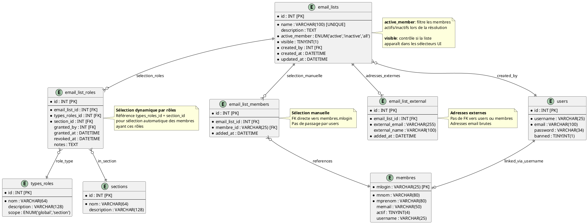

# Design Document - Gestion des Adresses Email dans GVV

**Projet:** GVV - Gestion Vol à voile
**Fonctionnalité:** Système de gestion des listes de diffusion email
**PRD:** [doc/prds/gestion_emails.md](../prds/gestion_emails.md)
**Date de création:** 2025-10-31
**Version:** 1.0
**Statut:** Proposition

---

## 1. Vue d'ensemble de l'architecture

### 1.1 Stack technique
- **Backend:** PHP 7.4 avec CodeIgniter 2.x
- **Base de données:** MySQL 5.x
- **Frontend:** Bootstrap 5, JavaScript ES6+
- **APIs navigateur:** Clipboard API, localStorage

### 1.2 Architecture MVC

```
┌─────────────────────────────────────────────────────────┐
│                     User Interface                      │
│  (Bootstrap 5 Views + JavaScript)                       │
└────────────────────┬────────────────────────────────────┘
                     │
┌────────────────────▼────────────────────────────────────┐
│              email_lists.php (Controller)               │
│  - index(), create(), edit(), delete()                  │
│  - export(), download_txt()                             │
└────────────────────┬────────────────────────────────────┘
                     │
┌────────────────────▼────────────────────────────────────┐
│         email_lists_model.php (Model)                   │
│  - CRUD operations                                      │
│  - Member resolution (manual + external)                │
└────────────────────┬────────────────────────────────────┘
                     │
┌────────────────────▼────────────────────────────────────┐
│           MySQL Database (4 tables)                     │
│  - email_lists                                          |
|  - email_list_roles (selection sur critères)            │
│  - email_list_members (selection manuelle)              │
│  - email_list_external (external emails)                │
└─────────────────────────────────────────────────────────┘

        Helper: email_helper.php
        (Validation, formatting, export generation)
```

---

## 2. Base de données

### 2.1 Schéma des tables

#### Table: `email_lists`

Cette table permet de manipuler et stocker les listes de diffusion.

```sql
CREATE TABLE `email_lists` (
  `id` INT UNSIGNED NOT NULL AUTO_INCREMENT,
  `name` VARCHAR(100) NOT NULL UNIQUE COLLATE utf8_bin,
  `description` TEXT,
  `active_member` ENUM('active', 'inactive', 'all') NOT NULL DEFAULT 'active',
  `visible` TINYINT(1),
  `created_by` INT UNSIGNED NOT NULL,
  `created_at` DATETIME NOT NULL DEFAULT CURRENT_TIMESTAMP,
  `updated_at` DATETIME NOT NULL DEFAULT CURRENT_TIMESTAMP ON UPDATE CURRENT_TIMESTAMP,
  PRIMARY KEY (`id`),
  UNIQUE KEY `idx_name` (`name`),
  KEY `idx_created_by` (`created_by`),
  FOREIGN KEY (`created_by`) REFERENCES `users`(`id`) ON DELETE RESTRICT
) ENGINE=InnoDB DEFAULT CHARSET=utf8mb4 COLLATE=utf8mb4_unicode_ci;
```

**Champs:**
- `id`: Clé primaire auto-incrémentée
- `name`: Nom unique de la liste (sensible à la casse via COLLATE utf8_bin)
- `description`: Description optionnelle
- `active_member`: défini si on inclut les membres non actif
- `visible`: la liste est visible dans les choix, ou pas
- `created_by`: FK vers users, utilisateur créateur
- `created_at`: Timestamp de création
- `updated_at`: Timestamp de dernière modification (auto-update)

#### Table: `email_list_roles`

Cette table permet de gérer la selection dynamique. Elle contient
des éléments qui pointent sur une liste d'email (pour définir à quelle liste ils se rapportent) et des pointeurs sur des rôles.

Quand il existe un élément dans cette table il définit que le rôle associé doit être prix en compte dans la selection des membres.

```sql
CREATE TABLE `email_list_roles` (
  `id` int(11) NOT NULL,
  `email_list_id` int(11) NOT NULL,
  `types_roles_id` int(11) NOT NULL,
  `section_id` int(11) NOT NULL,
  `granted_by` int(11) DEFAULT NULL,
  `granted_at` datetime NOT NULL,
  `revoked_at` datetime DEFAULT NULL,
  `notes` text DEFAULT NULL
) ENGINE=InnoDB DEFAULT CHARSET=utf8mb4 COLLATE=utf8mb4_general_ci;
```

#### Table: `email_list_members`

Stocke les membres internes ajoutés manuellement à une liste.

```sql
CREATE TABLE `email_list_members` (
  `id` INT UNSIGNED NOT NULL AUTO_INCREMENT,
  `email_list_id` INT UNSIGNED NOT NULL,
  `membre_id` VARCHAR() NOT NULL,
  `added_at` DATETIME NOT NULL DEFAULT CURRENT_TIMESTAMP,
  PRIMARY KEY (`id`),
  KEY `idx_email_list_id` (`email_list_id`),
  KEY `idx_user_id` (`user_id`),
  FOREIGN KEY (`email_list_id`) REFERENCES `email_lists`(`id`) ON DELETE CASCADE,
  FOREIGN KEY (`membre_id`) REFERENCES `membres`(`mlogin`) ON DELETE CASCADE
) ENGINE=InnoDB DEFAULT CHARSET=utf8mb4 COLLATE=utf8mb4_unicode_ci;
```

**Champs:**
- `id`: Clé primaire auto-incrémentée
- `email_list_id`: FK vers email_lists, ON DELETE CASCADE
- `membre_id`: FK vers membres, membre ajouté manuellement (NOT NULL)
- `added_at`: Timestamp d'ajout

#### Table: `email_list_external`

Stocke les adresses email externes ajoutées à une liste.

```sql
CREATE TABLE `email_list_external` (
  `id` INT UNSIGNED NOT NULL AUTO_INCREMENT,
  `email_list_id` INT UNSIGNED NOT NULL,
  `external_email` VARCHAR(255) NOT NULL,
  `external_name` VARCHAR(100) DEFAULT NULL COMMENT 'Nom optionnel pour affichage',
  `added_at` DATETIME NOT NULL DEFAULT CURRENT_TIMESTAMP,
  PRIMARY KEY (`id`),
  KEY `idx_email_list_id` (`email_list_id`),
  FOREIGN KEY (`email_list_id`) REFERENCES `email_lists`(`id`) ON DELETE CASCADE
) ENGINE=InnoDB DEFAULT CHARSET=utf8mb4 COLLATE=utf8mb4_unicode_ci;
```

**Champs:**
- `id`: Clé primaire auto-incrémentée
- `email_list_id`: FK vers email_lists, ON DELETE CASCADE
- `external_email`: Adresse email externe (NOT NULL)
- `external_name`: Nom optionnel associé à l'adresse externe
- `added_at`: Timestamp d'ajout

### 2.2 Diagramme ER

Ce diagramme montre les relations entre les tables du système de gestion des listes email.



**Source:** [email_lists_er.puml](diagrams/email_lists_er.puml)

**Points clés:**
- Séparation claire entre membres internes (`email_list_members`) et externes (`email_list_external`)
- Utilisation de `email_list_roles` pour la sélection dynamique par critères
- Liens entre `users` et `membres` via `username`/`mlogin`

### 2.3 Types de source d'adresse

Une liste contient:
* des rôles sélectionnés
* des membres sélectionnés manuellement
* des adresses email externes saisies ou importées

---

## 3. Composants applicatifs

### 3.1 Controller: `application/controllers/email_lists.php`

**Responsabilités:**
- Gestion des requêtes HTTP
- Contrôle d'accès (secrétaires uniquement)
- Orchestration des opérations CRUD
- Génération des exports (TXT)

**Actions publiques:**

```php
class Email_lists extends CI_Controller {

    // Liste des listes de diffusion
    public function index()

    // Formulaire de création
    public function create()

    // Sauvegarde d'une nouvelle liste
    public function store()

    // Formulaire de modification
    public function edit($id)

    // Sauvegarde des modifications
    public function update($id)

    // Suppression d'une liste
    public function delete($id)

    // Prévisualisation d'une liste avec export
    public function view($id)

    // Téléchargement fichier TXT
    public function download_txt($id)


    // API AJAX: Prévisualisation nombre de destinataires
    public function preview_count()

    // API AJAX: Résolution complète des membres
    // return a json answer with a textual field "textual_email_list" containing a string with the emails 
    // separated by commas. There is no duplicate in the list.
    public function textual_list($list_id)
}
```

**Contrôle d'accès:**
```php
public function __construct() {
    parent::__construct();
    $this->load->library('dx_auth');

    if (!$this->dx_auth->is_role('secretaire')) {
        show_error('Accès refusé. Rôle secrétaire requis.', 403);
    }

    $this->load->model('email_lists_model');
    $this->load->helper('email_helper');
}
```

### 3.2 Model: `application/models/email_lists_model.php`

**Responsabilités:**
- Opérations CRUD sur les tables
- Résolution des critères JSON en requêtes SQL
- Résolution complète des listes (critères + manuels + externes)
- Dédoublonnage

**Méthodes principales:**

```php
class Email_lists_model extends CI_Model {

    // CRUD de base
    public function create_list($data)
    public function get_list($id)
    public function update_list($id, $data)
    public function delete_list($id)
    public function get_user_lists($user_id)

    // Gestion des rôles (table email_list_roles)
    public function add_role_to_list($list_id, $types_roles_id, $section_id)
    public function remove_role_from_list($list_id, $role_id)
    public function get_list_roles($list_id)
    public function get_available_roles()
    public function get_available_sections()

    // Gestion des membres manuels internes
    public function add_manual_member($list_id, $membre_id)
    public function remove_manual_member($list_id, $member_id)
    public function get_manual_members($list_id)

    // Gestion des adresses externes
    public function add_external_email($list_id, $email, $name = null)
    public function remove_external_email($list_id, $external_id)
    public function get_external_emails($list_id)

    // Résolution complète
    public function textual_list($list_id)

    // Utilitaires
    public function count_members($list_id)
    public function deduplicate_emails($emails)
}
```

**Exemple de résolution complète:**

```php
public function textual_list($list_id) {
    $list = $this->get_list($list_id);
    $emails = [];

    // 1. Membres par rôles (table email_list_roles)
    $roles = $this->db
        ->select('elr.types_roles_id, elr.section_id')
        ->from('email_list_roles elr')
        ->where('elr.email_list_id', $list_id)
        ->where('elr.revoked_at IS NULL')
        ->get()
        ->result_array();

    foreach ($roles as $role) {
        $role_members = $this->db
            ->select('m.memail as email, m.mnom, m.mprenom, m.mlogin')
            ->from('user_roles_per_section urps')
            ->join('users u', 'urps.user_id = u.id', 'inner')
            ->join('membres m', 'u.username = m.mlogin', 'inner')
            ->where('urps.types_roles_id', $role['types_roles_id'])
            ->where('urps.section_id', $role['section_id'])
            ->where('urps.revoked_at IS NULL')
            ->where('m.actif', $list['active_member'] == 'active' ? 1 : ($list['active_member'] == 'inactive' ? 0 : NULL), FALSE)
            ->get()
            ->result_array();
        $emails = array_merge($emails, $role_members);
    }

    // 2. Membres manuels internes (table email_list_members)
    $manual = $this->db
        ->select('m.memail as email, m.mnom, m.mprenom, m.mlogin')
        ->from('email_list_members elm')
        ->join('membres m', 'elm.membre_id = m.mlogin', 'inner')
        ->where('elm.email_list_id', $list_id)
        ->get()
        ->result_array();
    $emails = array_merge($emails, $manual);

    // 3. Emails externes (table email_list_external)
    $external = $this->db
        ->select('external_email as email, external_name as name')
        ->from('email_list_external')
        ->where('email_list_id', $list_id)
        ->get()
        ->result_array();
    $emails = array_merge($emails, $external);

    // 4. Dédoublonnage
    return $this->deduplicate_emails($emails);
}

/**
 * Récupère tous les rôles disponibles depuis types_roles
 *
 * @return array Tableau des rôles avec id, nom, description, scope
 */
public function get_available_roles() {
    return $this->db
        ->select('id, nom, description, scope, is_system_role')
        ->from('types_roles')
        ->order_by('display_order', 'ASC')
        ->get()
        ->result_array();
}

/**
 * Récupère toutes les sections disponibles
 *
 * @return array Tableau des sections avec id, nom, description
 */
public function get_available_sections() {
    return $this->db
        ->select('id, nom, description, acronyme, couleur')
        ->from('sections')
        ->order_by('id', 'ASC')
        ->get()
        ->result_array();
}
```

### 3.3 Helper: `application/helpers/email_helper.php`

**Responsabilités:**
- Validation d'adresses email
- Normalisation (lowercase, trim)
- Dédoublonnage
- Découpage en sous-listes
- Génération de fichiers d'export (TXT)
- Génération de liens mailto

**Fonctions principales:**

```php
// Validation
function validate_email($email)

// Normalisation
function normalize_email($email)

// Dédoublonnage (case-insensitive)
function deduplicate_emails($emails)

// Découpage
function chunk_emails($emails, $size = 20)

// Export TXT
function generate_txt_export($emails, $separator = ',')


// Génération mailto
function generate_mailto($emails, $params = [])

// Parsing import
function parse_text_emails($content)
function parse_csv_emails($content, $config)
```


### 3.4 Views

**Structure des vues:**

```
application/views/email_lists/
├── index.php                   # Liste des listes (tableau)
├── create.php                  # Formulaire de création
├── edit.php                    # Formulaire de modification
├── view.php                    # Prévisualisation + export
├── _criteria_tab.php           # Onglet sélection par critères
├── _manual_tab.php             # Onglet sélection manuelle
├── _import_tab.php             # Onglet import externe
├── _export_buttons.php         # Boutons d'export (presse-papier, fichiers, mailto)
├── _chunk_selector.php         # Sélecteur de découpage en parties
└── _mailto_form.php            # Formulaire paramètres mailto
```

**Pattern de navigation:**

```
index.php (Liste) → create.php (Création avec 3 onglets)
                 → edit.php (Modification avec 3 onglets)
                 → view.php (Prévisualisation + export)
                 → download_txt (Téléchargement)
```

**Interface de sélection par rôles (_criteria_tab.php):**

L'interface charge dynamiquement tous les rôles depuis `types_roles` et toutes les sections depuis `sections`, permettant ainsi de supporter automatiquement les rôles futurs (instructeurs, pilotes, etc.) sans modification de code.

```
┌─────────────────────────────────────────────────────┐
│ Sélection par rôles et sections                     │
├─────────────────────────────────────────────────────┤
│                                                      │
│ ┌─ Section: Planeur ────────────────────────────┐  │
│ │ ☐ club-admin (Administrateur club) [global]   │  │
│ │ ☐ bureau (Membre du bureau)                   │  │
│ │ ☐ tresorier (Trésorier)                        │  │
│ │ ☐ ca (Membre CA)                               │  │
│ │ ☐ planchiste (Planchiste)                      │  │
│ │ ☐ auto_planchiste (Auto-planchiste)            │  │
│ │ ☐ user (Utilisateur)                           │  │
│ └────────────────────────────────────────────────┘  │
│                                                      │
│ ┌─ Section: ULM ────────────────────────────────┐  │
│ │ ☐ club-admin (Administrateur club) [global]   │  │
│ │ ☐ bureau (Membre du bureau)                   │  │
│ │ ☐ tresorier (Trésorier)                        │  │
│ │ ...                                            │  │
│ └────────────────────────────────────────────────┘  │
│                                                      │
│ ┌─ Section: Avion ──────────────────────────────┐  │
│ │ ☐ club-admin (Administrateur club) [global]   │  │
│ │ ...                                            │  │
│ └────────────────────────────────────────────────┘  │
│                                                      │
│ Statut des membres:                                 │
│   ☐ Actifs uniquement                               │
│   ☐ Inactifs uniquement                             │
│   ☐ Tous                                            │
│                                                      │
│ Logique de combinaison:                             │
│   ● OU (un des rôles sélectionnés)                  │
│   ○ ET (tous les rôles sélectionnés)                │
│                                                      │
│ Aperçu: 12 destinataires                            │
│ [Prévisualiser] [Sauvegarder]                       │
└─────────────────────────────────────────────────────┘
```

**Fonctionnement:**
- Les rôles sont chargés depuis `get_available_roles()` et groupés par section
- Les rôles avec `scope='global'` sont affichés dans chaque section avec marqueur `[global]`
- Les checkboxes génèrent le JSON avec `types_roles_id` + `section_id`
- La prévisualisation AJAX appelle `preview_count()` pour afficher le nombre de destinataires
- Extensible automatiquement: nouveaux rôles apparaissent sans modification du code

**Interface de découpage (_chunk_selector.php):**
```
┌─────────────────────────────────────────────────────────┐
│ Liste: Membres actifs (87 destinataires)                │
├─────────────────────────────────────────────────────────┤
│ Taille des sous-listes: [20 ▼] destinataires            │
│                                                         │
│ → Nombre de parties nécessaires: 5                      │
│                                                         │
│ Sélectionner la partie à exporter:                      │
│ ● Partie: [1 ▼] sur 5                        │
│                                                         │
│ Partie 1: destinataires 1-20                            │
│ Partie 2: destinataires 21-40                           │
│ Partie 3: destinataires 41-60                           │
│ Partie 4: destinataires 61-80                           │
│ Partie 5: destinataires 81-87                           │
│                                                         │
│ [Prévisualiser partie] [Copier] [Ouvrir client mail]    │
└─────────────────────────────────────────────────────────┘
```

**Interface d'export vers client mail (_mailto_form.php):**
```
┌─────────────────────────────────────────────────────────┐
│ Paramètres d'envoi                                      │
├─────────────────────────────────────────────────────────┤
│ Placer les destinataires en:                            │
│ ● TO (À)    ○ CC (Copie)    ○ BCC (Copie cachée)        │
│                                                         │
│ Titre du message:                                       │
│ [Information importante - Assemblée générale       ]    │
│                                                         │
│ Adresse de destinataire si liste en BCC:                │
│ [secretaire@club-aviation.fr                       ]    │
│                                                         │
│ [Ouvrir le client de messagerie]                        │
└─────────────────────────────────────────────────────────┘
```

### 3.5 JavaScript: `assets/js/email_lists.js`

**Responsabilités:**
- Copie presse-papier (Clipboard API)
- Découpage en sous-listes
- Génération liens mailto côté client
- Sauvegarde/restauration préférences (localStorage)
- AJAX pour prévisualisation en temps réel

**Fonctions principales:**

```javascript
// Copie dans le presse-papier
function copyToClipboard(text)

// Découpage en sous-listes
function chunkEmails(emails, size, partNumber)

// Génération mailto
function generateMailto(emails, params)

// localStorage
function saveMailtoPreferences(prefs)
function loadMailtoPreferences()

// AJAX prévisualisation
function previewMemberCount(criteria)
```

---

## 4. Metadata (Gvvmetadata.php)

Extension de `application/libraries/Gvvmetadata.php` pour les champs de `email_lists`.

```php
// Dans Gvvmetadata.php, ajouter :

$this->field['email_lists']['name']['Type'] = 'string';
$this->field['email_lists']['name']['Subtype'] = 'text';
$this->field['email_lists']['name']['Required'] = TRUE;

$this->field['email_lists']['description']['Type'] = 'string';
$this->field['email_lists']['description']['Subtype'] = 'textarea';

$this->field['email_lists']['criteria']['Type'] = 'string';
$this->field['email_lists']['criteria']['Subtype'] = 'json';
```

---

## 5. Flux de données

### 5.1 Création d'une liste par critères

```
[User] → create.php (onglet Critères)
         ↓ Sélection rôles, sections, statut
         ↓ Prévisualisation AJAX (preview_count)
         ↓ Soumission formulaire
         ↓
[Controller] → store()
               ↓ Validation
               ↓ build_criteria_json($selections)
               ↓ create_list($data)
               ↓
[Model] → INSERT INTO email_lists
          ↓
[DB] email_lists (criteria = JSON)
```

### 5.2 Export vers fichier TXT

```
[User] → view.php ($list_id)
         ↓ Clic "Télécharger TXT"
         ↓
[Controller] → download_txt($id)
               ↓ textual_list($id) (Model)
               ↓ generate_txt_export($list, $members) (Helper)
               ↓ Headers HTTP (Content-Disposition, UTF-8)
               ↓
[Browser] ← Téléchargement animateurs_simulateur.txt
```

### 5.3 Résolution complète avec dédoublonnage

```
[Model] → textual_list($list_id)
          ↓
          ├─→ Résolution par rôles → SQL SELECT via email_list_roles + user_roles_per_section
          ├─→ get_manual_members() → SQL SELECT (membre_id)
          ├─→ get_external_emails() → SQL SELECT (external_email)
          ↓
          └─→ array_merge() → deduplicate_emails()
              ↓ array_unique (lowercase comparison)
              ↓
          [Retour] Array d'emails dédoublonnés (sans doublons)
```

---

## 6. Décisions d'architecture

### 6.1 Pourquoi 4 tables au lieu de 1 ou 2 ?

**Décision:** Séparation `email_lists`, `email_list_roles`, `email_list_members`, et `email_list_external`

**Justification de la séparation email_lists / sources:**
- **Normalisation:** Évite la duplication des métadonnées (nom, description, date)
- **Flexibilité:** Permet de combiner sélection dynamique par rôles + ajouts manuels + emails externes
- **Performance:** Les rôles sont réévalués à la volée, les ajouts manuels sont persistants
- **Intégrité:** ON DELETE CASCADE garantit la suppression en cascade

**Justification de la table email_list_roles séparée:**
- **Simplicité:** Table simple avec FK vers rôles et sections existants
- **Pas de JSON:** Évite le parsing et validation côté application
- **Requêtable:** Possibilité de faire des requêtes SQL directes (rapports, stats)
- **Intégrité référentielle:** FK vers `types_roles` et `sections` avec ON DELETE RESTRICT
- **Audit:** Traçabilité avec `granted_by`, `granted_at`, `revoked_at`

**Justification de la séparation membres internes / externes:**
- **Type safety:** Pas de colonnes nullables ni de CHECK constraints complexes
- **Intégrité référentielle:** FK non-nullable sur `membre_id` dans `email_list_members`
- **Index efficiency:** Meilleure performance des index sans valeurs NULL
- **Clarté sémantique:** Trois types d'entités clairement séparés (rôles / membres / externes)
- **Extension future:** Possibilité d'ajouter des champs spécifiques par type
- **Alignement UI:** L'interface utilisateur sépare ces trois concepts

**Alternative rejetée 1:** Une seule table avec JSON pour tout
- ❌ Difficile de gérer les relations avec membres
- ❌ Pas de contraintes de FK
- ❌ Parsing JSON côté application

**Alternative rejetée 2:** Critères JSON dans `email_lists.criteria`
- ❌ Pas de validation au niveau DB
- ❌ Impossible de faire des requêtes SQL sur les critères
- ❌ Pas d'audit trail (qui a ajouté quoi, quand)

### 6.2 Pourquoi localStorage pour les préférences ?

**Décision:** Sauvegarde des préférences mailto dans localStorage (côté client)

**Justification:**
- ✅ Pas de charge serveur
- ✅ Persistance par navigateur (pas par utilisateur)
- ✅ Rapide (pas de requête HTTP)
- ✅ Adapté pour des préférences UI non critiques

**Alternative rejetée:** Sauvegarde en base de données
- ❌ Charge serveur inutile
- ❌ Nécessite table supplémentaire
- ❌ Plus lent (requête HTTP à chaque chargement)

### 6.3 Pourquoi découpage côté client ?

**Décision:** Découpage en sous-listes fait en JavaScript

**Justification:**
- ✅ Pas de charge serveur
- ✅ Interactif : changement de taille sans rechargement
- ✅ Export séquentiel fluide

**Alternative rejetée:** Découpage côté serveur
- ❌ Requête HTTP à chaque changement de taille
- ❌ Moins interactif

---

## 7. Sécurité

### 7.1 Contrôle d'accès

**Niveau controller:**
```php
if (!$this->dx_auth->is_role('secretaire')) {
    show_error('Accès refusé', 403);
}
```

**Niveau base de données:**
- FK vers users avec ON DELETE RESTRICT : empêche suppression d'un utilisateur qui a créé des listes
- FK vers email_lists avec ON DELETE CASCADE : suppression en cascade des membres

### 7.2 Validation des entrées

**Validation email:**
```php
function validate_email($email) {
    return filter_var($email, FILTER_VALIDATE_EMAIL) !== FALSE;
}
```

**Protection XSS:**
- Utiliser `htmlspecialchars()` dans les vues
- CodeIgniter XSS filter activé

**Protection SQL Injection:**
- Utiliser Query Builder de CodeIgniter (pas de SQL brut)
- Paramètres préparés automatiquement

### 7.3 Journalisation

**Actions journalisées:**
- Création de liste : `log_message('info', "Liste créée: $name par user $user_id")`
- Modification : `log_message('info', "Liste modifiée: $id par user $user_id")`
- Suppression : `log_message('info', "Liste supprimée: $id par user $user_id")`

---

## 8. Performance

### 8.1 Index

**email_lists:**
- PRIMARY KEY sur `id`
- UNIQUE INDEX sur `name`
- INDEX sur `created_by` (pour get_user_lists)

**email_list_roles:**
- PRIMARY KEY sur `id`
- INDEX sur `email_list_id` (jointures fréquentes)
- INDEX sur `types_roles_id` (recherche par rôle)
- INDEX sur `section_id` (recherche par section)

**email_list_members:**
- PRIMARY KEY sur `id`
- INDEX sur `email_list_id` (jointures fréquentes)
- INDEX sur `membre_id` (FK vers membres, VARCHAR optimal)

**email_list_external:**
- PRIMARY KEY sur `id`
- INDEX sur `email_list_id` (jointures fréquentes)

### 8.2 Optimisation des requêtes

**Résolution des rôles via email_list_roles + user_roles_per_section:**
```sql
-- Optimisé avec index FK existants
SELECT DISTINCT m.memail, m.mnom, m.mprenom, m.mlogin
FROM email_list_roles elr
INNER JOIN user_roles_per_section urps
  ON elr.types_roles_id = urps.types_roles_id
  AND elr.section_id = urps.section_id
INNER JOIN users u ON urps.user_id = u.id
INNER JOIN membres m ON u.username = m.mlogin
WHERE elr.email_list_id = ?
  AND elr.revoked_at IS NULL
  AND urps.revoked_at IS NULL
  AND m.actif = ?;
```

**Index requis:**
- `email_list_roles(email_list_id, types_roles_id, section_id)` - Existe
- `user_roles_per_section(types_roles_id, section_id)` - Existe (FK)
- `users(username)` - **À ajouter** pour optimiser jointure avec membres
- `membres(mlogin)` - Existe (PK)

**Dédoublonnage:**
- Fait en PHP avec `array_unique()` après normalisation lowercase
- Plus rapide que `DISTINCT` sur plusieurs tables avec JOINs

### 8.3 Cache (à évaluer en Phase 7)

**Candidats pour cache:**
- Listes par critères : cache de 5 minutes (expire automatiquement)
- Non implémenté initialement, à ajouter si tests de performance montrent nécessité

---

## 9. Diagrammes

### 9.1 Diagramme de séquence - Export TXT

Ce diagramme illustre le flux complet de résolution et d'export d'une liste email vers un fichier TXT.


**Source:** [email_export_sequence.puml](diagrams/email_export_sequence.puml)

**Flux principal:**
1. Le contrôleur reçoit la demande d'export
2. Le modèle résout les membres en 3 étapes :
   - Membres par critères (via `email_list_roles`)
   - Membres manuels internes (via `email_list_members`)
   - Adresses externes (via `email_list_external`)
3. Dédoublonnage des emails
4. Le helper génère le fichier TXT
5. Le contrôleur retourne le fichier avec les headers HTTP appropriés

---

## 10. Migration

### 10.1 Fichier de migration

**Fichier:** `application/migrations/043_create_email_lists.php`

```php
<?php defined('BASEPATH') OR exit('No direct script access allowed');

class Migration_Create_email_lists extends CI_Migration {

    public function up() {
        // Table email_lists
        $this->dbforge->add_field([
            'id' => [
                'type' => 'INT',
                'unsigned' => TRUE,
                'auto_increment' => TRUE
            ],
            'name' => [
                'type' => 'VARCHAR',
                'constraint' => 100,
                'null' => FALSE
            ],
            'description' => [
                'type' => 'TEXT',
                'null' => TRUE
            ],
            'criteria' => [
                'type' => 'TEXT',
                'null' => TRUE,
                'comment' => 'JSON: critères de sélection'
            ],
            'created_by' => [
                'type' => 'INT',
                'unsigned' => TRUE,
                'null' => FALSE
            ],
            'created_at' => [
                'type' => 'DATETIME',
                'null' => FALSE
            ],
            'updated_at' => [
                'type' => 'DATETIME',
                'null' => FALSE
            ]
        ]);
        $this->dbforge->add_key('id', TRUE);
        $this->dbforge->create_table('email_lists');

        // Index unique sur name
        $this->db->query('ALTER TABLE email_lists ADD UNIQUE INDEX idx_name (name)');

        // FK vers users
        $this->db->query('ALTER TABLE email_lists ADD CONSTRAINT fk_email_lists_created_by FOREIGN KEY (created_by) REFERENCES users(id) ON DELETE RESTRICT');

        // Table email_list_roles (sélection dynamique par rôles)
        $this->dbforge->add_field([
            'id' => [
                'type' => 'INT',
                'unsigned' => TRUE,
                'auto_increment' => TRUE
            ],
            'email_list_id' => [
                'type' => 'INT',
                'unsigned' => TRUE,
                'null' => FALSE
            ],
            'types_roles_id' => [
                'type' => 'INT',
                'unsigned' => TRUE,
                'null' => FALSE
            ],
            'section_id' => [
                'type' => 'INT',
                'unsigned' => TRUE,
                'null' => FALSE
            ],
            'granted_by' => [
                'type' => 'INT',
                'unsigned' => TRUE,
                'null' => TRUE
            ],
            'granted_at' => [
                'type' => 'DATETIME',
                'null' => FALSE
            ],
            'revoked_at' => [
                'type' => 'DATETIME',
                'null' => TRUE
            ],
            'notes' => [
                'type' => 'TEXT',
                'null' => TRUE
            ]
        ]);
        $this->dbforge->add_key('id', TRUE);
        $this->dbforge->create_table('email_list_roles');

        // Index
        $this->db->query('ALTER TABLE email_list_roles ADD INDEX idx_email_list_id (email_list_id)');
        $this->db->query('ALTER TABLE email_list_roles ADD INDEX idx_types_roles_id (types_roles_id)');
        $this->db->query('ALTER TABLE email_list_roles ADD INDEX idx_section_id (section_id)');

        // FK
        $this->db->query('ALTER TABLE email_list_roles ADD CONSTRAINT fk_elr_email_list_id FOREIGN KEY (email_list_id) REFERENCES email_lists(id) ON DELETE CASCADE');
        $this->db->query('ALTER TABLE email_list_roles ADD CONSTRAINT fk_elr_types_roles_id FOREIGN KEY (types_roles_id) REFERENCES types_roles(id) ON DELETE RESTRICT');
        $this->db->query('ALTER TABLE email_list_roles ADD CONSTRAINT fk_elr_section_id FOREIGN KEY (section_id) REFERENCES sections(id) ON DELETE RESTRICT');

        // Table email_list_members (membres internes)
        $this->dbforge->add_field([
            'id' => [
                'type' => 'INT',
                'unsigned' => TRUE,
                'auto_increment' => TRUE
            ],
            'email_list_id' => [
                'type' => 'INT',
                'unsigned' => TRUE,
                'null' => FALSE
            ],
            'membre_id' => [
                'type' => 'VARCHAR',
                'constraint' => 25,
                'null' => FALSE
            ],
            'added_at' => [
                'type' => 'DATETIME',
                'null' => FALSE
            ]
        ]);
        $this->dbforge->add_key('id', TRUE);
        $this->dbforge->create_table('email_list_members');

        // Index
        $this->db->query('ALTER TABLE email_list_members ADD INDEX idx_email_list_id (email_list_id)');
        $this->db->query('ALTER TABLE email_list_members ADD INDEX idx_membre_id (membre_id)');

        // FK
        $this->db->query('ALTER TABLE email_list_members ADD CONSTRAINT fk_elm_email_list_id FOREIGN KEY (email_list_id) REFERENCES email_lists(id) ON DELETE CASCADE');
        $this->db->query('ALTER TABLE email_list_members ADD CONSTRAINT fk_elm_membre_id FOREIGN KEY (membre_id) REFERENCES membres(mlogin) ON DELETE CASCADE');

        // Table email_list_external (adresses externes)
        $this->dbforge->add_field([
            'id' => [
                'type' => 'INT',
                'unsigned' => TRUE,
                'auto_increment' => TRUE
            ],
            'email_list_id' => [
                'type' => 'INT',
                'unsigned' => TRUE,
                'null' => FALSE
            ],
            'external_email' => [
                'type' => 'VARCHAR',
                'constraint' => 255,
                'null' => FALSE
            ],
            'external_name' => [
                'type' => 'VARCHAR',
                'constraint' => 100,
                'null' => TRUE
            ],
            'added_at' => [
                'type' => 'DATETIME',
                'null' => FALSE
            ]
        ]);
        $this->dbforge->add_key('id', TRUE);
        $this->dbforge->create_table('email_list_external');

        // Index
        $this->db->query('ALTER TABLE email_list_external ADD INDEX idx_email_list_id (email_list_id)');

        // FK
        $this->db->query('ALTER TABLE email_list_external ADD CONSTRAINT fk_ele_email_list_id FOREIGN KEY (email_list_id) REFERENCES email_lists(id) ON DELETE CASCADE');
    }

    public function down() {
        $this->dbforge->drop_table('email_list_external', TRUE);
        $this->dbforge->drop_table('email_list_members', TRUE);
        $this->dbforge->drop_table('email_list_roles', TRUE);
        $this->dbforge->drop_table('email_lists', TRUE);
    }
}
```

**Mise à jour de `application/config/migration.php`:**
```php
$config['migration_version'] = 43;
```

---

## 11. Tests

### 11.1 Tests unitaires (PHPUnit)

**Fichiers de tests:**
- `application/tests/unit/helpers/EmailHelperTest.php`
- `application/tests/unit/helpers/EmailHelperExportTest.php`

**Cas de tests (exemples):**
```php
class EmailHelperTest extends PHPUnit\Framework\TestCase {

    public function testValidateEmail_ValidEmail_ReturnsTrue() {
        $this->assertTrue(validate_email('test@example.com'));
    }

    public function testValidateEmail_InvalidEmail_ReturnsFalse() {
        $this->assertFalse(validate_email('invalid-email'));
    }

    public function testDeduplicateEmails_CaseInsensitive() {
        $emails = [
            ['email' => 'test@example.com'],
            ['email' => 'TEST@EXAMPLE.COM'],
            ['email' => 'other@example.com']
        ];
        $result = deduplicate_emails($emails);
        $this->assertCount(2, $result);
    }

    public function testChunkEmails_20PerPart() {
        $emails = range(1, 87);
        $chunks = chunk_emails($emails, 20);
        $this->assertCount(5, $chunks);
        $this->assertCount(20, $chunks[0]);
        $this->assertCount(7, $chunks[4]);
    }
}
```

### 11.2 Tests d'intégration (MySQL)

**Fichiers de tests:**
- `application/tests/mysql/EmailListsModelTest.php`

**Cas de tests (exemples):**
```php
class EmailListsModelTest extends PHPUnit\Framework\TestCase {

    protected function setUp(): void {
        // Connexion DB de test
        $this->CI =& get_instance();
        $this->CI->load->model('email_lists_model');
    }

    public function testCreateList_InsertsRecord() {
        $data = [
            'name' => 'Test Liste',
            'description' => 'Test',
            'active_member' => 'active',
            'visible' => 1,
            'created_by' => 1
        ];
        $id = $this->CI->email_lists_model->create_list($data);
        $this->assertGreaterThan(0, $id);

        // Cleanup
        $this->CI->email_lists_model->delete_list($id);
    }

    public function testAddRoleToList_InsertsRole() {
        // Créer liste
        $list_id = 1;

        // Ajouter rôle
        $this->CI->email_lists_model->add_role_to_list($list_id, 8, 1); // tresorier, section Planeur

        // Vérifier
        $roles = $this->CI->email_lists_model->get_list_roles($list_id);
        $this->assertCount(1, $roles);
    }

    public function testResolveListMembers_WithRolesManualAndExternal_ReturnsDeduplicated() {
        // Test avec liste contenant rôles + manuels + externes
        // Vérifier dédoublonnage
    }
}
```

---

## 12. Évolutions futures possibles


### 12.2 Historique des envois (non)
- Non, les envoies sont hors scope.

### 12.3 Templates de messages (?)
- Sauvegarder des templates de titre/corps de message
- Réutilisables avec variables (ex: `{{prenom}}`)
- Ca existait avant. Maintenant que la philosophie est de se limiter à la fourniture des adresses email, cela a beaucoup moins de sens. Quel serait le résultat, une grande liste de bouton mailto, ou la concaténation de tout les textes pour tout les mails pour tout les destinataires ?

### 12.4 API REST (inutile)

---

**Version:** 1.0
**Date:** 2025-10-31
**Auteur:** Claude Code sous supervision Fred
**Statut:** Proposition - À valider
