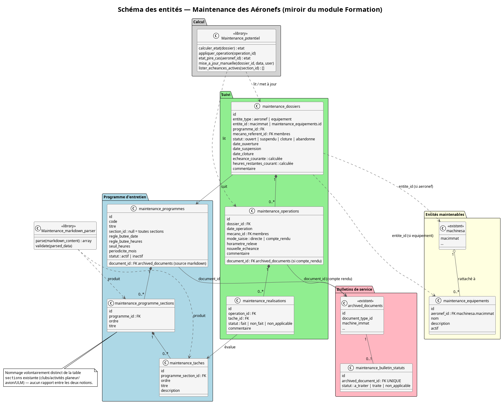

# Design Notes — Gestion de la Maintenance des Aéronefs

Date : 5 août 2026 — bilan Phase 11 ajouté le 12 août 2026

**PRD** : [maintenance_aeronefs_prd.md](../prds/maintenance_aeronefs_prd.md)
**Plan** : [maintenance_aeronefs_plan.md](../plans/maintenance_aeronefs_plan.md)

## Contexte et objectif

Le module Maintenance est conçu comme le **miroir architectural du module Formation** (`formation_programmes` / `formation_lecons` / `formation_sujets` / `formation_inscriptions` / `formation_seances` / `formation_evaluations`) : un développeur qui connaît l'un doit reconnaître directement la structure de l'autre.

Correspondance retenue :

| Formation | Maintenance | Rôle |
|---|---|---|
| Pilote (`membres`) | Entité maintenable : aéronef (`machinesa`) ou équipement (`maintenance_equipements`) | Sujet suivi par un programme |
| `formation_programmes` | `maintenance_programmes` | Racine du contenu structuré (markdown) + règle de butée |
| `formation_lecons` | `maintenance_programme_sections` | Regroupement de tâches au sein d'un programme |
| `formation_sujets` | `maintenance_taches` | Point de contrôle élémentaire |
| `formation_inscriptions` | `maintenance_dossiers` | Association programme + entité, avec cycle de vie |
| `formation_seances` | `maintenance_operations` | Événement daté qui fait progresser un dossier |
| `formation_evaluations` | `maintenance_realisations` | Case à cocher (fait/non fait/non applicable) + commentaire |
| `Formation_progression` | `Maintenance_potentiel` | Calcul de l'avancement / du potentiel restant |
| `Formation_markdown_parser` | `Maintenance_markdown_parser` | Parsing du contenu structuré |

Une différence assumée par rapport à Formation : `formation_programmes.contenu_markdown` stocke le markdown directement dans la table, sans versioning ni traçabilité de fichier source. Pour Maintenance, le contenu markdown est stocké et versionné via le système documentaire existant (`document_types` / `archived_documents`, voir [gestion_documentaire.md](gestion_documentaire.md)) — `maintenance_programmes.document_id` référence la version courante. Ce choix évite de dupliquer un mécanisme de versioning déjà disponible.

---

## Décisions actées en Phase 0

### 1. Parseur markdown : duplication, pas de mutualisation

`Maintenance_markdown_parser` est une classe dédiée, indépendante de `Formation_markdown_parser`, malgré un format isomorphe (H1 = titre du programme, H2 = section, H3 = tâche, contre H1/H2/H3 = programme/leçon/sujet côté Formation). Objectif : ne pas toucher un module Formation stable et déjà en production tant que le module Maintenance n'a pas fait ses preuves.

**Réévaluation (Phase 11, 12 août 2026) : décision confirmée, pas de mutualisation.** La comparaison des deux classes une fois l'implémentation terminée montre une divergence réelle, pas seulement potentielle :
- `Formation_markdown_parser` impose un format de titre numéroté et le valide par regex (`Leçon X : titre`, `Sujet X.Y : titre`), avec repli si absent ; `Maintenance_markdown_parser` n'a pas de numérotation dans le titre (`maintenance_programme_sections`/`maintenance_taches` n'ont qu'un champ `ordre`, pas de `numero`).
- `Formation_markdown_parser` scinde le contenu d'un sujet en `description`/`objectifs` (premier paragraphe vs. reste) ; `maintenance_taches` n'a qu'une seule colonne `description`, donc `Maintenance_markdown_parser` ne fait aucun split.
- `Formation_markdown_parser` conserve le texte libre placé sous un H2 avant le premier H3 comme description de la leçon ; côté Maintenance ce texte est ignoré (`maintenance_programme_sections` n'a pas de colonne description).
- `Formation_markdown_parser` expose une méthode `export()` (regénération Markdown depuis les données structurées), inutilisée côté Maintenance et donc absente.

Ces différences découlent directement du schéma de données de chaque module (colonnes disponibles), pas d'un choix arbitraire — une mutualisation forcerait soit à ajouter des colonnes inutiles à `maintenance_taches`/`maintenance_programme_sections`, soit à complexifier un parseur commun avec des branches spécifiques à chaque module. La duplication reste le choix le plus simple ; pas de nouvelle réévaluation prévue sauf évolution du schéma de l'un des deux modules.

### 2. Nommage : `maintenance_programme_sections`, jamais `maintenance_sections`

La table `sections` existante dans GVV désigne les clubs/activités (planeur/avion/ULM) et n'a **aucun rapport** avec les sections d'un programme d'entretien. Pour éviter toute ambiguïté dans le code et les requêtes SQL, le niveau intermédiaire du programme d'entretien (miroir de `formation_lecons`) est nommé `maintenance_programme_sections`, jamais `maintenance_sections` seul. Le champ `maintenance_programmes.section_id` (club/activité de rattachement, cohérent avec `formation_programmes.section_id`) reste distinct et sans lien avec cette table.

### 3. Seuil global "échéance proche" : entrée dans la table `configuration` existante

GVV dispose déjà d'une table de configuration générique clé/valeur (`configuration_model`, méthode `get_param($key)`, priorité club+langue > langue > global). Le seuil "échéance proche" (PRD EF7, 30 jours par défaut) est stocké comme une entrée de cette table (`cle = 'maintenance_seuil_echeance_proche_jours'`) plutôt que dans une nouvelle table dédiée : il s'agit d'une valeur globale simple, et le mécanisme existant couvre déjà le cas d'une valeur par défaut avec lecture centralisée. `Maintenance_potentiel::calculer_etat()` lit cette valeur via `configuration_model->get_param()`, avec repli sur 30 si absente.

### 4. Statut des bulletins de service : table compagnon `maintenance_bulletin_statuts`

`archived_documents` reste générique (utilisée par de nombreux autres modules : médical, assurance, licences, etc.). Le statut spécifique à la maintenance (à traiter/traité/non applicable, PRD EF6) est porté par une table compagnon légère, `maintenance_bulletin_statuts`, en relation 1—0..1 avec `archived_documents` (`archived_document_id` UNIQUE), plutôt que d'ajouter des colonnes propres à la maintenance dans la table générique.

**Confirmation (Phase 11) :** les décisions 2 à 4 ont été implémentées sans changement — vérifié contre les migrations finales (155 à 163) et le code des modèles/contrôleurs correspondants. Aucun ajustement nécessaire.

---

## Schéma des entités

### Programme d'entretien

- `maintenance_programmes` : racine du programme. Porte la règle de butée (`regle_butee_date`, `regle_butee_heures`, `seuil_heures`, `periodicite_mois`) et référence le document markdown source (`document_id` → `archived_documents`).
- `maintenance_programme_sections` : regroupement de tâches, ordonné (`ordre`), rattaché à un programme.
- `maintenance_taches` : point de contrôle élémentaire, rattaché à une section.

### Entités maintenables

- `machinesa` (existant) : chaque aéronef est une entité maintenable de premier niveau, sans table supplémentaire.
- `maintenance_equipements` : entité maintenable de second niveau, rattachée à un seul aéronef (`aeronef_id`). Un seul niveau de rattachement (pas de sous-équipement, cf. PRD non-objectifs). Le transfert d'un équipement (Parcours 5) modifie uniquement `aeronef_id` ; les dossiers et opérations référencent l'équipement par son `id`, indépendant de l'aéronef courant — l'historique est donc préservé sans copie de données.

### Suivi

- `maintenance_dossiers` : association programme + entité maintenable, avec cycle de vie (ouvert/suspendu/clôturé/abandonné). `entite_type`/`entite_id` est une clé polymorphe (pas de FK native possible) — l'existence de l'entité est validée au niveau applicatif (modèle), voir tableau des risques. Porte l'état calculé courant (`echeance_courante`, `heures_restantes_courant`), mis à jour à chaque opération.
- `maintenance_operations` : événement daté rattaché à un dossier, en mode `directe` ou `compte_rendu` (PRD EF4 — un seul écran pour les deux modes). Si `compte_rendu`, référence le document déposé (`document_id` → `archived_documents`).
- `maintenance_realisations` : réalisation d'une tâche du programme lors d'une opération (fait/non fait/non applicable), miroir exact de `formation_evaluations`.

### Bulletins de service

- `archived_documents` (existant, étendu) : `document_types.scope` gagne la valeur `machine` ; `archived_documents.machine_immat` (déjà présente depuis la migration 076) devient exploitable.
- `maintenance_bulletin_statuts` : statut applicatif du bulletin, en relation 1—0..1 avec le document archivé (décision n°4 ci-dessus).

### Calcul du potentiel

`Maintenance_potentiel` centralise le calcul et la mise à jour de l'état d'un dossier, miroir de `Formation_progression` :

- `calculer_etat($dossier)` : dérive l'état (`a_jour` / `echeance_proche` / `depasse`) à partir de `echeance_courante`/`heures_restantes_courant` et du seuil global (décision n°3).
- `appliquer_operation($operation_id)` : met à jour le dossier à partir des champs saisis sur l'opération.
- `etat_pire_cas($aeronef_id)` : pire état parmi l'aéronef et ses équipements, pour la vue de synthèse flotte (PRD EF7).
- `mise_a_jour_manuelle($dossier_id, $data, $user)` : correction hors opération, journalisée avec le marqueur `MAINTENANCE` (PRD EF5.3).
- `lister_echeances_actives($section_id)` : point d'ancrage pour le futur mécanisme d'alarmes génériques (PRD EF10, Phase 7 du plan) — aucune dépendance sur ce mécanisme aujourd'hui.

---

## Séparation des responsabilités

| Responsabilité | Composant |
|---|---|
| Structure du programme (programme/section/tâche) | `maintenance_programmes`, `maintenance_programme_sections`, `maintenance_taches` + modèles associés |
| Parsing du markdown déposé | `Maintenance_markdown_parser` |
| Stockage/versioning des fichiers (programmes, bulletins, comptes rendus) | Système documentaire existant (`document_types` / `archived_documents`) — aucune duplication |
| Cycle de vie du suivi d'une entité sur un programme | `maintenance_dossiers` + modèle associé |
| Historisation des interventions | `maintenance_operations`, `maintenance_realisations` |
| Calcul et mise à jour du potentiel | `Maintenance_potentiel` |
| Statut des bulletins de service | `maintenance_bulletin_statuts` |
| Rôles et accès : mecano/admin en écriture (mecano borné à sa section) ; « responsable de section » (rôle `ca`) et trésorier en lecture seule de la synthèse et de l'historique ; pilote (membre standard) en lecture seule de la synthèse uniquement (PRD EF8) | `Maintenance_access` (Phase 6 du plan), classe dédiée sur le modèle de `Formation_access` |

---

## Relation avec le code existant

Aucune modification du code Formation. Le module Maintenance est un ensemble de tables, modèles, contrôleurs et bibliothèques nouveaux, construits sur le même modèle conceptuel :

- **Système documentaire** (`document_types` / `archived_documents`) : étendu (ajout du scope `machine`), pas dupliqué.
- **Rôle `mecano`** (migration 073, déjà en production) : réutilisé tel quel, pas de nouveau rôle créé.
- **Réservations** (statut "Maintenance" existant) : aucune automatisation en phase 1 ; vocabulaire distinct maintenu entre le statut de réservation et les statuts de `maintenance_dossiers`.
- **Alarmes génériques** : `Maintenance_potentiel::lister_echeances_actives()` est le seul point de contact prévu, sans dépendance fonctionnelle actuelle.

---

## Hors périmètre (rappel PRD)

- Planification d'atelier, gestion de stock.
- Blocage automatique des réservations sur échéance dépassée.
- Moteur de notification des échéances.
- Sous-équipements (un seul niveau aéronef → équipement).
- Import automatique de bulletins constructeur, signature électronique qualifiée, rapports DGAC formatés.
