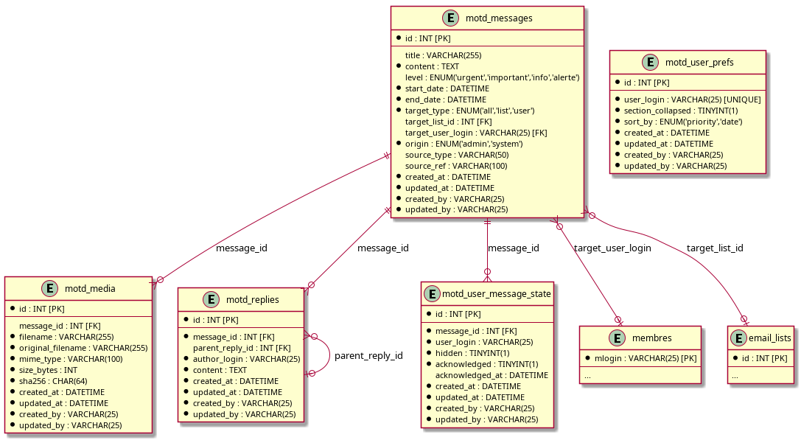

# Conception — Messages du jour (MOTD)

Date : 26 juillet 2026
Référence PRD : `doc/prds/messages_du_jour_prd.md`
Référence plan : `doc/plans/messages_du_jour_plan.md` (étape 2 — modèle de données)

## Vue d'ensemble

Le module ajoute cinq tables. Il réutilise volontairement l'existant plutôt que
de le dupliquer :

- **Ciblage par liste de diffusion** : référence directe vers `email_lists`
  (`application/models/email_lists_model.php`). La résolution des destinataires
  d'une liste (rôles, membres manuels, externes, sous-listes) est déléguée à
  `Email_lists_model::detailed_list()` / `textual_list()` — aucune duplication
  de logique de résolution de liste dans MOTD.
- **Rendu Markdown** : le helper existant `markdown()`
  (`application/helpers/markdown_helper.php`, Parsedown en `setSafeMode(true)`)
  est réutilisé tel quel pour le contenu des messages et des réponses.
- **Upload de fichiers** : reprend le pattern de
  `application/controllers/archived_documents.php` (CodeIgniter `upload`
  library + vérification `mime_content_type()` réelle + service via un
  endpoint contrôlé plutôt qu'un accès direct au répertoire).
- **Génération d'alarmes** : le système d'alarmes actuel
  (`doc/design_notes/gestion_alarmes_design.md`) ne persiste aucune alarme —
  tout est calculé à la volée dans `alarmes.php`. Il n'existe donc aujourd'hui
  aucun générateur à brancher. MOTD prévoit uniquement les colonnes
  nécessaires (`origin`, `source_type`, `source_ref`) pour qu'un futur
  `AlarmAggregator` (non encore implémenté) puisse créer des messages sans
  modification de schéma. Le point d'entrée lui-même (étape 4 du plan) sera
  une méthode de modèle appelable, indépendante de l'implémentation finale des
  alarmes.

## Modèle de données

### `motd_messages`

Message géré par un administrateur ou généré par GVV.

| Champ | Type | Notes |
|---|---|---|
| `id` | INT PK auto_increment | |
| `title` | VARCHAR(255) NULL | optionnel (PRD EF1) |
| `content` | TEXT | source Markdown |
| `level` | ENUM('urgent','important','info','alerte') NULL | optionnel |
| `start_date` | DATETIME | début de période d'affichage |
| `end_date` | DATETIME | fin de période d'affichage |
| `target_type` | ENUM('all','list','user') | défaut 'all' |
| `target_list_id` | INT NULL, FK → `email_lists(id)` | requis si `target_type='list'` |
| `target_user_login` | VARCHAR(25) NULL, FK → `membres(mlogin)` | requis si `target_type='user'` |
| `origin` | ENUM('admin','system') | défaut 'admin' |
| `source_type` | VARCHAR(50) NULL | ex. `'alarm_medical'`, `'alarm_brevet'` — tag libre pour messages système |
| `source_ref` | VARCHAR(100) NULL | référence libre vers l'entité source (ex. id de document) |
| `created_at`, `updated_at`, `created_by`, `updated_by` | audit standard | pas de FK (voir note migration 144 ci-dessous) |

Index : `(start_date, end_date)` pour le filtrage des messages actifs,
`target_type`, `target_list_id`, `target_user_login`.

### `motd_media`

Image téléversée, référencée depuis le Markdown via `` où `url`
pointe vers l'endpoint contrôlé `motd/media/{id}`.

| Champ | Type | Notes |
|---|---|---|
| `id` | INT PK auto_increment | |
| `message_id` | INT NULL, FK → `motd_messages(id)` | nullable : l'upload peut précéder la création du message |
| `filename` | VARCHAR(255) | nom de stockage non prévisible (côté serveur) |
| `original_filename` | VARCHAR(255) | nom d'origine, pour audit |
| `mime_type` | VARCHAR(100) | MIME réel détecté serveur |
| `size_bytes` | INT UNSIGNED | |
| `sha256` | CHAR(64) | pour dédoublonnage optionnel et vérification d'intégrité |
| `created_at`, `updated_at`, `created_by`, `updated_by` | audit standard | |

Index : `message_id`.

### `motd_replies`

Réponse à un message, visible par les destinataires du message initial et
son éditeur. Le champ `parent_reply_id` permet à un administrateur de
répondre à une réponse reçue.

| Champ | Type | Notes |
|---|---|---|
| `id` | INT PK auto_increment | |
| `message_id` | INT, FK → `motd_messages(id)` | |
| `parent_reply_id` | INT NULL, FK → `motd_replies(id)` | auto-référence, pour réponse d'admin à une réponse |
| `author_login` | VARCHAR(25) | pas de FK (un admin sans profil `membres` doit pouvoir répondre) |
| `content` | TEXT | Markdown, rendu via le même helper |
| `created_at`, `updated_at`, `created_by`, `updated_by` | audit standard | |

Index : `message_id`.

### `motd_user_message_state`

État individuel d'un utilisateur vis-à-vis d'un message : masqué et/ou pris
connaissance. « Masquer tous les messages » s'implémente en insérant/mettant
à jour une ligne `hidden=1` pour chaque message actif visible par
l'utilisateur au moment de l'action — pas de logique par horodatage séparée,
ce qui garantit qu'un nouveau message reçu ensuite redéplie la section
(exigence EF3).

| Champ | Type | Notes |
|---|---|---|
| `id` | INT PK auto_increment | |
| `message_id` | INT, FK → `motd_messages(id)` | |
| `user_login` | VARCHAR(25), pas de FK (voir note migration 145 ci-dessous) | |
| `hidden` | TINYINT(1) | défaut 0 |
| `acknowledged` | TINYINT(1) | défaut 0 (« pris connaissance », optionnel EF3) |
| `acknowledged_at` | DATETIME NULL | |
| `created_at`, `updated_at`, `created_by`, `updated_by` | audit standard | |

Contrainte : `UNIQUE(message_id, user_login)`.

### `motd_user_prefs`

Préférences d'affichage persistantes de la section repliable, par
utilisateur (état replié/déplié, critère de tri).

| Champ | Type | Notes |
|---|---|---|
| `id` | INT PK auto_increment | |
| `user_login` | VARCHAR(25) UNIQUE, pas de FK (voir note migration 145 ci-dessous) | |
| `section_collapsed` | TINYINT(1) | défaut 1 (replié) |
| `sort_by` | ENUM('priority','date') | défaut 'priority' (décision étape 1 : priorité puis date croissante) |
| `created_at`, `updated_at`, `created_by`, `updated_by` | audit standard | |

## Résolution des destinataires

Un message est visible par un utilisateur si :
- `target_type='all'`, ou
- `target_type='user'` et `target_user_login = utilisateur courant`, ou
- `target_type='list'` et l'utilisateur courant appartient à
  `Email_lists_model::detailed_list(target_list_id)`.

Un message est actif si `NOW()` est compris entre `start_date` et `end_date`.

## Correction post-migration (migration 144)

Les comptes administrateur "techniques" (DX_Auth legacy, ex. `testadmin`)
n'ont pas nécessairement de ligne dans `membres`. La FK initiale
`created_by`/`updated_by` → `membres(mlogin)` (et `motd_replies.author_login`)
empêchait donc tout admin sans profil membre de créer un message, téléverser
une image ou répondre — découvert en testant le formulaire admin (étape 5).
La migration 144 supprime ces FK ; ces colonnes restent une simple trace
d'audit (VARCHAR sans contrainte), à l'image de
`reservation_reminder_log.created_by`/`updated_by`. `target_user_login`
(le destinataire d'un message, pas l'acteur) garde sa FK vers `membres`,
et reste validé côté application par `Motd_model::is_target_valid()`.

## Correction post-migration (migration 145)

Même constat pour `motd_user_message_state.user_login` et
`motd_user_prefs.user_login` : ce sont les identifiants de l'utilisateur
connecté qui masque/acquitte un message ou change sa préférence d'affichage
sur son propre dashboard — n'importe quel utilisateur authentifié, pas
nécessairement un membre du club (un club-admin sans ligne `membres` voit
aussi la section MOTD). La FK vers `membres(mlogin)` provoquait une
violation dès qu'un tel compte utilisait ces actions — découvert en
implémentant les actions utilisateur (étape 8). La migration 145 supprime
ces deux FK, par cohérence avec la migration 144.

## Diagramme

Voir `doc/design_notes/diagrams/messages_du_jour_er.puml`.

## Points laissés ouverts (hors décisions déjà tranchées à l'étape 1)

- Le point d'entrée de génération automatique des messages d'alarme
  (étape 4 du plan) ne dépend d'aucune table alarme existante — il consommera
  directement les colonnes `origin`/`source_type`/`source_ref` ci-dessus. Le
  branchement réel sur un futur `AlarmAggregator` reste à faire quand ce
  dernier existera.
