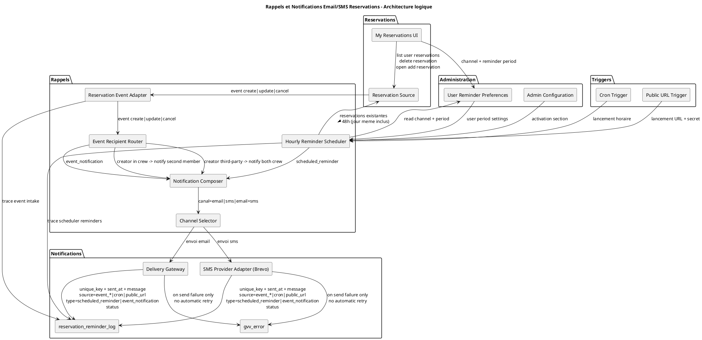

# Design Notes — Rappels Email/SMS des Réservations

Date : 20 juin 2026

## Décision d'architecture

La traçabilité des activations et des actions du mécanisme de déclenchement des rappels email repose sur une table dédiée `reservation_reminder_log`.

Les rappels sont tracés dans cette table avec une clé unique d'idempotence afin d'éviter les envois multiples.

## Contexte et objectif

Cette note de design accompagne le PRD des rappels email/SMS de réservation.

Documents de référence :
- [PRD Réservations d'aéronefs](../prds/aircraft_booking_prd.md)
- [PRD Rappels email des réservations](../prds/rappels_email_reservations_prd.md)

L'objectif est de définir une architecture claire pour produire deux types de messages fiables (email/SMS) :
- les rappels temporels envoyés avant le départ,
- les notifications événementielles envoyées lors des changements de réservation,
avec un couplage faible entre la logique métier de réservation et la mécanique d'envoi.

---

## Principes d'architecture

- Distinguer explicitement deux mécanismes : rappels temporels et notifications événementielles.
- Garder un mécanisme simple : notifications événementielles sur `create`/`update`/`cancel`, rappels temporels via scheduler.
- Autoriser deux modes de déclenchement du scheduler : cron et URL publique dédiée.
- Accepter un couplage faible : le module réservation peut transmettre des événements `create`, `update`, `cancel` au mécanisme de rappel.
- Les notifications événementielles appliquent une règle de destinataires explicite :
	- créateur membre d'équipage -> notification au second membre,
	- créateur tiers -> notification aux deux membres d'équipage.
- Ne pas planifier les envois à l'avance : la décision d'envoi est prise au moment du déclenchement (`update` ou scheduler).
- Considérer l'appel synchrone sur `update` comme nominal (pas comme mécanisme de secours).
- En cas d'échec d'envoi email, tracer l'erreur via `gvv_error`.
- Ne pas implémenter de mécanisme de relance/retry automatique.
- Baser les décisions d'envoi du scheduler sur l'existence réelle des réservations au moment de l'exécution.
- Utiliser un scheduler horaire avec une fenêtre fixe de 48 heures pour les rappels.
- Déclencher les rappels pour le second membre d'équipage, y compris pour une réservation du jour même.
- Garder un design générique multi-canal : le choix d'envoi (`email`, `sms`, `email+sms`) est appliqué au moment de l'envoi.
- Utiliser Brevo comme service SMS initial via un adaptateur fournisseur.
- Exposer une page utilisateur "Mes réservations" pour lister, supprimer et ajouter des réservations.
- Centraliser les préférences utilisateur de rappel (canal et période) et les appliquer au moment de la décision d'envoi.
- S'appuyer sur `reservation_reminder_log` pour tracer les activations et les actions du déclenchement.

---

## Vue d'ensemble

### Composants logiques

| Composant                 | Rôle                                                                                                                                                                |
| ------------------------- | ------------------------------------------------------------------------------------------------------------------------------------------------------------------- |
| Trigger Entry Point       | Reçoit le déclenchement du scheduler via cron ou URL publique dédiée.                                                                                               |
| Reservation Source        | Fournit l'état des réservations actives et leurs transitions (modification, annulation).                                                                            |
| Reservation Event Adapter | Reçoit les événements `create`, `update`, `cancel` du module réservation et déclenche le flux de notification événementielle. |
| Hourly Reminder Scheduler | Toutes les heures, sélectionne les réservations existantes qui commencent dans moins de 48 heures.                                                                  |
| Notification Composer     | Construit le contenu des messages (rappel temporel ou notification événementielle).                                                                                |
| Channel Selector          | Applique le choix utilisateur de canal (`email`, `sms`, `email+sms`) au moment de l'envoi.                                                                        |
| User Reminder Preferences | Fournit les préférences utilisateur (canal, période de rappel) utilisées au calcul d'éligibilité et au choix de canal.                                           |
| My Reservations UI        | Page "Mes réservations" : liste les réservations de l'utilisateur, permet la suppression, affiche "Ajouter une réservation" et la configuration des rappels.   |
| Delivery Gateway          | Transmet les notifications vers les services de messagerie configurés.                                                                                              |
| SMS Provider Adapter      | Adaptateur du fournisseur SMS ; Brevo est le service initial.                                                                                                       |
| reservation_reminder_log  | Conserve la trace des activations, tentatives d'envoi et résultats (succès/échec), avec clé unique d'idempotence.                                                   |
| Admin Configuration       | Porte les paramètres de section : activation et règles de base.                                                                                                     |

---

## Flux conceptuels

### 1) Notifications événementielles (create/update/cancel)

1. Le mécanisme peut recevoir un événement `create`, `update` ou `cancel` depuis le module réservation.
2. Le routeur applique la règle de destinataires : second membre si le créateur est membre d'équipage, les deux membres si le créateur est tiers.
3. Le compositeur génère une notification événementielle (type `event_notification`).
4. Le sélecteur de canal choisit `email`, `sms` ou `email+sms`.
5. Le gateway envoie via email, SMS (Brevo initialement), ou les deux.
6. Le résultat est journalisé dans `reservation_reminder_log`.

### 2) Rappels temporels (scheduler horaire)

1. La page "Mes réservations" permet à l'utilisateur de supprimer une réservation, d'ouvrir "Ajouter une réservation" et de régler canal + période.
2. Le scheduler est déclenché soit par cron, soit par URL publique dédiée.
3. Il récupère les réservations existantes dont le départ est dans les 48 heures.
4. Il applique les préférences utilisateur de période de rappel avant décision d'envoi.
5. Pour chaque réservation éligible, le compositeur génère un rappel temporel (type `scheduled_reminder`).
6. Le sélecteur de canal choisit `email`, `sms` ou `email+sms`.
7. Le gateway envoie via email, SMS (Brevo initialement), ou les deux, et le résultat est journalisé dans `reservation_reminder_log`.

### 3) Règles de sécurité métier

1. Le scheduler doit revalider l'existence de la réservation juste avant envoi.
2. Si la réservation est absente ou annulée, aucun rappel n'est envoyé.
3. L'URL publique de déclenchement doit être protégée par un secret technique.
4. En cas d'échec d'envoi, l'erreur est enregistrée dans `gvv_error` et dans `reservation_reminder_log`.
5. Aucun retry automatique n'est effectué après un échec SMTP.

---

## Contrats fonctionnels

### Contrat "éligibilité rappel"

Entrée : horodatage courant + réservations existantes + configuration section.

Sortie :
- éligible ou non,
- type de message (`scheduled_reminder` ou `event_notification`),
- liste de destinataires valides,
- décision d'envoi basée sur l'existence de la réservation,
- contrainte de déclenchement : réservation dans la fenêtre de 48 heures,
- contrainte de destinataire : second membre d'équipage (jour même autorisé),
- source d'exécution : `event_create`, `event_update`, `event_cancel`, `cron` ou `public_url`,
- canal d'envoi : `email`, `sms` ou `email+sms`.

Entrée utilisateur : préférences issues de "Mes réservations" (canal et période de rappel).

Entrée complémentaire : événement de réservation (`create`, `update`, `cancel`) transmis par le module réservation.

Règle de notification événementielle :
- créateur membre d'équipage -> second membre,
- créateur tiers -> pilote + instructeur.

### Contrat "traçabilité"

Chaque tentative conserve au minimum :
- clé unique d'idempotence,
- source de déclenchement (`event_create`, `event_update`, `event_cancel`, `cron` ou `public_url`),
- type d'événement de synchronisation reçu (`create`, `update`, `cancel`) quand applicable,
- identifiant de réservation,
- type d'action (`scheduled_reminder` ou `event_notification`),
- type de notification,
- destinataires,
- date/heure d'émission,
- statut (succès/échec),
- message (ou corps) envoyé,
- message d'erreur éventuel.

En cas d'échec d'envoi email ou SMS, l'erreur doit aussi être tracée dans `gvv_error`.

Le mécanisme de persistance de cette traçabilité repose sur la table `reservation_reminder_log`.

---

## Séparation des responsabilités

- Le module réservation reste responsable de l'état métier des réservations.
- Le module rappels est responsable des notifications événementielles et des rappels temporels.
- Le module "Mes réservations" est responsable des interactions utilisateur (liste, suppression, accès à l'ajout, paramètres de rappel).
- Le couplage entre réservation et rappels est volontairement faible via un adaptateur d'événements de contexte.
- Le module administration reste responsable des paramètres de section.
- `reservation_reminder_log` reste la source d'observabilité pour le support et l'exploitation.

---

## Risques et garde-fous

| Risque                              | Impact                 | Garde-fou d'architecture                                                                                                                         |
| ----------------------------------- | ---------------------- | ------------------------------------------------------------------------------------------------------------------------------------------------ |
| Doublon d'envoi                     | Saturation utilisateur | Idempotence sur le triplet (réservation, échéance, type).                                                                                        |
| Annulation non propagée             | Rappel erroné          | Décision d'envoi fondée sur l'existence de la réservation au passage du scheduler.                                                               |
| Notifications non pertinentes       | Bruit utilisateur      | Règle explicite de destinataires : second membre si créateur équipage, les deux membres si créateur tiers.                                      |
| Couplage fonctionnel excessif       | Complexité inutile     | Limiter l'appel réservation -> rappels à un contrat simple (`create`, `update`, `cancel`) avec routage de destinataires centralisé.              |
| Adresse email absente/invalide      | Non-réception          | Validation destinataires avant émission + trace d'échec dans `reservation_reminder_log`.                                                         |
| Numéro de téléphone invalide        | SMS non reçu           | Validation du numéro avant émission + trace d'échec dans `reservation_reminder_log` et `gvv_error`.                                              |
| Période de rappel invalide          | Rappel mal cadencé     | Validation de la valeur en UI et au service de préférences avant évaluation de l'éligibilité.                                                    |
| Relance scheduler fréquente         | Envois dupliqués       | Contrainte d'unicité sur la clé d'idempotence en base.                                                                                           |
| Échec SMTP ponctuel                 | Email non reçu         | Tracer l'échec dans `reservation_reminder_log` et `gvv_error`, sans relance automatique.                                                         |
| Échec fournisseur SMS (Brevo)       | SMS non reçu           | Tracer l'échec dans `reservation_reminder_log` et `gvv_error`, sans relance automatique.                                                         |
| Couplage fort au module réservation | Maintenance difficile  | Contrat d'entrée/sortie stable entre source réservation et moteur de rappel.                                                                     |

---

## Hors périmètre de cette note

- Détails d'implémentation technique (classes, méthodes, requêtes SQL).
- Choix d'infrastructure SMTP spécifique.
- Stratégie SMS/push.
