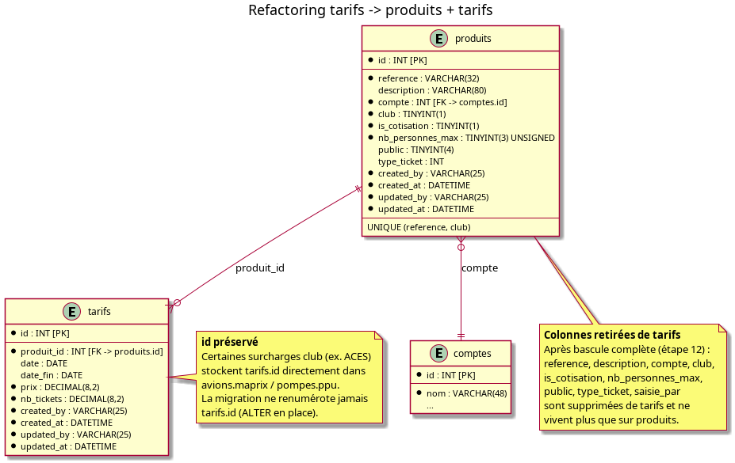

# Design note — Refactoring `tarifs` → `produits` + `tarifs`

> Étape 1 du plan [`doc/plans/refactoring_produits_tarifs_plan.md`](../plans/refactoring_produits_tarifs_plan.md).
> Ce document décrit le schéma cible et les règles de compatibilité. Il ne décrit pas
> l'implémentation détaillée (code, requêtes) — voir le plan pour le phasage.

## 1. Problème

La table `tarifs` mélange aujourd'hui deux notions dans la même ligne :

- l'**identité du produit** (`reference`, `description`, `compte`, `club`, `is_cotisation`,
  `nb_personnes_max`, `public`, `type_ticket`), qui ne varie pas d'une ligne de prix à l'autre
  pour une même référence ;
- le **tarif à une date donnée** (`date`, `date_fin`, `prix`, `nb_tickets`), qui varie dans le
  temps.

Une même `reference` possède plusieurs lignes dans `tarifs`, une par période de prix — c'est
déjà le modèle utilisé implicitement par `tarifs_model::get_tarif()` (sélectionne la ligne dont
la `date` est la plus proche ≤ date facturée). Le refactoring rend cette intention explicite.

## 2. Schéma cible

Diagramme source : [`diagrams/produits_tarifs.puml`](diagrams/produits_tarifs.puml).

### `produits` (nouvelle table)

Identité du produit. Clé fonctionnelle réelle : le couple **(`reference`, `club`)**, pas
`reference` seule — deux sections peuvent partager la même référence. Contrainte
`UNIQUE(reference, club)`.

### `tarifs` (table existante, modifiée en place)

Historique de prix. Ajout de `produit_id` (FK vers `produits.id`). **`tarifs.id` n'est jamais
renuméroté** : au moins une surcharge club (ACES, `Facturation_aces.php:100,182`) stocke
directement cette clé primaire dans `avions.maprix` / `pompes.ppu`, au lieu de la `reference`
texte utilisée partout ailleurs. La migration procède donc par `ALTER TABLE` en place, jamais
par recréation.

Les colonnes produit (`reference`, `description`, `compte`, `club`, `is_cotisation`,
`nb_personnes_max`, `public`, `type_ticket`, `saisie_par`) restent sur `tarifs` pendant la
période de transition (étapes 5 à 11 du plan) et ne sont supprimées qu'à l'étape 12, une fois
tout le code applicatif basculé et validé. `saisie_par` n'est pas repris sur `produits` ni sur
la nouvelle `tarifs` : il est redondant avec `created_by`.

`produit_id` est ajouté **NULLABLE** à l'étape 5, bien que backfillée à 100 % sur les lignes
existantes : la façade `Tarifs_model` n'est réécrite qu'à l'étape 7, donc le code applicatif
actuel continue jusque-là d'insérer de nouvelles lignes `tarifs` sans fournir `produit_id`. Un
`NOT NULL` immédiat à l'étape 5 casse ces insertions — confirmé par `./run-all-tests.sh`
(24 échecs, `Field 'produit_id' doesn't have a default value`). La contrainte `NOT NULL` est
donc posée à l'étape 7, une fois `Tarifs_model::create()` garantissant sa présence. La FK est
posée dès l'étape 5 (une FK autorise les valeurs NULL, non contrôlées tant que la colonne
l'est).

## 3. Règle de résolution des divergences

Les attributs produit sont actuellement dupliqués sur chaque ligne de prix et peuvent diverger
entre deux lignes d'une même référence (saisie historique). Règle validée : **la ligne avec la
`date` la plus récente du groupe `(reference, club)` fait foi** pour peupler `produits`. Les
divergences détectées à l'audit (étape 2 du plan) sont **bloquantes** — elles doivent être
résolues avant de lancer la migration de peuplement.

`created_at`/`created_by` de `produits` reprennent ceux de la ligne la plus ancienne du groupe ;
`updated_at`/`updated_by` ceux de la ligne la plus récente.

## 4. Compatibilité — `Tarifs_model` en façade

Le refactoring ne change pas les ~15 points d'appel existants (contrôleurs `avion.php`,
`planeur.php`, `achats.php`, `config.php`, `compta.php`, `vols_decouverte.php`,
`Facturation*.php`, etc.). `Tarifs_model` reste la seule interface pour ce code : mêmes
signatures de méthode, mêmes clés dans les tableaux de résultat. En interne, ses méthodes
(`get_tarif`, `get_by_id`, `selector`, `select_page`, `get_cotisation_products_for_section`,
`get_cotisation_product_by_id`) sont réécrites en jointure `tarifs JOIN produits ON
tarifs.produit_id = produits.id`.

Un nouveau `Produits_model` porte le CRUD natif sur `produits` (utilisé par le nouveau
contrôleur `Produits` et par tout code qui n'a pas besoin de la vue "plate" historique).

8 requêtes SQL directes hors modèle (`reservations.php`, `welcome.php`, `vols_decouverte.php`)
lisent aujourd'hui `tarifs` sans passer par `tarifs_model` ; elles doivent être réécrites en
jointure explicite, car un refactor du seul modèle ne suffit pas à les corriger.

## 5. UI

Introduction d'une vue produit distincte (`vue_produits`) plutôt que la réutilisation de
`vue_tarifs` pour le listing — décision validée en §6 du plan. Le CRUD `Produits` gagne un
bouton « Tarifs » par ligne, qui ouvre le CRUD `Tarifs` filtré sur le `produit_id` sélectionné
(sous-CRUD, plus de liste plate toutes références confondues).

## 6. Points de vigilance (rappel, détail en §4 du plan)

| # | Constat | Implication |
|---|---|---|
| A | Clé fonctionnelle = (`reference`, `club`) | `UNIQUE(reference, club)` sur `produits` |
| B | `tarifs.id` stocké en dur côté ACES | Migration en place, jamais de renumérotation |
| C | 8 accès SQL directs hors modèle | Réécriture en jointure, indépendante du modèle |
| D | Appelants attendent un résultat "plat" | `Tarifs_model` reste façade de compatibilité |
| E | Divergences possibles sur les attributs produit | Audit + règle de résolution bloquante |
| F | `type_ticket` non assigné dans la demande initiale | Placé dans `produits` (attribut du produit) |

## 7. Rollback

Entre la migration `147` (`tarifs.produit_id` posé) et la migration `148` (suppression des
colonnes legacy), le rollback consiste à revenir au code précédent : les anciennes colonnes
existent toujours sur `tarifs`, aucune donnée n'est perdue. Après la migration `148`, le
rollback nécessite une restauration depuis une sauvegarde MySQL prise juste avant son
exécution.
