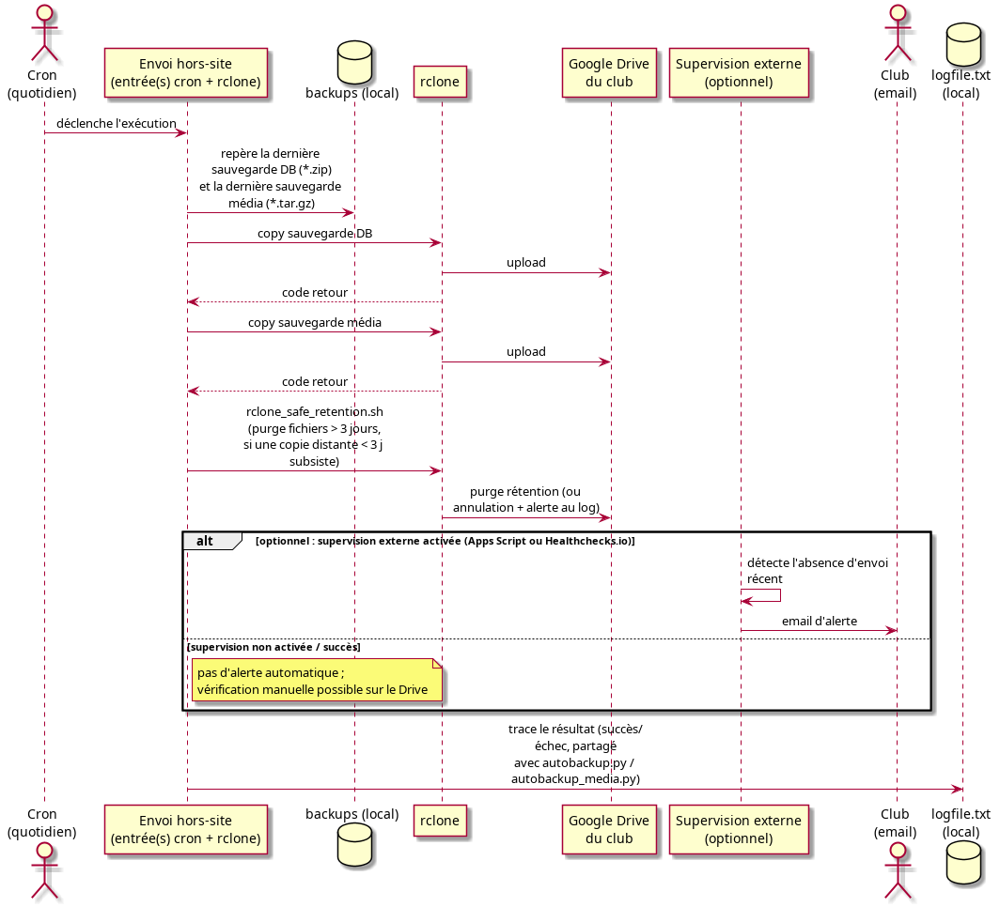

# Design : Sauvegarde Hors-Site des Backups

Complète `doc/prds/sauvegarde_hors_site_prd.md`, qui définit les exigences produit. Ce document ne les répète pas et se concentre sur le positionnement architectural du mécanisme et sur la question centrale : ce mécanisme doit-il être développé comme partie du projet GVV, ou peut-il être entièrement couvert par des outils externes ?

## 1. Positionnement architectural

Le mécanisme hors-site n'est **pas une fonctionnalité de l'application GVV** (CodeIgniter/PHP). Il se situe au même niveau que les scripts déjà existants `tools/autobackup.py` et `tools/autobackup_media.py` : un outil d'exploitation, déclenché par cron, qui agit sur le système de fichiers du serveur, en dehors de toute requête HTTP et de tout contrôleur.

Cette séparation découle directement du PRD (ENF-001, et l'exclusion explicite de `GoogleCal.php` en 3.2) : une panne du mécanisme hors-site ne doit jamais pouvoir affecter l'application, et réciproquement l'application ne doit pas être un point de passage obligé pour l'envoi hors-site. Conséquence directe :

* Aucun contrôleur, vue, modèle ou migration de base de données GVV n'est concerné.
* Le mécanisme n'a pas besoin d'accéder à la base de données GVV ni à sa session : il opère uniquement sur les fichiers déjà produits dans `backups/`.
* Il peut continuer à fonctionner même si l'application GVV est indisponible.

## 2. Composants et responsabilités

| Composant | Rôle | Nouveau ? |
| :--- | :--- | :--- |
| `tools/autobackup.py`, `tools/autobackup_media.py` | Produisent les sauvegardes locales (déjà existant, hors périmètre de ce PRD) | Non |
| **Envoi hors-site** | Repère la dernière sauvegarde locale de chaque type et invoque `rclone` pour l'upload, puis lance la purge de rétention distante via le garde-fou ci-dessous | Oui (cœur du besoin) |
| **rclone** | Client CLI qui gère l'upload vers Google Drive et la suppression des fichiers distants trop anciens (`--min-age`) ; sa configuration (client OAuth **dédié au club** — cf. §4 — et jeton du compte `info@planeur-abbeville.fr`) est stockée sur le serveur, hors du dépôt (ENF-002) | Outil externe existant |
| `tools/rclone_safe_retention.sh` | Encapsule la purge `rclone delete --min-age` d'un garde-fou : n'efface les fichiers distants anciens que s'il subsiste déjà une sauvegarde distante de moins de trois jours, sinon annule la purge et journalise une alerte. Aucun secret ni chemin en dur (tout en paramètre) | Oui |
| **Alerte en cas d'échec** *(optionnel, voir §5)* | Signale qu'un envoi quotidien n'a pas eu lieu | Oui, mais report possible à un outil de supervision externe |
| `backups/logfile.txt` | Journal partagé, déjà utilisé par les deux scripts existants ; l'envoi hors-site peut y ajouter ses propres lignes selon la même convention | Existant, réutilisé |

## 3. Flux d'exécution quotidien

Points à noter :

* L'upload ne régénère jamais de sauvegarde (EF-004) : le script se contente de désigner le fichier le plus récent de chaque type dans `backups/`.
* La rétention distante (EF-006/EF-007, 3 jours) s'appuie sur `rclone delete --min-age`, appliqué indépendamment aux deux types de sauvegarde, mais **encapsulé** dans `tools/rclone_safe_retention.sh`. Une purge aveugle par âge est dangereuse : si les sauvegardes locales cessent d'être produites, l'upload re-copie sans erreur un fichier inchangé pendant que la purge continue de tourner et finit par effacer la dernière copie distante valide. Le garde-fou vérifie qu'une sauvegarde distante récente subsiste avant de purger — seule logique à maintenir, une dizaine de lignes shell.
* L'échec d'un seul des deux envois (CL-002) doit être détecté indépendamment de l'autre, pour que l'alerte identifie précisément le type concerné (EF-009) — *si l'alerte est mise en place, voir §5*.
* Aucune notification n'est envoyée en cas de succès complet (EF-010) — le seul signal de bonne santé est l'absence d'email, complété par la trace dans `logfile.txt` et par la présence des fichiers sur le Google Drive pour qui veut vérifier activement.

## 4. Sécurité des identifiants

`rclone config` stocke le jeton OAuth du compte Google Drive dans un fichier de configuration propre à `rclone` (hors du dépôt Git, sur le serveur uniquement), ce qui couvre nativement ENF-002/CA-006. Ce fichier est propre au compte système qui exécute le cron (pas `root`, sauf crontab de `root`).

Google ayant annoncé (préavis de 90 jours, courant 2026) la facturation des appels API passant par le client OAuth partagé par défaut de `rclone`, la configuration utilise un **client OAuth propre au club**, créé dans Google Cloud Console sur le compte cible avec le seul scope `drive.file`. Cela n'introduit pas de secret sensible supplémentaire : le `client_secret` d'une application OAuth « installée » n'est pas un secret fort (il est volontairement visible dans de nombreux projets open source), il est simplement gardé hors du dépôt par principe.

La liste des adresses email d'alerte (QO-001) suit le même principe que la config `rclone` : un fichier de configuration local au serveur, non versionné — pas besoin de passer par la table `email_lists` de GVV, ce qui préserverait le découplage vis-à-vis de la base de données applicative.

## 5. Alerte en cas d'échec : étape optionnelle

Contrairement à l'hypothèse initiale du PRD, l'alerte automatique par email n'est pas indispensable pour rendre le mécanisme fiable : la présence des sauvegardes locales se vérifie déjà facilement par leur présence sur disque (comme le fait implicitement la politique de rétention des scripts existants), et il en va de même côté distant — la présence des fichiers récents sur le Google Drive du club se vérifie tout aussi facilement, manuellement ou via un outil de supervision généraliste. Rien n'empêche de mettre en place l'upload et la rétention (§3) sans détection d'échec dédiée, et d'ajouter la surveillance plus tard si le besoin s'en fait sentir.

Cette étape (EF-008 à EF-010, CL-002, CL-005) est donc reclassée **optionnelle** pour une première mise en place. Si elle est retenue, deux familles d'outils externes évitent d'avoir à écrire la logique de détection/notification :

### Outils associés à Google Drive

* **Google Apps Script lié au compte Drive cible** : un script (hébergé et exécuté par Google, pas sur le serveur GVV) déclenché par un déclencheur temporel quotidien, qui vérifie la date du fichier le plus récent dans le dossier de sauvegarde et envoie un email via `MailApp`/`GmailApp` si aucun fichier récent n'est trouvé. C'est l'approche la plus directement « associée à Google Drive » : elle tourne entièrement côté Google, sur le compte `info@planeur-abbeville.fr` déjà utilisé, sans toucher au serveur ni au dépôt GVV. Des exemples publics existent pour la variante « notifier à l'ajout d'un fichier » ([Net-RVA, GitHub](https://github.com/Net-RVA/Automate-Your-Google-Drive-Email-Alerts-for-New-Files-with-Apps-Script-)) ; la variante « alerter en l'absence d'ajout récent » est une adaptation directe (comparer la date du fichier le plus récent à `Date.now()`).
* **La notification native de Drive** (icône cloche, « suivre » un fichier/dossier) alerte sur toute modification mais ne peut pas détecter une *absence* d'activité — elle ne couvre donc pas le besoin telle quelle.
* **Applications tierces du Google Workspace Marketplace** (ex. « DriveWatcher ») proposent une notification périodique (quotidienne/hebdomadaire) sur l'activité d'un dossier, relayée vers Google Chat plutôt que par email ; à vérifier si elles couvrent le cas « aucune activité » avant de les retenir, leur usage documenté portant surtout sur la notification de nouveaux fichiers.

### Alternative généraliste : supervision par « dead man's switch »

Indépendamment de Google Drive, **Healthchecks.io** (et équivalents : Cronitor, cron-job.org) est un service de supervision de tâches planifiées : le job envoie un simple ping HTTP (`curl`) à la fin de son exécution ; si le ping n'arrive pas dans la fenêtre attendue, le service alerte automatiquement par email (et d'autres canaux). Offre gratuite jusqu'à 20 jobs surveillés, auto-hébergeable si besoin.

Appliqué ici : deux jobs de supervision distincts (un pour la sauvegarde base de données, un pour les médias), chacun pingé séparément après le `rclone copy` correspondant. Cette approche couvre EF-009 (distinguer le type en échec) sans qu'aucune logique de détection ou de composition d'email ne soit à écrire — le ping conditionnel est une ligne de plus ajoutée à la commande déjà présente en cron, pas un script séparé.

## 6. Analyse : implémentation GVV ou outils externes ?

### Ce qui est déjà couvert nativement par `rclone` seul

* L'upload vers Google Drive (`rclone copy`).
* L'authentification OAuth et son stockage sécurisé (`rclone config`), avec un client OAuth propre au club (§4).

Pour ces points, un simple appel `rclone` en ligne de commande suffit : aucune ligne de code à écrire ni à maintenir dans le dépôt GVV. C'est cohérent avec le périmètre du PRD, qui nomme `rclone` comme l'outil imposé plutôt que de demander une intégration API Google sur mesure.

### Ce qui demande un mince script d'exploitation

* La rétention distante par âge (`rclone delete --min-age`) ne peut **pas** être laissée en cron brut (§3) : elle est encapsulée dans `tools/rclone_safe_retention.sh`, un script d'exploitation d'une dizaine de lignes, au même niveau que `tools/autobackup.py` et sans lien avec l'application GVV. C'est la seule logique à maintenir dans le dépôt.

### Désigner le dernier fichier local

Repérer le fichier le plus récent de chaque type dans `backups/` (EF-001/EF-002) tient en une ligne shell (`ls -t backups/*.zip | head -1`) — pas une logique à proprement parler, exprimable directement dans l'entrée crontab.

### L'alerte, si elle est retenue

Avec l'étape reclassée optionnelle (§5), les deux pistes externes identifiées (Google Apps Script, ou un ping Healthchecks.io par type de sauvegarde) couvrent le besoin sans qu'aucun code de détection/notification ne soit à écrire ni à maintenir côté GVV.

### Conclusion

En retirant l'obligation d'une alerte sur mesure, le mécanisme hors-site ne nécessite **aucun développement applicatif GVV** (contrôleur, vue, modèle, migration). Il se réduit à des entrées cron appelant directement `rclone` pour l'upload, plus un unique script d'exploitation `tools/rclone_safe_retention.sh` pour sécuriser la rétention (§3) — au même niveau que `autobackup.py`, sans lien avec l'application. La supervision reste optionnelle, éventuellement un simple `curl` vers un service externe.

**Recommandation** :

1. Première mise en place : entrées crontab appelant `rclone copy` pour l'upload et `tools/rclone_safe_retention.sh` pour la rétention, sans alerte — couvre l'objectif principal (copie hors-site + rétention sûre) avec un risque d'implémentation quasi nul.
2. Si la supervision est souhaitée par la suite : ajouter un ping vers un service de type Healthchecks.io (ou, plus intégré à l'écosystème déjà en place, un Google Apps Script côté compte `info@planeur-abbeville.fr`) — dans les deux cas, un ajout de configuration externe, pas un développement dans le dépôt GVV.
3. Un script `tools/offsite_backup.py`, au même niveau que les scripts existants, ne se justifierait que si une logique plus élaborée devenait nécessaire (ex. alerte composée avec plus de détail que ce que permet une supervision générique) — à réévaluer seulement si ce besoin apparaît concrètement.

Cette conclusion diffère d'une version antérieure de ce document, qui recommandait un script d'orchestration pour porter la logique d'alerte (EF-008/009/010 alors supposés fermes). L'alerte est désormais optionnelle et déléguée à un outil externe ; le seul script conservé, `tools/rclone_safe_retention.sh`, ne fait pas d'orchestration mais protège la rétention d'un effacement accidentel — un besoin de sûreté identifié lors du déroulé réel de la procédure en production.

## 7. Points restant à trancher

* Le PRD (`doc/prds/sauvegarde_hors_site_prd.md`) liste EF-008 à EF-010 et CL-002/CL-005 comme des exigences fermes ; ce document les reclasse optionnelles (§5). Si cette reclassification est retenue, le PRD devrait être mis à jour en conséquence pour rester cohérent avec ce design.
* Si l'alerte est mise en place : choix entre Google Apps Script (plus intégré à Google Drive, zéro dépendance externe supplémentaire) et Healthchecks.io/équivalent (généraliste, réutilisable pour d'autres tâches planifiées du club) — à trancher selon la préférence de maintenance à long terme.
* Nom exact et structure du dossier distant sur le Google Drive du club (`info@planeur-abbeville.fr`, cf. PRD QO-002).
* **Fréquence et rétention** : passées de hebdomadaire/deux mois à **quotidien/trois jours** (décision produit). À noter : une rétention distante de trois jours ne conserve que 3 à 4 sauvegardes à la fois — si un problème (corruption, suppression accidentelle) n'est détecté qu'après ce délai, aucune copie distante saine n'est plus disponible. Ce risque existait déjà avec la rétention locale à granularité quotidienne (`doc/features/Backup.md`), mais mérite d'être gardé à l'esprit si la fenêtre de rétention distante devait encore être raccourcie.
