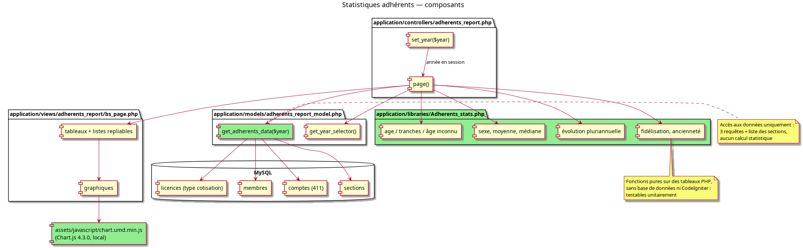

# Statistiques adhérents — note de conception (phase 1)

PRD : `doc/prds/statistiques_adherents_prd.md` — Plan : `doc/plans/statistiques_adherents_plan.md`

## Architecture

Le rapport existant `adherents_report` est étendu, sans nouveau contrôleur ni migration. Les responsabilités sont séparées en trois couches :

| Composant | Responsabilité |
|---|---|
| `adherents_report_model` | Accès aux données uniquement. Renvoie des lignes brutes, aucun calcul statistique. |
| `Adherents_stats` (nouvelle bibliothèque) | Tous les calculs : âge, tranches, sexe, moyenne, médiane, évolution, fidélisation, ancienneté. Fonctions pures sur des tableaux PHP, sans base de données ni CodeIgniter, donc testables unitairement. |
| `adherents_report` (contrôleur) | Lit l'année en session, appelle le modèle puis la bibliothèque, transmet les résultats à la vue. |
| `bs_page.php` (vue) | Tableaux, listes de membres repliables, graphiques. |

## Accès aux données

Le modèle actuel exécute une requête par classe d'âge et par section. Il est remplacé par un chargement unique de quelques jeux de données, agrégés ensuite en PHP :

1. **Cotisations** : couples distincts (membre, année) pour les cotisations jusqu'à l'année N incluse. La base contient des doublons de cotisation pour une même année, d'où le dédoublonnage.
2. **Membres** concernés : identifiant, nom, prénom, date de naissance, sexe, date d'inscription.
3. **Comptes pilote** : couples (membre, section) des comptes 411.
4. **Sections** : liste existante (`sections_model`).

Volume constaté sur la base de développement : environ 500 membres et 300 cotisations sur 16 ans. Le chargement complet reste négligeable, et aucun index n'est nécessaire.

## Règles de calcul

- **Adhérent de l'année N** : membre ayant au moins une cotisation pour N.
- **Adhérent d'une section en N** : adhérent de N possédant un compte 411 dans la section. L'appartenance à une section n'est pas datée : un membre est rattaché à toutes les sections où il a un compte, quelle que soit l'année. Cette règle reprend celle du rapport actuel ; un membre ayant un compte dans plusieurs sections apparaît dans chacune d'elles.
- **Total club** : membres distincts, y compris les adhérents sans compte 411.
- **Âge** : âge révolu au 1er janvier de N. Un membre né le 1er janvier de N-20 a 20 ans et relève de la tranche 20-29.
- **Âge inconnu** : date de naissance nulle, `0000-00-00`, antérieure à 1900 ou postérieure au 1er janvier de N.
- **Sexe** : valeurs `M` / `F` ; toute autre valeur est « Non renseigné ».
- **Moyenne et médiane** : calculées sur les âges connus ; la médiane d'un effectif pair est la moyenne des deux valeurs centrales.
- **Fidélisation** : calculée à partir de l'ensemble des années de cotisation du membre ; au niveau d'une section, on applique les mêmes règles en se restreignant aux membres rattachés à la section. Un changement de section n'est pas détectable (appartenance non datée).
- **Ancienneté** : date de référence = la plus ancienne entre la date d'inscription et le 1er janvier de la première année de cotisation ; ancienneté inconnue si aucune des deux n'est disponible.
- **Évolution** : les 10 années les plus récentes ayant au moins une cotisation, jusqu'à N incluse.

## Limites connues des données

Constat sur la base de développement (octobre 2026), à reprendre dans la documentation utilisateur :

- L'historique des cotisations est lacunaire : 24 à 28 adhérents par an de 2011 à 2013, aucun de 2014 à 2019, 1 à 4 de 2020 à 2024, puis 71 en 2025 et 83 en 2026. L'évolution pluriannuelle et la fidélisation ne sont significatives que pour les années précédées d'une année complètement saisie. Pour 2025, presque tous les adhérents apparaissent comme « nouveaux » ou « retours ».
- 286 fiches membres ont une date d'inscription en 2011, année de mise en service de GVV : pour ces membres, l'ancienneté calculée est un minimum et ne reflète pas la date d'adhésion réelle.
- 16 % des adhérents 2026 n'ont pas de date de naissance, d'où l'importance de la liste « Âge inconnu ».
- Le sexe est toujours renseigné.

La page affiche les données telles qu'elles sont, sans chercher à détecter les années incomplètes.

## Interface

- Une seule page, organisée en cartes Bootstrap, une par bloc du PRD. Le sélecteur d'année existant recharge la page entière.
- **Listes de membres** (âge inconnu, compteurs de fidélisation) : générées côté serveur dans la page et affichées dans des zones repliables Bootstrap. Les volumes sont de quelques dizaines de noms, ce qui ne justifie pas de point d'accès AJAX.
- **Graphiques** : Chart.js 4.3.0, la version déjà utilisée par les statistiques d'autorisation, copiée dans `assets/javascript/` pour ne pas dépendre d'un CDN. Les données sont injectées en JSON dans la vue. Chaque graphique est accompagné du tableau chiffré correspondant, qui reste la référence et assure l'accessibilité.
  - Histogramme horizontal des tranches de 10 ans.
  - Pyramide des âges : barres horizontales, hommes en valeurs négatives et femmes en valeurs positives, axe affiché en valeur absolue.
  - Évolution : courbe de l'effectif et de l'âge moyen sur des années civiles consécutives ; une année sans cotisation vaut `null` et laisse un trou dans la courbe.
- **Droits** : page réservée au rôle CA (`require_roles(['ca'])`), vérifié dans la section courante de la session. La page n'est pas filtrée par section : un CA d'une seule section voit aussi les listes de noms des autres sections (choix accepté, voir le PRD).
