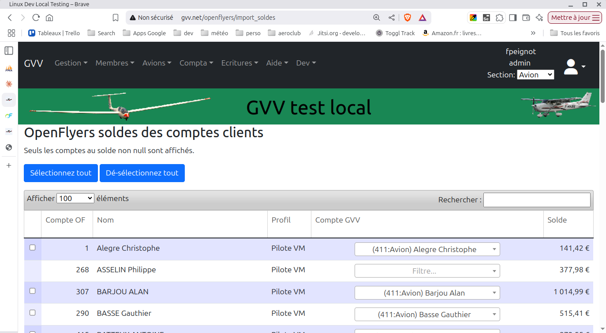

# Intégration avec OpenFLyers

La comptabilité de la section planeur qui gère ses comptes bancaires, ses comptes de produits, ses comptes clients et sa facturation est complète.

Les sections avion et ULM utilisent OpenFlyers pour gérer les comptes clients et la facturation.

* Quand un pilote crédite son compte, son compte OpenFLyers est crédité.
* Quand un vol est facturé le compte client OpenFLyers est débité.

Lors de l'utilisation conjointe d'OpenFlyers et de GVV il est possible de de synchroniser OpenFlyers et GVV. Dans ce cas c'est OpenFlyers qui gère les comptes de resource (avions et ULM) et les comptes pilotes. Puis les opérations relatives aux comptes clients et resources sont importées dans GVV. Le résultat final est identique à ce qui ce qu'il aurait été si la facturation et les opérations sur les comptes clients avaient été saisie dans GVV.

**Attention il va falloir définir quoi faire si les comptes clients GVV sont modifiés dans OpenFlyers après la synchronisation**

Plusieurs stratégies sont possibles:
* Dans tous les cas éviter ces situation au maximum
* Ajustement manuel des écritures GVV pour prendre en compte les modifications dans OpenFLyers
* Effacement des écritures dans GVV et re-synchronisation

## Association des comptes OpenFLyers et GVV

Les comptes resources et les comptes clients doivent exister à la fois dans OpenFlyers et dans GVV.

Il faut associer chaque compte OpenFLyers qu'on envisage d'importer au compte correspondant dans GVV.

Si vous connaissez l'identifiant du compte OpenFlyers il suffit de lui associer le compte GVV correspondant dans la table des associations. Il est possible de réaliser l'association de façon plus pratique lors de l'import des balances initiales.

### Table des associations

### Saisie/modification d'une association

## Import des balances initiales des comptes clients

Exporter la balance en CSV depuis OpenFLyers

Import de la balance dans GVV

Voici la fenêtre des soldes clients. La vous allez pouvoir:
* choisir le compte GVV à associer pour les comptes non associés.
* sélectionner les comptes que vous voulez initialiser avec leur solde initial. Les balances initiales seront équilibré avec une écriture sur le compte 102 (Fonds associatifs) de la section. Si un compte à déjà été initialisé il n'y a plus de checkbox pour le sélectionner.

## Import des écritures entre deux dates

De la même façon, on peut importer en CSV les écritures relatives aux comptes de resources et aux comptes client depuis OpenFLyers.

Attention, pour GVV l'étanchéité entre les sections est totale. Quand une section est active, on ne voit pas les comptes des autres sections et il n'y a pas d'opérations communes. OpenFLyers ne supporte pas de concept de sections et le grand journal contient des opérations pour les sections ULM et avions. 

### Exporter du fichier journal

Le plus pratique est probablement de réaliser l'opération une fois par mois ou plus.

### Selection et import du fichier journal dans GVV

### Fenêtre d'import des opérations des comptes clients et resources