# Installation

La machine utilisée lors de la rédaction de cette documentation est une machine virtuelle Oracle free tier sur laquelle est installé Ubuntu 22.04 et Hestia Control Panel. 

https://www.oracle.com/cloud/free/

https://hestiacp.com/docs/introduction/getting-started.html.

https://www.youtube.com/watch?v=Hz58Zkke4VE&list=PLSk3zfDlC1f_Up6GBgckMIqLdS_HRjdEy&index=1&t=873s

C'est un environment entièrement gratuit, à vie, sans publicité et sans limite d'utilisation. Il est donc possible de l'utiliser pour tester et déployer GVV.

## Pré-requis

* une machine avec PHP 7.4 et MySql 5.x (linux, windows ou MacOS, linux recommandé)
* un serveur web (Apache ou Nginx)
* un nom de domaine

## Étapes d'installation

La plupart doivent être réalisées avec une connection ssh et le compte gestionnaire sur Hestia.

Certaines étapes se font avec l'interface graphique d'Hestia.

### Vérifiez la version php

    frederic@hcp:~$ php7.4 --version
        PHP 7.4.33 (cli) (built: Feb 14 2023 18:31:54) ( NTS )
        Copyright (c) The PHP Group
        Zend Engine v3.4.0, Copyright (c) Zend Technologies
        with Zend OPcache v7.4.33, Copyright (c), by Zend Technologies


Hestia Control Panel allows you to change the PHP version used by the domain.

** By default, the latest version of PHP will be used. To change the PHP version, go to the WEB section - click the Edit domain icon - click the Additional options button - select the desired version in the Backend PHP-FPM template field - click the Save button. **

### Configurer le serveur WEB, Apache ou Nginx, 

C'est déjà fait si vous utilisez Hestia.
Pour référence https://www.digitalocean.com/community/tutorials/how-to-install-linux-apache-mysql-php-lamp-stack-on-ubuntu-18-04. 

Installez une page WEB de test pour vérifier que le serveur web est bien configuré et accessible sur votre domaine.

Installez les certificats SSL.

Installez MySql et créez une base de données.

Notez que pour les utilisateurs de Hestia Control Panel, il est possible de réaliser ces étapes directement depuis l'interface web.

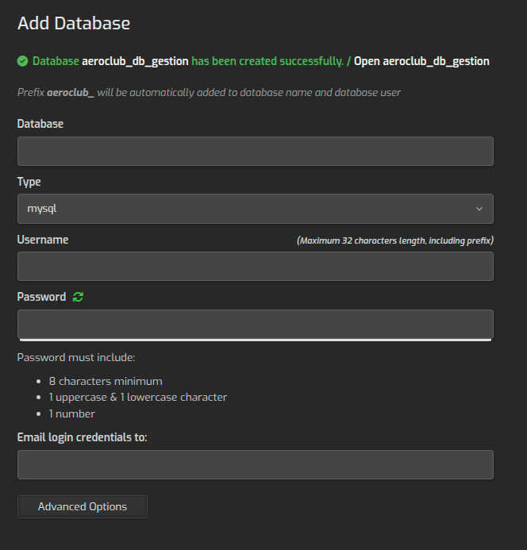

Une fois la base crée elle pourra être accédée avec les identifiants que vous avez choisi.

```https://hcp.mondomaine/phpmyadmin/```

### Configurer l'accès ssh

Vous en aurez besoin pour télécharger GVV et configurer les fichiers de configuration, et surtout pour faire les mise à jour de GVV.

    * Créer les fichier nécessaires dans ~/.ssh
    * Ajouter votre clé publique dans ~/.ssh/authorized_keys
    * Configurer les droits d'accès sur les fichiers et répertoires ~/.ssh
    * Ajouter un shell dans /etc/passwd pour votre utilisateur, par exemple /bin/bash
   
Editer /etc/ssh/sshd_config

```
                # override default of no subsystems
                Subsystem sftp internal-sftp

                # Example of overriding settings on a per-user basis
                #Match User anoncvs
                #       X11Forwarding no
                #       AllowTcpForwarding no
                #       PermitTTY no
                #       ForceCommand cvs server


                # Hestia SFTP Chroot
                Match User sftp_dummy99,admin,planeur
                    ChrootDirectory /srv/jail/%u
                    X11Forwarding no
                    AllowTCPForwarding no
                    ForceCommand internal-sftp -d /home/%u

                Match User frederic,aeroclub
                    ForceCommand none
                    PermitTTY yes
                    AllowTcpForwarding yes
```

```
systemctl reload sshd
```


### Téléchargez GVV

Connectez vous à votre serveur avec SSH et allez dans le répertoire web. Dans mon cas ~/web/gvvg.flub78.net.

Donnez les droits d'écriture sur le répertoire.

git clone https://github.com/flub78/gvv.git public_html

### Créez la base de données

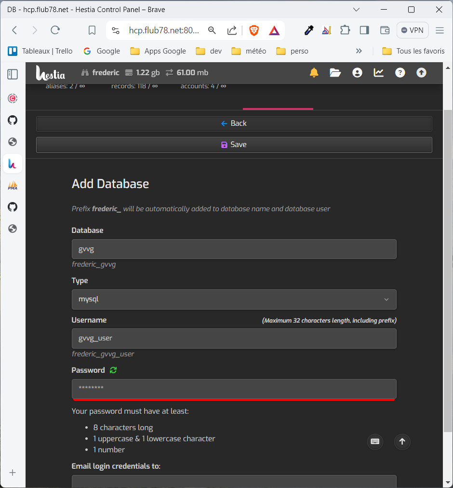

### Lancer le programme d'installation

```
https://gvvg.flub78.net/install/
```

#### Étape 1 — Prérequis

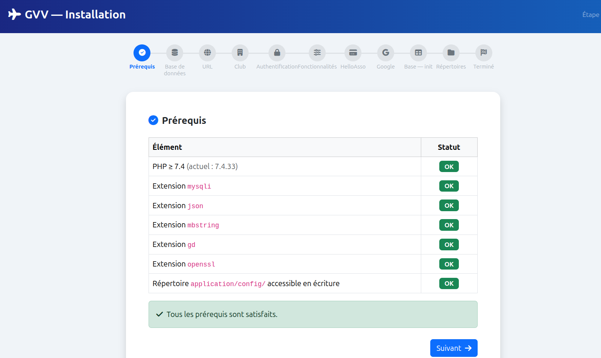

#### Étape 2 — Configuration de la base de données

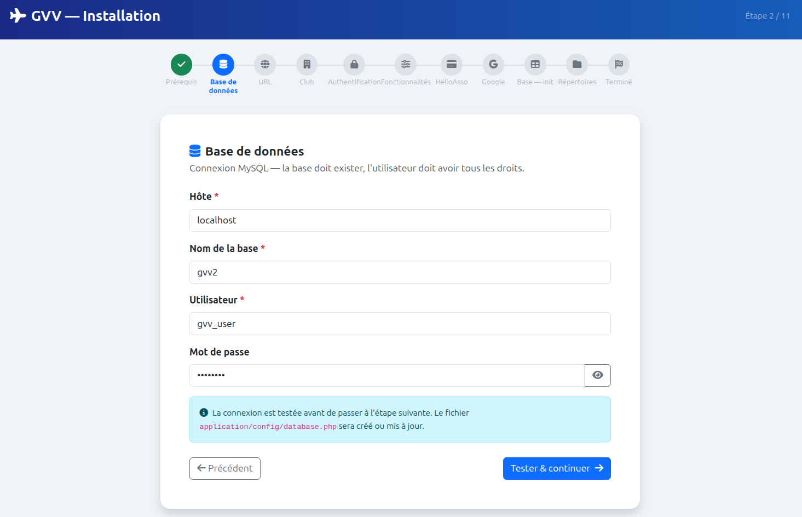

#### Étape 3 — URL de l'application

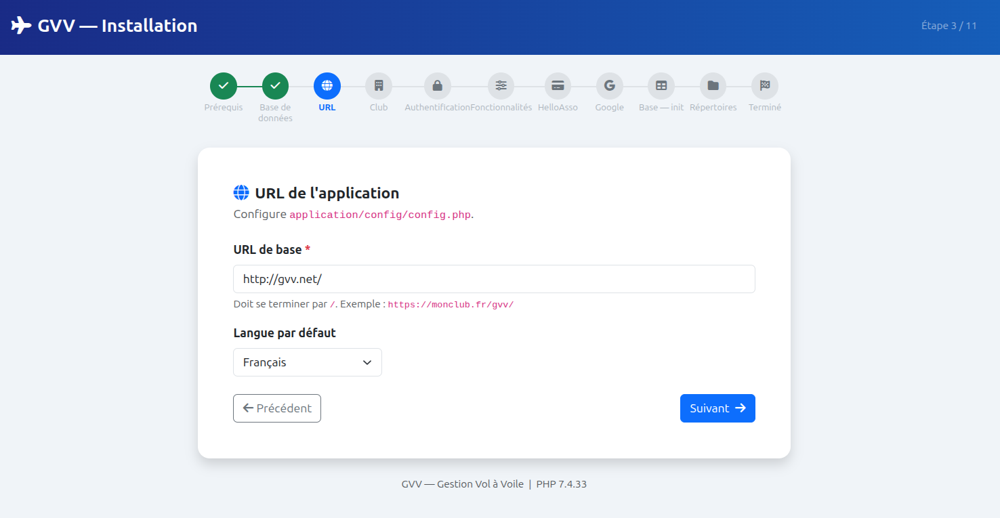

#### Étape 6 — Fonctionnalités

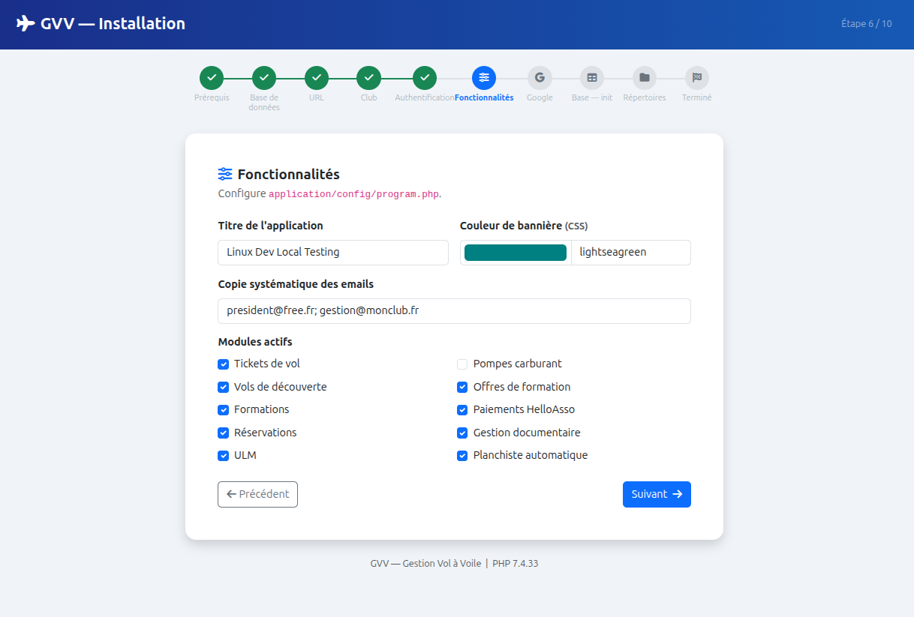

#### Étape 8 — Initialisation de la base de données

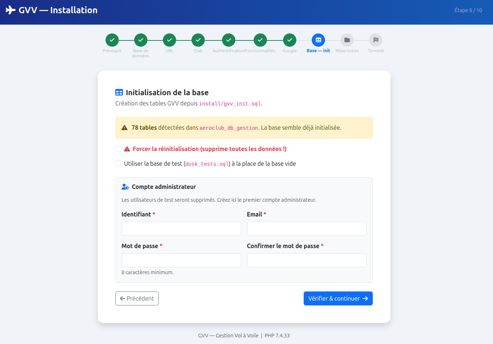

#### Étape 9 — Répertoires & droits

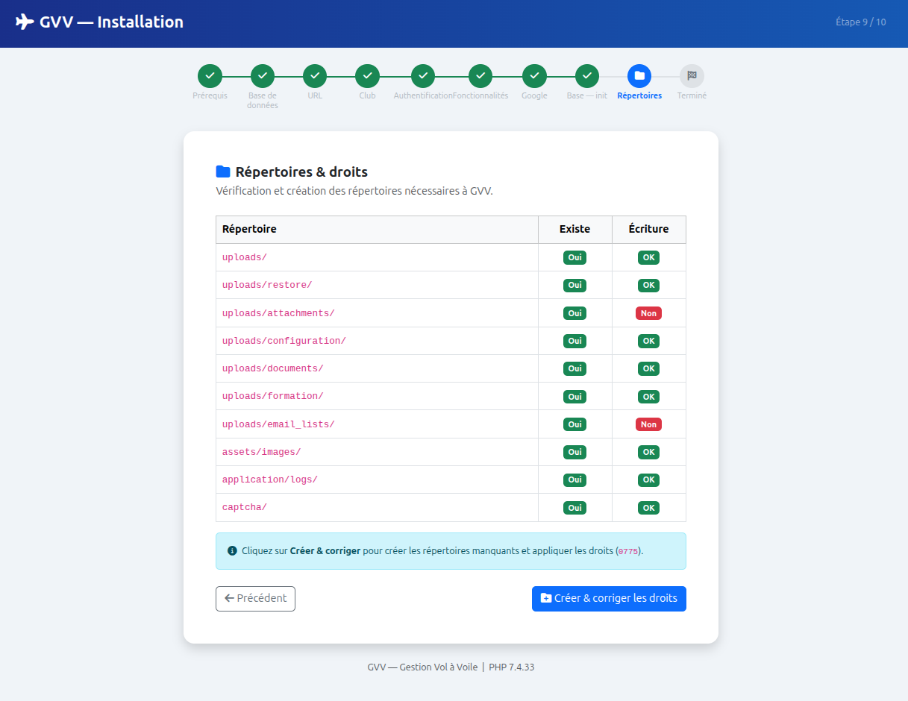

#### Étape 10 — Installation terminée

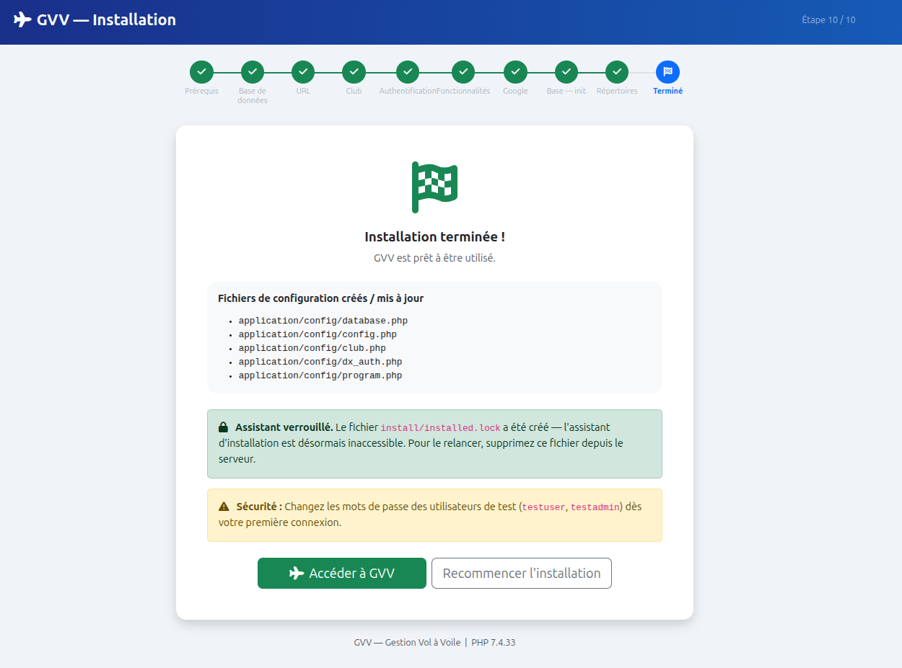

### Étapes additionnelles

* Créez le répertoire de journaux application/logs

* Vérifiez la quantité de mémoire disponible pour l'application. La librairie zip utilisée pour les sauvegardes et restauration à besoin de beaucoup de mémoire.

> J'ai résolu mon problème de sauvegarde de la base de donnée qui me retournait systématiquement une erreur 500.
> Dans le fichier /etc/php/7.4/apache2/php.ini, > j'ai passé memory_limit de 128M à 256M
> Je pense que le module zip n'avait pas assez de mémoire disponible à la vue des données à compresser.
> Ça risque d'arriver à tout le monde au fur et à mesure du temps...

### Configuration

> [!WARNING]
> GVV est fourni avec un ensemble de fichiers de configuration dans `application/config` avec des noms du type `*.example.php` (par exemple `database.example.php`).
> Ces fichiers contiennent des valeurs spécifiques au déploiement (base de données, URL, paramètres locaux, etc.) et ne peuvent donc pas être fournis prêts à l'emploi par GVV.
> Vous devez créer une version sans `.example` pour chaque fichier nécessaire (par exemple `database.php`), puis l'adapter à votre machine et à votre environnement de déploiement.

Dans le fichier config.php, mettre à jour:

* base_url
* index_php (si vous voulez supprimer index.php de l'url)
* google_account
  
Dans le fichier club.php, mettre à jour ce qui vous intéresse. Notez que le les paramètres de config club peuvent également être modifiés dans l'application.

Un fois terminé, vous pouvez vous connecter comme testuser ou testadmin avec le mot de passe: password.

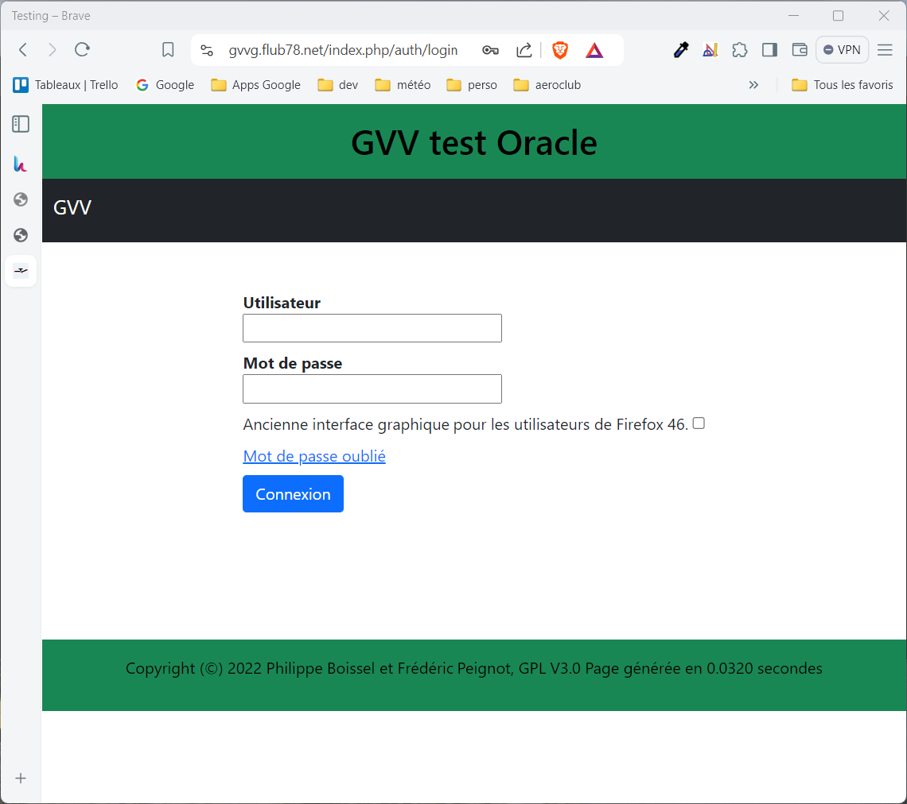

Si vous voyez la page suivante, c'est que GVV est correctement installé.

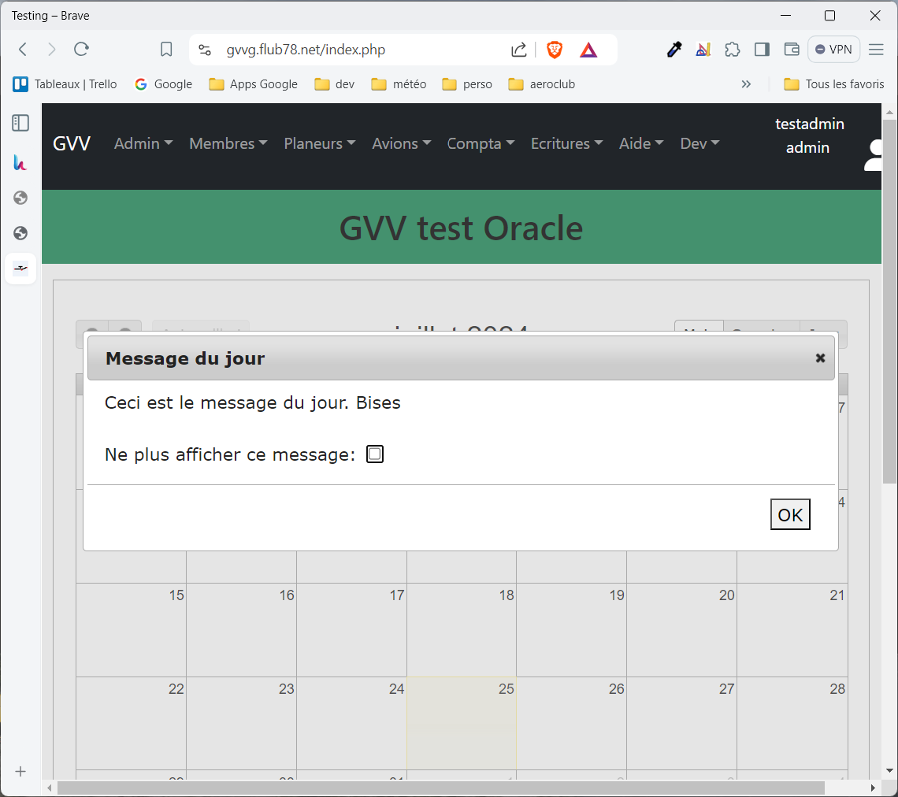

Un fois installé, je vous recommande de tester, tester et tester.

Créez, modifiez et supprimez:
* des comptes
* des machines
* les produits de facturation
* des vols
* etc.

Ensuite, si vous êtes déjà un club utilisateur, sauvegarder votre base de données et restaurez la sur votre nouvelle machine.