# Installation

La machine utilisée lors de la rédaction de cette documentation est une machine virtuelle Oracle free tier sur laquelle est installé Ubuntu 22.04 et Hestia Control Panel. 

https://www.oracle.com/cloud/free/

https://hestiacp.com/docs/introduction/getting-started.html.

https://www.youtube.com/watch?v=Hz58Zkke4VE&list=PLSk3zfDlC1f_Up6GBgckMIqLdS_HRjdEy&index=1&t=873s

C'est un environment entièrement gratuit, à vie, sans publicité et sans limite d'utilisation. Il est donc possible de l'utiliser pour tester et déployer GVV.

## Pré-requis

* une machine avec PHP 7.4 ou 8.4 et MySql 5.x (linux, windows ou MacOS, linux recommandé) — GVV a été testé avec ces deux versions de PHP
* un serveur web (Apache ou Nginx)
* un nom de domaine

## Étapes d'installation

La plupart doivent être réalisées avec une connection ssh et le compte gestionnaire sur Hestia.

Certaines étapes se font avec l'interface graphique d'Hestia.

### Vérifiez la version php

GVV a été testé avec PHP 7.4 et PHP 8.4.

    frederic@hcp:~$ php --version
        PHP 8.4.x (cli) (built: ...) ( NTS )
        Copyright (c) The PHP Group
        Zend Engine v4.4.x, Copyright (c) Zend Technologies

Hestia Control Panel allows you to change the PHP version used by the domain.

**By default, the latest version of PHP will be used. To change the PHP version, go to the WEB section - click the Edit domain icon - click the Additional options button - select the desired version (PHP 7.4 or 8.4) in the Backend PHP-FPM template field - click the Save button.**

### Configurer le serveur WEB, Apache ou Nginx, 

C'est déjà fait si vous utilisez Hestia.
Pour référence https://www.digitalocean.com/community/tutorials/how-to-install-linux-apache-mysql-php-lamp-stack-on-ubuntu-18-04. 

Installez une page WEB de test pour vérifier que le serveur web est bien configuré et accessible sur votre domaine.

Installez les certificats SSL.

Installez MySql et créez une base de données.

Notez que pour les utilisateurs de Hestia Control Panel, il est possible de réaliser ces étapes directement depuis l'interface web.

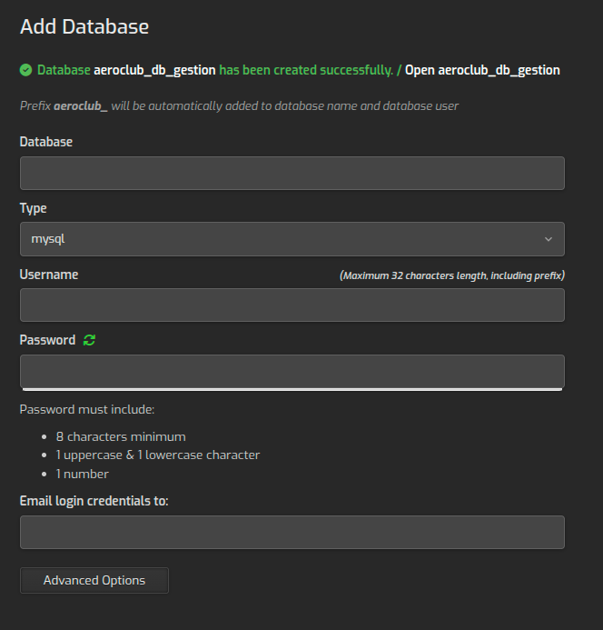

Une fois la base crée elle pourra être accédée avec les identifiants que vous avez choisi.

```https://hcp.mondomaine/phpmyadmin/```

### Configurer l'accès ssh

Vous en aurez besoin pour télécharger GVV et configurer les fichiers de configuration, et surtout pour faire les mise à jour de GVV.

    * Créer les fichier nécessaires dans ~/.ssh
    * Ajouter votre clé publique dans ~/.ssh/authorized_keys
    * Configurer les droits d'accès sur les fichiers et répertoires ~/.ssh
    * Ajouter un shell dans /etc/passwd pour votre utilisateur, par exemple /bin/bash
   
Editer /etc/ssh/sshd_config

```
                # override default of no subsystems
                Subsystem sftp internal-sftp

                # Example of overriding settings on a per-user basis
                #Match User anoncvs
                #       X11Forwarding no
                #       AllowTcpForwarding no
                #       PermitTTY no
                #       ForceCommand cvs server


                # Hestia SFTP Chroot
                Match User sftp_dummy99,admin,planeur
                    ChrootDirectory /srv/jail/%u
                    X11Forwarding no
                    AllowTCPForwarding no
                    ForceCommand internal-sftp -d /home/%u

                Match User frederic,aeroclub
                    ForceCommand none
                    PermitTTY yes
                    AllowTcpForwarding yes
```

```
systemctl reload sshd
```


### Téléchargez GVV

Connectez vous à votre serveur avec SSH et allez dans le répertoire web. Dans mon cas ~/web/gvvg.flub78.net.

Donnez les droits d'écriture sur le répertoire.

git clone https://github.com/flub78/gvv.git public_html

### Créez la base de données

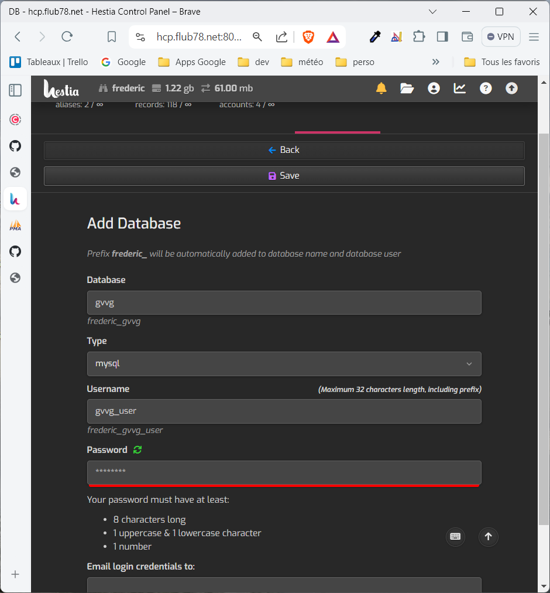

### Lancer le programme d'installation

```
https://gvvg.flub78.net/install/
```

#### Étape 1 — Prérequis

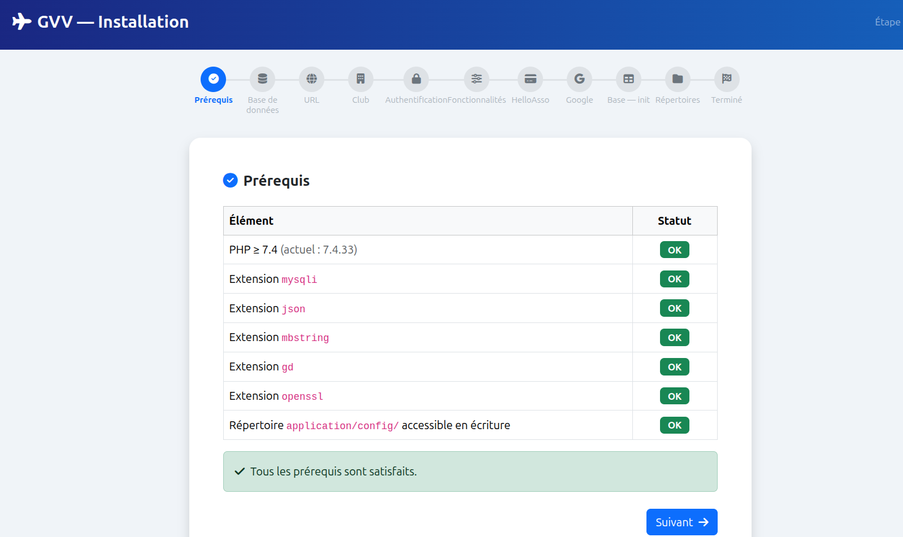

##### "Impossible de vérifier automatiquement l'état de mod_rewrite" (hébergement mutualisé)

Sur un hébergement mutualisé (OVH, Infomaniak, o2switch…), l'assistant d'installation n'a
généralement pas accès aux fonctions `apache_get_modules()` ni `shell_exec()` : il ne peut donc
pas déterminer automatiquement si le module Apache `mod_rewrite` est actif et affiche
l'avertissement suivant à l'étape 1 :

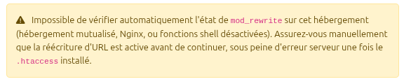

Ce n'est pas une erreur bloquante : c'est une invitation à vérifier vous-même, car GVV a besoin
de `mod_rewrite` pour que son fichier `.htaccess` fonctionne (sans lui, le serveur renvoie une
erreur 500 `Invalid command 'RewriteEngine'` dès que le `.htaccess` est en place).

En pratique, `mod_rewrite` est activé par défaut chez la quasi-totalité des hébergeurs
mutualisés grand public (OVH, Infomaniak, o2switch, PlanetHoster…), donc cet avertissement peut
souvent être ignoré. Pour en avoir la confirmation avant de poursuivre l'installation :

1. Créez un répertoire de test à la racine du site, par exemple `public_html/rewrite-test/`.
2. Dans ce répertoire, créez un fichier `.htaccess` avec :

   ```apache
   RewriteEngine On
   RewriteRule ^ping$ ping.php [L]
   ```

3. Créez un fichier `ping.php` à côté, contenant :

   ```php
   <?php echo 'mod_rewrite OK';
   ```

4. Visitez `https://votredomaine/rewrite-test/ping` dans un navigateur :
   * la page affiche `mod_rewrite OK` → le module est actif, vous pouvez poursuivre l'installation
     sans crainte ;
   * la page affiche une erreur 500 (souvent `Invalid command 'RewriteEngine'`) → le module est
     inactif ou l'hébergement ne l'autorise pas dans les `.htaccess` ; contactez le support de
     votre hébergeur pour le faire activer avant de continuer.
5. Une fois la vérification faite, supprimez le répertoire `rewrite-test/`.

Si vous avez un accès SSH, vous pouvez aussi tenter directement `apache2ctl -M | grep rewrite`
ou `httpd -M | grep rewrite`, mais ces commandes sont rarement disponibles sur un mutualisé
(c'est justement pour cela que l'assistant affiche "Indéterminé" plutôt que "OK"/"KO").

##### Erreur 500 dès l'écriture du `.htaccess` (Ionos et autres mutualisés en PHP-FPM)

Sur certains hébergements mutualisés (constaté chez **Ionos**), l'installation du `.htaccess`
déclenche immédiatement une erreur serveur :

```
Internal Server Error
The server encountered an internal error or misconfiguration and was unable to complete
your request.
...
Additionally, a 500 Internal Server Error error was encountered while trying to use an
ErrorDocument to handle the request.
```

Le double échec (même la page d'erreur personnalisée ne s'affiche pas) est un signe classique
d'une **erreur de syntaxe/configuration dans le `.htaccess` lui-même** : comme le fichier est
invalide, Apache le rejette pour *toutes* les requêtes du répertoire, y compris celle générée en
interne pour afficher la page d'erreur.

**Cause** : le `.htaccess` de GVV (généré à partir de `point.htaccess`) contient des directives
`php_value` pour augmenter les limites mémoire/upload lors des sauvegardes. Ces directives ne
sont valides qu'avec PHP en module Apache (`mod_php`). Or la plupart des hébergements mutualisés
modernes (Ionos compris) exécutent PHP en **PHP-FPM/FastCGI**, où `php_value` dans un `.htaccess`
est une directive inconnue → Apache refuse de charger le fichier → erreur 500 sur tout le site.

**Diagnostic** (si le journal d'erreurs Apache n'est pas accessible depuis votre hébergeur, ce
qui est le cas chez Ionos où seuls les `access.log` sont exposés dans `~/logs`) : tester par
élimination directement sur le site.

1. Remplacez temporairement le contenu du `.htaccess` par la version sans les lignes
   `php_value` (juste `RewriteEngine On` + les règles de réécriture) et rechargez une page.
2. Si l'erreur 500 disparaît, la cause est confirmée : ce sont les `php_value` qui posent
   problème.

**Correctif** : `point.htaccess` encadre désormais ces directives dans des blocs `<IfModule>`,
qu'Apache ignore silencieusement si le module `mod_php` n'est pas chargé (cas PHP-FPM), au lieu
de faire échouer le parsing de tout le fichier :

```apache
<IfModule mod_php7.c>
php_value memory_limit 1024M
php_value max_execution_time 300
php_value upload_max_filesize 1024M
php_value post_max_size 1024M
</IfModule>
<IfModule mod_php8.c>
php_value memory_limit 1024M
php_value max_execution_time 300
php_value upload_max_filesize 1024M
php_value post_max_size 1024M
</IfModule>
```

Sur un hébergement en PHP-FPM, ces limites (mémoire, taille d'upload, temps d'exécution) doivent
alors être ajustées directement dans la configuration du pool PHP-FPM ou via un fichier
`.user.ini` déposé à la racine du site — via le panneau d'administration de l'hébergeur si l'accès
au pool FPM n'est pas donné.

##### Seule la page d'accueil fonctionne, tout le reste renvoie une 404 (Ionos)

Autre symptôme constaté chez **Ionos**, une fois les deux points précédents corrigés : le site
s'affiche à la racine (`https://votredomaine/`), mais toute autre URL — y compris celles vers
lesquelles GVV redirige lui-même, comme `/auth/login` pour un utilisateur non connecté — renvoie
une erreur 404 générique de l'hébergeur (pas la page 404 de GVV), *sans* passer par `index.php`.

**Cause** : la racine fonctionne car Apache la sert directement via `DirectoryIndex`, sans avoir
besoin de réécriture d'URL. Mais Ionos exige une directive `RewriteBase` explicite juste après
`RewriteEngine On` pour que les `RewriteRule` d'un `.htaccess` s'appliquent réellement — sans elle,
Apache ignore la règle pour toute URL autre que la racine et répond 404 avant même d'atteindre PHP.
C'est documenté par Ionos lui-même (voir liens ci-dessous).

**Piste à écarter** : `Options +FollowSymLinks` (parfois recommandé pour ce type de symptôme sur
d'autres hébergeurs) provoque ici une erreur 500 `Options not allowed here` — Ionos interdit cette
directive en `.htaccess`. Inutile d'insister sur cette piste chez Ionos.

**Correctif** (appliqué dans `point.htaccess`) : ajouter `RewriteBase /` juste après
`RewriteEngine On` :

```apache
RewriteEngine On
RewriteBase /
```

Le `/` suppose que le domaine ou sous-domaine est mappé directement sur le répertoire de GVV dans
le Domain Center Ionos (cas standard). Vérifiez aussi que le `.htaccess` a bien les permissions
`644`.

Sources : [Notes on Creating Rewrite Rules (Ionos)](https://www.ionos.com/help/hosting/htaccess/notes-on-creating-rewrite-rules/) ·
[What is a rewrite engine? (Ionos)](https://www.ionos.com/digitalguide/hosting/technical-matters/what-is-a-rewrite-engine/)

#### Étape 2 — Configuration de la base de données

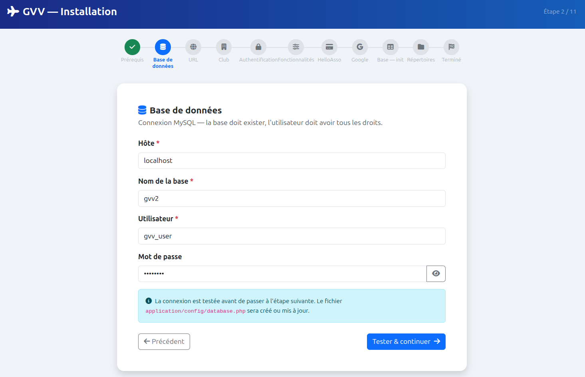

#### Étape 3 — URL de l'application

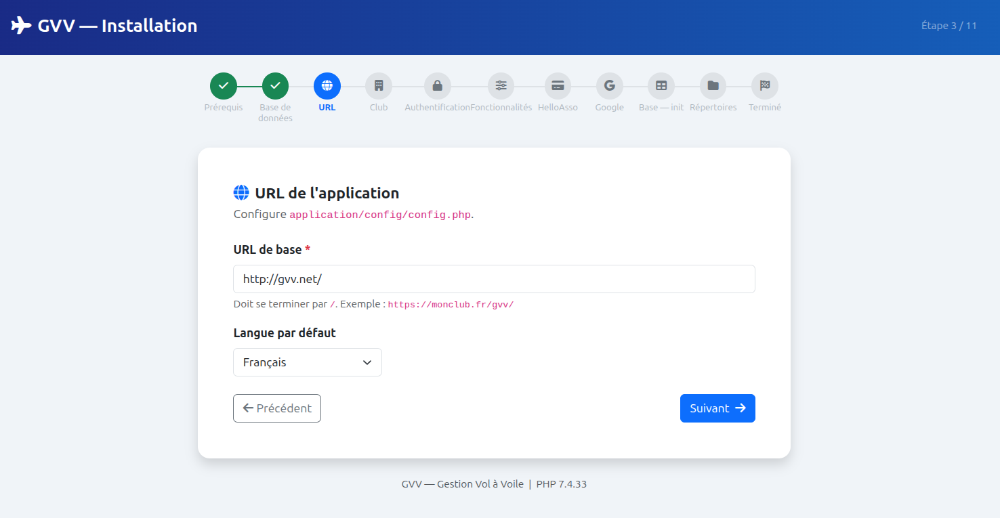

#### Étape 6 — Fonctionnalités

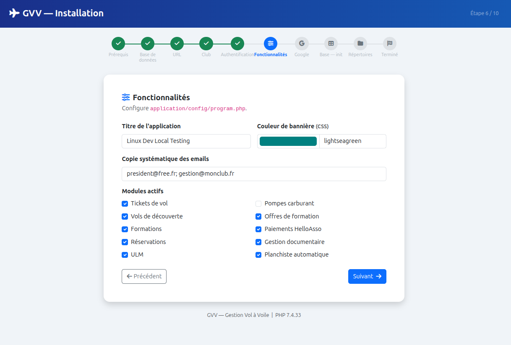

#### Étape 7 — Google (optionnel)

Synchronisation du calendrier Google. Peut être passée si non utilisé.

#### Étape 8 — Email Brevo (optionnel)

Configuration SMTP pour l'envoi d'emails via [Brevo](https://www.brevo.com/).

> **Sur un hébergement mutualisé** (OVH, Infomaniak, o2switch…), cette étape peut être **passée** : le serveur mutualisé configure lui-même la fonction PHP `mail()` et les emails partent sans configuration SMTP supplémentaire.
>
> Utilisez Brevo uniquement sur un VPS ou serveur dédié où le port 587 est ouvert.

Si vous configurez Brevo :
1. Créez un compte sur [brevo.com](https://www.brevo.com/)
2. Dans le tableau de bord Brevo : **SMTP & API → Identifiants SMTP**
3. Notez l'**identifiant SMTP** (format `xxxxxxxx@smtp-brevo.com`) et générez une **clé SMTP** (commence par `xsmtpsib-`)
4. Saisissez ces deux valeurs dans le formulaire — le reste (hôte, port, chiffrement) est pré-configuré

#### Étape 9 — Initialisation de la base de données

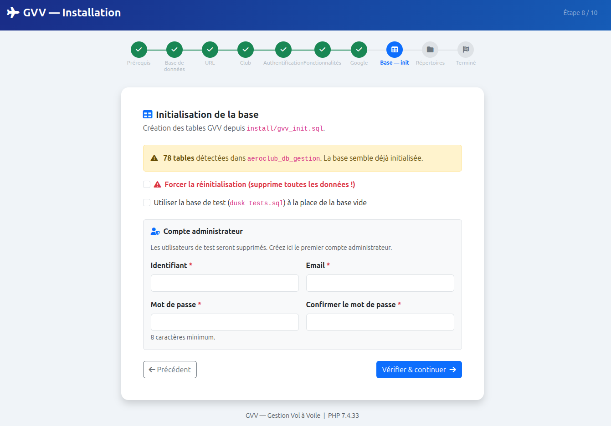

#### Étape 10 — Répertoires & droits

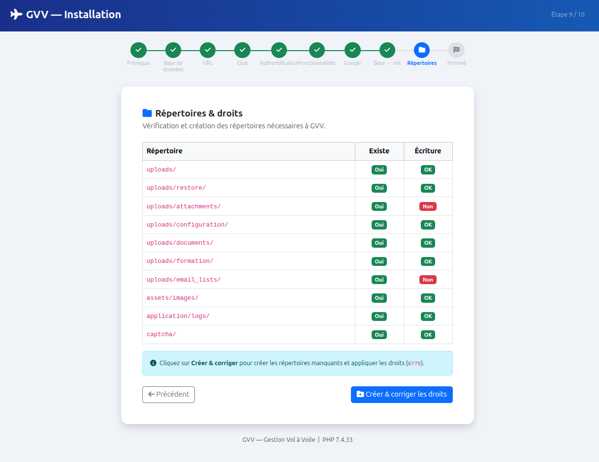

#### Étape 11 — Installation terminée

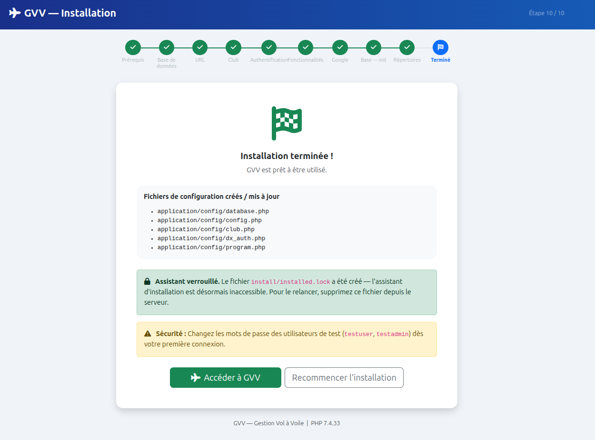

### Étapes additionnelles

* Vérifiez la quantité de mémoire disponible pour l'application. La librairie zip utilisée pour les sauvegardes et restauration à besoin de beaucoup de mémoire.

> J'ai résolu mon problème de sauvegarde de la base de donnée qui me retournait systématiquement une erreur 500.
> Dans le fichier /etc/php/<version>/apache2/php.ini (7.4 ou 8.4 selon la version installée), > j'ai passé memory_limit de 128M à 256M
> Je pense que le module zip n'avait pas assez de mémoire disponible à la vue des données à compresser.
> Ça risque d'arriver à tout le monde au fur et à mesure du temps...

#### Configuration des emails

La configuration email est prise en charge par l'étape 8 de l'assistant d'installation.
Si vous avez passé cette étape ou souhaitez la modifier manuellement, créez ou éditez `application/config/email.php` à partir du modèle `email.example.php` :


#### Configuration de la tache cron pour les sauvegardes automatiques

L'objectif est d'automatiser une sauvegarde quotidienne de la base (et optionnellement des médias) sans passer par l'interface web.

1. Créez un script shell dédié sur le serveur, par exemple `/usr/local/bin/gvv_backup.sh` :

```bash
#!/usr/bin/env bash
set -euo pipefail

# === Paramètres à adapter ===
DB_HOST="127.0.0.1"
DB_NAME="gvv"
DB_USER="gvv_user"
DB_PASS="change_me"
BACKUP_DIR="/home/www/gvv/backups"
WEBROOT="/home/www/gvv"

DATE="$(date +%Y%m%d_%H%M%S)"
FILE_PREFIX="${DB_NAME}_backup_${DATE}"
SQL_FILE="${BACKUP_DIR}/${FILE_PREFIX}.sql"
ZIP_FILE="${BACKUP_DIR}/${FILE_PREFIX}.zip"
MEDIA_FILE="${BACKUP_DIR}/uploads_${DATE}.tar.gz"

mkdir -p "${BACKUP_DIR}"

# Sauvegarde SQL
/usr/bin/mysqldump \
    --host="${DB_HOST}" \
    --user="${DB_USER}" \
    --password="${DB_PASS}" \
    --single-transaction \
    --routines \
    --triggers \
    "${DB_NAME}" > "${SQL_FILE}"

# Compression SQL
/usr/bin/zip -j "${ZIP_FILE}" "${SQL_FILE}"
rm -f "${SQL_FILE}"

# Sauvegarde des médias (optionnel mais recommandé)
/usr/bin/tar \
    --exclude='restore' \
    --exclude='attachments_backup' \
    -czf "${MEDIA_FILE}" \
    -C "${WEBROOT}" uploads

# Rétention: conserve 30 jours
/usr/bin/find "${BACKUP_DIR}" -type f -name '*.zip' -mtime +30 -delete
/usr/bin/find "${BACKUP_DIR}" -type f -name '*.tar.gz' -mtime +30 -delete
```

2. Donnez les droits d'exécution :

```bash
sudo chmod 750 /usr/local/bin/gvv_backup.sh
```

3. Testez le script manuellement avant de planifier :

```bash
sudo /usr/local/bin/gvv_backup.sh
ls -lh /home/www/gvv/backups
```

4. Éditez la crontab de l'utilisateur qui exécute le serveur web (ou d'un utilisateur technique dédié) :

```bash
crontab -e
```

5. Ajoutez une exécution quotidienne (exemple 02:15) avec journal dédié :

```cron
15 2 * * * /usr/local/bin/gvv_backup.sh >> /var/log/gvv-backup.log 2>&1
```

6. Vérifiez que le service cron est actif :

```bash
sudo systemctl status cron
```

> Recommandation sécurité : évitez de laisser le mot de passe MySQL en clair dans un script. En production, préférez un fichier de credentials MySQL (`~/.my.cnf`) lisible uniquement par l'utilisateur d'exécution.


#### Vérification du bon fonctionnement

Après configuration, validez les points suivants :

1. La tâche est bien enregistrée :

```bash
crontab -l
```

2. Le log se met à jour à l'heure prévue :

```bash
tail -n 50 /var/log/gvv-backup.log
```

3. De nouveaux fichiers apparaissent dans le répertoire de sauvegarde :

```bash
ls -ltr /home/www/gvv/backups | tail -n 10
```

4. L'archive SQL est lisible :

```bash
unzip -l /home/www/gvv/backups/<fichier>.zip
```

5. La sauvegarde média est lisible :

```bash
tar -tzf /home/www/gvv/backups/<fichier>.tar.gz | head -n 20
```

6. (Recommandé) Faites un test de restauration sur une base de test au moins une fois :

```bash
unzip -p /home/www/gvv/backups/<fichier>.zip | mysql -u <user> -p <base_test>
```


#### Troubleshooting (cron et sauvegardes)

Symptôme: aucun nouveau fichier dans `backups`.
Cause probable: la crontab n'est pas installée pour le bon utilisateur, ou cron n'est pas démarré.
Vérifications:

```bash
crontab -l
sudo systemctl status cron
```

Symptôme: `mysqldump: command not found`.
Cause probable: chemin binaire différent selon la distribution.
Correctif:

```bash
which mysqldump
```

Puis remplacez `/usr/bin/mysqldump` dans le script par le chemin trouvé.

Symptôme: `Access denied for user` lors du dump.
Cause probable: identifiants MySQL incorrects ou droits insuffisants.
Correctif: testez la connexion avec les mêmes identifiants et accordez les droits `SELECT`, `LOCK TABLES`, `SHOW VIEW`, `TRIGGER` selon votre configuration.

Symptôme: le job cron tourne manuellement mais échoue en automatique.
Cause probable: variables d'environnement minimales dans cron (PATH, droits, répertoire courant).
Correctif: utilisez des chemins absolus (comme dans l'exemple), et journalisez `stdout/stderr` dans `/var/log/gvv-backup.log`.

Symptôme: erreurs `No space left on device` ou backups incomplètes.
Cause probable: disque plein ou rétention absente.
Correctif:

```bash
df -h
du -sh /home/www/gvv/backups
```

Activez la rotation/rétention (exemple fourni: suppression au-delà de 30 jours).

Symptôme: erreur 500 lors d'une sauvegarde via l'interface web.
Cause probable: mémoire PHP insuffisante pour la compression.
Correctif: augmentez `memory_limit` dans `/etc/php/<version>/apache2/php.ini` (7.4 ou 8.4 selon la version installée ; exemple courant: `256M`) puis redémarrez Apache.


#### Configuration de HelloAsso

#### Erreur fatale après installation sur hébergement PHP 8 mutualisé (constaté chez Ionos)

Sur certains hébergements mutualisés exécutant PHP 8 (constaté chez **Ionos**), le site reste
inaccessible juste après l'installation — page blanche ou `HTTP ERROR 500` générique en mode
production, ou en activant temporairement `ENVIRONMENT = "development"` dans `index.php` :

```
A PHP Error was encountered
Severity: 8192
Message: CI_Log::write_log(): Optional parameter $level declared before required
parameter $msg is implicitly treated as a required parameter
Filename: libraries/Log.php
Line Number: 72

Deprecated: CI_Log::write_log(): ... in .../system/libraries/Log.php on line 72

Fatal error: Cannot redeclare class CI_Log (previously declared in
.../system/libraries/Log.php:27) in .../system/libraries/Log.php on line 27
```

**Cause** : `system/libraries/Log.php` (cœur CodeIgniter 2.x, non modifié depuis l'import initial
du projet) déclarait `write_log($level = 'error', $msg, $php_error = FALSE)` — un paramètre
optionnel avant un paramètre obligatoire, ce qui est invalide depuis PHP 8.0 et génère un
avertissement `E_DEPRECATED` **au moment de la compilation** du fichier. Le gestionnaire
d'erreurs de CodeIgniter, déjà actif à ce stade du démarrage, intercepte cet avertissement et
tente de journaliser l'erreur, ce qui redemande le chargement de la classe `Log` alors que son
tout premier chargement n'est pas terminé : le fichier est inclus une seconde fois avant que la
classe `CI_Log` n'ait fini d'être déclarée, d'où le `Fatal error: Cannot redeclare class CI_Log`.

Ce plantage se produit **quel que soit le réglage `error_reporting`** : passer `ENVIRONMENT` en
`production` (qui force `error_reporting(0)`) masque l'affichage mais n'empêche pas le crash, car
ce diagnostic de compilation atteint le gestionnaire d'erreurs indépendamment de ce réglage.

Il ne se manifeste pas forcément sur toutes les instances en PHP 8 : ce diagnostic n'est émis
qu'à la *compilation* du fichier. Sur un serveur avec OPcache actif et persistant (VPS, machine
de développement), le fichier n'est compilé qu'une fois puis servi depuis le cache — la notice ne
réapparaît pas aux requêtes suivantes. Sur un mutualisé où chaque requête PHP est isolée (OPcache
désactivé ou non partagé entre requêtes), le fichier est recompilé à chaque fois : le plantage est
donc systématique.

**Correctif** (appliqué dans le dépôt) : donner une valeur par défaut à `$msg` dans
`system/libraries/Log.php` :

```php
public function write_log($level = 'error', $msg = '', $php_error = FALSE)
{
```

Ce correctif est sans effet sur PHP 7.4 (la dépréciation n'existe pas avant PHP 8.0) et supprime
la notice à la source sur PHP 8.x, quel que soit le comportement d'OPcache de l'hébergeur. Après
mise à jour du code sur le serveur (`git pull` ou remplacement du fichier), rechargez le site ;
n'oubliez pas de repasser `ENVIRONMENT` sur `"production"` dans `index.php` si vous l'aviez
temporairement basculé en `"development"` pour le diagnostic (le mode développement expose des
chemins serveur et des détails techniques aux visiteurs).

### Premiers pas

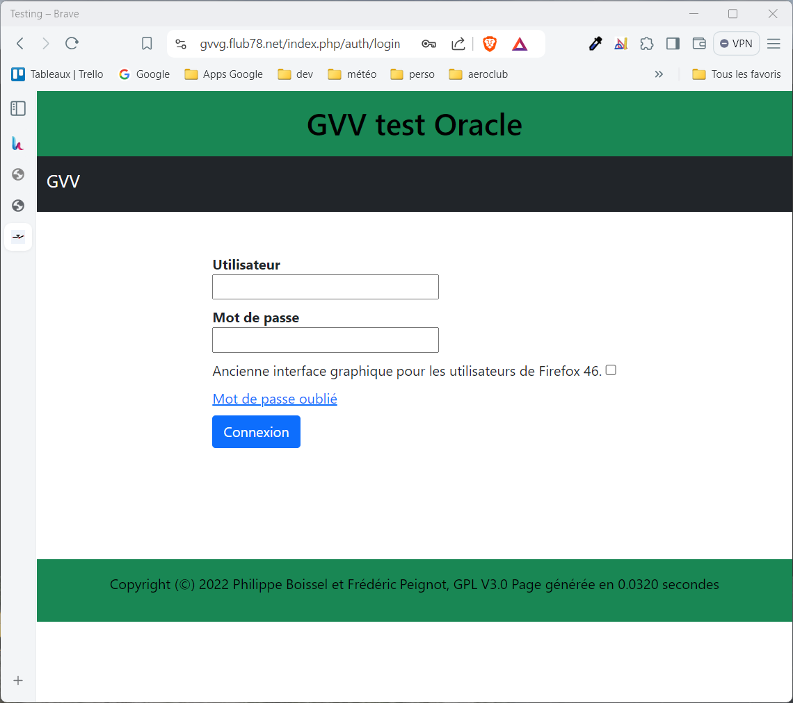

Si vous voyez la page suivante, c'est que GVV est correctement installé.

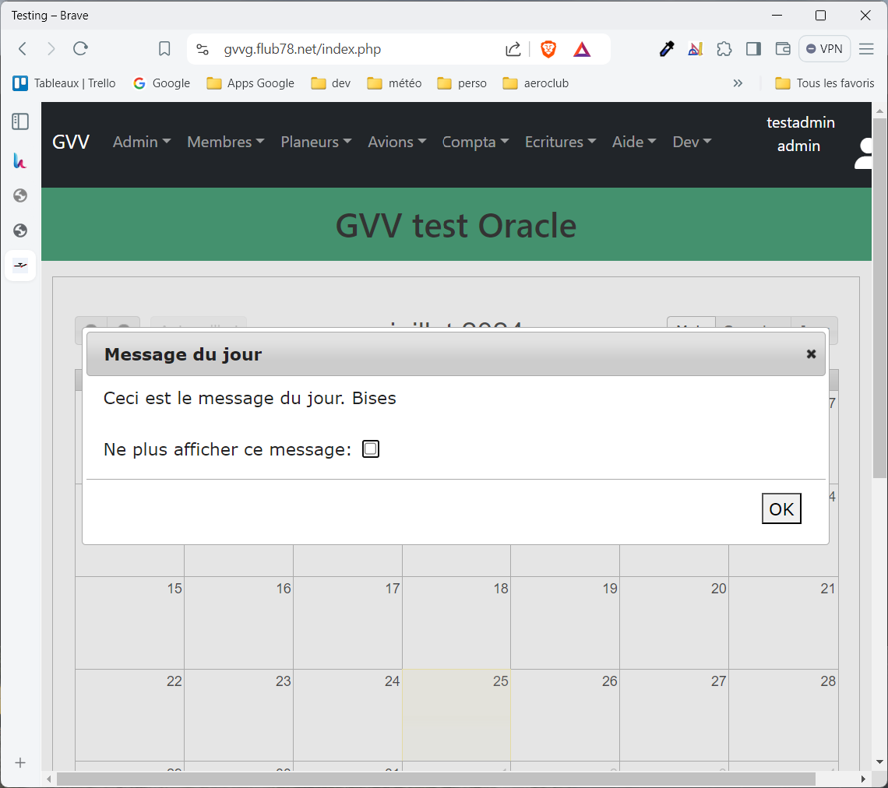

Un fois installé, je vous recommande de tester, tester et tester.

Créez, modifiez et supprimez:
* des comptes
* des machines
* les produits de facturation
* des vols
* etc.

Ensuite, si vous êtes déjà un club utilisateur, sauvegarder votre base de données et restaurez la sur votre nouvelle machine.