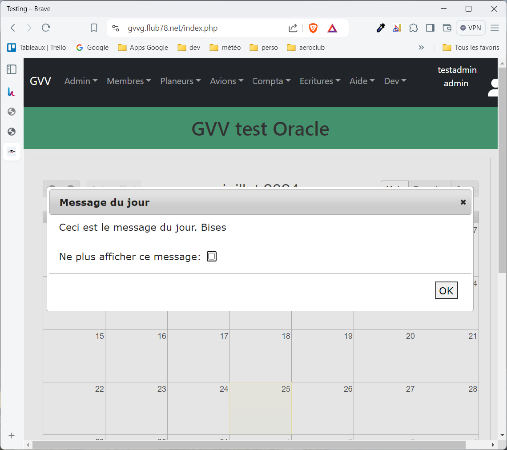

# Installation

La machine utilisée lors de la rédaction de cette documentation est une machine virtuelle Oracle free tier sur laquelle est installé Ubuntu 22.04 et Hestia Control Panel. 

https://www.oracle.com/cloud/free/

https://hestiacp.com/docs/introduction/getting-started.html.

https://www.youtube.com/watch?v=Hz58Zkke4VE&list=PLSk3zfDlC1f_Up6GBgckMIqLdS_HRjdEy&index=1&t=873s

C'est un environment entièrement gratuit, à vie, sans publicité et sans limite d'utilisation. Il est donc possible de l'utiliser pour tester et déployer GVV.

## Pré-requis

* une machine avec PHP 7.4 et MySql 5.x (linux ou windows, linux recommandé)
* un serveur web (Apache ou Nginx)

## Étapes d'installation

La plupart doivent être réalisées avec une connection ssh et le compte gestionnaire sur Hestia.

Certaines étapes se font avec l'interface graphique d'Hestia.

### Vérifiez la version php

    frederic@hcp:~$ php7.4 --version
        PHP 7.4.33 (cli) (built: Feb 14 2023 18:31:54) ( NTS )
        Copyright (c) The PHP Group
        Zend Engine v3.4.0, Copyright (c) Zend Technologies
        with Zend OPcache v7.4.33, Copyright (c), by Zend Technologies

Hestia Control Panel allows you to change the PHP version used by the domain.

By default, the latest version of PHP will be used. To change the PHP version, go to the WEB section - click the Edit domain icon - click the Additional options button - select the desired version in the Backend PHP-FPM template field - click the Save button.

### Configurer le serveur WEB, Apache ou Nginx, 

C'est déjà fait si vous utilisez Hestia.
Pour référence https://www.digitalocean.com/community/tutorials/how-to-install-linux-apache-mysql-php-lamp-stack-on-ubuntu-18-04. 

Installez une page WEB de test pour vérifier que le serveur web est bien configuré et accessible sur votre domaine.

Installez les certificats SSL.

Installez MySql et créez une base de données.

Notez que pour les utilisateurs de Hestia Control Panel, il est possible de réaliser ces étapes directement depuis l'interface web.

### Téléchargez GVV

Connectez vous à votre serveur avec SSH et allez dans le répertoire web. Dans mon cas ~/web/gvvg.flub78.net.

Donnez les droits d'écriture sur le répertoire.

git clone https://github.com/flub78/gvv.git

Renommez le répertoire gvv en public_html

Vérifiez l'accès https://gvvg.flub78.net/install/

### Vérifiez la base de données

    cp database.example.php database.php

    vi database.php

Il faut changer, le nom de la base, l'utilisateur et le mot de passe.

### Étapes additionnelles

* Créez le répertoire de journaux application/logs

### Configuration

Dans le fichier config.php, mettre à jour:

* base_url
* google_account
  
Dans le fichier club.php, mettre à jour ce qui vous intéresse. Notez que le les paramètres de config club peuvent également être modifiés dans l'application.

Un fois terminé, vous pouvez vous connecter comme testuser ou testadmin avec le mot de passe: password.

Si vous voyez la page suivante, c'est que GVV est correctement installé.

Un fois installé, je vous recommande de tester, tester et tester.

Créez, modifiez et supprimez:
* des comptes
* des machines
* les produits de facturation
* des vols
* etc.

Ensuite, si vous êtes déjà un club utilisateur, sauvegarder votre base de données et restaurez la sur votre nouvelle machine.