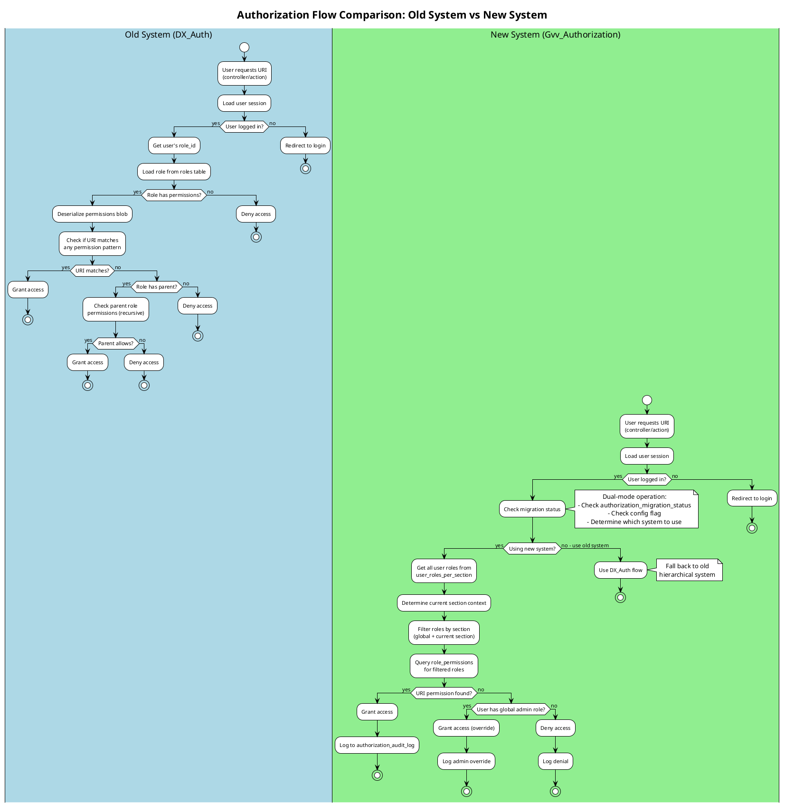
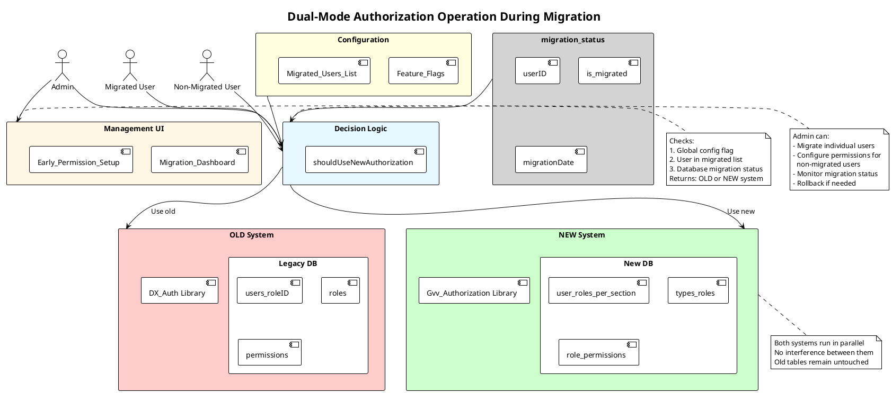

# GVV Authorization System Refactoring Plan

**Document Version:** 1.0
**Date:** 2025-01-08
**Status:** Planning Phase
**Author:** Claude Code Analysis

---

## Migration Progress Tracker

Use this checklist to track progress through the migration. Check off items as they are completed.

### Phase 0: Preparation (Week 1)
- [x] Full database backup created
- [ ] Current permissions exported to CSV
- [ ] Test environment set up and validated
- [ ] Code audit completed
- [ ] Preparation documentation reviewed by team

### Phase 1: Database Schema Migration (Week 2)
- [ ] Migration file 040 created
- [ ] `types_roles` table enhanced with `scope`, `is_system_role`, `display_order`, `translation_key`
- [ ] `role_permissions` table created
- [ ] `data_access_rules` table created
- [ ] `user_roles_per_section` table enhanced
- [ ] `authorization_audit_log` table created
- [ ] `authorization_migration_status` table created
- [ ] All indexes created
- [ ] Migration tested on dev environment
- [ ] Migration applied to production
- [ ] Database schema validation passed

### Phase 2: Data Migration (Week 3)
- [ ] Admin roles migrated to user_roles_per_section
- [ ] URI permissions converted to role_permissions
- [ ] Default data access rules populated
- [ ] **Role translation files created (French, English, Dutch)**
- [ ] Migration scripts tested
- [ ] Data validation queries passed
- [ ] Rollback script tested
- [ ] Data migration applied to production
- [ ] Post-migration verification completed

### Phase 3: Implement New Authorization Library (Week 4-5)
- [ ] `Gvv_Authorization` library created
- [ ] `Authorization_model` created
- [ ] `Gvv_Controller` modified for dual-mode
- [ ] Feature flag added to config.php
- [ ] Library unit tests written and passing
- [ ] Integration tests created
- [ ] Code review completed
- [ ] Library deployed to production (inactive)

### Phase 4: Build New UI Components (Week 6-7)
- [ ] `Authorization` controller created
- [ ] User roles management page built
- [ ] Role permissions management page built
- [ ] Data access rules page built
- [ ] DataTables integration completed
- [ ] UI testing completed
- [ ] Responsive design validated
- [ ] Accessibility review completed
- [ ] UI deployed to production (visible to admins only)

### Phase 5: Testing Framework (Week 8)
- [ ] `AuthorizationTestBase` class created
- [ ] `AuthorizationTest` test suite created
- [ ] `AuthorizationIntegrationTest` created
- [ ] All role-based tests passing
- [ ] Row-level security tests passing
- [ ] Section isolation tests passing
- [ ] Code coverage > 80%
- [ ] Test documentation completed

### Phase 6: Progressive Migration - Dual Mode (Week 9-10)
- [ ] `Authorization_migration` controller created
- [ ] `Migration_status_model` created
- [ ] Migration dashboard built
- [ ] Dual-mode authorization implemented in Gvv_Controller
- [ ] Feature flag mechanism tested
- [ ] Migration tracking verified

#### Phase 6.1: Pilot User Migration
- [ ] 2-3 pilot users identified
- [ ] Permissions configured for pilot users
- [ ] Pilot users migrated via UI
- [ ] 48-hour monitoring period completed
- [ ] Feedback collected from pilots
- [ ] Permission comparison validated
- [ ] Issues resolved (if any)

#### Phase 6.2: Role Group Migrations
- [ ] Day 1-2: Planchistes migrated (~30 users)
- [ ] Day 1-2: Monitoring completed, no issues
- [ ] Day 3-4: CA members migrated (~20 users)
- [ ] Day 3-4: Monitoring completed, no issues
- [ ] Day 5-6: Bureau members migrated (~15 users)
- [ ] Day 5-6: Monitoring completed, no issues
- [ ] Day 7-8: Tresoriers migrated (~10 users)
- [ ] Day 7-8: Monitoring completed, no issues
- [ ] Day 9-10: Remaining users migrated (~200 users)
- [ ] Day 9-10: Monitoring completed, no issues
- [ ] Day 11: Admin users migrated
- [ ] Day 11: Admin access verified

#### Phase 6.3: Pre-Cutover Validation
- [ ] 100% of users migrated successfully
- [ ] All users tested and validated
- [ ] No access denial issues for 7 days
- [ ] Performance metrics acceptable
- [ ] Comparison reports reviewed for all roles
- [ ] Rollback procedures tested
- [ ] Admin approval obtained

### Phase 7: Full Deployment (Week 11)
- [ ] Global enable flag set to TRUE
- [ ] Code deployed to production
- [ ] Cache cleared
- [ ] Web server restarted
- [ ] 48-hour monitoring active
- [ ] User communication sent
- [ ] No unexpected access denials
- [ ] Performance maintained
- [ ] Rollback plan ready (but not needed)

### Phase 8: Cleanup and Documentation (Week 12)
- [ ] Old roles/permissions tables renamed (not dropped)
- [ ] Documentation updated
- [ ] Admin user guide created
- [ ] **Developer documentation created (authorization implementation guide)**
- [ ] Administrator training completed
- [ ] Admin dashboard widget deployed
- [ ] Performance optimization completed
- [ ] Final audit log review
- [ ] Project retrospective completed
- [ ] Migration declared complete

---

## Migration Status Dashboard

| Metric | Target | Current | Status |
|--------|--------|---------|--------|
| **Overall Progress** | 100% | 0% | 🔴 Not Started |
| **Users Migrated** | 292 | 0 | 🔴 Not Started |
| **Database Schema** | Complete | Not Started | 🔴 Not Started |
| **Code Implementation** | Complete | Not Started | 🔴 Not Started |
| **Testing Coverage** | >80% | 0% | 🔴 Not Started |
| **Documentation** | Complete | In Progress | 🟡 In Progress |

**Legend:** 🔴 Not Started | 🟡 In Progress | 🟢 Complete | ⚠️ Blocked

**Last Updated:** 2025-01-08

---

## Product Requirements

The detailed product requirements, including the executive summary, current state analysis, goals, and UI mockups, have been extracted into a separate Product Requirements Document (PRD).

For a complete overview of the "what" and "why" of this project, please refer to the full PRD:
[**Authorization System Refactoring PRD**](../prds/2025_authorization_refactoring_prd.md)

The remainder of this document focuses on the technical implementation plan.


## Proposed Architecture

> **Visual Reference**: See [Appendix A](#appendix-a-database-schema-diagrams) for complete database schema diagram, authorization flow comparison, and architecture diagrams.

### New Database Schema

#### 1. Enhanced types_roles Table

```sql
ALTER TABLE `types_roles`
ADD COLUMN `scope` ENUM('global', 'section') NOT NULL DEFAULT 'section' AFTER `description`,
ADD COLUMN `is_system_role` TINYINT(1) NOT NULL DEFAULT 0 COMMENT 'Cannot be deleted' AFTER `scope`,
ADD COLUMN `display_order` INT NOT NULL DEFAULT 100 AFTER `is_system_role`,
ADD COLUMN `translation_key` VARCHAR(64) NULL COMMENT 'Language file key for role name' AFTER `display_order`;

-- Update existing roles
UPDATE types_roles SET scope='global', is_system_role=1, display_order=10, translation_key='role_admin' WHERE id=10; -- club-admin
UPDATE types_roles SET scope='global', is_system_role=1, display_order=20, translation_key='role_super_tresorier' WHERE id=9;  -- super-tresorier
UPDATE types_roles SET scope='global', is_system_role=1, display_order=30, translation_key='role_bureau' WHERE id=7;  -- bureau
UPDATE types_roles SET scope='section', is_system_role=1, display_order=40, translation_key='role_tresorier' WHERE id=8; -- tresorier
UPDATE types_roles SET scope='section', is_system_role=1, display_order=50, translation_key='role_ca' WHERE id=6; -- ca
UPDATE types_roles SET scope='section', is_system_role=1, display_order=60, translation_key='role_planchiste' WHERE id=5; -- planchiste
UPDATE types_roles SET scope='section', is_system_role=1, display_order=70, translation_key='role_auto_planchiste' WHERE id=2; -- auto_planchiste
UPDATE types_roles SET scope='section', is_system_role=1, display_order=80, translation_key='role_user' WHERE id=1; -- user
```

#### 2. New role_permissions Table (URI Permissions)

```sql
CREATE TABLE `role_permissions` (
  `id` INT(11) NOT NULL AUTO_INCREMENT,
  `types_roles_id` INT(11) NOT NULL COMMENT 'FK to types_roles',
  `section_id` INT(11) NULL COMMENT 'NULL for global roles, specific section for section roles',
  `controller` VARCHAR(64) NOT NULL COMMENT 'Controller name (e.g., "membre", "vols_planeur")',
  `action` VARCHAR(64) NULL COMMENT 'Action name, NULL means all actions',
  `permission_type` ENUM('view', 'create', 'edit', 'delete', 'admin') NOT NULL DEFAULT 'view',
  `created` DATETIME NOT NULL DEFAULT CURRENT_TIMESTAMP,
  `modified` TIMESTAMP NOT NULL DEFAULT CURRENT_TIMESTAMP ON UPDATE CURRENT_TIMESTAMP,
  PRIMARY KEY (`id`),
  KEY `idx_role_section` (`types_roles_id`, `section_id`),
  KEY `idx_controller_action` (`controller`, `action`),
  FOREIGN KEY (`types_roles_id`) REFERENCES `types_roles` (`id`) ON DELETE CASCADE,
  FOREIGN KEY (`section_id`) REFERENCES `sections` (`id`) ON DELETE CASCADE
) ENGINE=InnoDB DEFAULT CHARSET=utf8mb4 COMMENT='URI and action permissions per role';

-- Indexes for performance
CREATE INDEX idx_permission_lookup ON role_permissions(types_roles_id, controller, action);
```

#### 3. New data_access_rules Table (Row-Level Security)

```sql
CREATE TABLE `data_access_rules` (
  `id` INT(11) NOT NULL AUTO_INCREMENT,
  `types_roles_id` INT(11) NOT NULL,
  `table_name` VARCHAR(64) NOT NULL COMMENT 'Table being accessed',
  `access_scope` ENUM('own', 'section', 'all') NOT NULL DEFAULT 'own',
  `field_name` VARCHAR(64) NULL COMMENT 'Field to check for ownership (e.g., "user_id", "membre_id")',
  `section_field` VARCHAR(64) NULL COMMENT 'Field containing section_id',
  `description` TEXT NULL,
  PRIMARY KEY (`id`),
  UNIQUE KEY `unique_rule` (`types_roles_id`, `table_name`, `access_scope`),
  FOREIGN KEY (`types_roles_id`) REFERENCES `types_roles` (`id`) ON DELETE CASCADE
) ENGINE=InnoDB DEFAULT CHARSET=utf8mb4 COMMENT='Row-level data access rules';
```

#### 4. Enhanced user_roles_per_section Table

```sql
-- Already exists, just add indexes and audit fields
ALTER TABLE `user_roles_per_section`
ADD COLUMN `granted_by` INT(11) NULL COMMENT 'User who granted this role' AFTER `section_id`,
ADD COLUMN `granted_at` DATETIME NOT NULL DEFAULT CURRENT_TIMESTAMP AFTER `granted_by`,
ADD COLUMN `revoked_at` DATETIME NULL AFTER `granted_at`,
ADD COLUMN `notes` TEXT NULL AFTER `revoked_at`;

-- Add foreign key
ALTER TABLE `user_roles_per_section`
ADD FOREIGN KEY (`granted_by`) REFERENCES `users` (`id`) ON DELETE SET NULL;

-- Add index for performance
CREATE INDEX idx_user_section_active ON user_roles_per_section(user_id, section_id, revoked_at);
```

#### 5. New authorization_audit_log Table

```sql
CREATE TABLE `authorization_audit_log` (
  `id` INT(11) NOT NULL AUTO_INCREMENT,
  `action_type` ENUM('grant_role', 'revoke_role', 'modify_permission', 'access_denied', 'access_granted') NOT NULL,
  `actor_user_id` INT(11) NULL COMMENT 'User who performed the action',
  `target_user_id` INT(11) NULL COMMENT 'User affected by action',
  `types_roles_id` INT(11) NULL,
  `section_id` INT(11) NULL,
  `controller` VARCHAR(64) NULL,
  `action` VARCHAR(64) NULL,
  `ip_address` VARCHAR(45) NULL,
  `details` TEXT NULL COMMENT 'JSON or text details',
  `created_at` DATETIME NOT NULL DEFAULT CURRENT_TIMESTAMP,
  PRIMARY KEY (`id`),
  KEY `idx_actor` (`actor_user_id`),
  KEY `idx_target` (`target_user_id`),
  KEY `idx_timestamp` (`created_at`)
) ENGINE=InnoDB DEFAULT CHARSET=utf8mb4 COMMENT='Audit log for authorization changes';
```

### New Authorization Library

#### File: application/libraries/Gvv_Authorization.php

**Key Methods:**

```php
class Gvv_Authorization {

    /**
     * Check if user has permission to access controller/action
     *
     * @param int $user_id
     * @param string $controller
     * @param string $action
     * @param int|null $section_id Section context
     * @return bool
     */
    public function can_access($user_id, $controller, $action = null, $section_id = null);

    /**
     * Check if user can access specific data row
     *
     * @param int $user_id
     * @param string $table_name
     * @param array $row_data Row to check
     * @param string $operation (view, edit, delete)
     * @param int|null $section_id
     * @return bool
     */
    public function can_access_data($user_id, $table_name, $row_data, $operation = 'view', $section_id = null);

    /**
     * Get all roles for user (global + section-specific)
     *
     * @param int $user_id
     * @param int|null $section_id Filter by section
     * @return array Array of role objects
     */
    public function get_user_roles($user_id, $section_id = null);

    /**
     * Check if user is admin (global override)
     */
    public function is_admin($user_id);

    /**
     * Grant role to user
     */
    public function grant_role($user_id, $types_roles_id, $section_id = null, $granted_by = null);

    /**
     * Revoke role from user
     */
    public function revoke_role($user_id, $types_roles_id, $section_id = null);

    /**
     * Log authorization event
     */
    protected function log_event($action_type, $details = []);
}
```

#### Modified Gvv_Controller Base Class

```php
// In application/libraries/Gvv_Controller.php

function __construct() {
    parent::__construct();

    $this->load->library('Gvv_Authorization', null, 'gvv_auth');

    // Set section context from URL or session
    $this->current_section_id = $this->determine_section_context();

    // Check authorization (unless in test mode)
    if (getenv('TEST') != '1') {
        $this->check_authorization();
    }
}

/**
 * Check if current user can access this controller/action
 */
protected function check_authorization() {
    $user_id = $this->session->userdata('DX_user_id');
    $controller = $this->router->fetch_class();
    $action = $this->router->fetch_method();

    // Admin bypass
    if ($this->gvv_auth->is_admin($user_id)) {
        return true;
    }

    // Check permission
    if (!$this->gvv_auth->can_access($user_id, $controller, $action, $this->current_section_id)) {
        $this->gvv_auth->log_event('access_denied', [
            'user_id' => $user_id,
            'controller' => $controller,
            'action' => $action,
            'section_id' => $this->current_section_id
        ]);
        show_error('Accès refusé', 403);
    }
}

/**
 * Check if user can access specific data
 */
protected function can_access_data($table_name, $row_data, $operation = 'view') {
    $user_id = $this->session->userdata('DX_user_id');

    return $this->gvv_auth->can_access_data(
        $user_id,
        $table_name,
        $row_data,
        $operation,
        $this->current_section_id
    );
}
```

### New UI Components

#### 1. User Role Management Page (backend/user_roles)

**Features:**
- DataTables-based user list
- Checkboxes for each role (global and section-specific)
- Filters:
  - Section dropdown
  - Active/Inactive toggle
  - Search by username/email
- Visual indicators:
  - Badge colors for different role types
  - Icons for global vs section roles
  - Last modified timestamp
- Bulk operations:
  - Grant role to multiple users
  - Revoke role from multiple users

**Mockup Structure:**
```
[Section Filter: All / Planeur / ULM / Avion / Général]
[Active Users Only: ☑]
[Search: ______]

+----------+---------+------------+------------------+------------------+
| Username | Email   | Global     | Section: Planeur | Section: ULM     |
|          |         | Roles      | Roles            | Roles            |
+----------+---------+------------+------------------+------------------+
| fpeignot | f@...   | ☑ Admin    | ☑ CA             | ☐ Tresorier      |
|          |         | ☐ Bureau   | ☑ Planchiste     | ☐ Planchiste     |
+----------+---------+------------+------------------+------------------+
| agnes    | a@...   | ☐ Admin    | ☑ Tresorier      | ☐ Tresorier      |
|          |         | ☐ Bureau   | ☑ User           | ☐ User           |
+----------+---------+------------+------------------+------------------+
```

#### 2. Role Permission Management Page (backend/role_permissions)

**Features:**
- Select role to configure
- Group permissions by domain (Membres, Avions, Vols, Comptabilité, etc.)
- Checkboxes for each controller/action
- Permission types: View / Create / Edit / Delete
- Section-specific permission override
- Save/Cancel buttons

**Mockup Structure:**
```
[Select Role: Planchiste ▼]  [Section: Planeur ▼]

Domain: Vols Planeur
┌──────────────────┬──────┬────────┬──────┬────────┐
│ Action           │ View │ Create │ Edit │ Delete │
├──────────────────┼──────┼────────┼──────┼────────┤
│ vols_planeur/    │  ☑   │   ☑    │  ☑   │   ☑    │
│ vols_planeur/pdf │  ☑   │   ☐    │  ☐   │   ☐    │
└──────────────────┴──────┴────────┴──────┴────────┘

Domain: Membres
┌──────────────────┬──────┬────────┬──────┬────────┐
│ Action           │ View │ Create │ Edit │ Delete │
├──────────────────┼──────┼────────┼──────┼────────┤
│ membre/          │  ☑   │   ☐    │  ☐   │   ☐    │
│ membre/view      │  ☑   │   ☐    │  ☐   │   ☐    │
└──────────────────┴──────┴────────┴──────┴────────┘

[Save Permissions]  [Cancel]
```

#### 3. Data Access Rules Page (backend/data_access_rules)

**Features:**
- Configure row-level access per role
- Define "own data" criteria
- Set section boundaries

**Example Configuration:**
```
Role: Auto_planchiste
Table: vols_planeur
Access Scope: Own data
Owner Field: pilote_id (must match user's membre_id)
Section Field: section_id

Rule: User can only view/edit flights where pilote_id matches their membre_id
      AND section_id matches their assigned section
```

## Migration Strategy

> **Visual Reference**: See [Migration Timeline Diagram](#migration-timeline) in Appendix A for a visual representation of all phases and their dependencies.

### Phase 0: Preparation (Week 1)

**Objectives:**
- Validate current system state
- Create backups
- Set up test environment

**Tasks:**

1. **Database Backup**
```bash
mysqldump -u gvv_user -p gvv2 > backups/gvv2_pre_migration_$(date +%Y%m%d).sql
```

2. **Document Current Permissions**
```sql
-- Export current role assignments
SELECT u.username, r.name as role, p.data as permissions
INTO OUTFILE '/tmp/current_permissions.csv'
FROM users u
JOIN roles r ON u.role_id = r.id
LEFT JOIN permissions p ON r.id = p.role_id;
```

3. **Create Test Environment**
- Clone production database to test instance
- Set up parallel testing environment
- Create test user accounts for each role

4. **Code Review**
- Audit all controllers for check_uri_permissions() calls
- Identify data access patterns needing row-level security
- Document special cases (e.g., admin overrides)

**Deliverables:**
- Full database backup
- Current permissions export (CSV)
- Test environment URL
- Code audit report

**Rollback:** N/A (preparation only)

---

### Phase 1: Database Schema Migration (Week 2)

**Objectives:**
- Add new tables and columns
- Preserve existing data
- Ensure admin access remains intact

**Tasks:**

1. **Create Migration File: 040_authorization_refactoring.php**

```php
<?php
defined('BASEPATH') OR exit('No direct script access allowed');

class Migration_Authorization_Refactoring extends CI_Migration {

    public function up() {
        // 1. Enhance types_roles table
        $this->db->query("
            ALTER TABLE `types_roles`
            ADD COLUMN `scope` ENUM('global', 'section') NOT NULL DEFAULT 'section' AFTER `description`,
            ADD COLUMN `is_system_role` TINYINT(1) NOT NULL DEFAULT 0 AFTER `scope`,
            ADD COLUMN `display_order` INT NOT NULL DEFAULT 100 AFTER `is_system_role`,
            ADD COLUMN `translation_key` VARCHAR(64) NULL COMMENT 'Language file key for role name' AFTER `display_order`
        ");

        // 2. Update existing role types
        $this->db->query("UPDATE types_roles SET scope='global', is_system_role=1, display_order=10, translation_key='role_admin' WHERE id=10");
        $this->db->query("UPDATE types_roles SET scope='global', is_system_role=1, display_order=20, translation_key='role_super_tresorier' WHERE id=9");
        $this->db->query("UPDATE types_roles SET scope='global', is_system_role=1, display_order=30, translation_key='role_bureau' WHERE id=7");
        $this->db->query("UPDATE types_roles SET scope='section', is_system_role=1, display_order=40, translation_key='role_tresorier' WHERE id=8");
        $this->db->query("UPDATE types_roles SET scope='section', is_system_role=1, display_order=50, translation_key='role_ca' WHERE id=6");
        $this->db->query("UPDATE types_roles SET scope='section', is_system_role=1, display_order=60, translation_key='role_planchiste' WHERE id=5");
        $this->db->query("UPDATE types_roles SET scope='section', is_system_role=1, display_order=70, translation_key='role_auto_planchiste' WHERE id=2");
        $this->db->query("UPDATE types_roles SET scope='section', is_system_role=1, display_order=80, translation_key='role_user' WHERE id=1");

        // 3. Create role_permissions table
        $this->dbforge->add_field([
            'id' => ['type' => 'INT', 'constraint' => 11, 'auto_increment' => TRUE],
            'types_roles_id' => ['type' => 'INT', 'constraint' => 11],
            'section_id' => ['type' => 'INT', 'constraint' => 11, 'null' => TRUE],
            'controller' => ['type' => 'VARCHAR', 'constraint' => 64],
            'action' => ['type' => 'VARCHAR', 'constraint' => 64, 'null' => TRUE],
            'permission_type' => ['type' => 'ENUM', 'constraint' => ['view','create','edit','delete','admin'], 'default' => 'view'],
            'created' => ['type' => 'DATETIME'],
            'modified' => ['type' => 'TIMESTAMP']
        ]);
        $this->dbforge->add_key('id', TRUE);
        $this->dbforge->create_table('role_permissions');

        // 4. Create data_access_rules table
        $this->dbforge->add_field([
            'id' => ['type' => 'INT', 'constraint' => 11, 'auto_increment' => TRUE],
            'types_roles_id' => ['type' => 'INT', 'constraint' => 11],
            'table_name' => ['type' => 'VARCHAR', 'constraint' => 64],
            'access_scope' => ['type' => 'ENUM', 'constraint' => ['own','section','all'], 'default' => 'own'],
            'field_name' => ['type' => 'VARCHAR', 'constraint' => 64, 'null' => TRUE],
            'section_field' => ['type' => 'VARCHAR', 'constraint' => 64, 'null' => TRUE],
            'description' => ['type' => 'TEXT', 'null' => TRUE]
        ]);
        $this->dbforge->add_key('id', TRUE);
        $this->dbforge->create_table('data_access_rules');

        // 5. Enhance user_roles_per_section
        $this->db->query("
            ALTER TABLE `user_roles_per_section`
            ADD COLUMN `granted_by` INT(11) NULL AFTER `section_id`,
            ADD COLUMN `granted_at` DATETIME NOT NULL DEFAULT CURRENT_TIMESTAMP AFTER `granted_by`,
            ADD COLUMN `revoked_at` DATETIME NULL AFTER `granted_at`,
            ADD COLUMN `notes` TEXT NULL AFTER `revoked_at`
        ");

        // 6. Create audit log table
        $this->dbforge->add_field([
            'id' => ['type' => 'INT', 'constraint' => 11, 'auto_increment' => TRUE],
            'action_type' => ['type' => 'ENUM', 'constraint' => ['grant_role','revoke_role','modify_permission','access_denied','access_granted']],
            'actor_user_id' => ['type' => 'INT', 'constraint' => 11, 'null' => TRUE],
            'target_user_id' => ['type' => 'INT', 'constraint' => 11, 'null' => TRUE],
            'types_roles_id' => ['type' => 'INT', 'constraint' => 11, 'null' => TRUE],
            'section_id' => ['type' => 'INT', 'constraint' => 11, 'null' => TRUE],
            'controller' => ['type' => 'VARCHAR', 'constraint' => 64, 'null' => TRUE],
            'action' => ['type' => 'VARCHAR', 'constraint' => 64, 'null' => TRUE],
            'ip_address' => ['type' => 'VARCHAR', 'constraint' => 45, 'null' => TRUE],
            'details' => ['type' => 'TEXT', 'null' => TRUE],
            'created_at' => ['type' => 'DATETIME']
        ]);
        $this->dbforge->add_key('id', TRUE);
        $this->dbforge->create_table('authorization_audit_log');

        // 7. Add indexes
        $this->db->query("CREATE INDEX idx_role_section ON role_permissions(types_roles_id, section_id)");
        $this->db->query("CREATE INDEX idx_permission_lookup ON role_permissions(types_roles_id, controller, action)");
        $this->db->query("CREATE INDEX idx_user_section_active ON user_roles_per_section(user_id, section_id, revoked_at)");
    }

    public function down() {
        // Rollback in reverse order
        $this->dbforge->drop_table('authorization_audit_log');
        $this->db->query("ALTER TABLE user_roles_per_section DROP COLUMN notes, DROP COLUMN revoked_at, DROP COLUMN granted_at, DROP COLUMN granted_by");
        $this->dbforge->drop_table('data_access_rules');
        $this->dbforge->drop_table('role_permissions');
        $this->db->query("ALTER TABLE types_roles DROP COLUMN display_order, DROP COLUMN is_system_role, DROP COLUMN scope, DROP COLUMN translation_key");
    }
}
```

2. **Update config/migration.php**
```php
$config['migration_version'] = 40;
```

3. **Run Migration**
```bash
cd /path/to/gvv
php index.php migration/latest
```

4. **Verify Schema**
```sql
SHOW TABLES LIKE '%role%';
DESCRIBE role_permissions;
DESCRIBE data_access_rules;
DESCRIBE types_roles;
```

**Validation:**
- All new tables created successfully
- Existing data intact in users, roles, permissions
- Admin users still have role_id=2 in users table
- types_roles updated with scope field

**Rollback:**
```bash
php index.php migration/version/42
```

---

### Phase 2: Data Migration (Week 3)

**Objectives:**
- Migrate existing role assignments to new schema
- Convert URI permissions to new format
- Preserve all existing access rights

**Tasks:**

1. **Migrate Admin Roles to user_roles_per_section**

```php
// Script: scripts/migrate_admin_roles.php

// Find all admin users
$admins = $db->query("SELECT id, username FROM users WHERE role_id = 2")->result();

foreach ($admins as $admin) {
    // Grant club-admin role (id=10) globally (section_id=NULL handled as all sections)
    // But for data integrity, grant to all sections explicitly
    $sections = $db->query("SELECT id FROM sections")->result();

    foreach ($sections as $section) {
        $db->insert('user_roles_per_section', [
            'user_id' => $admin->id,
            'types_roles_id' => 10, // club-admin
            'section_id' => $section->id,
            'granted_by' => 1, // System
            'granted_at' => date('Y-m-d H:i:s'),
            'notes' => 'Migrated from old admin role'
        ]);
    }
}
```

2. **Convert URI Permissions to role_permissions**

```php
// Script: scripts/migrate_uri_permissions.php

// Get old permissions
$old_permissions = $db->query("
    SELECT p.role_id, p.data, r.name as role_name
    FROM permissions p
    JOIN roles r ON p.role_id = r.id
")->result();

// Mapping old roles to new types_roles
$role_mapping = [
    'admin' => 10,      // club-admin
    'tresorier' => 9,   // super-tresorier (was global in old system)
    'bureau' => 7,      // bureau
    'ca' => 6,          // ca
    'planchiste' => 5,  // planchiste
    'membre' => 1       // user
];

foreach ($old_permissions as $perm) {
    $types_roles_id = $role_mapping[$perm->role_name];
    $data = unserialize($perm->data);

    if (!isset($data['uri'])) continue;

    foreach ($data['uri'] as $uri) {
        // Parse URI: "/controller/" or "/controller/action/"
        $parts = array_filter(explode('/', trim($uri, '/')));

        $controller = $parts[0] ?? null;
        $action = $parts[1] ?? null;

        if ($controller) {
            // Insert into role_permissions
            // For section-specific roles, insert per section
            $scope = $db->query("SELECT scope FROM types_roles WHERE id = ?", [$types_roles_id])->row()->scope;

            if ($scope == 'global') {
                // Insert once without section_id
                $db->insert('role_permissions', [
                    'types_roles_id' => $types_roles_id,
                    'section_id' => null,
                    'controller' => $controller,
                    'action' => $action,
                    'permission_type' => 'view', // Default, refine later
                    'created' => date('Y-m-d H:i:s')
                ]);
            } else {
                // Insert for each section
                $sections = $db->query("SELECT id FROM sections")->result();
                foreach ($sections as $section) {
                    $db->insert('role_permissions', [
                        'types_roles_id' => $types_roles_id,
                        'section_id' => $section->id,
                        'controller' => $controller,
                        'action' => $action,
                        'permission_type' => 'view',
                        'created' => date('Y-m-d H:i:s')
                    ]);
                }
            }
        }
    }
}
```

3. **Populate Default Data Access Rules**

```php
// Script: scripts/populate_data_access_rules.php

$default_rules = [
    // User: Own data only
    ['types_roles_id' => 1, 'table_name' => 'vols_planeur', 'access_scope' => 'own', 'field_name' => 'pilote_id', 'section_field' => 'section_id'],
    ['types_roles_id' => 1, 'table_name' => 'vols_avion', 'access_scope' => 'own', 'field_name' => 'pilote_id', 'section_field' => 'section_id'],
    ['types_roles_id' => 1, 'table_name' => 'factures', 'access_scope' => 'own', 'field_name' => 'membre_id', 'section_field' => 'section_id'],

    // Auto_planchiste: Own flights, edit
    ['types_roles_id' => 2, 'table_name' => 'vols_planeur', 'access_scope' => 'own', 'field_name' => 'pilote_id', 'section_field' => 'section_id'],
    ['types_roles_id' => 2, 'table_name' => 'vols_avion', 'access_scope' => 'own', 'field_name' => 'pilote_id', 'section_field' => 'section_id'],

    // Planchiste: All flights in section
    ['types_roles_id' => 5, 'table_name' => 'vols_planeur', 'access_scope' => 'section', 'field_name' => null, 'section_field' => 'section_id'],
    ['types_roles_id' => 5, 'table_name' => 'vols_avion', 'access_scope' => 'section', 'field_name' => null, 'section_field' => 'section_id'],

    // CA: All data in section (read-only financial)
    ['types_roles_id' => 6, 'table_name' => 'factures', 'access_scope' => 'section', 'field_name' => null, 'section_field' => 'section_id'],
    ['types_roles_id' => 6, 'table_name' => 'ecritures', 'access_scope' => 'section', 'field_name' => null, 'section_field' => 'section_id'],

    // Bureau: All data in section (including personal)
    ['types_roles_id' => 7, 'table_name' => 'membre', 'access_scope' => 'section', 'field_name' => null, 'section_field' => 'section_id'],
    ['types_roles_id' => 7, 'table_name' => 'factures', 'access_scope' => 'section', 'field_name' => null, 'section_field' => 'section_id'],

    // Tresorier: All financial data in section (edit)
    ['types_roles_id' => 8, 'table_name' => 'factures', 'access_scope' => 'section', 'field_name' => null, 'section_field' => 'section_id'],
    ['types_roles_id' => 8, 'table_name' => 'ecritures', 'access_scope' => 'section', 'field_name' => null, 'section_field' => 'section_id'],
    ['types_roles_id' => 8, 'table_name' => 'comptes', 'access_scope' => 'section', 'field_name' => null, 'section_field' => 'section_id'],

    // Super-tresorier: All financial data (all sections)
    ['types_roles_id' => 9, 'table_name' => 'factures', 'access_scope' => 'all', 'field_name' => null, 'section_field' => null],
    ['types_roles_id' => 9, 'table_name' => 'ecritures', 'access_scope' => 'all', 'field_name' => null, 'section_field' => null],
    ['types_roles_id' => 9, 'table_name' => 'comptes', 'access_scope' => 'all', 'field_name' => null, 'section_field' => null],

    // Club-admin: Everything
    ['types_roles_id' => 10, 'table_name' => '*', 'access_scope' => 'all', 'field_name' => null, 'section_field' => null]
];

foreach ($default_rules as $rule) {
    $db->insert('data_access_rules', $rule);
}
```

4. **Create Role Translation Files**

Create language files for role names:

**application/language/french/roles_lang.php:**
```php
<?php
$lang['role_admin'] = 'Administrateur';
$lang['role_super_tresorier'] = 'Super-Trésorier';
$lang['role_bureau'] = 'Bureau';
$lang['role_tresorier'] = 'Trésorier';
$lang['role_ca'] = 'Conseil d\'Administration';
$lang['role_planchiste'] = 'Planchiste';
$lang['role_auto_planchiste'] = 'Auto-Planchiste';
$lang['role_user'] = 'Utilisateur';
```

**application/language/english/roles_lang.php:**
```php
<?php
$lang['role_admin'] = 'Administrator';
$lang['role_super_tresorier'] = 'Super-Treasurer';
$lang['role_bureau'] = 'Board';
$lang['role_tresorier'] = 'Treasurer';
$lang['role_ca'] = 'Administrative Council';
$lang['role_planchiste'] = 'Flight Manager';
$lang['role_auto_planchiste'] = 'Self Flight Manager';
$lang['role_user'] = 'User';
```

**application/language/dutch/roles_lang.php:**
```php
<?php
$lang['role_admin'] = 'Beheerder';
$lang['role_super_tresorier'] = 'Super-Penningmeester';
$lang['role_bureau'] = 'Bestuur';
$lang['role_tresorier'] = 'Penningmeester';
$lang['role_ca'] = 'Raad van Bestuur';
$lang['role_planchiste'] = 'Vluchtmanager';
$lang['role_auto_planchiste'] = 'Zelf-Vluchtmanager';
$lang['role_user'] = 'Gebruiker';
```

4. **Verification Queries**

```sql
-- Check admin roles migrated
SELECT u.username, tr.nom, s.nom as section
FROM users u
JOIN user_roles_per_section urps ON u.id = urps.user_id
JOIN types_roles tr ON urps.types_roles_id = tr.id
JOIN sections s ON urps.section_id = s.id
WHERE tr.id = 10
ORDER BY u.username;

-- Check role permissions migrated
SELECT tr.nom, rp.controller, rp.action, COUNT(*) as count
FROM role_permissions rp
JOIN types_roles tr ON rp.types_roles_id = tr.id
GROUP BY tr.nom, rp.controller, rp.action
ORDER BY tr.nom;

-- Check data access rules
SELECT tr.nom, dar.table_name, dar.access_scope
FROM data_access_rules dar
JOIN types_roles tr ON dar.types_roles_id = tr.id
ORDER BY tr.nom;
```

**Validation:**
- All admin users have club-admin role in user_roles_per_section
- URI permissions converted to role_permissions (verify count matches)
- Data access rules populated
- No data loss (compare user counts)

**Rollback:**
```sql
DELETE FROM user_roles_per_section WHERE notes LIKE '%Migrated%';
TRUNCATE TABLE role_permissions;
TRUNCATE TABLE data_access_rules;
```

---

### Phase 3: Implement New Authorization Library (Week 4-5)

**Objectives:**
- Create Gvv_Authorization library
- Integrate with existing DX_Auth (parallel operation)
- Maintain backward compatibility

**Tasks:**

1. **Create application/libraries/Gvv_Authorization.php**

```php
<?php
defined('BASEPATH') OR exit('No direct script access allowed');

class Gvv_Authorization {

    protected $ci;
    protected $cache = [];

    public function __construct() {
        $this->ci =& get_instance();
        $this->ci->load->database();
        $this->ci->load->model('authorization/authorization_model', 'auth_model');
        
        // Load role translation language file
        $this->ci->lang->load('roles', $this->ci->config->item('language'));
    }

    /**
     * Check if user can access controller/action
     */
    public function can_access($user_id, $controller, $action = null, $section_id = null) {
        // Admin bypass
        if ($this->is_admin($user_id)) {
            return true;
        }

        // Get user roles for section
        $roles = $this->get_user_roles($user_id, $section_id);

        if (empty($roles)) {
            return false;
        }

        // Check permissions
        $role_ids = array_column($roles, 'types_roles_id');

        return $this->ci->auth_model->has_permission($role_ids, $controller, $action, $section_id);
    }

    /**
     * Check row-level data access
     */
    public function can_access_data($user_id, $table_name, $row_data, $operation = 'view', $section_id = null) {
        // Admin bypass
        if ($this->is_admin($user_id)) {
            return true;
        }

        // Get user roles
        $roles = $this->get_user_roles($user_id, $section_id);

        foreach ($roles as $role) {
            $rule = $this->ci->auth_model->get_data_access_rule($role['types_roles_id'], $table_name);

            if (!$rule) continue;

            switch ($rule->access_scope) {
                case 'all':
                    return true;

                case 'section':
                    if ($section_id && isset($row_data[$rule->section_field]) && $row_data[$rule->section_field] == $section_id) {
                        return true;
                    }
                    break;

                case 'own':
                    $membre_id = $this->ci->session->userdata('membre_id');
                    if ($membre_id && isset($row_data[$rule->field_name]) && $row_data[$rule->field_name] == $membre_id) {
                        return true;
                    }
                    break;
            }
        }

        return false;
    }

    /**
     * Get user roles (cached in session)
     */
    public function get_user_roles($user_id, $section_id = null) {
        $cache_key = "user_roles_{$user_id}_" . ($section_id ?? 'all');

        // Check session cache
        $cached = $this->ci->session->userdata($cache_key);
        if ($cached !== false) {
            return $cached;
        }

        // Load from database
        $roles = $this->ci->auth_model->get_user_roles($user_id, $section_id);

        // Cache in session
        $this->ci->session->set_userdata($cache_key, $roles);

        return $roles;
    }

    /**
     * Check if user is admin
     */
    public function is_admin($user_id) {
        $cache_key = "is_admin_{$user_id}";

        $cached = $this->ci->session->userdata($cache_key);
        if ($cached !== false) {
            return $cached;
        }

        $is_admin = $this->ci->auth_model->is_admin($user_id);
        $this->ci->session->set_userdata($cache_key, $is_admin);

        return $is_admin;
    }

    /**
     * Get localized role name
     *
     * @param object $role Role object with translation_key and nom fields
     * @return string Localized role name
     */
    public function get_role_display_name($role) {
        if (!empty($role->translation_key)) {
            $translated = $this->ci->lang->line($role->translation_key);
            if ($translated && $translated !== $role->translation_key) {
                return $translated;
            }
        }
        
        // Fallback to database nom field
        return $role->nom ?? $role->name ?? 'Unknown Role';
    }

    /**
     * Grant role to user
     */
    public function grant_role($user_id, $types_roles_id, $section_id = null, $granted_by = null) {
        $granted_by = $granted_by ?? $this->ci->session->userdata('DX_user_id');

        $result = $this->ci->auth_model->grant_role($user_id, $types_roles_id, $section_id, $granted_by);

        if ($result) {
            $this->log_event('grant_role', [
                'target_user_id' => $user_id,
                'types_roles_id' => $types_roles_id,
                'section_id' => $section_id,
                'actor_user_id' => $granted_by
            ]);

            // Clear cache
            $this->clear_user_cache($user_id);
        }

        return $result;
    }

    /**
     * Revoke role from user
     */
    public function revoke_role($user_id, $types_roles_id, $section_id = null) {
        $result = $this->ci->auth_model->revoke_role($user_id, $types_roles_id, $section_id);

        if ($result) {
            $this->log_event('revoke_role', [
                'target_user_id' => $user_id,
                'types_roles_id' => $types_roles_id,
                'section_id' => $section_id
            ]);

            // Clear cache
            $this->clear_user_cache($user_id);
        }

        return $result;
    }

    /**
     * Log authorization event
     */
    public function log_event($action_type, $details = []) {
        $log_data = [
            'action_type' => $action_type,
            'actor_user_id' => $this->ci->session->userdata('DX_user_id'),
            'ip_address' => $this->ci->input->ip_address(),
            'details' => json_encode($details),
            'created_at' => date('Y-m-d H:i:s')
        ];

        // Merge additional details
        foreach (['target_user_id', 'types_roles_id', 'section_id', 'controller', 'action'] as $field) {
            if (isset($details[$field])) {
                $log_data[$field] = $details[$field];
            }
        }

        $this->ci->db->insert('authorization_audit_log', $log_data);
    }

    /**
     * Clear user permission cache
     */
    protected function clear_user_cache($user_id) {
        $this->ci->session->unset_userdata("is_admin_{$user_id}");
        $this->ci->session->unset_userdata("user_roles_{$user_id}_all");

        // Clear section-specific caches
        $sections = $this->ci->db->get('sections')->result();
        foreach ($sections as $section) {
            $this->ci->session->unset_userdata("user_roles_{$user_id}_{$section->id}");
        }
    }
}
```

2. **Create application/models/authorization/Authorization_model.php**

```php
<?php
defined('BASEPATH') OR exit('No direct script access allowed');

class Authorization_model extends CI_Model {

    public function get_user_roles($user_id, $section_id = null) {
        $this->db->select('urps.*, tr.nom, tr.scope, s.nom as section_name');
        $this->db->from('user_roles_per_section urps');
        $this->db->join('types_roles tr', 'urps.types_roles_id = tr.id');
        $this->db->join('sections s', 'urps.section_id = s.id', 'left');
        $this->db->where('urps.user_id', $user_id);
        $this->db->where('urps.revoked_at IS NULL');

        if ($section_id !== null) {
            $this->db->group_start();
            $this->db->where('urps.section_id', $section_id);
            $this->db->or_where('tr.scope', 'global');
            $this->db->group_end();
        }

        return $this->db->get()->result_array();
    }

    public function is_admin($user_id) {
        $this->db->select('1');
        $this->db->from('user_roles_per_section urps');
        $this->db->join('types_roles tr', 'urps.types_roles_id = tr.id');
        $this->db->where('urps.user_id', $user_id);
        $this->db->where('tr.nom', 'club-admin');
        $this->db->where('urps.revoked_at IS NULL');
        $this->db->limit(1);

        return $this->db->count_all_results() > 0;
    }

    public function has_permission($role_ids, $controller, $action = null, $section_id = null) {
        $this->db->select('1');
        $this->db->from('role_permissions');
        $this->db->where_in('types_roles_id', $role_ids);
        $this->db->where('controller', $controller);

        if ($section_id !== null) {
            $this->db->group_start();
            $this->db->where('section_id', $section_id);
            $this->db->or_where('section_id IS NULL'); // Global permissions
            $this->db->group_end();
        }

        if ($action !== null) {
            $this->db->group_start();
            $this->db->where('action', $action);
            $this->db->or_where('action IS NULL'); // Wildcard permission
            $this->db->group_end();
        }

        $this->db->limit(1);

        return $this->db->count_all_results() > 0;
    }

    public function get_data_access_rule($types_roles_id, $table_name) {
        $this->db->where('types_roles_id', $types_roles_id);
        $this->db->group_start();
        $this->db->where('table_name', $table_name);
        $this->db->or_where('table_name', '*'); // Wildcard
        $this->db->group_end();
        $this->db->order_by('table_name = "*"', 'ASC'); // Specific rules first
        $this->db->limit(1);

        return $this->db->get('data_access_rules')->row();
    }

    public function grant_role($user_id, $types_roles_id, $section_id, $granted_by) {
        // Check if already exists
        $this->db->where('user_id', $user_id);
        $this->db->where('types_roles_id', $types_roles_id);
        $this->db->where('section_id', $section_id);
        $this->db->where('revoked_at IS NULL');
        $existing = $this->db->get('user_roles_per_section')->row();

        if ($existing) {
            return true; // Already granted
        }

        $data = [
            'user_id' => $user_id,
            'types_roles_id' => $types_roles_id,
            'section_id' => $section_id,
            'granted_by' => $granted_by,
            'granted_at' => date('Y-m-d H:i:s')
        ];

        return $this->db->insert('user_roles_per_section', $data);
    }

    public function revoke_role($user_id, $types_roles_id, $section_id) {
        $this->db->where('user_id', $user_id);
        $this->db->where('types_roles_id', $types_roles_id);
        $this->db->where('section_id', $section_id);

        return $this->db->update('user_roles_per_section', [
            'revoked_at' => date('Y-m-d H:i:s')
        ]);
    }
}
```

3. **Modify Gvv_Controller to Use New Library (Dual Mode)**

```php
// In application/libraries/Gvv_Controller.php

function __construct() {
    parent::__construct();

    // Load new authorization library
    $this->load->library('Gvv_Authorization', null, 'gvv_auth');

    // OLD: Load DX_Auth for backward compatibility
    $this->load->library('DX_Auth');

    // Determine which system to use (feature flag)
    $use_new_auth = $this->config->item('use_new_authorization_system');

    if (getenv('TEST') != '1') {
        if ($use_new_auth) {
            $this->check_new_authorization();
        } else {
            // Fall back to old system
            $this->dx_auth->check_login();
        }
    }

    // ... rest of constructor
}

/**
 * New authorization check
 */
protected function check_new_authorization() {
    $user_id = $this->session->userdata('DX_user_id');

    if (!$user_id) {
        redirect('auth/login');
    }

    $controller = $this->router->fetch_class();
    $action = $this->router->fetch_method();
    $section_id = $this->determine_section_context();

    if (!$this->gvv_auth->can_access($user_id, $controller, $action, $section_id)) {
        $this->gvv_auth->log_event('access_denied', [
            'user_id' => $user_id,
            'controller' => $controller,
            'action' => $action,
            'section_id' => $section_id
        ]);
        show_error('Accès refusé - Vous n\'avez pas les permissions nécessaires', 403);
    }
}

/**
 * Determine section context from URL or session
 */
protected function determine_section_context() {
    // Try to get from URL segment
    $section_id = $this->uri->segment(3);

    // Or from session
    if (!$section_id) {
        $section_id = $this->session->userdata('current_section_id');
    }

    // Default to user's primary section
    if (!$section_id) {
        $membre_id = $this->session->userdata('membre_id');
        if ($membre_id) {
            $this->load->model('membre_model');
            $membre = $this->membre_model->get($membre_id);
            $section_id = $membre->section_id ?? null;
        }
    }

    return $section_id;
}

/**
 * Check data-level access
 */
protected function can_access_data($table_name, $row_data, $operation = 'view') {
    $user_id = $this->session->userdata('DX_user_id');
    $section_id = $this->determine_section_context();

    return $this->gvv_auth->can_access_data($user_id, $table_name, $row_data, $operation, $section_id);
}
```

4. **Add Feature Flag to config.php**

```php
// In application/config/config.php
$config['use_new_authorization_system'] = FALSE; // Set TRUE to enable
```

**Validation:**
- Library loads without errors
- Old system still works (feature flag OFF)
- New system can be enabled via config flag
- Admin users have access in both systems

**Rollback:**
- Set feature flag to FALSE
- System reverts to DX_Auth

---

### Phase 4: Build New UI Components (Week 6-7)

**Objectives:**
- Create user role management page
- Create role permission management page
- Create data access rules page

**Tasks:**

1. **Create Controller: application/controllers/Authorization.php**

```php
<?php
defined('BASEPATH') OR exit('No direct script access allowed');

include('./application/libraries/Gvv_Controller.php');

class Authorization extends GVV_Controller {

    function __construct() {
        parent::__construct();
        $this->load->library('Gvv_Authorization', null, 'gvv_auth');
        $this->load->model('authorization/authorization_model', 'auth_model');

        // Only admins can access
        if (!$this->gvv_auth->is_admin($this->session->userdata('DX_user_id'))) {
            show_error('Accès réservé aux administrateurs', 403);
        }
    }

    /**
     * User roles management page
     */
    public function user_roles() {
        $data = [];

        // Handle POST (role assignment)
        if ($this->input->post('save_roles')) {
            $this->save_user_roles();
        }

        // Get filters
        $section_id = $this->input->get('section_id');
        $active_only = $this->input->get('active_only') !== '0';

        // Load role translation language file
        $this->lang->load('roles');

        // Get users with roles
        $data['users'] = $this->auth_model->get_users_with_roles($section_id, $active_only);
        $data['sections'] = $this->db->get('sections')->result();
        $data['role_types'] = $this->db->order_by('display_order')->get('types_roles')->result();
        
        // Add localized role names
        foreach ($data['role_types'] as &$role) {
            $role->display_name = $this->gvv_auth->get_role_display_name($role);
        }
        
        $data['current_section'] = $section_id;
        $data['active_only'] = $active_only;

        load_last_view('authorization/user_roles', $data);
    }

    /**
     * Save user role assignments (AJAX)
     */
    public function save_user_roles() {
        $user_id = $this->input->post('user_id');
        $roles = $this->input->post('roles'); // Array of [types_roles_id => [section_ids]]

        foreach ($roles as $types_roles_id => $sections) {
            // Get role scope
            $role = $this->db->get_where('types_roles', ['id' => $types_roles_id])->row();

            if ($role->scope == 'global') {
                // Grant/revoke global role
                if (!empty($sections)) {
                    $this->gvv_auth->grant_role($user_id, $types_roles_id, null);
                } else {
                    $this->gvv_auth->revoke_role($user_id, $types_roles_id, null);
                }
            } else {
                // Grant/revoke per section
                $all_sections = $this->db->select('id')->get('sections')->result_array();
                $all_section_ids = array_column($all_sections, 'id');

                foreach ($all_section_ids as $section_id) {
                    if (in_array($section_id, $sections)) {
                        $this->gvv_auth->grant_role($user_id, $types_roles_id, $section_id);
                    } else {
                        $this->gvv_auth->revoke_role($user_id, $types_roles_id, $section_id);
                    }
                }
            }
        }

        echo json_encode(['status' => 'success']);
    }

    /**
     * Role permissions management page
     */
    public function role_permissions() {
        $data = [];

        // Handle POST
        if ($this->input->post('save_permissions')) {
            $this->save_role_permissions();
        }

        $types_roles_id = $this->input->get('role_id') ?? 1;
        $section_id = $this->input->get('section_id');

        // Get role info
        $data['role'] = $this->db->get_where('types_roles', ['id' => $types_roles_id])->row();
        $data['sections'] = $this->db->get('sections')->result();
        $data['role_types'] = $this->db->order_by('display_order')->get('types_roles')->result();

        // Get controllers (from database or scan)
        $data['controllers'] = $this->get_available_controllers();

        // Get current permissions
        $data['permissions'] = $this->auth_model->get_role_permissions($types_roles_id, $section_id);

        load_last_view('authorization/role_permissions', $data);
    }

    /**
     * Get all available controllers
     */
    protected function get_available_controllers() {
        // Scan controllers directory or maintain list
        $controllers = [
            'membre' => ['index', 'create', 'edit', 'delete', 'view'],
            'vols_planeur' => ['index', 'create', 'edit', 'delete', 'pdf'],
            'vols_avion' => ['index', 'create', 'edit', 'delete', 'pdf'],
            'factures' => ['index', 'create', 'edit', 'delete', 'view', 'pdf'],
            'compta' => ['index', 'journal_compte', 'bilan', 'view'],
            'planeur' => ['index', 'create', 'edit', 'delete'],
            'avion' => ['index', 'create', 'edit', 'delete'],
            // ... add more
        ];

        return $controllers;
    }

    /**
     * Data access rules page
     */
    public function data_access_rules() {
        $data = [];

        // Handle POST
        if ($this->input->post('save_rules')) {
            $this->save_data_access_rules();
        }

        $types_roles_id = $this->input->get('role_id') ?? 1;

        $data['role'] = $this->db->get_where('types_roles', ['id' => $types_roles_id])->row();
        $data['role_types'] = $this->db->order_by('display_order')->get('types_roles')->result();
        $data['rules'] = $this->db->get_where('data_access_rules', ['types_roles_id' => $types_roles_id])->result();

        // Available tables
        $data['tables'] = ['vols_planeur', 'vols_avion', 'factures', 'ecritures', 'comptes', 'membre'];

        load_last_view('authorization/data_access_rules', $data);
    }
}
```

2. **Create Views**

**application/views/authorization/user_roles.php:**

```php
<div class="container-fluid">
    <h1>Gestion des Rôles Utilisateurs</h1>

    <!-- Filters -->
    <div class="row mb-3">
        <div class="col-md-3">
            <label>Section</label>
            <select class="form-control" id="section_filter">
                <option value="">Toutes les sections</option>
                <?php foreach ($sections as $section): ?>
                    <option value="<?= $section->id ?>" <?= $current_section == $section->id ? 'selected' : '' ?>>
                        <?= $section->nom ?>
                    </option>
                <?php endforeach; ?>
            </select>
        </div>
        <div class="col-md-3">
            <label>Utilisateurs</label>
            <select class="form-control" id="active_filter">
                <option value="1" <?= $active_only ? 'selected' : '' ?>>Actifs uniquement</option>
                <option value="0" <?= !$active_only ? 'selected' : '' ?>>Tous</option>
            </select>
        </div>
    </div>

    <!-- DataTable -->
    <table id="user_roles_table" class="table table-striped table-bordered">
        <thead>
            <tr>
                <th>Username</th>
                <th>Email</th>
                <th colspan="3">Rôles Globaux</th>
                <?php foreach ($sections as $section): ?>
                    <th colspan="5"><?= $section->nom ?></th>
                <?php endforeach; ?>
            </tr>
            <tr>
                <th></th>
                <th></th>
                <!-- Global roles -->
                <th><small>Admin</small></th>
                <th><small>Super-Tré</small></th>
                <th><small>Bureau</small></th>
                <!-- Section roles (repeat for each section) -->
                <?php foreach ($sections as $section): ?>
                    <th><small>Tré</small></th>
                    <th><small>CA</small></th>
                    <th><small>Planch</small></th>
                    <th><small>Auto</small></th>
                    <th><small>User</small></th>
                <?php endforeach; ?>
            </tr>
        </thead>
        <tbody>
            <?php foreach ($users as $user): ?>
                <tr>
                    <td><?= $user['username'] ?></td>
                    <td><?= $user['email'] ?></td>

                    <!-- Global roles checkboxes -->
                    <?php foreach ([10, 9, 7] as $global_role_id): ?>
                        <td class="text-center">
                            <input type="checkbox"
                                   data-user-id="<?= $user['id'] ?>"
                                   data-role-id="<?= $global_role_id ?>"
                                   data-scope="global"
                                   <?= in_array($global_role_id, $user['global_roles'] ?? []) ? 'checked' : '' ?>>
                        </td>
                    <?php endforeach; ?>

                    <!-- Section roles checkboxes -->
                    <?php foreach ($sections as $section): ?>
                        <?php foreach ([8, 6, 5, 2, 1] as $section_role_id): ?>
                            <td class="text-center">
                                <input type="checkbox"
                                       data-user-id="<?= $user['id'] ?>"
                                       data-role-id="<?= $section_role_id ?>"
                                       data-section-id="<?= $section->id ?>"
                                       data-scope="section"
                                       <?= isset($user['section_roles'][$section->id]) && in_array($section_role_id, $user['section_roles'][$section->id]) ? 'checked' : '' ?>>
                            </td>
                        <?php endforeach; ?>
                    <?php endforeach; ?>
                </tr>
            <?php endforeach; ?>
        </tbody>
    </table>

    <button id="save_all" class="btn btn-primary">Enregistrer les modifications</button>
</div>

<script>
$(document).ready(function() {
    // Initialize DataTables
    var table = $('#user_roles_table').DataTable({
        pageLength: 50,
        order: [[0, 'asc']],
        language: {
            url: '//cdn.datatables.net/plug-ins/1.10.25/i18n/French.json'
        }
    });

    // Filter handlers
    $('#section_filter, #active_filter').on('change', function() {
        var section = $('#section_filter').val();
        var active = $('#active_filter').val();
        window.location.href = '?section_id=' + section + '&active_only=' + active;
    });

    // Save changes
    $('#save_all').on('click', function() {
        var changes = [];

        $('input[type=checkbox]').each(function() {
            var $cb = $(this);
            changes.push({
                user_id: $cb.data('user-id'),
                role_id: $cb.data('role-id'),
                section_id: $cb.data('section-id') || null,
                checked: $cb.is(':checked')
            });
        });

        $.post('/authorization/save_user_roles_ajax', {changes: changes}, function(response) {
            alert('Modifications enregistrées');
            location.reload();
        });
    });
});
</script>
```

**application/views/authorization/role_permissions.php:**

```php
<div class="container-fluid">
    <h1>Permissions du Rôle : <?= $role->nom ?></h1>

    <form method="post">
        <!-- Role selector -->
        <div class="row mb-3">
            <div class="col-md-4">
                <label>Rôle</label>
                <select name="role_id" class="form-control" onchange="this.form.submit()">
                    <?php foreach ($role_types as $rt): ?>
                        <option value="<?= $rt->id ?>" <?= $rt->id == $role->id ? 'selected' : '' ?>>
                            <?= $rt->nom ?> (<?= $rt->scope ?>)
                        </option>
                    <?php endforeach; ?>
                </select>
            </div>

            <?php if ($role->scope == 'section'): ?>
                <div class="col-md-4">
                    <label>Section</label>
                    <select name="section_id" class="form-control">
                        <option value="">Toutes</option>
                        <?php foreach ($sections as $section): ?>
                            <option value="<?= $section->id ?>"><?= $section->nom ?></option>
                        <?php endforeach; ?>
                    </select>
                </div>
            <?php endif; ?>
        </div>

        <!-- Permissions by controller -->
        <?php foreach ($controllers as $controller => $actions): ?>
            <div class="card mb-3">
                <div class="card-header">
                    <strong><?= ucfirst($controller) ?></strong>
                </div>
                <div class="card-body">
                    <table class="table table-sm">
                        <thead>
                            <tr>
                                <th>Action</th>
                                <th>View</th>
                                <th>Create</th>
                                <th>Edit</th>
                                <th>Delete</th>
                            </tr>
                        </thead>
                        <tbody>
                            <tr>
                                <td><strong>Toutes</strong></td>
                                <td><input type="checkbox" name="perm[<?= $controller ?>][*][view]"></td>
                                <td><input type="checkbox" name="perm[<?= $controller ?>][*][create]"></td>
                                <td><input type="checkbox" name="perm[<?= $controller ?>][*][edit]"></td>
                                <td><input type="checkbox" name="perm[<?= $controller ?>][*][delete]"></td>
                            </tr>
                            <?php foreach ($actions as $action): ?>
                                <tr>
                                    <td><?= $action ?></td>
                                    <td><input type="checkbox" name="perm[<?= $controller ?>][<?= $action ?>][view]"></td>
                                    <td><input type="checkbox" name="perm[<?= $controller ?>][<?= $action ?>][create]"></td>
                                    <td><input type="checkbox" name="perm[<?= $controller ?>][<?= $action ?>][edit]"></td>
                                    <td><input type="checkbox" name="perm[<?= $controller ?>][<?= $action ?>][delete]"></td>
                                </tr>
                            <?php endforeach; ?>
                        </tbody>
                    </table>
                </div>
            </div>
        <?php endforeach; ?>

        <button type="submit" name="save_permissions" class="btn btn-primary">Enregistrer</button>
    </form>
</div>
```

**Validation:**
- UI loads without errors
- DataTables initialized correctly
- Role checkboxes functional
- Permissions saved to database

**Rollback:**
- Remove/rename controller
- Keep using old backend controller

---

### Phase 5: Testing Framework (Week 8)

**Objectives:**
- Create PHPUnit tests for authorization
- Test each role's access patterns
- Test row-level security

**Tasks:**

1. **Create Test Base Class: application/tests/unit/authorization/AuthorizationTestBase.php**

```php
<?php

class AuthorizationTestBase extends PHPUnit\Framework\TestCase {

    protected $ci;
    protected $test_users = [];
    protected $test_sections = [];

    protected function setUp(): void {
        parent::setUp();

        $this->ci =& get_instance();
        $this->ci->load->library('Gvv_Authorization', null, 'gvv_auth');
        $this->ci->load->model('authorization/authorization_model', 'auth_model');

        // Create test data
        $this->createTestData();
    }

    protected function createTestData() {
        // Create test sections
        $this->test_sections['planeur'] = $this->ci->db->insert('sections', [
            'nom' => 'Test Planeur',
            'description' => 'Test section'
        ]);

        // Create test users with roles
        $this->test_users['admin'] = $this->createTestUser('test_admin', 10); // club-admin
        $this->test_users['tresorier'] = $this->createTestUser('test_treso', 8); // tresorier
        $this->test_users['planchiste'] = $this->createTestUser('test_planch', 5); // planchiste
        $this->test_users['user'] = $this->createTestUser('test_user', 1); // user
    }

    protected function createTestUser($username, $types_roles_id) {
        // Create user
        $user_id = $this->ci->db->insert('users', [
            'username' => $username,
            'password' => 'test',
            'email' => $username . '@test.com',
            'role_id' => 1
        ]);

        // Grant role
        $this->ci->db->insert('user_roles_per_section', [
            'user_id' => $user_id,
            'types_roles_id' => $types_roles_id,
            'section_id' => $this->test_sections['planeur']
        ]);

        return $user_id;
    }

    protected function tearDown(): void {
        // Clean up test data
        $this->ci->db->where_in('id', array_values($this->test_users))->delete('users');
        $this->ci->db->where_in('id', array_values($this->test_sections))->delete('sections');

        parent::tearDown();
    }
}
```

2. **Create Authorization Tests: application/tests/unit/authorization/AuthorizationTest.php**

```php
<?php
require_once 'AuthorizationTestBase.php';

class AuthorizationTest extends AuthorizationTestBase {

    /**
     * Test admin has access to everything
     */
    public function testAdminHasFullAccess() {
        $admin_id = $this->test_users['admin'];
        $section_id = $this->test_sections['planeur'];

        $this->assertTrue($this->ci->gvv_auth->is_admin($admin_id));
        $this->assertTrue($this->ci->gvv_auth->can_access($admin_id, 'membre', 'index', $section_id));
        $this->assertTrue($this->ci->gvv_auth->can_access($admin_id, 'vols_planeur', 'create', $section_id));
        $this->assertTrue($this->ci->gvv_auth->can_access($admin_id, 'compta', 'bilan', $section_id));
    }

    /**
     * Test tresorier has financial access
     */
    public function testTresorierHasFinancialAccess() {
        $treso_id = $this->test_users['tresorier'];
        $section_id = $this->test_sections['planeur'];

        // Should have compta access
        $this->assertTrue($this->ci->gvv_auth->can_access($treso_id, 'compta', 'index', $section_id));
        $this->assertTrue($this->ci->gvv_auth->can_access($treso_id, 'factures', 'create', $section_id));

        // Should NOT have flight edit access
        $this->assertFalse($this->ci->gvv_auth->can_access($treso_id, 'vols_planeur', 'create', $section_id));
    }

    /**
     * Test planchiste has flight access
     */
    public function testPlanchisteHasFlightAccess() {
        $planch_id = $this->test_users['planchiste'];
        $section_id = $this->test_sections['planeur'];

        // Should have flight access
        $this->assertTrue($this->ci->gvv_auth->can_access($planch_id, 'vols_planeur', 'index', $section_id));
        $this->assertTrue($this->ci->gvv_auth->can_access($planch_id, 'vols_planeur', 'edit', $section_id));

        // Should NOT have financial access
        $this->assertFalse($this->ci->gvv_auth->can_access($planch_id, 'compta', 'bilan', $section_id));
    }

    /**
     * Test user has limited access
     */
    public function testUserHasLimitedAccess() {
        $user_id = $this->test_users['user'];
        $section_id = $this->test_sections['planeur'];

        // Should have view access
        $this->assertTrue($this->ci->gvv_auth->can_access($user_id, 'membre', 'view', $section_id));

        // Should NOT have edit access
        $this->assertFalse($this->ci->gvv_auth->can_access($user_id, 'membre', 'edit', $section_id));
        $this->assertFalse($this->ci->gvv_auth->can_access($user_id, 'vols_planeur', 'create', $section_id));
    }

    /**
     * Test row-level security - own data
     */
    public function testUserCanAccessOwnData() {
        $user_id = $this->test_users['user'];
        $membre_id = 123; // User's membre_id

        // Set session membre_id
        $this->ci->session->set_userdata('membre_id', $membre_id);

        // Own flight
        $own_flight = ['pilote_id' => $membre_id, 'section_id' => $this->test_sections['planeur']];
        $this->assertTrue($this->ci->gvv_auth->can_access_data($user_id, 'vols_planeur', $own_flight, 'view'));

        // Someone else's flight
        $other_flight = ['pilote_id' => 456, 'section_id' => $this->test_sections['planeur']];
        $this->assertFalse($this->ci->gvv_auth->can_access_data($user_id, 'vols_planeur', $other_flight, 'view'));
    }

    /**
     * Test planchiste can access all section data
     */
    public function testPlanchisteCanAccessAllSectionData() {
        $planch_id = $this->test_users['planchiste'];
        $section_id = $this->test_sections['planeur'];

        // Any flight in section
        $flight = ['pilote_id' => 999, 'section_id' => $section_id];
        $this->assertTrue($this->ci->gvv_auth->can_access_data($planch_id, 'vols_planeur', $flight, 'edit', $section_id));
    }

    /**
     * Test section isolation
     */
    public function testSectionIsolation() {
        $planch_id = $this->test_users['planchiste'];
        $section_planeur = $this->test_sections['planeur'];

        // Create another section
        $section_ulm = $this->ci->db->insert('sections', [
            'nom' => 'Test ULM',
            'description' => 'Test'
        ]);

        // Should have access to planeur section
        $this->assertTrue($this->ci->gvv_auth->can_access($planch_id, 'vols_planeur', 'index', $section_planeur));

        // Should NOT have access to ULM section
        $this->assertFalse($this->ci->gvv_auth->can_access($planch_id, 'vols_planeur', 'index', $section_ulm));

        // Cleanup
        $this->ci->db->where('id', $section_ulm)->delete('sections');
    }
}
```

3. **Create Integration Tests: application/tests/integration/AuthorizationIntegrationTest.php**

```php
<?php
require_once 'application/tests/unit/authorization/AuthorizationTestBase.php';

class AuthorizationIntegrationTest extends AuthorizationTestBase {

    /**
     * Test full workflow: grant role, access page, revoke role
     */
    public function testFullAuthorizationWorkflow() {
        $user_id = $this->test_users['user'];
        $section_id = $this->test_sections['planeur'];

        // Initially no planchiste access
        $this->assertFalse($this->ci->gvv_auth->can_access($user_id, 'vols_planeur', 'create', $section_id));

        // Grant planchiste role
        $this->ci->gvv_auth->grant_role($user_id, 5, $section_id, $this->test_users['admin']);

        // Clear cache
        $this->ci->session->unset_userdata("user_roles_{$user_id}_{$section_id}");

        // Now should have access
        $this->assertTrue($this->ci->gvv_auth->can_access($user_id, 'vols_planeur', 'create', $section_id));

        // Revoke role
        $this->ci->gvv_auth->revoke_role($user_id, 5, $section_id);

        // Clear cache again
        $this->ci->session->unset_userdata("user_roles_{$user_id}_{$section_id}");

        // Should lose access
        $this->assertFalse($this->ci->gvv_auth->can_access($user_id, 'vols_planeur', 'create', $section_id));
    }

    /**
     * Test audit logging
     */
    public function testAuditLogging() {
        $admin_id = $this->test_users['admin'];
        $user_id = $this->test_users['user'];
        $section_id = $this->test_sections['planeur'];

        // Set admin session
        $this->ci->session->set_userdata('DX_user_id', $admin_id);

        // Grant role (should log)
        $this->ci->gvv_auth->grant_role($user_id, 5, $section_id);

        // Check audit log
        $log = $this->ci->db->where('action_type', 'grant_role')
                            ->where('target_user_id', $user_id)
                            ->where('actor_user_id', $admin_id)
                            ->get('authorization_audit_log')
                            ->row();

        $this->assertNotNull($log);
        $this->assertEquals('grant_role', $log->action_type);
    }
}
```

4. **Run Tests**

```bash
cd /path/to/gvv
source setenv.sh
./run-tests.sh application/tests/unit/authorization/
./run-tests.sh application/tests/integration/AuthorizationIntegrationTest.php
```

**Validation:**
- All tests pass
- Code coverage > 80% for authorization library
- Tests cover all role types
- Row-level security tested

**Rollback:** N/A (tests don't modify production)

---

### Phase 6: Progressive Migration with Dual-Mode Operation (Week 9-10)

**Objectives:**
- Run old and new authorization systems in parallel
- Enable new system for specific pilot users
- Allow managing permissions for non-migrated users
- Gradual migration with validation at each step

**Critical Requirements:**

1. **Dual-Mode Operation:**
   - Old system (DX_Auth) remains active for non-migrated users
   - New system active for migrated users (identified by user ID list)
   - Both systems coexist without conflicts

2. **Early Permission Management:**
   - Admins can configure new system permissions even for non-migrated users
   - User roles visible in new UI for all users
   - Roles take effect only when user is migrated to new system

3. **Progressive User Migration:**
   - Start with 2-3 pilot users (not admins initially)
   - Gradually expand to role groups (planchistes, then tresoriers, etc.)
   - Final step: migrate admins and enable globally

4. **Safety Mechanisms:**
   - Instant rollback via config flag
   - Migration status visible in UI
   - Audit trail of which users are using which system

---

#### Task 1: Implement Dual-Mode Authorization System

**1.1 Enhanced Configuration**

```php
// In application/config/config.php

// Master switch: FALSE = dual mode, TRUE = new system only
$config['use_new_authorization_system'] = FALSE;

// List of user IDs using NEW authorization system
// Empty array = all users use OLD system
$config['new_auth_migrated_users'] = [];

// Allow setting permissions for non-migrated users
$config['new_auth_allow_early_permission_setup'] = TRUE;

// Migration mode indicator (shown in UI)
$config['new_auth_migration_active'] = TRUE;
```

**1.2 Create Migration Status Tracking Table**

```sql
CREATE TABLE `authorization_migration_status` (
  `user_id` INT(11) NOT NULL,
  `migrated_to_new_system` TINYINT(1) NOT NULL DEFAULT 0,
  `migration_date` DATETIME NULL,
  `migrated_by` INT(11) NULL COMMENT 'Admin who migrated this user',
  `old_role_id` INT(11) NULL COMMENT 'Snapshot of old role_id',
  `old_role_name` VARCHAR(30) NULL,
  `notes` TEXT NULL,
  `rollback_count` INT DEFAULT 0 COMMENT 'How many times rolled back',
  PRIMARY KEY (`user_id`),
  FOREIGN KEY (`user_id`) REFERENCES `users` (`id`) ON DELETE CASCADE,
  FOREIGN KEY (`migrated_by`) REFERENCES `users` (`id`) ON DELETE SET NULL
) ENGINE=InnoDB DEFAULT CHARSET=utf8mb4 COMMENT='Track which users are using new authorization';

-- Add index for quick lookups
CREATE INDEX idx_migration_status ON authorization_migration_status(migrated_to_new_system);
```

**1.3 Modified Gvv_Controller with Smart Dual-Mode**

```php
// In application/libraries/Gvv_Controller.php

function __construct() {
    parent::__construct();

    // Load both authorization systems
    $this->load->library('DX_Auth');
    $this->load->library('Gvv_Authorization', null, 'gvv_auth');

    if (getenv('TEST') != '1') {
        $this->perform_authorization_check();
    }

    // ... rest of constructor
}

/**
 * Intelligent authorization check
 * Determines which system to use per user
 */
protected function perform_authorization_check() {
    $user_id = $this->session->userdata('DX_user_id');

    if (!$user_id) {
        // Not logged in, redirect
        redirect('auth/login');
        return;
    }

    // Determine which authorization system to use for this user
    $use_new_system = $this->should_use_new_authorization($user_id);

    // Store in session for quick access
    $this->session->set_userdata('using_new_authorization', $use_new_system);

    if ($use_new_system) {
        $this->check_new_authorization();
    } else {
        $this->check_old_authorization();
    }
}

/**
 * Determine if user should use new authorization system
 *
 * Decision logic:
 * 1. If global flag is TRUE -> everyone uses new system
 * 2. If user in migrated list -> use new system
 * 3. Otherwise -> use old system
 */
protected function should_use_new_authorization($user_id) {
    // Check global enable flag
    if ($this->config->item('use_new_authorization_system') === TRUE) {
        return true;
    }

    // Check if user is in migrated users list (from config)
    $migrated_users = $this->config->item('new_auth_migrated_users') ?? [];
    if (in_array($user_id, $migrated_users)) {
        return true;
    }

    // Check database migration status (more persistent than config)
    $this->load->model('authorization/migration_status_model', 'migration_status');
    if ($this->migration_status->is_user_migrated($user_id)) {
        return true;
    }

    // Default: use old system
    return false;
}

/**
 * Old DX_Auth check (unchanged)
 */
protected function check_old_authorization() {
    $this->dx_auth->check_login();

    // Optional: check if controller uses URI permissions
    $protected_controllers = ['backend', 'migration', 'presences', 'rapports', 'config'];
    $current_controller = $this->router->fetch_class();

    if (in_array($current_controller, $protected_controllers)) {
        $this->dx_auth->check_uri_permissions();
    }
}

/**
 * New authorization check
 */
protected function check_new_authorization() {
    $user_id = $this->session->userdata('DX_user_id');
    $controller = $this->router->fetch_class();
    $action = $this->router->fetch_method();
    $section_id = $this->determine_section_context();

    // Log that we're using new system
    log_message('debug', "User $user_id using NEW authorization for /$controller/$action/");

    if (!$this->gvv_auth->can_access($user_id, $controller, $action, $section_id)) {
        $this->gvv_auth->log_event('access_denied', [
            'user_id' => $user_id,
            'controller' => $controller,
            'action' => $action,
            'section_id' => $section_id,
            'using_system' => 'new'
        ]);
        show_error('Accès refusé - Vous n\'avez pas les permissions nécessaires', 403);
    }

    // Log successful access (optional, can be disabled for performance)
    if ($this->config->item('new_auth_log_all_access') === TRUE) {
        $this->gvv_auth->log_event('access_granted', [
            'user_id' => $user_id,
            'controller' => $controller,
            'action' => $action,
            'section_id' => $section_id,
            'using_system' => 'new'
        ]);
    }
}
```

---

#### Task 2: Create Migration Management Interface

**2.1 New Controller: application/controllers/Authorization_migration.php**

```php
<?php
defined('BASEPATH') OR exit('No direct script access allowed');

include('./application/libraries/Gvv_Controller.php');

class Authorization_migration extends GVV_Controller {

    function __construct() {
        parent::__construct();
        $this->load->library('Gvv_Authorization', null, 'gvv_auth');
        $this->load->model('authorization/migration_status_model', 'migration_status');
        $this->load->model('authorization/authorization_model', 'auth_model');

        // Only admins can access
        $admin_id = $this->session->userdata('DX_user_id');
        if (!$this->dx_auth->is_admin() && !$this->gvv_auth->is_admin($admin_id)) {
            show_error('Accès réservé aux administrateurs', 403);
        }
    }

    /**
     * Migration dashboard
     */
    public function index() {
        $data = [];

        // Get migration statistics
        $data['stats'] = [
            'total_users' => $this->db->count_all('users'),
            'migrated_users' => $this->migration_status->count_migrated(),
            'old_system_users' => $this->migration_status->count_not_migrated(),
            'global_enabled' => $this->config->item('use_new_authorization_system') === TRUE
        ];

        // Get all users with migration status
        $data['users'] = $this->migration_status->get_all_with_status();

        // Get recent migration events
        $data['recent_events'] = $this->db
            ->where('action_type', 'user_migrated')
            ->or_where('action_type', 'user_rollback')
            ->order_by('created_at', 'DESC')
            ->limit(20)
            ->get('authorization_audit_log')
            ->result();

        load_last_view('authorization/migration_dashboard', $data);
    }

    /**
     * Migrate single user to new system
     */
    public function migrate_user($user_id) {
        // Verify user exists
        $user = $this->db->get_where('users', ['id' => $user_id])->row();
        if (!$user) {
            show_error('Utilisateur non trouvé', 404);
        }

        // Check if already migrated
        if ($this->migration_status->is_user_migrated($user_id)) {
            $this->session->set_flashdata('warning', 'Utilisateur déjà migré');
            redirect('authorization_migration');
            return;
        }

        // Get user's current role from old system
        $old_role = $this->db
            ->select('r.id, r.name')
            ->from('roles r')
            ->where('r.id', $user->role_id)
            ->get()
            ->row();

        // Mark as migrated in database
        $migrated = $this->migration_status->mark_as_migrated(
            $user_id,
            $this->session->userdata('DX_user_id'),
            $old_role
        );

        if ($migrated) {
            // Log event
            $this->gvv_auth->log_event('user_migrated', [
                'target_user_id' => $user_id,
                'details' => json_encode([
                    'old_role_id' => $old_role->id ?? null,
                    'old_role_name' => $old_role->name ?? null,
                    'username' => $user->username
                ])
            ]);

            $this->session->set_flashdata('success', "Utilisateur {$user->username} migré vers le nouveau système");
        } else {
            $this->session->set_flashdata('error', 'Erreur lors de la migration');
        }

        redirect('authorization_migration');
    }

    /**
     * Rollback user to old system
     */
    public function rollback_user($user_id) {
        $user = $this->db->get_where('users', ['id' => $user_id])->row();
        if (!$user) {
            show_error('Utilisateur non trouvé', 404);
        }

        // Mark as not migrated
        $rolled_back = $this->migration_status->rollback_user($user_id);

        if ($rolled_back) {
            $this->gvv_auth->log_event('user_rollback', [
                'target_user_id' => $user_id,
                'details' => json_encode(['username' => $user->username])
            ]);

            $this->session->set_flashdata('success', "Utilisateur {$user->username} retourné à l'ancien système");
        } else {
            $this->session->set_flashdata('error', 'Erreur lors du rollback');
        }

        redirect('authorization_migration');
    }

    /**
     * Migrate users by role group
     */
    public function migrate_role_group() {
        $role_name = $this->input->post('role_name'); // 'planchiste', 'tresorier', etc.

        // Get all users with this role in OLD system
        $users = $this->db
            ->select('u.id, u.username')
            ->from('users u')
            ->join('roles r', 'u.role_id = r.id')
            ->where('r.name', $role_name)
            ->get()
            ->result();

        $migrated_count = 0;
        foreach ($users as $user) {
            if (!$this->migration_status->is_user_migrated($user->id)) {
                $this->migration_status->mark_as_migrated(
                    $user->id,
                    $this->session->userdata('DX_user_id'),
                    null,
                    "Bulk migration of role: $role_name"
                );
                $migrated_count++;
            }
        }

        $this->session->set_flashdata('success', "Migré $migrated_count utilisateurs avec le rôle $role_name");
        redirect('authorization_migration');
    }

    /**
     * Enable new system globally (final step)
     */
    public function enable_globally() {
        // This would update config (or database flag)
        // For now, show instructions

        $data = [];
        $data['migrated_count'] = $this->migration_status->count_migrated();
        $data['total_count'] = $this->db->count_all('users');
        $data['percentage'] = round(($data['migrated_count'] / $data['total_count']) * 100, 2);

        load_last_view('authorization/enable_globally', $data);
    }

    /**
     * Comparison report: old vs new permissions for user
     */
    public function compare_user($user_id) {
        $data = [];
        $data['user'] = $this->db->get_where('users', ['id' => $user_id])->row();

        // Get old system permissions
        $data['old_permissions'] = $this->get_old_system_permissions($user_id);

        // Get new system permissions
        $data['new_permissions'] = $this->get_new_system_permissions($user_id);

        load_last_view('authorization/compare_permissions', $data);
    }

    protected function get_old_system_permissions($user_id) {
        $user = $this->db->get_where('users', ['id' => $user_id])->row();
        $permissions = $this->db
            ->select('data')
            ->from('permissions')
            ->where('role_id', $user->role_id)
            ->get()
            ->row();

        if ($permissions && $permissions->data) {
            $data = unserialize($permissions->data);
            return $data['uri'] ?? [];
        }

        return [];
    }

    protected function get_new_system_permissions($user_id) {
        $roles = $this->auth_model->get_user_roles($user_id, null);
        $permissions = [];

        foreach ($roles as $role) {
            $role_perms = $this->db
                ->select('controller, action')
                ->from('role_permissions')
                ->where('types_roles_id', $role['types_roles_id'])
                ->get()
                ->result();

            foreach ($role_perms as $perm) {
                $uri = '/' . $perm->controller . '/' . ($perm->action ?? '*') . '/';
                $permissions[] = $uri;
            }
        }

        return array_unique($permissions);
    }
}
```

**2.2 Create Model: application/models/authorization/Migration_status_model.php**

```php
<?php
defined('BASEPATH') OR exit('No direct script access allowed');

class Migration_status_model extends CI_Model {

    public function is_user_migrated($user_id) {
        $result = $this->db
            ->select('migrated_to_new_system')
            ->from('authorization_migration_status')
            ->where('user_id', $user_id)
            ->get()
            ->row();

        return $result ? (bool)$result->migrated_to_new_system : false;
    }

    public function mark_as_migrated($user_id, $migrated_by, $old_role = null, $notes = null) {
        // Get or create record
        $existing = $this->db->get_where('authorization_migration_status', ['user_id' => $user_id])->row();

        $data = [
            'migrated_to_new_system' => 1,
            'migration_date' => date('Y-m-d H:i:s'),
            'migrated_by' => $migrated_by,
            'notes' => $notes
        ];

        if ($old_role) {
            $data['old_role_id'] = $old_role->id ?? null;
            $data['old_role_name'] = $old_role->name ?? null;
        }

        if ($existing) {
            $this->db->where('user_id', $user_id);
            return $this->db->update('authorization_migration_status', $data);
        } else {
            $data['user_id'] = $user_id;
            return $this->db->insert('authorization_migration_status', $data);
        }
    }

    public function rollback_user($user_id) {
        $existing = $this->db->get_where('authorization_migration_status', ['user_id' => $user_id])->row();

        $data = [
            'migrated_to_new_system' => 0,
            'rollback_count' => ($existing->rollback_count ?? 0) + 1
        ];

        $this->db->where('user_id', $user_id);
        return $this->db->update('authorization_migration_status', $data);
    }

    public function count_migrated() {
        return $this->db
            ->where('migrated_to_new_system', 1)
            ->count_all_results('authorization_migration_status');
    }

    public function count_not_migrated() {
        $total = $this->db->count_all('users');
        $migrated = $this->count_migrated();
        return $total - $migrated;
    }

    public function get_all_with_status() {
        // Get all users with their migration status
        return $this->db
            ->select('u.id, u.username, u.email, u.role_id, r.name as old_role_name,
                      COALESCE(ams.migrated_to_new_system, 0) as is_migrated,
                      ams.migration_date, migrated_by_user.username as migrated_by_username')
            ->from('users u')
            ->join('roles r', 'u.role_id = r.id', 'left')
            ->join('authorization_migration_status ams', 'u.id = ams.user_id', 'left')
            ->join('users migrated_by_user', 'ams.migrated_by = migrated_by_user.id', 'left')
            ->order_by('u.username')
            ->get()
            ->result();
    }
}
```

---

#### Task 3: Progressive Migration Plan

**3.1 Week 9: Pilot Users (2-3 users)**

```php
// In application/config/config.php

// Select 2-3 non-admin pilot users (e.g., active planchistes)
$config['new_auth_migrated_users'] = [15, 23, 47]; // User IDs of pilots

// Keep migration visible
$config['new_auth_migration_active'] = TRUE;
```

**Actions:**
1. Configure new system permissions for pilot users
2. Migrate pilot users via UI: `/authorization_migration/migrate_user/15`
3. Monitor their activity for 48 hours
4. Collect feedback
5. Compare permissions: `/authorization_migration/compare_user/15`

**Validation:**
- Pilots can log in successfully
- Pilots can access all pages they need
- No false access denials
- Audit log shows new system usage

---

**3.2 Week 9-10: Role Group Migration**

```php
// Gradually expand migrated user list by role groups

// Day 1-2: All planchistes (IDs retrieved from database)
$planchiste_ids = $this->db
    ->select('u.id')
    ->from('users u')
    ->join('roles r', 'u.role_id = r.id')
    ->where('r.name', 'planchiste')
    ->get()
    ->result_array();

$config['new_auth_migrated_users'] = array_column($planchiste_ids, 'id');

// OR use bulk migration via UI:
// POST /authorization_migration/migrate_role_group with role_name=planchiste
```

**Migration Sequence:**
1. **Day 1-2:** Planchistes (~30 users)
2. **Day 3-4:** CA members (~20 users)
3. **Day 5-6:** Bureau members (~15 users)
4. **Day 7-8:** Tresoriers (~10 users)
5. **Day 9-10:** Remaining users (~200 users)
6. **Day 11:** Admins (last, after everything validated)

**Each step includes:**
- Migrate role group via UI
- Monitor for 24-48 hours
- Check audit logs for issues
- Run comparison reports
- Rollback individuals if needed

---

**3.3 Early Permission Setup (Parallel Activity)**

While users are being migrated progressively, admins can already configure permissions for non-migrated users:

```php
// In Authorization controller

public function user_roles() {
    // ... existing code ...

    // Show ALL users, not just migrated ones
    $data['users'] = $this->auth_model->get_users_with_roles($section_id, $active_only);

    // Add migration status to each user
    foreach ($data['users'] as &$user) {
        $user['is_migrated'] = $this->migration_status->is_user_migrated($user['id']);
        $user['using_new_system'] = $this->session->userdata('using_new_authorization');
    }

    load_last_view('authorization/user_roles', $data);
}
```

**UI Enhancement:**
```php
<!-- In user_roles view -->
<tr class="<?= $user['is_migrated'] ? 'table-success' : 'table-secondary' ?>">
    <td>
        <?= $user['username'] ?>
        <?php if ($user['is_migrated']): ?>
            <span class="badge bg-success">Nouveau système</span>
        <?php else: ?>
            <span class="badge bg-secondary">Ancien système</span>
        <?php endif; ?>
    </td>
    <!-- Role checkboxes work for everyone -->
    <td><input type="checkbox" data-user-id="<?= $user['id'] ?>" ...></td>
</tr>
```

**Key Point:** Permissions can be configured for non-migrated users, but they only take effect once the user is migrated.

---

#### Task 4: Monitoring and Validation

**4.1 Real-Time Migration Dashboard**

```php
// Enhanced dashboard with live stats
public function dashboard_stats() {
    $stats = [
        'total_users' => $this->db->count_all('users'),
        'migrated' => $this->migration_status->count_migrated(),
        'using_old' => $this->migration_status->count_not_migrated(),
        'percentage' => 0,
        'active_sessions_new' => 0,
        'active_sessions_old' => 0,
        'recent_denials_new' => 0,
        'recent_denials_old' => 0
    ];

    $stats['percentage'] = round(($stats['migrated'] / $stats['total_users']) * 100, 2);

    // Count active sessions by system (from audit log in last hour)
    $recent_access = $this->db
        ->select('details')
        ->from('authorization_audit_log')
        ->where('action_type', 'access_granted')
        ->where('created_at >', date('Y-m-d H:i:s', strtotime('-1 hour')))
        ->get()
        ->result();

    foreach ($recent_access as $access) {
        $details = json_decode($access->details, true);
        if (isset($details['using_system'])) {
            if ($details['using_system'] == 'new') {
                $stats['active_sessions_new']++;
            } else {
                $stats['active_sessions_old']++;
            }
        }
    }

    // Count denials by system
    $stats['recent_denials_new'] = $this->db
        ->where('action_type', 'access_denied')
        ->where('created_at >', date('Y-m-d H:i:s', strtotime('-24 hours')))
        ->like('details', '"using_system":"new"')
        ->count_all_results('authorization_audit_log');

    echo json_encode($stats);
}
```

**4.2 Automated Comparison Reports**

```bash
# Script: scripts/validate_migration_progress.php

php scripts/validate_migration_progress.php --check-migrated-users
php scripts/validate_migration_progress.php --compare-permissions
php scripts/validate_migration_progress.php --detect-issues
```

**4.3 Rollback Individual Users**

If a migrated user has issues:

```
1. Go to /authorization_migration
2. Find user in list
3. Click "Rollback to Old System"
4. User immediately reverts to DX_Auth
5. Investigate and fix permissions
6. Re-migrate when ready
```

---

#### Task 5: Final Cutover

**5.1 Pre-Cutover Checklist**

- [ ] 100% of users migrated successfully
- [ ] All users tested and validated
- [ ] No access denial issues for 7 days
- [ ] Performance metrics acceptable
- [ ] Admin approval obtained

**5.2 Enable Globally**

```php
// In application/config/config.php

// FINAL STEP: Enable for everyone
$config['use_new_authorization_system'] = TRUE;

// Keep migration tracking for audit (optional)
$config['new_auth_migration_active'] = FALSE;

// Clear individual migration list (no longer needed)
$config['new_auth_migrated_users'] = [];
```

**5.3 Post-Cutover Monitoring (72 hours)**

```sql
-- Monitor access denials
SELECT COUNT(*) as denial_count
FROM authorization_audit_log
WHERE action_type = 'access_denied'
AND created_at > NOW() - INTERVAL 72 HOUR;

-- Should be similar to pre-cutover levels
```

---

**Validation:**
- All users using new system
- Zero unexpected access denials
- Performance maintained
- Old system fully deprecated

**Emergency Rollback (if needed):**
```php
$config['use_new_authorization_system'] = FALSE;
// Everyone reverts to old system immediately
```

---

### Phase 7: Full Deployment (Week 11)

**Objectives:**
- Enable new system for all users
- Deprecate old DX_Auth system
- Monitor and fix issues

**Tasks:**

1. **Enable Globally**

```php
// In application/config/config.php
$config['use_new_authorization_system'] = TRUE;
```

2. **Update All Controllers**

Remove explicit `check_uri_permissions()` calls since Gvv_Controller handles it:

```php
// OLD (in controllers)
$this->dx_auth->check_uri_permissions();

// NEW (automatic in Gvv_Controller)
// Just extend GVV_Controller, authorization is automatic
```

3. **Deploy to Production**

```bash
# Backup production
mysqldump -u gvv_user -p gvv2 > backups/pre_new_auth_$(date +%Y%m%d).sql

# Deploy code
git pull origin main

# Run migrations (if any final adjustments)
php index.php migration/latest

# Clear cache
rm -rf application/cache/*

# Restart web server
sudo systemctl restart apache2
```

4. **Monitor for 48 Hours**

```bash
# Watch logs
tail -f application/logs/log-*.php | grep -i "authorization\|access_denied"

# Check audit log
mysql -u gvv_user -p gvv2 -e "
    SELECT action_type, COUNT(*) as count
    FROM authorization_audit_log
    WHERE created_at > NOW() - INTERVAL 24 HOUR
    GROUP BY action_type;
"
```

5. **User Communication**

Email to all users:
```
Subject: Mise à jour du système d'autorisation GVV

Bonjour,

Le système d'autorisation de GVV a été mis à jour pour améliorer la gestion des permissions.

Changements:
- Interface simplifiée de gestion des rôles
- Permissions plus granulaires par section
- Meilleur contrôle d'accès aux données

Si vous rencontrez des problèmes d'accès, contactez l'administrateur.

Merci,
L'équipe GVV
```

**Validation:**
- All users can log in
- No unexpected access denied errors
- Performance remains good
- Audit log shows normal activity

**Rollback:**
```bash
# Restore database
mysql -u gvv_user -p gvv2 < backups/pre_new_auth_YYYYMMDD.sql

# Revert code
git revert <commit>
git push origin main

# Disable new system
# In config.php:
$config['use_new_authorization_system'] = FALSE;
```

---

### Phase 8: Cleanup and Documentation (Week 12)

**Objectives:**
- Remove old system
- Update documentation
- Train administrators

**Tasks:**

1. **Remove Old DX_Auth Tables (Optional - Keep for Audit)**

```sql
-- Rename old tables (don't drop yet)
RENAME TABLE roles TO roles_old;
RENAME TABLE permissions TO permissions_old;

-- Keep for 6 months, then drop
-- DROP TABLE roles_old;
-- DROP TABLE permissions_old;
```

2. **Update Documentation**

- Update `doc/design_notes/2024_authorization_system.md`
- Create admin user guide: `doc/admin_guides/authorization_management.md`
- **Create developer documentation: `doc/development/authorization_implementation_guide.md`**
- Update CLAUDE.md with new authorization patterns

3. **Administrator Training**

Create training document: `doc/admin_guides/authorization_training.md`

Topics:
- How to grant/revoke roles
- Understanding global vs section roles
- Managing URI permissions
- Troubleshooting access issues
- Reading audit logs

4. **Developer Documentation**

Create developer guide: `doc/development/authorization_implementation_guide.md`

Topics:
- How to apply authorization controls in controller code
- Using the new Gvv_Authorization library
- Implementing row-level data access checks
- Authorization patterns and best practices
- Examples of common authorization scenarios
- Testing authorization in controllers
- Debugging permission issues

**Document Structure:**

```markdown
# GVV Authorization Implementation Guide for Developers

## Quick Start
- Basic controller setup with authorization
- Common patterns and examples

## Authorization Library Reference
- Gvv_Authorization API documentation
- Method signatures and parameters
- Return values and error handling
- **Role localization and display names**

## Controller Implementation Patterns
- Automatic authorization via Gvv_Controller
- Manual permission checks for special cases
- Row-level data access implementation
- Multi-section permission handling
- **Using localized role names in UI**

## Code Examples
- Standard CRUD controller with authorization
- Data filtering based on user permissions
- Section-specific data access
- Admin override scenarios

## Testing Authorization
- Unit testing authorization logic
- Integration testing with test users
- Mocking authorization for development

## Best Practices
- When to use controller-level vs. data-level checks
- Performance considerations
- Security patterns to avoid
- Error handling and user feedback

## Troubleshooting
- Common permission issues and solutions
- Debugging authorization failures
- Audit log analysis
- Performance optimization tips
```

5. **Create Admin Dashboard Widget**

Show on admin home:
```php
// Recent authorization changes
SELECT
    u.username,
    al.action_type,
    tr.nom as role,
    s.nom as section,
    al.created_at
FROM authorization_audit_log al
JOIN users u ON al.target_user_id = u.id
LEFT JOIN types_roles tr ON al.types_roles_id = tr.id
LEFT JOIN sections s ON al.section_id = s.id
WHERE al.action_type IN ('grant_role', 'revoke_role')
ORDER BY al.created_at DESC
LIMIT 10;
```

6. **Performance Optimization**

```sql
-- Add missing indexes after observing queries
ANALYZE TABLE role_permissions;
ANALYZE TABLE user_roles_per_section;
ANALYZE TABLE authorization_audit_log;

-- Consider adding composite index if needed
CREATE INDEX idx_full_lookup ON role_permissions(types_roles_id, section_id, controller, action, permission_type);
```

**Deliverables:**
- Updated documentation
- Admin training completed
- **Developer documentation completed**
- Old system deprecated
- Performance optimized

---

## Risk Management

### Critical Risks

| Risk | Impact | Likelihood | Mitigation |
|------|--------|------------|------------|
| Admin lockout | CRITICAL | LOW | Keep admin role in both old and new system during migration |
| Data loss | CRITICAL | LOW | Multiple backups, phased rollout |
| Performance degradation | HIGH | MEDIUM | Load testing, query optimization, caching |
| User confusion | MEDIUM | HIGH | Clear communication, training, documentation |
| Permission gaps | HIGH | MEDIUM | Comprehensive testing, comparison scripts |

### Mitigation Strategies

1. **Admin Lockout Prevention**
   - Maintain dual authorization during migration
   - Emergency admin account with hardcoded access
   - Database-level fallback for user_id=1

2. **Rollback Plan**
   - Database backups before each phase
   - Feature flags for instant disable
   - Old system kept functional for 1 month

3. **Communication Plan**
   - Pre-migration email to all users
   - Maintenance window announcement
   - Post-migration support available

## Success Criteria

### Technical Metrics

- ✅ All 292 users migrated successfully
- ✅ 100% of admin users can access system
- ✅ Permission check performance < 10ms
- ✅ Zero data loss
- ✅ Test coverage > 80%

### Functional Metrics

- ✅ Flat role model implemented (no hierarchy)
- ✅ Section-aware roles functional
- ✅ Row-level data access working
- ✅ **Role names properly localized in French, English, and Dutch**
- ✅ New UI pages operational
- ✅ Audit logging complete

### Business Metrics

- ✅ No user complaints about lost access
- ✅ Admin time to manage roles reduced by 50%
- ✅ Zero security incidents
- ✅ Documentation complete and clear
- ✅ **Developer implementation guide available**

## Post-Migration Tasks

### Month 1
- Monitor audit logs daily
- Address any access issues immediately
- Fine-tune permissions based on feedback
- Performance optimization

### Month 3
- Review audit logs for patterns
- Update role definitions if needed
- Consider additional roles if requested
- Gather user feedback

### Month 6
- Evaluate if old tables can be dropped
- Review security audit
- Plan enhancements (if any)
- Update documentation based on learnings

## Appendix A: Database Schema Diagrams

### Complete Database Schema


The diagram above shows:
- **New System Tables** (types_roles, user_roles_per_section, role_permissions, data_access_rules, authorization_audit_log, authorization_migration_status)
- **Old System Tables** (roles, permissions) - marked as deprecated
- **Relationships** between all tables with cardinality
- **Key Fields** with primary keys, foreign keys, not null constraints

### Authorization Flow Comparison



This diagram illustrates the complete authorization check flow for both the old hierarchical system (DX_Auth) and the new flat role system (Gvv_Authorization), showing:
- How URI permissions are checked in each system
- Role inheritance in old system vs. role filtering in new system
- Where audit logging occurs in the new system
- Admin override mechanism

### Role System Architecture Comparison


This diagram demonstrates:
- **Old System**: Rigid hierarchical roles with forced inheritance
- **New System**: Flat roles with section-aware scoping
- **User Example**: How a single user can have different roles across different sections
- Advantages of the new flexible assignment model

### Dual-Mode Operation During Migration



This diagram shows:
- How both authorization systems run in parallel during migration
- Decision logic for routing users to old vs. new system
- Configuration and database tables controlling migration
- Admin management UI for progressive migration
- Early permission setup capability

### Permission Resolution Flow


Detailed activity diagram showing:
- Complete permission check flow in new system
- Section context detection
- Role filtering (global + section-specific)
- Admin override logic
- URI permission checks
- Row-level data access rule evaluation
- Audit logging at each decision point

### Migration Timeline


12-week phased migration timeline showing:
- 8 major phases from database schema to global enablement
- Dependencies between phases
- Key milestones and deliverables
- Duration of each phase

## Appendix B: Code Examples

### Example: Using New Authorization in Controller

```php
class Vols_planeur extends GVV_Controller {

    function __construct() {
        parent::__construct();
        // Authorization automatic via Gvv_Controller
    }

    function edit($id) {
        // Load flight record
        $vol = $this->vols_planeur_model->get($id);

        // Check row-level access
        if (!$this->can_access_data('vols_planeur', $vol, 'edit')) {
            show_error('Vous ne pouvez modifier que vos propres vols', 403);
        }

        // Proceed with edit
        // ...
    }
}
```

### Example: Checking Multiple Permissions

```php
// Check if user can do ANY of these actions
$can_manage_flights =
    $this->gvv_auth->can_access($user_id, 'vols_planeur', 'create', $section_id) ||
    $this->gvv_auth->can_access($user_id, 'vols_planeur', 'edit', $section_id) ||
    $this->gvv_auth->can_access($user_id, 'vols_planeur', 'delete', $section_id);

if ($can_manage_flights) {
    // Show management buttons
}
```

### Example: Using Localized Role Names in Views

```php
// In controller
$roles = $this->db->order_by('display_order')->get('types_roles')->result();
foreach ($roles as &$role) {
    $role->display_name = $this->gvv_auth->get_role_display_name($role);
}
$data['roles'] = $roles;

// In view
foreach ($roles as $role) {
    echo '<option value="' . $role->id . '">' . $role->display_name . '</option>';
}
// Outputs: <option value="5">Planchiste</option> (in French)
//          <option value="5">Flight Manager</option> (in English)
//          <option value="5">Vluchtmanager</option> (in Dutch)
```

## Appendix C: SQL Queries for Admin

### Check User Roles

```sql
SELECT
    u.username,
    tr.nom as role,
    tr.scope,
    s.nom as section,
    urps.granted_at,
    granted_by_user.username as granted_by
FROM user_roles_per_section urps
JOIN users u ON urps.user_id = u.id
JOIN types_roles tr ON urps.types_roles_id = tr.id
LEFT JOIN sections s ON urps.section_id = s.id
LEFT JOIN users granted_by_user ON urps.granted_by = granted_by_user.id
WHERE urps.revoked_at IS NULL
AND u.username = 'fpeignot'
ORDER BY tr.display_order;
```

### Find All Users with Specific Role

```sql
SELECT
    u.username,
    u.email,
    s.nom as section
FROM user_roles_per_section urps
JOIN users u ON urps.user_id = u.id
JOIN types_roles tr ON urps.types_roles_id = tr.id
LEFT JOIN sections s ON urps.section_id = s.id
WHERE tr.nom = 'planchiste'
AND urps.revoked_at IS NULL
ORDER BY u.username;
```

### Audit Trail for User

```sql
SELECT
    al.action_type,
    al.created_at,
    actor.username as actor,
    tr.nom as role,
    s.nom as section,
    al.controller,
    al.action
FROM authorization_audit_log al
LEFT JOIN users actor ON al.actor_user_id = actor.id
LEFT JOIN types_roles tr ON al.types_roles_id = tr.id
LEFT JOIN sections s ON al.section_id = s.id
WHERE al.target_user_id = (SELECT id FROM users WHERE username = 'agnes')
ORDER BY al.created_at DESC
LIMIT 50;
```

---

## Conclusion

This migration plan provides a comprehensive, step-by-step approach to refactoring GVV's authorization system from a hierarchical RBAC model to a flat, domain-based, section-aware system. The phased approach ensures minimal disruption while providing opportunities for testing and rollback at each stage.

**Key Success Factors:**
1. Maintaining admin access throughout migration
2. Thorough testing at each phase
3. Clear communication with users
4. Comprehensive documentation
5. Gradual rollout with monitoring

**Timeline:** 12 weeks from start to full deployment

**Next Steps:**
1. Review and approve this plan
2. Schedule kickoff meeting
3. Begin Phase 0: Preparation
4. Execute phases sequentially with reviews

---

**Document Control:**
- Version: 1.0
- Status: Draft for Review
- Next Review: After Phase 0 completion
- Approver: GVV Technical Lead
