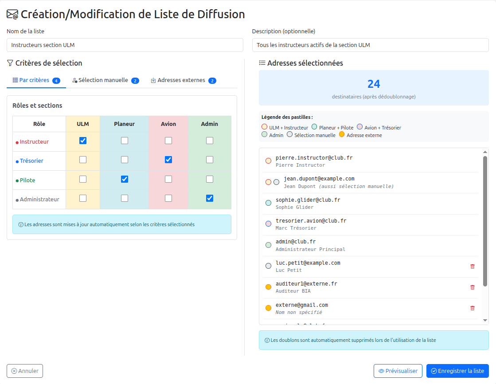
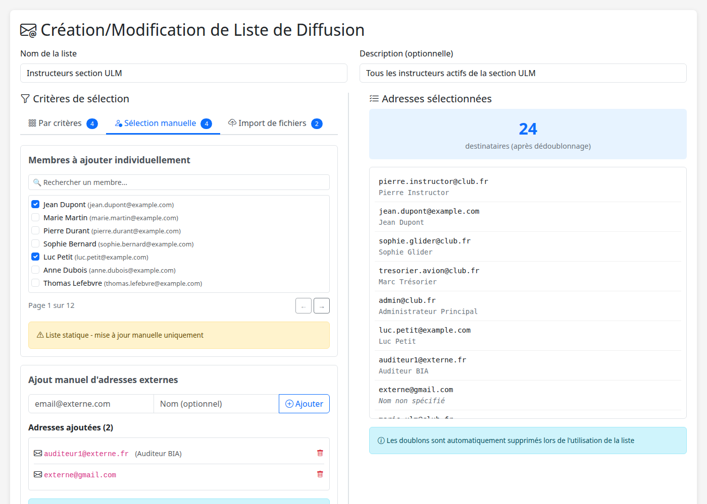
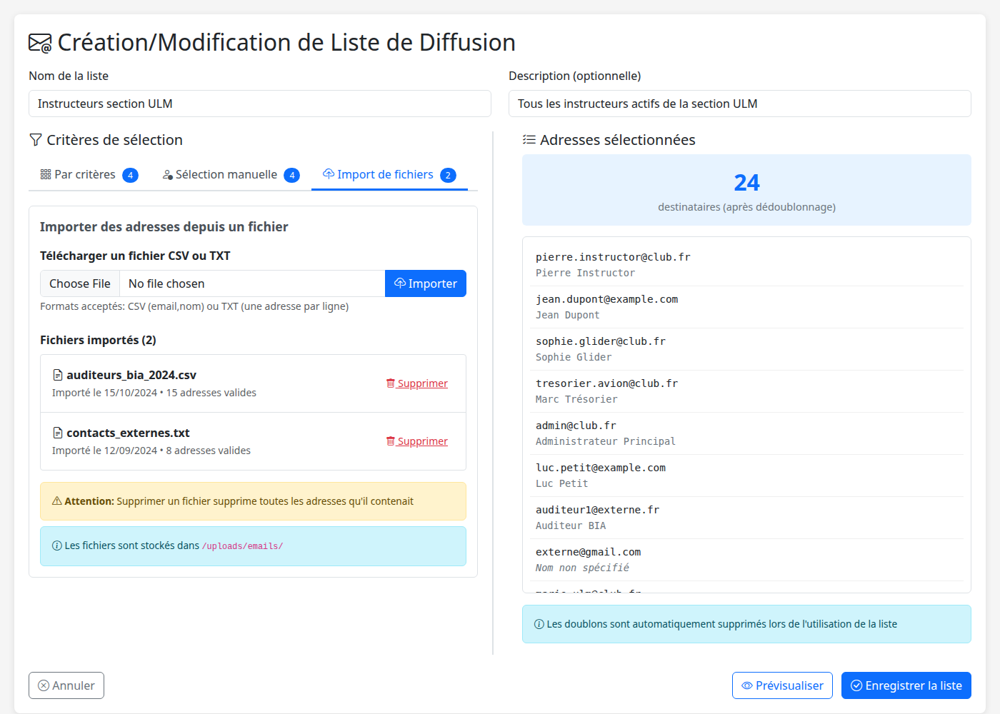
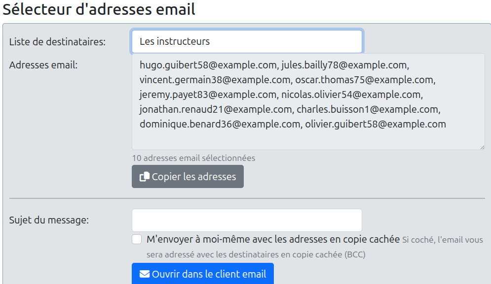

# Product Requirements Document (PRD) - Gestion des Adresses Email dans GVV

## Table des matières

- [Product Requirements Document (PRD) - Gestion des Adresses Email dans GVV](#product-requirements-document-prd---gestion-des-adresses-email-dans-gvv)
  - [Table des matières](#table-des-matières)
  - [1. Vue d'ensemble](#1-vue-densemble)
    - [1.1 Objectif](#11-objectif)
    - [1.2 Problème à résoudre](#12-problème-à-résoudre)
    - [1.3 Valeur ajoutée](#13-valeur-ajoutée)
  - [2. Périmètre fonctionnel](#2-périmètre-fonctionnel)
    - [2.1 Dans le périmètre](#21-dans-le-périmètre)
    - [2.2 Hors périmètre](#22-hors-périmètre)
  - [3. Utilisateurs et rôles](#3-utilisateurs-et-rôles)
    - [3.1 Rôle : Secrétaire](#31-rôle--secrétaire)
  - [4. Exigences fonctionnelles](#4-exigences-fonctionnelles)
    - [4.1 Sélection d'adresses](#41-sélection-dadresses)
      - [4.1.1 Critères de sélection GVV](#411-critères-de-sélection-gvv)
      - [4.1.2 Interface de sélection](#412-interface-de-sélection)
    - [4.2 Gestion des listes de diffusion](#42-gestion-des-listes-de-diffusion)
      - [4.2.1 Création de liste](#421-création-de-liste)
      - [4.2.2 Modification de liste](#422-modification-de-liste)
      - [4.2.3 Suppression de liste](#423-suppression-de-liste)
      - [4.2.4 Fenêtre de création/modification des listes](#424-fenêtre-de-créationmodification-des-listes)
        - [Maquette avec onglets (onglet Par critères GVV)](#maquette-avec-onglets-onglet-par-critères-gvv)
        - [Maquette avec onglets (onglet Sélection manuelle)](#maquette-avec-onglets-onglet-sélection-manuelle)
        - [Maquette avec onglets (onglet Adresses externes)](#maquette-avec-onglets-onglet-adresses-externes)
      - [4.3 Détection des doublons](#43-détection-des-doublons)
    - [4.4 Import d'adresses externes](#44-import-dadresses-externes)
      - [4.4.1 Formats supportés](#441-formats-supportés)
    - [4.5 Export et envoi](#45-export-et-envoi)
      - [4.5.1 Export vers presse-papier](#451-export-vers-presse-papier)
      - [4.5.2 Export vers fichier texte](#452-export-vers-fichier-texte)
      - [4.5.3 Découpage en sous-listes](#453-découpage-en-sous-listes)
      - [4.5.4 Paramètres d'ouverture du client de messagerie](#454-paramètres-douverture-du-client-de-messagerie)
  - [5. Exigences non-fonctionnelles](#5-exigences-non-fonctionnelles)
    - [5.1 Performance](#51-performance)
    - [5.2 Sécurité](#52-sécurité)
    - [5.3 Compatibilité](#53-compatibilité)
    - [5.4 Maintenance](#54-maintenance)
  - [6. Critères de succès](#6-critères-de-succès)
  - [7. Risques et mitigation](#7-risques-et-mitigation)
  - [8. Documentation requise](#8-documentation-requise)

---

## 1. Vue d'ensemble

### 1.1 Objectif

Permettre aux responsables du club d'envoyer un mail aux membres ou à une selection de membres en quelques clics que ce soit à partir d'une ordinateur ou de leur smartphone. Il faut que le système soit simple et que tout le monde puisse envoyer un email sans se poser de questions.

Moderniser le système de gestion des adresses email dans GVV en abandonnant l'envoi direct d'emails au profit d'un système de sélection et d'export d'adresses vers le client de messagerie préféré de l'utilisateur.

### 1.2 Problème à résoudre
- L'ancien système d'envoi direct d'emails est obsolète et n'apporte pas de valeur ajoutée
- Le mécanisme actuel de sélection d'adresses ne permet pas de sélectionner les utilisateurs d'une section
- Impossibilité de gérer des adresses email externes
- Difficulté à maintenir des listes de diffusion à jour manuellement

### 1.3 Valeur ajoutée
- Mise à jour automatique des listes quand un membre change de fonction ou de statut
- Partage des listes entre tous les membres autorisés (secrétaires)
- Facilité d'utilisation : envoi en quelques clics via le client de messagerie habituel
- Gestion unifiée des adresses internes (issues de GVV) et externes

## 2. Périmètre fonctionnel

### 2.1 Dans le périmètre
- Extension du mécanisme de sélection pour inclure les sections et les autorisations
- Import d'adresses email externes (format texte et CSV)
- Création, modification, suppression de listes de diffusion
- Export vers le presse-papier
- Export vers fichier texte pour partage
- Ouverture du client de messagerie avec les adresses sélectionnées

### 2.2 Hors périmètre
- Envoi direct d'emails depuis GVV (fonctionnalité obsolète à supprimer)
- Gestion complète d'un client de messagerie
- Historique des envois
- Rédaction assistée par IA, mais j'y pense et je risque de l'ajouter ultérieurement. En plus pour les gens comme moi, cela permettra des envoies sans fautes d'orthographe.

## 3. Utilisateurs et rôles

### 3.1 Rôle : Secrétaire
**Permissions:**
- Sélectionner des adresses selon divers critères
- Créer/modifier/supprimer des listes de diffusion
- Exporter les adresses vers le client de messagerie
- Importer des adresses externes

**Cas d'usage principaux:**
1. Envoyer un courriel à une liste prédéfinie
2. Créer une nouvelle liste par sélection de critères (ex: tous les instructeurs)
3. Créer une nouvelle liste par sélection manuelle de membres (ex: animateurs simulateur - volontaires)
4. Enrichir une liste avec des adresses externes (une liste peut être uniquement externe)
5. Exporter une liste vers fichier pour partage avec des personnes n'ayant pas accès à GVV
6. Modifier/supprimer des listes existantes

## 4. Exigences fonctionnelles

### 4.1 Sélection d'adresses

#### 4.1.1 Critères de sélection GVV
Le système doit permettre la sélection selon:
- **Rôles/Droits:** trésoriers, instructeurs, pilotes, administrateurs, etc. (basé sur le système d'autorisations existant de GVV)
- **Sections:** ULM, planeur, avion, etc.
- **Statut:** membre actif, inactif
- **Combinaisons** On doit pouvoir sélectionner plusieurs groupes (les trésorier ULM et avion, mais pas planeur)
- **Extensibilité:** Le système doit supporter automatiquement les nouveaux rôles ajoutés au système d'autorisations

#### 4.1.2 Interface de sélection
- Interface visuelle similaire au mécanisme d'attribution des droits utilisateur
- Prévisualisation en temps réel du nombre d'adresses sélectionnées
- Affichage de la liste des destinataires avant export
- Validation des adresses email (format valide)
- **Dédoublonnage automatique:** si un utilisateur est sélectionné par plusieurs critères (ex: instructeur ET membre de la section ULM), son adresse n'apparaît qu'une seule fois dans la liste finale


### 4.2 Gestion des listes de diffusion

#### 4.2.1 Création de liste
- Nommage de la liste (obligatoire, unique)
- Description optionnelle
- **Trois modes d'ajout d'adresse:**
  1. **Par critères GVV:** sélection automatique selon rôles, sections, statuts (mise à jour automatique)
  2. **Par sélection manuelle de membres:** choix individuel de membres dans une liste (liste statique)
  3. **Par import externe:** ajout d'adresses externes via fichier ou saisie manuelle
- Les trois modes peuvent être combinés dans une même liste
- Sauvegarde de la liste

**Exemples d'utilisation:**
- Liste "Instructeurs actifs": création par critères (rôle=instructeur, statut=actif) → mise à jour automatique
- Liste "Animateurs simulateur": création par sélection manuelle de volontaires → liste statique qui ne change que si modifiée manuellement
- Liste "Auditeurs BIA 2024": création par import externe + ajout manuel éventuel → liste statique

#### 4.2.2 Modification de liste
- Modification du nom/description
- Ajout/suppression d'adresses sélectionnées manuellement ou importées 
- Re-sélection par critères
- Les listes basées sur des critères se mettent à jour automatiquement

#### 4.2.3 Suppression de liste
- Confirmation obligatoire avant suppression

#### 4.2.4 Fenêtre de création/modification des listes

La fenêtre de création/modification est séparée en deux parties:

**Partie supérieure - Création/identification de la liste:**
- Nom de la liste (obligatoire, unique)
- Description (optionnelle)
- Type de membre (actifs/inactifs/tous)
- Visibilité (visible par défaut)
- Boutons "Enregistrer" et "Annuler" immédiatement sous cette partie

**Partie inférieure - Ajout et suppression d'adresses email:**
- Titre: "Ajout et suppression d'adresses email"
- Trois onglets de sélection (gauche) + prévisualisation (droite)
- **État désactivé** tant que la liste n'est pas enregistrée (mode création)
- **État activé** une fois la liste enregistrée (mode modification avec email_list_id connu)

**Workflow:**
1. **Mode création (nouvelle liste):**
   - Titre: "Nouvelle liste d'email"
   - Partie supérieure active, partie inférieure désactivée
   - Utilisateur saisit nom, description, type de membre
   - Clic "Enregistrer" → création liste en base
   - Rechargement page avec email_list_id en paramètre URL
   - Bascule automatique en mode modification

2. **Mode modification (liste existante):**
   - Titre: "Modification d'une liste d'email"
   - Partie supérieure modifiable
   - Partie inférieure activée avec trois onglets fonctionnels
   - email_list_id connu permet gestion des adresses

**Trois onglets de sélection (partie inférieure):**
   - **"Par critères"** - Sélection par rôles GVV et sections
   - **"Sélection manuelle"** - Sélection individuelle de membres
   - **"Import de fichiers"** - Upload et gestion de fichiers CSV/TXT

3. **Onglet "Par critères":**
   - Permet de cocher les rôles dans les sections
   - Interface similaire à la fenêtre d'attribution des rôles
   - Checkboxes simples sans système de couleur

4. **Onglet "Sélection manuelle":**
   - Liste paginée avec barre de recherche
   - Sélection de membres un par un via checkboxes
   - Ajout individuel d'adresses externes (email + nom optionnel)
   - Chaque adresse externe ajoutée manuellement a une icône poubelle pour suppression

5. **Onglet "Import de fichiers":**
   - Bouton "Télécharger un fichier" (formats: CSV, TXT)
   - Fichiers stockés dans `/uploads/emails_lists/` avec nommage unique
   - Liste des fichiers importés sous le bouton, avec:
     - Nom du fichier
     - Date d'import
     - Nombre d'adresses valides
     - Icône poubelle pour supprimer le fichier
   - **Important:** Suppression d'un fichier supprime toutes les adresses qu'il contenait
   - Pas de zone de copier/coller (upload uniquement)

6. **Panneau de prévisualisation (à droite):**
   - Affiche les totaux (total destinataires, par critères, manuels, externes)
   - Tableau avec colonnes: Email | Nom
   - **Pas d'icône de suppression dans la preview** (suppression via onglets sources)
   - Mise à jour en temps réel lors des modifications

##### Maquette avec onglets (onglet Par critères GVV)
 

##### Maquette avec onglets (onglet Sélection manuelle)
 

##### Maquette avec onglets (onglet Adresses externes)
  


#### 4.3 Détection des doublons
  - Les doublons sont supprimés des listes lors de leur utilisation
  - Quelque soit la source des adresses, selection, création manuelle ou import
  - Comparaison insensible à la casse (user@example.com = USER@EXAMPLE.COM)
  - Pas de détection à l'import

### 4.4 Import d'adresses externes

#### 4.4.1 Formats supportés
- **Texte brut (.txt):** une adresse par ligne, optionnellement suivie d'un nom
- **CSV (.csv):** colonnes configurables (nom, prénom, email, etc.)
- **Stockage permanent:** Fichiers uploadés conservés dans `/uploads/email_lists/[list_id]/[fichier].csv`
- **Stockage temporaire:** En mode création, fichiers stockés dans `/uploads/email_lists/tmp/[session_id]/` puis déplacés lors de la sauvegarde
- **Nettoyage automatique:** Fichiers temporaires de plus de 2 jours supprimés automatiquement
- **Traçabilité:** Chaque adresse importée est liée au fichier source
- **Validation:** Format validé lors de l'upload avec rapport d'erreurs détaillé
- **Suppression en cascade:** Suppression d'un fichier supprime toutes ses adresses
- **Pas de saisie manuelle dans l'onglet import** - Ajout manuel via onglet "Sélection manuelle"


### 4.5 Export et envoi

#### 4.5.1 Export vers presse-papier
- Copie des adresses au format standard (séparées par virgules)
- Notification visuelle de succès
- Si on ne sélectionne rien la liste sera vide
- Voir s'il faut différencier les droits de gestion et d'utilisation des listes existantes

#### 4.5.2 Export vers fichier texte
Pour permettre le partage avec des personnes n'ayant pas accès à GVV:

**Formats d'export:**
1. **Format Texte (TXT):** liste d'adresses séparées par virgules, prête pour copier/coller dans un client email. Le fichier pourra comporter le nom de la liste, sa date de création, les critères.

**Exemple:**
```
# Liste: Animateurs simulateur
**Description:** Volontaires pour animer les sessions simulateur
**Date:** 2025-01-15
**Nombre de destinataires:** 12

## Adresses (copier/coller)
jean.dupont@example.com, marie.martin@example.com, pierre.durant@example.com, ...
```

**Fonctionnalités:**
- Bouton de téléchargement du fichier 
- Nom de fichier automatique basé sur le nom de la liste (ex: `animateurs_simulateur.txt`)
- Encodage UTF-8 pour compatibilité universelle

**Cas d'usage:**
- Secrétaire exporte "Auditeurs BIA 2024" en .txt et envoie le fichier à l'instructeur BIA externe
- L'instructeur ouvre le fichier, copie les adresses et les colle dans Thunderbird
- Président exporte "Animateurs simulateur" en .md pour garder une trace avec les noms complets

#### 4.5.3 Découpage en sous-listes
Pour s'adapter aux limitations des clients de messagerie:
- **Taille de découpage configurable:** par défaut 20 destinataires maximum par sous-liste
- **Sélection de la partie à exporter:** interface permettant de choisir "Partie 1/5", "Partie 2/5", etc.
- **Indication visuelle:** affichage clair du nombre total de destinataires et du nombre de parties nécessaires
- **Export séquentiel:** possibilité d'exporter toutes les parties successivement
- **Exemples de limitations clients:**
  - Gmail: limite à 500 destinataires par email
  - Outlook: limite d'URL mailto à ~2000 caractères
  - Certains clients: limites de 20-50 destinataires recommandées

**Interface de découpage:**
```
┌─────────────────────────────────────────────────────────┐
│ Liste: Membres actifs (87 destinataires)                │
├─────────────────────────────────────────────────────────┤
│ Taille des sous-listes: [20 ▼] destinataires            │
│                                                         │
│ → Nombre de parties nécessaires: 5                      │
│                                                         │
│ Sélectionner la partie à exporter:                      │
│ ● Partie: [1 ▼] sur 5                        │
│                                                         │
│ Partie 1: destinataires 1-20                            │
│ Partie 2: destinataires 21-40                           │
│ Partie 3: destinataires 41-60                           │
│ Partie 4: destinataires 61-80                           │
│ Partie 5: destinataires 81-87                           │
│                                                         │
│ [Prévisualiser partie] [Copier] [Ouvrir client mail]    │
└─────────────────────────────────────────────────────────┘
```

#### 4.5.4 Paramètres d'ouverture du client de messagerie
- Génération d'un lien `mailto:` avec les adresses de la partie sélectionnée
- **Placement des adresses:** option de choix entre TO, CC, BCC pour les destinataires sélectionnés
- **Titre du message (Subject):** champ de saisie pour définir l'objet du courriel
- **Adresse du destinataire:** si la liste est en BCC
- **Mémorisation des préférences:** le navigateur se souvient des choix précédents (TO/CC/BCC, titre, adresse de retour) via localStorage

**Interface d'export vers client mail:**
```
┌─────────────────────────────────────────────────────────┐
│ Paramètres d'envoi                                      │
├─────────────────────────────────────────────────────────┤
│ Placer les destinataires en:                            │
│ ● TO (À)    ○ CC (Copie)    ○ BCC (Copie cachée)        │
│                                                         │
│ Titre du message:                                       │
│ [Information importante - Assemblée générale       ]    │
│                                                         │
│ Adresse de destinataire si liste en BCC:                │
│ [secretaire@club-aviation.fr                       ]    │
│                                                         │
│ [Ouvrir le client de messagerie]                        │
└─────────────────────────────────────────────────────────┘
```


## 5. Exigences non-fonctionnelles

### 5.1 Performance
- Sélection d'adresses: < 2 secondes pour 500 membres
- Import CSV: < 5 secondes pour 1000 lignes
- Affichage liste: < 1 seconde

### 5.2 Sécurité
- Contrôle d'accès basé sur les rôles (seuls les membres du CA accèdent à la fonctionnalité)
- Validation des entrées (injection SQL, XSS)
- Journalisation des actions (création/modification/suppression de listes)

### 5.3 Compatibilité
- Navigateurs: Chrome, Firefox, Edge (versions récentes)
- Clients de messagerie: Outlook, Thunderbird, Gmail, clients web standard

### 5.4 Maintenance
- Tests avec couverture > 70%
- Documentation utilisateur en français, anglais, néerlandais

## 6. Critères de succès

- [ ] Les utilisateurs peuvent créer une liste en < 2 minutes
- [ ] Import CSV fonctionne sans erreur pour 99% des fichiers bien formés
- [ ] Export vers client de messagerie fonctionne sur 3 clients différents
- [ ] Export fichier TXT permet copier/coller direct dans client email
- [ ] Export fichier TXT contient toutes les métadonnées utiles
- [ ] Couverture de tests > 70%
- [ ] Aucune régression sur les fonctionnalités existantes

## 7. Risques et mitigation

| Risque | Impact | Probabilité | Mitigation |
|--------|--------|-------------|------------|
| Limite de taille URL mailto | Moyen | Élevée | Fallback vers presse-papier + découpage en sous-listes |
| Formats CSV variés | Faible | Moyenne | Configuration flexible, validation claire |
| Résistance utilisateurs | Moyen | Faible | Documentation, formation |
| Performance avec grandes listes (>500 membres) | Moyen | Faible | Optimisation requêtes, tests de charge |
| Compatibilité clients email mobiles | Moyen | Moyenne | Tests sur iOS/Android, fallbacks |

## 8. Documentation requise

- Sections dans les guides utilisateur existants (FR/EN/NL)
- Mise à jour du README

---

**Version:** 1.4
**Date:** 2025-11-05
**Auteur:** Claude Code sous supervision de Fred
**Statut:** En cours d'implémentation
**Changements v1.4:**
- **Séparation workflow création/modification:**
  - Partie supérieure: Nom, description, type membre, visibilité
  - Boutons Enregistrer/Annuler juste sous la partie supérieure
  - Partie inférieure désactivée en création, activée en modification
  - Rechargement page avec email_list_id après création
  - Titre change: "Nouvelle liste" → "Modification d'une liste"
**Changements v1.3:**
- Preview sans icônes delete (suppression via onglets sources)
- Onglets renommés: "Par critères", "Sélection manuelle", "Import de fichiers"
- Import par upload uniquement (pas de copier/coller)
- Stockage fichiers dans `/uploads/emails_lists/` avec traçabilité
- Suppression fichier supprime ses adresses en cascade
- **Suppression du système de codage couleur** (plus nécessaire avec nouvelle UX)
