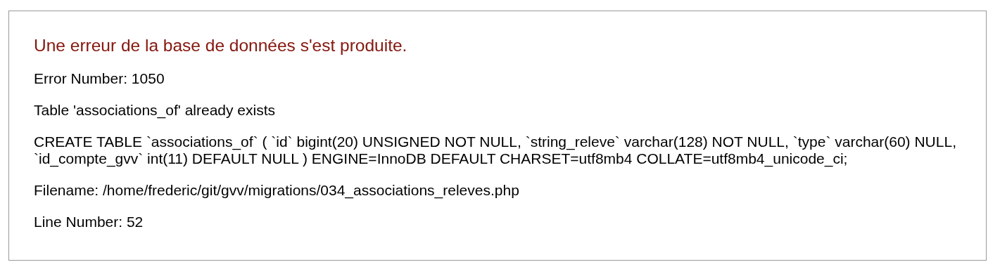

## En cas de problèmes

## Fichiers de log

Regardez les fichiers journaux. Ils contiennent des informations sur les erreurs.

### Logs GVV

* `gvv/application/logs/log-2025-03-05.php` 

### Logs Apache et PHP
* `/var/log/apache2/error.log`
* `/var/log/apache2/access.log`
* `/var/log/apache2/other_vhosts_access.log`
 
### Logs des tests Dusk
* `dusk_gvv/storage/logs/laravel.log`

## Investigation sur une machine locale

## Le mode debug dans index.php

Le mode development vous donne beaucoup plus de messages d'erreur, particulièrement pour les erreurs MySql.

dans le fichier `index.php`
```
// define('ENVIRONMENT', 'development');
define('ENVIRONMENT', 'production');
```

### Les tests Dusk

* messages d'erreur
* les logs d'execution du test
* Les copies d'écran en cours de test et en cas de détection d'erreur

### Xdebug
* Vous pouvez executer GVV pas à pas, mettre des breakpoints et visualiser les variables

### Si vous n'avez pas trouvé

* En cas de bug avéré, vous pouvez me contacter, mais je ne garantie plus les corrections sur cette version. 

Certains marabous résolvent les problèmes informatiques, on peut trouver leur adresse sur les flyers qu'ils distribuent dans les boites aux lettres...

## Error 500

* Souvent lié à des erreurs de syntaxe dans les fichiers php, mais pas uniquement.

### dé-référencements de requêtes active record sur la base de données.

```
$select = $this->db->select($columns)->from("machinesp")
        	->where($selection)
            ->get()->result_array();
```

est une très mauvaise idée si la fonction get() retourne null cela génère une erreur 500. (47 occurrences à nettoyer ...)

Privilégier:

```
    public function get_to_array($res) {
        gvv_debug("sql: " . $this->db->last_query());

        if ($res) {
            return $res->result_array();
        } else {
            if ($this->db->_error_number()) {
                gvv_debug("sql: error: " .  $this->db->_error_number() . " - " . $this->db->_error_message());
            }
            return array();
        }
    }

    $db_res = $this->db
            ->select($select)
            ->from("achats, tarifs, membres")
            ->where("achats.produit = tarifs.reference")
            ->where("achats.pilote = membres.mlogin")
            ->where(array("facture" => 0))
            ->group_by('pilote')
            ->order_by("mnom, mprenom")
            ->get();
        $res = $this->get_to_array($db_res);
```

### Migrations

en cas d'erreur 500 sur les migrations, on peut trouver le dernière requête SQL dans les logs:

```
INFO  - 2025-08-07 15:05:52 --> GVV: Migration sql: CREATE TABLE `associations_of` (
  				`id` bigint(20) UNSIGNED NOT NULL,
                `string_releve` varchar(128) NOT NULL,
  				`type` varchar(60) NULL,
                `id_compte_gvv` int(11) DEFAULT NULL

			) ENGINE=InnoDB DEFAULT CHARSET=utf8mb4 COLLATE=utf8mb4_unicode_ci;
```

Pour avoir le détail passer à true le paramètre db_debug dans config/database.php

```
$db['default']['db_debug'] = TRUE;
```

Ca donne une erreur détaillée:

