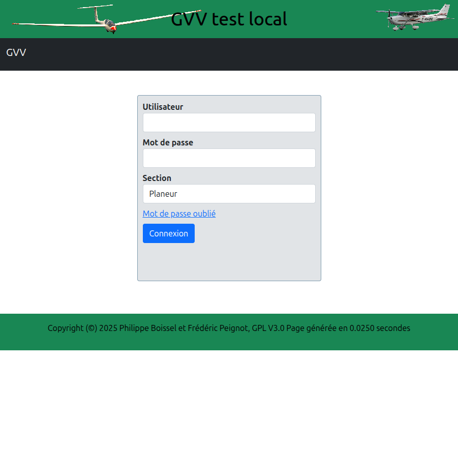
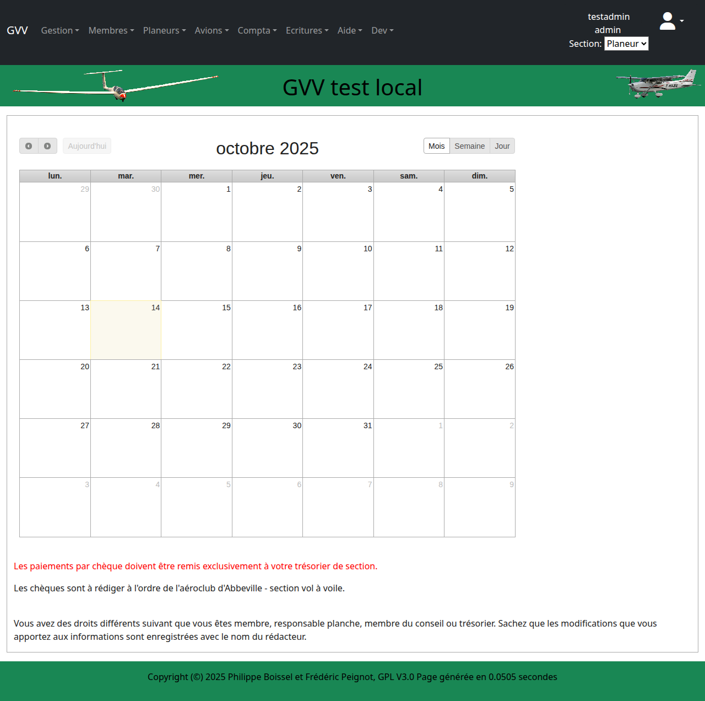
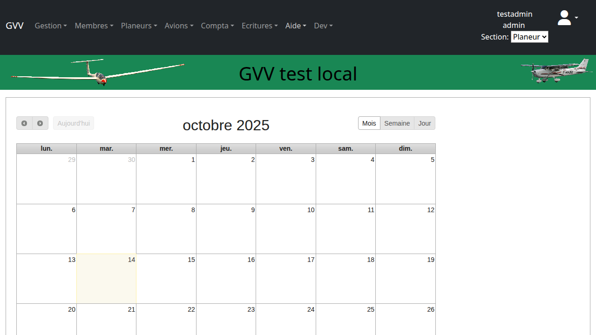
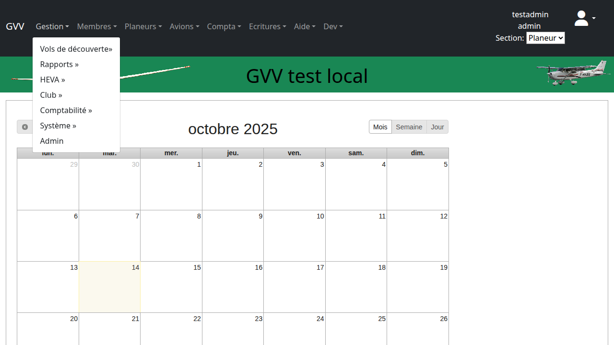
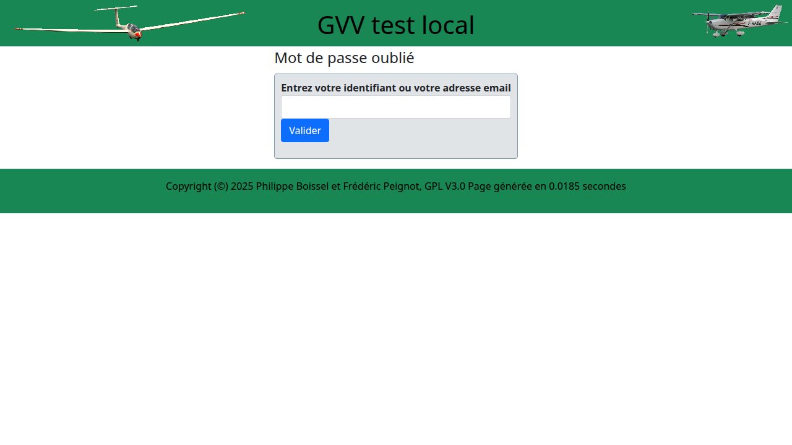

# Démarrage avec GVV

Ce guide vous accompagne dans vos premiers pas avec l'application GVV (Gestion Vol à Voile). Vous apprendrez à vous connecter, naviguer dans l'interface et comprendre les concepts de base.

## Table des matières

1. [Connexion à l'application](#connexion)
2. [Interface principale](#interface)
3. [Navigation dans les menus](#navigation)
4. [Gestion de votre profil](#profil)
5. [Concept de sections](#sections)
6. [Récupération de mot de passe](#mot-de-passe)

## Connexion à l'application {#connexion}

### Accès à GVV

Pour accéder à votre application GVV, rendez-vous à l'adresse fournie par votre club (généralement `http://[votreclub].gvv.net`).

### Se connecter

1. **Nom d'utilisateur** : Saisissez votre identifiant fourni par l'administration
2. **Mot de passe** : Entrez votre mot de passe
3. **Section** : Choisissez la section appropriée (ULM, Planeur, Avion, Général, ou Toutes)
4. Cliquez sur **"Se connecter"**

> **💡 Conseil** : Votre identifiant est généralement votre nom d'utilisateur ou votre adresse email selon la configuration de votre club.

## Interface principale {#interface}

Une fois connecté, vous arrivez sur le tableau de bord principal de GVV.

### Éléments principaux

L'interface se compose de plusieurs zones :

1. **Barre de navigation principale** (en haut)
2. **Menu utilisateur** (coin supérieur droit)
3. **Zone de contenu centrale** (calendrier, listes, formulaires)
4. **Sélecteur de section** (si votre club gère plusieurs sections)

## Navigation dans les menus {#navigation}

### Menu principal

La barre de navigation vous donne accès aux principales fonctionnalités de GVV.

Les sections typiques incluent :
- **Calendrier** : Planning des vols et événements
- **Gestion** : Vols de découverte, rapports, administration
- **Membres** : Gestion des pilotes et membres
- **Planeurs** : Gestion de la flotte de planeurs
- **Avions** : Gestion des avions remorqueurs
- **Compta** : Comptabilité et facturation
- **Écritures** : Saisie des écritures comptables

### Menu utilisateur

Le menu utilisateur (votre nom en haut à droite) vous permet de gérer votre profil.

Options disponibles :
- **Ma facture** : Consulter votre compte et vos factures
- **Mot de passe** : Changer votre mot de passe
- **Consommation tickets** : Voir votre consommation de tickets
- **Validité licence** : Vérifier la validité de vos licences
- **Quitter** : Se déconnecter de l'application

## Gestion de votre profil {#profil}

### Accès au profil

Cliquez sur votre nom dans le coin supérieur droit, puis sélectionnez **"Mon profil"** pour modifier vos informations.

### Informations modifiables

Selon vos droits, vous pouvez généralement modifier :
- Vos coordonnées (adresse, téléphone, email)
- Votre mot de passe
- Vos préférences d'affichage

> **⚠️ Important** : Certaines informations (nom, qualifications, rôles) ne peuvent être modifiées que par un administrateur.

## Concept de sections {#sections}

Si votre club gère plusieurs activités (planeur, avion, ULM), GVV utilise le concept de **sections**.

### Types de sections

- **ULM** : Ultra-Légers Motorisés
- **Planeur** : Vol à voile
- **Avion** : Aviation légère
- **Général** : Données communes à toutes les sections
- **Toutes** : Vue globale de toutes les sections (pour les administrateurs)

### Fonctionnement

- Chaque section a ses propres membres, aéronefs et tarifs
- Vous pouvez avoir des rôles différents selon les sections
- Le sélecteur de section vous permet de basculer entre vos activités

### Utilisation

1. Cliquez sur le sélecteur de section (généralement près de votre nom)
2. Choisissez la section souhaitée
3. L'interface se met à jour avec les données de cette section

## Récupération de mot de passe {#mot-de-passe}

Si vous avez oublié votre mot de passe, GVV propose un système de récupération.

### Procédure

1. Sur la page de connexion, cliquez sur **"Mot de passe oublié ?"**
2. Saisissez votre adresse email ou nom d'utilisateur
3. Cliquez sur **"Envoyer"**
4. Consultez votre boîte email pour le lien de réinitialisation

> **📧 Note** : Si vous ne recevez pas l'email dans les 10 minutes, vérifiez votre dossier spam ou contactez votre administrateur.

## Interface responsive

GVV s'adapte automatiquement à votre écran :

- **Ordinateur** : Interface complète avec tous les menus visibles
- **Tablette** : Menus adaptés pour l'utilisation tactile
- **Mobile** : Interface simplifiée avec menu hamburger

## Prochaines étapes

Maintenant que vous maîtrisez les bases de GVV, vous pouvez explorer :

- **[Gestion des membres](02_gestion_membres.md)** : Comprendre la gestion des utilisateurs
- **[Gestion des aéronefs](03_gestion_aeronefs.md)** : Gérer la flotte
- **[Saisie des vols](04_saisie_vols.md)** : Enregistrer l'activité de vol

## Aide et support

En cas de difficulté :
1. Consultez ce guide utilisateur
2. Contactez votre responsable informatique du club
3. Vérifiez les paramètres de votre navigateur (JavaScript activé)

---

**Guide GVV** - Gestion Vol à Voile  
*Version française - Mis à jour en décembre 2024*

[◀ Retour à l'index](README.md) | [Gestion des membres ▶](02_gestion_membres.md)