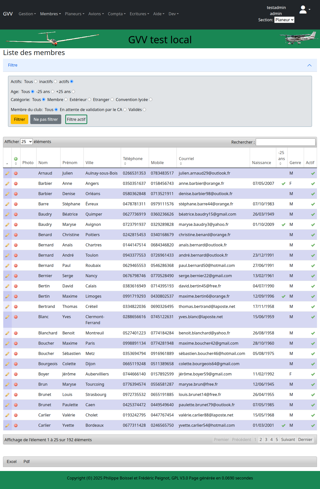
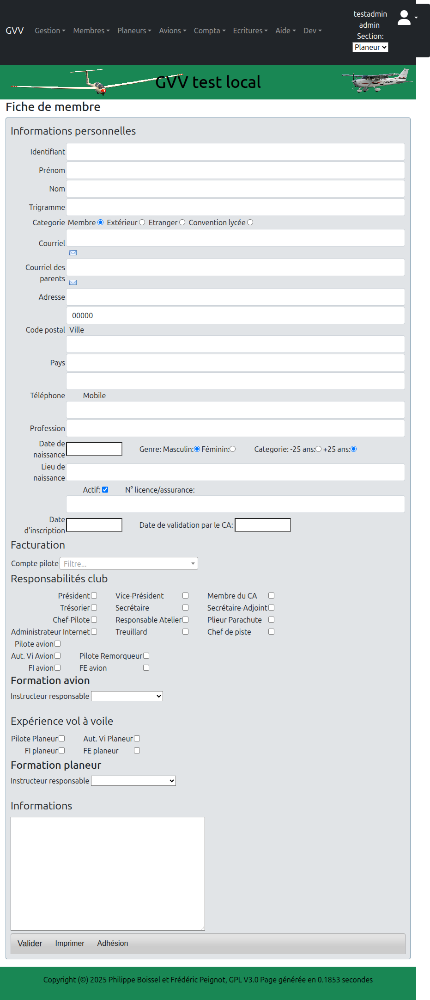

# Gestion des Membres

Ce guide détaille la gestion complète des membres dans GVV, avec des exemples de toutes les opérations CRUD (Créer, Lire, Mettre à jour, Supprimer).

## Vue d'ensemble

La gestion des membres vous permet de :
- Consulter la liste de tous les membres
- Ajouter de nouveaux membres
- Modifier les informations des membres existants
- Gérer les licences et certificats
- Attribuer des rôles et responsabilités
- Activer ou désactiver des membres

## Accès à la gestion des membres

Pour accéder à la gestion des membres :
1. Cliquez sur le menu **Membres** dans la barre de navigation
2. Sélectionnez **Membres** dans le sous-menu

## Consulter la liste des membres (READ)

La liste des membres affiche tous les membres de la section active avec leurs informations principales.

### Fonctionnalités de la liste

#### Filtres

Les filtres vous permettent de limiter l'affichage selon plusieurs critères :

- **Actifs** : Tous / Inactifs / Actifs seulement
- **Age** : Tous / -25 ans / +25 ans
- **Catégorie** : Tous / Membre / Extérieur / Etranger / Convention lycée
- **Membre du club** : Tous / En attente de validation / Validés

Utilisez les boutons **Filtrer** ou **Ne pas filtrer** pour appliquer ou réinitialiser les filtres.

#### Recherche

La zone de recherche en haut à droite permet de rechercher rapidement un membre par nom, prénom, email, etc.

#### Pagination

- Choisissez le nombre d'éléments à afficher par page (10, 25, 50, 100)
- Naviguez entre les pages avec les boutons de pagination

#### Colonnes affichées

- **Photo** : Photo du membre (si disponible)
- **Nom** et **Prénom**
- **Ville** : Ville de résidence
- **Téléphone** et **Mobile**
- **Courriel** : Adresse email
- **Naissance** : Date de naissance
- **-25 ans** : Indicateur si le membre a moins de 25 ans
- **Genre** : M (Masculin) ou F (Féminin)
- **Actif** : Indicateur si le membre est actif

#### Actions sur chaque membre

Pour chaque membre, deux actions sont disponibles :
- **Changer** (icône crayon) : Modifier les informations du membre
- **Supprimer** (icône poubelle) : Supprimer le membre

#### Export

Au bas de la liste, vous pouvez exporter la liste des membres :
- **Excel** : Export au format CSV
- **Pdf** : Export au format PDF

## Créer un nouveau membre (CREATE)

Pour ajouter un nouveau membre, cliquez sur l'icône **Ajouter** (➕) en haut à gauche de la liste.

### Informations personnelles

#### Champs obligatoires

- **Identifiant** : Identifiant de connexion (généralement initiales + nom en minuscules)
- **Prénom** : Prénom du membre
- **Nom** : Nom de famille du membre

#### Catégorie du membre

- **Membre** : Membre régulier du club
- **Extérieur** : Pilote extérieur au club
- **Etranger** : Membre étranger
- **Convention lycée** : Membre dans le cadre d'une convention avec un lycée

#### Coordonnées

- **Courriel** : Adresse email principale (un lien mailto permet de vérifier)
- **Courriel des parents** : Pour les membres mineurs
- **Adresse** : Adresse postale
- **Code postal** et **Ville**
- **Pays** : Pays de résidence
- **Téléphone** : Téléphone fixe
- **Mobile** : Téléphone portable

#### Informations personnelles

- **Profession** : Profession du membre
- **Date de naissance** : Format JJ/MM/AAAA
- **Genre** : Masculin ou Féminin
- **Catégorie d'âge** : -25 ans ou +25 ans (calculé automatiquement selon la date de naissance)
- **Lieu de naissance** : Lieu de naissance

#### Statut

- **Actif** : Cochez cette case pour que le membre apparaisse dans les menus de sélection
- **N° licence/assurance** : Numéro de licence ou d'assurance
- **Date d'inscription** : Date d'inscription au club
- **Date de validation par le CA** : Date de validation par le Conseil d'Administration

### Facturation

- **Compte pilote** : Si différent, indiquer le compte sur lequel seront débités les vols

### Responsabilités club

Cochez les responsabilités du membre dans le club :

**Direction**
- Président
- Vice-Président
- Membre du CA
- Trésorier
- Secrétaire
- Secrétaire-Adjoint

**Technique**
- Chef-Pilote
- Responsable Atelier
- Plieur Parachute
- Administrateur Internet
- Treuillard
- Chef de piste

### Expérience aviation

#### Avion
- **Pilote avion** : Pilote avion titulaire
- **Aut. Vi Avion** : Autorisation de vol à vue avion
- **Pilote Remorqueur** : Pilote remorqueur qualifié
- **FI avion** : Instructeur avion
- **FE avion** : Examinateur avion

**Formation avion** : Sélectionnez l'instructeur responsable de la formation

#### Planeur
- **Pilote Planeur** : Pilote planeur titulaire
- **Aut. Vi Planeur** : Autorisation de vol à vue planeur
- **FI planeur** : Instructeur planeur
- **FE planeur** : Examinateur planeur

**Formation planeur** : Sélectionnez l'instructeur responsable de la formation

### Informations complémentaires

Zone de texte libre pour toute information supplémentaire concernant le membre.

### Valider la création

Cliquez sur le bouton **Valider** pour enregistrer le nouveau membre.

## Modifier un membre (UPDATE)

Pour modifier un membre existant, cliquez sur l'icône **Changer** (crayon) dans la liste des membres.

### Différences avec la création

Le formulaire de modification est identique au formulaire de création, avec quelques ajouts :

#### En haut de la fiche

Des liens rapides vers :
- **Facture** : Consulter le compte du membre
- **Certificats** : Gérer les certificats et événements
- **Vols avion** : Consulter les vols avion du pilote
- **Vols planeur** : Consulter les vols planeur du pilote
- **Tickets** : Consulter la consommation de tickets

#### Photo du membre

Un bouton **Choisir un fichier** permet d'uploader une photo du membre.

#### Identifiant

Possibilité de rechercher et sélectionner un identifiant existant (pour fusionner des comptes par exemple).

#### Dates visite médicale et autres

Une table permet de gérer les visites médicales et autres événements :
- Cliquez sur **Ajouter** pour ajouter un nouvel événement
- Utilisez **Changer** ou **Supprimer** pour gérer les événements existants

Colonnes affichées :
- **Type** : Type d'événement (Visite médicale, etc.)
- **Date** : Date de l'événement
- **N°/Commentaire** : Numéro ou commentaire

#### Formation avion/planeur

Des tables permettent de gérer les événements de formation (contrôles de compétence, examens, etc.).

#### Certificats FAI

Une table permet de gérer les certificats FAI (Fédération Aéronautique Internationale).

### Enregistrer les modifications

Cliquez sur le bouton **Valider** pour enregistrer les modifications.

### Actions additionnelles

- **Imprimer** : Imprimer la fiche d'adhésion du membre
- **Adhésion** : Générer le document d'adhésion

## Supprimer un membre (DELETE)

Pour supprimer un membre, cliquez sur l'icône **Supprimer** (poubelle) dans la liste des membres.

⚠️ **Attention** : La suppression d'un membre peut être définitive ou désactiver le membre selon la configuration.

### Alternative : Désactivation

Plutôt que de supprimer un membre, il est recommandé de le **désactiver** :
1. Ouvrez la fiche du membre (Changer)
2. Décochez la case **Actif**
3. Cliquez sur **Valider**

Le membre n'apparaîtra plus dans les menus de sélection, mais ses données seront conservées.

## Bonnes pratiques

### Identifiants

- Utilisez un format cohérent pour les identifiants (ex: initiales + nom)
- Les identifiants doivent être uniques
- Pas d'espaces ni de caractères spéciaux

### Catégories

- **Membre** : Pour les membres réguliers cotisants
- **Extérieur** : Pour les pilotes visiteurs occasionnels
- **Etranger** : Pour les membres étrangers avec statut particulier
- **Convention lycée** : Pour les élèves dans le cadre de conventions

### Actifs vs Inactifs

- **Actifs** : Membres actifs qui apparaissent dans les menus
- **Inactifs** : Anciens membres ou membres temporairement inactifs

Utilisez le filtre **Actifs** pour ne voir que les membres actifs.

### Gestion des emails

- Vérifiez que les emails sont corrects (utilisez le lien mailto pour tester)
- Pour les mineurs, renseignez l'email des parents
- Les emails sont utilisés pour les notifications et communications du club

### Responsabilités

- Attribuez les responsabilités avec précision
- Un membre peut avoir plusieurs responsabilités
- Les responsabilités déterminent certains droits d'accès

### Licences et certificats

- Maintenez à jour les numéros de licence
- Enregistrez les visites médicales et leurs dates d'expiration
- Utilisez les liens **Certificats** pour un suivi détaillé

## Recherche et filtres

### Recherche rapide

La zone de recherche permet de trouver rapidement un membre en tapant :
- Une partie du nom ou prénom
- Une ville
- Un email
- Un numéro de téléphone

### Filtres combinés

Vous pouvez combiner plusieurs filtres :
- Exemple : Membres actifs de moins de 25 ans
- Exemple : Membres extérieurs validés

### Tri des colonnes

Cliquez sur les en-têtes de colonnes pour trier la liste :
- Nom (ordre alphabétique)
- Date de naissance (du plus jeune au plus âgé)
- Etc.

## Exports

### Export Excel (CSV)

L'export CSV inclut toutes les colonnes affichées et peut être ouvert dans Excel ou LibreOffice Calc.

**Utilisation** :
- Statistiques sur les membres
- Envoi de mailings
- Archivage

### Export PDF

L'export PDF génère une version imprimable de la liste avec mise en page.

**Utilisation** :
- Impression pour affichage
- Archivage papier
- Distribution lors des assemblées générales

## Erreurs courantes

### "Identifiant déjà utilisé"

L'identifiant doit être unique. Choisissez un identifiant différent ou vérifiez si le membre existe déjà.

### "Email invalide"

Vérifiez le format de l'email (doit contenir @ et un domaine valide).

### "Date invalide"

Les dates doivent être au format JJ/MM/AAAA. Exemple : 15/03/1990

### Le membre n'apparaît pas dans les menus

Vérifiez que la case **Actif** est bien cochée dans la fiche du membre.

## Voir aussi

- [Guide de démarrage](01_demarrage.md) - Connexion et navigation
- [Gestion des aéronefs](03_gestion_aeronefs.md) - Gestion de la flotte
- [Saisie des vols](04_saisie_vols.md) - Enregistrement des vols

---

[◀ Guide de démarrage](01_demarrage.md) | [Retour à l'index](README.md) | [Gestion des aéronefs ▶](03_gestion_aeronefs.md)
