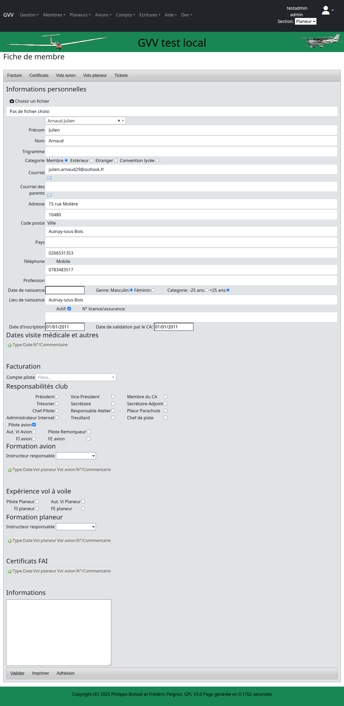
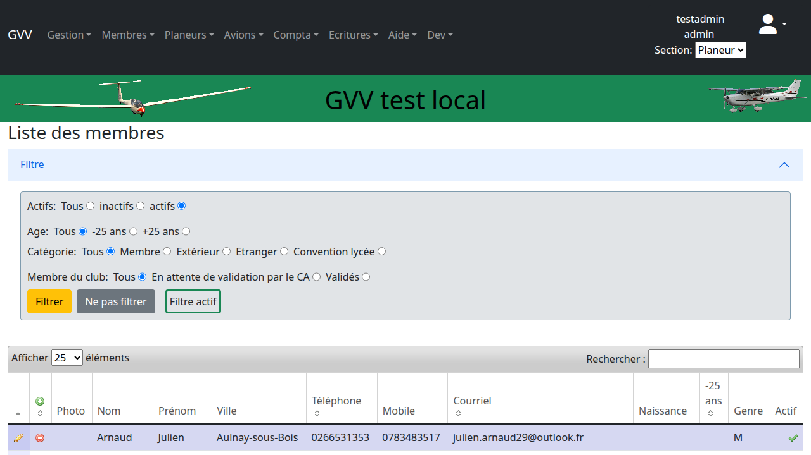

# Gestion des Membres

Ce guide détaille la gestion complète des membres dans GVV : consultation, création, modification et suppression. Il s'agit du guide CRUD (Create, Read, Update, Delete) de référence pour comprendre les opérations de base dans GVV.

## Table des matières

1. [Vue d'ensemble](#vue-ensemble)
2. [Consulter la liste des membres](#consultation)
3. [Créer un nouveau membre](#creation)
4. [Consulter les détails d'un membre](#details)
5. [Modifier un membre](#modification)
6. [Recherche et filtres](#recherche)
7. [Gestion des rôles et permissions](#roles)
8. [Désactiver/Supprimer un membre](#suppression)

## Vue d'ensemble {#vue-ensemble}

La gestion des membres est au cœur de GVV. Chaque membre peut :
- Avoir un profil complet (coordonnées, qualifications, licences)
- Être affecté à une ou plusieurs sections
- Avoir des rôles spécifiques (pilote, instructeur, administrateur)
- Posséder un compte client pour la facturation

### Accès

Pour accéder à la gestion des membres :
1. Connectez-vous à GVV
2. Cliquez sur **"Membres"** dans le menu principal
3. Ou naviguez directement vers `/membre`

## Consulter la liste des membres {#consultation}

### Vue principale

La liste des membres présente un tableau avec les informations essentielles.

### Informations affichées

Le tableau des membres affiche généralement :
- **Nom et prénom** (cliquables pour voir les détails)
- **Login** (identifiant unique)
- **Email** de contact
- **Téléphone**
- **Section(s)** d'appartenance
- **Statut** (actif/inactif)
- **Rôles** (pilote, instructeur, admin)

### Navigation

- **Pagination** : Utilisez les contrôles en bas pour naviguer entre les pages
- **Tri** : Cliquez sur les en-têtes de colonnes pour trier
- **Nombre d'éléments** : Choisissez le nombre de membres par page
- **Actions** : Boutons pour voir, modifier, ou supprimer

## Créer un nouveau membre {#creation}

### Accès au formulaire

1. Dans la liste des membres, cliquez sur **"Ajouter un membre"** ou le bouton **"+"**
2. Le formulaire de création s'ouvre

### Informations obligatoires

Les champs requis incluent typiquement :
- **Nom** et **Prénom**
- **Login** (identifiant unique)
- **Email** (pour les communications)
- **Section** d'appartenance

### Informations optionnelles

Vous pouvez également renseigner :
- **Coordonnées complètes** (adresse, téléphone)
- **Date de naissance**
- **Licences et qualifications**
- **Photo** du membre
- **Commentaires** administratifs

### Validation et sauvegarde

1. Remplissez les champs obligatoires
2. Cliquez sur **"Enregistrer"** ou **"Créer"**
3. Le système valide les données et crée le membre
4. Vous êtes redirigé vers la fiche du nouveau membre

> **💡 Conseil** : Le login doit être unique dans la base. GVV vous préviendra en cas de doublon.

## Consulter les détails d'un membre {#details}

### Accès aux détails

Pour voir la fiche complète d'un membre :
1. Dans la liste, cliquez sur le **nom du membre**
2. Ou utilisez l'icône "Voir" dans la colonne Actions

### Sections de la fiche

La fiche membre comprend plusieurs sections :

#### Informations personnelles
- Identité complète
- Coordonnées
- Photo (si disponible)

#### Qualifications
- Licences de pilote
- Qualifications instructeur
- Dates de validité

#### Activité
- Historique des vols
- Dernières connexions
- Statistiques personnelles

#### Facturation
- Compte client associé
- Solde actuel
- Historique des factures

## Modifier un membre {#modification}

### Accès à la modification

1. Dans la fiche du membre, cliquez sur **"Modifier"**
2. Ou utilisez l'icône crayon dans la liste

### Champs modifiables

Selon vos droits, vous pouvez modifier :
- **Coordonnées** (adresse, téléphone, email)
- **Informations administratives**
- **Qualifications et licences**
- **Statut** (actif/inactif)

### Restrictions

Certains champs peuvent être protégés :
- **Login** (généralement non modifiable)
- **Nom/Prénom** (selon la configuration)
- **Rôles** (réservés aux administrateurs)

### Sauvegarde

1. Modifiez les informations souhaitées
2. Cliquez sur **"Enregistrer"** ou **"Mettre à jour"**
3. Les modifications sont immédiatement prises en compte

## Recherche et filtres {#recherche}

### Outils de recherche

GVV propose plusieurs moyens de trouver rapidement un membre.

### Types de recherche

#### Recherche textuelle
- Tapez dans la barre de recherche
- Recherche dans nom, prénom, email, login
- Résultats en temps réel

#### Filtres par statut
- **Actifs** : Membres en activité
- **Inactifs** : Membres suspendus ou partis
- **Tous** : Affichage complet

#### Filtres par section
- Sélectionnez une section spécifique
- Utile pour les clubs multi-activités

#### Filtres par rôle
- **Pilotes** uniquement
- **Instructeurs**
- **Administrateurs**

### Conseils de recherche

- Utilisez des **mots partiels** (3 lettres minimum)
- **Combinez les filtres** pour affiner
- **Exportez** les résultats si nécessaire

## Gestion des rôles et permissions {#roles}

### Système de rôles

GVV utilise un système de rôles pour contrôler l'accès aux fonctionnalités.

### Rôles principaux

- **Visiteur** : Consultation limitée
- **Membre** : Saisie de ses propres vols
- **Responsable** : Gestion de sa section
- **CA** : Administration complète

### Attribution des rôles

1. Dans la fiche du membre, section **"Rôles"**
2. Cochez les rôles appropriés par section
3. Sauvegardez les modifications

> **⚠️ Important** : Seuls les administrateurs peuvent modifier les rôles.

### Permissions par rôle

| Rôle | Consultation | Saisie vols | Gestion membres | Administration |
|------|-------------|-------------|-----------------|----------------|
| Visiteur | ✓ | ❌ | ❌ | ❌ |
| Membre | ✓ | ✓ (soi) | ❌ | ❌ |
| Responsable | ✓ | ✓ | ✓ (section) | ❌ |
| CA | ✓ | ✓ | ✓ | ✓ |

## Désactiver/Supprimer un membre {#suppression}

### Différence entre désactivation et suppression

#### Désactivation (recommandée)
- Le membre reste dans la base
- L'historique est préservé
- La connexion est bloquée
- Réversible facilement

#### Suppression définitive
- Effacement complet
- Perte de l'historique
- **Irréversible**
- À éviter sauf cas exceptionnel

### Procédure de désactivation

1. Ouvrez la fiche du membre
2. Cliquez sur **"Désactiver"**
3. Confirmez l'action
4. Le membre passe en statut "Inactif"

### Réactivation

Pour réactiver un membre :
1. Affichez les membres inactifs
2. Sélectionnez le membre
3. Cliquez sur **"Réactiver"**

## Bonnes pratiques

### Création de membres

- **Vérifiez l'unicité** avant création
- **Renseignez l'email** pour les communications
- **Assignez la section** appropriée
- **Définissez les rôles** selon les besoins

### Maintenance

- **Revoyez régulièrement** les statuts
- **Mettez à jour** les coordonnées
- **Vérifiez les qualifications** et dates d'expiration
- **Archivez** plutôt que supprimer

### Sécurité

- **Limitez les droits** d'administration
- **Désactivez rapidement** les comptes non utilisés
- **Vérifiez les emails** avant envoi groupé

## Cas d'usage fréquents

### Nouveau pilote

1. **Créer** le membre avec les informations de base
2. **Assigner** à la section appropriée
3. **Définir** le rôle "Membre"
4. **Renseigner** les qualifications
5. **Créer** le compte client si nécessaire

### Instructeur

1. **Modifier** un membre existant
2. **Ajouter** le rôle "Instructeur" 
3. **Renseigner** les qualifications d'enseignement
4. **Vérifier** les dates de validité

### Membre partant

1. **Désactiver** le compte
2. **Conserver** l'historique des vols
3. **Clôturer** le compte client
4. **Archiver** les documents

## Dépannage

### Problèmes fréquents

#### "Login déjà utilisé"
- Vérifiez l'unicité du login
- Contrôlez les membres inactifs
- Utilisez une variante si nécessaire

#### "Email invalide"
- Vérifiez le format de l'adresse
- Supprimez les espaces parasites
- Testez l'envoi d'un email

#### "Droits insuffisants"
- Vérifiez vos permissions
- Contactez un administrateur
- Changez de section si nécessaire

---

**Guide GVV** - Gestion Vol à Voile  
*Gestion des Membres - Version française*  
*Mis à jour en décembre 2024*

[◀ Démarrage](01_demarrage.md) | [Retour à l'index](README.md) | [Gestion des aéronefs ▶](03_gestion_aeronefs.md)