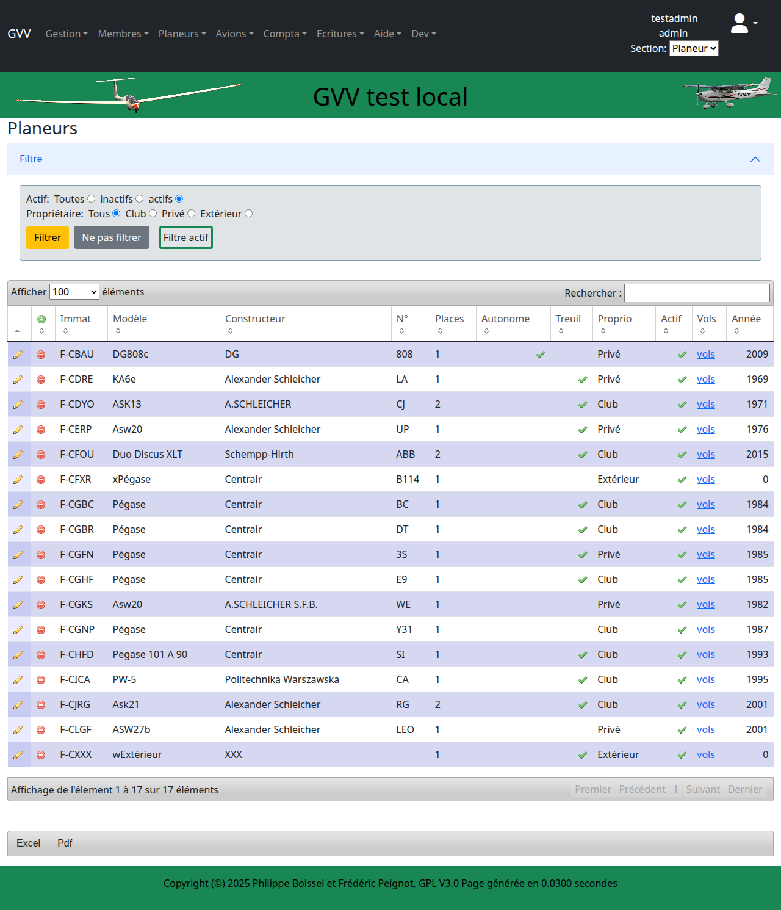
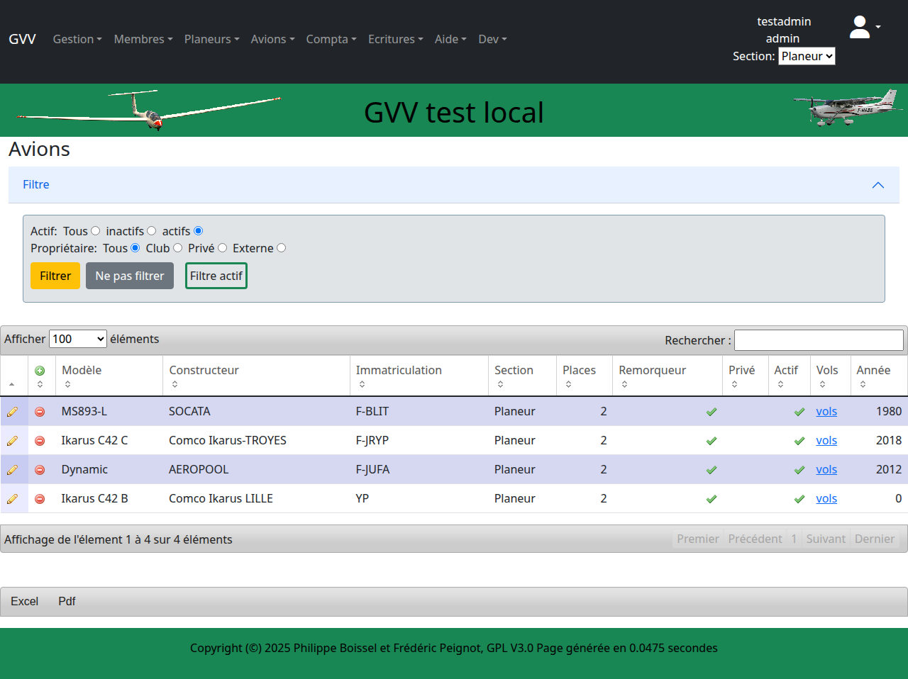

# Gestion des Aéronefs

Ce guide présente la gestion de la flotte d'aéronefs dans GVV : planeurs et avions remorqueurs. Vous apprendrez à consulter, ajouter et gérer les aéronefs de votre club.

## Table des matières

1. [Vue d'ensemble](#vue-ensemble)
2. [Gestion des planeurs](#planeurs)
3. [Gestion des avions remorqueurs](#avions)
4. [Ajout d'un nouvel aéronef](#ajout)
5. [Statut actif/inactif](#statut)
6. [Informations techniques](#techniques)

## Vue d'ensemble {#vue-ensemble}

GVV distingue deux types d'aéronefs :
- **Planeurs** : Aéronefs de vol à voile
- **Avions** : Avions remorqueurs et avions école

Chaque aéronef a ses propres caractéristiques, tarifs et suivi de maintenance.

### Accès

Pour gérer les aéronefs :
1. Connectez-vous à GVV
2. Utilisez les menus **"Planeurs"** ou **"Avions"** dans la navigation principale
3. Ou naviguez directement vers `/planeur` ou `/avion`

## Gestion des planeurs {#planeurs}

### Liste des planeurs

La liste des planeurs affiche tous les aéronefs de vol à voile de votre club.

### Informations affichées

Pour chaque planeur, vous voyez :
- **Immatriculation** (ex: F-CXXX)
- **Type** (modèle du planeur)
- **Places** (monoplace, biplace)
- **Statut** (actif/inactif)
- **Tarifs** associés
- **Actions** (voir, modifier, supprimer)

### Navigation dans la liste

- **Tri** : Cliquez sur les en-têtes de colonnes
- **Recherche** : Utilisez le champ de recherche pour filtrer
- **Actions** : Boutons pour chaque planeur
- **Pagination** : Navigation entre les pages si nécessaire

## Gestion des avions remorqueurs {#avions}

### Liste des avions

La liste des avions remorqueurs présente les aéronefs motorisés utilisés pour le remorquage.

### Spécificités des avions

Les avions ont des caractéristiques particulières :
- **Puissance moteur**
- **Consommation** (carburant)
- **Capacité remorquage**
- **Maintenance moteur** (heures de vol)

### Utilisation

Les avions sont principalement utilisés pour :
- **Remorquage** des planeurs
- **Formation** pilote avion
- **Vols découverte** motorisés

## Ajout d'un nouvel aéronef {#ajout}

### Procédure générale

Pour ajouter un aéronef (processus similaire pour planeurs et avions) :

1. **Accès au formulaire** : Cliquez sur "Ajouter" dans la liste appropriée
2. **Informations obligatoires** :
   - Immatriculation (unique)
   - Type/Modèle
   - Nombre de places
   - Section d'appartenance

3. **Informations optionnelles** :
   - Caractéristiques techniques
   - Photo de l'aéronef
   - Commentaires
   - Tarifs spécifiques

4. **Validation** : Vérification de l'unicité de l'immatriculation
5. **Sauvegarde** : Création de l'aéronef dans la base

> **💡 Conseil** : L'immatriculation doit respecter les normes de votre pays (ex: F-CXXX en France).

### Données techniques importantes

#### Pour les planeurs
- **Finesse** maximale
- **Vitesse de décrochage**
- **Masse à vide**
- **Charge utile**

#### Pour les avions
- **Puissance moteur**
- **Consommation horaire**
- **Vitesse de remorquage**
- **Autonomie**

## Statut actif/inactif {#statut}

### Gestion du statut

Chaque aéronef peut être :
- **Actif** : Disponible pour les vols
- **Inactif** : Temporairement indisponible

### Raisons de mise en inactif

- **Maintenance** programmée
- **Révision** annuelle
- **Réparation** suite à incident
- **Vente** ou mise au rebut

### Activation/Désactivation

1. **Accès** : Fiche de l'aéronef
2. **Modification** du statut
3. **Raison** (optionnelle) de la mise en inactif
4. **Sauvegarde** immédiate

> **⚠️ Important** : Un aéronef inactif n'apparaît plus dans les sélecteurs de vol mais reste visible dans l'historique.

## Informations techniques {#techniques}

### Fiche technique

Chaque aéronef dispose d'une fiche complète avec :

#### Identification
- Immatriculation officielle
- Constructeur et modèle
- Numéro de série
- Année de construction

#### Caractéristiques
- Dimensions (envergure, longueur)
- Masses (vide, maximale)
- Performances (vitesses, finesse)

#### Maintenance
- Heures de vol totales
- Prochaine révision
- Historique des interventions

#### Assurance
- Compagnie d'assurance
- Numéro de police
- Dates de validité

### Suivi des heures

GVV assure le suivi automatique :
- **Compteur** mis à jour à chaque vol
- **Alertes** avant échéances de maintenance
- **Historique** complet des vols
- **Statistiques** d'utilisation

## Tarification

### Tarifs par aéronef

Chaque aéronef peut avoir :
- **Tarif horaire** spécifique
- **Tarif au vol** (forfait)
- **Tarifs différenciés** (membres/non-membres)
- **Tarifs saisonniers**

### Association aux vols

Les tarifs sont automatiquement :
- **Appliqués** lors de la saisie des vols
- **Calculés** selon la durée du vol
- **Facturés** au pilote ou à l'élève

## Maintenance et sécurité

### Suivi réglementaire

GVV aide à respecter :
- **Révisions annuelles**
- **Visites de maintenance**
- **Contrôles réglementaires**
- **Validités des documents**

### Alertes automatiques

Le système peut alerter pour :
- **Échéances** de maintenance
- **Limites d'heures** de vol
- **Validité** des certificats
- **Assurance** expirée

## Cas d'usage fréquents

### Nouveau planeur

1. **Acquisition** : Réception du planeur
2. **Enregistrement** : Création dans GVV
3. **Configuration** : Tarifs et paramètres
4. **Formation** : Briefing pilotes
5. **Mise en service** : Activation pour les vols

### Maintenance programmée

1. **Planification** : Date d'immobilisation
2. **Désactivation** : Retrait temporaire du service
3. **Suivi** : Progression des travaux
4. **Remise en service** : Réactivation après contrôles

### Fin de carrière

1. **Désactivation** définitive
2. **Conservation** de l'historique
3. **Archivage** des documents
4. **Radiation** administrative

## Bonnes pratiques

### Gestion quotidienne

- **Vérifiez** le statut avant les vols
- **Mettez à jour** les informations techniques
- **Surveillez** les compteurs d'heures
- **Anticipez** les maintenances

### Sécurité

- **Respectez** les limitations techniques
- **Suivez** les échéances réglementaires
- **Documentez** tous les incidents
- **Formez** les utilisateurs

### Administration

- **Sauvegardez** régulièrement les données
- **Vérifiez** les assurances
- **Archivez** les documents importants
- **Tenez à jour** le carnet de route

## Dépannage

### Problèmes fréquents

#### "Immatriculation déjà utilisée"
- Vérifiez la base existante
- Contrôlez la saisie (F-CXXX)
- Cherchez dans les inactifs

#### "Aéronef non trouvé dans les vols"
- Vérifiez le statut (actif/inactif)
- Contrôlez la section
- Rechargez la page

#### "Compteur d'heures incorrect"
- Vérifiez les derniers vols saisis
- Contrôlez les modifications manuelles
- Recalculez si nécessaire

---

**Guide GVV** - Gestion Vol à Voile  
*Gestion des Aéronefs - Version française*  
*Mis à jour en décembre 2024*

[◀ Gestion des membres](02_gestion_membres.md) | [Retour à l'index](README.md) | [Saisie des vols ▶](04_saisie_vols.md)