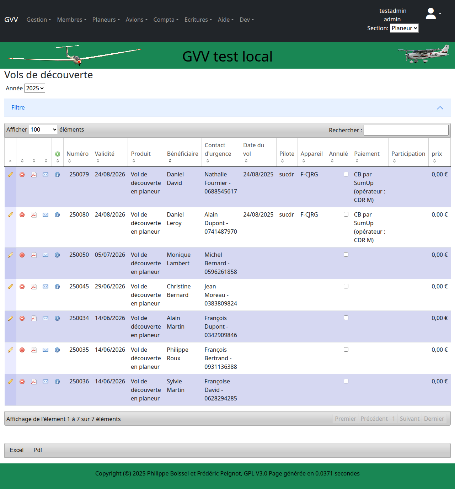

# Saisie des Vols

Ce guide présente la saisie et la gestion des vols dans GVV. Vous apprendrez à enregistrer les différents types de vols et à consulter l'activité de votre club.

## Table des matières

1. [Types de vols](#types-vols)
2. [Vols de planeur](#vols-planeur)
3. [Vols d'avion](#vols-avion)
4. [Vols de découverte](#vols-decouverte)
5. [Consultation des vols](#consultation)
6. [Validation et facturation](#validation)

## Types de vols {#types-vols}

GVV gère trois catégories principales de vols :

- **Vols de planeur** : Vol à voile (entraînement, perfectionnement, compétition)
- **Vols d'avion** : Remorquage, école avion, navigation
- **Vols de découverte** : Baptêmes de l'air et vols découverte

### Accès aux différents modules

- **Vols planeur** : Menu "Planeurs" → "Vols" ou `/vol_planeur`
- **Vols avion** : Menu "Avions" → "Vols" ou `/vol_avion`
- **Vols découverte** : Menu "Gestion" → "Vols découverte" ou `/vols_decouverte`

## Vols de planeur {#vols-planeur}

### Liste des vols de planeur

La liste présente tous les vols de vol à voile enregistrés.

### Informations d'un vol planeur

Chaque vol comprend :
- **Date et heure** de décollage
- **Planeur** utilisé (immatriculation)
- **Pilote** et **passager** (si biplace)
- **Durée** du vol
- **Type de lancement** (remorqué, treuil, auto-lancement)
- **Aérodrome** de départ et d'arrivée
- **Nature du vol** (local, navigation, compétition)

### Saisie d'un vol planeur

**Processus de saisie :**

1. **Accès** : Cliquez sur "Ajouter un vol" dans la liste
2. **Informations obligatoires** :
   - Date et heure de départ
   - Planeur (sélection dans la liste des actifs)
   - Pilote (membre du club ou externe)
   - Durée du vol
3. **Informations optionnelles** :
   - Passager (pour vols biplace)
   - Instructeur (pour vols d'instruction)
   - Commentaires sur le vol
4. **Validation** et sauvegarde

### Types de vols planeur

- **École** : Formation pilote planeur
- **Perfectionnement** : Amélioration technique
- **Loisir** : Vol de plaisance
- **Navigation** : Vol de cross-country
- **Compétition** : Vol en compétition
- **Test** : Vol d'essai ou de réception

## Vols d'avion {#vols-avion}

### Liste des vols d'avion

### Spécificités des vols avion

Les vols d'avion incluent :

#### Remorquage
- **Hauteur** de lâcher
- **Planeur remorqué**
- **Durée** spécifique du remorquage

#### École avion
- **Pilote** en formation
- **Instructeur**
- **Exercices** réalisés

#### Navigation
- **Itinéraire** suivi
- **Aérodromes** visités
- **Passagers** transportés

### Saisie d'un vol avion

**Champs spécifiques avion :**
- **Consommation** carburant
- **Temps moteur** (vs temps de vol)
- **Nombre d'atterrissages**
- **Conditions météo**

## Vols de découverte {#vols-decouverte}

### Module spécialisé

Les vols de découverte ont leur propre module dédié pour la gestion commerciale.

### Caractéristiques spéciales

#### Gestion commerciale
- **Bénéficiaire** du vol (nom, coordonnées)
- **Offrant** (qui offre le vol)
- **Occasion** (anniversaire, cadeau, etc.)
- **Tarification** spécifique

#### Suivi administratif
- **Réservation** et planification
- **Contact** avec le bénéficiaire
- **Facturation** et encaissement
- **Statistiques** commerciales

### Processus complet

1. **Réservation** : Contact et planification
2. **Confirmation** : Validation des créneaux
3. **Réalisation** : Vol effectif
4. **Facturation** : Émission de la facture
5. **Suivi** : Satisfaction client

## Consultation des vols {#consultation}

### Filtres et recherche

Pour toutes les listes de vols, vous disposez de :

#### Filtres temporels
- **Période** (aujourd'hui, semaine, mois)
- **Dates** de début et fin
- **Année** sélectionnée

#### Filtres par critères
- **Pilote** spécifique
- **Aéronef** utilisé
- **Type** de vol
- **Statut** (validé, en attente)

#### Recherche textuelle
- **Commentaires** de vol
- **Noms** de pilotes
- **Immatriculations**

### Informations affichées

Les listes présentent :
- **Détails** essentiels du vol
- **Statut** de validation
- **Facturation** (facturé/non facturé)
- **Actions** possibles (voir, modifier, supprimer)

### Export des données

- **CSV** : Pour analyse dans un tableur
- **PDF** : Pour archivage papier
- **Impression** : Listing direct

## Validation et facturation {#validation}

### Processus de validation

#### Validation technique
- **Cohérence** des données (durées, heures)
- **Disponibilité** des aéronefs
- **Qualifications** des pilotes

#### Validation administrative
- **Approbation** par un responsable
- **Contrôle** des tarifs appliqués
- **Vérification** des assurances

### Facturation automatique

Une fois validé, un vol peut être :
- **Facturé** automatiquement selon les tarifs
- **Imputé** au compte pilote
- **Inclus** dans la facturation périodique

### États de facturation

- **En attente** : Vol saisi, non encore traité
- **Validé** : Vol contrôlé et approuvé
- **Facturé** : Montant calculé et imputé
- **Payé** : Facturation encaissée

## Fonctionnalités avancées

### Saisie en lot

Pour les journées d'activité intense :
- **Import** de fichiers de vol
- **Saisie rapide** multi-vols
- **Duplication** de vols similaires
- **Templates** de vols fréquents

### Synchronisation

GVV peut se synchroniser avec :
- **Loggers** de vol électroniques
- **Applications** de navigation
- **Systèmes** de gestion de club externes

### Statistiques

Analyse de l'activité :
- **Heures** de vol par période
- **Utilisation** des aéronefs
- **Activité** par pilote
- **Évolution** temporelle

## Bonnes pratiques

### Saisie quotidienne

- **Enregistrez** les vols le jour même
- **Vérifiez** les durées et heures
- **Complétez** tous les champs obligatoires
- **Ajoutez** des commentaires utiles

### Contrôle qualité

- **Relisez** avant validation
- **Vérifiez** les calculs de durée
- **Contrôlez** les pilotes et aéronefs
- **Surveillez** les incohérences

### Facturation

- **Validez** rapidement les vols
- **Vérifiez** les tarifs appliqués
- **Contrôlez** les comptes pilotes
- **Suivez** les encaissements

## Cas d'usage spécifiques

### Journée type de club

1. **Préparation** : Vérification météo et aéronefs
2. **Activité** : Vols d'école et de loisir
3. **Saisie** : Enregistrement en fin de journée
4. **Contrôle** : Validation par le responsable
5. **Facturation** : Traitement automatique

### Stage de formation

1. **Planification** : Programme des vols
2. **Suivi** : Progression des élèves
3. **Validation** : Contrôle instructeur
4. **Certification** : Validation des acquis

### Compétition

1. **Déclaration** : Vols de compétition
2. **Suivi** : Performances et classements
3. **Analyse** : Exploitation des données
4. **Archive** : Conservation des résultats

## Dépannage

### Problèmes fréquents

#### "Aéronef non disponible"
- Vérifiez le statut (actif/inactif)
- Contrôlez la section
- Vérifiez les créneaux de maintenance

#### "Pilote non trouvé"
- Vérifiez l'orthographe
- Contrôlez le statut du membre
- Créez le pilote si externe

#### "Durée incohérente"
- Vérifiez les heures de début/fin
- Contrôlez le format de saisie
- Recalculez automatiquement

---

**Guide GVV** - Gestion Vol à Voile  
*Saisie des Vols - Version française*  
*Mis à jour en décembre 2024*

[◀ Gestion des aéronefs](03_gestion_aeronefs.md) | [Retour à l'index](README.md) | [Calendrier des vols ▶](05_calendrier.md)