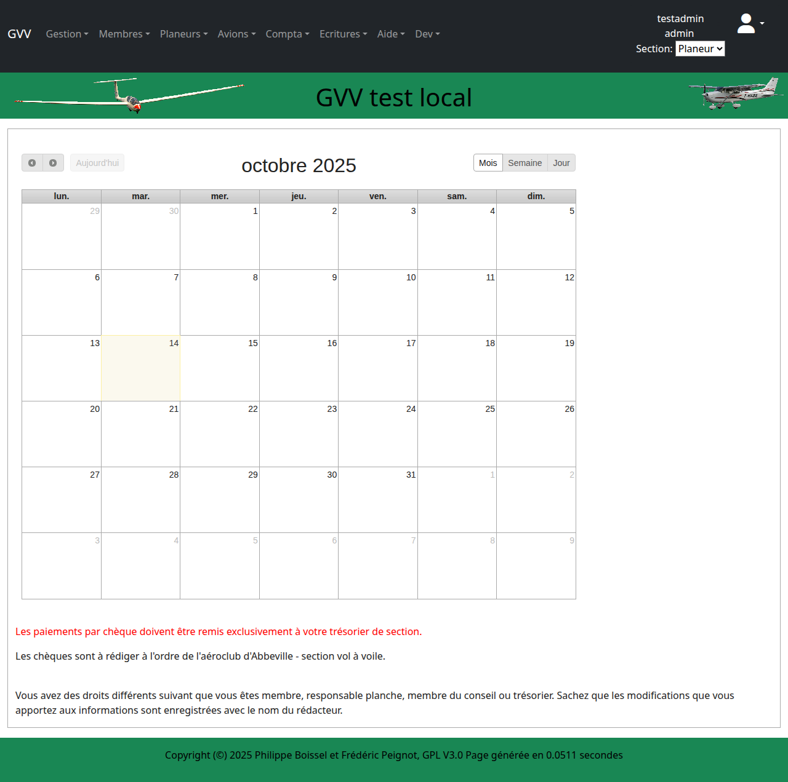

# Calendrier des Vols

Ce guide présente l'utilisation du calendrier dans GVV pour la planification et le suivi des activités de vol de votre club.

## Table des matières

1. [Vue d'ensemble](#vue-ensemble)
2. [Interface du calendrier](#interface)
3. [Planification des vols](#planification)
4. [Gestion des présences](#presences)
5. [Événements spéciaux](#evenements)

## Vue d'ensemble {#vue-ensemble}

Le calendrier GVV centralise toutes les activités de votre club :
- **Intentions de vol** des membres
- **Événements** du club (stages, compétitions)
- **Maintenance** des aéronefs
- **Météo** et conditions de vol

### Accès au calendrier

Le calendrier est accessible :
- **Page d'accueil** : Vue principale après connexion
- **Menu** "Calendrier" dans la navigation
- **URL directe** : Page d'accueil de GVV

## Interface du calendrier {#interface}

### Vue principale

### Éléments de l'interface

#### Zone calendrier
- **Vue mensuelle** : Affichage par mois
- **Cases journalières** : Une case par jour
- **Événements** : Visualisation des activités
- **Navigation** : Changement de mois/année

#### Informations météo
- **Conditions actuelles** : Température, vent, visibilité
- **Prévisions** : Évolution sur quelques jours
- **Alertes** : Conditions défavorables au vol

#### Zone d'activité
- **Derniers vols** : Activité récente du club
- **Statistiques** : Résumé de l'activité
- **Annonces** : Messages du club

### Types d'affichage

#### Vue mensuelle
- **Calendrier classique** avec cases journalières
- **Aperçu** des événements sur chaque jour
- **Navigation** par mois

#### Vue hebdomadaire
- **Semaine détaillée** avec créneaux horaires
- **Planning** précis des activités
- **Disponibilités** des instructeurs

#### Vue journalière
- **Détail** heure par heure
- **Réservations** de créneaux
- **Suivi** en temps réel

## Planification des vols {#planification}

### Ajouter une intention de vol

#### Processus de réservation

1. **Sélection** : Cliquez sur la date souhaitée
2. **Formulaire** : Saisissez vos informations
   - Type de vol (école, perfectionnement, loisir)
   - Créneaux horaires souhaités
   - Aéronef préféré (si applicable)
   - Commentaires
3. **Validation** : Confirmation de l'intention

#### Informations à fournir

**Obligatoires :**
- **Date** et créneaux horaires
- **Type d'activité** prévue
- **Pilote** responsable

**Optionnelles :**
- **Aéronef** souhaité
- **Nombre de vols** prévus
- **Besoins spéciaux** (instructeur, remorquage)

### Modification d'intentions

Pour modifier une intention existante :
1. **Cliquez** sur votre intention dans le calendrier
2. **Modifiez** les informations nécessaires
3. **Sauvegardez** les changements

### Annulation

En cas d'empêchement :
1. **Supprimez** votre intention à temps
2. **Libérez** ainsi les créneaux pour d'autres
3. **Prévenez** si d'autres comptaient sur vous

## Gestion des présences {#presences}

### Confirmation de présence

Le système permet de :
- **Confirmer** votre présence la veille
- **Signaler** vos disponibilités d'instructeur
- **Indiquer** vos créneaux préférés

### Suivi des disponibilités

#### Instructeurs
- **Planning** des instructeurs disponibles
- **Spécialités** de chacun (planeur, avion, qualification montagne)
- **Créneaux** de disponibilité

#### Aéronefs
- **Disponibilité** des planeurs et avions
- **Maintenance** programmée
- **Réservations** existantes

### Notifications

GVV peut envoyer :
- **Rappels** de vos intentions de vol
- **Alertes météo** défavorables
- **Changements** dans la planification
- **Annulations** d'événements

## Événements spéciaux {#evenements}

### Types d'événements

#### Formations
- **Stages** de perfectionnement
- **Formations** théoriques
- **Brevets** et qualifications
- **Recyclages** instructeurs

#### Compétitions
- **Régionales** et nationales
- **Locales** du club
- **Challenges** inter-clubs
- **Championnats** jeunes

#### Manifestations
- **Journées portes ouvertes**
- **Meetings** aériens
- **Démonstrations** publiques
- **Événements** partenaires

### Organisation d'événements

#### Planification
1. **Réservation** des dates sur le calendrier
2. **Coordination** avec les autres activités
3. **Communication** aux membres
4. **Préparation** logistique

#### Gestion
- **Inscriptions** des participants
- **Planification** des vols
- **Coordination** des moyens
- **Suivi** des résultats

## Intégration externe

### Synchronisation calendrier

GVV peut s'intégrer avec :
- **Google Calendar** : Synchronisation bidirectionnelle
- **Outlook** : Import/export d'événements
- **Applications mobiles** : Consultation en déplacement

### Partage d'informations

- **Site web** du club : Affichage public du calendrier
- **Réseaux sociaux** : Partage d'événements
- **Newsletters** : Information des membres

## Utilisation mobile

### Application mobile

Le calendrier GVV est accessible :
- **Navigateur mobile** : Interface adaptée
- **Applications** dédiées (selon configuration)
- **Notifications push** : Alertes importantes

### Fonctionnalités mobiles

- **Consultation** du planning en déplacement
- **Ajout** d'intentions de vol
- **Vérification** météo temps réel
- **Contact** avec les autres membres

## Conseils d'utilisation

### Pour les pilotes

#### Planification efficace
- **Anticipez** vos vols (24-48h à l'avance)
- **Soyez réaliste** sur vos disponibilités
- **Communiquez** vos changements rapidement
- **Respectez** vos engagements

#### Météo
- **Consultez** régulièrement les prévisions
- **Adaptez** vos intentions selon les conditions
- **Soyez flexible** sur les horaires
- **Privilégiez** la sécurité

### Pour les instructeurs

#### Disponibilités
- **Indiquez** clairement vos créneaux
- **Précisez** vos spécialités
- **Communiquez** vos absences
- **Coordonnez** avec les autres instructeurs

#### Suivi élèves
- **Planifiez** la progression des élèves
- **Coordonnez** théorie et pratique
- **Suivez** les validations de brevets
- **Organisez** les tests en vol

### Pour les responsables

#### Gestion globale
- **Surveillez** l'équilibrage des activités
- **Anticipez** les besoins en aéronefs
- **Coordonnez** les maintenances
- **Gérez** les conflits d'usage

#### Communication
- **Informez** des événements importants
- **Diffusez** les changements d'organisation
- **Rappelez** les règles de sécurité
- **Valorisez** les succès du club

## Statistiques et rapports

### Analyse d'activité

Le calendrier permet de générer :
- **Statistiques** de fréquentation par période
- **Utilisation** des aéronefs
- **Répartition** des types de vols
- **Évolution** de l'activité

### Indicateurs utiles

- **Taux d'occupation** des créneaux
- **Efficacité** des planifications
- **Météo** et activité de vol
- **Satisfaction** des membres

## Dépannage

### Problèmes fréquents

#### "Calendrier non mis à jour"
- **Actualisez** la page (F5)
- **Vérifiez** votre connexion internet
- **Contactez** l'administrateur si persistant

#### "Impossible d'ajouter une intention"
- **Vérifiez** vos droits d'accès
- **Contrôlez** la date (pas dans le passé)
- **Essayez** un autre navigateur

#### "Notifications non reçues"
- **Vérifiez** votre adresse email
- **Contrôlez** les spams
- **Mettez à jour** vos préférences

---

**Guide GVV** - Gestion Vol à Voile  
*Calendrier des Vols - Version française*  
*Mis à jour en décembre 2024*

[◀ Saisie des vols](04_saisie_vols.md) | [Retour à l'index](README.md) | [Facturation ▶](06_facturation.md)