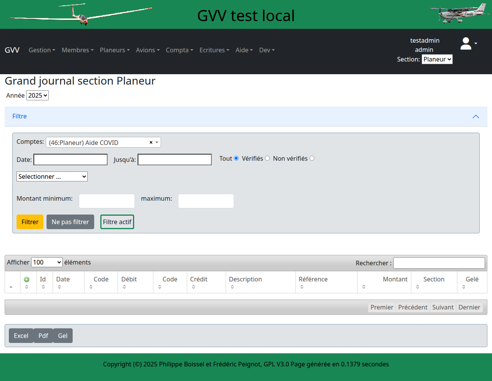

# Comptabilité

Ce guide présente le système comptable intégré de GVV. Vous apprendrez à gérer le plan comptable, saisir des écritures et produire les états financiers de votre club.

## Table des matières

1. [Vue d'ensemble](#vue-ensemble)
2. [Plan comptable](#plan-comptable)
3. [Saisie d'écritures](#ecritures)
4. [Rapprochement bancaire](#rapprochement)
5. [États financiers](#etats-financiers)
6. [Clôture d'exercice](#cloture)
7. [Gestion des éléments inactifs](#elements-inactifs)

## Vue d'ensemble {#vue-ensemble}

GVV intègre un système comptable complet adapté aux associations :
- **Comptabilité** en partie double
- **Plan comptable** spécialisé aéroclub
- **Saisie** manuelle et automatique
- **États financiers** réglementaires
- **Gestion** multi-exercices

### Principe de fonctionnement

- **Intégration** : Les vols facturés génèrent automatiquement des écritures
- **Contrôle** : Chaque écriture est équilibrée (débit = crédit)
- **Suivi** : Suivi en temps réel de la situation financière
- **Reporting** : États financiers disponibles à tout moment

## Plan comptable {#plan-comptable}

### Structure du plan

Le plan comptable suit la nomenclature française adaptée aux associations :

#### Classe 1 - Comptes de capitaux
- **10** : Capital associatif
- **11** : Réserves
- **12** : Résultats (bénéfices/pertes)
- **13** : Subventions d'investissement
- **16** : Emprunts et dettes assimilées

#### Classe 2 - Comptes d'immobilisations
- **21** : Immobilisations corporelles (aéronefs, bâtiments)
- **24** : Mobilier et matériel
- **28** : Amortissements des immobilisations

#### Classe 3 - Comptes de stocks
- **31** : Carburant et lubrifiants
- **32** : Pièces de rechange
- **37** : Stocks de marchandises

#### Classe 4 - Comptes de tiers
- **41** : Clients (membres, externes)
- **40** : Fournisseurs
- **44** : État et collectivités (TVA, subventions)
- **42** : Personnel

#### Classe 5 - Comptes financiers
- **51** : Banques
- **53** : Caisse
- **58** : Placements financiers

#### Classes 6 et 7 - Charges et produits
- **60** : Achats (carburant, pièces)
- **61** : Services extérieurs (maintenance, assurances)
- **62** : Autres services (communications, formations)
- **63** : Impôts et taxes
- **64** : Charges de personnel
- **65** : Autres charges
- **70** : Ventes (heures de vol, formations)
- **74** : Subventions d'exploitation
- **75** : Autres produits

### Personnalisation

Le plan peut être adapté selon :
- **Taille** du club (simplification possible)
- **Activités** spécifiques (ULM, parapente)
- **Obligations** légales locales
- **Besoins** de suivi particuliers

## Saisie d'écritures {#ecritures}

### Interface de saisie

### Types d'écritures

#### Écritures automatiques
- **Ventes** : Factures clients générées
- **Encaissements** : Paiements des factures
- **Achats** : Factures fournisseurs
- **Salaires** : Paie du personnel

#### Écritures manuelles
- **Opérations diverses** (OD)
- **Corrections** d'erreurs
- **Écritures** de régularisation
- **Amortissements** et provisions

### Processus de saisie

#### Informations obligatoires
1. **Date** de l'opération
2. **Journal** (ventes, achats, banque, OD)
3. **Libellé** descriptif de l'opération
4. **Comptes** débités et crédités
5. **Montants** (équilibre obligatoire)

#### Contrôles automatiques
- **Équilibrage** débit/crédit
- **Cohérence** des dates
- **Existence** des comptes
- **Conformité** des montants

### Journaux comptables

#### Journal des ventes
- **Factures** clients
- **Avoirs** accordés
- **TVA** sur ventes
- **Remises** et escomptes

#### Journal des achats
- **Factures** fournisseurs
- **Notes** de frais
- **TVA** déductible
- **Immobilisations**

#### Journal de banque
- **Virements** reçus et émis
- **Prélèvements** automatiques
- **Frais** bancaires
- **Agios** et intérêts

#### Journal d'OD (Opérations Diverses)
- **Écritures** de correction
- **Provisions** et amortissements
- **Régularisations** fin d'exercice
- **Affectation** de résultat

## Rapprochement bancaire {#rapprochement}

### Principe

Le rapprochement consiste à vérifier la concordance entre :
- **Comptabilité** : Écritures de banque saisies
- **Relevé bancaire** : Mouvements réels du compte

### Processus de rapprochement

#### Préparation
1. **Import** ou saisie du relevé bancaire
2. **Identification** des opérations non rapprochées
3. **Recherche** de correspondances automatiques
4. **Validation** manuelle des incertitudes

#### Réconciliation
- **Pointage** des opérations identiques
- **Identification** des opérations manquantes
- **Saisie** des mouvements oubliés
- **Investigation** des écarts

#### Validation
- **Solde comptable** = Solde bancaire
- **Toutes opérations** rapprochées
- **Justification** des écarts temporaires
- **Clôture** du rapprochement

### Opérations courantes

#### Écarts fréquents
- **Chèques émis** non encore encaissés
- **Virements** en cours de traitement
- **Frais bancaires** non comptabilisés
- **Erreurs** de saisie

#### Régularisations
- **Correction** des erreurs identifiées
- **Comptabilisation** des frais bancaires
- **Annulation** des doublons
- **Ajustement** des soldes

## États financiers {#etats-financiers}

### Bilan comptable

#### Structure du bilan

**ACTIF**
- **Immobilisations** : Aéronefs, bâtiments, matériel
- **Actif circulant** : Stocks, créances, disponibilités

**PASSIF**
- **Capitaux propres** : Fonds associatifs, réserves
- **Dettes** : Emprunts, fournisseurs, dettes diverses

#### Analyse financière
- **Fonds de roulement** : Capacité de financement
- **Besoin en fonds de roulement** : Décalages de trésorerie
- **Trésorerie nette** : Liquidités disponibles
- **Ratios** de structure financière

### Compte de résultat

#### Produits d'exploitation
- **Ventes** : Heures de vol, formations, services
- **Subventions** : Aides publiques et privées
- **Autres produits** : Manifestations, locations

#### Charges d'exploitation
- **Achats** : Carburant, pièces détachées
- **Services** : Maintenance, assurances, communications
- **Personnel** : Salaires et charges sociales
- **Amortissements** : Dépréciation des immobilisations

#### Résultat
- **Résultat d'exploitation** : Activité principale
- **Résultat financier** : Placements et emprunts
- **Résultat exceptionnel** : Opérations exceptionnelles
- **Résultat net** : Bénéfice ou perte de l'exercice

### Autres états

#### Balance générale
- **Liste** de tous les comptes
- **Soldes** débiteurs et créditeurs
- **Mouvements** de la période
- **Contrôle** d'équilibre

#### Grand livre
- **Détail** par compte
- **Chronologie** des écritures
- **Cumuls** progressifs
- **Justificatifs** attachés

#### Journaux
- **Écritures** par journal
- **Ordre chronologique**
- **Contrôles** d'équilibre
- **Références** des pièces

## Clôture d'exercice {#cloture}

### Préparation

#### Vérifications préalables
- **Tous les vols** facturés
- **Toutes les factures** saisies
- **Rapprochements** bancaires à jour
- **Inventaires** physiques réalisés

#### Écritures de régularisation
- **Charges à payer** : Factures non reçues
- **Produits à recevoir** : Ventes non facturées
- **Charges constatées d'avance** : Assurances, abonnements
- **Produits constatés d'avance** : Cotisations, stages

### Écritures de clôture

#### Amortissements
- **Calcul** des dotations annuelles
- **Comptabilisation** des amortissements
- **Mise à jour** des valeurs nettes
- **Contrôle** de cohérence

#### Provisions
- **Évaluation** des risques
- **Provision** pour créances douteuses
- **Provision** pour réparations
- **Provision** pour congés payés

#### Affectation du résultat
- **Calcul** du résultat définitif
- **Proposition** d'affectation
- **Vote** en assemblée générale
- **Comptabilisation** de l'affectation

### Ouverture du nouvel exercice

#### Reports à nouveau
- **Soldes** des comptes de bilan
- **Remise à zéro** des comptes de gestion
- **Reports** des engagements
- **Initialisation** des compteurs

## Contrôles et audits

### Contrôles internes

#### Contrôles automatiques
- **Équilibrage** des écritures
- **Cohérence** des dates
- **Séquencement** des numéros
- **Totalisation** des journaux

#### Contrôles manuels
- **Révision** des comptes
- **Justification** des soldes
- **Validation** des écritures
- **Supervision** des clôtures

### Audits externes

#### Préparation
- **Dossier** de révision complet
- **Justificatifs** des écritures
- **Procédures** documentées
- **Contrôles** effectués

#### Suivi des recommandations
- **Plan d'action** sur les observations
- **Mise en œuvre** des améliorations
- **Suivi** des corrections
- **Reporting** aux dirigeants

## Bonnes pratiques

### Saisie quotidienne

- **Enregistrez** les opérations rapidement
- **Numérotez** et classez les pièces
- **Sauvegardez** régulièrement
- **Contrôlez** l'équilibre des écritures

### Organisation

- **Planifiez** les tâches comptables
- **Documentez** les procédures
- **Formez** les utilisateurs
- **Auditez** régulièrement

### Sécurité

- **Limitez** les accès aux fonctions sensibles
- **Sauvegardez** les données comptables
- **Archivez** les pièces justificatives
- **Respectez** les obligations légales

## Gestion des éléments inactifs {#elements-inactifs}

GVV permet de masquer les éléments qui ne sont plus utilisés sans perdre leur historique. Cette fonctionnalité s'applique aux **comptes**, **membres** et **aéronefs**.

### Principe général

Les éléments inactifs :
- ✅ **Restent dans la base de données** avec tout leur historique
- ✅ **N'apparaissent plus dans les listes** et sélecteurs par défaut
- ✅ **Peuvent être réactivés** à tout moment
- ✅ **Simplifient l'interface** en réduisant les options affichées

### Comptes masqués

#### Quand masquer un compte ?

Un compte peut être masqué lorsque :
- Son **solde est à 0 €** (condition obligatoire)
- Il n'est **plus utilisé** (ex : ancien compte bancaire, pilote parti)
- Vous souhaitez **alléger les listes** sans perdre l'historique

#### Comment masquer un compte

1. Accédez à **Compta → Balance détaillée**
2. Cliquez sur **Modifier** pour le compte souhaité
3. Vérifiez que le **solde est à 0 €**
4. Cochez la case **"Masqué"**
5. Cliquez sur **Valider**

**Note** : Si le solde n'est pas à 0 €, la case à cocher est désactivée avec un message d'avertissement.

#### Effet du masquage

Un compte masqué n'apparaît plus dans :
- Les **sélecteurs de comptes** (dropdowns)
- Les **listes de comptes** (Balance détaillée/générale)
- Le **journal comptable** pour la saisie
- Les **rapports** (par défaut)

#### Comment voir et démasquer un compte

1. Accédez à **Compta → Balance détaillée**
2. Ouvrez les **Filtres**
3. Dans la section **"Masqué"**, sélectionnez :
   - **"Tous les comptes"** → Voir masqués ET non masqués
   - **"Comptes masqués uniquement"** → Voir uniquement les masqués
4. Pour démasquer : **Modifier** le compte et **décocher** "Masqué"

#### Exemples d'utilisation

**Compte client 411 d'un pilote parti** :
- Solde à 0 € → Masquer le compte
- N'apparaît plus dans les sélecteurs de pilote
- Historique de vol conservé

**Ancien compte bancaire 512** :
- Fonds transférés → Solde à 0 €
- Masquer le compte
- N'encombre plus les saisies d'écritures

### Membres inactifs

#### Principe

Un membre inactif est un membre qui :
- A quitté le club
- N'est plus pilote
- Doit être conservé pour l'historique

#### Comment rendre un membre inactif

1. Accédez à **Membres → Liste des membres**
2. Cliquez sur **Modifier** pour le membre
3. Décochez la case **"Actif"**
4. Cliquez sur **Valider**

**Note** : Contrairement aux comptes, il n'y a pas de condition de solde pour désactiver un membre.

#### Effet

Un membre inactif n'apparaît plus dans :
- Les **sélecteurs de pilotes** pour la saisie de vols
- Les **listes de membres actifs**
- Les **statistiques des pilotes actifs**

#### Comment voir et réactiver un membre

1. Accédez à **Membres → Liste des membres**
2. Utilisez le **filtre "Actif"** pour afficher les inactifs
3. Pour réactiver : **Modifier** le membre et **cocher** "Actif"

### Aéronefs inactifs

#### Principe

Un aéronef inactif est un appareil :
- Vendu ou détruit
- En maintenance longue durée
- Immobilisé temporairement

#### Comment rendre un aéronef inactif

1. Accédez à **Aéronefs → Liste des aéronefs**
2. Cliquez sur **Modifier** pour l'aéronef
3. Décochez la case **"Actif"**
4. Cliquez sur **Valider**

#### Effet

Un aéronef inactif n'apparaît plus dans :
- Les **sélecteurs d'aéronefs** pour la saisie de vols
- Le **calendrier de réservation**
- Les **statistiques d'utilisation**

#### Comment voir et réactiver un aéronef

1. Accédez à **Aéronefs → Liste**
2. Utilisez le **filtre "Actif"** pour afficher les inactifs
3. Pour réactiver : **Modifier** l'aéronef et **cocher** "Actif"

### Comparaison des mécanismes

| Élément | Condition | Effet masquage | Réactivation |
|---------|-----------|----------------|--------------|
| **Compte** | Solde = 0 € | Invisible partout | Sans condition |
| **Membre** | Aucune | Invisible dans sélecteurs | Sans condition |
| **Aéronef** | Aucune | Invisible dans sélecteurs/calendrier | Sans condition |

### Bonnes pratiques

#### Pour les comptes
- ✅ Masquer régulièrement les comptes soldés
- ✅ Vérifier le solde avant de tenter de masquer
- ✅ Utiliser le filtre pour retrouver les masqués
- ❌ Ne pas supprimer, masquer plutôt

#### Pour les membres
- ✅ Désactiver les pilotes partis en fin de saison
- ✅ Conserver les inactifs pour l'historique des vols
- ✅ Documenter la raison (champ notes)
- ❌ Ne pas supprimer les membres avec des vols

#### Pour les aéronefs
- ✅ Désactiver les appareils vendus/détruits
- ✅ Désactiver temporairement si maintenance longue
- ✅ Réactiver après remise en service
- ❌ Ne pas supprimer (historique de vols)

### Cas particuliers

#### Membre avec compte client 411 non soldé

Si un membre doit partir mais son compte n'est pas à 0 :
1. **Régulariser le compte** en priorité
2. Une fois soldé, **masquer le compte**
3. Ensuite, **désactiver le membre**

#### Aéronef vendu avec solde d'amortissement

Si un aéronef est vendu :
1. Passer l'**écriture de cession** (compte 775)
2. **Solder les comptes** d'immobilisation et amortissement
3. **Masquer les comptes** d'immobilisation
4. **Désactiver l'aéronef**

---

**Guide GVV** - Gestion Vol à Voile  
*Comptabilité - Version française*  
*Mis à jour en octobre 2024*

[◀ Facturation](06_facturation.md) | [Retour à l'index](README.md) | [Rapports ▶](08_rapports.md)