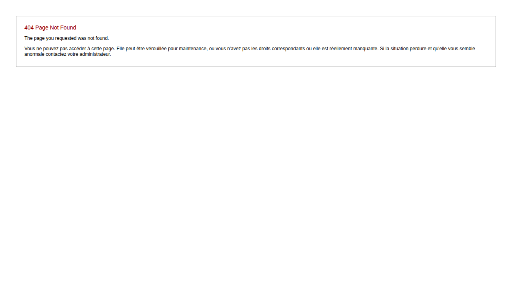

# Rapports et Statistiques

Ce guide présente les fonctionnalités de reporting de GVV. Vous apprendrez à générer des rapports, analyser l'activité et exporter des données.

## Table des matières

1. [Vue d'ensemble](#vue-ensemble)
2. [Types de rapports](#types-rapports)
3. [Génération de rapports](#generation)
4. [Formats d'export](#formats)
5. [Analyses statistiques](#statistiques)
6. [Tableaux de bord](#tableaux-bord)

## Vue d'ensemble {#vue-ensemble}

Le module de rapports GVV propose :
- **Rapports prédéfinis** pour les besoins courants
- **Rapports personnalisés** selon vos critères
- **Exports** dans différents formats
- **Statistiques** d'activité détaillées
- **Tableaux de bord** temps réel

### Accès aux rapports

Les rapports sont accessibles via :
- **Menu "Rapports"** dans la navigation principale
- **Liens directs** depuis les modules concernés
- **Tableaux de bord** de synthèse
- **Exports** automatisés

## Types de rapports {#types-rapports}

### Rapports d'activité

#### Activité de vol
- **Heures de vol** par période (jour, mois, année)
- **Nombre de vols** par type d'activité
- **Utilisation** des aéronefs
- **Activité** par pilote ou instructeur

#### Performance des aéronefs
- **Taux d'utilisation** de chaque aéronef
- **Maintenance** et immobilisations
- **Rentabilité** par appareil
- **Coûts d'exploitation**

#### Évolution temporelle
- **Comparaisons** inter-périodes
- **Tendances** d'activité
- **Saisonnalité** des vols
- **Projections** et prévisions

### Rapports financiers

#### Chiffre d'affaires
- **CA** par type de prestation
- **CA** par aéronef
- **CA** par période
- **Comparaisons** budgétaires

#### Comptes clients
- **Soldes** clients détaillés
- **Encours** et créances
- **Impayés** et retards
- **Analyse** des paiements

#### Rentabilité
- **Marge** par activité
- **Coûts** directs et indirects
- **Seuils** de rentabilité
- **Indicateurs** de performance

### Rapports réglementaires

#### Déclarations officielles
- **Heures** de vol pour autorités
- **Activité** des instructeurs
- **Statistiques** fédérales
- **Bilans** d'activité annuels

#### Sécurité et maintenance
- **Suivi** des maintenances
- **Incidents** et événements
- **Qualifications** des pilotes
- **Validité** des documents

### Rapports de gestion

#### Membres et formation
- **Liste** des membres par section
- **Progression** des élèves
- **Activité** des instructeurs
- **Qualifications** et brevets

#### Planification
- **Utilisation** des créneaux
- **Demandes** de vol
- **Optimisation** des plannings
- **Prévisions** d'activité

## Génération de rapports {#generation}

### Interface de génération

#### Sélection du rapport
1. **Choisissez** le type de rapport souhaité
2. **Configurez** les paramètres et filtres
3. **Sélectionnez** la période d'analyse
4. **Générez** et visualisez le rapport

#### Paramètres courants

**Période :**
- **Dates** de début et fin
- **Périodes prédéfinies** (mois, trimestre, année)
- **Exercices** comptables
- **Comparaisons** multi-périodes

**Filtres :**
- **Section** d'activité
- **Aéronefs** spécifiques
- **Pilotes** ou instructeurs
- **Types** de vol

**Détail :**
- **Niveau** de synthèse ou détail
- **Regroupements** par critères
- **Tris** et classements
- **Calculs** et totalisations

### Rapports prédéfinis

#### Rapports mensuels
- **Activité** mensuelle du club
- **Facturation** et encaissements
- **Utilisation** des aéronefs
- **Performance** des instructeurs

#### Rapports annuels
- **Bilan** d'activité annuel
- **Évolution** sur plusieurs années
- **Statistiques** complètes
- **Analyses** de tendances

#### Rapports de suivi
- **Maintenance** des aéronefs
- **Formation** des pilotes
- **Gestion** financière
- **Qualité** et sécurité

### Rapports personnalisés

#### Création de rapports
1. **Définissez** les données sources
2. **Sélectionnez** les champs à afficher
3. **Configurez** les filtres et tris
4. **Personnalisez** la présentation
5. **Sauvegardez** le modèle

#### Réutilisation
- **Modèles** de rapports sauvegardés
- **Partage** avec d'autres utilisateurs
- **Modification** des paramètres
- **Automatisation** de la génération

## Formats d'export {#formats}

### Formats disponibles

#### PDF
- **Rapport** formaté pour impression
- **Mise en page** professionnelle
- **Graphiques** et tableaux intégrés
- **Archivage** long terme

#### Excel (CSV)
- **Données** tabulaires exploitables
- **Import** dans tableurs
- **Analyses** complémentaires
- **Graphiques** personnalisés

#### HTML
- **Consultation** en ligne
- **Partage** via email ou web
- **Interactivité** avec liens
- **Mise à jour** dynamique

### Options d'export

#### Paramètres de sortie
- **Format** de fichier
- **Qualité** d'impression
- **Orientation** (portrait/paysage)
- **Marges** et en-têtes

#### Contenu
- **Données** complètes ou résumées
- **Graphiques** inclus ou séparés
- **Annexes** et détails
- **Légendes** et notes

#### Distribution
- **Envoi** automatique par email
- **Stockage** sur serveur
- **Publication** sur site web
- **Archivage** automatique

## Analyses statistiques {#statistiques}

### Indicateurs de performance

#### Activité de vol
- **Heures** de vol totales et moyennes
- **Nombre** de vols par période
- **Durée** moyenne des vols
- **Taux** d'activité par jour

#### Utilisation des ressources
- **Taux d'occupation** des aéronefs
- **Disponibilité** effective
- **Temps** de maintenance
- **Optimisation** des plannings

#### Performance économique
- **Chiffre d'affaires** par heure de vol
- **Coût** horaire d'exploitation
- **Rentabilité** par activité
- **Retour** sur investissement

### Analyses comparatives

#### Évolutions temporelles
- **Croissance** d'activité
- **Variations** saisonnières
- **Tendances** long terme
- **Cycles** d'activité

#### Benchmarking
- **Comparaisons** inter-sections
- **Performance** relative des aéronefs
- **Efficacité** des instructeurs
- **Positionnement** tarifaire

### Prévisions et projections

#### Modèles prédictifs
- **Extrapolation** des tendances
- **Modèles** saisonniers
- **Prévisions** d'activité
- **Planification** des ressources

#### Scénarios
- **Analyse** de sensibilité
- **Impact** des variations
- **Optimisation** des paramètres
- **Aide** à la décision

## Tableaux de bord {#tableaux-bord}

### Dashboard temps réel

#### Indicateurs clés
- **Activité** du jour
- **Soldes** clients
- **Disponibilité** des aéronefs
- **Météo** et conditions de vol

#### Alertes
- **Maintenance** programmée
- **Impayés** clients
- **Qualifications** expirées
- **Anomalies** détectées

### Personnalisation

#### Configuration
- **Choix** des indicateurs affichés
- **Seuils** d'alerte personnalisés
- **Couleurs** et présentation
- **Mise à jour** automatique

#### Rôles utilisateurs
- **Tableaux** spécifiques par rôle
- **Accès** aux données sensibles
- **Droits** de modification
- **Partage** d'informations

## Utilisation avancée

### Automatisation

#### Rapports automatiques
- **Génération** programmée
- **Envoi** automatique par email
- **Archivage** systématique
- **Notifications** d'anomalies

#### Intégrations
- **Export** vers outils BI
- **APIs** pour applications tierces
- **Synchronisation** avec comptabilité
- **Interfaces** web

### Analyses avancées

#### Data mining
- **Découverte** de patterns
- **Corrélations** entre variables
- **Segmentation** des données
- **Modèles** prédictifs

#### Optimisation
- **Simulation** de scénarios
- **Optimisation** des ressources
- **Aide** à la décision
- **ROI** des investissements

## Bonnes pratiques

### Utilisation efficace

#### Planification
- **Définissez** vos besoins de reporting
- **Planifiez** la génération régulière
- **Automatisez** les rapports récurrents
- **Archivez** systématiquement

#### Analyse
- **Interprétez** les données dans le contexte
- **Comparez** avec les objectifs
- **Identifiez** les tendances significatives
- **Partagez** les insights utiles

### Qualité des données

#### Validation
- **Vérifiez** la cohérence des données sources
- **Contrôlez** les paramètres de génération
- **Validez** les résultats obtenus
- **Documentez** les méthodologies

#### Amélioration continue
- **Évaluez** la pertinence des rapports
- **Ajustez** selon les retours utilisateurs
- **Optimisez** les performances
- **Évoluez** avec les besoins

### Sécurité et confidentialité

#### Accès contrôlé
- **Limitez** l'accès aux données sensibles
- **Authentifiez** les utilisateurs
- **Tracez** les consultations
- **Protégez** les exports

#### Archivage
- **Conservez** les rapports historiques
- **Sécurisez** les données archivées
- **Respectez** les durées légales
- **Facilitez** les audits

---

**Guide GVV** - Gestion Vol à Voile  
*Rapports et Statistiques - Version française*  
*Mis à jour en décembre 2024*

[◀ Comptabilité](07_comptabilite.md) | [Retour à l'index](README.md)