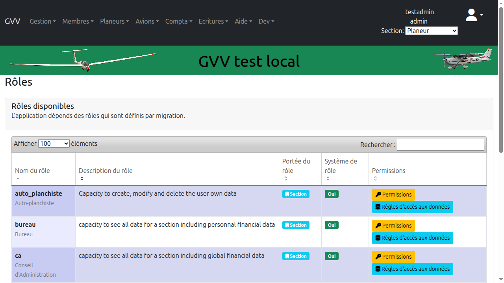

# Gestion des Autorisations

Ce guide détaille le système complet de gestion des autorisations dans GVV : rôles, permissions, règles d'accès aux données et audit. Ce système permet de contrôler finement qui peut accéder à quelles fonctionnalités et quelles données dans l'application.

## Table des matières

1. [Vue d'ensemble](#vue-ensemble)
2. [Tableau de bord des autorisations](#dashboard)
3. [Gestion des rôles](#roles)
4. [Gestion des utilisateurs et rôles](#users)
5. [Permissions des rôles](#permissions)
6. [Règles d'accès aux données](#data-access)
7. [Journal d'audit](#audit)
8. [Bonnes pratiques](#bonnes-pratiques)

## Vue d'ensemble {#vue-ensemble}

Le système d'autorisations de GVV repose sur plusieurs concepts clés :

- **Rôles** : Groupes de permissions (ex: "admin", "tresorier", "user")
- **Permissions** : Droits d'accès à des fonctionnalités spécifiques (ex: "gestion_membres", "saisie_vols")
- **Sections** : Contexte organisationnel (Planeur, ULM, Avion, Général)
- **Règles d'accès aux données** : Contrôle de l'accès aux données selon la section
- **Journal d'audit** : Traçabilité de toutes les modifications d'autorisations

### Accès

Pour accéder à la gestion des autorisations :
1. Connectez-vous avec un compte administrateur
2. Cliquez sur **"Autorisations"** dans le menu principal
3. Ou naviguez directement vers `/authorization`

> **Important** : Seuls les utilisateurs ayant le rôle "admin" peuvent gérer les autorisations.

## Tableau de bord des autorisations {#dashboard}

Le tableau de bord offre une vue d'ensemble du système d'autorisations et permet d'accéder rapidement aux différentes fonctionnalités.

### Fonctionnalités disponibles

Le tableau de bord propose quatre sections principales :

1. **Gestion des utilisateurs** : Assigner des rôles aux utilisateurs
2. **Gestion des rôles** : Créer, modifier et supprimer des rôles
3. **Permissions** : Définir les permissions associées à chaque rôle
4. **Règles d'accès** : Contrôler l'accès aux données par section
5. **Journal d'audit** : Consulter l'historique des modifications

## Gestion des rôles {#roles}

Les rôles permettent de regrouper des permissions et de les assigner facilement aux utilisateurs.

### Liste des rôles

La liste des rôles affiche tous les rôles disponibles dans le système.

### Rôles prédéfinis

GVV inclut plusieurs rôles standards :

- **admin** : Accès complet à toutes les fonctionnalités
- **ca** : Membres du conseil d'administration
- **tresorier** : Gestion de la comptabilité et facturation
- **bureau** : Membres du bureau
- **pilote** : Pilotes actifs
- **instructeur** : Instructeurs
- **user** : Utilisateur standard
- **visiteur** : Accès en lecture seule

### Créer un nouveau rôle

Pour créer un nouveau rôle :
1. Cliquez sur **"Nouveau rôle"** dans la liste des rôles
2. Remplissez le formulaire :
   - **Nom du rôle** : Identifiant unique (ex: "chef_pilote")
   - **Description** : Description claire du rôle
   - **Niveau** : Priorité du rôle (plus élevé = plus de priorité)
3. Cliquez sur **"Enregistrer"**

### Modifier un rôle

Pour modifier un rôle existant :
1. Cliquez sur le nom du rôle dans la liste
2. Modifiez les informations nécessaires
3. Cliquez sur **"Enregistrer"**

> **Attention** : La modification d'un rôle affecte tous les utilisateurs qui possèdent ce rôle.

### Supprimer un rôle

Pour supprimer un rôle :
1. Assurez-vous qu'aucun utilisateur ne possède ce rôle
2. Cliquez sur le bouton **"Supprimer"** dans les détails du rôle
3. Confirmez la suppression

> **Attention** : Les rôles système (admin, user) ne peuvent pas être supprimés.

## Gestion des utilisateurs et rôles {#users}

Cette section permet d'assigner des rôles aux utilisateurs et de gérer leurs autorisations par section.

### Vue de gestion des utilisateurs

Le tableau affiche :
- **Nom de l'utilisateur**
- **Login**
- **Rôles actuels** : Badges colorés indiquant les rôles et sections
- **Actions** : Bouton "Gérer les rôles"

### Assigner des rôles à un utilisateur

Pour assigner des rôles à un utilisateur :

1. Cliquez sur **"Gérer les rôles"** pour l'utilisateur concerné
2. Une fenêtre modale s'ouvre avec une matrice rôles/sections

3. La modale affiche :
   - **Colonne "Rôle"** : Liste de tous les rôles disponibles
   - **Colonne "Toutes sections"** : Assigner le rôle à toutes les sections
   - **Colonnes par section** : Assigner le rôle à une section spécifique (Planeur, ULM, Avion, Général)

4. Cochez les cases pour assigner les rôles :
   - Cochez dans "Toutes sections" pour un accès global
   - Cochez dans une section spécifique pour un accès limité
   - Vous pouvez assigner plusieurs rôles à un même utilisateur

5. Cliquez sur **"Enregistrer"** pour valider les modifications

### Comprendre les rôles par section

Le système permet d'assigner des rôles :

- **Globalement** (toutes sections) : L'utilisateur a accès à toutes les données
- **Par section** : L'utilisateur n'a accès qu'aux données de sa section

**Exemple** :
- Un trésorier peut avoir accès global (toutes sections) pour gérer toute la comptabilité
- Un instructeur planeur peut avoir accès uniquement à la section "Planeur"

### Badges colorés

Les badges affichés dans la colonne "Rôles actuels" utilisent les couleurs des sections :
- **Bleu ciel** : Section Planeur (#87CEEB)
- **Or** : Section ULM (#FFD700)
- **Vert** : Section Avion (#90EE90)
- **Rose** : Section Général (#FFB6C1)
- **Violet** : Toutes sections (#DDA0DD)

### Retirer des rôles

Pour retirer un rôle à un utilisateur :
1. Ouvrez la modale "Gérer les rôles"
2. Décochez les cases correspondant aux rôles à retirer
3. Cliquez sur **"Enregistrer"**

## Permissions des rôles {#permissions}

Les permissions définissent les fonctionnalités accessibles à chaque rôle.

### Vue des permissions

Cette page affiche :
- **Rôle sélectionné** : Utilisez le sélecteur pour choisir le rôle
- **Liste des permissions** : Toutes les permissions disponibles avec des cases à cocher
- **Permissions actives** : Cases cochées pour les permissions accordées

### Types de permissions

Les permissions sont organisées par domaine fonctionnel :

#### Gestion des membres
- `view_members` : Consulter la liste des membres
- `edit_members` : Créer et modifier des membres
- `delete_members` : Supprimer des membres

#### Saisie des vols
- `view_flights` : Consulter les vols
- `edit_flights` : Saisir et modifier des vols
- `delete_flights` : Supprimer des vols
- `validate_flights` : Valider des vols

#### Gestion des aéronefs
- `view_aircraft` : Consulter la liste des aéronefs
- `edit_aircraft` : Créer et modifier des aéronefs
- `delete_aircraft` : Supprimer des aéronefs

#### Facturation et comptabilité
- `view_invoices` : Consulter les factures
- `edit_invoices` : Créer et modifier des factures
- `view_accounting` : Consulter la comptabilité
- `edit_accounting` : Modifier la comptabilité
- `close_accounting` : Clôturer un exercice

#### Administration
- `manage_users` : Gérer les utilisateurs
- `manage_roles` : Gérer les rôles et permissions
- `view_audit` : Consulter le journal d'audit
- `manage_sections` : Gérer les sections

### Modifier les permissions d'un rôle

Pour modifier les permissions :
1. Sélectionnez le rôle dans le menu déroulant
2. Cochez ou décochez les permissions souhaitées
3. Cliquez sur **"Enregistrer"**

> **Astuce** : Utilisez le bouton "Tout sélectionner" ou "Tout désélectionner" pour gagner du temps.

### Permissions héritées

Certains rôles héritent automatiquement des permissions d'autres rôles :
- Le rôle **admin** possède toujours toutes les permissions
- Le rôle **ca** hérite généralement des permissions du rôle **bureau**

## Règles d'accès aux données {#data-access}

Les règles d'accès aux données permettent de contrôler précisément quelles données un utilisateur peut voir selon sa section.

### Principes des règles d'accès

1. **Par défaut** : Un utilisateur ne voit que les données de sa section
2. **Règles globales** : Certains rôles ont accès à toutes les sections (admin, ca)
3. **Règles personnalisées** : On peut définir des exceptions

### Types de règles

#### Règle par section
- L'utilisateur ne voit que les données de sa section
- Exemple : Un instructeur planeur ne voit que les vols planeur

#### Règle multi-sections
- L'utilisateur peut voir les données de plusieurs sections
- Exemple : Un instructeur ULM et Avion voit les deux sections

#### Règle globale
- L'utilisateur voit toutes les données de toutes les sections
- Exemple : Le trésorier voit toute la comptabilité

### Configurer une règle d'accès

Pour configurer une règle :
1. Sélectionnez le rôle concerné
2. Définissez la portée :
   - **Section propre uniquement** : Données de la section de l'utilisateur
   - **Sections spécifiques** : Choisir une ou plusieurs sections
   - **Toutes sections** : Accès global
3. Cliquez sur **"Enregistrer"**

### Exemples de règles courantes

| Rôle | Portée | Justification |
|------|--------|---------------|
| admin | Toutes sections | Administration complète |
| ca | Toutes sections | Vision d'ensemble |
| tresorier | Toutes sections | Comptabilité globale |
| instructeur | Section propre | Encadrement de sa section |
| pilote | Section propre | Activité de sa section |
| user | Section propre | Usage standard |

## Journal d'audit {#audit}

Le journal d'audit enregistre toutes les modifications apportées au système d'autorisations.

### Informations enregistrées

Pour chaque modification, le journal enregistre :
- **Date et heure** : Moment exact de la modification
- **Utilisateur** : Qui a effectué la modification
- **Action** : Type de modification (création, modification, suppression)
- **Cible** : Sur quoi porte la modification (utilisateur, rôle, permission)
- **Détails** : Informations complémentaires

### Types d'événements audités

#### Gestion des rôles
- Création d'un rôle
- Modification d'un rôle
- Suppression d'un rôle

#### Attribution de rôles
- Attribution d'un rôle à un utilisateur
- Retrait d'un rôle à un utilisateur
- Modification de la portée d'un rôle (section)

#### Permissions
- Ajout d'une permission à un rôle
- Retrait d'une permission d'un rôle

#### Règles d'accès
- Création d'une règle d'accès
- Modification d'une règle d'accès
- Suppression d'une règle d'accès

### Filtrer le journal d'audit

Le journal peut être filtré par :
- **Période** : Date de début et date de fin
- **Utilisateur** : Qui a effectué les modifications
- **Type d'action** : Création, modification, suppression
- **Cible** : Rôle, utilisateur, permission

### Exporter le journal

Pour exporter le journal d'audit :
1. Appliquez les filtres souhaités
2. Cliquez sur **"Exporter"**
3. Choisissez le format (CSV, Excel, PDF)

> **Conformité** : Le journal d'audit est essentiel pour la traçabilité et peut être requis pour des audits de sécurité.

## Bonnes pratiques {#bonnes-pratiques}

### Principe du moindre privilège

1. **Accordez uniquement les permissions nécessaires**
   - Ne donnez pas le rôle admin sauf nécessité absolue
   - Préférez des rôles spécifiques (tresorier, instructeur) au lieu de admin

2. **Utilisez les sections**
   - Limitez les accès aux données par section
   - Un instructeur planeur n'a pas besoin d'accéder aux données ULM

3. **Revoyez régulièrement les autorisations**
   - Vérifiez les rôles assignés chaque année
   - Retirez les accès des membres inactifs

### Organisation des rôles

1. **Créez des rôles par fonction**
   - chef_pilote, responsable_maintenance, etc.
   - Plus clair que d'empiler plusieurs rôles génériques

2. **Documentez vos rôles**
   - Utilisez le champ description
   - Expliquez qui doit avoir ce rôle et pourquoi

3. **Testez les nouveaux rôles**
   - Créez un compte de test
   - Vérifiez que les permissions sont correctes avant de généraliser

### Sécurité

1. **Protégez le rôle admin**
   - Limitez le nombre d'administrateurs (2-3 maximum)
   - Utilisez des mots de passe forts

2. **Surveillez le journal d'audit**
   - Consultez-le régulièrement
   - Identifiez les modifications inhabituelles

3. **Formez les administrateurs**
   - Assurez-vous qu'ils comprennent le système
   - Documentez vos procédures internes

### Gestion du changement

1. **Planifiez les modifications**
   - Ne modifiez pas les autorisations pendant les heures de vol
   - Prévenez les utilisateurs affectés

2. **Testez avant de déployer**
   - Utilisez un compte de test
   - Vérifiez les effets sur les fonctionnalités

3. **Documentez les changements**
   - Gardez une trace écrite des modifications importantes
   - Expliquez le pourquoi des changements

### Cas d'usage courants

#### Nouvel instructeur

1. Créer le compte utilisateur
2. Assigner le rôle "instructeur" pour sa section (Planeur, ULM ou Avion)
3. Vérifier les permissions (saisie vols, validation)
4. Tester avec le compte

#### Nouveau trésorier

1. Créer le compte utilisateur
2. Assigner le rôle "tresorier" pour toutes sections
3. Vérifier l'accès à la comptabilité et facturation
4. Former à l'utilisation

#### Membre du CA

1. Assigner le rôle "ca"
2. Vérifier l'accès en lecture à toutes les sections
3. Ne pas donner le rôle admin sauf si nécessaire

#### Pilote devenant inactif

1. Retirer tous les rôles actifs
2. Laisser le rôle "user" ou "visiteur" pour consultation
3. Ou désactiver complètement le compte

---

## Support

Pour toute question sur la gestion des autorisations :
- Consultez la FAQ sur le site GVV
- Contactez votre administrateur système
- Ouvrez un ticket de support si nécessaire

---

**Version du document** : 1.0
**Dernière mise à jour** : Octobre 2025
**GVV - Gestion Vol à Voile**
