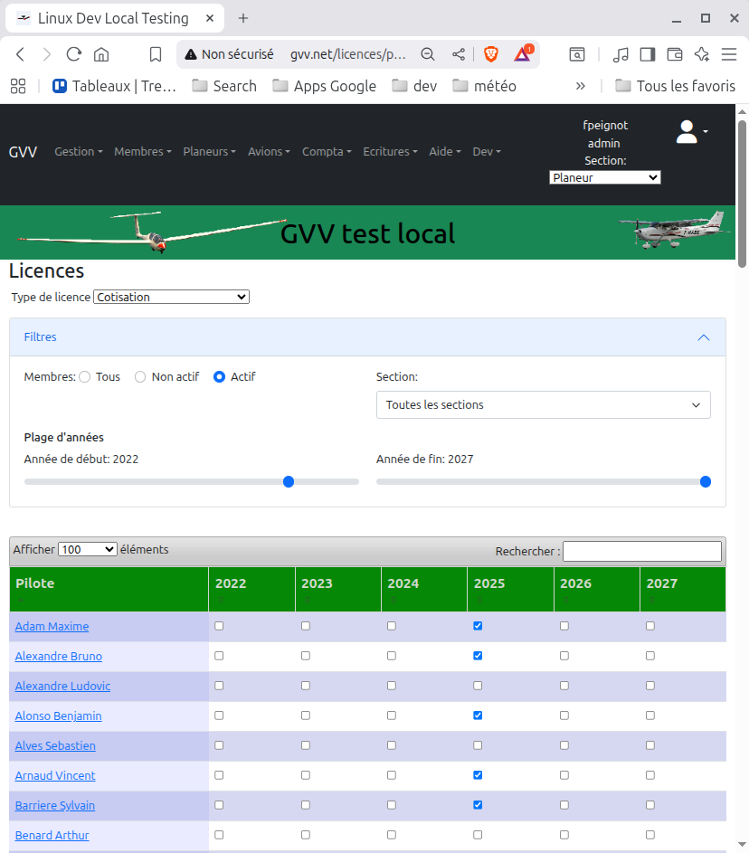
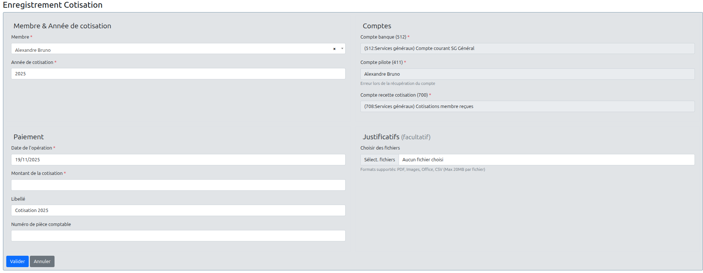

# 10. Gestion des Cotisations

## 📋 Vue d'ensemble

La gestion des cotisations dans GVV se fait à deux niveaux distincts :

1. **Suivi des adhésions** - Via la page `Licences/Cotisations par année` pour suivre qui a payé sa cotisation
2. **Comptabilité** - Via le formulaire `Saisie de cotisation` pour enregistrer le paiement dans la comptabilité et mettre à jour la liste précédente.

---

## 📊 Suivi des Cotisations par Année

### Accès

**Menu** : `Licences > Cotisations par année`  
**URL** : `/licences/per_year`  
**Rôle requis** : Gestionnaire de licences ou Trésorier

### Description

Cette page affiche la liste de tous les membres actifs avec une case à cocher pour chaque année. Elle permet de suivre visuellement qui a payé sa cotisation.

### Utilisation

#### Marquer une cotisation comme payée

1. Accédez à la page `Licences > Cotisations par année`
2. Sélectionnez l'année dans le sélecteur en haut de page
3. Localisez le membre dans la liste
4. **Cochez la case** correspondant à l'année pour ce membre
5. La modification est enregistrée automatiquement

#### Retirer une cotisation

1. Localisez le membre ayant une case cochée
2. **Décochez la case** 
3. La modification est enregistrée automatiquement

### Caractéristiques

- ✅ **Simplicité** - Un simple clic pour marquer/démarquer
- ✅ **Vue d'ensemble** - Tous les membres sur une seule page
- ✅ **Filtrage par année** - Affichage par exercice
- ⚠️ **Pas d'écritures comptables** - Cette fonction ne crée aucune opération comptable
- ⚠️ **Liste uniquement** - C'est un outil de suivi, pas de facturation

---

## 💰 Saisie Comptable de Cotisation

### Accès

**Menu** : `Comptabilité > Saisie de cotisation`  
**URL** : `/compta/saisie_cotisation`  
**Rôle requis** : Trésorier

### Description

Ce formulaire permet d'enregistrer une cotisation avec toutes les écritures comptables associées. Il réalise **trois opérations simultanées** :

### Les Trois Opérations Réalisées

Lorsque vous validez le formulaire de saisie de cotisation, GVV effectue automatiquement :

#### 1. 💳 Enregistrement du paiement (Banque → Compte pilote)
**Écriture de trésorerie**
- **Débit** : Compte bancaire (512)
- **Crédit** : Compte pilote (411)
- **Montant** : Le montant de la cotisation
- **Date** : Date du paiement
- **Libellé** : "Cotisation YYYY" (année ajustable)

Cette opération enregistre l'encaissement du paiement du membre.

#### 2. 📝 Facturation de la cotisation (Pilote → Recette)
**Écriture de facturation**
- **Débit** : Compte pilote (411)
- **Crédit** : Compte de recette (700)
- **Montant** : Le montant de la cotisation
- **Date** : Date de l'opération
- **Libellé** : "Cotisation YYYY"

Cette opération enregistre la recette dans les produits du club.

#### 3. ✅ Enregistrement de la cotisation
**Création de la licence/cotisation**
- **Membre** : Le pilote sélectionné
- **Année** : L'année de cotisation
- **Statut** : Marquée comme payée

Cette opération permet de cocher automatiquement la case dans la liste des cotisations par année.

### Équivalence des Opérations

> 📌 **Note importante** : Utiliser le formulaire de saisie de cotisation est **strictement équivalent** à effectuer ces trois opérations manuellement :
> 1. Saisir une écriture bancaire (paiement)
> 2. Saisir une écriture de facturation (recette)
> 3. Cocher la case dans la liste des cotisations par année
>
> Le formulaire simplifie et sécurise le processus en garantissant la cohérence des trois opérations.

---

## 📝 Utilisation du Formulaire

### Champs du Formulaire

#### Section "Membre & Cotisation"

**Pilote** (obligatoire)
- Sélecteur avec recherche (Select2)
- Liste de tous les membres actifs
- 💡 **Automatisme** : Quand vous sélectionnez un pilote, son compte 411 est automatiquement recherché et présélectionné

**Année de cotisation** (obligatoire)
- Année pour laquelle la cotisation est payée
- Par défaut : année en cours
- Format : YYYY (ex: 2024)

#### Section "Comptes"

**Compte banque** (obligatoire)
- Compte bancaire (512) à débiter
- Si un seul compte 512 existe : **présélectionné automatiquement** et affiché en lecture seule
- Sinon : sélecteur de comptes bancaires

**Compte pilote** (obligatoire)
- Compte client (411) du membre
- 🤖 **Sélection automatique** : Dès que vous sélectionnez un pilote, GVV recherche automatiquement son compte 411
- Si trouvé : affiché en lecture seule avec le message "Compte automatiquement sélectionné" ✅
- Si non trouvé : message d'erreur et possibilité de sélection manuelle

**Compte recette** (obligatoire)
- Compte de produit (700) à créditer
- 🔧 **Configuration automatique** : Si le paramètre de configuration `comptes.cotisations` est défini, ce compte est **automatiquement présélectionné** et affiché en lecture seule
- Sinon : sélecteur de comptes de recette (700)

#### Section "Paiement"

**Date d'opération** (obligatoire)
- Date du paiement de la cotisation
- Par défaut : date du jour
- Format : jj/mm/aaaa

**Montant** (obligatoire)
- Montant de la cotisation en euros
- Format : nombres décimaux (ex: 150.00)
- Minimum : 0.01 €

**Description** (optionnel)
- Libellé de l'opération
- Par défaut : "Cotisation YYYY" (se met à jour automatiquement quand vous changez l'année)
- Personnalisable

**Numéro de chèque** (optionnel)
- Si le paiement est par chèque
- Utile pour le rapprochement bancaire

#### Section "Justificatifs" (optionnels)

**Fichiers joints**
- Possibilité d'attacher des documents (bulletins, reçus, etc.)
- Formats acceptés : PDF, Images (JPG, PNG), Documents Office, CSV, TXT
- Taille maximale : 20 MB par fichier
- Multi-fichiers : vous pouvez joindre plusieurs documents

---

## 🤖 Automatismes et Configuration

### Configuration du Compte de Recette

Le trésorier peut configurer un compte de recette par défaut pour les cotisations via le paramètre de configuration `comptes.cotisations`.

#### Configuration

1. Accédez à `Configuration > Paramètres`
2. Recherchez ou créez le paramètre `comptes.cotisations`
3. Entrez l'identifiant du compte 700 à utiliser (ex: `42` si votre compte "Cotisations" a l'ID 42)
4. Enregistrez

#### Effet

Une fois configuré :
- ✅ Le compte de recette est **automatiquement présélectionné**
- 🔒 Il est affiché en **lecture seule** (pas de sélecteur)
- 🎯 Garantit la **cohérence comptable** - toutes les cotisations vont au même compte
- ⚡ **Gain de temps** - un champ de moins à remplir

> 💡 **Recommandation** : Configurez ce paramètre pour simplifier la saisie et éviter les erreurs de compte.

---

## ✅ Procédure de Saisie Complète

### Scénario Type : Enregistrer une Cotisation

**Contexte** : Jean Dupont vient de payer sa cotisation 2024 de 150 € par chèque n° 1234567.

#### Étapes

1. **Accéder au formulaire**
   - Menu : `Comptabilité > Saisie de cotisation`

2. **Sélectionner le membre**
   - Champ "Pilote" : chercher et sélectionner "Jean Dupont"
   - ✅ Son compte 411 s'affiche automatiquement

3. **Vérifier l'année**
   - Champ "Année de cotisation" : 2024 (déjà rempli)

4. **Vérifier les comptes**
   - Compte banque : vérifié (auto-sélectionné si un seul compte)
   - Compte pilote : ✅ Auto-sélectionné pour Jean Dupont
   - Compte recette : vérifié (auto-sélectionné si configuré)

5. **Saisir le paiement**
   - Date : aujourd'hui (déjà remplie)
   - Montant : `150.00`
   - Description : "Cotisation 2024" (déjà rempli)
   - Numéro de chèque : `1234567`

6. **Joindre des documents** (optionnel)
   - Cliquer sur "Choisir des fichiers"
   - Sélectionner le scan du chèque ou le bulletin d'adhésion
   - Les fichiers s'affichent dans la liste

7. **Valider**
   - Cliquer sur le bouton **"Valider"**
   - Message de confirmation : "Cotisation enregistrée avec succès"

8. **Résultat**
   - ✅ 2 écritures comptables créées (banque→pilote, pilote→recette)
   - ✅ Cotisation 2024 enregistrée pour Jean Dupont
   - ✅ Case cochée dans `Licences > Cotisations par année`
   - ✅ Documents attachés aux écritures
   - ✅ Comptes du pilote mis à jour

---

## 🚫 Contraintes et Validations

### Une Seule Cotisation par An

GVV **n'autorise qu'une seule cotisation par membre et par année**.

**Comportement** :
- ❌ Si vous essayez de saisir une 2ème cotisation pour la même année et le même membre
- 🚫 Le système affiche un message d'erreur : "Une cotisation existe déjà pour ce membre pour l'année YYYY"
- 🔄 Vous devez :
  - Soit choisir une autre année
  - Soit supprimer l'ancienne cotisation avant d'en créer une nouvelle
  - Soit modifier le montant de la cotisation existante via les écritures comptables

### Validations du Formulaire

Le formulaire vérifie :

**Champs obligatoires** :
- ✅ Pilote sélectionné
- ✅ Année de cotisation renseignée
- ✅ Compte banque sélectionné
- ✅ Compte pilote sélectionné
- ✅ Compte recette sélectionné
- ✅ Date d'opération saisie
- ✅ Montant > 0

**Cohérence** :
- ✅ Le compte pilote correspond bien au pilote sélectionné
- ✅ La date est au format valide
- ✅ Le montant est un nombre positif
- ✅ Pas de cotisation existante pour cette année

---

## 📊 Suivi et Vérifications

### Vérifier qu'une Cotisation est Enregistrée

**Méthode 1 : Liste des cotisations**
1. `Licences > Cotisations par année`
2. Sélectionner l'année
3. Vérifier que la case est cochée pour le membre

**Méthode 2 : Écritures comptables**
1. `Comptabilité > Journal`
2. Filtrer par date et/ou par pilote
3. Vérifier les deux écritures (banque et facturation)

**Méthode 3 : Compte du pilote**
1. `Comptabilité > Comptes clients`
2. Rechercher le compte 411 du pilote
3. Consulter l'historique des opérations

### Corriger une Erreur

**Si vous avez saisi une mauvaise cotisation** :

#### Option 1 : Supprimer les écritures
1. `Comptabilité > Journal`
2. Localiser les deux écritures de cotisation
3. Supprimer chaque écriture (si non gelée)
4. Décocher manuellement dans `Licences > Cotisations par année`
5. Ressaisir correctement

#### Option 2 : Modifier les écritures existantes
1. `Comptabilité > Journal`
2. Éditer les écritures concernées
3. Corriger les montants/dates/comptes
4. Enregistrer les modifications

> ⚠️ **Attention** : Les écritures gelées ne peuvent pas être modifiées ou supprimées. Contactez votre administrateur.

---

## 📚 Références Connexes

- **[6. Facturation](06_facturation.md)** - Système de facturation général
- **[7. Comptabilité](07_comptabilite.md)** - Gestion comptable complète
- **[2. Gestion des Membres](02_gestion_membres.md)** - Création et gestion des membres

---

## 🎯 Résumé

### Points Clés

- 📋 **Deux outils distincts** : Liste de suivi (licences) et saisie comptable (compta)
- 💰 **Triple opération** : Le formulaire crée 3 enregistrements simultanés
- 🤖 **Automatismes intelligents** : Sélection auto du compte pilote et recette
- 🔒 **Une cotisation/an** : Contrainte unique par membre et année
- 📎 **Justificatifs** : Possibilité d'attacher des documents

### Workflow Recommandé

1. **Configuration initiale** : Définir `comptes.cotisations`
2. **Encaissement** : Recevoir le paiement du membre
3. **Saisie** : Utiliser le formulaire de saisie de cotisation
4. **Vérification** : Contrôler dans la liste et le journal
5. **Suivi** : Consulter régulièrement la liste des cotisations

---

**📅 Dernière mise à jour :** Novembre 2024  
**📝 Version GVV :** 0.5.3+  
**✅ Statut :** Documentation complète

[⬅️ Retour au sommaire](README.md) | [➡️ Suivant : OpenFlyers Integration](../openflyers_user.md)
