# Gestion des Formations

Le module de formation permet de gérer la progression des élèves selon des programmes pédagogiques définis. Il s'adresse à quatre profils d'utilisateurs distincts.

## Table des matières

1. [Vue d'ensemble](#vue-densemble)
2. [Responsable Pédagogique](#responsable-pédagogique)
3. [Élèves](#élèves)
4. [Instructeurs](#instructeurs)
5. [Présidents](#présidents)

## Vue d'ensemble

Le tableau de bord Formation donne accès aux différentes fonctions selon vos droits.

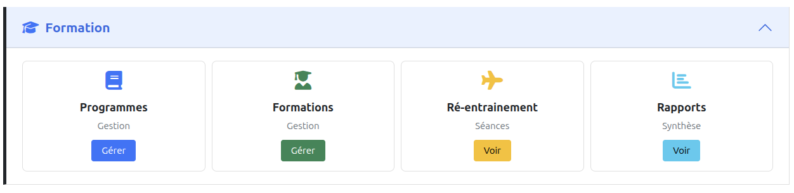

- **Programmes** : Définition des cursus de formation (leçons, sujets)
- **Formations** : Suivi des élèves inscrits à un programme
- **Ré-entraînement** : Séances pour pilotes brevetés
- **Rapports** : Synthèse annuelle de l'activité formation

---

## Responsable Pédagogique

Le responsable pédagogique (RP) gère les programmes et inscrit les élèves.

### Gestion des programmes

Les programmes définissent le contenu pédagogique : leçons et sujets à évaluer.

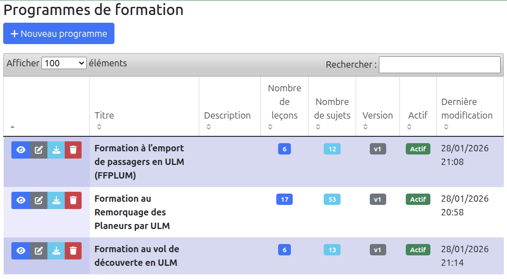

Chaque programme contient des leçons organisées, elles-mêmes composées de sujets. Le RP peut créer, modifier, activer/désactiver les programmes.

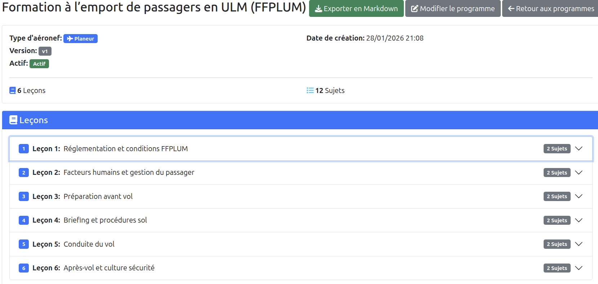

Les programmes peuvent être exportés en Markdown pour archivage ou partage.

### Ouverture d'une formation

Pour inscrire un élève à une formation :

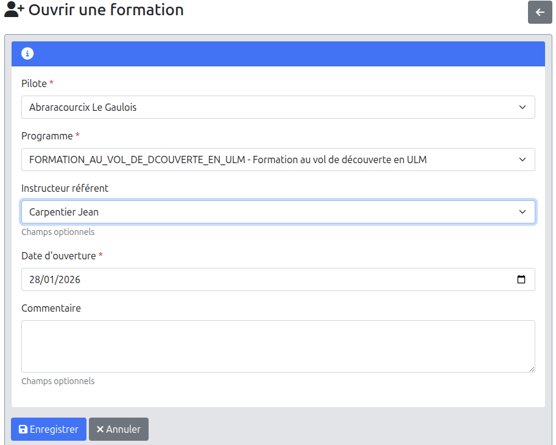

1. Sélectionner le **pilote** (élève)
2. Choisir le **programme** de formation
3. Désigner un **instructeur référent** (optionnel)
4. Indiquer la **date d'ouverture**

### Suivi des formations

La liste des formations permet de filtrer par pilote, programme, statut ou instructeur.

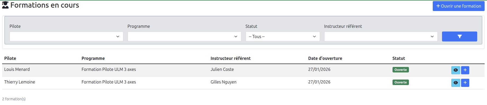

---

## Élèves

Les élèves consultent leur progression via le menu **"Mes formations"**.

### Tableau de bord élève

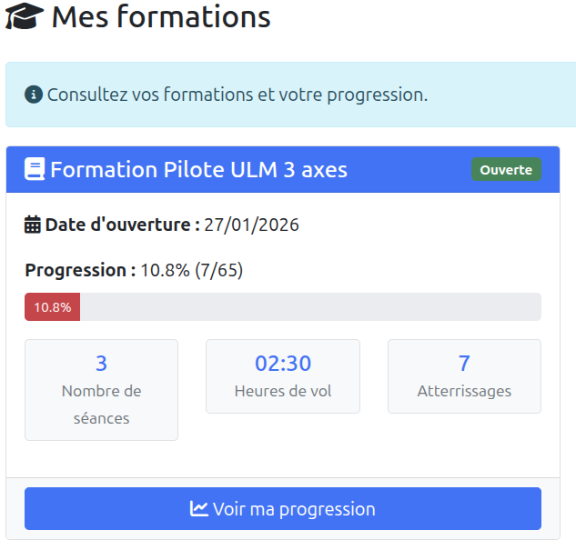

La carte affiche :
- Le programme suivi et son statut
- La progression globale (pourcentage de sujets acquis)
- Les statistiques : séances, heures de vol, atterrissages

### Fiche de progression

En cliquant sur **"Voir ma progression"**, l'élève accède au détail de sa formation.

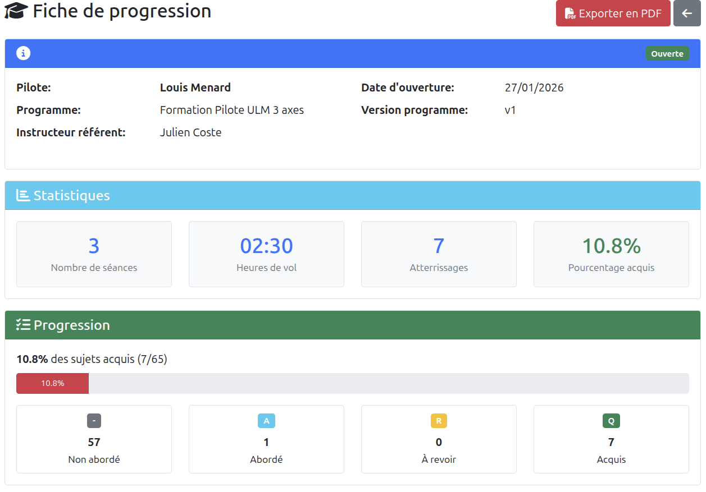

La fiche présente :
- **Statistiques** : nombre de séances, temps de vol, atterrissages
- **Progression** : répartition des sujets par statut (Non abordé, Abordé, À revoir, Acquis)
- **Détail par leçon** : pourcentage d'acquisition par leçon

L'élève peut exporter sa fiche en PDF.

---

## Instructeurs

Les instructeurs créent des séances de formation et évaluent la progression des élèves.

### Créer une séance

Depuis la fiche de progression d'un élève, l'instructeur crée une nouvelle séance.

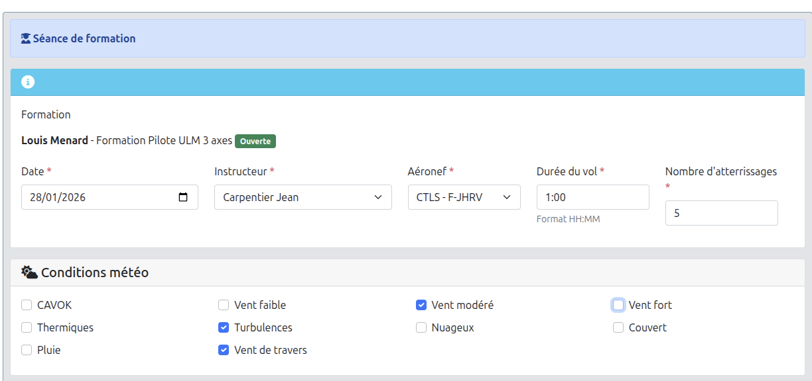

La séance comprend :
- **Informations du vol** : date, instructeur, aéronef, durée, nombre d'atterrissages
- **Conditions météo** : CAVOK, vent, turbulences, etc.

### Évaluer les sujets

Pour chaque séance, l'instructeur évalue les sujets travaillés.

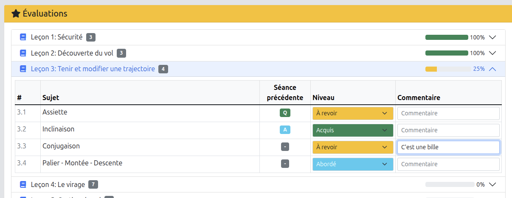

Les niveaux d'évaluation sont :
- **Non abordé** (gris) : sujet pas encore travaillé
- **Abordé** (bleu) : premier contact avec le sujet
- **À revoir** (orange) : nécessite plus de travail
- **Acquis** (vert) : maîtrisé par l'élève

L'instructeur peut ajouter des commentaires pour chaque sujet.

### Séances de ré-entraînement

Pour les pilotes brevetés, l'instructeur peut créer des séances de ré-entraînement.

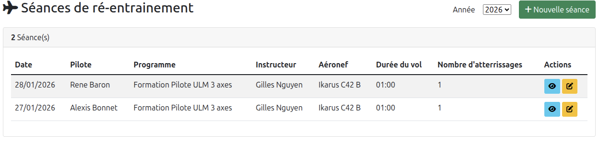

Ces séances ne sont pas liées à un programme de progression mais permettent de maintenir les compétences.

---

## Présidents

Les présidents accèdent aux rapports de synthèse pour suivre l'activité formation du club.

### Rapport annuel

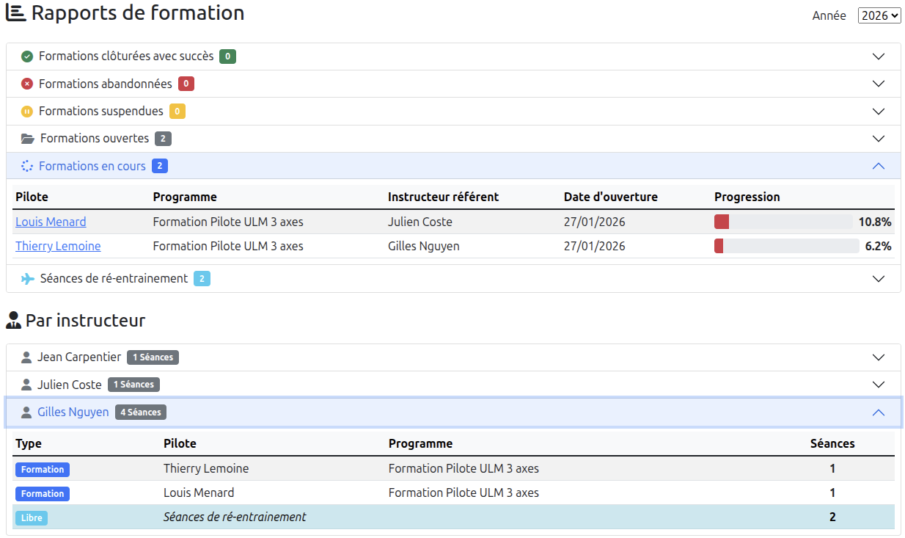

Le rapport présente :

**Par statut de formation :**
- Formations clôturées avec succès
- Formations abandonnées
- Formations suspendues
- Formations ouvertes
- Formations en cours (avec détail : pilote, programme, instructeur, progression)

**Par instructeur :**
- Nombre de séances par instructeur
- Répartition entre formations et ré-entraînement

Le filtre par année permet de consulter l'historique.

---

**Voir aussi :**
- [Gestion des Membres](02_gestion_membres.md) - Attribution des rôles
- [Rapports et Statistiques](08_rapports.md) - Autres analyses d'activité
