# 12. Paiements en Ligne (HelloAsso)

## Vue d'ensemble

GVV intègre **HelloAsso** comme plateforme de paiement en ligne pour les associations françaises. Cette intégration permet :

- **Approvisionner son compte** pilote par carte bancaire
- **Payer ses consommations de bar** par débit du solde de compte
- **Renouveler sa cotisation** par débit du solde de compte
- **Permettre aux extérieurs** de payer leurs consommations de bar par CB via QR Code

> **Prérequis** : Disposer d'un compte HelloAsso Pro pour votre association et avoir configuré l'intégration (voir section 1 ci-dessous).

---

## 1. Configuration (Administrateur)

### Accès

**Menu** : `Administration > Paiements en ligne`  
**URL** : `/paiements_en_ligne/admin_config`  
**Rôle requis** : Administrateur

### Obtenir les clés API HelloAsso

Connectez-vous à votre espace HelloAsso Pro, puis accédez aux paramètres API de votre organisation.

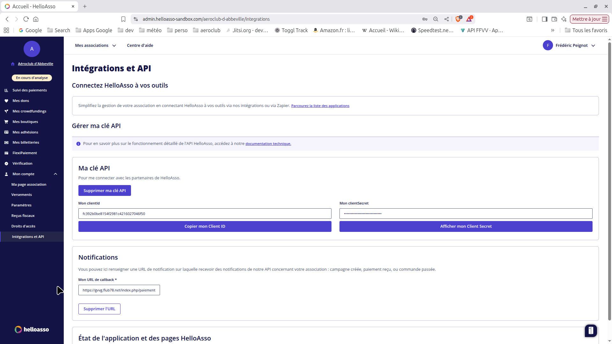

Copiez le **Client ID** et le **Client Secret** depuis HelloAsso.

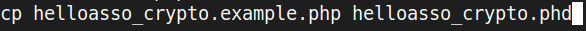

### Paramétrage dans GVV

Renseignez le formulaire de configuration :

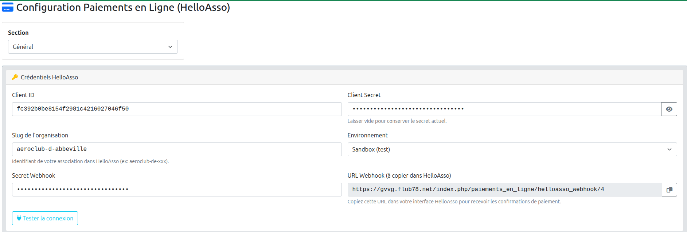

| Champ | Description |
|-------|-------------|
| **Client ID** | Identifiant de votre application HelloAsso |
| **Client Secret** | Clé secrète (stockée chiffrée, jamais visible après saisie) |
| **Montant minimum** | Montant minimal d'un provisionnement (ex. 10 €) |
| **Montant maximum** | Plafond d'un provisionnement (ex. 500 €) |
| **Activé** | Active ou désactive les paiements en ligne pour la section |
| **Compte bar** | Compte comptable associé aux consommations de bar |

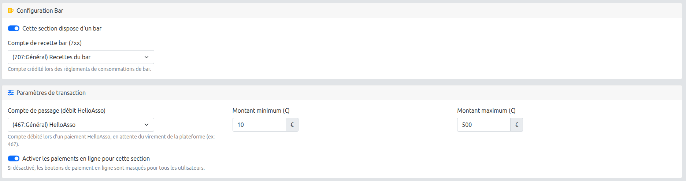

### Tester la connexion

Après avoir sauvegardé, un bouton **Tester la connexion** permet de vérifier que les identifiants sont valides et que GVV peut bien communiquer avec HelloAsso.

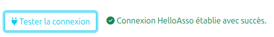

> **Note de sécurité** : La clé `Client Secret` est stockée chiffrée en base de données. Elle n'est jamais réaffichée après la première saisie. Pour la modifier, saisissez simplement la nouvelle valeur dans le champ.

> **Prérequis serveur** : La configuration nécessite qu'une clé de chiffrement soit définie sur le serveur. Si vous obtenez le message *"Erreur de configuration, clé d'encription non définie"*, contactez votre administrateur système pour créer le fichier `application/config/helloasso_crypto.php`.

---

## 2. Alimentation du Compte Pilote par Carte Bancaire

Les pilotes peuvent approvisionner leur compte GVV par carte bancaire via HelloAsso, depuis n'importe quel navigateur ou mobile.

### Accès

**Tableau de bord** : Carte *"Approvisionner mon compte"*  
**URL** : `/paiements_en_ligne/demande`  
**Rôle requis** : Pilote connecté

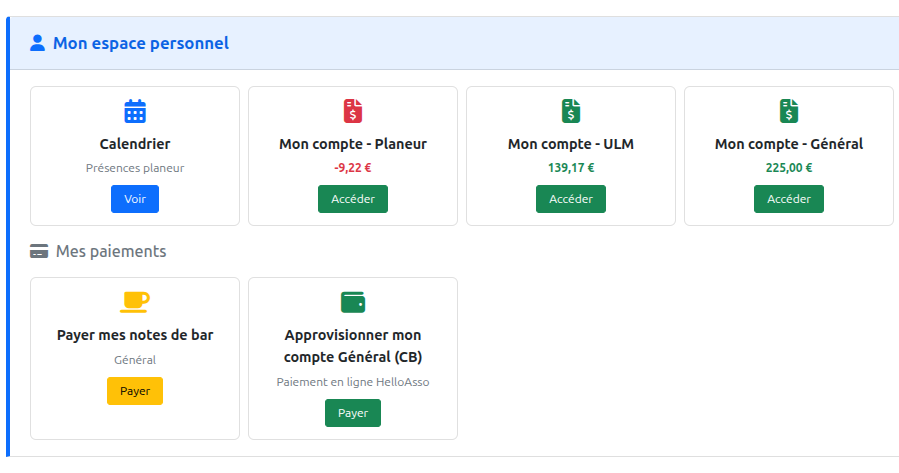

### Étapes

**1. Saisir le montant**

Sur la page de demande, saisissez le montant souhaité dans la plage autorisée (montant minimum et maximum affichés).

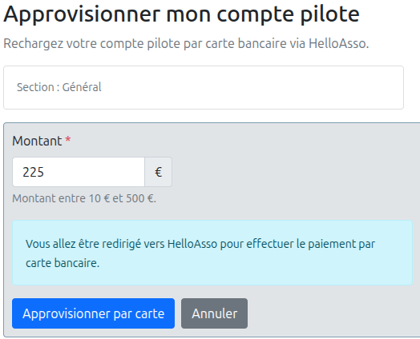

**2. Paiement sur HelloAsso**

Après validation, vous êtes redirigé vers la page HelloAsso pour saisir vos coordonnées bancaires.

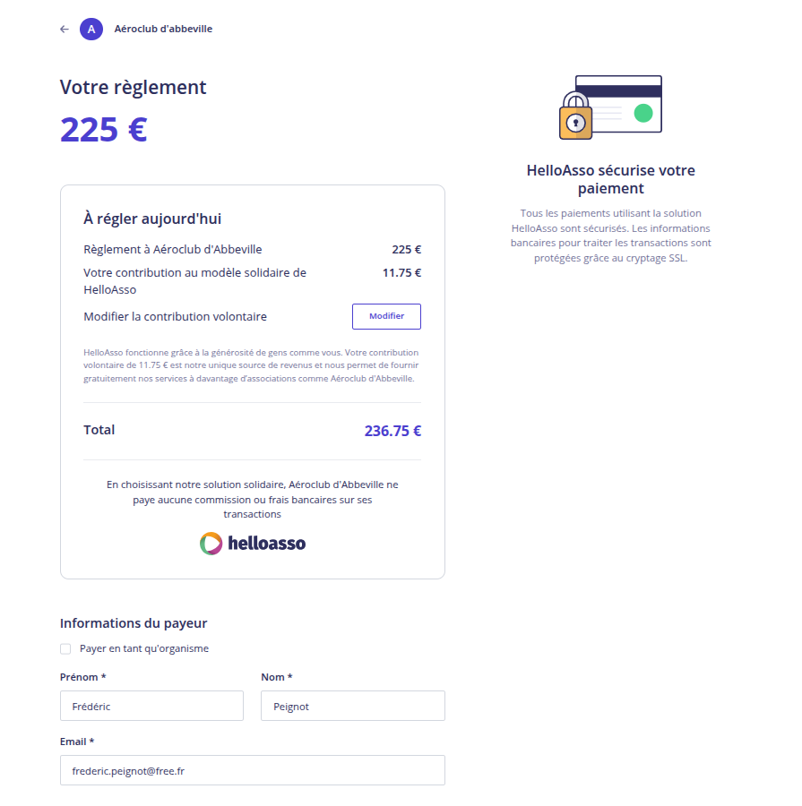

HelloAsso propose une contribution volontaire à l'association HelloAsso. Vous pouvez l'accepter ou la réduire à 0.

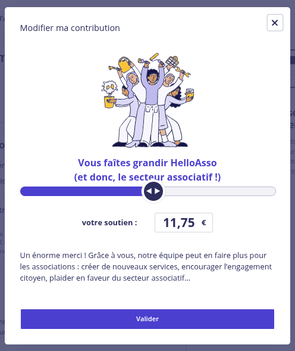

**3. Validation du paiement**

Après le paiement, HelloAsso notifie GVV automatiquement par webhook. GVV crédite le compte 411 du pilote et envoie un email de confirmation.

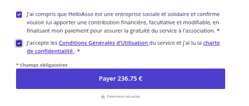

**4. Vérification dans Mon Compte**

Le solde mis à jour est visible immédiatement dans la page *Mon Compte*.

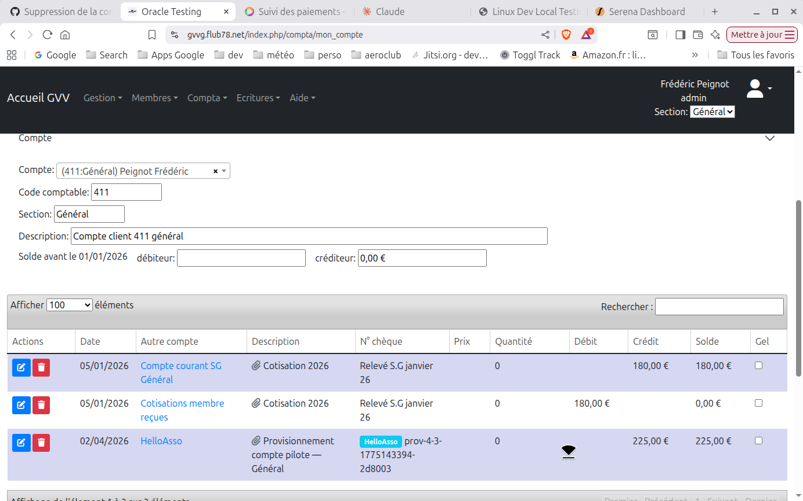

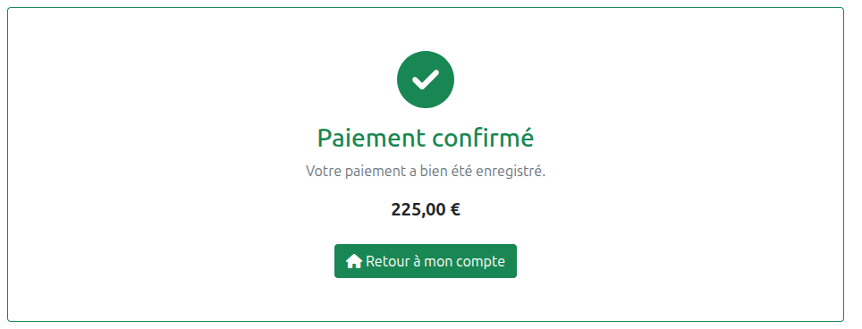

> **Délai** : Le webhook HelloAsso est généralement reçu dans les secondes qui suivent le paiement. En cas de délai, le solde sera mis à jour dès réception.

---

## 3. Paiement des Consommations de Bar par Débit de Compte

Les pilotes membres peuvent régler leurs consommations de bar en débitant directement leur compte pilote (compte 411), sans passer par HelloAsso.

### Accès

**Tableau de bord** : Carte *"Payer mes notes de bar"*  
**URL** : `/paiements_en_ligne/bar_debit_solde`  
**Rôle requis** : Pilote connecté

### Conditions

- Le pilote doit avoir un **solde suffisant** sur son compte 411
- La section doit avoir un **compte bar** configuré (voir configuration)

### Étapes

**1. Consulter les consommations**

La page affiche le solde disponible et la liste des consommations à régler.

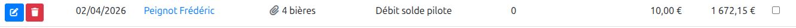

**2. Confirmer le paiement**

Cliquez sur le bouton de validation pour débiter le montant du compte pilote.

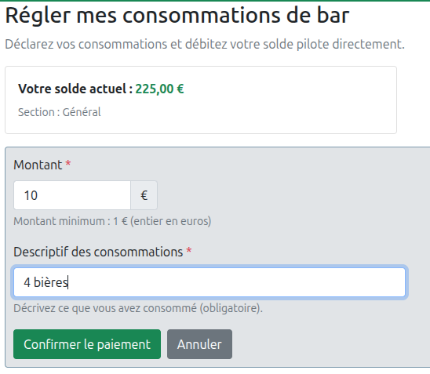

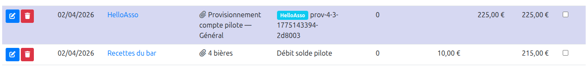

**3. Confirmation**

GVV crée l'écriture comptable (débit 411 → crédit compte bar) et affiche la confirmation.

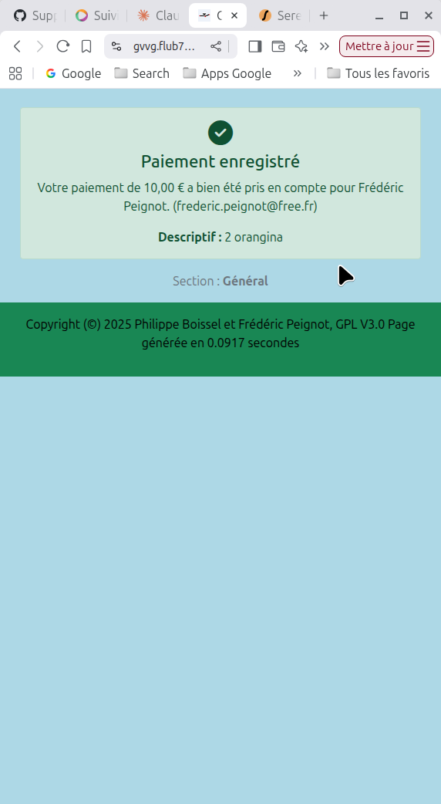

**En cas de solde insuffisant**, GVV affiche un message d'erreur explicite et invite le pilote à approvisionner son compte.

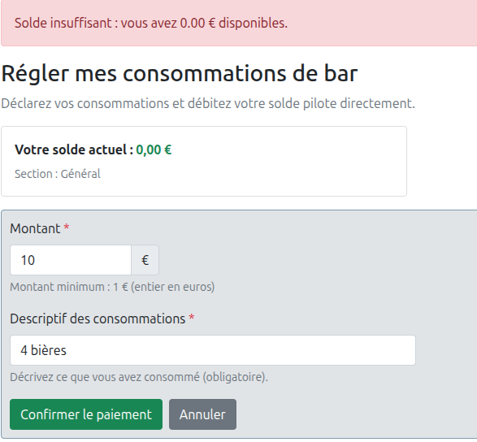

---

## 4. Listing des Paiements HelloAsso (Trésoriers)

Les trésoriers disposent d'une vue récapitulative de toutes les transactions HelloAsso reçues.

### Accès

**Menu** : `Comptabilité > Paiements HelloAsso`  
**URL** : `/paiements_en_ligne/listing`  
**Rôle requis** : Trésorier

### Contenu du listing

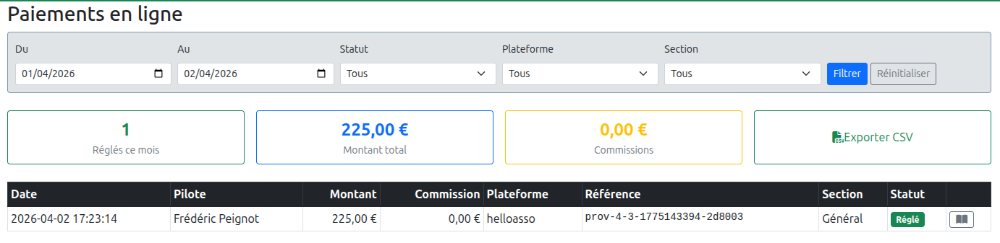

Le tableau présente pour chaque transaction :

| Colonne | Description |
|---------|-------------|
| **Date** | Date et heure du paiement |
| **Pilote** | Login du membre concerné |
| **Montant** | Montant encaissé (net HelloAsso) |
| **Commission** | Frais HelloAsso |
| **Type** | Provisionnement, vol découverte, etc. |
| **Statut** | `completed`, `pending`, `failed` |
| **Écriture** | Lien vers l'écriture comptable associée |

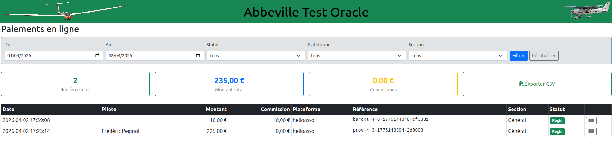

> **Comptabilité** : Chaque paiement `completed` génère automatiquement une écriture comptable. Les écritures liées à un paiement HelloAsso **ne peuvent pas être supprimées** individuellement — elles sont protégées par intégrité référentielle.

---

## 5. Génération d'une Affiche QR Code

GVV permet de générer une affiche avec un QR Code permettant aux extérieurs (non-membres) de payer leurs consommations de bar par carte bancaire via HelloAsso.

### Accès

**Menu** : `Administration > QR Code bar`  
**URL** : `/paiements_en_ligne/qr_provisionnement`  
**Rôle requis** : Administrateur

### Générer l'affiche

Accédez à la page de génération et cliquez sur **Générer le QR Code**.

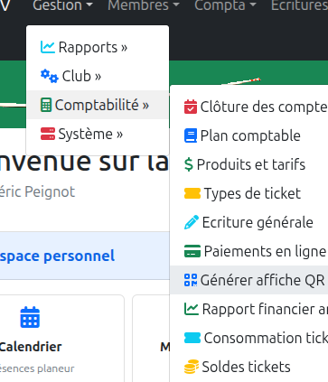

GVV génère un QR Code pointant vers la page de paiement bar extérieur de votre section.

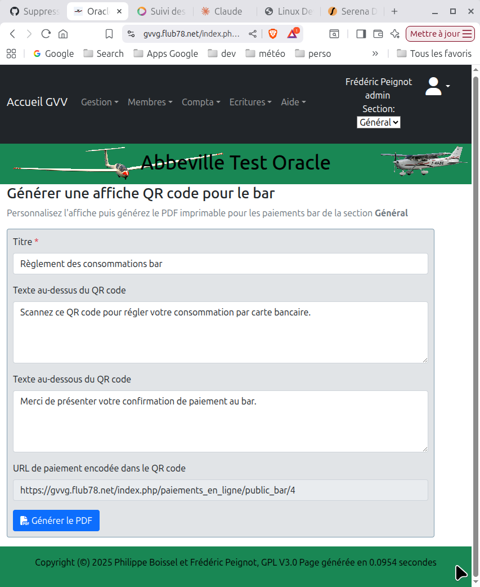

### Imprimer et afficher

Le QR Code peut être imprimé directement depuis le navigateur ou exporté en PDF. Affichez-le au bar ou au secrétariat.

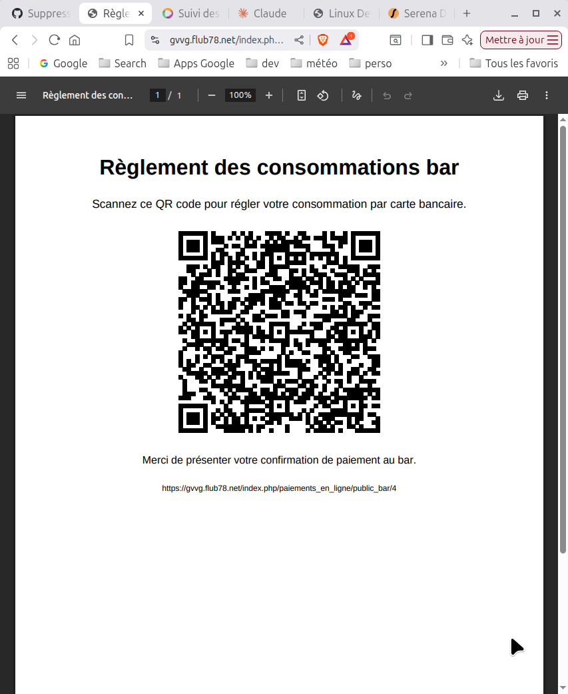

Le lien associé au QR Code est également affiché pour diffusion par email ou message.

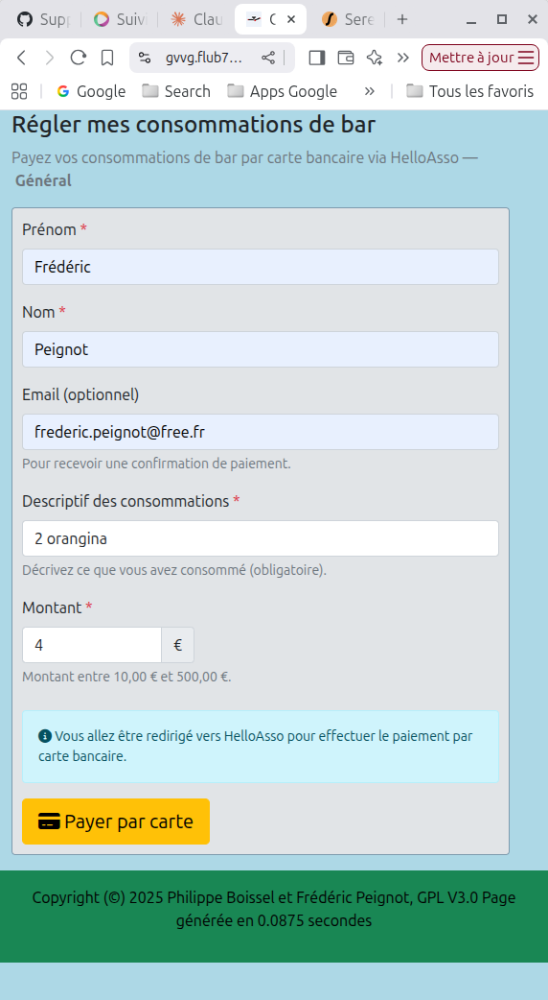

---

## 6. Paiement de Bar en CB pour les Extérieurs

Les visiteurs non-membres peuvent payer leurs consommations de bar par carte bancaire sans avoir de compte GVV, en scannant simplement le QR Code affiché au bar.

### Parcours extérieur

**URL publique** : `/paiements_en_ligne/bar_externe`  
**Accès** : Public (sans connexion requise)

**1. Scanner le QR Code**

L'extérieur scanne le QR Code affiché au bar avec son smartphone.

**2. Page de paiement**

La page de paiement extérieur s'affiche, indiquant la section et les modalités.

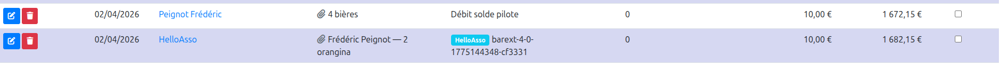

**3. Paiement par CB via HelloAsso**

L'extérieur est redirigé vers HelloAsso pour effectuer son paiement par carte.

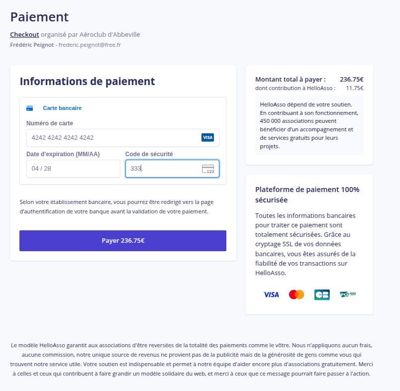

**4. Traitement comptable**

Après confirmation de HelloAsso, GVV enregistre automatiquement le paiement et crédite le compte bar de la section.

> **Aucun compte GVV requis** pour les extérieurs. Le paiement est entièrement géré par HelloAsso.

---

## Dépannage

### "Erreur de configuration, clé d'encription non définie"
La clé de chiffrement serveur n'est pas configurée. Créer le fichier `application/config/helloasso_crypto.php` ou définir la variable d'environnement `GVV_HELLOASSO_CRYPTO_KEY` sur le serveur.

### "Paiements en ligne désactivés"
L'intégration HelloAsso n'est pas activée pour votre section. Un administrateur doit cocher **Activé** dans la configuration.

### Le solde n'est pas mis à jour après un paiement
Le webhook HelloAsso peut prendre quelques secondes. Rafraîchissez la page. Si le problème persiste après 5 minutes, vérifiez dans le listing trésorier que la transaction apparaît bien en statut `completed`.

### "Suppression impossible : cette écriture est liée à un paiement HelloAsso"
Les écritures générées par HelloAsso sont protégées. Pour les supprimer, contactez le trésorier qui devra d'abord supprimer l'entrée dans la table des paiements HelloAsso.

### Solde insuffisant pour payer le bar
Le pilote doit d'abord approvisionner son compte (section 2) avant de pouvoir régler ses consommations par débit de compte.
