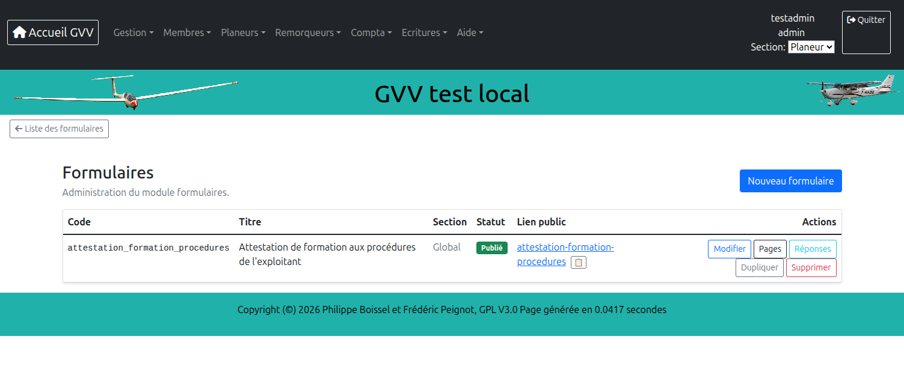
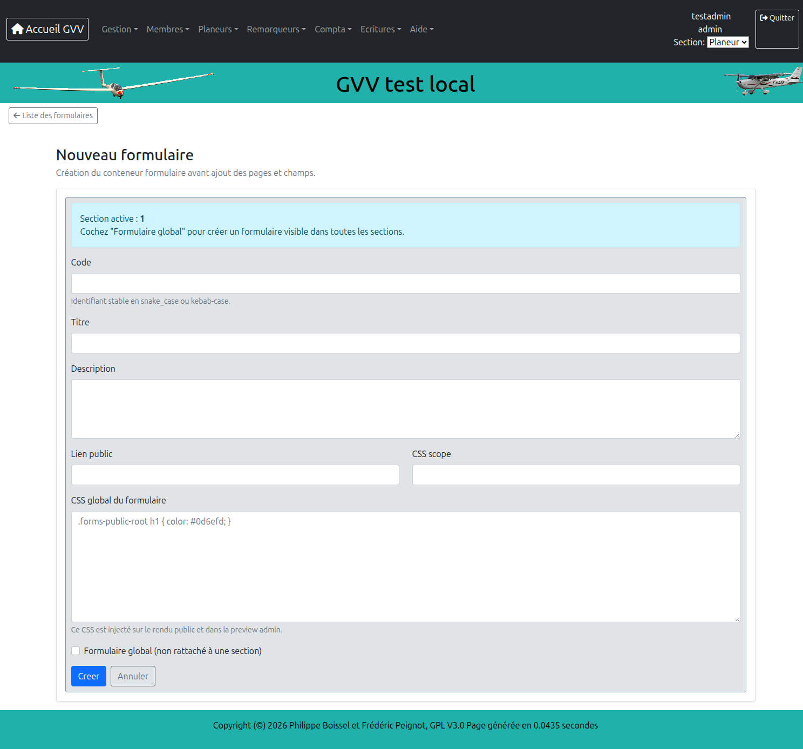
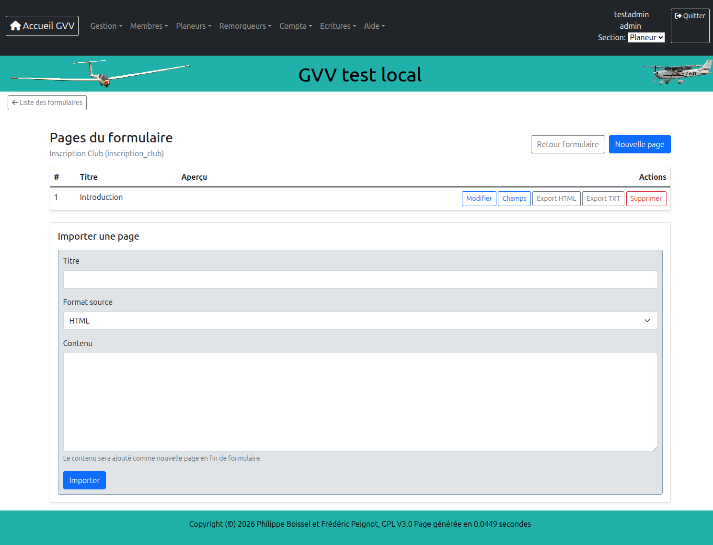
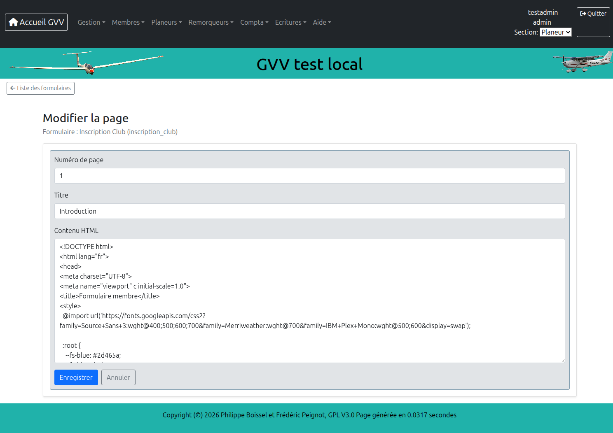
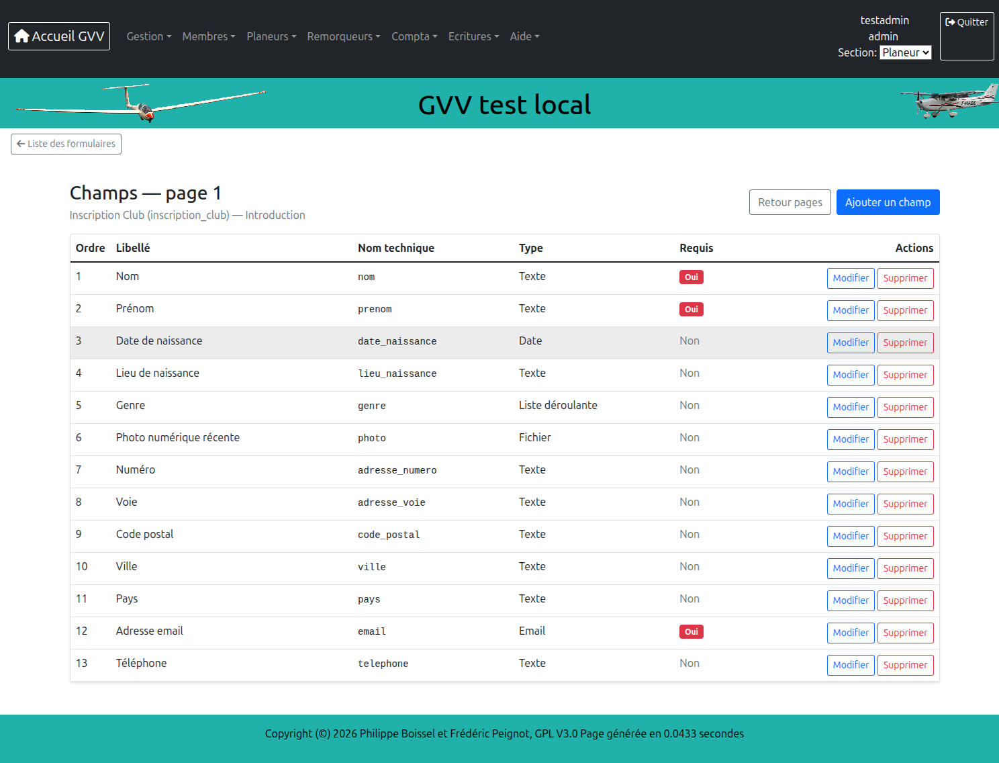
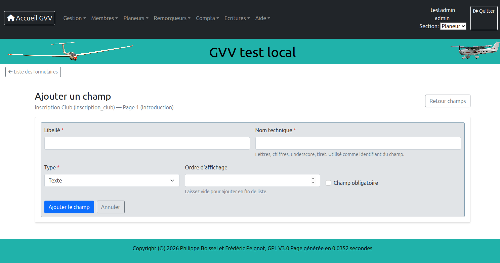
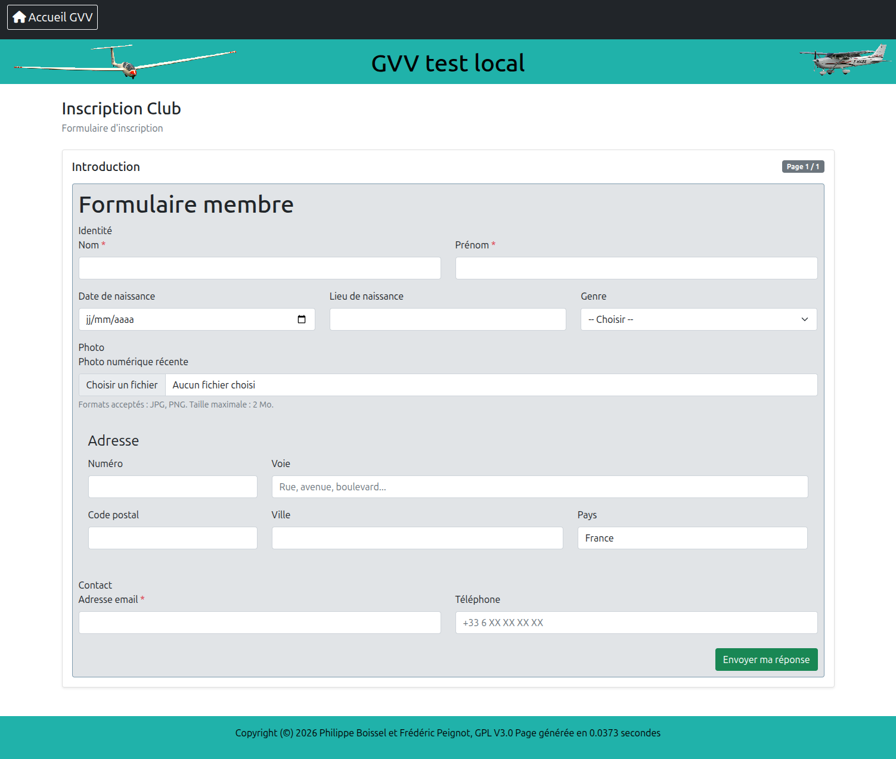

# Gestion des formulaires

Le module formulaires permet de créer des formulaires HTML publiables via un lien public anonyme, de collecter les réponses et de les consulter depuis l'interface d'administration.

## Sommaire

1. [Vue d'ensemble](#vue-densemble)
2. [Interface d'administration](#interface-dadministration)
3. [Types de champs](#types-de-champs)
4. [Règles CSS](#règles-css)
5. [Rôles de champs GVV](#rôles-de-champs-gvv)
6. [Pré-remplissage depuis GVV](#pré-remplissage-depuis-gvv)
7. [Exemples de formulaires](#exemples-de-formulaires)

---

## Vue d'ensemble

Un formulaire GVV est composé de :

- **Métadonnées** : titre, description, code interne, slug public (URL d'accès anonyme), CSS global, statut (brouillon / publié / archivé)
- **Pages** : un formulaire peut comporter plusieurs pages ; chaque page contient du HTML libre et des champs déclarés
- **Champs** : éléments de saisie déclarés par page, typés, optionnellement obligatoires
- **Réponses** : soumissions anonymes, consultables et exportables en PDF

Le flux de travail est le suivant :

```
Créer le formulaire → Ajouter des pages → Éditer le contenu HTML de chaque page
→ Déclarer les champs → Publier → Partager le lien public → Consulter les réponses
```



---

## Interface d'administration

### Créer un formulaire

Navigation : **Formulaires → Nouveau formulaire**



| Champ | Rôle |
|---|---|
| **Titre** | Affiché en en-tête du formulaire public |
| **Code** | Identifiant interne (lettres, chiffres, tirets) |
| **Slug public** | Segment d'URL pour le lien public (ex. `inscription-club`) |
| **Description** | Texte optionnel affiché sous le titre |
| **CSS global** | Feuille de style injectée dans la page publique (voir [Règles CSS](#règles-css)) |
| **Statut** | `brouillon` : non accessible ; `publié` : accessible via le lien public |

Le lien public d'accès anonyme a la forme : `http://gvv.net/index.php/forms/{slug-public}`

### Gérer les pages

Chaque formulaire comporte une ou plusieurs pages affichées séquentiellement. GVV gère automatiquement la navigation Précédent / Suivant et le bouton de soumission finale.



Le contenu HTML d'une page est édité dans un textarea brut. Il peut être rédigé comme un fichier HTML autonome complet (utile pour la prévisualisation locale avec un live-server), mais seul le contenu du `<body>` est utilisé lors du rendu dans GVV (voir [Règles CSS](#règles-css)).



### Déclarer les champs

Les champs déclarés permettent à GVV d'identifier les données soumises, d'appliquer la validation serveur et d'enregistrer les réponses.





| Propriété | Description |
|---|---|
| **Libellé** | Texte affiché dans l'interface admin et les exports |
| **Nom technique** | Identifiant du champ dans le HTML (`name="..."`) — lettres, chiffres, `_`, `-` |
| **Type** | Voir [Types de champs](#types-de-champs) |
| **Obligatoire** | Validation serveur : erreur si la valeur est vide à la soumission |
| **Ordre d'affichage** | Tri dans la liste des champs admin |
| **Options** | Pour `select`, `radio`, `checkbox` : une valeur par ligne |

> **Important** : le nom technique du champ dans l'interface admin doit correspondre exactement à l'attribut `name` de l'élément HTML dans le contenu de la page. C'est ce lien qui permet à GVV de valider et d'enregistrer la valeur.

---

## Types de champs

### Correspondance type → HTML

| Type admin | Élément HTML | Validation serveur |
|---|---|---|
| `text` | `<input type="text">` | Longueur min/max si définie |
| `email` | `<input type="email">` | Format email RFC valide |
| `date` | `<input type="date">` | Date valide au format `YYYY-MM-DD` |
| `number` | `<input type="number">` | Valeur numérique |
| `textarea` | `<textarea>` | Longueur min/max si définie |
| `select` | `<select>` | — |
| `radio` | `<input type="radio">` (groupe) | — |
| `checkbox` | `<input type="checkbox">` (groupe) | — |
| `file` | `<input type="file">` | MIME et taille contrôlés |

### Exemples HTML par type

#### text

```html
<div class="mb-3">
  <label class="form-label" for="nom">Nom <span class="text-danger">*</span></label>
  <input type="text" class="form-control" id="nom" name="nom" required>
</div>
```

#### email

```html
<div class="mb-3">
  <label class="form-label" for="email">Adresse email <span class="text-danger">*</span></label>
  <input type="email" class="form-control" id="email" name="email" required>
</div>
```

#### date

```html
<div class="mb-3">
  <label class="form-label" for="date_naissance">Date de naissance</label>
  <input type="date" class="form-control" id="date_naissance" name="date_naissance">
</div>
```

> La valeur soumise est au format `YYYY-MM-DD`. La validation serveur vérifie que la date existe réellement (ex. le 31 février est rejeté).

#### number

```html
<div class="mb-3">
  <label class="form-label" for="heures">Nombre d'heures</label>
  <input type="number" class="form-control" id="heures" name="heures" min="0" step="0.5">
</div>
```

#### textarea

```html
<div class="mb-3">
  <label class="form-label" for="commentaire">Commentaire</label>
  <textarea class="form-control" id="commentaire" name="commentaire" rows="4"></textarea>
</div>
```

#### select

Options déclarées dans l'interface admin (une par ligne) :

```
Masculin
Féminin
Autre
```

HTML :

```html
<div class="mb-3">
  <label class="form-label" for="genre">Genre</label>
  <select class="form-select" id="genre" name="genre">
    <option value="">-- Choisir --</option>
    <option value="Masculin">Masculin</option>
    <option value="Féminin">Féminin</option>
    <option value="Autre">Autre</option>
  </select>
</div>
```

> Les valeurs dans les `<option>` doivent correspondre aux options déclarées dans l'interface admin.

#### radio

Options déclarées : `Oui`, `Non`, `Sans objet`

```html
<div class="mb-3">
  <label class="form-label d-block">Êtes-vous licencié FFVV ?</label>
  <div class="form-check form-check-inline">
    <input class="form-check-input" type="radio" name="licencie" id="lic_oui" value="Oui">
    <label class="form-check-label" for="lic_oui">Oui</label>
  </div>
  <div class="form-check form-check-inline">
    <input class="form-check-input" type="radio" name="licencie" id="lic_non" value="Non">
    <label class="form-check-label" for="lic_non">Non</label>
  </div>
</div>
```

> Tous les boutons radio d'un groupe partagent le même attribut `name`.

#### checkbox

Options déclarées : `Lundi`, `Mardi`, `Mercredi`, `Jeudi`, `Vendredi`

```html
<div class="mb-3">
  <label class="form-label d-block">Disponibilités</label>
  <div class="form-check">
    <input class="form-check-input" type="checkbox" name="dispo[]" id="lundi" value="Lundi">
    <label class="form-check-label" for="lundi">Lundi</label>
  </div>
  <div class="form-check">
    <input class="form-check-input" type="checkbox" name="dispo[]" id="mardi" value="Mardi">
    <label class="form-check-label" for="mardi">Mardi</label>
  </div>
</div>
```

> Le nom doit comporter `[]` pour transmettre plusieurs valeurs : `name="dispo[]"`. Dans l'interface admin, le nom technique est déclaré sans les crochets (`dispo`).

#### file

```html
<div class="mb-3">
  <label class="form-label" for="photo">Photo d'identité</label>
  <input type="file" class="form-control" id="photo" name="photo" accept="image/jpeg,image/png">
  <div class="form-text">Formats acceptés : JPG, PNG. Taille maximale : 2 Mo.</div>
</div>
```

> Le formulaire doit avoir `enctype="multipart/form-data"`. GVV ajoute cet attribut automatiquement via la balise `<form>` qu'il génère — ne pas l'inclure dans le HTML de la page.

---

## Règles CSS

### Principe fondamental : la balise `<head>` est supprimée

Le contenu HTML d'une page est un fichier HTML autonome. Lors du rendu dans GVV, seul le contenu du `<body>` est utilisé. Les éléments suivants sont **supprimés automatiquement** :

- `<!DOCTYPE>`, `<html>`, `<head>`, `<body>`
- Tout le contenu de `<head>` : **les `<style>` et les `@import url(...)` placés dans `<head>` sont perdus**
- Les balises `<form>` (GVV enveloppe dans son propre formulaire)
- Les boutons `type="submit"` et `type="reset"` (GVV gère la navigation)

La page HTML est ensuite injectée dans la mise en page Bootstrap 5 de GVV.

### Ce qui fonctionne

**1. Classes Bootstrap 5 (recommandé)**

Bootstrap est chargé par GVV. Utiliser ses classes directement est la méthode la plus simple et la plus robuste :

```html
<div class="row g-3 mb-3">
  <div class="col-md-6">
    <label class="form-label" for="nom">Nom</label>
    <input type="text" class="form-control" id="nom" name="nom">
  </div>
  <div class="col-md-6">
    <label class="form-label" for="prenom">Prénom</label>
    <input type="text" class="form-control" id="prenom" name="prenom">
  </div>
</div>
```

Classes Bootstrap utiles pour les formulaires :

| Usage | Classe |
|---|---|
| Grille 12 colonnes | `row`, `col-md-3`, `col-md-4`, `col-md-6`, `col-md-9`, `col-12` |
| Espacement de grille | `g-3` sur le `row` |
| Champ texte/date/number/file | `form-control` |
| Liste déroulante | `form-select` |
| Case à cocher / radio | `form-check`, `form-check-input`, `form-check-label` |
| Libellé de champ | `form-label` |
| Texte d'aide | `form-text` |
| Champ obligatoire | `<span class="text-danger">*</span>` |
| Espacement bas | `mb-3` |
| Groupement visuel | `card`, `card-body` |

**2. CSS dans le champ `global_css` du formulaire**

Pour les styles personnalisés, utiliser le champ **CSS global** du formulaire (interface admin → édition du formulaire). Ce CSS est injecté dans la page publique sous forme de balise `<style>` avant le formulaire.

Portée recommandée : `.forms-public-root` (classe appliquée automatiquement au conteneur) ou la classe de portée personnalisée définie dans le champ **Portée CSS** (`css_scope`).

```css
/* Exemple de CSS global scopé */
.forms-public-root .section-titre {
  font-size: 0.75rem;
  font-weight: 700;
  text-transform: uppercase;
  letter-spacing: 0.08em;
  color: #2d465a;
  border-left: 3px solid #3b6f8f;
  padding-left: 8px;
  margin-bottom: 0.75rem;
}

.forms-public-root .bloc-section {
  border: 1px solid #c9d4dd;
  border-radius: 8px;
  padding: 1rem;
  margin-bottom: 1rem;
  background: #f9fbfc;
}
```

### Ce qui ne fonctionne pas

| Pratique | Pourquoi ça échoue |
|---|---|
| `<style>` dans `<head>` | Supprimé avec `<head>` lors du rendu GVV |
| `@import url('https://fonts.googleapis.com/...')` | Supprimé avec `<head>` |
| Sélecteur `body { ... }` dans `global_css` | La mise en page du `<body>` est contrôlée par GVV |
| Sélecteurs nus `input`, `label`, `select` sans portée | Conflits avec Bootstrap 5 |
| `<form method="post">` dans le HTML | Supprimé ; GVV génère sa propre balise `<form>` |
| `<button type="submit">` | Supprimé ; GVV génère les boutons de navigation |
| `width: 210mm` ou `max-width: 100%` sur `body` | `body` n'est pas accessible |

### Développement : prévisualiser en local

Il est recommandé de développer le HTML de chaque page comme un fichier autonome avec son CSS inline dans `<head>`. Cela permet une prévisualisation fidèle avec un live-server.

Lors de l'import dans GVV :
1. Copier uniquement le contenu du `<body>` dans le champ `content_html`
2. Déplacer le CSS dans le champ `global_css` du formulaire, en le scopant avec `.forms-public-root`
3. Supprimer les `<form>`, les boutons `submit`/`reset` et les `@import` de polices

---

## Rôles de champs GVV

Certains champs HTML peuvent recevoir un **rôle GVV** via l'attribut `data-gvv-role`. GVV utilise la valeur de ces champs à la soumission pour enrichir les métadonnées de la réponse (nom et email du soumettant), visibles dans la liste des réponses admin.

### Rôles disponibles

| Valeur `data-gvv-role` | Effet |
|---|---|
| `submitter_name` | La valeur saisie est enregistrée comme **nom du soumettant** |
| `submitter_email` | La valeur saisie est enregistrée comme **email du soumettant** |

### Déclaration dans le HTML

L'attribut `data-gvv-role` se place directement sur l'élément `<input>` ou `<textarea>` concerné. Il est détecté automatiquement par GVV lors de la sauvegarde du contenu HTML de la page — aucune action supplémentaire dans l'interface admin n'est nécessaire.

```html
<div class="mb-3">
  <label class="form-label" for="nom_complet">Votre nom</label>
  <input type="text" class="form-control" id="nom_complet" name="nom_complet"
         data-gvv-role="submitter_name">
</div>

<div class="mb-3">
  <label class="form-label" for="email">Votre email</label>
  <input type="email" class="form-control" id="email" name="email"
         data-gvv-role="submitter_email">
</div>
```

### Comportement avec un utilisateur connecté

Quand un utilisateur GVV connecté soumet un formulaire public, GVV complète automatiquement les champs `submitter_name` et `submitter_email` avec ses informations de profil — **même si le formulaire ne contient pas de champs avec ces rôles**.

La priorité est la suivante :

1. Valeur saisie dans un champ `data-gvv-role="submitter_name/email"` (si présent et non vide)
2. Données du membre connecté (nom complet et email GVV)
3. Vide (soumission vraiment anonyme, utilisateur non connecté)

Cela permet à l'administrateur d'identifier l'auteur d'une réponse sans que le formulaire ait besoin de demander explicitement le nom ou l'email.

---

## Pré-remplissage depuis GVV

Certains champs peuvent être pré-remplis automatiquement avec des données issues de GVV (membre, instructeur, club, date). La déclaration se fait directement dans le HTML du champ via des attributs `data-gvv-*`.

> Cette fonctionnalité est prévue dans une version ultérieure du module.

### Attributs disponibles

| Attribut | Rôle |
|---|---|
| `data-gvv-source` | Source de la donnée à injecter |
| `data-gvv-param` | Nom du paramètre URL qui identifie la personne |
| `data-gvv-lock` | `true` = champ verrouillé (non modifiable par l'utilisateur) |

### Exemples

```html
<!-- Nom du candidat, pré-rempli depuis le membre identifié par pilot_login, non modifiable -->
<input name="candidat_nom" type="text"
       data-gvv-source="member.nom_prenom"
       data-gvv-param="pilot_login"
       data-gvv-lock="true">

<!-- Adresse du candidat, pré-remplie mais modifiable -->
<input name="candidat_adresse" type="text"
       data-gvv-source="member.adresse_complete"
       data-gvv-param="pilot_login">

<!-- Nom du club (pas de paramètre) -->
<input name="organisme" type="text"
       data-gvv-source="club.nom">

<!-- Date du jour -->
<input name="date_signature" type="date"
       data-gvv-source="date.today">
```

Les paramètres d'identification sont passés dans l'URL du formulaire :

```
https://monclub.gvv.net/forms/mon-formulaire?pilot_login=dupont_j&instructor_login=martin_p
```

### Sources de données disponibles

| Source | Donnée injectée | Paramètre requis |
|---|---|---|
| `club.nom` | Nom du club | — |
| `club.ville` | Ville du club | — |
| `club.email` | Email du club | — |
| `member.nom_prenom` | Nom et prénom du membre | `pilot_login` |
| `member.email` | Email du membre | `pilot_login` |
| `member.telephone` | Téléphone du membre | `pilot_login` |
| `member.adresse_complete` | Adresse complète | `pilot_login` |
| `member.date_naissance` | Date de naissance (YYYY-MM-DD) | `pilot_login` |
| `member.lieu_naissance` | Lieu de naissance | `pilot_login` |
| `member.date_lieu_naissance` | "JJ/MM/AAAA à Ville" | `pilot_login` |
| `instructor.nom_prenom` | Nom et prénom de l'instructeur | `instructor_login` |
| `user.nom_prenom` | Membre connecté | — (session) |
| `date.today` | Date du jour (YYYY-MM-DD) | — |
| `date.today_fr` | Date du jour (JJ/MM/AAAA) | — |

---

## Exemples de formulaires

### Exemple 1 — Formulaire minimaliste

Un formulaire d'une page avec trois champs. Aucun CSS personnalisé : uniquement les classes Bootstrap.

**Champs à déclarer :**

| Nom technique | Libellé | Type | Obligatoire |
|---|---|---|---|
| `nom` | Nom | text | Oui |
| `email` | Email | email | Oui |
| `message` | Message | textarea | Non |

**Contenu HTML de la page :**

```html
<!DOCTYPE html>
<html lang="fr">
<head>
  <meta charset="UTF-8">
  <title>Contact</title>
  <!-- Le CSS ici est ignoré par GVV. Mettre le CSS custom dans global_css. -->
</head>
<body>

<div class="mb-3">
  <label class="form-label" for="nom">Nom <span class="text-danger">*</span></label>
  <input type="text" class="form-control" id="nom" name="nom" required>
</div>

<div class="mb-3">
  <label class="form-label" for="email">Email <span class="text-danger">*</span></label>
  <input type="email" class="form-control" id="email" name="email" required>
</div>

<div class="mb-3">
  <label class="form-label" for="message">Message</label>
  <textarea class="form-control" id="message" name="message" rows="5"></textarea>
</div>

</body>
</html>
```

**CSS global :** *(vide — Bootstrap suffit)*

---

### Exemple 2 — Formulaire d'inscription membre

Formulaire réaliste couvrant tous les types de champs supportés. Illustré par le formulaire "Inscription Club" disponible dans l'application.



**Champs à déclarer :**

| Nom technique | Libellé | Type | Obligatoire | Options |
|---|---|---|---|---|
| `nom` | Nom | text | Oui | — |
| `prenom` | Prénom | text | Oui | — |
| `date_naissance` | Date de naissance | date | Non | — |
| `lieu_naissance` | Lieu de naissance | text | Non | — |
| `genre` | Genre | select | Non | Masculin / Féminin / Autre |
| `licencie` | Licencié FFVV | radio | Non | Oui / Non |
| `disponibilites` | Disponibilités | checkbox | Non | Lundi … Vendredi |
| `photo` | Photo | file | Non | — |
| `adresse_voie` | Adresse | text | Non | — |
| `code_postal` | Code postal | text | Non | — |
| `ville` | Ville | text | Non | — |
| `email` | Email | email | Oui | — |
| `telephone` | Téléphone | text | Non | — |
| `commentaire` | Commentaire | textarea | Non | — |

**Contenu HTML de la page :**

```html
<!DOCTYPE html>
<html lang="fr">
<head>
  <meta charset="UTF-8">
  <title>Inscription membre</title>
</head>
<body>

<!-- Section Identité -->
<div class="bloc-section">
  <div class="section-titre">Identité</div>
  <div class="row g-3 mb-3">
    <div class="col-md-6">
      <label class="form-label" for="nom">Nom <span class="text-danger">*</span></label>
      <input type="text" class="form-control" id="nom" name="nom" required>
    </div>
    <div class="col-md-6">
      <label class="form-label" for="prenom">Prénom <span class="text-danger">*</span></label>
      <input type="text" class="form-control" id="prenom" name="prenom" required>
    </div>
  </div>
  <div class="row g-3 mb-3">
    <div class="col-md-4">
      <label class="form-label" for="date_naissance">Date de naissance</label>
      <input type="date" class="form-control" id="date_naissance" name="date_naissance">
    </div>
    <div class="col-md-4">
      <label class="form-label" for="lieu_naissance">Lieu de naissance</label>
      <input type="text" class="form-control" id="lieu_naissance" name="lieu_naissance">
    </div>
    <div class="col-md-4">
      <label class="form-label" for="genre">Genre</label>
      <select class="form-select" id="genre" name="genre">
        <option value="">-- Choisir --</option>
        <option value="Masculin">Masculin</option>
        <option value="Féminin">Féminin</option>
        <option value="Autre">Autre</option>
      </select>
    </div>
  </div>
  <div class="mb-3">
    <label class="form-label d-block">Licencié FFVV ?</label>
    <div class="form-check form-check-inline">
      <input class="form-check-input" type="radio" name="licencie" id="lic_oui" value="Oui">
      <label class="form-check-label" for="lic_oui">Oui</label>
    </div>
    <div class="form-check form-check-inline">
      <input class="form-check-input" type="radio" name="licencie" id="lic_non" value="Non">
      <label class="form-check-label" for="lic_non">Non</label>
    </div>
  </div>
  <div class="mb-3">
    <label class="form-label d-block">Disponibilités</label>
    <div class="form-check form-check-inline">
      <input class="form-check-input" type="checkbox" name="disponibilites[]" id="lundi" value="Lundi">
      <label class="form-check-label" for="lundi">Lundi</label>
    </div>
    <div class="form-check form-check-inline">
      <input class="form-check-input" type="checkbox" name="disponibilites[]" id="mardi" value="Mardi">
      <label class="form-check-label" for="mardi">Mardi</label>
    </div>
    <div class="form-check form-check-inline">
      <input class="form-check-input" type="checkbox" name="disponibilites[]" id="mercredi" value="Mercredi">
      <label class="form-check-label" for="mercredi">Mercredi</label>
    </div>
  </div>
</div>

<!-- Section Photo -->
<div class="bloc-section">
  <div class="section-titre">Photo</div>
  <div class="mb-3">
    <label class="form-label" for="photo">Photo d'identité</label>
    <input type="file" class="form-control" id="photo" name="photo" accept="image/jpeg,image/png">
    <div class="form-text">JPG ou PNG, 2 Mo maximum.</div>
  </div>
</div>

<!-- Section Adresse -->
<div class="bloc-section">
  <div class="section-titre">Adresse</div>
  <div class="mb-3">
    <label class="form-label" for="adresse_voie">Adresse</label>
    <input type="text" class="form-control" id="adresse_voie" name="adresse_voie">
  </div>
  <div class="row g-3 mb-3">
    <div class="col-md-3">
      <label class="form-label" for="code_postal">Code postal</label>
      <input type="text" class="form-control" id="code_postal" name="code_postal" maxlength="10">
    </div>
    <div class="col-md-9">
      <label class="form-label" for="ville">Ville</label>
      <input type="text" class="form-control" id="ville" name="ville">
    </div>
  </div>
</div>

<!-- Section Contact -->
<div class="bloc-section">
  <div class="section-titre">Contact</div>
  <div class="row g-3 mb-3">
    <div class="col-md-6">
      <label class="form-label" for="email">Email <span class="text-danger">*</span></label>
      <input type="email" class="form-control" id="email" name="email" required>
    </div>
    <div class="col-md-6">
      <label class="form-label" for="telephone">Téléphone</label>
      <input type="text" class="form-control" id="telephone" name="telephone">
    </div>
  </div>
  <div class="mb-3">
    <label class="form-label" for="commentaire">Commentaire</label>
    <textarea class="form-control" id="commentaire" name="commentaire" rows="4"></textarea>
  </div>
</div>

</body>
</html>
```

**CSS global du formulaire :**

```css
.forms-public-root .bloc-section {
  border: 1px solid #c9d4dd;
  border-radius: 8px;
  padding: 1rem 1.2rem;
  margin-bottom: 1rem;
  background: #f9fbfc;
}

.forms-public-root .section-titre {
  font-size: 0.7rem;
  font-weight: 700;
  text-transform: uppercase;
  letter-spacing: 0.1em;
  color: #2d465a;
  border-left: 3px solid #3b6f8f;
  padding-left: 8px;
  margin-bottom: 0.85rem;
}
```

---

## À retenir

| ✅ Recommandé | ❌ À éviter |
|---|---|
| Classes Bootstrap 5 pour la grille et les champs | CSS dans `<head>` du HTML de page |
| CSS personnalisé dans le champ `global_css` du formulaire | `@import url(...)` de polices Google dans `<head>` |
| Portée CSS avec `.forms-public-root` | Sélecteurs nus `input`, `label`, `select` sans portée |
| `name="champ[]"` pour les checkboxes | Balise `<form>` dans le HTML de page |
| Développer en standalone local pour prévisualiser | Boutons `submit`/`reset` dans le HTML de page |
| Sélecteur `<option value="">` vide en tête des `<select>` | Dépendances à `body` ou `html` pour le layout |
