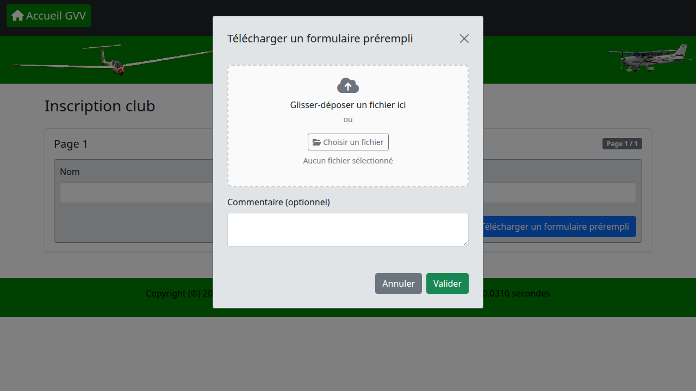
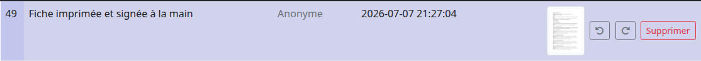
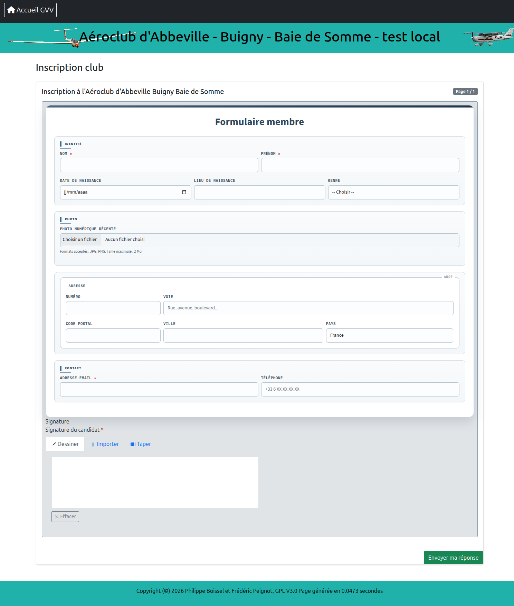

# Gestion des formulaires

Le module formulaires permet de créer des formulaires HTML publiables via un lien public anonyme, de collecter les réponses et de les consulter depuis l'interface d'administration.

## Sommaire

1. [Vue d'ensemble](#vue-densemble)
2. [Interface d'administration](#interface-dadministration)
3. [Types de champs](#types-de-champs)
4. [Règles CSS](#règles-css)
5. [Rôles de champs GVV](#rôles-de-champs-gvv)
6. [Pré-remplissage — mécanisme A (attributs `data-gvv-source`)](#pré-remplissage--mécanisme-a-attributs-data-gvv-source)
7. [Pré-remplissage — mécanisme B (paramètres d'URL)](#pré-remplissage--mécanisme-b-paramètres-durl)
8. [Page de génération](#page-de-génération)
9. [Consulter les réponses](#consulter-les-réponses)
10. [Soumission par téléchargement (scan)](#soumission-par-téléchargement-scan)
11. [Exemples de formulaires](#exemples-de-formulaires)

---

## Vue d'ensemble

Un formulaire GVV est composé de :

- **Métadonnées** : titre, code interne, slug public (URL d'accès anonyme), CSS global, statut (brouillon / publié / archivé)
- **Pages** : un formulaire peut comporter plusieurs pages ; chaque page contient du HTML libre et des champs déclarés
- **Champs** : éléments de saisie déclarés par page, typés, optionnellement obligatoires
- **Réponses** : soumissions anonymes, consultables et exportables en PDF

Flux de travail :

```
Créer le formulaire → Ajouter des pages → Éditer le contenu HTML
→ Déclarer les champs → Publier → Partager le lien public → Consulter les réponses
```

Le lien public a la forme : `http://gvv.net/index.php/forms/{slug-public}`


---

## Interface d'administration

### Créer un formulaire

Navigation : **Formulaires → Nouveau formulaire**


| Champ | Rôle |
|---|---|
| **Titre** | Affiché en en-tête du formulaire public |
| **Code** | Identifiant interne (lettres, chiffres, tirets) |
| **Slug public** | Segment d'URL (ex. `inscription-club`) |
| **Description** | Texte optionnel affiché sous le titre |
| **CSS global** | Styles injectés dans la page publique (voir [Règles CSS](#règles-css)) |
| **Statut** | `brouillon` : non accessible ; `publié` : accessible via le lien public |
| **Autoriser la soumission par téléchargement (scan)** | Active le bouton "Télécharger un formulaire prérempli" — voir [Soumission par téléchargement (scan)](#soumission-par-téléchargement-scan) |

### Gérer les pages

Chaque formulaire comporte une ou plusieurs pages affichées séquentiellement. GVV gère automatiquement la navigation Précédent / Suivant et le bouton de soumission finale.

Le contenu HTML d'une page peut être rédigé comme un fichier HTML autonome (utile pour la prévisualisation locale), mais seul le contenu du `<body>` est utilisé lors du rendu dans GVV.


### Convertir un formulaire PDF existant

GVV n'intègre pas de convertisseur PDF → HTML automatique. Pour numériser un formulaire existant (papier ou PDF) :

1. Demander à un outil d'IA (Claude, ChatGPT, etc.) de convertir le PDF en HTML, en lui donnant les contraintes de ce document : Bootstrap 5, pas de `<head>`/`<style>` ni de balise `<form>` dans le contenu de page — voir [Règles CSS](#règles-css).
2. Relire et corriger le HTML généré : les champs ne sont pas détectés automatiquement par l'outil d'IA, les attributs `name="..."` doivent être vérifiés ou ajoutés à la main.
3. Coller le résultat dans le contenu de la page, puis déclarer chaque champ dans l'admin — voir [Déclarer les champs](#déclarer-les-champs).
4. Vérifier le rendu sur la page publique : la fidélité visuelle au PDF d'origine n'est pas garantie et demande souvent des retouches CSS.

**Limites** : pas de détection automatique des champs du PDF source, pas de garantie de fidélité visuelle, relecture manuelle obligatoire avant publication.

### Déclarer les champs

Les champs déclarés permettent à GVV d'identifier les données soumises, d'appliquer la validation serveur et d'enregistrer les réponses.


| Propriété | Description |
|---|---|
| **Libellé** | Texte affiché dans l'interface admin et les exports |
| **Nom technique** | Identifiant du champ dans le HTML (`name="..."`) |
| **Type** | Voir [Types de champs](#types-de-champs) |
| **Obligatoire** | Validation serveur : erreur si valeur vide à la soumission |
| **Options** | Pour `select`, `radio`, `checkbox` : une valeur par ligne |

> **Important** : le nom technique déclaré dans l'admin doit correspondre exactement à l'attribut `name` de l'élément HTML. C'est ce lien qui permet à GVV de valider et d'enregistrer la valeur.

---

## Types de champs

| Type | Élément HTML | Notes |
|---|---|---|
| `text` | `<input type="text">` | — |
| `email` | `<input type="email">` | Format email RFC validé côté serveur |
| `date` | `<input type="date">` | Format `YYYY-MM-DD`, date réelle vérifiée |
| `number` | `<input type="number">` | Valeur numérique |
| `textarea` | `<textarea>` | — |
| `select` | `<select>` | Options déclarées dans l'admin |
| `radio` | `<input type="radio">` (groupe) | Options déclarées dans l'admin |
| `checkbox` | `<input type="checkbox">` (groupe) | `name="champ[]"` pour les valeurs multiples |
| `file` | `<input type="file">` | MIME et taille contrôlés |
| `signature` | `<div data-gvv-type="signature" ...>` | Widget interactif — voir ci-dessous |

### Exemples HTML par type

```html
<!-- text -->
<div class="mb-3">
  <label class="form-label" for="nom">Nom <span class="text-danger">*</span></label>
  <input type="text" class="form-control" id="nom" name="nom" required>
</div>

<!-- email -->
<div class="mb-3">
  <label class="form-label" for="email">Adresse email</label>
  <input type="email" class="form-control" id="email" name="email">
</div>

<!-- date -->
<div class="mb-3">
  <label class="form-label" for="date_naissance">Date de naissance</label>
  <input type="date" class="form-control" id="date_naissance" name="date_naissance">
</div>

<!-- number -->
<div class="mb-3">
  <label class="form-label" for="heures">Nombre d'heures</label>
  <input type="number" class="form-control" id="heures" name="heures" min="0" step="0.5">
</div>

<!-- textarea -->
<div class="mb-3">
  <label class="form-label" for="commentaire">Commentaire</label>
  <textarea class="form-control" id="commentaire" name="commentaire" rows="4"></textarea>
</div>

<!-- select (options déclarées dans l'admin : Masculin / Féminin / Autre) -->
<div class="mb-3">
  <label class="form-label" for="genre">Genre</label>
  <select class="form-select" id="genre" name="genre">
    <option value="">-- Choisir --</option>
    <option value="Masculin">Masculin</option>
    <option value="Féminin">Féminin</option>
    <option value="Autre">Autre</option>
  </select>
</div>

<!-- radio (options déclarées : Oui / Non) -->
<div class="mb-3">
  <label class="form-label d-block">Licencié FFVV ?</label>
  <div class="form-check form-check-inline">
    <input class="form-check-input" type="radio" name="licencie" id="lic_oui" value="Oui">
    <label class="form-check-label" for="lic_oui">Oui</label>
  </div>
  <div class="form-check form-check-inline">
    <input class="form-check-input" type="radio" name="licencie" id="lic_non" value="Non">
    <label class="form-check-label" for="lic_non">Non</label>
  </div>
</div>

<!-- checkbox — noter le [] dans name, déclaré sans crochets dans l'admin -->
<div class="mb-3">
  <label class="form-label d-block">Disponibilités</label>
  <div class="form-check form-check-inline">
    <input class="form-check-input" type="checkbox" name="dispo[]" id="lundi" value="Lundi">
    <label class="form-check-label" for="lundi">Lundi</label>
  </div>
  <div class="form-check form-check-inline">
    <input class="form-check-input" type="checkbox" name="dispo[]" id="mardi" value="Mardi">
    <label class="form-check-label" for="mardi">Mardi</label>
  </div>
</div>

<!-- file -->
<div class="mb-3">
  <label class="form-label" for="photo">Photo d'identité</label>
  <input type="file" class="form-control" id="photo" name="photo" accept="image/jpeg,image/png">
  <div class="form-text">Formats acceptés : JPG, PNG. Taille maximale : 2 Mo.</div>
</div>
```

### Champ signature

Le champ signature est un widget interactif qui offre trois modes à l'utilisateur : dessin à la souris/tactile, import d'une image, ou frappe au clavier (rendue en écriture manuscrite). La valeur est transmise comme image PNG encodée en base64.

**Déclaration dans le HTML :**

```html
<div data-gvv-type="signature"
     data-gvv-name="signature_candidat"
     data-gvv-required="true">
  Signature du candidat
</div>
```

| Attribut | Rôle |
|---|---|
| `data-gvv-type="signature"` | Identifie le widget (obligatoire) |
| `data-gvv-name` | Nom technique du champ — doit correspondre au nom déclaré dans l'admin |
| `data-gvv-required` | `true` = champ obligatoire |

GVV remplace automatiquement ce `<div>` par le widget interactif lors du rendu public. Le texte contenu dans le div sert de libellé affiché au-dessus du widget.

> **Champ à déclarer dans l'admin** : type `signature`, nom technique identique à `data-gvv-name`.

---

## Règles CSS

### Principe : la balise `<head>` est supprimée

Lors du rendu dans GVV, seul le contenu du `<body>` est utilisé. Les éléments suivants sont **supprimés automatiquement** :

- `<!DOCTYPE>`, `<html>`, `<head>`, `<body>`
- Tout le contenu de `<head>` — **`<style>` et `@import url(...)` placés dans `<head>` sont perdus**
- Les balises `<form>`, les boutons `type="submit"` et `type="reset"` (GVV gère la navigation)

### Ce qui fonctionne

**1. Classes Bootstrap 5 (recommandé)** — Bootstrap est chargé par GVV, ses classes sont disponibles directement.

Classes Bootstrap utiles :

| Usage | Classe |
|---|---|
| Grille 12 colonnes | `row`, `col-md-3`, `col-md-6`, `col-12` |
| Espacement de grille | `g-3` sur le `row` |
| Champ texte/date/number/file | `form-control` |
| Liste déroulante | `form-select` |
| Case à cocher / radio | `form-check`, `form-check-input`, `form-check-label` |
| Libellé | `form-label` |
| Texte d'aide | `form-text` |
| Champ obligatoire | `<span class="text-danger">*</span>` |
| Groupement visuel | `card`, `card-body` |

**2. CSS dans le champ `global_css` du formulaire** — pour les styles personnalisés, utiliser le champ CSS global de l'interface admin. Ce CSS est injecté dans la page publique avant le formulaire.

Portée recommandée : `.forms-public-root` (classe appliquée automatiquement au conteneur).

```css
.forms-public-root .section-titre {
  font-size: 0.75rem;
  font-weight: 700;
  text-transform: uppercase;
  letter-spacing: 0.08em;
  color: #2d465a;
  border-left: 3px solid #3b6f8f;
  padding-left: 8px;
  margin-bottom: 0.75rem;
}
```

### Ce qui ne fonctionne pas

| Pratique | Pourquoi ça échoue |
|---|---|
| `<style>` dans `<head>` | Supprimé avec `<head>` |
| `@import url(...)` de polices dans `<head>` | Supprimé avec `<head>` |
| Sélecteurs nus `input`, `label` sans portée | Conflits avec Bootstrap 5 |
| `<form>` dans le HTML | Supprimé ; GVV génère sa propre balise `<form>` |
| `<button type="submit">` | Supprimé ; GVV génère les boutons de navigation |

### Développement local

Développer le HTML comme un fichier autonome avec CSS inline dans `<head>` pour la prévisualisation. Lors de l'import dans GVV :

1. Copier uniquement le contenu du `<body>` dans le champ `content_html`
2. Déplacer le CSS dans le champ `global_css`, scopé avec `.forms-public-root`
3. Supprimer les `<form>`, les boutons `submit`/`reset` et les `@import` de polices

---

## Rôles de champs GVV

L'attribut `data-gvv-role` sur un `<input>` ou `<textarea>` permet à GVV d'enregistrer la valeur saisie comme métadonnée de la réponse (nom et email du soumettant), visible dans la liste des réponses admin.

| Valeur `data-gvv-role` | Effet |
|---|---|
| `submitter_name` | La valeur est enregistrée comme **nom du soumettant** |
| `submitter_email` | La valeur est enregistrée comme **email du soumettant** |

```html
<input type="text" class="form-control" name="nom_complet"
       data-gvv-role="submitter_name">

<input type="email" class="form-control" name="email"
       data-gvv-role="submitter_email">
```

Quand un utilisateur GVV connecté soumet un formulaire, GVV complète ces métadonnées automatiquement avec ses informations de profil, même sans champs explicites.

---

## Pré-remplissage — mécanisme A (attributs `data-gvv-source`)

Le mécanisme A permet de pré-remplir des champs HTML avec des données issues de GVV (membres, événements, configuration club, date du jour) en déclarant des attributs `data-gvv-*` directement sur les éléments `<input>`, `<textarea>`, `<select>` ou sur les `<div data-gvv-type="signature">`.

### Attributs

| Attribut | Rôle |
|---|---|
| `data-gvv-source` | Source de la donnée à injecter (voir taxonomie ci-dessous) |
| `data-gvv-lock` | `true` = champ readonly à l'affichage **et** valeur GVV imposée à la soumission |

Le login du pilote et de l'instructeur sont transmis dans l'URL :
```
…/forms/mon-formulaire?pilot_login=dupont_j&instructor_login=martin_p
```

### Exemple

```html
<!-- Nom du candidat (verrouillé) -->
<input name="candidat_nom" type="text"
       data-gvv-source="member.nom_prenom"
       data-gvv-lock="true">

<!-- Numéro ITP de l'instructeur (verrouillé) -->
<input name="num_itp" type="text"
       data-gvv-source="instructor.event.itp.numero"
       data-gvv-lock="true">

<!-- Organisme de formation (paramètre de configuration) -->
<input name="organisme" type="text"
       data-gvv-source="config.organisme_formation">

<!-- Date du jour (automatique, pas de paramètre URL) -->
<input name="date_signature" type="date"
       data-gvv-source="date.today">

<!-- Signature de l'instructeur (pré-remplie, remplaçable) -->
<div data-gvv-type="signature"
     data-gvv-name="signature_instructeur"
     data-gvv-source="instructor.event.itp.signature"
     data-gvv-lock="false">Signature instructeur</div>
```

### Taxonomie des sources

#### Configuration et données club

| Source | Donnée |
|---|---|
| `config.<cle>` | Paramètre de configuration club (table `form_config_params`) |
| `club.nom` | Nom du club |
| `club.sigle` | Sigle du club |
| `club.adresse` | Adresse |
| `club.ville` | Ville |
| `club.email` | Email du club |

#### Membre / pilote — table `membres` (nécessite `pilot_login` dans l'URL)

| Source | Donnée |
|---|---|
| `member.nom` | Nom de famille |
| `member.prenom` | Prénom |
| `member.nom_prenom` | "Nom Prénom" |
| `member.email` | Email |
| `member.telephone` | Téléphone fixe, ou mobile si vide |
| `member.adresse` | Adresse |
| `member.code_postal` | Code postal |
| `member.ville` | Ville |
| `member.adresse_complete` | "Adresse, CP Ville" |
| `member.date_naissance` | Date de naissance (JJ/MM/AAAA) |
| `member.lieu_naissance` | Lieu de naissance |
| `member.date_lieu_naissance` | "JJ/MM/AAAA à Ville" |
| `member.signature` | Signature enregistrée dans le profil |

#### Événements / qualifications du pilote — table `events` (nécessite `pilot_login`)

| Source | Donnée |
|---|---|
| `member.event.{type_key}.numero` | Numéro de qualification (`ecomment`) |
| `member.event.{type_key}.expiry` | Date d'expiration |
| `member.event.{type_key}.date` | Date de l'événement |
| `member.event.{type_key}.signature` | Signature associée à l'événement |

#### Instructeur — table `membres` (nécessite `instructor_login` dans l'URL)

Mêmes sources que `member.*`, préfixées par `instructor.*` :
`instructor.nom_prenom`, `instructor.email`, `instructor.signature`, etc.

#### Événements / qualifications de l'instructeur — table `events`

| Source | Donnée |
|---|---|
| `instructor.event.{type_key}.numero` | Numéro de qualification |
| `instructor.event.{type_key}.expiry` | Date d'expiration |
| `instructor.event.{type_key}.date` | Date de l'événement |
| `instructor.event.{type_key}.signature` | Signature associée à l'événement |

#### Utilisateur connecté — même champs que `member.*` sans paramètre URL

Préfixe `user.*` : résolu depuis la session GVV courante.

#### Dates calculées

| Source | Donnée |
|---|---|
| `date.today` | Date du jour au format `YYYY-MM-DD` |
| `date.today_fr` | Date du jour au format `JJ/MM/AAAA` |
| `date.year` | Année en cours |

#### Clés `{type_key}` disponibles

| `{type_key}` | Qualification |
|---|---|
| `itp` | ITP (Instructeur de Planeur) |
| `itv` | ITV |
| `fi_spl` | FI Sailplane |
| `fe_spl` | FE Sailplane |
| `fi_ulm` | FI ULM |
| `fe_ulm` | FE ULM |
| `controle_competence` | Contrôle de compétence |
| `visite_medicale` | Visite médicale |
| `bpp` | BPP |
| `spl` | SPL |

---

## Pré-remplissage — mécanisme B (paramètres d'URL)

Le mécanisme B permet de pré-remplir des champs à partir de **valeurs passées directement dans l'URL**, sans aucun attribut `data-gvv-*` dans le HTML. C'est le mécanisme naturel quand le contexte vient d'une entité GVV autre qu'un membre (vol de découverte, réservation, dossier).

### Principe

Tout paramètre d'URL dont le nom correspond à un `name=` d'un champ du formulaire est injecté comme valeur par défaut. Les valeurs sont stockées en session par slug et persistent sur toutes les pages du formulaire.

```
/forms/{slug}
  ?{nom_champ}={valeur}    ← injecté dans le champ correspondant
  &lock[]={nom_champ}      ← champ readonly + valeur imposée à la soumission
```

**Noms réservés** (jamais injectés dans un champ) : `page`, `token`, `vld_id`, `pilot_login`, `instructor_login`, `lock`.

### Rôle de `lock[]`

Sans `lock[]`, la valeur est une **suggestion** : le champ est pré-rempli mais l'utilisateur peut le modifier.

Avec `lock[]`, la protection est double :
- **Affichage** : le champ reçoit l'attribut `readonly` — l'utilisateur voit la valeur mais ne peut pas la changer.
- **Soumission** : même si la valeur POST est falsifiée (modification du HTML côté client), le serveur réinjecte la valeur stockée en session. Il est impossible de soumettre une valeur différente.

### Exemple — briefing passager ULM

Un workflow GVV (vol de découverte) génère ce lien et l'envoie au passager :

```
/forms/briefing-passager-ulm
  ?date_vol=2026-07-15
  &site_decollage=Abbeville
  &identification_ulm=F-JXXX
  &nom=Dupont
  &personne_a_prevenir=Marie+Dupont
  &lock[]=date_vol
  &lock[]=site_decollage
  &lock[]=identification_ulm
```

Résultat :

| Champ | Valeur | Comportement |
|---|---|---|
| `date_vol` | 2026-07-15 | Readonly — valeur imposée (données VLD) |
| `site_decollage` | Abbeville | Readonly — valeur imposée |
| `identification_ulm` | F-JXXX | Readonly — valeur imposée |
| `nom` | Dupont | Pré-rempli — modifiable (suggestion) |
| `personne_a_prevenir` | Marie Dupont | Pré-rempli — modifiable (suggestion) |

### Coexistence avec le mécanisme A

Les deux mécanismes peuvent coexister dans le même formulaire. Les sources automatiques (`date.today`, `config.*`, `club.*`) utilisent toujours le mécanisme A. Le mécanisme B cible les champs par `name=` sans aucun attribut HTML supplémentaire.

Priorité appliquée (du plus au moins prioritaire) :
1. **Erreur de validation** (re-affichage après soumission refusée)
2. **Mécanisme A** (`data-gvv-source`)
3. **Mécanisme B** (paramètres d'URL)

---

## Page de génération

Pour les formulaires qui nécessitent un contexte GVV (membre, instructeur), l'administrateur peut utiliser la **page de génération** plutôt que de construire l'URL manuellement.

La page de génération est accessible via le bouton **"Générer"** dans la liste des formulaires, disponible uniquement pour les formulaires dont le champ `Paramètres requis` est différent de `aucun`.

### Configuration du formulaire

Dans la fiche admin du formulaire, le champ **Paramètres requis** définit quels sélecteurs apparaissent sur la page de génération :

| Valeur | Sélecteurs affichés |
|---|---|
| `aucun` | Aucun — pas de bouton "Générer" |
| `pilote` | Sélecteur membre (pilote) |
| `instructeur` | Sélecteur membre (instructeur) |
| `pilote + instructeur` | Les deux sélecteurs |

### Utilisation

1. Cliquer sur **"Générer"** dans la liste des formulaires.
2. Sélectionner le pilote et/ou l'instructeur selon la configuration.
3. Cliquer sur **"Ouvrir le formulaire"** : GVV construit l'URL avec `pilot_login` et/ou `instructor_login` et ouvre le formulaire pré-rempli.

Le mécanisme A (`data-gvv-source`) est alors actif : tous les champs annotés sont pré-remplis depuis les données GVV des membres sélectionnés.

---

## Consulter les réponses

Navigation : **Formulaires → [nom du formulaire] → Réponses**

La liste affiche, pour chaque soumission : un identifiant (nom/email du soumettant si déclarés via [`data-gvv-role`](#rôles-de-champs-gvv), sinon l'identifiant technique de la soumission), la date de soumission, et les actions disponibles.

### Ouvrir une réponse

Le bouton **"Ouvrir"** affiche le détail d'une réponse en ligne :

- toutes les valeurs saisies, champ par champ, avec leur libellé et leur type ;
- les fichiers joints (champs de type `file` et signatures) avec **aperçu intégré** : une image est affichée directement, un PDF s'affiche dans un cadre de prévisualisation intégré à la page ; les boutons "Aperçu" (nouvel onglet) et "Télécharger" restent disponibles pour tout type de fichier.

### Export PDF imprimable

Le bouton **"PDF"** ouvre une version imprimable de la réponse (page HTML avec un bouton "Imprimer / Enregistrer en PDF"), reprenant le CSS global du formulaire.

### Téléchargement sécurisé des fichiers

Les fichiers joints (uploads et signatures) ne sont accessibles que depuis l'interface d'administration, à un utilisateur authentifié ayant accès à la section du formulaire — jamais par une URL prévisible côté public. Le navigateur n'est pas autorisé à mettre ces fichiers en cache.

### Rétention

Les réponses et leurs fichiers sont conservés sans limite de durée ; il n'y a pas d'expiration automatique. La suppression (bouton "Supprimer") est manuelle et retire à la fois la réponse, ses valeurs et les fichiers associés (y compris les miniatures).

---

## Soumission par téléchargement (scan)

Pour certains formulaires (attestations à signer, documents administratifs), il est plus simple pour l'utilisateur d'imprimer le formulaire, de le remplir à la main, puis de téléverser une photo ou un scan de la page remplie plutôt que de ressaisir chaque champ en ligne. GVV propose cette alternative en complément — jamais à la place — de la saisie en ligne habituelle.

### Activer la fonctionnalité sur un formulaire

Dans la fiche admin du formulaire (création ou modification), cocher **"Autoriser la soumission par téléchargement (scan)"** :


Cette option est désactivée par défaut : chaque formulaire décide individuellement s'il accepte ce mode de réponse.

### Côté public

Quand l'option est active, un bouton **"Télécharger un formulaire prérempli"** apparaît à côté du bouton d'envoi habituel, sur la dernière page du formulaire. Il ouvre une fenêtre de dépôt de fichier (glisser-déposer ou sélection sur le disque) avec un champ de commentaire libre :



- **Formats acceptés** : PDF, JPG, PNG, GIF, WEBP.
- **Un seul fichier par réponse.**
- Le commentaire est optionnel ; il sert d'**identifiant** de la réponse dans la liste admin (voir ci-dessous).
- Cette soumission est indépendante de la saisie en ligne : les champs de la page ne sont pas utilisés pour ce mode.

### Côté admin — liste des réponses

Le bouton "Télécharger un formulaire prérempli" est aussi disponible en haut de la liste des réponses, pour qu'un administrateur puisse déposer une réponse au nom d'un usager.

Dans la liste, une réponse envoyée par téléchargement se distingue des réponses classiques :



- **Colonne Identification** : le commentaire saisi lors du dépôt.
- **Miniature cliquable** à la place du bouton "Générer PDF" — un clic ouvre le fichier en grand.
- **Rotation** (boutons ↺ / ↻) : pour redresser un scan ou une photo qui n'a pas été prise droite. La rotation modifie le fichier stocké.
- Pas de bouton "Ouvrir" : il n'y a pas de champs à afficher pour ce type de réponse, seulement le fichier déposé.
- La **suppression** de la réponse supprime aussi le fichier et sa miniature.

---

## Exemples de formulaires

### Exemple 1 — Formulaire minimaliste

Un formulaire d'une page avec trois champs. Aucun CSS personnalisé.

**Champs à déclarer :**

| Nom technique | Type | Obligatoire |
|---|---|---|
| `nom` | text | Oui |
| `email` | email | Oui |
| `message` | textarea | Non |

**Contenu HTML :**

```html
<div class="mb-3">
  <label class="form-label" for="nom">Nom <span class="text-danger">*</span></label>
  <input type="text" class="form-control" id="nom" name="nom" required>
</div>

<div class="mb-3">
  <label class="form-label" for="email">Email <span class="text-danger">*</span></label>
  <input type="email" class="form-control" id="email" name="email" required>
</div>

<div class="mb-3">
  <label class="form-label" for="message">Message</label>
  <textarea class="form-control" id="message" name="message" rows="5"></textarea>
</div>
```

---

### Exemple 2 — Formulaire d'inscription membre avec signature

Formulaire réaliste couvrant tous les types de champs supportés, y compris la signature.



**Champs à déclarer :**

| Nom technique | Type | Obligatoire |
|---|---|---|
| `nom` | text | Oui |
| `prenom` | text | Oui |
| `date_naissance` | date | Non |
| `lieu_naissance` | text | Non |
| `genre` | select | Non |
| `licencie` | radio | Non |
| `disponibilites` | checkbox | Non |
| `photo` | file | Non |
| `email` | email | Oui |
| `telephone` | text | Non |
| `commentaire` | textarea | Non |
| `signature_candidat` | signature | Oui |

**Contenu HTML de la page :**

```html
<!-- Section Identité -->
<div class="bloc-section">
  <div class="section-titre">Identité</div>
  <div class="row g-3 mb-3">
    <div class="col-md-6">
      <label class="form-label" for="nom">Nom <span class="text-danger">*</span></label>
      <input type="text" class="form-control" id="nom" name="nom" required>
    </div>
    <div class="col-md-6">
      <label class="form-label" for="prenom">Prénom <span class="text-danger">*</span></label>
      <input type="text" class="form-control" id="prenom" name="prenom" required>
    </div>
  </div>
  <div class="row g-3 mb-3">
    <div class="col-md-4">
      <label class="form-label" for="date_naissance">Date de naissance</label>
      <input type="date" class="form-control" id="date_naissance" name="date_naissance">
    </div>
    <div class="col-md-4">
      <label class="form-label" for="lieu_naissance">Lieu de naissance</label>
      <input type="text" class="form-control" id="lieu_naissance" name="lieu_naissance">
    </div>
    <div class="col-md-4">
      <label class="form-label" for="genre">Genre</label>
      <select class="form-select" id="genre" name="genre">
        <option value="">-- Choisir --</option>
        <option value="Masculin">Masculin</option>
        <option value="Féminin">Féminin</option>
        <option value="Autre">Autre</option>
      </select>
    </div>
  </div>
  <div class="mb-3">
    <label class="form-label d-block">Licencié FFVV ?</label>
    <div class="form-check form-check-inline">
      <input class="form-check-input" type="radio" name="licencie" id="lic_oui" value="Oui">
      <label class="form-check-label" for="lic_oui">Oui</label>
    </div>
    <div class="form-check form-check-inline">
      <input class="form-check-input" type="radio" name="licencie" id="lic_non" value="Non">
      <label class="form-check-label" for="lic_non">Non</label>
    </div>
  </div>
  <div class="mb-3">
    <label class="form-label d-block">Disponibilités</label>
    <div class="form-check form-check-inline">
      <input class="form-check-input" type="checkbox" name="disponibilites[]" id="lundi" value="Lundi">
      <label class="form-check-label" for="lundi">Lundi</label>
    </div>
    <div class="form-check form-check-inline">
      <input class="form-check-input" type="checkbox" name="disponibilites[]" id="mardi" value="Mardi">
      <label class="form-check-label" for="mardi">Mardi</label>
    </div>
    <div class="form-check form-check-inline">
      <input class="form-check-input" type="checkbox" name="disponibilites[]" id="mercredi" value="Mercredi">
      <label class="form-check-label" for="mercredi">Mercredi</label>
    </div>
  </div>
</div>

<!-- Section Photo -->
<div class="bloc-section">
  <div class="section-titre">Photo</div>
  <div class="mb-3">
    <label class="form-label" for="photo">Photo d'identité</label>
    <input type="file" class="form-control" id="photo" name="photo" accept="image/jpeg,image/png">
    <div class="form-text">JPG ou PNG, 2 Mo maximum.</div>
  </div>
</div>

<!-- Section Contact -->
<div class="bloc-section">
  <div class="section-titre">Contact</div>
  <div class="row g-3 mb-3">
    <div class="col-md-6">
      <label class="form-label" for="email">Email <span class="text-danger">*</span></label>
      <input type="email" class="form-control" id="email" name="email" required>
    </div>
    <div class="col-md-6">
      <label class="form-label" for="telephone">Téléphone</label>
      <input type="text" class="form-control" id="telephone" name="telephone">
    </div>
  </div>
  <div class="mb-3">
    <label class="form-label" for="commentaire">Commentaire</label>
    <textarea class="form-control" id="commentaire" name="commentaire" rows="4"></textarea>
  </div>
</div>

<!-- Signature -->
<div class="bloc-section">
  <div class="section-titre">Signature</div>
  <div data-gvv-type="signature"
       data-gvv-name="signature_candidat"
       data-gvv-required="true">
    Signature du candidat
  </div>
</div>
```

**CSS global du formulaire :**

```css
.forms-public-root .bloc-section {
  border: 1px solid #c9d4dd;
  border-radius: 8px;
  padding: 1rem 1.2rem;
  margin-bottom: 1rem;
  background: #f9fbfc;
}

.forms-public-root .section-titre {
  font-size: 0.7rem;
  font-weight: 700;
  text-transform: uppercase;
  letter-spacing: 0.1em;
  color: #2d465a;
  border-left: 3px solid #3b6f8f;
  padding-left: 8px;
  margin-bottom: 0.85rem;
}
```

---

## À retenir

| ✅ Recommandé | ❌ À éviter |
|---|---|
| Classes Bootstrap 5 pour la grille et les champs | CSS dans `<head>` du HTML de page |
| CSS personnalisé dans le champ `global_css` du formulaire | `@import url(...)` de polices dans `<head>` |
| Portée CSS avec `.forms-public-root` | Sélecteurs nus `input`, `label` sans portée |
| `name="champ[]"` pour les checkboxes | Balise `<form>` dans le HTML de page |
| `<div data-gvv-type="signature">` pour les signatures | Boutons `submit`/`reset` dans le HTML de page |
