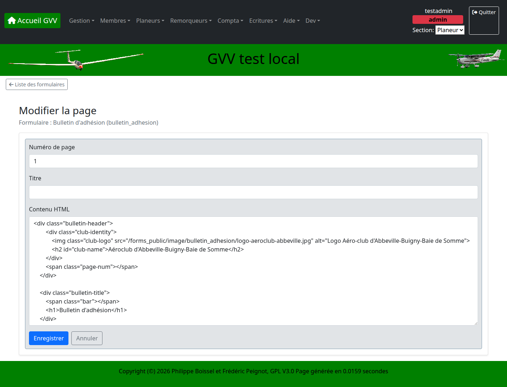

# Gestion des formulaires

Le module formulaires permet de créer des formulaires HTML publiables via un lien public anonyme, de collecter les réponses et de les consulter depuis l'interface d'administration.

Ce mécanisme inspiré des formulaires Google est un moyen pratique d'étendre les fonctionnalités de GVV sans modifier le code. Par rapport à un formulaire papier, il permet la saisie en ligne et gère l'archivage des réponses. Toutes les réponses peuvent être retrouvées facilement dans GVV. 

> 💡 **Envie de construire un formulaire pas à pas ?** Voir le [tutoriel — Créer un formulaire avec l'aide d'un assistant IA](13_formulaires_tutoriel.md), qui construit un exemple complet (3 pages, upload, signature) en s'appuyant sur ChatGPT pour générer le HTML.

## Sommaire

1. [Vue d'ensemble](#vue-densemble)
2. [Interface d'administration](#interface-dadministration)
3. [Types de champs](#types-de-champs)
4. [Règles CSS](#règles-css)
5. [Rôles de champs GVV](#rôles-de-champs-gvv)
6. [Pré-remplissage — mécanisme A (attributs `data-gvv-source`)](#pré-remplissage--mécanisme-a-attributs-data-gvv-source)
7. [Pré-remplissage — mécanisme B (paramètres d'URL)](#pré-remplissage--mécanisme-b-paramètres-durl)
8. [Page de génération](#page-de-génération)
9. [Consulter les réponses](#consulter-les-réponses)
10. [Modifier une réponse déjà soumise](#modifier-une-réponse-déjà-soumise)
11. [Soumission par téléchargement (scan)](#soumission-par-téléchargement-scan)
12. [Sous-formulaires](#sous-formulaires)
13. [Exporter une réponse vers un formulaire de création](#exporter-une-réponse-vers-un-formulaire-de-création)
14. [Exporter / importer un formulaire complet (archive)](#exporter--importer-un-formulaire-complet-archive)
15. [Exemples de formulaires](#exemples-de-formulaires)

---

## Vue d'ensemble

Un formulaire est un ensemble de pages HTML contenant des champs de saisie. Il est publié via un lien public anonyme, et les réponses sont collectées dans GVV. L'administrateur peut consulter les réponses, les exporter en PDF et supprimer celles qui ne sont plus utiles.

Un formulaire permet également de collecter des fichiers (photos, documents PDF, etc.) et des signatures électroniques. Les fichiers sont stockés de manière sécurisée et ne sont accessibles que depuis l'interface d'administration.

Il est possible de remplir un formulaire en une ou plusieurs fois, et de modifier une réponse déjà soumise si le formulaire est conçu pour cela. Cela permet par exemple de suivre la mise en place d'une procédure ou de compléter un dossier. La procédure n'est considérée comme terminées que lorsque tous les documents ont été fournis et touts les champs obligatoires remplis.

J'ai envisagé plusieurs techniques pour permettre aux administrateurs de créer des formulaires sans coder, et j'ai choisi de rester sur du HTML. Ce n'est pas vraiment plus compliqué que de créer des formulaires en pdf ou avec un système de traitement de texte. Cela permet de rendre n'importe quel look, donc de copier assez exactement des formulaires fournis par l'administration. 

Il aurait aussi été possible de faire définir les champs un peu comme la configuration des cartes de membres, en laissant les administrateurs définir les types de champs et leur position dans la page. Cela aurait été beaucoup plus compliqué et n'aurait pas permis à l'utilisateur de visualiser le rendu final du formulaire. Avec le HTML libre, l'administrateur voit exactement ce que verra l'utilisateur final.

De plus les agents IA comme ChatGPT, Claude ou Gemini sont assez compétents pour générer un formulaire en HTML à partir d'une description textuelle pour en convertissant un fichier word ou pdf en HTML.

Un formulaire GVV est composé de :

- **Métadonnées** : titre, code interne, slug public (URL d'accès anonyme), CSS global, statut (brouillon / publié / archivé)
- **Pages** : un formulaire peut comporter plusieurs pages ; chaque page contient du HTML libre et des champs
- **Champs** : éléments de saisie détectés automatiquement dans le HTML de la page (voir [Champs détectés automatiquement](#champs-détectés-automatiquement)) — rien à déclarer séparément
- **Réponses** : soumissions anonymes, consultables et exportables en PDF

Flux de travail :

```
Créer le formulaire → Ajouter des pages (contenu HTML, champs inclus)
→ Publier → Partager le lien public → Consulter les réponses
```

Le lien public a la forme : `http://gvv.net/index.php/forms/{slug-public}`

Le contenu de chaque page (HTML + CSS) est stocké sous forme de fichiers dans `uploads/formulaires/{code}/` — voir [Gérer les pages](#gérer-les-pages) pour ce que ça change concrètement pour l'administrateur.


---

## Interface d'administration

### Créer un formulaire

Navigation : **Formulaires → Nouveau formulaire**


| Champ | Rôle |
|---|---|
| **Code** | Identifiant interne (lettres, chiffres, tirets) |
| **Titre** | Affiché en en-tête du formulaire public |
| **Description** | Texte optionnel affiché sous le titre |
| **Lien public** | Segment d'URL (ex. `inscription-club`) — voir la distinction avec **Code** ci-dessous |
| **CSS scope** | Préfixe optionnel pour isoler le CSS global de ce formulaire des autres |
| **CSS global du formulaire** | Styles injectés dans la page publique et dans la preview admin (voir [Règles CSS](#règles-css)) |
| **Contexte GVV** | Sélecteur(s) de pré-remplissage nécessaires : aucun, membre, instructeur, ou les deux — voir [Pré-remplissage — mécanisme A](#pré-remplissage--mécanisme-a-attributs-data-gvv-source) |
| **Formulaire global** | Rend le formulaire visible dans toutes les sections plutôt que la seule section active |
| **Autoriser la soumission par téléchargement (scan)** | Active le bouton "Télécharger un formulaire prérempli" — voir [Soumission par téléchargement (scan)](#soumission-par-téléchargement-scan) |
| **Traitement après soumission** | Déclenche une action GVV (ex. mise à jour d'un vol de découverte) juste après l'enregistrement de la réponse |
| **Formulaire de création cible (export)** + **Libellé du bouton export** | Si les deux sont renseignés, un bouton apparaît sur chaque réponse pour ouvrir ce formulaire GVV pré-rempli avec les valeurs de la réponse (ex. `membre/create`) |
| **Statut** *(en modification uniquement)* | `brouillon` : non accessible ; `publié` : accessible via le lien public ; `archivé` |

Le **Code** sert de nom de dossier de stockage (`uploads/formulaires/{code}/` : pages HTML, CSS, images) et de clé unique en base pour retrouver le formulaire côté admin. Si l'admin le renomme, GVV renomme aussi le dossier physique correspondant. Il est distinct du **Lien public**, qui est le segment d'URL vu par les visiteurs externes (`forms/{slug}`) : les deux sont indépendants et modifiables séparément une fois le formulaire créé.

### Gérer les pages

Chaque formulaire comporte une ou plusieurs pages affichées séquentiellement. GVV gère automatiquement la navigation Précédent / Suivant et le bouton de soumission finale.

Le contenu HTML de chaque page est la **source de vérité** du formulaire : il n'y a pas de copie séparée des champs à maintenir en base. GVV stocke ce contenu sous forme de fichier, dans `uploads/formulaires/{code}/pageNN.html`, aux côtés du CSS global (`style.css`) et des images éventuelles (`images/`) — voir [Images du formulaire](#images-du-formulaire).

Ce fichier est un document HTML5 autonome (avec son propre `<link rel="stylesheet" href="style.css">`) : il peut s'ouvrir directement dans un navigateur, même sans connexion au serveur GVV — pratique pour relire une mise en page ou dépanner un CSS localement. La zone de texte de l'admin, elle, continue à n'afficher que le contenu utile de la page (sans l'enveloppe HTML) : GVV l'ajoute et la retire automatiquement à l'écriture/la lecture du fichier.




Les champs de saisie (texte, email, liste déroulante, signature, etc.) sont **détectés automatiquement** dans ce contenu HTML — voir [Champs détectés automatiquement](#champs-détectés-automatiquement). Il n'y a pas d'étape de déclaration séparée : ajouter un `<input name="...">` dans la page suffit.

### Images du formulaire

Un formulaire peut avoir besoin d'images propres (logo, en-tête, etc.), séparées du CSS et du HTML. Dans la fiche d'édition d'un formulaire, la carte **Images** permet :

- de **déposer** une image (PNG, JPEG, GIF ou WEBP, 2 Mo maximum) ;
- de consulter la **liste** des images déjà déposées, avec un aperçu miniature ;
- de **copier l'URL** de chaque image, à coller dans un attribut `src="..."` du contenu HTML de la page (ex. ``) ;
- de **supprimer** une image qui n'est plus utilisée.

> Une image collée en base64 directement dans le HTML (comme le fait déjà l'exemple `inscription_bia`) fonctionne toujours, mais alourdit le fichier de la page à chaque relecture. Pour un logo ou une image réutilisée, préférer le dépôt via la carte Images.

### Convertir un formulaire PDF existant

GVV n'intègre pas de convertisseur PDF → HTML automatique. Pour numériser un formulaire existant (papier ou PDF) :

1. Demander à un outil d'IA (Claude, ChatGPT, etc.) de convertir le PDF en HTML, en lui donnant les contraintes de ce document : Bootstrap 5, pas de `<head>`/`<style>` ni de balise `<form>` dans le contenu de page — voir [Règles CSS](#règles-css).
2. Relire et corriger le HTML généré : les champs ne sont pas détectés automatiquement par l'outil d'IA, les attributs `name="..."` doivent être vérifiés ou ajoutés à la main pour que GVV les reconnaisse ensuite — voir [Champs détectés automatiquement](#champs-détectés-automatiquement).
3. Coller le résultat dans le contenu de la page. Aucune déclaration supplémentaire n'est nécessaire : GVV détecte les champs à l'enregistrement de la page.
4. Vérifier le rendu sur la page publique : la fidélité visuelle au PDF d'origine n'est pas garantie et demande souvent des retouches CSS.

**Limites** : pas de détection automatique des champs du PDF source, pas de garantie de fidélité visuelle, relecture manuelle obligatoire avant publication.

### Champs détectés automatiquement

GVV analyse le HTML de chaque page à la volée (à l'affichage public, à l'enregistrement d'une réponse, dans la liste admin des champs) pour en extraire la liste des champs — il n'y a rien à déclarer séparément, ni de bouton "Ajouter un champ".

Sont détectés : tout `<input name="...">`, `<select name="...">` ou `<textarea name="...">` (hors `hidden`, `submit`, `reset`, `button`, `image`), ainsi que les widgets `<div data-gvv-type="signature">` et `<div data-gvv-type="subform">`.

| Propriété détectée | Provenance |
|---|---|
| **Nom technique** | Attribut `name` (ou `data-gvv-name` pour signature/sous-formulaire) |
| **Libellé** | Texte du `<label for="id_du_champ">` correspondant ; à défaut, le nom technique |
| **Type** | Type HTML de l'élément — voir [Types de champs](#types-de-champs) |
| **Obligatoire** | Attribut `required` sur l'élément (`data-gvv-required="true"` pour signature/sous-formulaire) |
| **Options** | Options du `<select>`, ou boutons `radio`/`checkbox` partageant le même `name` |

Deux attributs optionnels complètent le comportement d'un champ, sans équivalent visuel dans le rendu :

| Attribut | Effet |
|---|---|
| `data-gvv-identifier="true"` | La valeur de ce champ est concaténée avec celles des autres champs identifiants pour former l'identifiant affiché dans la [liste des réponses](#consulter-les-réponses) |
| `data-gvv-validation="regle1\|regle2"` | Règles de validation serveur supplémentaires, en plus du type. Reconnues : `max_length[n]`, `min_length[n]`, `valid_email`, `numeric` |

```html
<input type="text" name="numero_licence"
       data-gvv-identifier="true"
       data-gvv-validation="max_length[10]|numeric">
```

Depuis **Gérer les pages**, le bouton **"Champs"** d'une page affiche la liste en lecture seule de ce que GVV a détecté — utile pour vérifier qu'un `name` n'a pas été oublié après un copier-coller. Toute correction se fait en modifiant directement le HTML de la page (bouton **"Modifier la page"**), pas depuis cette liste.

> **Important** : c'est l'attribut `name` de l'élément HTML qui identifie le champ pour GVV — aucune correspondance à saisir ailleurs. Renommer ce `name` change l'identité du champ (les réponses déjà soumises sous l'ancien nom ne sont pas rattachées automatiquement au nouveau).

---

## Types de champs

| Type | Élément HTML | Notes |
|---|---|---|
| `text` | `<input type="text">` | — |
| `email` | `<input type="email">` | Format email RFC validé côté serveur |
| `date` | `<input type="date">` | Format `YYYY-MM-DD`, date réelle vérifiée |
| `number` | `<input type="number">` | Valeur numérique |
| `textarea` | `<textarea>` | — |
| `select` | `<select>` | Options = les `<option value="...">` du HTML |
| `radio` | `<input type="radio">` (groupe) | Options = les valeurs des boutons partageant le même `name` |
| `checkbox` | `<input type="checkbox">` (groupe) | `name="champ[]"` pour les valeurs multiples |
| `file` | `<input type="file">` | MIME et taille contrôlés |
| `signature` | `<div data-gvv-type="signature" ...>` | Widget interactif — voir ci-dessous |

### Exemples HTML par type

```html
<!-- text -->
<div class="mb-3">
  <label class="form-label" for="nom">Nom <span class="text-danger">*</span></label>
  <input type="text" class="form-control" id="nom" name="nom" required>
</div>

<!-- email -->
<div class="mb-3">
  <label class="form-label" for="email">Adresse email</label>
  <input type="email" class="form-control" id="email" name="email">
</div>

<!-- date -->
<div class="mb-3">
  <label class="form-label" for="date_naissance">Date de naissance</label>
  <input type="date" class="form-control" id="date_naissance" name="date_naissance">
</div>

<!-- number -->
<div class="mb-3">
  <label class="form-label" for="heures">Nombre d'heures</label>
  <input type="number" class="form-control" id="heures" name="heures" min="0" step="0.5">
</div>

<!-- textarea -->
<div class="mb-3">
  <label class="form-label" for="commentaire">Commentaire</label>
  <textarea class="form-control" id="commentaire" name="commentaire" rows="4"></textarea>
</div>

<!-- select (options = les <option> ci-dessous : Masculin / Féminin / Autre) -->
<div class="mb-3">
  <label class="form-label" for="genre">Genre</label>
  <select class="form-select" id="genre" name="genre">
    <option value="">-- Choisir --</option>
    <option value="Masculin">Masculin</option>
    <option value="Féminin">Féminin</option>
    <option value="Autre">Autre</option>
  </select>
</div>

<!-- radio (options = les valeurs des boutons partageant name="licencie" : Oui / Non) -->
<div class="mb-3">
  <label class="form-label d-block">Licencié FFVV ?</label>
  <div class="form-check form-check-inline">
    <input class="form-check-input" type="radio" name="licencie" id="lic_oui" value="Oui">
    <label class="form-check-label" for="lic_oui">Oui</label>
  </div>
  <div class="form-check form-check-inline">
    <input class="form-check-input" type="radio" name="licencie" id="lic_non" value="Non">
    <label class="form-check-label" for="lic_non">Non</label>
  </div>
</div>

<!-- checkbox — le [] dans name regroupe les valeurs cochées en tableau à la soumission -->
<div class="mb-3">
  <label class="form-label d-block">Disponibilités</label>
  <div class="form-check form-check-inline">
    <input class="form-check-input" type="checkbox" name="dispo[]" id="lundi" value="Lundi">
    <label class="form-check-label" for="lundi">Lundi</label>
  </div>
  <div class="form-check form-check-inline">
    <input class="form-check-input" type="checkbox" name="dispo[]" id="mardi" value="Mardi">
    <label class="form-check-label" for="mardi">Mardi</label>
  </div>
</div>

<!-- file -->
<div class="mb-3">
  <label class="form-label" for="photo">Photo d'identité</label>
  <input type="file" class="form-control" id="photo" name="photo" accept="image/jpeg,image/png">
  <div class="form-text">Formats acceptés : JPG, PNG. Taille maximale : 2 Mo.</div>
</div>
```

### Champ signature

Le champ signature est un widget interactif qui offre trois modes à l'utilisateur : dessin à la souris/tactile, import d'une image, ou frappe au clavier (rendue en écriture manuscrite). La valeur est transmise comme image PNG encodée en base64.

**Déclaration dans le HTML :**

```html
<div data-gvv-type="signature"
     data-gvv-name="signature_candidat"
     data-gvv-required="true">
  Signature du candidat
</div>
```

| Attribut | Rôle |
|---|---|
| `data-gvv-type="signature"` | Identifie le widget (obligatoire) |
| `data-gvv-name` | Nom technique du champ — voir [Champs détectés automatiquement](#champs-détectés-automatiquement) |
| `data-gvv-required` | `true` = champ obligatoire |

GVV remplace automatiquement ce `<div>` par le widget interactif lors du rendu public. Le texte contenu dans le div sert de libellé affiché au-dessus du widget.

**Aperçu hors ligne** : comme le fichier de la page est ouvrable directement dans un navigateur (voir [Gérer les pages](#gérer-les-pages)), il est utile d'ajouter une image de repère à l'intérieur du `<div>` du widget, pour qu'il reste visuellement identifiable même sans passer par GVV. GVV ignore cette image au rendu réel (le `<div>` entier est remplacé par le widget fonctionnel) :

```html
<div data-gvv-type="signature"
     data-gvv-name="signature_candidat"
     data-gvv-required="true">
  <br>
  Signature du candidat
</div>
```

---

## Règles CSS

### Principe : la balise `<head>` est supprimée

Lors du rendu dans GVV, seul le contenu du `<body>` est utilisé. Les éléments suivants sont **supprimés automatiquement** :

- `<!DOCTYPE>`, `<html>`, `<head>`, `<body>`
- Tout le contenu de `<head>` — **`<style>` et `@import url(...)` placés dans `<head>` sont perdus**
- Les balises `<form>`, les boutons `type="submit"` et `type="reset"` (GVV gère la navigation)

### Ce qui fonctionne

**1. Classes Bootstrap 5 (recommandé)** — Bootstrap est chargé par GVV, ses classes sont disponibles directement.

Classes Bootstrap utiles :

| Usage | Classe |
|---|---|
| Grille 12 colonnes | `row`, `col-md-3`, `col-md-6`, `col-12` |
| Espacement de grille | `g-3` sur le `row` |
| Champ texte/date/number/file | `form-control` |
| Liste déroulante | `form-select` |
| Case à cocher / radio | `form-check`, `form-check-input`, `form-check-label` |
| Libellé | `form-label` |
| Texte d'aide | `form-text` |
| Champ obligatoire | `<span class="text-danger">*</span>` |
| Groupement visuel | `card`, `card-body` |

**2. CSS dans le champ `global_css` du formulaire** — pour les styles personnalisés, utiliser le champ CSS global de l'interface admin. Ce CSS est injecté dans la page publique avant le formulaire.

Portée recommandée : `.forms-public-root` (classe appliquée automatiquement au conteneur).

```css
.forms-public-root .section-titre {
  font-size: 0.75rem;
  font-weight: 700;
  text-transform: uppercase;
  letter-spacing: 0.08em;
  color: #2d465a;
  border-left: 3px solid #3b6f8f;
  padding-left: 8px;
  margin-bottom: 0.75rem;
}
```

### Ce qui ne fonctionne pas

| Pratique | Pourquoi ça échoue |
|---|---|
| `<style>` dans `<head>` | Supprimé avec `<head>` |
| `@import url(...)` de polices dans `<head>` | Supprimé avec `<head>` |
| Sélecteurs nus `input`, `label` sans portée | Conflits avec Bootstrap 5 |
| `<form>` dans le HTML | Supprimé ; GVV génère sa propre balise `<form>` |
| `<button type="submit">` | Supprimé ; GVV génère les boutons de navigation |

### Développement local

Développer le HTML comme un fichier autonome avec CSS inline dans `<head>` pour la prévisualisation. Lors de l'import dans GVV :

1. Copier uniquement le contenu du `<body>` dans le champ `content_html`
2. Déplacer le CSS dans le champ `global_css`, scopé avec `.forms-public-root`
3. Supprimer les `<form>`, les boutons `submit`/`reset` et les `@import` de polices

---

## Rôles de champs GVV

L'attribut `data-gvv-role` sur un `<input>` ou `<textarea>` permet à GVV d'enregistrer la valeur saisie comme métadonnée de la réponse (nom et email du soumettant), visible dans la liste des réponses admin.

| Valeur `data-gvv-role` | Effet |
|---|---|
| `submitter_name` | La valeur est enregistrée comme **nom du soumettant** |
| `submitter_email` | La valeur est enregistrée comme **email du soumettant** |

```html
<input type="text" class="form-control" name="nom_complet"
       data-gvv-role="submitter_name">

<input type="email" class="form-control" name="email"
       data-gvv-role="submitter_email">
```

Quand un utilisateur GVV connecté soumet un formulaire, GVV complète ces métadonnées automatiquement avec ses informations de profil, même sans champs explicites.

---

## Pré-remplissage — mécanisme A (attributs `data-gvv-source`)

Le mécanisme A permet de pré-remplir des champs HTML avec des données issues de GVV (membres, événements, configuration club, date du jour) en déclarant des attributs `data-gvv-*` directement sur les éléments `<input>`, `<textarea>`, `<select>` ou sur les `<div data-gvv-type="signature">`.

### Attributs

| Attribut | Rôle |
|---|---|
| `data-gvv-source` | Source de la donnée à injecter (voir taxonomie ci-dessous) |
| `data-gvv-lock` | `true` = champ readonly à l'affichage **et** valeur GVV imposée à la soumission |

Le login du pilote et de l'instructeur sont transmis dans l'URL :
```
…/forms/mon-formulaire?pilot_login=dupont_j&instructor_login=martin_p
```

### Exemple

```html
<!-- Nom du candidat (verrouillé) -->
<input name="candidat_nom" type="text"
       data-gvv-source="member.nom_prenom"
       data-gvv-lock="true">

<!-- Numéro ITP de l'instructeur (verrouillé) -->
<input name="num_itp" type="text"
       data-gvv-source="instructor.event.itp.numero"
       data-gvv-lock="true">

<!-- Organisme de formation (paramètre de configuration) -->
<input name="organisme" type="text"
       data-gvv-source="config.organisme_formation">

<!-- Date du jour (automatique, pas de paramètre URL) -->
<input name="date_signature" type="date"
       data-gvv-source="date.today">

<!-- Signature de l'instructeur (pré-remplie, remplaçable) -->
<div data-gvv-type="signature"
     data-gvv-name="signature_instructeur"
     data-gvv-source="instructor.event.itp.signature"
     data-gvv-lock="false">Signature instructeur</div>
```

### Taxonomie des sources

#### Configuration et données club

| Source | Donnée |
|---|---|
| `config.<cle>` | Paramètre de configuration club (table `form_config_params`) |
| `club.nom` | Nom du club |
| `club.sigle` | Sigle du club |
| `club.adresse` | Adresse |
| `club.ville` | Ville |
| `club.email` | Email du club |

#### Membre / pilote — table `membres` (nécessite `pilot_login` dans l'URL)

| Source | Donnée |
|---|---|
| `member.nom` | Nom de famille |
| `member.prenom` | Prénom |
| `member.nom_prenom` | "Nom Prénom" |
| `member.email` | Email |
| `member.telephone` | Téléphone fixe, ou mobile si vide |
| `member.adresse` | Adresse |
| `member.code_postal` | Code postal |
| `member.ville` | Ville |
| `member.adresse_complete` | "Adresse, CP Ville" |
| `member.date_naissance` | Date de naissance (JJ/MM/AAAA) |
| `member.lieu_naissance` | Lieu de naissance |
| `member.date_lieu_naissance` | "JJ/MM/AAAA à Ville" |
| `member.signature` | Signature enregistrée dans le profil |

#### Événements / qualifications du pilote — table `events` (nécessite `pilot_login`)

| Source | Donnée |
|---|---|
| `member.event.{type_key}.numero` | Numéro de qualification (`ecomment`) |
| `member.event.{type_key}.expiry` | Date d'expiration |
| `member.event.{type_key}.date` | Date de l'événement |
| `member.event.{type_key}.signature` | Signature associée à l'événement |

#### Instructeur — table `membres` (nécessite `instructor_login` dans l'URL)

Mêmes sources que `member.*`, préfixées par `instructor.*` :
`instructor.nom_prenom`, `instructor.email`, `instructor.signature`, etc.

#### Événements / qualifications de l'instructeur — table `events`

| Source | Donnée |
|---|---|
| `instructor.event.{type_key}.numero` | Numéro de qualification |
| `instructor.event.{type_key}.expiry` | Date d'expiration |
| `instructor.event.{type_key}.date` | Date de l'événement |
| `instructor.event.{type_key}.signature` | Signature associée à l'événement |

#### Utilisateur connecté — même champs que `member.*` sans paramètre URL

Préfixe `user.*` : résolu depuis la session GVV courante.

#### Dates calculées

| Source | Donnée |
|---|---|
| `date.today` | Date du jour au format `YYYY-MM-DD` |
| `date.today_fr` | Date du jour au format `JJ/MM/AAAA` |
| `date.year` | Année en cours |

#### Clés `{type_key}` disponibles

| `{type_key}` | Qualification |
|---|---|
| `itp` | ITP (Instructeur de Planeur) |
| `itv` | ITV |
| `fi_spl` | FI Sailplane |
| `fe_spl` | FE Sailplane |
| `fi_ulm` | FI ULM |
| `fe_ulm` | FE ULM |
| `controle_competence` | Contrôle de compétence |
| `visite_medicale` | Visite médicale |
| `bpp` | BPP |
| `spl` | SPL |

---

## Pré-remplissage — mécanisme B (paramètres d'URL)

Le mécanisme B permet de pré-remplir des champs à partir de **valeurs passées directement dans l'URL**, sans aucun attribut `data-gvv-*` dans le HTML. C'est le mécanisme naturel quand le contexte vient d'une entité GVV autre qu'un membre (vol de découverte, réservation, dossier).

### Principe

Tout paramètre d'URL dont le nom correspond à un `name=` d'un champ du formulaire est injecté comme valeur par défaut. Les valeurs sont stockées en session par slug et persistent sur toutes les pages du formulaire.

```
/forms/{slug}
  ?{nom_champ}={valeur}    ← injecté dans le champ correspondant
  &lock[]={nom_champ}      ← champ readonly + valeur imposée à la soumission
```

**Noms réservés** (jamais injectés dans un champ) : `page`, `token`, `vld_id`, `pilot_login`, `instructor_login`, `lock`.

### Rôle de `lock[]`

Sans `lock[]`, la valeur est une **suggestion** : le champ est pré-rempli mais l'utilisateur peut le modifier.

Avec `lock[]`, la protection est double :
- **Affichage** : le champ reçoit l'attribut `readonly` — l'utilisateur voit la valeur mais ne peut pas la changer.
- **Soumission** : même si la valeur POST est falsifiée (modification du HTML côté client), le serveur réinjecte la valeur stockée en session. Il est impossible de soumettre une valeur différente.

### Exemple — briefing passager ULM

Un workflow GVV (vol de découverte) génère ce lien et l'envoie au passager :

```
/forms/briefing-passager-ulm
  ?date_vol=2026-07-15
  &site_decollage=Abbeville
  &identification_ulm=F-JXXX
  &nom=Dupont
  &personne_a_prevenir=Marie+Dupont
  &lock[]=date_vol
  &lock[]=site_decollage
  &lock[]=identification_ulm
```

Résultat :

| Champ | Valeur | Comportement |
|---|---|---|
| `date_vol` | 2026-07-15 | Readonly — valeur imposée (données VLD) |
| `site_decollage` | Abbeville | Readonly — valeur imposée |
| `identification_ulm` | F-JXXX | Readonly — valeur imposée |
| `nom` | Dupont | Pré-rempli — modifiable (suggestion) |
| `personne_a_prevenir` | Marie Dupont | Pré-rempli — modifiable (suggestion) |

### Coexistence avec le mécanisme A

Les deux mécanismes peuvent coexister dans le même formulaire. Les sources automatiques (`date.today`, `config.*`, `club.*`) utilisent toujours le mécanisme A. Le mécanisme B cible les champs par `name=` sans aucun attribut HTML supplémentaire.

Priorité appliquée (du plus au moins prioritaire) :
1. **Erreur de validation** (re-affichage après soumission refusée)
2. **Mécanisme A** (`data-gvv-source`)
3. **Mécanisme B** (paramètres d'URL)

---

## Page de génération

Pour les formulaires qui nécessitent un contexte GVV (membre, instructeur), l'administrateur peut utiliser la **page de génération** plutôt que de construire l'URL manuellement.

La page de génération est accessible via le bouton **"Générer"** dans la liste des formulaires, disponible uniquement pour les formulaires dont le champ `Paramètres requis` est différent de `aucun`.

### Configuration du formulaire

Dans la fiche admin du formulaire, le champ **Paramètres requis** définit quels sélecteurs apparaissent sur la page de génération :

| Valeur | Sélecteurs affichés |
|---|---|
| `aucun` | Aucun — pas de bouton "Générer" |
| `pilote` | Sélecteur membre (pilote) |
| `instructeur` | Sélecteur membre (instructeur) |
| `pilote + instructeur` | Les deux sélecteurs |

### Utilisation

1. Cliquer sur **"Générer"** dans la liste des formulaires.
2. Sélectionner le pilote et/ou l'instructeur selon la configuration.
3. Cliquer sur **"Ouvrir le formulaire"** : GVV construit l'URL avec `pilot_login` et/ou `instructor_login` et ouvre le formulaire pré-rempli.

Le mécanisme A (`data-gvv-source`) est alors actif : tous les champs annotés sont pré-remplis depuis les données GVV des membres sélectionnés.

---

## Consulter les réponses

Navigation : **Formulaires → [nom du formulaire] → Réponses**

La liste affiche, pour chaque soumission, deux colonnes distinctes en plus de la date et des actions :

- **Identification** : valeur des champs marqués `data-gvv-identifier="true"` (voir [Champs détectés automatiquement](#champs-détectés-automatiquement)), concaténés ; pour une [réponse déposée par scan](#soumission-par-téléchargement-scan), c'est le commentaire saisi au dépôt.
- **Soumis par** : nom et/ou email captés via [`data-gvv-role`](#rôles-de-champs-gvv), ou "Anonyme" si aucun champ n'est ainsi marqué.

### Ouvrir une réponse

Le bouton **"Ouvrir"** affiche le détail d'une réponse en ligne :

- toutes les valeurs saisies, champ par champ, avec leur libellé et leur type ;
- les fichiers joints (champs de type `file` et signatures) avec **aperçu intégré** : une image est affichée directement, un PDF s'affiche dans un cadre de prévisualisation intégré à la page ; les boutons "Aperçu" (nouvel onglet) et "Télécharger" restent disponibles pour tout type de fichier.

### Export PDF imprimable

Le bouton **"PDF"** ouvre une version imprimable de la réponse (page HTML avec un bouton "Imprimer / Enregistrer en PDF"), reprenant le CSS global du formulaire.

### Téléchargement sécurisé des fichiers

Les fichiers joints (uploads et signatures) ne sont accessibles que depuis l'interface d'administration, à un utilisateur authentifié ayant accès à la section du formulaire — jamais par une URL prévisible côté public. Le navigateur n'est pas autorisé à mettre ces fichiers en cache.

### Rétention

Les réponses et leurs fichiers sont conservés sans limite de durée ; il n'y a pas d'expiration automatique. La suppression (bouton "Supprimer") est manuelle et retire à la fois la réponse, ses valeurs et les fichiers associés (y compris les miniatures).

---

## Modifier une réponse déjà soumise

Pour utiliser un formulaire comme support de suivi de procédure (attestation à compléter, dossier à mettre à jour...), une réponse déjà envoyée peut être rouverte et corrigée sans créer une nouvelle réponse.

### Déclencher la modification

Le bouton **"Modifier"** apparaît à côté de "Ouvrir" et "PDF" :

- dans la liste des réponses d'un formulaire ;
- dans le détail d'une réponse (bouton en haut à droite).

Il n'est disponible que pour les réponses saisies en ligne. Une réponse envoyée par [téléchargement de scan](#soumission-par-téléchargement-scan) ne peut pas être modifiée par ce mécanisme — seule la rotation du fichier déposé est possible pour ce type de réponse.

Seul un administrateur ayant accès à la section du formulaire peut déclencher une modification ; ce n'est pas un lien renvoyé à la personne qui a rempli le formulaire.

### Formulaire pré-rempli

Le bouton rouvre le formulaire public, page par page, avec les valeurs déjà soumises :

- les champs texte, date, nombre, case à cocher, liste déroulante, etc. affichent leur valeur enregistrée ;
- un champ **fichier** déjà soumis affiche le nom du fichier existant avec un lien pour le consulter ; laisser le champ vide à la resoumission **conserve** le fichier, en choisir un nouveau le **remplace** ;
- un champ **signature** déjà soumis affiche la signature existante en aperçu ; ne pas y toucher **conserve** la signature initiale, dessiner/téléverser/taper une nouvelle signature la **remplace**.

### Enregistrer les modifications

Le bouton **"Enregistrer les modifications"** valide et enregistre la réponse en place :

- l'identifiant de la réponse ne change pas — ce n'est pas une nouvelle réponse ;
- la date de soumission initiale, le rattachement éventuel à une entité GVV et le mode de soumission ne sont pas modifiés ;
- quand un fichier ou une signature est remplacé, l'ancien est supprimé du stockage une fois le nouveau enregistré avec succès ;
- le détail de la réponse affiche alors une **date de dernière modification**, en plus de la date de soumission initiale.

---

## Soumission par téléchargement (scan)

Pour certains formulaires (attestations à signer, documents administratifs), il est plus simple pour l'utilisateur d'imprimer le formulaire, de le remplir à la main, puis de téléverser une photo ou un scan de la page remplie plutôt que de ressaisir chaque champ en ligne. GVV propose cette alternative en complément — jamais à la place — de la saisie en ligne habituelle.

### Activer la fonctionnalité sur un formulaire

Dans la fiche admin du formulaire (création ou modification), cocher **"Autoriser la soumission par téléchargement (scan)"** :


Cette option est désactivée par défaut : chaque formulaire décide individuellement s'il accepte ce mode de réponse.

### Côté public

Quand l'option est active, un bouton **"Télécharger un formulaire prérempli"** apparaît à côté du bouton d'envoi habituel, sur la dernière page du formulaire. Il ouvre une fenêtre de dépôt de fichier (glisser-déposer ou sélection sur le disque) avec un champ de commentaire libre :


- **Formats acceptés** : PDF, JPG, PNG, GIF, WEBP.
- **Un seul fichier par réponse.**
- Le commentaire est optionnel ; il sert d'**identifiant** de la réponse dans la liste admin (voir ci-dessous).
- Cette soumission est indépendante de la saisie en ligne : les champs de la page ne sont pas utilisés pour ce mode.

### Côté admin — liste des réponses

Le bouton "Télécharger un formulaire prérempli" est aussi disponible en haut de la liste des réponses, pour qu'un administrateur puisse déposer une réponse au nom d'un usager.

Dans la liste, une réponse envoyée par téléchargement se distingue des réponses classiques :


- **Colonne Identification** : le commentaire saisi lors du dépôt.
- **Miniature cliquable** à la place du bouton "Générer PDF" — un clic ouvre le fichier en grand.
- **Rotation** (boutons ↺ / ↻) : pour redresser un scan ou une photo qui n'a pas été prise droite. La rotation modifie le fichier stocké.
- Pas de bouton "Ouvrir" : il n'y a pas de champs à afficher pour ce type de réponse, seulement le fichier déposé.
- La **suppression** de la réponse supprime aussi le fichier et sa miniature.

---

## Sous-formulaires

Un formulaire peut inclure un lien vers un **autre** formulaire GVV, ouvert dans un **nouvel onglet** — jamais en iframe ni fusionné dans la page, pour que chaque formulaire garde son propre CSS/JS. Une fois le sous-formulaire rempli, un résumé lecture seule de sa réponse s'affiche dans le formulaire maître.

**Déclaration dans le HTML :**

```html
<div data-gvv-type="subform"
     data-gvv-name="briefing_passager"
     data-gvv-form-slug="briefing-passager-ulm"
     data-gvv-required="true">
  Briefing passager
</div>
```

| Attribut | Rôle |
|---|---|
| `data-gvv-type="subform"` | Identifie le widget (obligatoire) |
| `data-gvv-name` | Nom technique du widget |
| `data-gvv-form-slug` | Lien public (`public_slug`) du formulaire à ouvrir comme sous-formulaire |
| `data-gvv-required` | `true` = le formulaire maître ne peut être soumis sans réponse liée au sous-formulaire |

Comme pour le [champ signature](#champ-signature), une image de repère peut être ajoutée dans le `<div>` pour que le widget reste identifiable à l'ouverture directe du fichier de la page :

```html
<div data-gvv-type="subform"
     data-gvv-name="briefing_passager"
     data-gvv-form-slug="briefing-passager-ulm"
     data-gvv-required="true">
  <br>
  Briefing passager
</div>
```

### Déroulement pour l'utilisateur

1. **Remplir le sous-formulaire** — clic sur le lien, ouverture dans un nouvel onglet.
2. **J'ai terminé, vérifier** — de retour sur l'onglet du maître, ce bouton devient visible ; un clic vérifie si la réponse a bien été enregistrée, sans recharger la page (la saisie déjà en cours sur les autres champs du maître n'est jamais perdue).
3. **Résumé affiché** — une fois la réponse trouvée, un résumé lecture seule des valeurs saisies remplace le lien, avec un bouton **Remplir à nouveau** pour recommencer une réponse indépendante.

Si le widget est obligatoire, la soumission du formulaire maître est bloquée tant que le sous-formulaire n'a pas été vérifié comme rempli.

### Rattachement au formulaire maître

Avant que le maître ne soit soumis, la réponse du sous-formulaire n'est reliée à rien de définitif : un jeton technique (`link_token`) assure la correspondance le temps de la saisie. À la soumission finale du maître, cette réponse est rattachée à lui de façon durable.

Si l'utilisateur remplit le sous-formulaire mais ne termine jamais le formulaire maître, la réponse du sous-formulaire est **conservée** (jamais supprimée automatiquement) et apparaît dans la liste des réponses avec le badge **Non rattaché**.

> **Cas particulier** : si le formulaire utilisé comme sous-formulaire est par ailleurs rattaché directement à un enregistrement GVV (ex. `briefing-passager-ulm` rattaché à un vol de découverte), cet attachement d'origine est toujours prioritaire et n'est jamais remplacé par le rattachement au formulaire maître.

### Limites (V1)

- Un seul niveau d'imbrication : un sous-formulaire ne peut pas lui-même contenir un widget sous-formulaire.
- Une seule réponse liée par widget (pas de sous-formulaire répétable).
- Pas d'édition en place d'une réponse de sous-formulaire déjà soumise — seulement une nouvelle soumission complète (« Remplir à nouveau »).

---

## Exporter une réponse vers un formulaire de création

Un formulaire peut déclarer une **cible d'export** : un formulaire de création GVV standard (ex. création de membre) à ouvrir, pré-rempli, à partir des valeurs d'une réponse. Contrairement au pré-remplissage GVV (mécanismes A et B ci-dessus), le sens du flux est ici inversé : c'est une réponse `forms` qui alimente un formulaire GVV situé en dehors du module.

### Configurer un formulaire

Dans l'admin d'édition d'un formulaire, deux champs optionnels :

- **Formulaire de création cible** : chemin relatif du contrôleur/méthode GVV à ouvrir (ex. `membre/create`).
- **Libellé du bouton export** : texte affiché sur le bouton dans la liste des réponses.

Le bouton n'apparaît que si **les deux** champs sont renseignés.

### Fonctionnement

Depuis la liste des réponses, un clic sur le bouton ouvre le formulaire cible avec un paramètre par champ de la réponse :

```
membre/create?mnom=Dupont&memail=dupont%40example.com
```

Règles de construction :

- un paramètre par champ, nommé comme le **nom technique** du champ source — il doit être identique au nom de colonne attendu côté formulaire cible (ex. `mnom` pour le nom d'un membre) ;
- les champs de type **fichier**, **signature** et **sous-formulaire** sont toujours exclus (pas de valeur exploitable en paramètre d'URL) ;
- les champs à **choix multiples** (ex. liste déroulante à sélection multiple) sont exclus en V1.

> Il n'y a pas de correspondance configurable entre noms de champs : nommer un champ du formulaire source comme la colonne GVV attendue est à la charge de l'administrateur qui configure l'export.

### Sécurité

Le bouton n'est visible que dans la liste admin des réponses, déjà protégée par l'authentification GVV. Ouvrir le lien pré-rempli ne fait qu'afficher un formulaire de création déjà soumis à la validation standard : aucune donnée n'est enregistrée tant que l'administrateur ne valide pas explicitement ce formulaire.

---

## Exporter / importer un formulaire complet (archive)

Un formulaire (pages HTML, CSS, images, métadonnées) peut être manipulé comme un seul fichier ZIP téléchargeable — utile pour une sauvegarde avant une modification risquée, un transfert entre installations GVV, ou le partage d'un formulaire entre clubs.

### Sauvegarder

Dans la fiche d'édition d'un formulaire, le bouton **"Sauvegarder (ZIP)"** télécharge une archive contenant :

- les pages HTML et le CSS global ;
- les images déposées via la carte [Images du formulaire](#images-du-formulaire) ;
- les métadonnées du formulaire (titre, description, portée CSS, slug public, paramètres requis).

### Importer comme nouveau formulaire

Depuis la liste des formulaires, le bouton **"Import depuis sauvegarde"** crée un **nouveau** formulaire à partir d'une archive. Si le code du formulaire sauvegardé existe déjà, GVV lui ajoute automatiquement un suffixe (`_2`, `_3`, ...) plutôt que d'échouer ou d'écraser l'existant.

### Restaurer un formulaire existant

Dans la fiche d'édition d'un formulaire, la section **"Sauvegarde et restauration"** permet aussi de déposer une archive pour **remplacer** le contenu du formulaire courant (pages, CSS, images, métadonnées). Le code, le statut et le lien public du formulaire ne sont **pas** modifiés par une restauration.

> Une restauration remplace intégralement le contenu existant — les pages et images qui ne figurent pas dans l'archive déposée sont supprimées. Faire une sauvegarde avant de restaurer si le contenu actuel doit être conservé en cas d'erreur.

---

## Exemples de formulaires

### Exemple 1 — Formulaire minimaliste

Un formulaire d'une page avec trois champs. Aucun CSS personnalisé.

**Champs détectés automatiquement dans le HTML ci-dessous :**

| Nom technique | Type | Obligatoire |
|---|---|---|
| `nom` | text | Oui |
| `email` | email | Oui |
| `message` | textarea | Non |

**Contenu HTML :**

```html
<div class="mb-3">
  <label class="form-label" for="nom">Nom <span class="text-danger">*</span></label>
  <input type="text" class="form-control" id="nom" name="nom" required>
</div>

<div class="mb-3">
  <label class="form-label" for="email">Email <span class="text-danger">*</span></label>
  <input type="email" class="form-control" id="email" name="email" required>
</div>

<div class="mb-3">
  <label class="form-label" for="message">Message</label>
  <textarea class="form-control" id="message" name="message" rows="5"></textarea>
</div>
```

---

### Exemple 2 — Formulaire d'inscription membre avec signature

Formulaire réaliste couvrant tous les types de champs supportés, y compris la signature.


**Champs détectés automatiquement dans le HTML ci-dessous :**

| Nom technique | Type | Obligatoire |
|---|---|---|
| `nom` | text | Oui |
| `prenom` | text | Oui |
| `date_naissance` | date | Non |
| `lieu_naissance` | text | Non |
| `genre` | select | Non |
| `licencie` | radio | Non |
| `disponibilites` | checkbox | Non |
| `photo` | file | Non |
| `email` | email | Oui |
| `telephone` | text | Non |
| `commentaire` | textarea | Non |
| `signature_candidat` | signature | Oui |

**Contenu HTML de la page :**

```html
<!-- Section Identité -->
<div class="bloc-section">
  <div class="section-titre">Identité</div>
  <div class="row g-3 mb-3">
    <div class="col-md-6">
      <label class="form-label" for="nom">Nom <span class="text-danger">*</span></label>
      <input type="text" class="form-control" id="nom" name="nom" required>
    </div>
    <div class="col-md-6">
      <label class="form-label" for="prenom">Prénom <span class="text-danger">*</span></label>
      <input type="text" class="form-control" id="prenom" name="prenom" required>
    </div>
  </div>
  <div class="row g-3 mb-3">
    <div class="col-md-4">
      <label class="form-label" for="date_naissance">Date de naissance</label>
      <input type="date" class="form-control" id="date_naissance" name="date_naissance">
    </div>
    <div class="col-md-4">
      <label class="form-label" for="lieu_naissance">Lieu de naissance</label>
      <input type="text" class="form-control" id="lieu_naissance" name="lieu_naissance">
    </div>
    <div class="col-md-4">
      <label class="form-label" for="genre">Genre</label>
      <select class="form-select" id="genre" name="genre">
        <option value="">-- Choisir --</option>
        <option value="Masculin">Masculin</option>
        <option value="Féminin">Féminin</option>
        <option value="Autre">Autre</option>
      </select>
    </div>
  </div>
  <div class="mb-3">
    <label class="form-label d-block">Licencié FFVV ?</label>
    <div class="form-check form-check-inline">
      <input class="form-check-input" type="radio" name="licencie" id="lic_oui" value="Oui">
      <label class="form-check-label" for="lic_oui">Oui</label>
    </div>
    <div class="form-check form-check-inline">
      <input class="form-check-input" type="radio" name="licencie" id="lic_non" value="Non">
      <label class="form-check-label" for="lic_non">Non</label>
    </div>
  </div>
  <div class="mb-3">
    <label class="form-label d-block">Disponibilités</label>
    <div class="form-check form-check-inline">
      <input class="form-check-input" type="checkbox" name="disponibilites[]" id="lundi" value="Lundi">
      <label class="form-check-label" for="lundi">Lundi</label>
    </div>
    <div class="form-check form-check-inline">
      <input class="form-check-input" type="checkbox" name="disponibilites[]" id="mardi" value="Mardi">
      <label class="form-check-label" for="mardi">Mardi</label>
    </div>
    <div class="form-check form-check-inline">
      <input class="form-check-input" type="checkbox" name="disponibilites[]" id="mercredi" value="Mercredi">
      <label class="form-check-label" for="mercredi">Mercredi</label>
    </div>
  </div>
</div>

<!-- Section Photo -->
<div class="bloc-section">
  <div class="section-titre">Photo</div>
  <div class="mb-3">
    <label class="form-label" for="photo">Photo d'identité</label>
    <input type="file" class="form-control" id="photo" name="photo" accept="image/jpeg,image/png">
    <div class="form-text">JPG ou PNG, 2 Mo maximum.</div>
  </div>
</div>

<!-- Section Contact -->
<div class="bloc-section">
  <div class="section-titre">Contact</div>
  <div class="row g-3 mb-3">
    <div class="col-md-6">
      <label class="form-label" for="email">Email <span class="text-danger">*</span></label>
      <input type="email" class="form-control" id="email" name="email" required>
    </div>
    <div class="col-md-6">
      <label class="form-label" for="telephone">Téléphone</label>
      <input type="text" class="form-control" id="telephone" name="telephone">
    </div>
  </div>
  <div class="mb-3">
    <label class="form-label" for="commentaire">Commentaire</label>
    <textarea class="form-control" id="commentaire" name="commentaire" rows="4"></textarea>
  </div>
</div>

<!-- Signature -->
<div class="bloc-section">
  <div class="section-titre">Signature</div>
  <div data-gvv-type="signature"
       data-gvv-name="signature_candidat"
       data-gvv-required="true">
    Signature du candidat
  </div>
</div>
```

**CSS global du formulaire :**

```css
.forms-public-root .bloc-section {
  border: 1px solid #c9d4dd;
  border-radius: 8px;
  padding: 1rem 1.2rem;
  margin-bottom: 1rem;
  background: #f9fbfc;
}

.forms-public-root .section-titre {
  font-size: 0.7rem;
  font-weight: 700;
  text-transform: uppercase;
  letter-spacing: 0.1em;
  color: #2d465a;
  border-left: 3px solid #3b6f8f;
  padding-left: 8px;
  margin-bottom: 0.85rem;
}
```

---

## À retenir

| ✅ Recommandé | ❌ À éviter |
|---|---|
| Classes Bootstrap 5 pour la grille et les champs | CSS dans `<head>` du HTML de page |
| CSS personnalisé dans le champ `global_css` du formulaire | `@import url(...)` de polices dans `<head>` |
| Portée CSS avec `.forms-public-root` | Sélecteurs nus `input`, `label` sans portée |
| `name="champ[]"` pour les checkboxes | Balise `<form>` dans le HTML de page |
| `<div data-gvv-type="signature">` pour les signatures | Boutons `submit`/`reset` dans le HTML de page |
| Carte **Images** de la fiche formulaire pour un logo réutilisé | Image en base64 collée directement dans le HTML (alourdit le fichier) |
