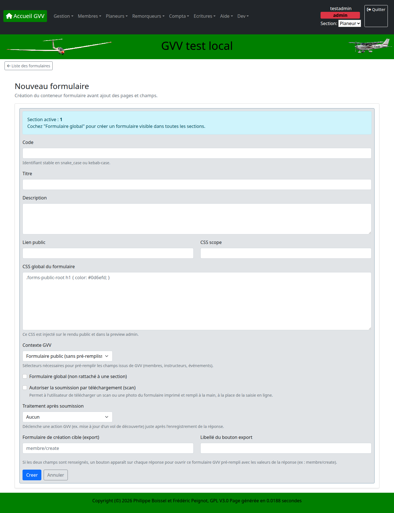
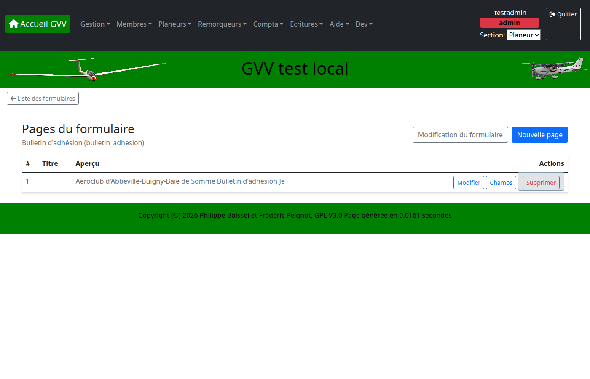

# Gestion des formulaires

Les formulaires permettent deux choses:

1. Collecter des informations comme un formulaire papier. Dans GVV, cela gère également l'archivage. Les formulaires peuvent être remplis en ligne, mais on sait ou retrouver toutes les réponses.

2. C'est un mécanisme pour étendre GVV sans modifier le code. Les formulaires ont des interfaces qui permettre de les intégrer profondément dans GVV. Ils peuvent être pré-remplis avec des informations contenues dans GVV et il peuvent également déclencher des actions dans GVV.

C'est donc un moyen d'étendre GVV sans être informaticien.

Ce document s'adresse à qui **fait remplir** un formulaire déjà existant : ouvrir le lien, faire remplir, retrouver les réponses, les modifier et créer un pdf avec une réponse.

Pour **créer le contenu HTML/CSS d'un formulaire** et **l'intégrer à GVV** (page de génération, pré-remplissage, sous-formulaires, export vers un formulaire de création), voir le document séparé [Rédiger et intégrer un formulaire (HTML/CSS)](13_formulaires_creation.md).

> 💡 **Envie de construire un formulaire pas à pas ?** Voir le [tutoriel — Créer un formulaire avec l'aide d'un assistant IA](13_formulaires_tutoriel.md), qui construit un exemple complet (3 pages, upload, signature) en s'appuyant sur ChatGPT pour générer le HTML.

## Sommaire

- [Gestion des formulaires](#gestion-des-formulaires)
  - [Sommaire](#sommaire)
  - [Vue d'ensemble](#vue-densemble)
  - [Créer un formulaire](#créer-un-formulaire)
  - [Gérer les pages](#gérer-les-pages)
  - [Formulaires pré-remplis](#formulaires-pré-remplis)
  - [Consulter les réponses](#consulter-les-réponses)
    - [Ouvrir une réponse](#ouvrir-une-réponse)
    - [Export PDF imprimable](#export-pdf-imprimable)
    - [Téléchargement sécurisé des fichiers](#téléchargement-sécurisé-des-fichiers)
    - [Rétention](#rétention)
  - [Modifier une réponse déjà soumise](#modifier-une-réponse-déjà-soumise)
    - [Déclencher la modification](#déclencher-la-modification)
    - [Formulaire pré-rempli](#formulaire-pré-rempli)
    - [Enregistrer les modifications](#enregistrer-les-modifications)
  - [Soumission par téléchargement (scan)](#soumission-par-téléchargement-scan)
    - [Activer la fonctionnalité sur un formulaire](#activer-la-fonctionnalité-sur-un-formulaire)
    - [Côté public](#côté-public)
    - [Côté admin — liste des réponses](#côté-admin--liste-des-réponses)
  - [Pour aller plus loin — rédiger et intégrer un formulaire](#pour-aller-plus-loin--rédiger-et-intégrer-un-formulaire)

---

## Vue d'ensemble

Un formulaire est un ensemble de pages HTML contenant des champs de saisie. Il est publié via un lien public anonyme, et les réponses sont collectées dans GVV. L'administrateur peut consulter les réponses, les exporter en PDF et supprimer celles qui ne sont plus utiles.

Un formulaire permet également de collecter des fichiers (photos, documents PDF, etc.) et des signatures électroniques. Les fichiers sont stockés de manière sécurisée et ne sont accessibles que depuis l'interface d'administration.

Il est possible de remplir un formulaire en une ou plusieurs fois, et de modifier une réponse déjà soumise si le formulaire est conçu pour cela. Cela permet par exemple de suivre la mise en place d'une procédure ou de compléter un dossier. La procédure n'est considérée comme terminées que lorsque tous les documents ont été fournis et touts les champs obligatoires remplis.

Un formulaire GVV est composé de :

- **Métadonnées** : titre, code interne, slug public (URL d'accès anonyme), CSS global, statut (brouillon / publié / archivé)
- **Pages** : un formulaire peut comporter plusieurs pages ; chaque page contient du HTML libre et des champs
- **Champs** : éléments de saisie détectés automatiquement dans le HTML de la page (voir [Champs détectés automatiquement](13_formulaires_creation.md#champs-détectés-automatiquement) dans le document de rédaction) — rien à déclarer séparément côté administration
- **Réponses** : soumissions anonymes, consultables et exportables en PDF

Flux de travail :

```
Créer le conteneur du formulaire → Déposer une archive (pages HTML, CSS, images)
→ Publier → Partager le lien public → Consulter les réponses
```

La deuxième étape (« Déposer une archive ») est le travail de la personne qui rédige le contenu — voir [Rédiger le contenu d'un formulaire (HTML/CSS)](13_formulaires_creation.md). Les autres étapes sont couvertes dans ce document.

Le lien public a la forme : `http://gvv.net/index.php/forms/{slug-public}`

Le contenu de chaque page (HTML + CSS) est stocké sous forme de fichiers dans `uploads/formulaires/{code}/` et s'édite exclusivement par dépôt d'archive — voir [Gérer le contenu d'un formulaire (archive)](13_formulaires_creation.md#gérer-le-contenu-dun-formulaire-archive).


---

## Créer un formulaire

Navigation : **Formulaires → Nouveau formulaire**



| Champ | Rôle |
|---|---|
| **Code** | Identifiant interne (lettres, chiffres, tirets) |
| **Titre** | Affiché en en-tête du formulaire public |
| **Description** | Texte optionnel affiché sous le titre |
| **Lien public** | Segment d'URL (ex. `inscription-club`) — voir la distinction avec **Code** ci-dessous |
| **CSS scope** | Préfixe optionnel pour isoler le CSS global de ce formulaire des autres |
| **Contexte GVV** | Sélecteur(s) de pré-remplissage nécessaires : aucun, membre, instructeur, ou les deux — voir [Pré-remplissage — mécanisme A](13_formulaires_creation.md#pré-remplissage--mécanisme-a-attributs-data-gvv-source) dans le document de rédaction |
| **Formulaire global** | Rend le formulaire visible dans toutes les sections plutôt que la seule section active |
| **Autoriser la soumission par téléchargement (scan)** | Active le bouton "Télécharger un formulaire prérempli" — voir [Soumission par téléchargement (scan)](#soumission-par-téléchargement-scan) |
| **Traitement après soumission** | Déclenche une action GVV (ex. mise à jour d'un vol de découverte) juste après l'enregistrement de la réponse |
| **Formulaire de création cible (export)** + **Libellé du bouton export** | Si les deux sont renseignés, un bouton apparaît sur chaque réponse pour ouvrir ce formulaire GVV pré-rempli avec les valeurs de la réponse (ex. `membre/create`) — voir [Exporter une réponse vers un formulaire de création](13_formulaires_creation.md#exporter-une-réponse-vers-un-formulaire-de-création) dans le document de rédaction |
| **Statut** *(en modification uniquement)* | `brouillon` : non accessible ; `publié` : accessible via le lien public ; `archivé` |

Le **Code** sert de nom de dossier de stockage (`uploads/formulaires/{code}/` : pages HTML, CSS, images) et de clé unique en base pour retrouver le formulaire côté admin. Si l'admin le renomme, GVV renomme aussi le dossier physique correspondant. Il est distinct du **Lien public**, qui est le segment d'URL vu par les visiteurs externes (`forms/{slug}`) : les deux sont indépendants et modifiables séparément une fois le formulaire créé.

Ce formulaire de création ne définit que les métadonnées du conteneur : il n'y a pas de champ pour saisir le HTML ou le CSS des pages. Une fois le formulaire créé, son contenu (pages, CSS, images) s'ajoute par **dépôt d'archive**, une opération de rédaction — voir [Rédiger le contenu d'un formulaire (HTML/CSS)](13_formulaires_creation.md).

Pour sauvegarder ou transférer un formulaire complet (pages, CSS, images, métadonnées) vers une autre installation GVV ou vers un autre club, voir [Exporter / importer un formulaire complet (archive)](13_formulaires_creation.md#exporter--importer-un-formulaire-complet-archive).

## Gérer les pages

Chaque formulaire comporte une ou plusieurs pages affichées séquentiellement. GVV gère automatiquement la navigation Précédent / Suivant et le bouton de soumission finale.



Cette liste est une vue **en lecture seule** de ce que contient le dossier de stockage du formulaire (`uploads/formulaires/{code}/pageNN.html`) : numéro, titre, aperçu du texte et bouton **"Champs"** (voir [Champs détectés automatiquement](13_formulaires_creation.md#champs-détectés-automatiquement)). Le contenu d'une page ne se modifie pas depuis cette liste : toute correction du HTML ou du CSS se fait via un dépôt d'archive — voir [Gérer le contenu d'un formulaire (archive)](13_formulaires_creation.md#gérer-le-contenu-dun-formulaire-archive).

---

## Formulaires pré-remplis

Un formulaire peut être ouvert avec des valeurs déjà connues de GVV (identité du pilote, qualifications de l'instructeur, informations d'un vol...), pour éviter à l'utilisateur de ressaisir ce que GVV sait déjà. Pour qu'un lien de formulaire soit ainsi pré-rempli, il faut utiliser une **URL de génération** plutôt que le lien public brut.

Cette URL se construit via le bouton **"Générer"** dans la liste des formulaires (réservé aux club-admins), ou est produite automatiquement par certains workflows GVV (ex. un vol de découverte envoyant un lien de briefing passager déjà rempli). Le mécanisme complet (page de génération, paramètres d'URL, verrouillage des champs, sources de données disponibles) est décrit dans le document de rédaction — voir [Page de génération](13_formulaires_creation.md#page-de-génération) et [Pré-remplissage — mécanisme A](13_formulaires_creation.md#pré-remplissage--mécanisme-a-attributs-data-gvv-source).

---

## Consulter les réponses

Navigation : **Formulaires → [nom du formulaire] → Réponses**

La liste affiche, pour chaque soumission, deux colonnes distinctes en plus de la date et des actions :

- **Identification** : valeur des champs marqués `data-gvv-identifier="true"` (voir [Champs détectés automatiquement](13_formulaires_creation.md#champs-détectés-automatiquement)), concaténés ; pour une [réponse déposée par scan](#soumission-par-téléchargement-scan), c'est le commentaire saisi au dépôt.
- **Soumis par** : nom et/ou email captés via [`data-gvv-role`](13_formulaires_creation.md#rôles-de-champs-gvv), ou "Anonyme" si aucun champ n'est ainsi marqué.

### Ouvrir une réponse

Le bouton **"Ouvrir"** affiche le détail d'une réponse en ligne :

- toutes les valeurs saisies, champ par champ, avec leur libellé et leur type ;
- les fichiers joints (champs de type `file` et signatures) avec **aperçu intégré** : une image est affichée directement, un PDF s'affiche dans un cadre de prévisualisation intégré à la page ; les boutons "Aperçu" (nouvel onglet) et "Télécharger" restent disponibles pour tout type de fichier.

### Export PDF imprimable

Le bouton **"PDF"** ouvre une version imprimable de la réponse (page HTML avec un bouton "Imprimer / Enregistrer en PDF"), reprenant le CSS global du formulaire.

### Téléchargement sécurisé des fichiers

Les fichiers joints (uploads et signatures) ne sont accessibles que depuis l'interface d'administration, à un utilisateur authentifié ayant accès à la section du formulaire — jamais par une URL prévisible côté public. Le navigateur n'est pas autorisé à mettre ces fichiers en cache.

### Rétention

Les réponses et leurs fichiers sont conservés sans limite de durée ; il n'y a pas d'expiration automatique. La suppression (bouton "Supprimer") est manuelle et retire à la fois la réponse, ses valeurs et les fichiers associés (y compris les miniatures).

---

## Modifier une réponse déjà soumise

Pour utiliser un formulaire comme support de suivi de procédure (attestation à compléter, dossier à mettre à jour...), une réponse déjà envoyée peut être rouverte et corrigée sans créer une nouvelle réponse.

### Déclencher la modification

Le bouton **"Modifier"** apparaît à côté de "Ouvrir" et "PDF" :

- dans la liste des réponses d'un formulaire ;
- dans le détail d'une réponse (bouton en haut à droite).

Il n'est disponible que pour les réponses saisies en ligne. Une réponse envoyée par [téléchargement de scan](#soumission-par-téléchargement-scan) ne peut pas être modifiée par ce mécanisme — seule la rotation du fichier déposé est possible pour ce type de réponse.

Seul un administrateur ayant accès à la section du formulaire peut déclencher une modification ; ce n'est pas un lien renvoyé à la personne qui a rempli le formulaire.

### Formulaire pré-rempli

Le bouton rouvre le formulaire public, page par page, avec les valeurs déjà soumises :

- les champs texte, date, nombre, case à cocher, liste déroulante, etc. affichent leur valeur enregistrée ;
- un champ **fichier** déjà soumis affiche le nom du fichier existant avec un lien pour le consulter ; laisser le champ vide à la resoumission **conserve** le fichier, en choisir un nouveau le **remplace** ;
- un champ **signature** déjà soumis affiche la signature existante en aperçu ; ne pas y toucher **conserve** la signature initiale, dessiner/téléverser/taper une nouvelle signature la **remplace**.

### Enregistrer les modifications

Le bouton **"Enregistrer les modifications"** valide et enregistre la réponse en place :

- l'identifiant de la réponse ne change pas — ce n'est pas une nouvelle réponse ;
- la date de soumission initiale, le rattachement éventuel à une entité GVV et le mode de soumission ne sont pas modifiés ;
- quand un fichier ou une signature est remplacé, l'ancien est supprimé du stockage une fois le nouveau enregistré avec succès ;
- le détail de la réponse affiche alors une **date de dernière modification**, en plus de la date de soumission initiale.

---

## Soumission par téléchargement (scan)

Pour certains formulaires (attestations à signer, documents administratifs), il est plus simple pour l'utilisateur d'imprimer le formulaire, de le remplir à la main, puis de téléverser une photo ou un scan de la page remplie plutôt que de ressaisir chaque champ en ligne. GVV propose cette alternative en complément — jamais à la place — de la saisie en ligne habituelle.

### Activer la fonctionnalité sur un formulaire

Dans la fiche admin du formulaire (création ou modification), cocher **"Autoriser la soumission par téléchargement (scan)"** :


Cette option est désactivée par défaut : chaque formulaire décide individuellement s'il accepte ce mode de réponse.

### Côté public

Quand l'option est active, un bouton **"Télécharger un formulaire prérempli"** apparaît à côté du bouton d'envoi habituel, sur la dernière page du formulaire. Il ouvre une fenêtre de dépôt de fichier (glisser-déposer ou sélection sur le disque) avec un champ de commentaire libre :


- **Formats acceptés** : PDF, JPG, PNG, GIF, WEBP.
- **Un seul fichier par réponse.**
- Le commentaire est optionnel ; il sert d'**identifiant** de la réponse dans la liste admin (voir ci-dessous).
- Cette soumission est indépendante de la saisie en ligne : les champs de la page ne sont pas utilisés pour ce mode.

### Côté admin — liste des réponses

Le bouton "Télécharger un formulaire prérempli" est aussi disponible en haut de la liste des réponses, pour qu'un administrateur puisse déposer une réponse au nom d'un usager.

Dans la liste, une réponse envoyée par téléchargement se distingue des réponses classiques :


- **Colonne Identification** : le commentaire saisi lors du dépôt.
- **Miniature cliquable** à la place du bouton "Générer PDF" — un clic ouvre le fichier en grand.
- **Rotation** (boutons ↺ / ↻) : pour redresser un scan ou une photo qui n'a pas été prise droite. La rotation modifie le fichier stocké.
- Pas de bouton "Ouvrir" : il n'y a pas de champs à afficher pour ce type de réponse, seulement le fichier déposé.
- La **suppression** de la réponse supprime aussi le fichier et sa miniature.

---

## Pour aller plus loin — rédiger et intégrer un formulaire

Ce document couvre le cycle de vie administratif d'un formulaire : conteneur, publication, réponses. La rédaction du contenu (pages HTML, CSS, types de champs, images) et son intégration à GVV (page de génération, pré-remplissage, sous-formulaires, export vers un formulaire de création, export/import d'archive complète, exemples) sont documentées séparément :

- [Rédiger et intégrer un formulaire (HTML/CSS)](13_formulaires_creation.md) — document de référence pour qui construit ou modifie le HTML/CSS d'un formulaire, ou le connecte aux données GVV.
- [Tutoriel — Créer un formulaire avec l'aide d'un assistant IA](13_formulaires_tutoriel.md) — construction pas à pas d'un exemple complet.
