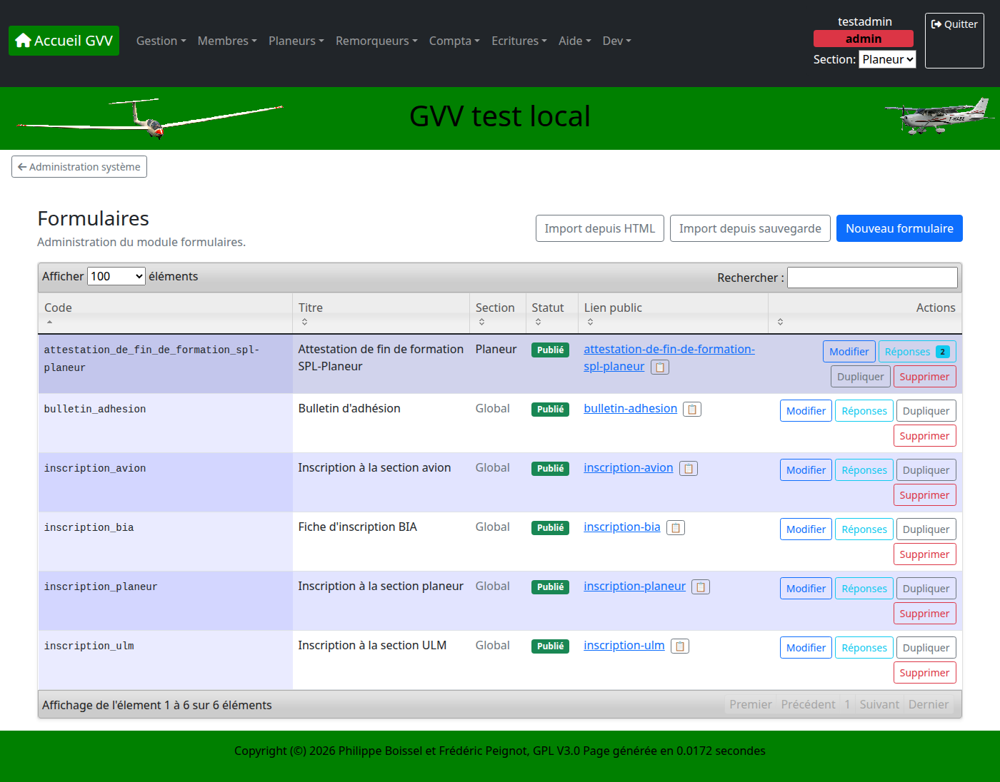
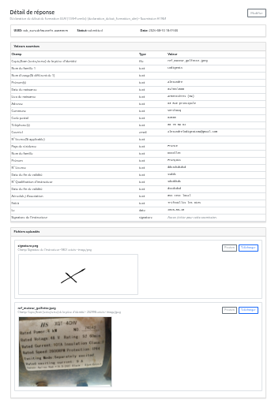
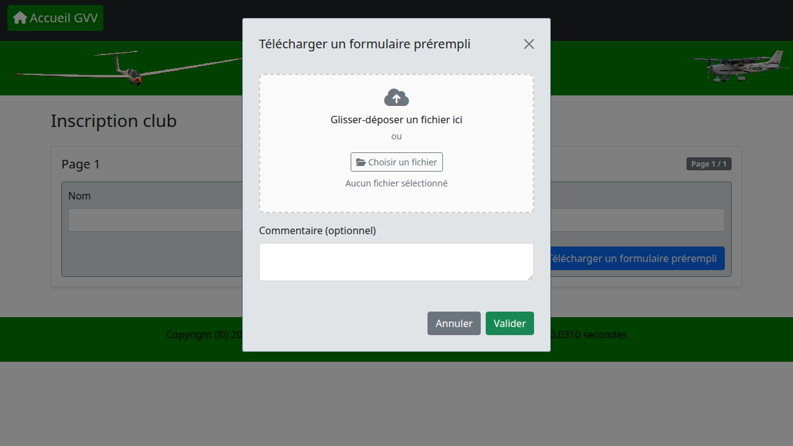
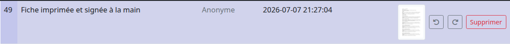

# Gestion des formulaires

Un formulaire GVV sert à collecter des informations en ligne — comme un formulaire papier, mais archivé et retrouvable — et à s'interfacer avec GVV (pré-remplissage à partir des données du club, déclenchement d'actions). Ce document guide l'administrateur qui **fait remplir** un formulaire déjà existant : publier un lien, consulter les réponses, les corriger, accepter un dépôt scanné.

Pour **rédiger le contenu HTML/CSS d'un formulaire** ou **l'intégrer aux données GVV** (pré-remplissage, sous-formulaires, export), voir [Rédiger et intégrer un formulaire (HTML/CSS)](13_formulaires_creation.md).

## Sommaire

- [Gestion des formulaires](#gestion-des-formulaires)
  - [Sommaire](#sommaire)
  - [Vue d'ensemble](#vue-densemble)
  - [Générer un lien pré-rempli pour un membre ou un instructeur](#générer-un-lien-pré-rempli-pour-un-membre-ou-un-instructeur)
  - [Consulter les réponses reçues](#consulter-les-réponses-reçues)
  - [Corriger une réponse déjà soumise](#corriger-une-réponse-déjà-soumise)
  - [Accepter une réponse déposée par scan ou photo](#accepter-une-réponse-déposée-par-scan-ou-photo)
  - [Associer un formulaire vierge téléchargeable](#associer-un-formulaire-vierge-téléchargeable)
  - [Pour aller plus loin](#pour-aller-plus-loin)

---

## Vue d'ensemble

Un formulaire GVV est un conteneur (métadonnées + statut) associé à une ou plusieurs pages HTML stockées dans `uploads/formulaires/{code}/`, publié via un lien public anonyme de la forme `http://gvv.net/index.php/forms/{slug-public}`. Les réponses soumises sont archivées et consultables depuis l'administration ; les fichiers joints (photos, PDF, signatures) sont stockés de manière sécurisée.

Flux de travail :

```
Publier → Partager le lien (brut ou pré-rempli) → Consulter les réponses
```



---

## Générer un lien pré-rempli pour un membre ou un instructeur

Si le formulaire a été configuré avec un **Contexte GVV** (voir référence ci-dessous), il peut être ouvert déjà rempli avec les informations d'un pilote et/ou d'un instructeur :

1. Dans la liste des formulaires, cliquer sur **"Générer"** — visible seulement si le formulaire a un contexte GVV configuré.
2. Sélectionner le pilote et/ou l'instructeur.
3. Cliquer sur **"Ouvrir le formulaire"** : GVV ouvre le lien avec les bons paramètres.

Un club-admin peut aussi épingler cette page de génération comme raccourci sur un tableau de bord GVV, pour l'atteindre en un clic.

Ce pré-remplissage suppose que les champs de la page ont été annotés à la rédaction — voir [Pré-remplir un champ avec les données GVV](13_formulaires_creation.md#pré-remplir-un-champ-avec-les-données-gvv) et [Générer un lien pré-rempli (page de génération)](13_formulaires_creation.md#générer-un-lien-pré-rempli-page-de-génération) dans le document de rédaction.

---

## Consulter les réponses reçues

Les réponse sont consultables depuis la liste des réponses. 

1. **Formulaires → [nom du formulaire] → Réponses**.
2. La liste indique, pour chaque soumission, l'**Identification** (champs marqués comme identifiants, ou le commentaire pour un dépôt scanné) et **Soumis par** (nom/email captés, ou "Anonyme").
3. **"Ouvrir"** affiche le détail : toutes les valeurs saisies, et un aperçu intégré des fichiers/signatures joints (image affichée directement, PDF dans un cadre de prévisualisation) ; "Aperçu" et "Télécharger" restent disponibles.
4. **"PDF"** ouvre une version imprimable de la réponse.
5. **"Supprimer"** retire définitivement la réponse, ses valeurs et ses fichiers — il n'y a pas d'expiration automatique, la rétention est illimitée tant qu'une réponse n'est pas supprimée manuellement.

Les fichiers joints ne sont jamais accessibles par une URL prévisible côté public : seul un administrateur authentifié ayant accès à la section peut les consulter, et le navigateur n'est pas autorisé à les mettre en cache.



---

## Corriger une réponse déjà soumise

Pour suivre une procédure (attestation à compléter, dossier à mettre à jour...), une réponse déjà envoyée peut être rouverte et corrigée sans créer de nouvelle réponse.

1. Depuis la liste des réponses ou le détail d'une réponse, cliquer sur **"Modifier"** — disponible uniquement pour les réponses saisies en ligne (pas pour un [dépôt par scan](#accepter-une-réponse-déposée-par-scan-ou-photo), où seule la rotation du fichier est possible) et réservé à un administrateur de la section (ce n'est pas un lien renvoyé à la personne qui a rempli le formulaire).
2. Le formulaire public se rouvre, page par page, avec les valeurs déjà soumises. Pour un champ **fichier** ou **signature**, laisser le champ inchangé **conserve** la valeur existante ; en fournir une nouvelle la **remplace**.
3. Cliquer sur **"Enregistrer les modifications"** : la réponse est mise à jour en place (même identifiant, même date de soumission initiale, même rattachement GVV), avec une **date de dernière modification** affichée en plus.

---

## Accepter une réponse déposée par scan ou photo

Pour les documents à imprimer, signer à la main puis renumériser (attestations, documents administratifs), GVV propose un dépôt de fichier en complément — jamais à la place — de la saisie en ligne.

1. Activer l'option sur la fiche du formulaire : cocher **"Autoriser la soumission par téléchargement (scan)"** (désactivée par défaut).
2. Côté public, un bouton **"Télécharger un formulaire prérempli"** apparaît sur la dernière page à côté du bouton d'envoi habituel : dépôt d'un seul fichier (PDF, JPG, PNG, GIF, WEBP) avec un commentaire optionnel qui sert d'identifiant dans la liste admin.
3. Un administrateur peut aussi déposer une réponse au nom d'un usager, avec le même bouton en haut de la liste des réponses.
4. Dans la liste, une réponse déposée se reconnaît à sa miniature cliquable (à la place du bouton PDF) et aux boutons de **rotation** (↺ / ↻) pour redresser une photo mal orientée — il n'y a pas de bouton "Ouvrir" puisqu'il n'y a pas de champs à afficher, seulement le fichier. La suppression retire le fichier et sa miniature.





---

## Associer un formulaire vierge téléchargeable

Pour un formulaire où le dépôt par scan est activé (section précédente), un PDF vierge — le document à imprimer avant de le remplir à la main — peut être proposé au téléchargement sur la page publique.

1. Sur la fiche d'édition du formulaire, carte **"Formulaire vierge (PDF)"** : déposer le fichier PDF (10 Mo maximum). Un nouveau dépôt **remplace** simplement le précédent — il n'y a pas d'historique de versions à gérer.
2. Le lien de téléchargement (**"Télécharger le formulaire vierge (PDF)"**) apparaît automatiquement en haut de la page publique dès qu'un PDF est déposé — à condition que **"Autoriser la soumission par téléchargement (scan)"** soit cochée. Il n'y a rien d'autre à activer.
3. Le PDF reste facultatif : un formulaire avec le dépôt par scan activé mais sans PDF déposé fonctionne normalement, simplement sans ce lien.
4. Le bouton **"Supprimer"** de la carte retire le PDF (et le lien public disparaît) sans affecter le reste du formulaire.

Ce PDF suit le formulaire lors d'un renommage, d'une duplication, d'une suppression ou d'une sauvegarde (export ZIP) — comme les images du formulaire (voir [Ajouter une image](13_formulaires_creation.md#ajouter-une-image)), il ne fait en revanche pas partie du contenu remplacé par un dépôt d'archive (voir [Modifier le contenu d'un formulaire existant](13_formulaires_creation.md#modifier-le-contenu-dun-formulaire-existant)) : il se dépose et se supprime uniquement depuis cette carte.

---

## Pour aller plus loin

- [Rédiger et intégrer un formulaire (HTML/CSS)](13_formulaires_creation.md) — rédiger le contenu HTML/CSS d'un formulaire et l'intégrer aux données GVV (pré-remplissage, sous-formulaires, export).
