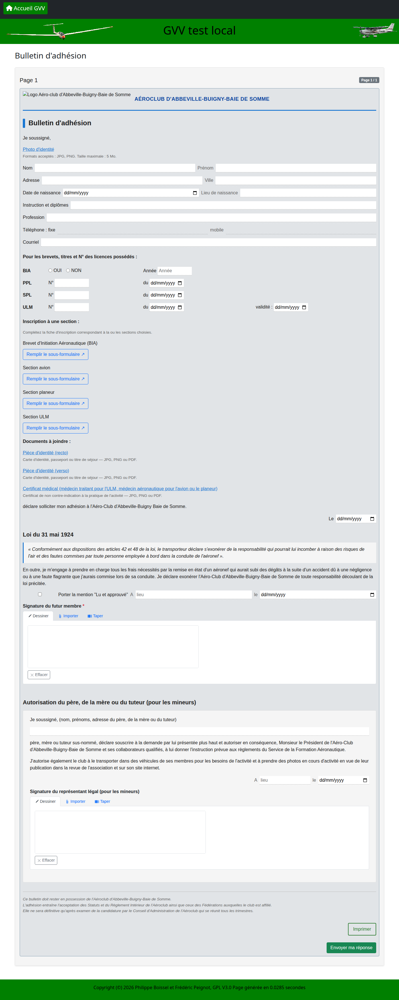

# Rédiger et intégrer un formulaire (HTML/CSS)

Ce document s'adresse à qui **rédige ou modifie le contenu** d'un formulaire GVV (pages HTML, CSS, images) et à qui **l'intègre à GVV** (pré-remplissage, sous-formulaires, export vers un formulaire de création). Pour créer le conteneur d'un formulaire, le publier ou consulter/gérer les réponses, voir le document d'utilisation [Gestion des formulaires](13_formulaires.md).

> 💡 **Envie de construire un formulaire pas à pas ?** Voir le [tutoriel — Créer un formulaire avec l'aide d'un assistant IA](13_formulaires_tutoriel.md), qui construit un exemple complet (3 pages, upload, signature) en s'appuyant sur ChatGPT pour générer le HTML.

## Sommaire

1. [Principes](#principes)
2. [Créer le contenu d'un nouveau formulaire](#créer-le-contenu-dun-nouveau-formulaire)
3. [Modifier le contenu d'un formulaire existant](#modifier-le-contenu-dun-formulaire-existant)
4. [Ajouter une image](#ajouter-une-image)
5. [Convertir un formulaire PDF existant](#convertir-un-formulaire-pdf-existant)
6. [Ajouter un champ à une page](#ajouter-un-champ-à-une-page)
7. [Ajouter une signature](#ajouter-une-signature)
8. [Styliser une page (CSS)](#styliser-une-page-css)
9. [Pré-remplir un champ avec les données GVV](#pré-remplir-un-champ-avec-les-données-gvv)
10. [Générer un lien pré-rempli (page de génération)](#générer-un-lien-pré-rempli-page-de-génération)
11. [Ajouter un sous-formulaire](#ajouter-un-sous-formulaire)
12. [Exporter une réponse vers un formulaire de création](#exporter-une-réponse-vers-un-formulaire-de-création)
13. [Sauvegarder ou transférer un formulaire complet](#sauvegarder-ou-transférer-un-formulaire-complet)
14. [Référence — métadonnées du conteneur](#référence--métadonnées-du-conteneur)
15. [Référence — champs, types et métadonnées](#référence--champs-types-et-métadonnées)
16. [Exemples de formulaires](#exemples-de-formulaires)

---

## Principes

J'ai envisagé plusieurs techniques pour permettre aux administrateurs de créer des formulaires sans coder, et j'ai choisi de rester sur du HTML. Ce n'est pas vraiment plus compliqué que de créer des formulaires en pdf ou avec un système de traitement de texte. Cela permet de rendre n'importe quel look, donc de copier assez exactement des formulaires fournis par l'administration.

Il aurait aussi été possible de faire définir les champs un peu comme la configuration des cartes de membres, en laissant les administrateurs définir les types de champs et leur position dans la page. Cela aurait été beaucoup plus compliqué et n'aurait pas permis à l'utilisateur de visualiser le rendu final du formulaire. Avec le HTML libre, l'administrateur voit exactement ce que verra l'utilisateur final.

De plus les agents IA comme ChatGPT, Claude ou Gemini sont assez compétents pour générer un formulaire en HTML à partir d'une description textuelle ou en convertissant un fichier word ou pdf en HTML.

---

## Créer le contenu d'un nouveau formulaire

Le contenu d'un formulaire — pages HTML, CSS, images — s'ajoute **exclusivement par dépôt d'archive ZIP** ; il n'y a pas de zone de texte HTML/CSS dans l'administration.

1. Créer le conteneur dans GVV si ce n'est pas déjà fait — voir [Créer un nouveau formulaire](13_formulaires.md#créer-un-nouveau-formulaire) — ou déposer directement une archive depuis la liste des formulaires avec **"Import depuis sauvegarde"** : le **Code** est alors déduit du nom du fichier ZIP si laissé vide (suffixe `_2`, `_3`... en cas de collision).
2. Construire en local un dossier miroir du stockage du formulaire, puis le compresser en ZIP :

```
mon-formulaire.zip
├── meta.json        ← titre, description, portée CSS, paramètres requis, options d'export, liste des pages
├── page01.html       ← document HTML5 autonome (ouvrable tel quel dans un navigateur)
├── page02.html
├── style.css
└── images/
    └── logo.png
```

Chaque `pageNN.html` est un document HTML5 complet (`<!DOCTYPE>`, `<head>` avec `<link rel="stylesheet" href="style.css">`, `<body>`) : il s'ouvre directement dans un navigateur, même sans connexion au serveur GVV — pratique pour relire une mise en page ou dépanner un CSS en local avant de déposer l'archive. Seul le contenu du `<body>` est réellement utilisé par GVV — voir [Styliser une page (CSS)](#styliser-une-page-css).

`meta.json` porte le contenu/la configuration du formulaire. Le **code** du formulaire (nom du dossier), son **statut** et son **lien public** n'y figurent jamais : ils restent pilotés uniquement depuis l'interface d'administration et ne sont jamais modifiés par un dépôt d'archive.

3. Ajouter les champs de saisie dans le HTML — voir [Ajouter un champ à une page](#ajouter-un-champ-à-une-page).
4. Déposer l'archive ZIP depuis la fiche du formulaire (carte "Contenu du formulaire (archive)", bouton de dépôt).
5. Vérifier les pages et les champs détectés depuis la fiche du formulaire — voir [Créer un nouveau formulaire](13_formulaires.md#créer-un-nouveau-formulaire) dans le document d'utilisation.

Pour dupliquer un formulaire existant comme point de départ, ou le transférer vers une autre installation, voir [Sauvegarder ou transférer un formulaire complet](#sauvegarder-ou-transférer-un-formulaire-complet).

---

## Modifier le contenu d'un formulaire existant

1. Dans la fiche d'édition du formulaire, carte **"Contenu du formulaire (archive)"**, télécharger l'archive actuelle (bouton **"Sauvegarder (ZIP)"**).
2. La modifier en local (ajouter/corriger une page, changer le CSS, ajouter une image...).
3. La redéposer avec le champ de dépôt de fichier de la même carte : le dépôt **remplace intégralement** le contenu du formulaire (pages, CSS, images). Le code, le statut et le lien public ne sont **jamais** modifiés par un dépôt.

> Un dépôt remplace intégralement le contenu existant — les pages et images absentes de l'archive déposée sont supprimées. Toujours télécharger l'archive actuelle avant de déposer une modification, pour pouvoir revenir en arrière en cas d'erreur.

### Partager une base de style entre formulaires

Pour éviter de dupliquer un CSS commun (même charte graphique, déclinaison d'un même concours d'une année sur l'autre...) dans chaque archive, placer en tête du `style.css` d'un formulaire :

```css
@import url(".commun/style.css");
```

GVV réécrit automatiquement cette référence vers la bonne adresse au moment d'afficher la page — le fichier stocké garde `.commun/style.css` tel quel, ce qui le garde ouvrable directement dans un navigateur et transportable d'une installation GVV à une autre. Le CSS partagé lui-même (`uploads/formulaires/.commun/style.css`) est propre à l'installation GVV et modifiable uniquement par un administrateur ayant accès au serveur.

---

## Ajouter une image

Dans la fiche d'édition d'un formulaire, la carte **Images** permet :

1. de **déposer** une image (PNG, JPEG, GIF ou WEBP, 2 Mo maximum) ;
2. de **copier le chemin** de l'image déposée, à coller dans un attribut `src="..."` du HTML de la page (ex. ``) — un chemin relatif (`images/{fichier}`), jamais une adresse GVV en dur, pour que le fichier stocké reste ouvrable en `file://` et déplaçable d'une installation à l'autre ;
3. de **supprimer** une image qui n'est plus utilisée.

Une image partagée entre plusieurs formulaires (logo de club commun) suit la même logique que le [CSS partagé](#partager-une-base-de-style-entre-formulaires) : référencée par `.commun/images/{fichier}` (fichier réservé, modifiable uniquement par un administrateur ayant accès au serveur — pas encore de carte dédiée dans l'admin pour ce cas).

> Une image collée en base64 directement dans le HTML fonctionne toujours, mais alourdit le fichier de la page à chaque relecture. Pour un logo ou une image réutilisée, préférer le dépôt via la carte Images.

---

## Convertir un formulaire PDF existant

GVV n'intègre pas de convertisseur PDF → HTML automatique. Pour numériser un formulaire existant (papier ou PDF) :

1. Demander à un outil d'IA (Claude, ChatGPT, etc.) de convertir le PDF en HTML, en lui donnant les contraintes de ce document : Bootstrap 5, pas de `<head>`/`<style>` ni de balise `<form>` dans le contenu de page — voir [Styliser une page (CSS)](#styliser-une-page-css).
2. Relire et corriger le HTML généré : les champs ne sont pas détectés automatiquement par l'outil d'IA, les attributs `name="..."` doivent être vérifiés ou ajoutés à la main — voir [Ajouter un champ à une page](#ajouter-un-champ-à-une-page).
3. Enregistrer le résultat comme `page01.html`, l'assembler avec un `style.css` dans une archive ZIP — voir [Créer le contenu d'un nouveau formulaire](#créer-le-contenu-dun-nouveau-formulaire) — puis déposer cette archive. Aucune déclaration supplémentaire n'est nécessaire : GVV détecte les champs au dépôt.
4. Vérifier le rendu sur la page publique : la fidélité visuelle au PDF d'origine n'est pas garantie et demande souvent des retouches CSS.

**Limites** : pas de détection automatique des champs du PDF source, pas de garantie de fidélité visuelle, relecture manuelle obligatoire avant publication.

---

## Ajouter un champ à une page

GVV détecte automatiquement, à la volée, tout `<input name="...">`, `<select name="...">` ou `<textarea name="...">` du HTML d'une page (hors `hidden`, `submit`, `reset`, `button`, `image`) — il n'y a rien à déclarer séparément, ni bouton "Ajouter un champ" côté admin.

1. Choisir le type de champ voulu et copier le HTML correspondant depuis la [référence des types de champs](#types-de-champs-supportés).
2. Donner au champ un `name="..."` unique dans la page : c'est cet attribut, et lui seul, qui identifie le champ pour GVV. Le renommer change l'identité du champ (les réponses déjà soumises sous l'ancien nom ne s'y rattachent pas automatiquement).
3. Ajouter `required` si le champ est obligatoire.
4. Optionnel : marquer le champ comme identifiant de réponse ou ajouter une validation serveur — voir [Attributs data-gvv complémentaires](#attributs-data-gvv-complémentaires).

Exemple minimal (texte) :

```html
<div class="mb-3">
  <label class="form-label" for="nom">Nom <span class="text-danger">*</span></label>
  <input type="text" class="form-control" id="nom" name="nom" required>
</div>
```

Depuis la fiche du formulaire ([Créer un nouveau formulaire](13_formulaires.md#créer-un-nouveau-formulaire) dans le document d'utilisation), le bouton **"Champs"** d'une page affiche la liste en lecture seule de ce que GVV a détecté — utile pour vérifier qu'un `name` n'a pas été oublié après un copier-coller. Toute correction se fait en modifiant le HTML puis en redéposant l'archive — voir [Modifier le contenu d'un formulaire existant](#modifier-le-contenu-dun-formulaire-existant).

---

## Ajouter une signature

Le champ signature est un widget interactif qui offre trois modes à l'utilisateur : dessin à la souris/tactile, import d'une image, ou frappe au clavier (rendue en écriture manuscrite). La valeur est transmise comme image PNG encodée en base64.

1. Déclarer le widget dans le HTML :

```html
<div data-gvv-type="signature"
     data-gvv-name="signature_candidat"
     data-gvv-required="true">
  Signature du candidat
</div>
```

| Attribut | Rôle |
|---|---|
| `data-gvv-type="signature"` | Identifie le widget (obligatoire) |
| `data-gvv-name` | Nom technique du champ (équivalent du `name` d'un `<input>`) |
| `data-gvv-required` | `true` = champ obligatoire |

GVV remplace automatiquement ce `<div>` par le widget interactif lors du rendu public ; le texte contenu dans le `<div>` sert de libellé affiché au-dessus.

2. Optionnel — repère visuel hors ligne : comme le fichier de page est ouvrable directement dans un navigateur, ajouter une image de repère à l'intérieur du `<div>` aide à le repérer visuellement en développement local (GVV l'ignore au rendu réel, le `<div>` entier étant remplacé) :

```html
<div data-gvv-type="signature"
     data-gvv-name="signature_candidat"
     data-gvv-required="true">
  <br>
  Signature du candidat
</div>
```

Pour pré-remplir une signature avec celle déjà enregistrée dans GVV (profil membre, événement), voir [Pré-remplir un champ avec les données GVV](#pré-remplir-un-champ-avec-les-données-gvv).

---

## Styliser une page (CSS)

Lors du rendu dans GVV, seul le contenu du `<body>` d'une page est utilisé : `<!DOCTYPE>`, `<html>`, `<head>` (et tout son contenu, y compris `<style>`), ainsi que les balises `<form>` et les boutons `submit`/`reset` sont supprimés automatiquement (GVV gère lui-même la navigation).

1. Utiliser en priorité les **classes Bootstrap 5** (chargées par GVV) — voir la [liste des classes utiles](#classes-css-utiles).
2. Pour un style personnalisé, l'écrire dans le fichier `style.css` de l'archive (voir [Créer le contenu d'un nouveau formulaire](#créer-le-contenu-dun-nouveau-formulaire)) plutôt que dans une balise `<style>` de la page — celle-ci est supprimée au rendu. Scoper les règles avec `.forms-public-root` (classe appliquée automatiquement au conteneur) :

```css
.forms-public-root .section-titre {
  font-size: 0.75rem;
  font-weight: 700;
  text-transform: uppercase;
  letter-spacing: 0.08em;
  color: #2d465a;
  border-left: 3px solid #3b6f8f;
  padding-left: 8px;
  margin-bottom: 0.75rem;
}
```

3. Éviter les pratiques qui échouent silencieusement — voir [À éviter en CSS](#à-éviter-en-css).
4. Avant de déposer l'archive, développer et relire chaque page comme un fichier HTML autonome (`pageNN.html` + `style.css`, tel quel dans le format de l'archive), en vérifiant que le CSS personnalisé est bien scopé avec `.forms-public-root` et qu'aucun `<form>`, bouton `submit`/`reset` ou `@import` de police ne traîne dans le `<head>`.

> Un `@import url(...)` placé en tête du fichier **`style.css`** de l'archive (pas dans le `<head>` du HTML), lui, fonctionne — c'est le mécanisme utilisé pour le [CSS partagé entre formulaires](#partager-une-base-de-style-entre-formulaires) ou pour charger une police externe.

---

## Pré-remplir un champ avec les données GVV

Deux mécanismes, à choisir selon l'origine de la donnée à pré-remplir.

### Mécanisme A — données liées à un membre ou un instructeur (`data-gvv-source`)

À utiliser quand la donnée vient du profil ou des qualifications d'un membre/instructeur identifié par son login (transmis dans l'URL via `pilot_login`/`instructor_login`, typiquement par la [page de génération](#générer-un-lien-pré-rempli-page-de-génération)).

1. Ajouter `data-gvv-source="..."` sur le champ, avec une valeur prise dans la [taxonomie des sources](#taxonomie-des-sources-de-pré-remplissage).
2. Ajouter `data-gvv-lock="true"` si la valeur ne doit pas pouvoir être modifiée par l'utilisateur (readonly à l'affichage, valeur GVV réimposée même si le POST est falsifié).

```html
<!-- Nom du candidat (verrouillé) -->
<input name="candidat_nom" type="text"
       data-gvv-source="member.nom_prenom"
       data-gvv-lock="true">

<!-- Date du jour (automatique, pas de paramètre URL) -->
<input name="date_signature" type="date"
       data-gvv-source="date.today">
```

### Mécanisme B — données liées à une autre entité GVV (paramètres d'URL)

À utiliser quand le contexte vient d'une entité GVV autre qu'un membre (vol de découverte, réservation, dossier...), sans attribut `data-gvv-*` à déclarer : tout paramètre d'URL dont le nom correspond au `name=` d'un champ le pré-remplit.

```
/forms/{slug}
  ?{nom_champ}={valeur}    ← injecté dans le champ correspondant
  &lock[]={nom_champ}      ← champ readonly + valeur imposée à la soumission
```

Sans `lock[]`, la valeur est une **suggestion** modifiable. Avec `lock[]`, elle est **imposée** : affichage readonly, et le serveur réinjecte la valeur de session même si le POST est falsifié. Noms réservés (jamais injectés dans un champ) : `page`, `token`, `vld_id`, `pilot_login`, `instructor_login`, `lock`.

Exemple — un vol de découverte envoie ce lien au passager :

```
/forms/briefing-passager-ulm
  ?date_vol=2026-07-15&site_decollage=Abbeville&identification_ulm=F-JXXX
  &nom=Dupont&personne_a_prevenir=Marie+Dupont
  &lock[]=date_vol&lock[]=site_decollage&lock[]=identification_ulm
```

Résultat : `date_vol`, `site_decollage` et `identification_ulm` sont verrouillés (données du vol) ; `nom` et `personne_a_prevenir` sont pré-remplis mais modifiables.

### Coexistence des deux mécanismes

Les deux peuvent coexister dans le même formulaire : les sources automatiques (`date.today`, `config.*`, `club.*`) utilisent toujours le mécanisme A ; le mécanisme B cible les champs par `name=` sans attribut HTML. Priorité en cas de conflit (du plus au moins prioritaire) : erreur de validation (re-affichage après refus) → mécanisme A → mécanisme B.

---

## Générer un lien pré-rempli (page de génération)

Pour que le bouton **"Générer"** apparaisse côté admin (voir [Générer un lien pré-rempli](13_formulaires.md#générer-un-lien-pré-rempli-pour-un-membre-ou-un-instructeur) dans le document d'utilisation), configurer le formulaire :

1. Dans la fiche admin du formulaire, régler le champ **Paramètres requis** selon les sélecteurs souhaités sur la page de génération :

| Valeur | Sélecteurs affichés |
|---|---|
| `aucun` | Aucun — pas de bouton "Générer" |
| `pilote` | Sélecteur membre (pilote) |
| `instructeur` | Sélecteur membre (instructeur) |
| `pilote + instructeur` | Les deux sélecteurs |

2. Annoter les champs de la page avec `data-gvv-source` pour qu'ils profitent réellement du pré-remplissage — voir [Mécanisme A](#pré-remplir-un-champ-avec-les-données-gvv). Sans annotation, la page de génération construit l'URL (`pilot_login`/`instructor_login`) mais aucun champ ne se remplit.

### Raccourcis dashboard

Pour exposer directement la page de génération comme raccourci sur un tableau de bord GVV, plutôt que de naviguer jusqu'à **Formulaires → Générer** à chaque fois : tableau de bord **Administration club** → carte **"Raccourcis dashboard"**.

| Champ | Rôle |
|---|---|
| **Dashboard** | Tableau de bord cible (`user`, `flights`, `treasurer`, `formation`, `maintenance`, `admin_club`, `admin_sys`, `dev`) |
| **Section** | Sous-titre de regroupement optionnel dans le dashboard (ex. "Formation") |
| **Titre** / **Clé de langue (titre)** | Texte de la carte ; si la clé de langue est renseignée et reconnue par GVV, elle prime sur le titre brut |
| **Description** / **Clé de langue (description)** | Texte secondaire, même logique de priorité que le titre |
| **URL** | Chemin relatif GVV (ex. `forms_admin/generate/attestation-de-formation-ulm`) ou URL externe complète (ouverte dans un nouvel onglet) |
| **Icône** | Classe Font Awesome, ex. `fa-file-signature` |
| **Couleur** | Classe Bootstrap (`text-primary`, …) |
| **Rôle requis** | Si renseigné, la carte n'est visible que pour les utilisateurs ayant ce rôle dans la section active |
| **Ordre d'affichage** | Ordre croissant au sein d'un même regroupement |
| **Actif** | Une carte désactivée n'apparaît plus, sans être supprimée |
| **Portée** | Globale (tous les clubs) ou limitée à la section active au moment de la création |

⚠️ La page de génération (`forms_admin/generate/...`) reste réservée aux `ca`/club-admins. Un raccourci qui y pointe n'est réellement utilisable que sur un dashboard **admin_club** ou **admin_sys** (ou avec **Rôle requis** = `ca`/`club-admin`). Pour un raccourci destiné aux dashboards pilote/instructeur (`user`, `flights`, `formation`), pointer plutôt vers le lien public direct du formulaire (`forms/{slug}`), éventuellement déjà pré-rempli via le [mécanisme B](#pré-remplir-un-champ-avec-les-données-gvv).

---

## Ajouter un sous-formulaire

Un formulaire peut inclure un lien vers un **autre** formulaire GVV, ouvert dans un **nouvel onglet** — jamais en iframe ni fusionné dans la page, pour que chaque formulaire garde son propre CSS/JS.

1. Déclarer le widget dans le HTML :

```html
<div data-gvv-type="subform"
     data-gvv-name="briefing_passager"
     data-gvv-form-slug="briefing-passager-ulm"
     data-gvv-required="true">
  Briefing passager
</div>
```

| Attribut | Rôle |
|---|---|
| `data-gvv-type="subform"` | Identifie le widget (obligatoire) |
| `data-gvv-name` | Nom technique du widget |
| `data-gvv-form-slug` | Lien public (`public_slug`) du formulaire à ouvrir comme sous-formulaire |
| `data-gvv-required` | `true` = le formulaire maître ne peut être soumis sans réponse liée au sous-formulaire |

2. Optionnel — comme pour la [signature](#ajouter-une-signature), ajouter une image de repère dans le `<div>` pour le développement local (ignorée par GVV au rendu réel) :

```html
<div data-gvv-type="subform"
     data-gvv-name="briefing_passager"
     data-gvv-form-slug="briefing-passager-ulm"
     data-gvv-required="true">
  <br>
  Briefing passager
</div>
```

Déroulement côté utilisateur : il ouvre le sous-formulaire dans un nouvel onglet, le remplit, puis revient sur l'onglet maître où le bouton **"J'ai terminé, vérifier"** devient visible — un clic vérifie l'enregistrement sans recharger la page (la saisie déjà en cours sur le maître n'est jamais perdue) et affiche un résumé lecture seule à la place du lien, avec un bouton **Remplir à nouveau** pour recommencer. Si le widget est obligatoire, la soumission du maître est bloquée tant que le sous-formulaire n'a pas été vérifié comme rempli.

Rattachement des réponses : le lien entre les deux réponses n'est définitif qu'à la soumission finale du maître (un jeton technique `link_token` fait la correspondance pendant la saisie). Si l'utilisateur remplit le sous-formulaire mais n'achève jamais le maître, la réponse du sous-formulaire est **conservée** et apparaît dans la [liste des réponses](13_formulaires.md#consulter-les-réponses-reçues) avec le badge **Non rattaché**.

> **Cas particulier** : si le formulaire utilisé comme sous-formulaire est par ailleurs rattaché directement à un enregistrement GVV (ex. `briefing-passager-ulm` rattaché à un vol de découverte), cet attachement d'origine reste toujours prioritaire.

**Limites (V1)** : un seul niveau d'imbrication (un sous-formulaire ne peut pas lui-même contenir un widget sous-formulaire) ; une seule réponse liée par widget (pas de répétition) ; pas d'édition en place d'une réponse de sous-formulaire déjà soumise, seulement une nouvelle soumission complète.

---

## Exporter une réponse vers un formulaire de création

Un formulaire peut déclarer une **cible d'export** : un formulaire de création GVV standard (ex. création de membre) à ouvrir, pré-rempli, à partir des valeurs d'une réponse. Le sens du flux est ici inversé par rapport au pré-remplissage : c'est une réponse `forms` qui alimente un formulaire GVV situé en dehors du module.

1. Dans l'admin d'édition du formulaire (voir [Créer un nouveau formulaire](13_formulaires.md#créer-un-nouveau-formulaire)), renseigner les deux champs optionnels :
   - **Formulaire de création cible** : chemin relatif du contrôleur/méthode GVV à ouvrir (ex. `membre/create`) ;
   - **Libellé du bouton export** : texte affiché sur le bouton dans la liste des réponses.

   Le bouton n'apparaît que si **les deux** champs sont renseignés.

2. Nommer les champs du formulaire source comme les colonnes attendues côté formulaire cible (ex. `mnom` pour le nom d'un membre) — il n'y a pas de correspondance configurable ailleurs, c'est une règle de conception à respecter en rédigeant le HTML. Les champs **fichier**, **signature** et **sous-formulaire** sont toujours exclus de l'export (pas de valeur exploitable en paramètre d'URL), de même que les champs à **choix multiples** en V1.

Depuis la liste des réponses (voir [Consulter les réponses reçues](13_formulaires.md#consulter-les-réponses-reçues)), un clic sur le bouton ouvre le formulaire cible avec un paramètre par champ :

```
membre/create?mnom=Dupont&memail=dupont%40example.com
```

Le bouton n'est visible que dans la liste admin, déjà protégée par l'authentification GVV. Ouvrir le lien pré-rempli ne fait qu'afficher un formulaire de création déjà soumis à la validation standard : aucune donnée n'est enregistrée tant que l'administrateur ne valide pas explicitement ce formulaire.

---

## Sauvegarder ou transférer un formulaire complet

Un formulaire (pages HTML, CSS, images, métadonnées) se manipule comme un seul fichier ZIP téléchargeable — le même mécanisme que la [modification du contenu](#modifier-le-contenu-dun-formulaire-existant) sert aussi de **transfert entre installations GVV** et de **partage d'un formulaire entre clubs** : télécharger l'archive d'un formulaire sur une installation, l'importer comme nouveau formulaire sur une autre (voir [Créer le contenu d'un nouveau formulaire](#créer-le-contenu-dun-nouveau-formulaire) pour l'import).

---

## Référence — métadonnées du conteneur

Champs de la fiche d'un formulaire existant (**Formulaires → [nom du formulaire]**), et clé correspondante dans `meta.json` :

| Champ | Clé `meta.json` | Rôle |
|---|---|---|
| **Code** | *(absente)* | Identifiant interne (lettres, chiffres, tirets). Sert de nom de dossier de stockage (`uploads/formulaires/{code}/`) et de clé unique en base ; renommer le Code renomme aussi le dossier physique. |
| **Titre** | `title` (chaîne) | Affiché en en-tête du formulaire public |
| **Description** | `description` (chaîne) | Texte optionnel affiché sous le titre |
| **Lien public** | *(absente)* | Segment d'URL public (ex. `inscription-club`) vu par les visiteurs (`forms/{slug}`) — indépendant du Code, modifiable séparément |
| **CSS scope** | `css_scope` (chaîne) | Préfixe optionnel pour isoler le CSS global de ce formulaire des autres |
| **Contexte GVV** | `required_params` — `"none"` \| `"pilot"` \| `"instructor"` \| `"pilot+instructor"` | Sélecteur(s) de pré-remplissage nécessaires : aucun, membre, instructeur, ou les deux — active le bouton "Générer" (voir [Générer un lien pré-rempli](13_formulaires.md#générer-un-lien-pré-rempli-pour-un-membre-ou-un-instructeur) dans le document d'utilisation) |
| **Formulaire global** | *(absente)* | Rend le formulaire visible dans toutes les sections plutôt que la seule section active |
| **Autoriser la soumission par téléchargement (scan)** | `allow_upload_response` (booléen) | Active le dépôt de fichier — voir [Accepter une réponse déposée par scan ou photo](13_formulaires.md#accepter-une-réponse-déposée-par-scan-ou-photo) dans le document d'utilisation |
| **Traitement après soumission** | `handler_class` (chaîne ou `null`) | Déclenche une action GVV (ex. mise à jour d'un vol de découverte) juste après l'enregistrement de la réponse |
| **Formulaire de création cible (export)** | `target_url` (chaîne ou `null`) | Si renseigné avec le libellé, un bouton apparaît sur chaque réponse pour ouvrir un formulaire GVV pré-rempli avec les valeurs de la réponse — voir [Exporter une réponse vers un formulaire de création](#exporter-une-réponse-vers-un-formulaire-de-création) |
| **Libellé du bouton export** | `target_label` (chaîne ou `null`) | Texte affiché sur ce bouton — sans effet si `target_url` est vide |
| **Statut** *(en modification uniquement)* | *(absente)* | `brouillon` : non accessible ; `publié` : accessible via le lien public ; `archivé` |
| *(pas de champ fiche correspondant)* | `pages` — tableau de `{page_number, title}` | Numéro et titre de chaque page, dans l'ordre — reflète la carte "Gestion des pages" de la fiche |

Ces champs ne définissent que les métadonnées du conteneur — pas le HTML ou le CSS des pages, qui s'ajoute par dépôt d'archive (voir [Créer le contenu d'un nouveau formulaire](#créer-le-contenu-dun-nouveau-formulaire)).

`meta.json` est réécrit automatiquement par GVV à chaque modification faite depuis l'admin (fiche ou pages) — ce n'est pas un fichier à maintenir à la main au quotidien. Il ne compte réellement que dans deux cas : le **dépôt initial d'une archive pour un nouveau formulaire** (ses valeurs pré-remplissent la fiche à la création) et le **transfert vers une autre installation** (voir [Sauvegarder ou transférer un formulaire complet](#sauvegarder-ou-transférer-un-formulaire-complet)). Le Code, le Lien public, le Formulaire global et le Statut n'y figurent jamais : ils restent toujours pilotés depuis l'admin, même dans ces deux cas.

Pour la liste des types de champs de saisie possibles dans les pages (texte, date, fichier, signature...) et des attributs `data-gvv-*` qui les enrichissent, voir [Référence — champs, types et métadonnées](#référence--champs-types-et-métadonnées) ci-dessous.

---

## Référence — champs, types et métadonnées

### Détection automatique des champs

GVV analyse le HTML de chaque page à la volée (affichage public, enregistrement d'une réponse, liste admin des champs) pour en extraire la liste des champs — rien à déclarer séparément, pas de bouton "Ajouter un champ" :

| Propriété détectée | Provenance |
|---|---|
| **Nom technique** | Attribut `name` (ou `data-gvv-name` pour signature/sous-formulaire) |
| **Libellé** | Texte du `<label for="id_du_champ">` correspondant ; à défaut, le nom technique |
| **Type** | Type HTML de l'élément — voir [Types de champs supportés](#types-de-champs-supportés) |
| **Obligatoire** | Attribut `required` sur l'élément (`data-gvv-required="true"` pour signature/sous-formulaire) |
| **Options** | Options du `<select>`, ou boutons `radio`/`checkbox` partageant le même `name` |

### Types de champs supportés

| Type | Élément HTML | Notes |
|---|---|---|
| `text` | `<input type="text">` | — |
| `email` | `<input type="email">` | Format email RFC validé côté serveur |
| `date` | `<input type="date">` | Format `YYYY-MM-DD`, date réelle vérifiée |
| `number` | `<input type="number">` | Valeur numérique |
| `textarea` | `<textarea>` | — |
| `select` | `<select>` | Options = les `<option value="...">` du HTML |
| `radio` | `<input type="radio">` (groupe) | Options = les valeurs des boutons partageant le même `name` |
| `checkbox` | `<input type="checkbox">` (groupe) | `name="champ[]"` pour les valeurs multiples |
| `file` | `<input type="file">` | MIME et taille contrôlés |
| `signature` | `<div data-gvv-type="signature" ...>` | Widget interactif — voir [Ajouter une signature](#ajouter-une-signature) |

Exemples HTML par type :

```html
<!-- text -->
<div class="mb-3">
  <label class="form-label" for="nom">Nom <span class="text-danger">*</span></label>
  <input type="text" class="form-control" id="nom" name="nom" required>
</div>

<!-- email -->
<div class="mb-3">
  <label class="form-label" for="email">Email</label>
  <input type="email" class="form-control" id="email" name="email">
</div>

<!-- date -->
<div class="mb-3">
  <label class="form-label" for="date_naissance">Date de naissance</label>
  <input type="date" class="form-control" id="date_naissance" name="date_naissance">
</div>

<!-- number -->
<div class="mb-3">
  <label class="form-label" for="heures">Nombre d'heures</label>
  <input type="number" class="form-control" id="heures" name="heures" min="0" step="0.5">
</div>

<!-- textarea -->
<div class="mb-3">
  <label class="form-label" for="commentaire">Commentaire</label>
  <textarea class="form-control" id="commentaire" name="commentaire" rows="4"></textarea>
</div>

<!-- select (options = les <option> ci-dessous : Masculin / Féminin / Autre) -->
<div class="mb-3">
  <label class="form-label" for="genre">Genre</label>
  <select class="form-select" id="genre" name="genre">
    <option value="">-- Choisir --</option>
    <option value="Masculin">Masculin</option>
    <option value="Féminin">Féminin</option>
    <option value="Autre">Autre</option>
  </select>
</div>

<!-- radio (options = les valeurs des boutons partageant name="licencie" : Oui / Non) -->
<div class="mb-3">
  <label class="form-label d-block">Licencié FFVV ?</label>
  <div class="form-check form-check-inline">
    <input class="form-check-input" type="radio" name="licencie" id="lic_oui" value="Oui">
    <label class="form-check-label" for="lic_oui">Oui</label>
  </div>
  <div class="form-check form-check-inline">
    <input class="form-check-input" type="radio" name="licencie" id="lic_non" value="Non">
    <label class="form-check-label" for="lic_non">Non</label>
  </div>
</div>

<!-- checkbox — le [] dans name regroupe les valeurs cochées en tableau à la soumission -->
<div class="mb-3">
  <label class="form-label d-block">Disponibilités</label>
  <div class="form-check form-check-inline">
    <input class="form-check-input" type="checkbox" name="dispo[]" id="lundi" value="Lundi">
    <label class="form-check-label" for="lundi">Lundi</label>
  </div>
  <div class="form-check form-check-inline">
    <input class="form-check-input" type="checkbox" name="dispo[]" id="mardi" value="Mardi">
    <label class="form-check-label" for="mardi">Mardi</label>
  </div>
</div>

<!-- file -->
<div class="mb-3">
  <label class="form-label" for="photo">Photo d'identité</label>
  <input type="file" class="form-control" id="photo" name="photo" accept="image/jpeg,image/png">
  <div class="form-text">Formats acceptés : JPG, PNG. Taille maximale : 2 Mo.</div>
</div>
```

### Attributs data-gvv complémentaires

Ces attributs optionnels complètent le comportement d'un champ, sans équivalent visuel dans le rendu :

| Attribut | Effet |
|---|---|
| `data-gvv-identifier="true"` | Ce champ devient une **colonne** de la [liste des réponses](13_formulaires.md#consulter-les-réponses-reçues) (une colonne par champ identifiant, intitulée avec le libellé du champ). Un formulaire sans champ identifiant n'a pas de colonne de ce type. |
| `data-gvv-label="Texte"` | Force le libellé du champ (en-tête de la colonne ci-dessus). À utiliser quand le champ n'a pas de `<label for="…">` propre, ou pour un en-tête différent du libellé affiché. |
| `data-gvv-validation="regle1\|regle2"` | Règles de validation serveur supplémentaires, en plus du type. Reconnues : `max_length[n]`, `min_length[n]`, `valid_email`, `numeric` |

```html
<input type="text" name="numero_licence"
       data-gvv-identifier="true"
       data-gvv-label="N° de licence"
       data-gvv-validation="max_length[10]|numeric">
```

Sans `data-gvv-label`, le libellé de la colonne est repris (dans l'ordre) du `<label for>` du champ, d'un `<label>` englobant ou précédant immédiatement le champ, sinon du nom technique du champ (`numero_licence`).

### Rôles de champs GVV

L'attribut `data-gvv-role` sur un `<input>` ou `<textarea>` permet à GVV d'enregistrer la valeur saisie comme métadonnée de la réponse (nom et email du soumettant), visible dans la liste des réponses admin.

| Valeur `data-gvv-role` | Effet |
|---|---|
| `submitter_name` | La valeur est enregistrée comme **nom du soumettant** |
| `submitter_email` | La valeur est enregistrée comme **email du soumettant** |

```html
<input type="text" class="form-control" name="nom_complet"
       data-gvv-role="submitter_name">

<input type="email" class="form-control" name="email"
       data-gvv-role="submitter_email">
```

Quand un utilisateur GVV connecté soumet un formulaire, GVV complète ces métadonnées automatiquement avec ses informations de profil, même sans champs explicites.

### Taxonomie des sources de pré-remplissage

Sources disponibles pour `data-gvv-source` — voir [Pré-remplir un champ avec les données GVV, mécanisme A](#pré-remplir-un-champ-avec-les-données-gvv).

#### Configuration et données club

| Source | Donnée |
|---|---|
| `config.<cle>` | Paramètre de configuration club (table `form_config_params`) |
| `club.nom` | Nom du club |
| `club.sigle` | Sigle du club |
| `club.adresse` | Adresse |
| `club.ville` | Ville |
| `club.email` | Email du club |

#### Membre / pilote — table `membres` (nécessite `pilot_login` dans l'URL)

| Source | Donnée |
|---|---|
| `member.nom` | Nom de famille |
| `member.prenom` | Prénom |
| `member.nom_prenom` | "Nom Prénom" |
| `member.email` | Email |
| `member.telephone` | Téléphone fixe, ou mobile si vide |
| `member.adresse` | Adresse |
| `member.code_postal` | Code postal |
| `member.ville` | Ville |
| `member.adresse_complete` | "Adresse, CP Ville" |
| `member.date_naissance` | Date de naissance (JJ/MM/AAAA) |
| `member.lieu_naissance` | Lieu de naissance |
| `member.date_lieu_naissance` | "JJ/MM/AAAA à Ville" |
| `member.signature` | Signature enregistrée dans le profil |

#### Événements / qualifications du pilote — table `events` (nécessite `pilot_login`)

| Source | Donnée |
|---|---|
| `member.event.{type_key}.numero` | Numéro de qualification (`ecomment`) |
| `member.event.{type_key}.expiry` | Date d'expiration |
| `member.event.{type_key}.date` | Date de l'événement |
| `member.event.{type_key}.signature` | Signature associée à l'événement |

#### Instructeur — table `membres` (nécessite `instructor_login` dans l'URL)

Mêmes sources que `member.*`, préfixées par `instructor.*` :
`instructor.nom_prenom`, `instructor.email`, `instructor.signature`, etc.

#### Événements / qualifications de l'instructeur — table `events`

| Source | Donnée |
|---|---|
| `instructor.event.{type_key}.numero` | Numéro de qualification |
| `instructor.event.{type_key}.expiry` | Date d'expiration |
| `instructor.event.{type_key}.date` | Date de l'événement |
| `instructor.event.{type_key}.signature` | Signature associée à l'événement |

#### Utilisateur connecté — même champs que `member.*` sans paramètre URL

Préfixe `user.*` : résolu depuis la session GVV courante.

#### Dates calculées

| Source | Donnée |
|---|---|
| `date.today` | Date du jour au format `YYYY-MM-DD` |
| `date.today_fr` | Date du jour au format `JJ/MM/AAAA` |
| `date.year` | Année en cours |

#### Clés `{type_key}` disponibles

| `{type_key}` | Qualification |
|---|---|
| `itp` | ITP (Instructeur de Planeur) |
| `itv` | ITV |
| `fi_spl` | FI Sailplane |
| `fe_spl` | FE Sailplane |
| `fi_ulm` | FI ULM |
| `fe_ulm` | FE ULM |
| `controle_competence` | Contrôle de compétence |
| `visite_medicale` | Visite médicale |
| `bpp` | BPP |
| `spl` | SPL |

### Classes CSS utiles

Classes Bootstrap 5 utiles pour styliser une page — voir [Styliser une page (CSS)](#styliser-une-page-css) :

| Usage | Classe |
|---|---|
| Grille 12 colonnes | `row`, `col-md-3`, `col-md-6`, `col-12` |
| Espacement de grille | `g-3` sur le `row` |
| Champ texte/date/number/file | `form-control` |
| Liste déroulante | `form-select` |
| Case à cocher / radio | `form-check`, `form-check-input`, `form-check-label` |
| Libellé | `form-label` |
| Texte d'aide | `form-text` |
| Champ obligatoire | `<span class="text-danger">*</span>` |
| Groupement visuel | `card`, `card-body` |

### À éviter en CSS

| Pratique | Pourquoi ça échoue |
|---|---|
| `<style>` dans `<head>` | Supprimé avec `<head>` |
| `@import url(...)` de polices dans `<head>` | Supprimé avec `<head>` |
| Sélecteurs nus `input`, `label` sans portée | Conflits avec Bootstrap 5 |
| `<form>` dans le HTML | Supprimé ; GVV génère sa propre balise `<form>` |
| `<button type="submit">` | Supprimé ; GVV génère les boutons de navigation |

### À retenir

| ✅ Recommandé | ❌ À éviter |
|---|---|
| Classes Bootstrap 5 pour la grille et les champs | CSS dans `<head>` du HTML de page |
| CSS personnalisé dans le fichier `style.css` de l'archive | `@import url(...)` de polices dans `<head>` |
| Portée CSS avec `.forms-public-root` | Sélecteurs nus `input`, `label` sans portée |
| `name="champ[]"` pour les checkboxes | Balise `<form>` dans le HTML de page |
| `<div data-gvv-type="signature">` pour les signatures | Boutons `submit`/`reset` dans le HTML de page |
| Carte **Images** de la fiche formulaire pour un logo réutilisé | Image en base64 collée directement dans le HTML (alourdit le fichier) |

---

## Exemples de formulaires

### Exemple 1 — Formulaire minimaliste

Un formulaire d'une page avec trois champs. Aucun CSS personnalisé.

**Champs détectés automatiquement dans le HTML ci-dessous :**

| Nom technique | Type | Obligatoire |
|---|---|---|
| `nom` | text | Oui |
| `email` | email | Oui |
| `message` | textarea | Non |

**Contenu HTML :**

```html
<div class="mb-3">
  <label class="form-label" for="nom">Nom <span class="text-danger">*</span></label>
  <input type="text" class="form-control" id="nom" name="nom" required>
</div>

<div class="mb-3">
  <label class="form-label" for="email">Email <span class="text-danger">*</span></label>
  <input type="email" class="form-control" id="email" name="email" required>
</div>

<div class="mb-3">
  <label class="form-label" for="message">Message</label>
  <textarea class="form-control" id="message" name="message" rows="5"></textarea>
</div>
```

---

### Exemple 2 — Formulaire d'inscription membre avec signature

Formulaire réaliste couvrant tous les types de champs supportés, y compris la signature.



**Champs détectés automatiquement dans le HTML ci-dessous :**

| Nom technique | Type | Obligatoire |
|---|---|---|
| `nom` | text | Oui |
| `prenom` | text | Oui |
| `date_naissance` | date | Non |
| `lieu_naissance` | text | Non |
| `genre` | select | Non |
| `licencie` | radio | Non |
| `disponibilites` | checkbox | Non |
| `photo` | file | Non |
| `email` | email | Oui |
| `telephone` | text | Non |
| `commentaire` | textarea | Non |
| `signature_candidat` | signature | Oui |

**Contenu HTML de la page :**

```html
<!-- Section Identité -->
<div class="bloc-section">
  <div class="section-titre">Identité</div>
  <div class="row g-3 mb-3">
    <div class="col-md-6">
      <label class="form-label" for="nom">Nom <span class="text-danger">*</span></label>
      <input type="text" class="form-control" id="nom" name="nom" required>
    </div>
    <div class="col-md-6">
      <label class="form-label" for="prenom">Prénom <span class="text-danger">*</span></label>
      <input type="text" class="form-control" id="prenom" name="prenom" required>
    </div>
  </div>
  <div class="row g-3 mb-3">
    <div class="col-md-4">
      <label class="form-label" for="date_naissance">Date de naissance</label>
      <input type="date" class="form-control" id="date_naissance" name="date_naissance">
    </div>
    <div class="col-md-4">
      <label class="form-label" for="lieu_naissance">Lieu de naissance</label>
      <input type="text" class="form-control" id="lieu_naissance" name="lieu_naissance">
    </div>
    <div class="col-md-4">
      <label class="form-label" for="genre">Genre</label>
      <select class="form-select" id="genre" name="genre">
        <option value="">-- Choisir --</option>
        <option value="Masculin">Masculin</option>
        <option value="Féminin">Féminin</option>
        <option value="Autre">Autre</option>
      </select>
    </div>
  </div>
  <div class="mb-3">
    <label class="form-label d-block">Licencié FFVV ?</label>
    <div class="form-check form-check-inline">
      <input class="form-check-input" type="radio" name="licencie" id="lic_oui" value="Oui">
      <label class="form-check-label" for="lic_oui">Oui</label>
    </div>
    <div class="form-check form-check-inline">
      <input class="form-check-input" type="radio" name="licencie" id="lic_non" value="Non">
      <label class="form-check-label" for="lic_non">Non</label>
    </div>
  </div>
  <div class="mb-3">
    <label class="form-label d-block">Disponibilités</label>
    <div class="form-check form-check-inline">
      <input class="form-check-input" type="checkbox" name="disponibilites[]" id="lundi" value="Lundi">
      <label class="form-check-label" for="lundi">Lundi</label>
    </div>
    <div class="form-check form-check-inline">
      <input class="form-check-input" type="checkbox" name="disponibilites[]" id="mardi" value="Mardi">
      <label class="form-check-label" for="mardi">Mardi</label>
    </div>
    <div class="form-check form-check-inline">
      <input class="form-check-input" type="checkbox" name="disponibilites[]" id="mercredi" value="Mercredi">
      <label class="form-check-label" for="mercredi">Mercredi</label>
    </div>
  </div>
</div>

<!-- Section Photo -->
<div class="bloc-section">
  <div class="section-titre">Photo</div>
  <div class="mb-3">
    <label class="form-label" for="photo">Photo d'identité</label>
    <input type="file" class="form-control" id="photo" name="photo" accept="image/jpeg,image/png">
    <div class="form-text">JPG ou PNG, 2 Mo maximum.</div>
  </div>
</div>

<!-- Section Contact -->
<div class="bloc-section">
  <div class="section-titre">Contact</div>
  <div class="row g-3 mb-3">
    <div class="col-md-6">
      <label class="form-label" for="email">Email <span class="text-danger">*</span></label>
      <input type="email" class="form-control" id="email" name="email" required>
    </div>
    <div class="col-md-6">
      <label class="form-label" for="telephone">Téléphone</label>
      <input type="text" class="form-control" id="telephone" name="telephone">
    </div>
  </div>
  <div class="mb-3">
    <label class="form-label" for="commentaire">Commentaire</label>
    <textarea class="form-control" id="commentaire" name="commentaire" rows="4"></textarea>
  </div>
</div>

<!-- Signature -->
<div class="bloc-section">
  <div class="section-titre">Signature</div>
  <div data-gvv-type="signature"
       data-gvv-name="signature_candidat"
       data-gvv-required="true">
    Signature du candidat
  </div>
</div>
```

**Contenu de `style.css` :**

```css
.forms-public-root .bloc-section {
  border: 1px solid #c9d4dd;
  border-radius: 8px;
  padding: 1rem 1.2rem;
  margin-bottom: 1rem;
  background: #f9fbfc;
}

.forms-public-root .section-titre {
  font-size: 0.7rem;
  font-weight: 700;
  text-transform: uppercase;
  letter-spacing: 0.1em;
  color: #2d465a;
  border-left: 3px solid #3b6f8f;
  padding-left: 8px;
  margin-bottom: 0.85rem;
}
```
