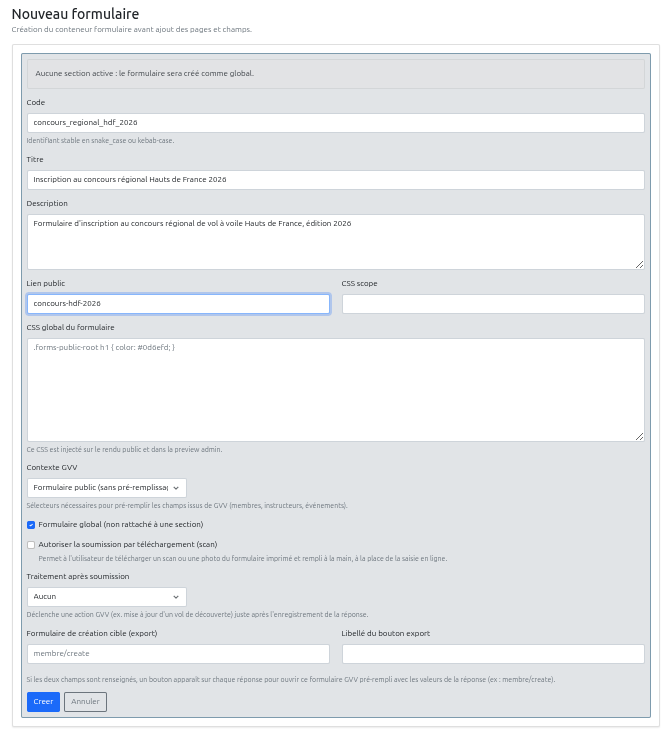

# Tutoriel — Créer un formulaire avec l'aide d'un assistant IA

Ce tutoriel construit, étape par étape, un formulaire réel : **l'inscription au concours régional de vol à voile Hauts de France 2026**. Il complète la [documentation de référence du module Formulaires](13_formulaires.md), qu'il est utile d'avoir parcourue au moins une fois.

L'idée directrice : plutôt que d'écrire le HTML à la main, on le demande à un assistant IA (ChatGPT, Claude, Gemini...) en lui donnant les contraintes de GVV, puis on colle le résultat dans l'interface d'administration. On part d'un formulaire minimal d'une seule page à trois champs, et on le complexifie progressivement — nouvelles pages, nouveaux types de champs, mise en forme — jusqu'au formulaire final à trois pages.

Les exemples de ce tutoriel utilisent ChatGPT, mais la même approche fonctionne avec n'importe quel assistant IA généraliste.

## Pré-requis

- Un compte GVV avec le rôle `ca` ou `club-admin` (accès à **Formulaires** dans le menu admin).
- Avoir lu au moins la section [Vue d'ensemble](13_formulaires.md#vue-densemble) de la documentation de référence.
- Un accès à un assistant IA (ChatGPT ou équivalent).

## Ce qu'on va construire

| Page | Champs | Types de champs illustrés |
|---|---|---|
| 1. Informations pilote | Nom, Prénom, Date de naissance, Téléphone, Numéro SPL, Photocopie SPL | text, date, file |
| 2. Informations planeur | Type, Immatriculation, Numéro de concours | select, number |
| 3. Engagement | Texte d'engagement, case "lu et approuvé", signature | checkbox, signature |

Ce tutoriel n'aborde pas le pré-remplissage depuis les données GVV (mécanismes A et B) ni le traitement après soumission — ce formulaire est un formulaire public autonome, sans lien avec les fiches membres. Voir [Pré-remplissage — mécanisme A](13_formulaires.md#pré-remplissage--mécanisme-a-attributs-data-gvv-source) si ce besoin se présente pour un autre formulaire.

## Aperçu local : à chaque page, deux fichiers

Chaque page générée par l'IA est demandée sous forme de **deux fichiers**, à enregistrer côte à côte sur ton poste :

- `pageN.html` — une page HTML5 **complète et autonome** (`<!DOCTYPE html>`, `<head>`, `<body>`...), qui référence `style.css` via `<link rel="stylesheet" href="style.css">` et charge Bootstrap 5 depuis un CDN.
- `style.css` — le CSS personnalisé, partagé par les trois pages (un seul fichier, comme le champ **CSS global du formulaire** dans GVV, qui est unique par formulaire).

En ouvrant `pageN.html` directement dans un navigateur (double-clic sur le fichier), tu vois le rendu réel — utile pour juger du résultat et itérer avec l'IA avant même de toucher à GVV.

C'est très proche de ce que GVV fait réellement en interne : chaque page enregistrée est stockée comme un document HTML autonome référençant `style.css` (voir [Gérer les pages](13_formulaires.md#gérer-les-pages)). Deux différences à connaître :

1. **Bootstrap** : GVV le charge automatiquement sur la page publique — inutile d'y penser une fois collé dans GVV. Le lien CDN n'est là que pour l'aperçu local.
2. **La classe `.forms-public-root`** : sur la page publique réelle, GVV enveloppe automatiquement le contenu de la page dans un conteneur portant cette classe (c'est la portée recommandée pour le CSS global — voir [Ce qui fonctionne](13_formulaires.md#ce-qui-fonctionne)). Pour que l'aperçu local se comporte à l'identique, on demande à l'IA d'envelopper elle-même le contenu du `<body>` dans un `<div class="forms-public-root">` — cette div ne sera **pas** recopiée dans GVV, seul son contenu l'est.

### Basculer entre aperçu et transfert : commenter Bootstrap

Le lien Bootstrap est une dépendance *locale uniquement* — GVV ne doit jamais la voir. Plutôt que de la retenir mentalement, on la marque directement dans le fichier avec un commentaire, et on la commente/décommente selon le besoin du moment :

```html
<!-- Aperçu local uniquement — GVV charge déjà Bootstrap 5, ne pas coller cette ligne dans l'admin -->
<link rel="stylesheet" href="https://cdn.jsdelivr.net/npm/bootstrap@5.3.3/dist/css/bootstrap.min.css">
```

- **Pendant l'édition** (avec l'IA, ou à la main) : la ligne reste active, pour un aperçu fidèle dans le navigateur.
- **Une fois le rendu validé**, avant le transfert vers GVV : commenter la ligne (`<!-- <link ...> -->`). Le fichier reste un document valide et complet, juste sans dépendance externe active — c'est cet état "figé" qui vaut la peine d'être gardé comme référence de la page, plutôt que jeté après le copier-coller.
- **Pour rééditer plus tard** : décommenter, ajuster, recommenter. Le fichier fait à la fois office de brouillon de travail et d'archive lisible du rendu voulu.

Ce commentaire ne change rien au transfert vers GVV : on continue à ne copier que l'intérieur de `forms-public-root`, qui ne contient jamais cette ligne (elle vit dans le `<head>`).

Le transfert vers GVV se fait donc en deux copier-coller, à chaque étape :

1. Le contenu **à l'intérieur** de `<div class="forms-public-root">...</div>` de `pageN.html` → champ **Contenu HTML** de la page GVV (bouton **Modifier la page**).
2. Le contenu de `style.css` → champ **CSS global du formulaire** de la fiche GVV (une seule fois, puis mise à jour au fil des étapes).

(voir aussi [Développement local](13_formulaires.md#développement-local) dans la référence, pour la variante plus succincte avec CSS inline)

---

## Étape 1 — Créer le conteneur du formulaire

Navigation : **Formulaires → Nouveau formulaire** (voir [Créer un formulaire](13_formulaires.md#créer-un-formulaire) pour le détail de chaque champ).

Renseigner :

| Champ | Valeur |
|---|---|
| Code | `concours_regional_hdf_2026` |
| Titre | `Inscription au concours régional Hauts de France 2026` |
| Description | `Formulaire d'inscription au concours régional de vol à voile Hauts de France, édition 2026.` |
| Lien public | `concours-hdf-2026` |
| Contexte GVV | `Formulaire public (sans pré-remplissage GVV)` |
| Formulaire global | Coché — le concours s'adresse à des pilotes de plusieurs sections/clubs |
| Autoriser la soumission par téléchargement (scan) | Non coché |
| Traitement après soumission | Aucun |

Laisser **Statut** sur `brouillon` : le formulaire n'est pas encore accessible publiquement, ce qui est voulu tant qu'on le construit.



Cliquer sur **Créer**. GVV crée le conteneur et redirige vers **Gérer les pages** du nouveau formulaire — il n'a pas encore de page.

---

## Étape 2 — Une première page minimale

On commence volontairement petit : une seule page, trois champs — mais générée d'emblée comme une page complète et son CSS, pour pouvoir la prévisualiser tout de suite dans un navigateur.

### Le prompt

Copier ce prompt dans ChatGPT :

```text
Je construis un formulaire pour l'application GVV (gestion de club de vol à
voile). Je veux d'abord un prototype prévisualisable directement dans un
navigateur, avant de l'intégrer dans GVV. Génère-moi deux fichiers séparés :

1. page1.html — une page HTML5 complète et autonome :
   - <!DOCTYPE html>, <html>, <head> avec <meta charset="utf-8">, un <title>,
     et <link rel="stylesheet" href="style.css">.
   - Juste avant le lien vers Bootstrap 5 (CDN, CSS uniquement), ajoute ce
     commentaire HTML pour le signaler comme dépendance de prévisualisation
     uniquement : "Apercu local uniquement -- GVV charge deja Bootstrap 5,
     ne pas coller cette ligne dans l'admin".
   - Dans le <body>, enveloppe tout le contenu de la page dans
     <div class="forms-public-root"> ... </div> (c'est la classe que GVV
     utilise pour scoper le CSS en production ; on l'ajoute ici uniquement
     pour que l'aperçu local se comporte comme le rendu réel).
   - Pas de balise <form> ni de bouton submit/reset dans ce contenu : la
     page sera collée plus tard dans un conteneur GVV qui gère lui-même la
     soumission et la navigation entre pages.
   - Chaque champ de saisie a un attribut name en snake_case (ex:
     name="date_naissance") et un <label for="..."> associé.
   - Mise en page avec les classes de grille Bootstrap 5 (row, col-md-*).

2. style.css — le CSS personnalisé référencé par page1.html, avec un style
   visuel jeune et dynamique : le public est un club de vol à voile qui
   s'adresse à des pilotes de compétition, quelque chose d'énergique, pas
   austère ni institutionnel (bannière de titre en couleur, badges arrondis,
   carte avec ombre légère...). Toutes les règles doivent être scopées sous
   .forms-public-root. Utilise une pile de polices système, pas de police à
   importer depuis un service externe.

Contenu de la page 1, un formulaire d'inscription au concours régional de vol
à voile "Hauts de France 2026", avec pour l'instant seulement trois champs :
- Nom (name="nom", obligatoire)
- Prénom (name="prenom", obligatoire)
- Date de naissance (name="date_naissance")

Ajoute en haut un titre de page engageant.
```

### Résultat attendu

L'IA invente ses propres classes CSS (`concours-hero`, `concours-badge`, `concours-card` dans cet exemple) — c'est normal, on lui a laissé la main sur le détail visuel. Retiens leurs noms : on les redonnera à l'IA à chaque prompt suivant pour qu'elle reste cohérente d'une page à l'autre.

**`page1.html`**

```html
<!DOCTYPE html>
<html lang="fr">
<head>
  <meta charset="utf-8">
  <title>Inscription concours HdF 2026 — page 1</title>
  <!-- Aperçu local uniquement — GVV charge déjà Bootstrap 5, ne pas coller cette ligne dans l'admin -->
  <link rel="stylesheet" href="https://cdn.jsdelivr.net/npm/bootstrap@5.3.3/dist/css/bootstrap.min.css">
  <link rel="stylesheet" href="style.css">
</head>
<body>
<div class="forms-public-root">

  <div class="concours-hero">
    <span class="concours-badge">Vol à voile</span>
    <h1>Inscription au concours régional Hauts de France 2026</h1>
    <p>Renseigne tes informations pilote pour valider ton engagement.</p>
  </div>

  <div class="concours-card">
    <div class="row g-3">
      <div class="col-md-6">
        <label class="form-label" for="nom">Nom <span class="text-danger">*</span></label>
        <input type="text" class="form-control" id="nom" name="nom" required>
      </div>
      <div class="col-md-6">
        <label class="form-label" for="prenom">Prénom <span class="text-danger">*</span></label>
        <input type="text" class="form-control" id="prenom" name="prenom" required>
      </div>
      <div class="col-md-6">
        <label class="form-label" for="date_naissance">Date de naissance</label>
        <input type="date" class="form-control" id="date_naissance" name="date_naissance">
      </div>
    </div>
  </div>

</div>
</body>
</html>
```

**`style.css`**

```css
.forms-public-root {
  font-family: "Segoe UI", system-ui, sans-serif;
}

.forms-public-root .concours-hero {
  background: linear-gradient(135deg, #ff7a18, #1fbf8f);
  color: #fff;
  border-radius: 14px;
  padding: 1.5rem 1.75rem;
  margin-bottom: 1.25rem;
}

.forms-public-root .concours-hero h1 {
  font-size: 1.5rem;
  font-weight: 800;
  margin: 0.25rem 0;
}

.forms-public-root .concours-hero p {
  margin: 0;
  opacity: 0.9;
}

.forms-public-root .concours-badge {
  display: inline-block;
  background: rgba(255, 255, 255, 0.25);
  border-radius: 999px;
  padding: 0.15rem 0.75rem;
  font-size: 0.75rem;
  font-weight: 700;
  text-transform: uppercase;
  letter-spacing: 0.05em;
}

.forms-public-root .concours-card {
  background: #fff;
  border: 1px solid #eee;
  border-radius: 14px;
  padding: 1.5rem;
  box-shadow: 0 4px 14px rgba(0, 0, 0, 0.06);
}

.forms-public-root .form-control,
.forms-public-root .form-select {
  border-radius: 10px;
}

.forms-public-root .form-control:focus,
.forms-public-root .form-select:focus {
  border-color: #1fbf8f;
  box-shadow: 0 0 0 0.2rem rgba(31, 191, 143, 0.25);
}
```

### Prévisualiser localement

Enregistrer les deux fichiers dans le même dossier, puis ouvrir `page1.html` par double-clic : le rendu Bootstrap + style personnalisé s'affiche directement, sans GVV. C'est le moment d'itérer avec l'IA si le résultat ne plaît pas (« le orange est trop criard », « la bannière est trop haute »...) avant de passer à GVV.


### Transférer dans GVV

Une fois le rendu local satisfaisant, commenter la ligne Bootstrap dans `page1.html` (`<!-- <link rel="stylesheet" href="..."> -->`) : ça fige le fichier dans son état "prêt pour GVV" et documente, pour une relecture future, que cette ligne ne doit pas suivre. Ça ne change rien au copier-coller qui suit — la ligne vit dans le `<head>`, jamais copié.

Depuis **Gérer les pages** du formulaire, cliquer sur **Nouvelle page**, donner un titre (ex. `Informations pilote`), et coller **le contenu intérieur** de la `<div class="forms-public-root">` (sans la div elle-même) dans **Contenu HTML**. Enregistrer.

Puis, depuis **Formulaires → Modifier le formulaire**, coller tout le contenu de `style.css` dans **CSS global du formulaire**. Enregistrer.

> 📸 **Capture à intégrer ici** : `../screenshots/formulaires/tutoriel/03-page1-edition-gvv.png` — l'écran "Modifier la page" avec le HTML collé.

### Vérifier dans GVV

- Bouton **Champs** sur la page : confirmer que `nom`, `prenom` et `date_naissance` sont bien reconnus.
- Bouton **Aperçu CSS** (fiche du formulaire) ou republication temporaire, pour comparer avec l'aperçu local.

> 📸 **Capture à intégrer ici** : `../screenshots/formulaires/tutoriel/04-page1-rendu-gvv.png` — rendu de la page 1 depuis GVV, à comparer à l'aperçu local.

---

## Étape 3 — Compléter la page « Informations pilote »

On ajoute les champs restants de la page 1 : téléphone, numéro de licence, et un champ d'upload pour la photocopie de la licence.

### Le prompt

Toujours dans la même conversation ChatGPT (pour qu'elle garde le contexte et le style) :

```text
Reprends page1.html et ajoute, dans la même carte (concours-card), ces champs
supplémentaires, avec exactement le même style :

- Téléphone (name="telephone", type="tel")
- Numéro de licence SPL (name="numero_spl", obligatoire) — ajoute aussi
  l'attribut data-gvv-identifier="true" sur ce champ. C'est un attribut
  technique invisible à l'écran, à ne pas retirer.
- Photocopie de la licence SPL (name="photocopie_spl", type="file",
  accept="image/jpeg,image/png,application/pdf", obligatoire) avec un texte
  d'aide précisant les formats acceptés et la taille maximale (5 Mo)

Redonne-moi le fichier page1.html complet et mis à jour. Pas besoin de
retoucher style.css sauf si un nouvel élément visuel le nécessite.
```

### Résultat attendu

Dans `page1.html`, à ajouter dans la `row` existante, après le champ `date_naissance` :

```html
      <div class="col-md-6">
        <label class="form-label" for="telephone">Téléphone</label>
        <input type="tel" class="form-control" id="telephone" name="telephone">
      </div>
      <div class="col-md-6">
        <label class="form-label" for="numero_spl">Numéro de licence SPL <span class="text-danger">*</span></label>
        <input type="text" class="form-control" id="numero_spl" name="numero_spl"
               data-gvv-identifier="true" required>
      </div>
      <div class="col-12">
        <label class="form-label" for="photocopie_spl">Photocopie de la licence SPL <span class="text-danger">*</span></label>
        <input type="file" class="form-control" id="photocopie_spl" name="photocopie_spl"
               accept="image/jpeg,image/png,application/pdf" required>
        <div class="form-text">Formats acceptés : JPG, PNG, PDF. Taille maximale : 5 Mo.</div>
      </div>
```

Deux détails à noter :

- `type="tel"` n'est pas un des [types de champs](13_formulaires.md#types-de-champs) reconnus par GVV : il est enregistré comme `text` (comportement de repli documenté), ce qui est très bien ici — on veut juste un clavier téléphone sur mobile, pas de validation de format particulière.
- `data-gvv-identifier="true"` sur `numero_spl` fait apparaître ce numéro comme identifiant de chaque réponse dans la liste admin, à la place d'un générique "Anonyme" — voir [Consulter les réponses](13_formulaires.md#consulter-les-réponses).

Revérifier dans le navigateur avec `page1.html` en local, puis reporter le changement dans GVV comme à l'étape précédente (copier l'intérieur de `forms-public-root` dans **Contenu HTML**), et revérifier avec le bouton **Champs**.

> 📸 **Capture à intégrer ici** : `../screenshots/formulaires/tutoriel/05-page1-complete.png` — rendu de la page 1 complète, avec le champ fichier.

---

## Étape 4 — Ajouter la page « Informations planeur »

### Le prompt

Nouveau fichier, même style, même `style.css` :

```text
Crée maintenant page2.html : une deuxième page HTML5 complète et autonome
pour le même formulaire, avec exactement la même structure de fichier que
page1.html (head avec Bootstrap 5 CDN + lien vers style.css, body enveloppé
dans <div class="forms-public-root">), et les mêmes classes visuelles
(concours-hero, concours-badge, concours-card) — le style.css existant ne
change pas. Titre de page : "Informations planeur".

Champs à inclure :
- Type de planeur (name="type_planeur"), liste déroulante avec les options :
  ASK 21, ASK 23, LS4, Discus CS, DG-303, Duo Discus, Ventus, Ka 6, Pégase,
  Autre
- Immatriculation (name="immatriculation", obligatoire, avec un exemple
  d'aide du type "F-CxxX")
- Numéro de concours (name="numero_concours", type="number", obligatoire) —
  ajoute aussi l'attribut data-gvv-validation="numeric" sur ce champ

Mêmes contraintes que page1.html : pas de <form> ni de bouton submit/reset
dans le contenu, name en snake_case avec <label for>.
```

### Résultat attendu

**`page2.html`**

```html
<!DOCTYPE html>
<html lang="fr">
<head>
  <meta charset="utf-8">
  <title>Inscription concours HdF 2026 — page 2</title>
  <!-- Aperçu local uniquement — GVV charge déjà Bootstrap 5, ne pas coller cette ligne dans l'admin -->
  <link rel="stylesheet" href="https://cdn.jsdelivr.net/npm/bootstrap@5.3.3/dist/css/bootstrap.min.css">
  <link rel="stylesheet" href="style.css">
</head>
<body>
<div class="forms-public-root">

  <div class="concours-hero">
    <span class="concours-badge">Vol à voile</span>
    <h1>Informations planeur</h1>
    <p>Le planeur que tu piloteras pendant le concours.</p>
  </div>

  <div class="concours-card">
    <div class="row g-3">
      <div class="col-md-4">
        <label class="form-label" for="type_planeur">Type de planeur</label>
        <select class="form-select" id="type_planeur" name="type_planeur">
          <option value="">-- Choisir --</option>
          <option value="ASK 21">ASK 21</option>
          <option value="ASK 23">ASK 23</option>
          <option value="LS4">LS4</option>
          <option value="Discus CS">Discus CS</option>
          <option value="DG-303">DG-303</option>
          <option value="Duo Discus">Duo Discus</option>
          <option value="Ventus">Ventus</option>
          <option value="Ka 6">Ka 6</option>
          <option value="Pégase">Pégase</option>
          <option value="Autre">Autre</option>
        </select>
      </div>
      <div class="col-md-4">
        <label class="form-label" for="immatriculation">Immatriculation <span class="text-danger">*</span></label>
        <input type="text" class="form-control" id="immatriculation" name="immatriculation"
               placeholder="F-CxxX" required>
      </div>
      <div class="col-md-4">
        <label class="form-label" for="numero_concours">Numéro de concours <span class="text-danger">*</span></label>
        <input type="number" class="form-control" id="numero_concours" name="numero_concours"
               data-gvv-validation="numeric" min="1" required>
      </div>
    </div>
  </div>

</div>
</body>
</html>
```

`style.css` ne change pas : les classes `concours-hero`, `concours-badge` et `concours-card` sont déjà stylées et réutilisées telles quelles.

`data-gvv-validation="numeric"` ajoute une règle de validation côté serveur en plus du type — voir [Champs détectés automatiquement](13_formulaires.md#champs-détectés-automatiquement) pour les autres règles disponibles (`max_length[n]`, `min_length[n]`, `valid_email`).

Prévisualiser `page2.html` en local (même dossier que `style.css`), commenter la ligne Bootstrap une fois satisfait, puis créer la page dans GVV (**Gérer les pages → Nouvelle page**, titre `Informations planeur`) et y coller le contenu intérieur de `forms-public-root`. Pas besoin de retoucher le CSS global du formulaire, déjà en place depuis l'étape 2.

> 📸 **Capture à intégrer ici** : `../screenshots/formulaires/tutoriel/06-page2-rendu.png` — rendu de la page 2.

---

## Étape 5 — Ajouter la page « Engagement »

### Le prompt

```text
Crée page3.html : la troisième et dernière page HTML5 complète du formulaire,
même structure de fichier et mêmes classes visuelles que les deux
précédentes (style.css inchangé), titre de page "Engagement".

Contenu :
1. Un court paragraphe d'engagement sur l'honneur (2-3 phrases) : le
   candidat certifie l'exactitude des informations fournies et s'engage à
   respecter le règlement du concours ainsi que les consignes de sécurité de
   l'épreuve.
2. Une case à cocher obligatoire "Je certifie sur l'honneur l'exactitude des
   informations fournies et m'engage à respecter le règlement du concours"
   (name="engagement_lu_approuve")
3. Une zone de signature électronique, avec exactement ce bloc HTML (c'est un
   widget spécial de GVV, ne le modifie pas — tu peux juste styler ce qui
   l'entoure) :

<div data-gvv-type="signature"
     data-gvv-name="signature_candidat"
     data-gvv-required="true">
  Signature du candidat
</div>

Mêmes contraintes que les pages précédentes (pas de <form> ni de bouton
submit/reset dans le contenu).
```

### Résultat attendu

**`page3.html`**

```html
<!DOCTYPE html>
<html lang="fr">
<head>
  <meta charset="utf-8">
  <title>Inscription concours HdF 2026 — page 3</title>
  <!-- Aperçu local uniquement — GVV charge déjà Bootstrap 5, ne pas coller cette ligne dans l'admin -->
  <link rel="stylesheet" href="https://cdn.jsdelivr.net/npm/bootstrap@5.3.3/dist/css/bootstrap.min.css">
  <link rel="stylesheet" href="style.css">
</head>
<body>
<div class="forms-public-root">

  <div class="concours-hero">
    <span class="concours-badge">Vol à voile</span>
    <h1>Engagement</h1>
    <p>Dernière étape avant l'envoi.</p>
  </div>

  <div class="concours-card">
    <p>
      En m'inscrivant au concours régional Hauts de France 2026, je certifie
      l'exactitude des informations fournies dans ce formulaire. Je m'engage à
      respecter le règlement du concours ainsi que les consignes de sécurité
      communiquées par les organisateurs pendant toute la durée de l'épreuve.
    </p>

    <div class="form-check mb-3">
      <input class="form-check-input" type="checkbox" id="engagement_lu_approuve"
             name="engagement_lu_approuve" value="1" required>
      <label class="form-check-label" for="engagement_lu_approuve">
        Je certifie sur l'honneur l'exactitude des informations fournies et
        m'engage à respecter le règlement du concours
      </label>
    </div>

    <div data-gvv-type="signature"
         data-gvv-name="signature_candidat"
         data-gvv-required="true">
      Signature du candidat
    </div>
  </div>

</div>
</body>
</html>
```

Note : dans l'aperçu local (hors GVV), le widget de signature ne s'affiche pas comme un vrai widget interactif — c'est juste le `<div>` déclaratif tel quel, tant qu'il n'est pas rendu par GVV. Voir [Champ signature](13_formulaires.md#champ-signature) : GVV le remplace par le widget fonctionnel uniquement sur la page publique réelle. Le vrai rendu ne se vérifie qu'après collage dans GVV.

Commenter la ligne Bootstrap une fois l'aperçu local validé, puis créer la page dans GVV (titre `Engagement`), coller le contenu intérieur de `forms-public-root`, enregistrer.

> 📸 **Capture à intégrer ici** : `../screenshots/formulaires/tutoriel/07-page3-rendu.png` — rendu de la page 3 depuis GVV, avec le widget de signature actif.

---

## Étape 6 — Ajuster le CSS et la mise en page

Le CSS "jeune et dynamique" a été généré dès l'étape 2 et réutilisé tel quel sur les pages 2 et 3. Cette étape couvre les retouches, une fois les trois pages en place.

### Itérer sur le CSS

Redemander une variante à l'IA en précisant ce qui gêne, en lui rappelant qu'elle doit rester dans le même fichier `style.css` scopé sous `.forms-public-root` :

```text
Dans style.css, le orange de .concours-hero est trop criard sur écran mobile
et le contraste du texte n'est pas suffisant. Propose une variante plus
douce, en gardant le même esprit "jeune et dynamique" et le même scope
.forms-public-root.
```

Remettre à jour **CSS global du formulaire** dans GVV avec le résultat (voir [Règles CSS](13_formulaires.md#règles-css) pour les contraintes à ne pas oublier : pas de `@import`, pas de sélecteur non scopé).

### Ajuster la mise en page

La mise en page (colonnes, largeur des champs) se pilote uniquement avec les classes de grille Bootstrap déjà présentes dans le HTML généré — `row`, `col-md-4`, `col-md-6`, `col-12`. Pour changer la disposition (ex. mettre `immatriculation` et `numero_concours` sur toute la largeur au lieu d'un tiers), il suffit de changer la classe `col-md-*` du `<div>` concerné dans **Modifier la page**, sans repasser par l'IA — voir [Ce qui fonctionne](13_formulaires.md#ce-qui-fonctionne) pour la liste des classes Bootstrap disponibles.

> 📸 **Capture à intégrer ici** : `../screenshots/formulaires/tutoriel/08-css-ajuste.png` — les 3 pages avec le CSS retouché.

---

## Étape 7 — Publier et tester

1. **Formulaires → Modifier le formulaire**, passer **Statut** à `publié`.
2. Ouvrir le lien public (`http://gvv.net/index.php/forms/concours-hdf-2026`), remplir les trois pages, envoyer.
3. **Formulaires → [le formulaire] → Réponses** : vérifier que la réponse apparaît, identifiée par le numéro SPL saisi (grâce à `data-gvv-identifier`), et que la photocopie SPL et la signature sont bien jointes.

> 📸 **Capture à intégrer ici** : `../screenshots/formulaires/tutoriel/09-reponse-admin.png` — la réponse dans la liste admin, avec la pièce jointe et la signature ouvertes.

---

## Pour aller plus loin

Ce formulaire n'utilise pas tous les types de champs disponibles dans GVV — cela n'aurait pas eu de sens de les forcer dans ce contexte précis. Trois types ne sont pas illustrés ici : `email`, `radio`, `textarea`. Leur syntaxe suit exactement le même principe (Bootstrap 5 + attribut `name`) — voir [Exemples HTML par type](13_formulaires.md#exemples-html-par-type) pour les copier-coller directement. À titre d'exercice, on pourrait par exemple ajouter sur la page 1 un champ email de contact, ou sur la page 3 un champ radio « Besoin d'un hébergement sur place ? Oui / Non ».

---

## Récapitulatif des champs du formulaire final

| Page | Champ | `name` | Type | Obligatoire | Particularité |
|---|---|---|---|---|---|
| 1. Informations pilote | Nom | `nom` | text | Oui | |
| | Prénom | `prenom` | text | Oui | |
| | Date de naissance | `date_naissance` | date | Non | |
| | Téléphone | `telephone` | text (`type="tel"`) | Non | |
| | Numéro de licence SPL | `numero_spl` | text | Oui | `data-gvv-identifier="true"` |
| | Photocopie de la licence SPL | `photocopie_spl` | file | Oui | JPG/PNG/PDF, 5 Mo max |
| 2. Informations planeur | Type de planeur | `type_planeur` | select | Non | |
| | Immatriculation | `immatriculation` | text | Oui | |
| | Numéro de concours | `numero_concours` | number | Oui | `data-gvv-validation="numeric"` |
| 3. Engagement | Texte d'engagement | — | (contenu statique, pas un champ) | — | |
| | Case « lu et approuvé » | `engagement_lu_approuve` | checkbox | Oui | |
| | Signature | `signature_candidat` | signature | Oui | |
