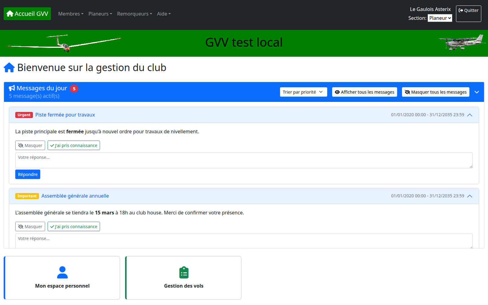
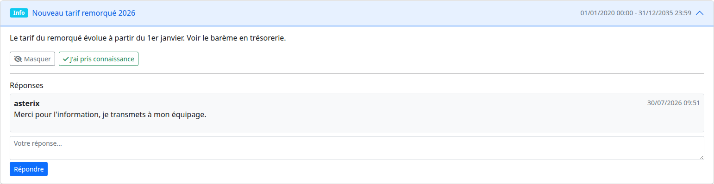
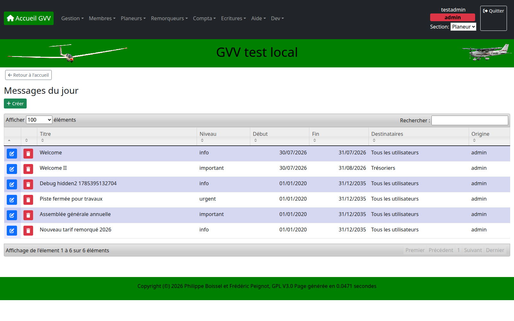
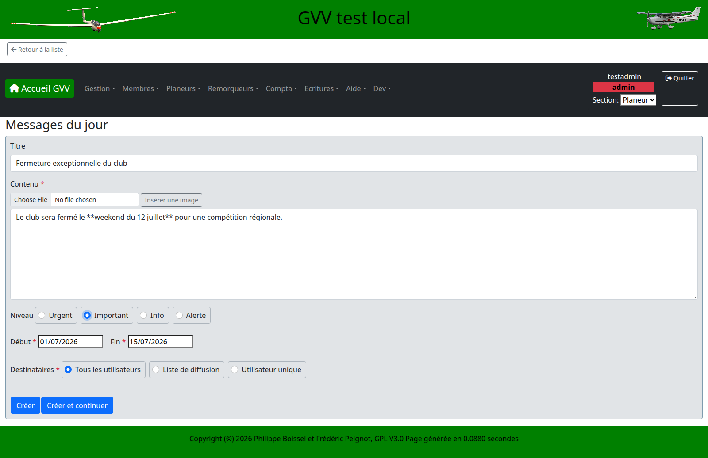

# 15. Gestion des Messages (Messages du Jour)

## Vue d'ensemble

GVV permet aux administrateurs de club de diffuser des **messages du jour** (annonces, alertes, informations) directement sur le tableau de bord de chaque utilisateur concerné : fermeture de piste, assemblée générale, changement de tarif, etc.

Chaque pilote voit ses messages dès sa connexion, peut en **prendre connaissance**, **répondre**, ou les **masquer** individuellement une fois traités.

> **Important - à qui s'adresse cet outil :** ce système fonctionne par affichage sur le tableau de bord d'accueil. Il est donc très efficace pour les membres qui se connectent régulièrement à GVV — **trésoriers**, **planchistes**, et **pilotes qui réservent des avions ou des planeurs** — puisqu'ils voient le message dès leur prochaine connexion. En revanche, un pilote présent dans la base de données mais qui **ne réserve pas de machine** et **ne consulte pas son compte**, ne se connectera pas et ne verra donc pas le message avant longtemps, même si celui-ci lui est destiné. Pour une communication urgente touchant l'ensemble des membres, prévoyez un canal complémentaire (email, affichage papier, téléphone).

---

## 1. Fonctionnalités

### 1.1 Niveaux de message

Chaque message peut porter un niveau qui détermine sa couleur et sa priorité d'affichage :

| Niveau | Badge | Comportement |
|--------|-------|--------------|
| **Urgent** | 🔴 rouge | Le message reste déplié automatiquement tant qu'il n'a pas été pris en compte |
| **Important** | 🟠 orange | Même comportement que Urgent |
| **Info** | 🔵 bleu | Affiché replié par défaut |
| **Alerte** | ⚪ gris | Affiché replié par défaut |
| *(aucun)* | — | Niveau facultatif, message neutre |

### 1.2 Ciblage des destinataires

Un message peut être adressé à :
- **Tous les utilisateurs** du club
- Une **liste de diffusion** existante
- Un **utilisateur unique**

### 1.3 Actions du pilote

Depuis le tableau de bord, chaque destinataire peut :
- **Trier** les messages par priorité ou par date
- **Déplier/replier** un message pour lire son contenu (mise en forme Markdown, images)
- **Répondre** au message (les réponses sont visibles par l'administrateur et par les autres destinataires)
- **J'ai pris connaissance** — marque le message comme lu, ce qui décrémente le compteur de messages non lus
- **Masquer** un message (individuellement, ou tous d'un coup via **Masquer tous les messages**) : le message disparaît de son tableau de bord personnel sans affecter les autres destinataires
- **Afficher tous les messages** — fait réapparaître les messages que le pilote avait masqués, avec un compteur indiquant combien sont actuellement masqués

---

## 2. Administration des Messages

**Rôle requis** : Administrateur du club (`club-admin`)
**Menu** : `Administration > Gestion des messages`
**URL** : `/motd/page`

La liste d'administration présente tous les messages créés (actifs, passés ou futurs), avec leur niveau, leurs dates de validité, leurs destinataires et leur origine.

### 2.1 Créer un message

Cliquez sur **+ Créer** et renseignez :

| Champ | Description |
|-------|--------------|
| **Titre** | Facultatif, affiché dans l'en-tête du message |
| **Contenu** | Obligatoire, texte au format Markdown (gras, listes, liens, images) |
| **Insérer une image** | Téléverse une image et l'insère dans le contenu |
| **Niveau** | Urgent / Important / Info / Alerte / aucun |
| **Début / Fin** | Période de validité du message (dates obligatoires, la fin ne peut pas précéder le début) |
| **Destinataires** | Tous les utilisateurs, une liste de diffusion, ou un utilisateur unique |

### 2.2 Modifier ou supprimer un message

Depuis la liste, utilisez les icônes **crayon** (modifier) ou **corbeille** (supprimer, avec confirmation) sur la ligne concernée.

> **Note :** un message dont la période de validité est terminée n'est plus affiché aux pilotes mais reste consultable dans la liste d'administration tant qu'il n'est pas supprimé.

---

## 3. Bonnes pratiques

- **Réservez cet outil aux annonces qui peuvent attendre une prochaine connexion** : sortie de piste, réunion, changement de tarif, information générale.
- **Ne comptez pas dessus pour joindre en urgence un pilote qui ne se connecte pas régulièrement** — utilisez le téléphone ou l'email pour toute information nécessitant une prise de connaissance rapide et garantie.
- **Fixez toujours une date de fin réaliste** pour qu'un message obsolète ne reste pas affiché indéfiniment.
- **Utilisez le niveau Urgent avec parcimonie** : il force l'affichage déplié du message tant qu'il n'est pas pris en compte, ce qui perd de son effet s'il est utilisé trop souvent.
