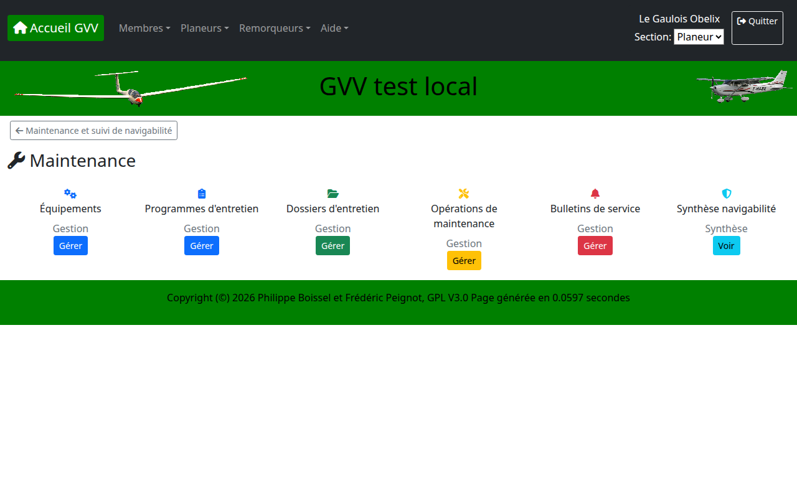
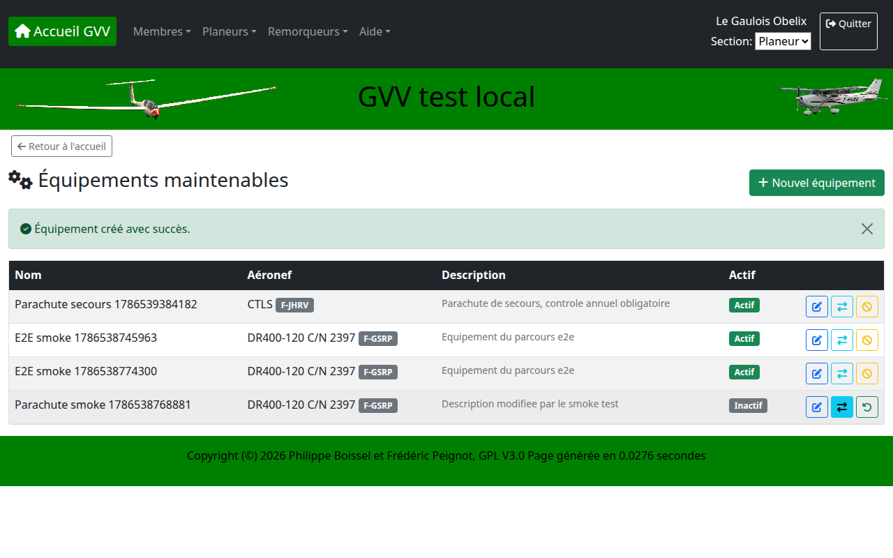
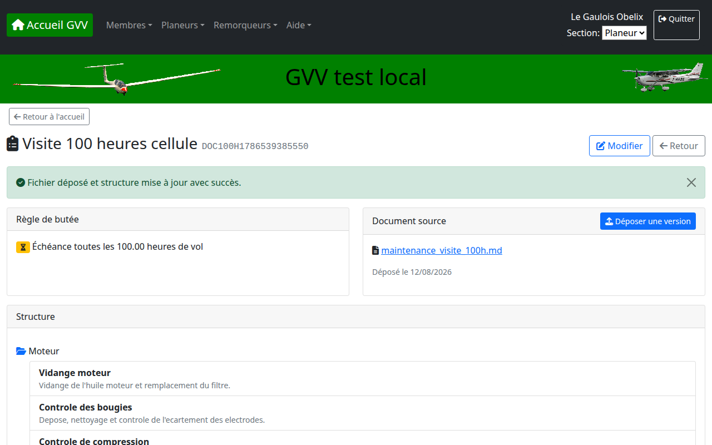
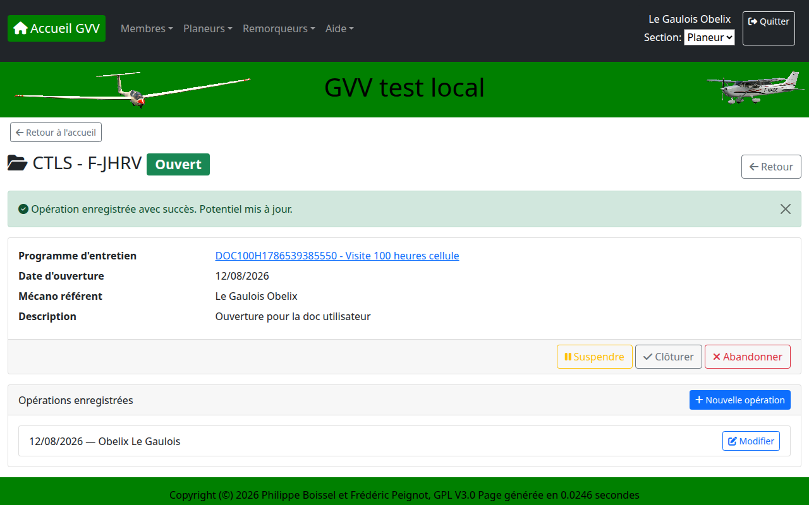
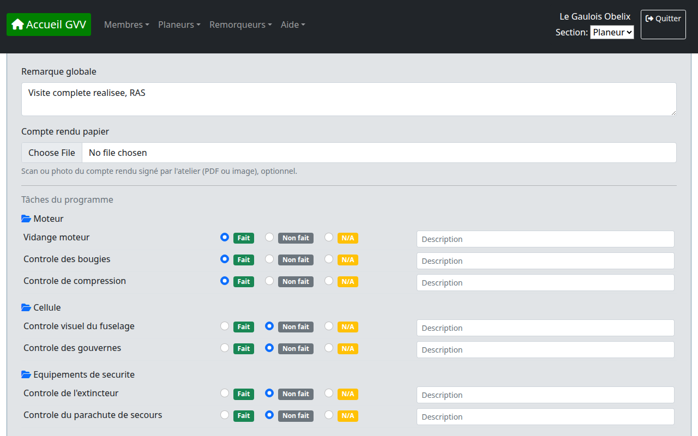
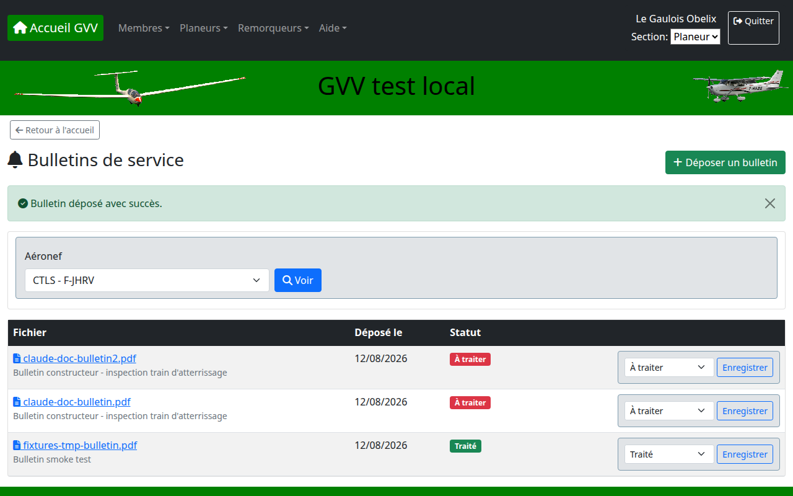
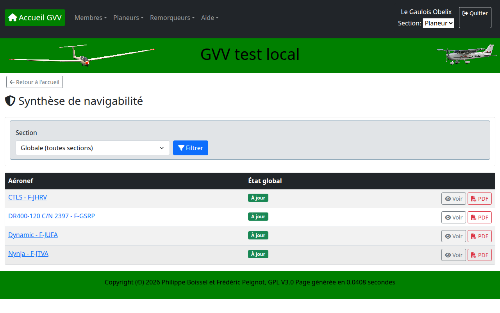
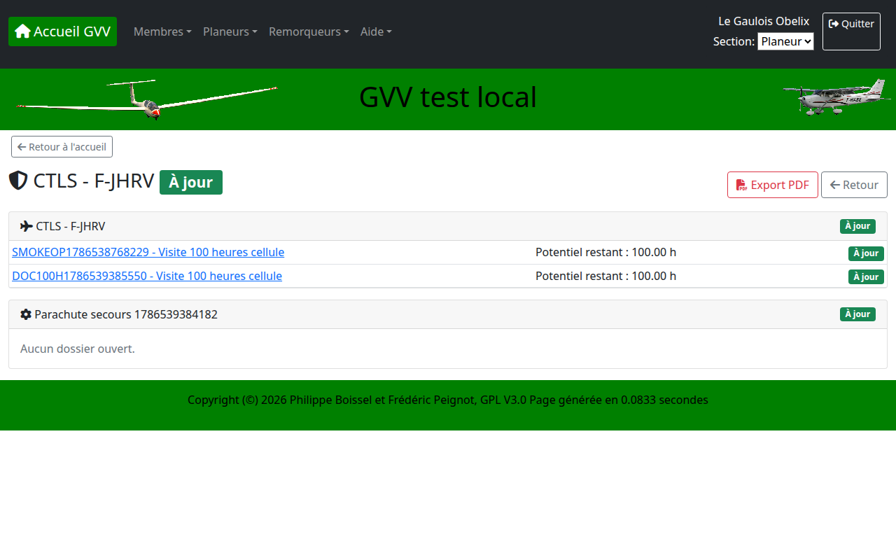

# Gestion de la Maintenance des Aéronefs

Le module Maintenance suit l'état de navigabilité de la flotte : équipements embarqués, programmes d'entretien, dossiers ouverts par aéronef ou équipement, opérations réalisées et bulletins de service constructeur. Il s'adresse à trois profils : le mécano (gestion complète), le responsable de section / trésorier (consultation), et tout pilote (consultation de l'état de navigabilité uniquement).

## Table des matières

1. [Vue d'ensemble](#vue-densemble)
2. [Équipements maintenables](#équipements-maintenables)
3. [Programmes d'entretien](#programmes-dentretien)
4. [Dossiers d'entretien](#dossiers-dentretien)
5. [Opérations de maintenance](#opérations-de-maintenance)
6. [Bulletins de service](#bulletins-de-service)
7. [Synthèse de navigabilité](#synthèse-de-navigabilité)
8. [Tableau des potentiels](#tableau-des-potentiels)
9. [Droits d'accès](#droits-daccès)

## Vue d'ensemble

Le tableau de bord Maintenance (menu **Planeurs/Remorqueurs > Maintenance**, réservé aux mécanos et administrateurs) donne accès à l'ensemble des fonctions du module.



- **Équipements** : matériel embarqué suivi indépendamment de l'aéronef (parachute, extincteur, radio, etc.)
- **Programmes d'entretien** : contenu structuré (sections/tâches) déposé en Markdown, avec règle de butée (calendaire et/ou horaire)
- **Dossiers d'entretien** : association d'un aéronef ou d'un équipement à un programme, avec son cycle de vie
- **Opérations de maintenance** : intervention datée qui fait progresser un dossier, en saisie directe ou par dépôt d'un compte rendu papier
- **Bulletins de service** : documents constructeur rattachés à un aéronef, avec statut de traitement
- **Synthèse navigabilité** : état global de la flotte, accessible à tout pilote en lecture seule

---

## Équipements maintenables

Un équipement est rattaché à un seul aéronef à la fois. Il peut être créé, modifié, transféré vers un autre aéronef, ou désactivé (l'historique reste consultable).



- **Nouvel équipement** : nom, aéronef de rattachement, description
- **Transférer** : change l'aéronef de rattachement ; les dossiers et opérations déjà enregistrés restent liés à l'équipement (son identifiant ne change pas) et donc consultables sans perte d'historique
- **Désactiver / Réactiver** : masque l'équipement des listes actives sans supprimer son historique

---

## Programmes d'entretien

Un programme définit le contenu à vérifier, structuré en sections puis en tâches, et une règle de butée (échéance calendaire, horaire, ou les deux).



Le contenu est déposé en Markdown, avec un format volontairement simple :

```markdown
# Visite 100 heures cellule

## Moteur

### Vidange moteur
Vidange de l'huile moteur et remplacement du filtre.

### Controle des bougies
Depose, nettoyage et controle de l'ecartement des electrodes.

## Cellule

### Controle visuel du fuselage
Inspection des surfaces et jonctions, recherche de fissures.
```

- **Titre du programme** : titre de niveau 1 (`#`)
- **Sections** : titres de niveau 2 (`##`), pour regrouper les tâches (moteur, cellule, équipements de sécurité, etc.)
- **Tâches** : titres de niveau 3 (`###`), chaque point de contrôle élémentaire ; le texte sous le titre devient sa description

Un fichier invalide (aucune section, section sans tâche, tâche sans titre) est rejeté avant tout enregistrement — rien n'est archivé tant que le fichier n'est pas valide. Chaque dépôt crée une nouvelle version, conservée dans l'historique documentaire ; les dossiers déjà ouverts continuent de référencer le programme et sa structure la plus récente.

---

## Dossiers d'entretien

Un dossier associe un aéronef ou un équipement à un programme d'entretien et suit son cycle de vie : **Ouvert → Suspendu/Clôturé/Abandonné**.



- **Ouvrir un dossier** : depuis le tableau de bord Maintenance, choisir l'entité (aéronef ou équipement) puis le programme à appliquer
- **Suspendre** : interrompt temporairement le suivi (aéronef immobilisé, par exemple), réactivable
- **Clôturer** / **Abandonner** : mettent fin au suivi ; le dossier reste consultable dans l'historique de l'entité
- L'historique des dossiers d'une entité (y compris clôturés) reste accessible même après un transfert d'équipement vers un autre aéronef

---

## Opérations de maintenance

Une opération enregistre une intervention datée sur un dossier ouvert, selon deux modes possibles sur le même écran :



- **Saisie directe** : chaque tâche du programme est cochée Fait / Non fait / Non applicable, avec un commentaire optionnel par tâche
- **Compte rendu papier** : dépôt d'un scan ou d'une photo du compte rendu signé par l'atelier (PDF ou image), consultable ensuite depuis l'historique du dossier
- **Relevé horamètre** / **Nouvelle échéance** : selon la règle de butée du programme, ces champs recalculent automatiquement le potentiel restant du dossier après enregistrement

Les deux modes ne s'excluent pas : une opération peut à la fois cocher des tâches et joindre un compte rendu.

---

## Bulletins de service

Les bulletins constructeur sont rattachés à un aéronef et suivis avec un statut applicatif (à traiter / traité / non applicable), indépendant du système documentaire générique utilisé pour le reste du dossier pilote.



- Sélectionner l'aéronef pour voir ses bulletins déposés
- **Déposer un bulletin** : fichier + description
- Le statut se change directement depuis la liste, sans repasser par un formulaire

---

## Synthèse de navigabilité

La synthèse donne l'état global de chaque aéronef (À jour / Échéance proche / Dépassé), calculé comme le pire état parmi ses dossiers ouverts et ceux de ses équipements.



En cliquant sur un aéronef, le détail affiche chaque entité (aéronef + ses équipements) avec, pour chaque dossier ouvert, l'échéance courante et/ou le potentiel restant en heures.



Un export PDF est disponible pour chaque aéronef, utile pour un contrôle sans connexion.

---

## Tableau des potentiels

Le tableau des potentiels reprend, à l'écran, la forme du tableau blanc physique tenu en atelier : une ligne par aéronef, une colonne par programme d'entretien (25h, 50h, 100h, 200h, CDN, etc.), avec pour chaque cellule l'échéance ou le potentiel restant. Contrairement à la synthèse de navigabilité (état global À jour / Échéance proche / Dépassé par aéronef), il donne directement la valeur affichée sur le tableau physique.

Accessible depuis le tableau de bord Maintenance, carte **Tableau des potentiels**, ou directement via `maintenance_synthese/tableau`.

- **Heures réelles** : dernier relevé d'horamètre enregistré sur une opération de maintenance de l'aéronef, tous programmes confondus
- **Une colonne par programme actif** : générée automatiquement à partir des dossiers ouverts — aucune colonne n'est codée en dur, un club ajoute une colonne en créant un programme et en ouvrant un dossier par aéronef concerné
- **Cellule vide (—)** : aucun dossier ouvert pour ce couple aéronef/programme
- Couleur de la cellule : même code que la synthèse de navigabilité (vert = à jour, orange = échéance proche, rouge = dépassé)
- Filtrable par section, comme la synthèse

### Configurer le tableau pas à pas

Pour retrouver les colonnes d'un tableau blanc d'atelier (par exemple 25h / 50h / 100h / 200h / CDN) :

**1. Créer un programme par colonne** (menu **Maintenance → Programmes d'entretien → Nouveau programme**)

Pour une colonne horaire (25h, 50h, 100h, 200h...) :
- Code : ex. `VISITE100H`
- Butée horaire activée, Seuil = 100 (heures)
- Section : laisser vide si le programme s'applique à toutes les machines, ou choisir une section (Avion, ULM, Planeur)

Pour la colonne CDN (certificat de navigabilité) :
- Code : `CDN`
- Butée calendaire activée, Périodicité = 12 mois (ou la valeur applicable)

Répéter pour chaque colonne voulue.

**2. Ouvrir un dossier par aéronef et par programme** (menu **Maintenance → Dossiers d'entretien → Ouvrir (aéronef)**)

Chaque dossier ouvert fait apparaître une colonne remplie pour cet aéronef dans le tableau. Un aéronef sans dossier sur un programme donné affiche `—` pour cette colonne.

**3. Enregistrer une opération pour initialiser le potentiel** (menu **Maintenance → Opérations de maintenance → Nouvelle opération**)

C'est cette étape qui remplit les valeurs affichées :
- Programme à butée horaire : saisir l'**horamètre relevé** — le potentiel repart au seuil du programme (ex. 100h), et cette valeur alimente aussi la colonne **Heures réelles**
- Programme à butée calendaire (CDN) : laisser la **nouvelle échéance** vide pour un calcul automatique (+périodicité depuis la date de l'opération), ou saisir une échéance explicite

**4. Consulter le tableau**

Carte **Tableau des potentiels** du tableau de bord Maintenance. À chaque nouvelle opération enregistrée, la colonne correspondante se met à jour automatiquement — pas de ressaisie manuelle nécessaire au quotidien.

---

## Droits d'accès

| Profil | Synthèse navigabilité | Historique (dossiers/opérations/bulletins/programmes) | Écriture |
|---|---|---|---|
| Mécano / administrateur | Lecture | Lecture | Complète (mécano borné à sa section) |
| Responsable de section, trésorier | Lecture | Lecture | Aucune |
| Pilote (membre standard) | Lecture | — | Aucune |

L'accès en écriture (création, modification, transfert, changement de statut) est toujours réservé aux mécanos et administrateurs. Toute tentative d'accès non autorisé affiche un message d'erreur explicite — jamais un échec silencieux.
