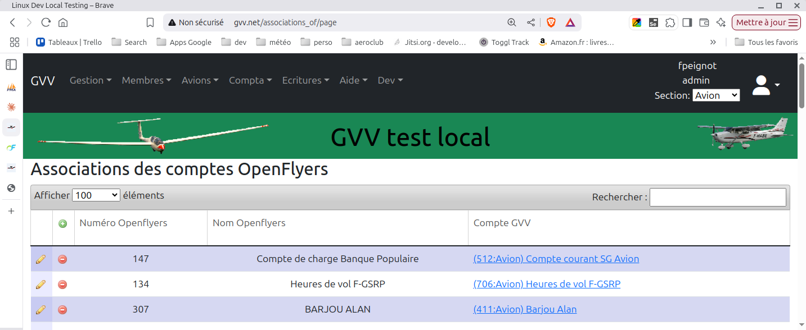
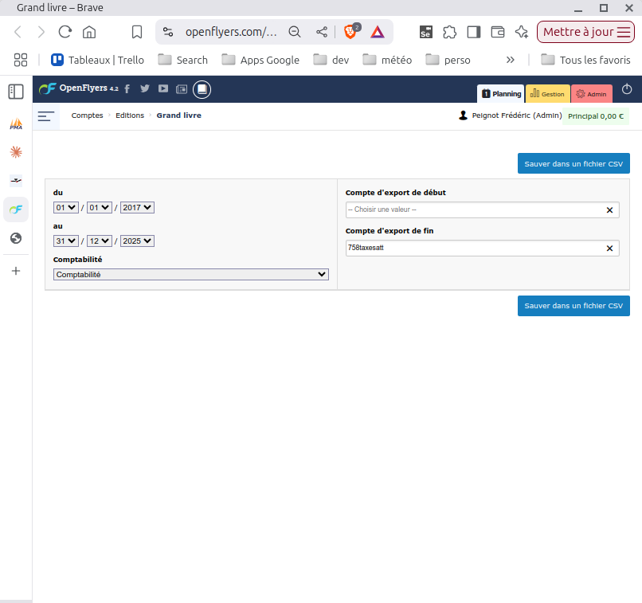
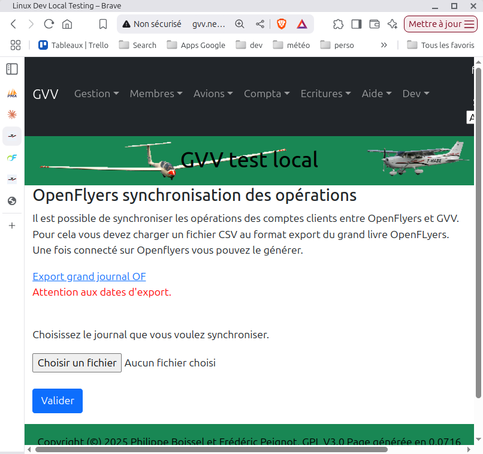
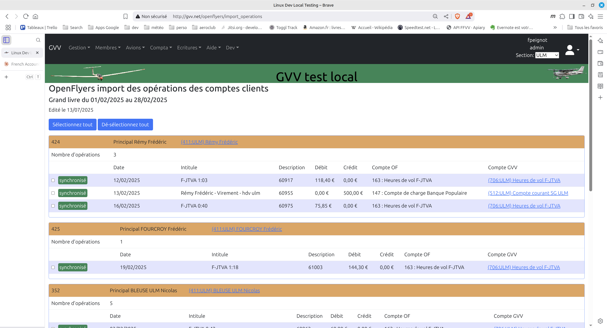

# Intégration avec OpenFlyers

Il est possible d'utiliser OpenFLyers pour gérer les comptes clients et la facturation. Dans ce cas les opérations qui affectent les comptes clients, approvisionnements, facturation, remboursements sont effectuées dans OpenFlyers puis les comptes sont synchronisés avec GVV. Si vous voulez inclure des numéros de cheque, référence de virement, etc., c'est dans OpenFLyers qu'il faut saisir l'information.

Le résultat final est identique à ce qu'il aurait été si la facturation et les opérations sur les comptes clients avaient été saisies dans GVV.

Depuis GVV il est possible de:
* Associer les comptes OpenFLyers et les comptes GVV. Cette opération est indispensable pour que GVV sache quel compte utiliser lors d'une opération de synchronisation.
* Importer les soldes initiaux des comptes clients
* Vérifier les soldes à une date données. Après initialisation et synchronisation régulière les comptes doivent rester synchronisés. Cette opération permet de le vérifier.
* Synchroniser (importer dans GVV) les opérations pour une période donnée.
* Supprimer les opérations synchronisées pour une période donnée.

Toutes les opérations qui génèrent ou modifient des écritures doivent être effectuées avec une section active.

## Stratégies de synchronisation

Dans un monde idéal, les comptes clients devraient rester synchronisés au fil du temps.

Néanmoins il peut arriver qu'un administrateur corrige dans OpenFlyers des vols dans le passé après avoir constaté des erreurs. L'expérience nous montre qu'on peut parfois détecter ces erreurs après plusieurs semaines,après que les écritures correspondantes aient été synchronisées. Ces modifications tardives entraînent des dé-synchronisations entre OpenFlyers et GVV.

Voici la méthode pour re-synchroniser:

* Si les corrections sont des ajouts d'écritures, il suffit de resynchroniser à nouveau (exporter d'OpenFlyers et importer dans GVV).
* Si les corrections sont des modifications d'écritures existante (même numéro de flux OpenFlyers), resynchronisez les opérations ou la période.
* Si les modifications sont des suppressions, il faut supprimer toutes les opérations de la période dans GVV avant de resynchroniser.

## Association des comptes OpenFLyers et GVV

Les comptes ressources et les comptes clients doivent exister à la fois dans OpenFlyers et dans GVV.

Il faut associer chaque compte OpenFLyers qu'on envisage d'importer au compte correspondant dans GVV.

Si vous connaissez l'identifiant du compte OpenFlyers il suffit de lui associer le compte GVV correspondant dans la table des associations. Il est possible de réaliser l'association de façon plus pratique lors de l'import des balances initiales, les comptes non associés présentent un menu pour les associer directement avec un compte GVV existant. Si vous n'avez pas le compte correspondant dans GVV, créez le d'abord.

### Table des associations

## Import des balances initiales des comptes clients

Exporter la balance en CSV depuis OpenFLyers

Import de la balance dans GVV

Voici la fenêtre des soldes clients. Là vous allez pouvoir:
* choisir le compte GVV à associer pour les comptes non associés.
* sélectionner les comptes que vous voulez initialiser avec leur solde initial. Les balances initiales seront équilibrées avec une écriture sur le compte 102 (Fonds associatifs) de la section. Si un compte a déjà été initialisé il n'y a plus de checkbox pour le sélectionner.

## Import des écritures entre deux dates

De la même façon, on peut importer en CSV les écritures relatives aux comptes de ressources et aux comptes clients depuis OpenFLyers.

Attention, pour GVV l'étanchéité entre les sections est totale. Quand une section est active, on ne voit pas les comptes des autres sections et il n'y a pas d'opérations communes. OpenFLyers ne supporte pas de concept de sections et le grand journal contient des opérations pour les sections ULM et avions. 

La conséquence est que si vous travaillez dans une section vous verrez les comptes non associés même s'ils correspondent logiquement à une autre section.

### Exporter du fichier journal

Le plus pratique est probablement de réaliser l'opération une fois par mois ou plus.

### Selection et import du fichier journal dans GVV

### Fenêtre d'import des opérations des comptes clients et resources

Une fois les opérations chargées, vous pouvez sélectionner celles que vous voulez synchroniser ou resynchroniser (normalement toutes). La resynchronisation multiple d'une même opération n'a pas d'effet.

Les comptes non associés montrent un menu de selection pour les associer. La synchronisation ne concerne que les comptes 411. Si votre configuration OpenFlyers possède des comptes 411 qui n'en sont pas vraiment (Baptêmes, vols mécanique) il suffit de les associer à des comptes GVV non 411 pour qu'ils disparaissent de l'affichage (comme ils ne sont pas considérés comme 411, aucune écriture de synchronisation ne sera jamais générée)
